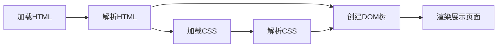
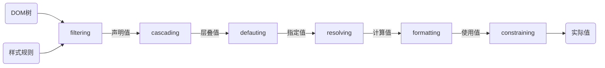
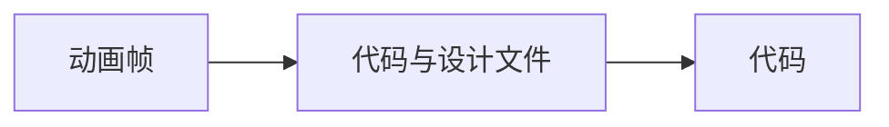
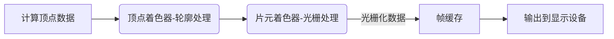
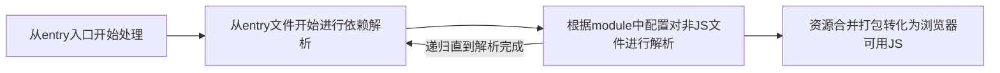

已经完成的部分

- Day02   如何写好JS - 月影
- Day04-2 前端动画实现 - 蒋翔
- Day08-1 TypeScript入门 - 林皇
- Day09-2 前端设计模式应用 - 吴立宁
- Day04-1 响应式系统与React - 牛岳
- Day06-2 Web开发的安全之旅 - 刘宇晨
- Day01-1 前端与HTML - 韩广军
- Day01-2 理解CSS - 韩广军
- Day01-3 深入CSS - 韩广军
- Day10-1 Web多媒体入门 - 刘立国 
- Day07   构建webpack知识体系 - 范文杰
- Day05-1 HTTP实用指南 - 杨超男
- Day03-2 前端调试知识 - 秃头披风侠
- Day06-1 初识WebGL - 月影
- Day05-2 Node.js与前端开发实战 - 欧阳亚东
- Day09-1 小程序技术全解 - 张晓伟
- Day08-2 小游戏开发 - ycaptain
- Day03-1 Web标准与前端开发 - 李松峰
- Day10-2 数据可视化基础 - 何菲菲

### Day0 字节笔试

- 不定项选择:JS基础, 事件冒泡等内容

- 编程题

  > 判断输入的字符串是不是4的整数幂

  标准解法当然是位运算, 我比较懒, 读取数字, 求`log(t)/log(4)`是不是整数, 其实应该用`algorithm`库中更快速的的`log_2()`, 无奈在牛客的代码提示中没找到这个函数

  > 输入一个字符串, 输出全排列

  标准解法当时是搜索/康托, 我比较懒, 直接调`std::next_permutation(begin, end)`


### Day1-1 前端与HTML - 韩广军

前端职责:图形界面下的人机交互问题

**前端技术栈**

- HTML:结构
- CSS:样式
- JS:交互
- http协议:传输

**前端需要关注问题**

- 美观
- 功能
- 无障碍(不只是对于残障人士, 还包括一些困难的场景, 例如: 在抖动的环境下按一个小按钮)
- 安全
- 兼容性
- 用户体验

**前端可以实现的功能**

- 服务端(Node.JS)
- 用户端(Election)
- 3D(webGL)
- 语音交互(webRTC)
- 代码执行(WebAssembly)

**HTML是什么**

- HyperText: 图片, 标签, 音视频
- Markup Language: 标签, 属性键值

**HTML语法**

- 不区分大小写(推荐小写)
- 空标签可以不闭合或者加`/`闭合(`<input>`,``)
- 属性值用双引号闭合
- 部分标签属性值可以省略(required, readonly...)

浏览器拿到HTML后会将嵌套关系转化为一个DOM树

#### HTML标签复习

- `<!doctype html>`: 指明HTML版本(不写的话浏览器按照老版本标准(兼容模式)执行)
- `<html>`根标签
- `<head>`存放元数据
- `<body>`需要呈现的内容
- 标题: `<h1/>`-`<h6/>`默认样式从大到小
- 列表: 
  - 有序列表
    ```html
    <ol>
      <li>1</li>
      <li>2</li>
      <li>3</li>
    </ol>
    ```
  - 无序列表
    ```html
    <ul>
      <li>1</li>
      <li>2</li>
      <li>3</li>
    </ul>
    ```
  - 定义列表(注意,支持多对多)
    ```html
    <dl>
      <dt>导演</dt>
      <dd>陈凯歌</dd>
      <dt>主演</dt>
      <dd>张国荣</dd>
      <dd>张丰毅</dd>
      <dt>出品</dt>
      <dt>宣发</dt>
      <dd>巩俐</dd>
    </dl>
    ```
    <dl>
      <dt>导演</dt>
      <dd>陈凯歌</dd>
      <dt>主演</dt>
      <dd>张国荣</dd>
      <dd>张丰毅</dd>
      <dt>出品</dt>
      <dt>宣发</dt>
      <dd>巩俐</dd>
    </dl>
- 链接:`<a href="" target="" />`最重要的两个属性是`href`与`target`
- 多媒体: `,<audio></auduio>,<video></video>`
  - alt: 不被加载的时候的替换内容(不被加载的情况包括: 加载失败, 用户开启省流模式)
  - 音视频自动播放属性: 
    - autoplay: 如果用户之前访问过这个域名, 还手动播放该域名下的视频过才会自动播放
    - controls: 规定浏览器应该为视频提供播放控件
    - muted: 静音播放
  - 音视频自动播放属性: 
    - 视频静音(通过加上 muted 属性)或音量设置为 0
    - 用户与网站进行了交互(通过点击, 敲击, 按键等)
    - 站点已被列入浏览器白名单;
    - 浏览器确定用户频繁使用媒体, 自动加入白名单或者通过首选项或其他用户界面功能手动发生
    - 自动播放功能策略授予了`<iframe>`及其文档自动播放支持. 
    - 用户已将该站点添加到其移动设备的主屏幕或在桌面设备上安装了 PWA. 
- 输入: 
  - `<input placeholder="" type=""/>`
    - `type="range"`<input placeholder="" type="range"/>
    - `type= "number"`<input placeholder="" type="number"/>
    - `type= "date"`<input placeholder="" type="date"/>
    - `type= "checkbox"`<input placeholder="" type="checkbox"/> 通过name进行分组互斥, 通过`<label for="">`打标记
    - `type= "radio"`<input placeholder="" type="radio"/> 通过name进行分组互斥, 通过`<label for="">`打标记
    - `type= "select"`下拉框
      <select>
          <option>Apple</option>
          <option>Orange</option>
          <option>Pineapple</option>
          <option>Banana</option>
      </select>
      ```html
      <select>
          <option>Apple</option>
          <option>Orange</option>
          <option>Pineapple</option>
          <option>Banana</option>
      </select>
      ```
  - 可选下拉列表输入框(可以选择,也可以随便输入内容,如果输入的是选项的前缀会自动跳出提示)
    <input list="ice-cream-flavors" id="ice-cream-choice" name="ice-cream-choice" />

    <datalist id="ice-cream-flavors">
        <option value="Chocolate">
        <option value="Coconut">
        <option value="Mint">
        <option value="Strawberry">
        <option value="Vanilla">
    </datalist>

    ```html
    <input list="ice-cream-flavors" id="ice-cream-choice" name="ice-cream-choice" />
    
    <datalist id="ice-cream-flavors">
        <option value="Chocolate">
        <option value="Coconut">
        <option value="Mint">
        <option value="Strawberry">
        <option value="Vanilla">
    </datalist>
    ```
  - 多行输入框: `<textarea></textarea>`<textarea></textarea>

- 文本标签
  - 引用
    - 块级别引用: `<blockquote cite=""></blockquote>`
    - 短引用: `<cite></cite>`(一般写一些作品名)
    - 引用之前页面中的内容`<q></q>`
  - 代码
    - 单行代码`<code></code>`
    - 多行代码`<pre><code></code></pre>`
  - 强调
    - `<strong></strong>`表示语意上重要 紧急
    - `<em></em>`语气上的重读
- 版块划分
  - 页头
    - header
    - nav
  - 主体
    - main
  - 与内容相关但不属于主体内容的(信息推荐, 广告): aside
  - 页尾: `<footer></footer>`

#### 语义化的作用:

- 开发者:方便修改与维护
- 浏览器:展示页面
- 搜索引擎:提取关键词, 排序
- 屏幕阅读器


#### 跨域问题

`<script>`, `<a>`是完全支持跨域的, 在Chrome97中https页面不能跨域引用来自http页面的图片等资源

#### 自定义标签

[webComponment](https://developer.mozilla.org/zh-CN/docs/Web/Web_Components)是一套不同的技术, 允许您创建可重用的定制元素(它们的功能封装在您的代码之外)并且在您的web应用中使用它们. 

- 目的: 实现复杂HTML组件的复用
- 技术组成: 
  - Custom elements(自定义元素)
  - Shadow DOM(影子DOM)
  - HTML templates(HTML模板)

[**shadow DOM**](https://developer.mozilla.org/zh-CN/docs/Web/Web_Components/Using_shadow_DOM)

shadow DOM允许在文档流中创建一些**完全独立于其他DOM的子DOM树**(不会使用页面的JS/CSS, 在DevTools中现实的也是#shadowDOM字样). 于是我们可以封装一个具有独立功能的组件, 并完全不会干扰其他DOM与被其他DOM干扰. 在shadow DOM内部我们可以定义元素的样式与行为

有这样的术语

- Shadow host: Shadow DOM挂载到的DOM节点. 
- Shadow tree: Shadow DOM内部的DOM树. 
- Shadow boundary: Shadow DOM结束的地方, 也是常规 DOM开始的地方. 
- Shadow root: Shadow tree的根节点. 

方法

- `Element.attachShadow()`: 将一个 shadow root 附加到任何一个元素上. 它接受一个配置对象`{mode: 'open'|'closed'}`分别表示这个DOM是否可以被页面的JS抓取

[**HTML templates&slots**](https://developer.mozilla.org/zh-CN/docs/Web/Web_Components/Using_templates_and_slots)

类似于响应式框架中的模板, 开发者通过模板来复用一些 HTML 代码段, 在 HTML5 标准下我们甚至不需要 javascript 框架就能轻松使用模板. 

```html
<template id="my-paragraph">
  <p>My paragraph</p>
</template>
```

在模板中创建 HTML 代码块和子 DOM 树, 使得我们可以用不同的物理文件来组织代码. 通过`<link>`标签来引入这些文件, link到的数据并不会展示到DOM, 需要手动添加

```html
<head>
    <link rel="import" href="components/some.html" />
</head>
<body>
    <!--some DOM-->
    <my-paragraph id="my-paragraph"></my-paragraph>
    <!--some DOM-->
</body>
```

还可以通过`slots`增加灵活性: 也有默认插槽, 具名插槽等. 见[MDN](https://developer.mozilla.org/zh-CN/docs/Web/Web_Components/Using_templates_and_slots#%E4%BD%BF%E7%94%A8%E6%A7%BDslots_%E6%B7%BB%E5%8A%A0%E7%81%B5%E6%B4%BB%E5%BA%A6)

[**Custom elements**](https://ruanyifeng.com/blog/2017/06/custom-elements.html)

我们声明一个语义化的自定义元素来引用组件, 用 javascript 建立自定义元素和模板, shadow DOM 之间的关联, 然后将自定义标签插入到页面上就能得到一个封装好的组件. 

> "自定义元素的名字必须包含一个破折号(`-`)所以`<x-tags>`, `<my-element>`和`<my-awesome-app>`都是正确的名字, 而`<tabs>`和`<foo_bar>`是不正确的. 这样的限制使得 HTML 解析器可以分辨那些是标准元素, 哪些是自定义元素. "

浏览器提供了两种类型对象`HTMLUnknownElement`和`HTMLElement`

- HTML标准元素在浏览器中会被解析为`HTMLElement`实例
- 用户没有声明的自定义元素会被解析为`HTMLUnknownElement`
- 一旦自定义元素中使用了破折号此时自定义元素就变为了`HTMLElement`

使用

 ```javascript
 // 定义一个 <my-element></my-element>
 class MyElement extends HTMLElement {...}
 window.customElements.define('my-element', MyElement);
 ```

上面代码中, 原生的`window.customElements`对象的`define`方法用来定义 Custom Element. 该方法接受两个参数, 第一个参数是自定义元素的名字, 第二个参数是一个 ES6 的`class`. 

这个`class`使用`get`和`set`方法定义 Custom Element 的某个属性. 

 ```javascript
 class MyElement extends HTMLElement {
   get content() {
     return this.getAttribute('content');
   }
 
   set content(val) {
     this.setAttribute('content', val);
   }
 }
 ```

有了这个定义, 网页之中就可以插入`<my-element>`了. 

 ```markdown
 <my-element content="Custom Element">
   Hello
 </my-element>
 ```

#### 使用div代替button

可以这么代替, 但是不仅要复刻样式, 还要加入属性`role="button"`方便浏览器赋予聚焦等属性与无障碍优化([Aria](https://developer.mozilla.org/zh-CN/docs/Web/Accessibility/ARIA),[Roles](https://developer.mozilla.org/zh-CN/docs/Web/Accessibility/ARIA/Roles/button_role))

#### HTML5离线工作

- 前端缓存方案: `localStorage`, `sessionStorage`
- 使用[Service Worker](https://developer.mozilla.org/zh-CN/docs/Web/API/Service_Worker_API)进行离线后行为管理与通信

Service workers 本质上充当 Web 应用程序, 浏览器与网络(可用时)之间的代理服务器. 这个 API 旨在创建有效的离线体验, 它会拦截网络请求并根据网络是否可用来采取适当的动作, 更新来自服务器的的资源. 它还提供入口以推送通知和访问后台同步 API.  Service workers 是基于 HTTPS 的, 因为Service Worker中涉及到请求拦截, 所以必须使用HTTPS协议来保障安全. 

Service workers生命周期

- 注册: 要使用Service Worker, 首先需要注册一个sw, 通知浏览器为该页面分配一块内存, 然后sw就会进入安装阶段. 

  ```js
  (function() {
      if('serviceWorker' in navigator) {
          navigator.serviceWorker.register('./sw.js');
      }
  })()
  
  // 只针对部分页面进行注册
  navigator.serviceWorker.register('/topics/sw.js');
  // 另一种作用域限定
  navigator.serviceWorker.register('sw.js', { scope: './' });
  ```

- 安装: sw开始缓存文件了, 检查所有文件的缓存状态, 如果都已经缓存了, 则安装成功, 进入下一阶段. 

- 激活: 如果是第一次加载sw, 在安装后, 会直接进入activated阶段, 而如果sw进行更新, 情况就会显得复杂一些(新版本安装, 老版本工作 - 新版本开始waiting, 等待老版本terminated - 新版本替换)

- 空闲: 空闲状态一般是不可见的, 这种一般说明sw的事情都处理完毕了,然后处于闲置状态了,浏览器会周期性的轮询, 去释放处于idle的sw占用的资源

- 终止: 终止状态一般触发条件由下面几种方式

  1. 关闭浏览器一段时间
  2. 手动清除serviceworker
  3. 在sw安装时直接跳过waiting阶段

  ```javascript
  self.addEventListener('install', function(event) {
      //跳过等待过程
      self.skipWaiting();
  });
  ```

- 拦截: sw最终要和关键阶段,主要用于拦截代理所有指定的请求,然后进行二次相应的处理操作

### Day1-2 理解CSS - 韩广军

**CSS**: Cascading Style Sheets 层叠样式表, 用来定义页面元素的样式

**使用CSS的三种方法**: 外链,嵌入,内联(组件式开发看起来是新的模式)

#### CSS的加载过程



#### 选择器复习

- 通配选择器`*`
- 标签选择器`tagName`
- id选择器`#id`
- 类选择器`.class`
- 属性选择器
  - 没有值只有键`[disabled]`
  - 完全匹配值`[type="pwd"]`
  - 开头`[type^="pwd"]`
  - 结尾`[type$="pwd"]`
- 伪类选择器
  - 状态伪类:a有LVHA,在按下后有:force状态(LVFHA)
  - 结构伪类:first-child...
- 选择器组合
  - `AB`同时满足AB
  - `A B`选择`B`如果`B`是`A`的子孙
  - `A>B`选择`B`如果`B`是`A`的子元素
  - `A~B`选择`B`如果`B`在`A`后且与`A`同级
  - `A+B`选择`B`如果他紧随在`A`后面

#### 颜色表示复习

- RGB: 三原色混合, RGB值的变化不能直观表示颜色的变化, 不方面操作颜色
- HSL: 更加直观方便操作
  - Hue: 色相, 表示颜色基本属性, 值为0-360表示色环上的色值
  - Saturation: 饱和度, 表示颜色的鲜艳程度, 值为0-100%, 越高越鲜艳, 越低越灰
  - Lightness: 亮度, 值为0-100%, 越高越白越低越灰(例如想要让btn变灰只需要调低L)
- alpha透明度: 可以与rgb/hsl组成rgba/hsla, 值为0-1/映射到0-255后转Hex

#### 字体使用复习

`font-family`: 指定使用的字体组合, 由于浏览器使用字体基于用户安装, 所以要多指定几组, 并且在最后使用字体类型兜底, 例如`font-family:'Segoe UI', Tahoma, sans-serif`

**字体类型**

- serif: 衬线字体, 在字末尾有一定装饰(Georgia, 宋体)
- sans-serif: 无衬线字体, 线条单一, 末尾没有装饰(Arial, Helvetica, 黑体)
- cursive: 手写体(Caflisch Script, 楷体)
- fantasy: 艺术体
- monosapce: 等宽字体(Consolas, Courier, 中文字体)

在使用`font-family`的时候注意  

- 一般在font-family最后指定一个字体类型兜底
- 先英文后中文, 原因是浏览器在渲染字符的时候会逐字符比对使用的字体, 一般中文字体中就包含了英文字体, 如果中文在前, 为英文字体准备的字体就不会匹配了

**使用自定义字体**

```html
<style>
  @font-face {
    font-family: f1;
    src: url("//s2.ssl.qhimg.com/static/ff00cb8151eeecd2.woff2") format("woff2");
  }
</style>

<h1 style="font-family: f1, serif">落霞与孤鹜齐飞, 秋水共长天一色. </h1>
```

对于英文字符这这种方法可以快速引入字体, 但是对于中文字符来说, 中文字体包太大了, 一般需要裁剪字体包获得需要的字符

**字体样式**

- `font-size`: 设置字体大小  
  - 关键字: small medium large
  - 长度单位: px em
  - 百分数: 相对于父元素字体大小
- `font-style`: 设置字体风格  
  - `normal`: 正常
  - `italic`: 斜体
  - `oblique`: 倾斜
- `font-weight`: 设置字重  
  - 关键字: normal, bold...
  - 数值: 100-900(400=normal,700=bold), 如果系统中找不到字体则会就近替换
- `line-height`: 设置行高(baseline之间的距离)
- `font`: 字体设置简写([斜体] 粗细 大小[/行高] [字体族])

**段落属性**

- `text-align`: 对齐方式 left|center|right|justify(分散对齐, 且仅对非最后一行有效, 如果文字只有一行那也不生效)
- `letter-spacing: Xpx` 字符之间的距离
- `word-spacing: Xpx` 字符之间的距离
- `text-indent: Xpx` 首行缩进(支持负数)
- `text-decoration: underline|line-through|overline|none` 下划线, 删除线, 上划线, 无
- `white-space`: normal(默认)|nowrap(不换行)|pre(保留所有换行与空格)|pre-wrap(保留空格, 会换行)|pre-wrap(合并空格, 保留换行)

#### 原子化CSS(Windi CSS)

> 原子化 CSS 是一种 CSS 的架构方式, 它倾向于小巧且用途单一的 class, 并且会以视觉效果进行命名

CSS原子化是一种写法, 其特点就是一个类名对应一个样式, 从而通过在标签上附加不同的类名来生成对应的效果, 可以有效的减少CSS的相关代码, 例如

```css
.flex {
    display: flex;
}
```

**坏处**

1. 需要定制一大堆工具类, 这些使用的话需要开发人员的熟悉. 
2. 虽然减少了CSS的代码, 但是使得HTML的代码变得更臃肿了. 
3. CSS 规则插入顺序仍然很重要. 

**好处**

1. 写法真的变简单了, 比如添加一个常用的规则时, 直接就加原子类
2. 原子类是全局的, 所以当我们移动一段标签到其他页面时, 样式也就是有的
3. 当我们使用原子类的时候, 我们修改页面的样式时往往不会再去修改`CSS`代码了, 而是直接修改原子类名

**框架**: `tailwindcss`

> Tailwind CSS 是一个功能类优先的 CSS 框架, 它集成了诸如 `flex`, `pt-4`, `text-center` 和 `rotate-90` 这样的的类, 它们能直接在脚本标记语言中组合起来, 构建出任何设计. 

是不是就是CSS原子类的写法了？当然, `tailwindcss`不止于此, 它还有很多强大的功能和配置

[参考](https://zhuanlan.zhihu.com/p/425814828)

#### 优雅降级与渐进增强

CSS构建的两种观点

- "优雅降级"观点  
  "优雅降级"观点认为应该针对那些最高级, 最完善的浏览器来设计网站. 而将那些被认为"过时"或有功能缺失的浏览器下的测试工作安排在开发周期的最后阶段, 并把测试对象限定为主流浏览器(如 IE, Mozilla 等)的前一个版本. 在这种设计范例下, 旧版的浏览器被认为仅能提供"简陋却无妨 (poor, but passable)" 的浏览体验. 你可以做一些小的调整来适应某个特定的浏览器. 但由于它们并非我们所关注的焦点, 因此除了修复较大的错误之外, 其它的差异将被直接忽略. 
- "渐进增强"观点  
  "渐进增强"观点则认为应关注于内容本身. 内容是我们建立网站的诱因. 有的网站展示它, 有的则收集它, 有的寻求, 有的操作, 还有的网站甚至会包含以上的种种, 但相同点是它们全都涉及到内容. 这使得"渐进增强"成为一种更为合理的设计范例. 这也是它立即被 Yahoo! 所采纳并用以构建其"分级式浏览器支持 (Graded Browser Support)"策略的原因所在. 

```css
.transition { /*渐进增强写法*/
  -webkit-transition: all .5s;
     -moz-transition: all .5s;
       -o-transition: all .5s;
          transition: all .5s;
}
.transition { /*优雅降级写法*/
          transition: all .5s;
       -o-transition: all .5s;
     -moz-transition: all .5s;
  -webkit-transition: all .5s;
}
```

#### CSSinJS

CSS默认是全局生效的, 可以使用CSS in JS, scoped等方案实现, CSS in JS是一种CSS工程化方案

传统CSS问题

- **全局污染** - CSS的选择器是全局生效的, 所以在class名称比较简单时, 容易引起全局选择器冲突, 导致样式互相影响. 
- **命名混乱** - 因为怕全局污染, 所以日常起class名称时会尽量加长, 这样不容易重复, 但当项目由多人维护时, 很容易导致命名风格不统一. 
- **样式重用困难** - 有时虽然知道项目上已有一些相似的样式, 但因为怕互相影响, 不敢重用. 
- **代码冗余** - 由于样式重用的困难性等问题, 导致代码冗余. 

为解决问题而提出的规范

- **SASS, LESS** - 提供了变量, 简单函数, 运算, 继承等, 扩展性, 重用性都有了很大的提升, 解决了一些样式重用冗余的问题, 但是对于命名混乱问题的效果不大. 
- **BEM (.block__element--modifier)** - 比较流行的class命名规则, 部分解决了命名混乱和全局污染的问题, 但class定义起来还是不太方便, 比较冗长, 而且和第三方库的命名还是有可能冲突. 
- **CSS Modules** - 模块化CSS, 将CSS文件`import`到JavaScript里并声明为字符串, 在使用的时候拼串导出. 基本上解决了全局污染, 命名混乱, 样式重用和冗余的问题, 但CSS有嵌套结构的限制(只能一层), 也无法方便的在CSS和JavaScript之间共享变量. 

CSS in JS就是将应用的CSS样式写在JavaScript文件里面, 可以利用标签的`style`拼串, 也可以利用`ele.style`实现

[见此](http://ruanyifeng.com/blog/2017/04/css_in_js.html)

#### 一些不知道的伪元素

- `::first-letter`: 首字母
- `::first-line`: 首行
- `::cue (:cue)`: 用于选中VTT视频中的怪东西
- `::selection`: 选中被用户高亮的/选中的内容
- `::slotted()`: 选中HTML模板元素

见[MDN](https://developer.mozilla.org/zh-CN/docs/Web/CSS/Pseudo-elements)

### Day1-3 深入CSS - 韩广军

CSS选择器的特异程度: `ID选择器数目_(伪)类选择器数目_标签选择器数目`拼串

#### 继承

部分属性可以自动继承其来自父元素的计算值, 除非显式指定

- 可以继承的样式: 与文字相关的
- 不可以继承的属性: 宽度, 高度, 盒子模型, 尺寸相关, **对于不可继承的属性可以通过`key:inherit`**继承
- 如果元素想要继承的值父元素们都没有, 那么其会自动使用默认值. **可以使用`key:initial`显式使用默认值**
- 还可以使用`key:unset`, 若该CSS属性可继承, 则从父级继承对应属性值, 若该CSS性不可继承, 则将其重置为初始值

#### CSS的求值过程



1. filtering: 找到可以匹配到元素的规则
2. cascading: 根据选择器特异性找到优先级最高的属性值
3. defauting: 对于没有匹配到的属性值, 要么继承父类, 要么使用默认值
4. resolving: 将相对值(red, rm)转化为浏览器下的值(#f00, px), 这一部分不转换需要部署才知道的值(`em`可以转为`px`, `width:60%`需要布局后才知道是多少, 在这一步不转化), **此处得到的结果叫计算值, 子元素样式为inherit的时候就是参考了父元素的计算值**
5. formatting: 将相对值进一步转化(例如`width:60%`)
6. constraining: 将小数像素转化为整数像素, 并根据特殊规则进行调整(`min-width`, chrome中的`font-size:10px`会转化为`12px`)最终应用在页面上

#### 布局

**布局相关技术**

- 常规流(文档流)  
  - 行级
  - 块级
  - 表格布局
  - FlexBox
  - Grid布局
- 浮动
- 绝对定位

**盒子模型**

当padding设置为百分比的时候padding参考的是父元素的**宽度**

据此实现一个1:1的盒子

```html
<style>
  .wap{
    width: 200px;
    height: 300px;
    background-color: #bfa;
  }
  .cont{
    width: 100%;
    height: 0;
    padding-bottom: 100%;
    background-color: red;
  }
</style>

<body>
  <div class="wap">
    <div class="cont"></div>
  </div>
</body>
```

当margin设置为百分比的时候padding参考的是父元素的**宽度**

垂直方向margin会合并折叠

**块级元素与行内元素**

- 块级元素不能并排摆放, 适用所有盒模型
- 行内元素可以与其他行内元素拜访, 但是盒模型width, height不适用
- inline-block本身是行内元素, 但是被放在了盒子中, 适用盒模型width, height

**Flex Box**

- `flex-dirextion: row|row-reverse|column|column-reverse`: 摆放流向
- `justify-content: flex-start|flex-end|center|space-between|space-around|space-evenly`: 主轴对齐方式
- `align-items: flex-start|flex-end|center|stretch|baseline`侧轴对齐
- `align-self`: 为特定元素设置侧轴对齐方式
- `order`: 手动指定顺序
- `flex-grow`: 当容器有剩余空间的时候的伸展能力
- `flex-shrink`: 当容器剩余空间不足的时候的压缩能力(**默认是1**)
- `flex-base`: 容器的自然长度
- `flex`: 缩写  
  - 单值语法: 值必须为以下其中之一:  
    - 一个无单位数(`<number>`): 它会被当作flex:`<number>` 1 0; `<flex-shrink>`的值被假定为1, 然后`<flex-basis>` 的值被假定为0. 
    - 一个有效的宽度(width)值: 它会被当作 `<flex-basis>`的值.  
    - 关键字none, auto或initial.
  - 双值语法: 第一个值必须为一个无单位数, 并且它会被当作 `<flex-grow>` 的值. 第二个值必须为以下之一:  
    - 一个无单位数:它会被当作 `<flex-shrink>` 的值. 
    - 一个有效的宽度值: 它会被当作 `<flex-basis>` 的值. 
  - 三值语法:
    - 第一个值必须为一个无单位数, 并且它会被当作 `<flex-grow>` 的值. 
    - 第二个值必须为一个无单位数, 并且它会被当作  `<flex-shrink>` 的值. 
    - 第三个值必须为一个有效的宽度值, 并且它会被当作 `<flex-basis>` 的值. 
  ```css
  /* 一个值, 无单位数字: flex-grow */
  flex: 2;
  
  /* 一个值, width/height: flex-basis */
  flex: 10em;
  flex: 30px;
  flex: min-content;
  
  /* 两个值: flex-grow | flex-basis */
  flex: 1 30px;
  
  /* 两个值: flex-grow | flex-shrink */
  flex: 2 2;
  
  /* 三个值: flex-grow | flex-shrink | flex-basis */
  flex: 2 2 10%;
  
  /*全局属性值 */
  flex: inherit;
  flex: initial;
  flex: unset;
  ```

**Grid 布局**

- 使用`display: grid`创建网格容器
- 使用`grid-template-X`: 将容器划分为网格
- 设置每一个子元素占用那些行列
- 使用`grid-area: X/X/X/X`或`grid-column/row-start/end`指定元素所占位置, 允许重叠

**Float 布局**

本质是做图文环绕的, 在没有先进布局的时候还用来做各种布局, 现在已经不需要float做布局了, 除了图文环绕, 其他不需要用float做

**Position**

- `static`: 默认
- `relative`: 相对元素本身定位
- `absolute`: 相对非`static`祖先定位
- `fixed`: 相对于视口定位

###  Day2 如何写好JS - 月影


#### 原则-各司其责

我们希望让HTML, CSS, JS分别去控制结构, 表现, 功能. 各司其职并不是让他们物理上分类(写成三个文件), 而是让他们功能上分离(要不然现在组件化开发岂不是完全违反了原则), 例如不要让JS去直接操作CSS样式

举例: 请实现一个静态页面的深夜模式

- 最基础的版本

    ```html
    <header>
        <button id="modeBtn">🌞</button>
        <h1>深夜食堂</h1>
    </header>
    ```

    ```js
    const btn = document.getElementById('modeBtn');
    btn.addEventListener('click', (e) => {
      const body = document.body;
      if(e.target.innerHTML === '🌞') {
        body.style.backgroundColor = 'black';
        body.style.color = 'white';
        e.target.innerHTML = '🌜';
      } else {
        body.style.backgroundColor = 'white';
        body.style.color = 'black';
        e.target.innerHTML = '🌞';
      }
    });
    ```

    有问题: 通过文字判断状态, 使用JS直接操作了一个CSS样式

- 改一改

    ```css
    body.night {
      background-color: black;
      color: white;
      transition: all 1s;
    }
    
    #modeBtn::after {
      content: '🌞';
    }
    body.night #modeBtn::after {
      content: '🌜';
    }
    ```

    ```js
    const btn = document.getElementById('modeBtn');
    btn.addEventListener('click', (e) => {
      const body = document.body;
      if(body.className !== 'night') {
        body.className = 'night';
      } else {
        body.className = '';
      }
    });
    ```

    定义了该`night`样式, 不用通过文字判断状态了. 要是让我写我最多改成`classList.toggle()`

- 回头想想: 我们在做什么事情? 我们在做一个**纯视觉效果展示**, 样式应该是CSS控制的! JS是控制行为的, 我们可以尝试纯CSS+HTML实现

    ```html
    <input id="modeCheckBox" type="checkbox">
    <div class="content">
    	<header>
    		<label id="modeBtn" for="modeCheckBox"></label>
    		<h1>深夜食堂</h1>
    	</header>
    </div>
    ```

    ```css
    #modeCheckBox {
      display: none;
    }
    
    #modeCheckBox:checked + .content {
      background-color: black;
      color: white;
      transition: all 1s;
    }
    
    #modeBtn {
      font-size: 2rem;
      float: right;
    }
    
    #modeBtn::after {
      content: '🌞';
    }
    
    #modeCheckBox:checked + .content #modeBtn::after {
      content: '🌜';
    }
    ```

    直接使用`checkbox`用于点击, 通过选择`checkbox`的`checked`伪类来定义夜间模式

    要是之和我这么一说, 我估计要这么写

    ```diff
    - <input id="modeCheckBox" type="checkbox">
    <div class="content">
    	<header>
    +	    <input id="modeCheckBox" type="checkbox">
    	    <label id="modeBtn" for="modeCheckBox"></label>
    		<h1>深夜食堂</h1>
    	</header>
    </div>
    ```

    ```diff
    #modeCheckBox {
    - display: none;
    + outline: none;
    + width: 0;
    + height: 0;
    }
    
    // ...
    ```

    很自然的, 我把`input`与`label`放一起了, 然后把在关掉`checkbox`的样式, 但是这不符合语义化要求啊!!!, 回头想想, 为啥要专门有个`label`标签呢? 为的是让他们永远在一起吗? 当然是可以让这两个标签分开啊

    人家还可以把这个`checkbox`给删掉, 太他妈牛了. 这才是语义化, **样式与表现各司其职**

我们学到了

- 什么是HTML, CSS, JS各司其职
- 不要让JS直接干预Style
- 用class表示状态
- 对于样式的展示尽量寻求零JS方案

#### 原则-组件封装


我们希望从Web页面中抽象出一个一个包含HTML, CSS, JS的组件出来, 使得组件具备良好的封装性, 正确性, 可扩展性, 复用性. 我们将通过封装一个轮播图组件来了解组件封装的过程


1. 结构设计: 

   轮播图显然是一个列表结构, 使用`ul`即可

2. 样式设计:

   使用CSS绝对定位将图片重叠在一起, 使用修饰符定义active元素, 使用transition切换动画

3. 行为设计-API设计(功能设计):

   应该保证API是: 原子操作, 职责单一, 满足灵活性
   
   我们设计一个`Slide`类
   
    ```js
    class Slider{
      constructor(id){			
        this.container = document.getElementById(id);
        this.items = this.container
        .querySelectorAll('.slider-list__item, .slider-list__item--selected');
      }
      getSelectedItem(){		// 活动元素
        const selected = this.container
          .querySelector('.slider-list__item--selected');
        return selected
      }
      getSelectedItemIndex(){	// 活动元素index
        return Array.from(this.items).indexOf(this.getSelectedItem());
      }
      slideTo(idx){				// 滚到
        const selected = this.getSelectedItem();
        if(selected){ 
          selected.className = 'slider-list__item';
        }
        const item = this.items[idx];
        if(item){
          item.className = 'slider-list__item--selected';
        }
      }
      slideNext(){				// 下一个
        const currentIdx = this.getSelectedItemIndex();
        const nextIdx = (currentIdx + 1) % this.items.length;
        this.slideTo(nextIdx);
      }
      slidePrevious(){			// 上一个
        const currentIdx = this.getSelectedItemIndex();
        const previousIdx = (this.items.length + currentIdx - 1)
          % this.items.length;
        this.slideTo(previousIdx);  
      }
    }
    
    const slider = new Slider('my-slider');
    slider.slideTo(3);
    ```

4. 行为设计-控制流

   组件应该是在DOM上可控制的(总不能让用户输入`slider.slideNext`切换吧), 我们需要完成DOM状态与API行为的耦合

   我们可以通过自定义事件进行解耦(尽量让DOM状态的改变与我们的代码之间独立)

   为`Slide`类加入`start`与`stop`实现控制, 在构造函数中加入控制器的时间绑定

   ```js
   class Slider{
       
     constructor(id, cycle = 3000){
       this.container = document.getElementById(id);
       this.items = this.container.querySelectorAll('.slider-list__item, .slider-list__item--selected');
       this.cycle = cycle;
   
       const controller = this.container.querySelector('.slide-list__control');
       if(controller){
         const buttons = controller.querySelectorAll('.slide-list__control-buttons, .slide-list__control-buttons--selected');
         controller.addEventListener('mouseover', evt=>{
           const idx = Array.from(buttons).indexOf(evt.target);
           if(idx >= 0){
             this.slideTo(idx);
             this.stop();
           }
         });
         
         controller.addEventListener('mouseout', evt=>{
           this.start();
         });
         
         this.container.addEventListener('slide', evt => {
           const idx = evt.detail.index
           const selected = controller.querySelector('.slide-list__control-buttons--selected');
           if(selected) selected.className = 'slide-list__control-buttons';
           buttons[idx].className = 'slide-list__control-buttons--selected';
         })
       }
       
       const previous = this.container.querySelector('.slide-list__previous');
       if(previous){
         previous.addEventListener('click', evt => {
           this.stop();
           this.slidePrevious();
           this.start();
           evt.preventDefault();
         });
       }
       
       const next = this.container.querySelector('.slide-list__next');
       if(next){
         next.addEventListener('click', evt => {
           this.stop();
           this.slideNext();
           this.start();
           evt.preventDefault();
         });
       }
     }
       
     getSelectedItem(){/*...*/}
     getSelectedItemIndex(){/*...*/}
     slideNext(){/*...*/}
     slidePrevious(){/*...*/}
     
     start(){
       this.stop();
       this._timer = setInterval(()=>this.slideNext(), this.cycle);
     }
     stop(){
       clearInterval(this._timer);
     }
   }
   
   const slider = new Slider('my-slider');
   slider.start();
   ```

5. 组件的改进

   轮播图已经实现, 但是不具备很好的扩展性与复用性. 我们希望模块进行改进

   - 插件化-解耦

     从第三四步我们知道模块设计应该考虑API与控制流两个部分, API主要考虑的是模块的功能, 而控制流主要考虑的是模块的状态控制与展示交互, 在上面的代码中这两部分是紧耦合的(都在构造函数里面). 我们希望

     - 控制器(例如轮播图的下一页按钮)部分抽离出来, 做成一个插件
     - 插件与组件之间通过依赖注入的方式建立联系

     ```js
     class Slider{
       
       constructor(id, cycle = 3000){
         this.container = document.getElementById(id);
         this.items = this.container.querySelectorAll('.slider-list__item, .slider-list__item--selected');
         this.cycle = cycle;
       }
         
       registerPlugins(...plugins){
         plugins.forEach(plugin => plugin(this));
       }
         
       addEventListener(type, handler){
         this.container.addEventListener(type, handler)
       }
         
       getSelectedItem(){}
       getSelectedItemIndex(){}
       slideTo(idx){}
       slideNext(){}
       slidePrevious(){}
       start(){}
       stop(){} 
     }
     
     function pluginController(slider){
       const controller = slider.container.querySelector('.slide-list__control');
       if(controller){
         const buttons = controller.querySelectorAll('.slide-list__control-buttons, .slide-list__control-buttons--selected');
         controller.addEventListener('mouseover', evt=>{
           const idx = Array.from(buttons).indexOf(evt.target);
           if(idx >= 0){
             slider.slideTo(idx);
             slider.stop();
           }
         });
     
         controller.addEventListener('mouseout', evt=>{
           slider.start();
         });
     
         slider.addEventListener('slide', evt => {
           const idx = evt.detail.index
           const selected = controller.querySelector('.slide-list__control-buttons--selected');
           if(selected) selected.className = 'slide-list__control-buttons';
           buttons[idx].className = 'slide-list__control-buttons--selected';
         });
       }  
     }
     
     function pluginPrevious(slider){
       const previous = slider.container.querySelector('.slide-list__previous');
       if(previous){
         previous.addEventListener('click', evt => {
           slider.stop();
           slider.slidePrevious();
           slider.start();
           evt.preventDefault();
         });
       }  
     }
     
     function pluginNext(slider){
       const next = slider.container.querySelector('.slide-list__next');
       if(next){
         next.addEventListener('click', evt => {
           slider.stop();
           slider.slideNext();
           slider.start();
           evt.preventDefault();
         });
       }  
     }
     
     
     const slider = new Slider('my-slider');
     slider.registerPlugins(pluginController, pluginPrevious, pluginNext);
     slider.start();
     ```

     **插件实际上就是一个个函数, 我们让组件暴露一个注册插件的API, 在内部将组件传入插件函数, 我们在插件中获取控制器, 并将绑定控制器行为到组件API**

   - 模板化

     实现插件化之后我们只需要修改组件引入的插件就可以实现功能的扩展, 但是还有问题

     - 在实际操作的时候我们可能还需要对对应的HTML样式进行修改(例如我们不想要下一张图按键的时候就需要删除那个按钮的HTML与下一张图的插件),
     - 数据不够抽象, 我们的图片是通过HTML加载的, 如果有一天我们想换图片了, 我们就要该HTML
     -  **我们想将HTML模板化, 可以为每个组件与插件实现一个render渲染函数**

     对于轮播图, 我考虑: 组件的render方法实现图片结构的加载, 插件的render方法实现对应控制按钮的加载

     ```html
     <div id="my-slider" class="slider-list"></div>
     ```

     ````js
     class Slider {
       constructor(id, opts = { images: [], cycle: 3000 }) {
         this.container = document.getElementById(id);
         this.options = opts;
         this.container.innerHTML = this.render();
         this.items = this.container.querySelectorAll(
           '.slider-list__item, .slider-list__item--selected'
         );
         this.cycle = opts.cycle || 3000;
         this.slideTo(0);
       }
     
       // 组件的render
       render() {
         const images = this.options.images;
         const content = images.map((image) =>
           `
           <li class="slider-list__item">
             
           </li>    
         `.trim()
         );
     
         return `<ul>${content.join('')}</ul>`;
       }
     
       registerPlugins(...plugins) {
         plugins.forEach((plugin) => {
           // 创建控制器
           const pluginContainer = document.createElement('div');
           pluginContainer.className = '.slider-list__plugin';
           pluginContainer.innerHTML = plugin.render(this.options.images);
           // 插入控制器
           this.container.appendChild(pluginContainer);
           // 绑定控制器行为
           plugin.action(this);
         });
       }
     
       getSelectedItem() {
         /*...*/
       }
       getSelectedItemIndex() {
         /*...*/
       }
       slideTo(idx) {
         /*...*/
       }
       slideNext() {
         /*...*/
       }
       slidePrevious() {
         /*...*/
       }
       addEventListener(type, handler) {
         /*...*/
       }
       start() {
         /*...*/
       }
       stop() {
         /*...*/
       }
     }
     
     const pluginController = {
       // 渲染器返回模板
       render(images) {
         return `
           <div class="slide-list__control">
             ${images
               .map(
                 (image, i) => `
                 <span class="slide-list__control-buttons${
                   i === 0 ? '--selected' : ''
                 }"></span>
              `
               )
               .join('')}
           </div>    
         `.trim();
       },
       // 绑定行为
       action(slider) {
         const controller = slider.container.querySelector('.slide-list__control');
     
         if (controller) {
           const buttons = controller.querySelectorAll(
             '.slide-list__control-buttons, .slide-list__control-buttons--selected'
           );
           controller.addEventListener('mouseover', (evt) => {
             const idx = Array.from(buttons).indexOf(evt.target);
             if (idx >= 0) {
               slider.slideTo(idx);
               slider.stop();
             }
           });
     
           controller.addEventListener('mouseout', (evt) => {
             slider.start();
           });
     
           slider.addEventListener('slide', (evt) => {
             const idx = evt.detail.index;
             const selected = controller.querySelector(
               '.slide-list__control-buttons--selected'
             );
             if (selected) selected.className = 'slide-list__control-buttons';
             buttons[idx].className = 'slide-list__control-buttons--selected';
           });
         }
       },
     };
     
     const pluginPrevious = {
       /* ... */
     };
     
     const pluginNext = {
       /* ... */
     };
     
     const slider = new Slider('my-slider', {
       images: [
         'https://p5.ssl.qhimg.com/t0119c74624763dd070.png',
         'https://p4.ssl.qhimg.com/t01adbe3351db853eb3.jpg',
         'https://p2.ssl.qhimg.com/t01645cd5ba0c3b60cb.jpg',
         'https://p4.ssl.qhimg.com/t01331ac159b58f5478.jpg',
       ],
       cycle: 3000,
     });
     
     slider.registerPlugins(pluginController, pluginPrevious, pluginNext);
     slider.start();
     ````

   - 抽象化: 将通用组件模型抽离出来(`registerPlugins()`, `render`)定义成一个Componment类

     ```js
     class Component{
       constructor(id, opts = {name, data:[]}){
         this.container = document.getElementById(id);
         this.options = opts;
         this.container.innerHTML = this.render(opts.data);
       }
       registerPlugins(...plugins){
         plugins.forEach(plugin => {
           const pluginContainer = document.createElement('div');
           pluginContainer.className = `.${name}__plugin`;
           pluginContainer.innerHTML = plugin.render(this.options.data);
           this.container.appendChild(pluginContainer);
           
           plugin.action(this);
         });
       }
       render(data) {
         /* abstract */
         return ''
       }
     }
     ```

     

6. 更多的工作: CSS模板化...

#### 原则-过程抽象

我们可以利用JS的动态类型的特性通过过程抽象的思想实现一些处理函数的特殊的函数, 这些函数可以方便的控制函数执行的一些局部细节, 我们一般称这些函数为高阶函数

高阶函数:

- 将函数作为参数
- 将函数作为返回值
- 通常用作函数的装饰器

高阶函数解决的什么问题

- 为函数的执行设计一些条件
- 将非纯函数转化为纯函数(纯函数: 无状态的函数, 当输入确定的时候输出就确定了)

常见高阶函数举例:

- 实现一个`once`方法, 被他处理过的函数只能执行一次

  ```js
  function once(fn) {
    return function (...args) {		// 返回处理好的函数
      if (fn) {						// 利用闭包保存要处理函数
        const ret = fn.apply(this, args);		// 执行结果
        fn = null;					// 将保存的函数清空
        return ret;					// 返回结果
      }
    };
  }
  ```

- 实现一个节流函数(冷却某个时间才能再次触发)

  ```JS
  function throttle(fn, time = 500){
    let timer;
    return function(...args){
      if(timer == null){
        fn.apply(this,  args);
        timer = setTimeout(() => {
          timer = null;
        }, time)
      }
    }
  }
  ```

- 实现一个防抖函数(函数会在调用延时执行, 如果在延时时间内出现二次调用则取消前者执行, 重新计时执行后者)

  ```js
  function debounce(fn, dur){
    dur = dur || 100;
    var timer;
    return function(){
      clearTimeout(timer);
      timer = setTimeout(() => {
        fn.apply(this, arguments);
      }, dur);
    }
  }
  ```

- 实现一个排队执行函数(可以在任意时间调用函数, 但是不会立即执行, 函数会按顺序执行, 并且固定间隔执行函数, 比如打游戏的时候快速按了100次攻击, 但是角色只会按照固定的速度去攻击)

  ```js
  function consumer(fn, time){
    let tasks = [],
        timer;
    
    return function(...args){
      tasks.push(fn.bind(this, ...args));
      if(timer == null){
        timer = setInterval(() => {
          tasks.shift().call(this)
          if(tasks.length <= 0){
            clearInterval(timer);
            timer = null;
          }
        }, time)
      }
    }
  }
  ```

- 实现一个迭代方法使得我们可以批量操作可迭代对象的元素

  例如我们想为数组中的元素执行某个方法我们可以写`arr.forEach(d=>foo(d))`

  当我们想为一个可迭代对象实现批量执行时就有点麻烦了, 我们可以实现迭代方法函数

  ```js
  function iterative(fn) {
    return function(subject, ...rest) {
      if(isIterable(subject)) {
        const ret = [];
        for(let obj of subject) {
          ret.push(fn.apply(this, [obj, ...rest]));
        }
        return ret;
      }
      return fn.apply(this, [subject, ...rest]);
    }
  }
  ```

#### 编程范式

- 命令式: 命令机器**如何去做**事情(how), 这样不管你想要的是什么(what), 它都会按照你的命令实现. 
  - 过程式: C语言
  - 面向对象式: C++
- 声明式: 告诉机器你想要的**是什么**(what), 让机器想出*如何*去做(how). 
  - 逻辑式: Prolog
  - 函数式: Ertang
- 混合式: 都沾点: JS

举例: 想要实现一个属性双态切换

- 命令式

  ```js
  switcher.onclick = function(evt){
    if(evt.target.className === 'on'){
      evt.target.className = 'off';
    }else{
      evt.target.className = 'on';
    }
  }
  ```

- 声明式

  ```js
  function toggle(...actions){
    return function(...args){
      let action = actions.shift();
      actions.push(action);
      return action.apply(this, args);
    }
  }
  
  switcher.onclick = toggle(
    evt => evt.target.className = 'off',
    evt => evt.target.className = 'on'
  );
  ```

- 当我们想把双态切换变为三态, 声明式编程只需要修改

  ```diff
  function toggle(...actions){
    return function(...args){
      let action = actions.shift();
      actions.push(action);
      return action.apply(this, args);
    }
  }
  
  switcher.onclick = toggle(
  + evt => evt.target.className = 'warn',
    evt => evt.target.className = 'off',
    evt => evt.target.className = 'on'
  );
  ```

#### 什么是优秀的代码

什么是优秀的代码? 风格好? 效率高? 应该在效率要求高的时候尽可能高效, 要求不高的时候尽可能优雅

看一个例子: 如何判断一个3阶矩阵是单位矩阵? 看看人家的代码

```js
const is_unit3 = (arr) => 
	arr[0]&&!arr[1]&&!arr[2]&&!arr[3]&&arr[4]&&!arr[5]&&!arr[6]&&!arr[7]&&arr[8];
```

很粗暴, 要是让我写想法是把他二进制化, 然后看看值是不是`100010001B`, 但是这种方法真的优秀吗?

如果我说这个代码要放在一个图形库的基础函数中使用呢? 没有一个算法有上面代码高效, 毫无疑问, 上面的代码是好代码.

再看一个例子: 我们希望实现一个输出重复字符串的函数

- 普通版本

  ```js
  function repeat(str, len) {
    if (!str && str !== 0) str = ' '; // null&undifined
    let res = '';
    for (let i = 0; i < len; i++) {
      res += str;
    }
  }
  ```

  非常朴素的$O(n)$算法

- 改进一下: 我们可以利用倍增的思想实现$O(logN)$的实现(类似快速幂)

  ```js
  function repeat(str = ' ', len) {
    let res = '';
    while (len !== 0) {
      if (len & 1) res += str;
      len >>>= 1;
      res += res;
    }
    return res;
  }
  ```

  此时执行次数应该是N的二进制位数

- 再改进一下: 我们可以优化一下常数实现$O(logN)$

  ```js
  function repeat(str = ' ', len) {
    let res = '';
    do {
      res += str;
      str += str;
      len &= len - 1;
    } while (len);
    return res;
  }
  ```

  此时执行次数应该是N的二进制中1的个数(但是似乎是错的, 我又改了改, 但是退化到无常数优化的版本)

  ```js
  function repeat2(str = ' ', len) {
    let res = '';
    let i = 0;
    while (len) {
      for (; 1 << i < (len & -len); i++) {
        str += str;
      }
      res += str;
      len &= len - 1;
    }
    return res;
  }
  ```

- 优化的是不错, 但是如果我说我的len一般是小于10的呢? 显然第一个版本就是最棒的

剩下的代码就不一一推演了, 之记录一下我想不到的写法

- 判断N是不是4的整数幂

  ```js
  const isPowerofFour = (num) => 
    num>0 &&
    (num & (num-1)) === 0 &&
    (num & 0xAAAAAAAA) === 0
  ```

- 判断N是不是4的整数幂

  ```js
  const isPowerofFour = (num) => 
    /^1(?:00)*$/.test(num.toString(2))
  ```

- 实现洗牌算法

  ```js
  const cards = [0, 1, 2, 3, 4, 5, 6, 7, 8, 9];
  
  function * draw(cards){
      const c = [...cards];
  
    for(let i = c.length; i > 0; i--) {
      const pIdx = Math.floor(Math.random() * i);
      [c[pIdx], c[i - 1]] = [c[i - 1], c[pIdx]];
      yield c[i - 1];
    }
  }
  
  const result = draw(cards);
  console.log([...result]);
  ```

- 复习一下位运算基础

  - `t & (t-1)`可以获得一个去除最后一位的数字

    ```
      1110110000
    & 1110101111
    ------------
      1110100000
    ```

    相当于去掉了最后一位

  - `t & (-t)`或`x&(x^(x-1))`为`lowbit`函数

    ```
      01110110000
    & 10001010000
    -------------
      00000010000
    ```

    
### Day3-1 Web标准与前端开发 - 李松峰

**三个时代**

- 只读时代: 单向发布, 链接跳转, 刷新页面
- 体验时代: Ajax的提出, SPA, 动态交互, jQuery
- 敏捷时代: React, Vue的出现, 模块化, 组件化

**前端应用场景**

- 浏览器
- 服务器: node, deno...
- 命令行: webpack CLI, Vue CLI...
- 桌面端: Electron, nw.js
- 移动端: React Native

**前端语言**

- HTML
- CSS
- JS
- WebAssembly(类汇编化语言, 一般是将C/CPP/Rust代码转化为WASM), 应当注意这一趋势

**前端学习路线**

[roadMap](https://roadmap.sh/frontend)


**浏览器原理**

[深入理解现代浏览器](https://juejin.cn/post/6844903860612366350)

**前端相关组织与标准**


- W3C: XML, HTML, DOM, CSS, WebAPI
- ECMA: ECMAScript
- WHATWG: HTML5, WebAPI
- IETF: TCP/IP, HTTP

### Day3-2 前端调试知识 - 秃头披风侠

#### PC端调试(chrome dev-tools)

**Element面板**

显示元素的基本结构与样式

Style选项中的过滤器旁边有`:hov`与`.cls`按钮, 分别可以为元素设置伪类, 添加新类/应用/取消应用类

**查看我们在Elements上修改了哪些东西**

切换到Sources-左侧Overides-随便指定个文件夹用于存储修改-之后在Element上的修改就被记录了-在Overrides右侧changes上就可以显示做了哪些修改

**Console面板**

花式输出日志

- `console.log()`: 普通的输出
- `console.warn()`: 带警告的黄色输出
- `console.error()`: 带错误的红色输出
- `console.debug()`: 蓝色输出
- `console.info()`: 蓝色输出
- `console.table(arr)`: 将数组/JSON对象输出为表格
- `console.dir(obj)`: 将对象树状输出(对比`console.log(body)`)
- `console.log('占位符', 对象1, 对象2, ...)`: 
  - `%s`: 字符串占位符 
  - `%o`: 对象占位符 
  - `%c`: CSS占位符 
  - `%d`: 数字占位符 
  例如: `console.log('%s %o, %c%s', 'hi', {name: 'tom', age: 18}, 'color: green', 'hello')`
- [Console对象](https://developer.mozilla.org/zh-CN/docs/Web/API/Console)

**Sources面板**

右侧debug工具栏  
- Watch: 变量监视
- Breakpoints: 管理断点
- Scope: 查看包含闭包的作用域列表
- Call stack: 调用栈
- XHR/fetch breakpoints: 可以选择在有请求发生的时候设置断点
- DOM breakpoint: 在Element中设置, 达到条件后断开

**压缩后代码调试**

由于前端代码天生具有开源属性,我们在上线的时候一般会将代码进行压缩,防止自己的代码被别人阅读,但是这也让代码难以调试, sourcesmap可以帮助我们在浏览器中展示压缩后代码对应的真实代码

sourcemap文件的匹配模式: 在压缩后的文件末尾有`//# sourceMappingUrl = demo.js.map`

sourcemap的工作原理: 

```json
{
  "version": 3,         // 版本号
  "file": "index.js",   // 压缩后文件
  "sourceRoot": "",     // 所有源文件的根路径
  "sources": ["../src/index.ts"],     // 源文件  
  "names": [],          // 存放转换前的变量名
  "mappings": ";;;AAQA;;GAEG;AACH,IAAM,gBAAgB,GAA2B;IAC/C,EAAE,EAAE;QACF,..., CAAC;AAC3B,CAAC;AAFD,8BAEC",  // 所有映射点
  "sourcesContent": ["/**\n * Locale character mapping ... return str.toLowerCase();\n}\n"]   // 所有源文件的内容
}
```

**mappings**

mappings 是记录映射关系的核心. 从表面看, mappings 是一个字符串, 里面由很多看似乱码的字符组成. 其实 mappings 是一个数组通过一定的方式编码得到的, 这个数组包含了生成的文件中每行的映射点列表: 
```js
mappings = [ 
   第 1 行的映射点列表, 
   第 2 行的映射点列表, 
   ... 
]
```
每行的映射点列表又是一个数组, 包含了该行中所有列的映射点. 
```js
mappings = [ 
    [ 第 1 行第 1 个映射点, 第 1 行第 2 个映射点, ... ] // 第 1 行的映射点列表
    [ 第 2 行第 1 个映射点, 第 2 行第 2 个映射点, ... ] // 第 2 行的映射点列表
    ... 
]
```
每个映射点又是一个数组, 数组中包含了 5 个数字: `[ 生成文件的列, 源文件索引, 源文件行号, 源文件列号, 名称索引 ]`其中, 名称索引可省略. 源文件索引, 源文件行号, 源文件列号也可同时省略, 这表示映射点的数组长度可能是 1, 4 或 5. 源映射所有行列号都是从 0 开始计数的, 本文中所使用的行列号也都是从 0 开始计数的. 举个例子, 比如现在有一个源映射如下: 
```json
{
  version: 3,
  file: 'min.js',
  names: ['bar', 'baz', 'n'], 
  sourceRoot: 'http://example.com/www/js/',
  sources: ['one.js', 'two.js'], 
  sourcesContent: ['', ''],
  mappings: [
    [],
    [],
    [
      [1, 0, 2, 5, 1],
      [4, 0, 3, 6, 0]   // #13 行
    ]
  ]
}
```
以 #13 行数据为例: #13 行出现在 `mappings[2]` 里面, 因此它表示生成的文件第 2 行的信息. #13 行包含了 5 个数字, 分别表示生成文件的列 = 4, 源文件索引 = 0, 源文件行号 = 3, 源文件列号 = 6, 名称索引 = 0. 最终得到: 生成的文件(即 min.js)中, 行 2 列 4 的位置是从第 0 个源码中行 3 列 6 的位置生成的, 源码中相关的名称是 0(即 bar). 通过多个映射点, 可以一一定义生成的文件中每个位置对应的实际源码位置. 

注意即使指定了某一行列的源码位置, 也无法推断相邻行列的源码的位置, 必须一一添加映射. 

名称索引可以用于快速定位变量和函数压缩前的名字. 

**mappings编码**

为了节约存储空间, mappings 会被编码成一个字符串. 

- 计算相对值:  
  将映射点中每个数字替换成当前映射点和上一个映射点相应位置的差, 如: 
  ```json
  mappings: [
      [
        [1, 0, 2, 5, 1],
        [2, 0, 3, 6, 0]
      ],
      [
        [5, 0, 2, 3, 0]
      ]
  ]
  ```
  其中第一个映射点不变, 以后每个映射点上每个数字都减去上一个映射点(允许跨行)对应位置的数字(如果映射点元素个数不足 5, 则省略部分按 0 处理), 最后得到: 
  ```json
  mappings: [
      [
        [1, 0, 2, 5, 1],   // 不变
        [1, 0, 1, 1, -1]    // 1 = 2 - 1, 0 = 0 - 0, 1 = 3 - 2, 1 = 6 - 5, 1 = 0 - 1
      ],
      [
        [3, 0, -1, -3, 0]  // 3 = 5 - 2,  0 = 0 - 0, -1 = 2 - 3, -3 = 3 - 6, 0 = 0 - 0
      ]
  ]
  ```
- 合并数字  
  将 mappings 中出现的所有数字写成一行, 不同映射点使用,(逗号)隔开, 不同的行使用;(分号)隔开. 
  ```
  1 0 2 5 1 , 1 0 1 1 1 ; 3, 0 , -1, -3, 0
  ```
- 编码数字
  对于每个数字, 都使用 VLQ 编码 将其转为字母, 具体转换方式为:   
  1. 如果数字是负数, 则取其相反数. 
  2. 将数字转为等效的二进制. 并在末尾补符号位, 如果数字是负数则补 1 否则补 0. 
  3. 从右往左分割二进制, 一次取 5 位, 不足的补 0. 
  4. 将分好的二进制进行倒序. 
  5. 每段二进制前面补 1, 最后一段二进制补 0. 这样每段二进制就是 6 位, 其值范围是 0 到 64(含0, 不含64). 
  6. 根据 Base64 编码表将每段二进制转为字母

在现在的监控平台中,我们的做法是,将sourcemap与min.js上传到监控平台,监控平台部署到服务器的时候会删除

**Performance面板**

性能相关

**Network**

请求相关

**Application**

存储相关

#### 移动端调试

**代理工具调试(远程调试)**

- charles: 查看控制网络请求(例如将上线网站的某个远程JS代理为本地JS, 将SourcesMap代理到本地)
- fiddler
- spy-debugger
- whistle: 基于Node的跨平台代理调试工具
- 前端埋点: 在出鼓掌后将日志发送到服务器, 有的时候不方便请求就请求一个图片, url中包含日志, 同时由于图片没有跨域问题, 传输相对方便

### Day4-1 响应式系统与React - 牛岳

React应用

- 网页可开发
- 移动短开发Instagram, Discord
- 结合Electron进行桌面端开发
- 3D绘图react-three-fiber

React的特性

- Seamless Client Server Rendering: 可以客户端渲染, 也可以服务端渲染
- Reactive: 响应式的,无需手动更新DOM
- Performance: 性能
- Structural: 组件式的, 使用函数定义

#### React的设计思路

**原生JS的问题**

- 状态更新不更新UI
- 基本代码层面缺乏封装与隔离, 无组件化
- UI与数据之间的依赖关系需要系统维护(造成回调地狱)

**系统的设计思想**

- 转换式系统: 给定输入, 得到输出
- 响应式系统: 监听事件, 消息驱动. 事件 -> 执行回调 -> 状态变更

**对React的需求**

- 状态更新UI更新
- 组件化前端代码(最好是语义化的组件): 组件是组件的组合, 组件内部维护状态, 外部不可见, 父组件可以将数据传入组件内部
- 无需手动维护状态之间的依赖关系, 只需要声明依赖关系

**状态设计**

- 状态传输是单向数据流
- 状态变化应该更新DOM
- 公共状态应该由状态管理库管理(否则就要放在最近公共祖先节点(大多数情况下是root))

**组件设计**

- 组件声明了状态与UI的映射
- 组件是组件与原子组件的自由组合
- 组件的状态有父组件传入的数据(Props)与组件内部的私有数据(State) 

#### React的实现

实现的问题

- jsx不符合js语法: 语法转意
- 如何在返回DOM后更新DOM: diff算法, Virtual DOM
- State/Props更新的时候会触发渲染函数: diff算法

**Virtual DOM与diff**

- Virtual DOM是一种与真实DOM同步的JS对象, 可以与DOM建立一一对应的结构
- DOM并不是一个JS对象, 为了在JS中操作DOM我们构建了虚拟化DOM, 并使用diff算法更新真实DOM
- 我们希望diff算法够简单, 还可以尽量减少更新次数
- diff实现: 比较Virtual DOM与DOM
  - 如果两个节点类型不同: 直接替换子树
  - 如果是同类型的DOM: 只更新
  - 是个是同类型的组件元素: 递归

#### React状态管理

将状态抽离到组件外部管理, 方便组件数据管理, 但是会造成组件与管理器强耦合, 降低组件独立性

常见状态库

- redux: 日薄西山了?
- xstat: 基于状态机的状态管理
- mobx
- rocoil

什么样的数据适合放入状态管理库? 这个状态是否是为全局拥有(例如用户头像)

**什么是代码聚合性**

将频繁相互内部调用的函数放在一起, 使得接口设计时候可以更加"信任"调用者, 减少函数中的各种合法性判断(数据类型等)

### Day4-2 前端动画实现 - 蒋翔

这节课以举例为主涨涨见识

#### 动画基本原理

动画: 通过 **快速** **连续排列** **彼此差异极小** 的连续图像来制造运动**错觉**和变化错觉的过程

**前端动画**

- 常见动画技术: Sprite动画(快速切换雪碧图), CSS动画, JS动画, SVG动画, WebGL动画
- 按照应用分类: UI动画, Web动画, 动画数据可视化

**需要了解的基本原理**

- 计算机图形学基础
  - 点线面体场的数学构造方法
  - 几何图形的输入, 存储, 压缩
  - 纹理, 曲线, 光阴的描述算法
  - 物体图形的数据输出(图形接口, 动画技术)硬件与图形交互技术
  - 图形开发软件相关技术
- 计算机动画
- 插值技术: 我们获得了运动的始末态, 需要填补图形运动的中间状态
  - 补间动画: 绘制关键帧, 之后计算机补全中间过程(CSS的keyframe, transition)
  - 逐帧动画: 每一帧都是纯手绘的(Sprite动画)

**动画的评价模型**

- 帧: 连续变化的多张画面, 每一个画面都是一个帧
- 帧率: 度量一段时间内的帧数, 单位为FPS
- 帧率与人眼: 一般10-12FPS动画人可以认为是连贯的, 电脑动画在30FPS以下会感到明显卡顿

#### 前端动画分类

**CSS动画**

CSS是一种样式表语言, 用来描述HTML或XML(包括SVG, MathML, XHTML), CSS动画有三种实现模式

1. 通过animation相关内容实现精美动画
   - 使用animation相关API配置动画  
    
     |API|值|作用|多值意义|链接|  
     |---|--|---|------|---|  
     |`animation-name`|`none|ident`|指定要应用的动画名字(由`@keyfrmaes`定义)|指定多个动画, 动画同时执行(`,`隔开)|[MDN](https://developer.mozilla.org/zh-CN/docs/Web/CSS/animation-name)|
     |`animation-duration`|`X s`/`X ms`|动画执行时长|与`animation-name`多值一一对应表示对应动画时长|[MDN](https://developer.mozilla.org/zh-CN/docs/Web/CSS/animation-duration)|
     |`animation-timing-function`|缓动关键字/函数(见[MDN](https://developer.mozilla.org/zh-CN/docs/Web/CSS/easing-function))|设置动画的执行节奏|-|[MDN](https://developer.mozilla.org/zh-CN/docs/Web/CSS/animation-timing-function)|
     |`animation-delay`|`X s`/`X ms`|动画开始延迟|与`animation-duration`类似|[MDN](https://developer.mozilla.org/zh-CN/docs/Web/CSS/animation-delay)|
     |`animation-iteration-count`|`number` / `infinite`|定义动画在结束前运行的次数 **number可以是小数, 例如`0.5`将播放到动画周期的一半**|每次播放动画时, 将使用列表中的下一个值, 在使用最后一个值后循环回第一个值(**与`animation-duration`不同!**)|[MDN](https://developer.mozilla.org/zh-CN/docs/Web/CSS/animation-iteration-count)|
     |`animation-direction`|`normal`正常<br />`alternate`交替正反运行<br />`reverse`反向运行<br />`alternate-reverse` 反向运行并交替|播放方向|与`animation-duration`类似| [MDN](https://developer.mozilla.org/zh-CN/docs/Web/CSS/animation-name) |
     |`animation-fill-mode`|`none`:第一个帧<br />`forwards`: 最后一个帧<br />`backwards`: 在delay时应用第一个帧<br />`both`: `forward`与`backwards`|动画执行结束后保持DOM在哪个状态|与`animation-duration`类似|[MDN](https://developer.mozilla.org/zh-CN/docs/Web/CSS/animation-fill-mode)|
     |`animation-play-state`|`running` | `paused`|设置动画状态: 暂停或播放|与`animation-duration`类似|[MDN](https://developer.mozilla.org/zh-CN/docs/Web/CSS/animation-play-state)|
     
   - 使用tramsform移动元素(只能用于盒模型)
     
     - 支持的变化: 平移(`translate`), 缩放(`scale`), 旋转(`rotate`), 倾斜, 定义视距(`perspective`), 详见[transform-function](https://developer.mozilla.org/zh-CN/docs/Web/CSS/transform-function)
     - `transform-origin`定义旋转, 缩放, 倾斜的原点
     
   - 使用`@keyframes name{}`定义动画

   **举例**: 倒啤酒动画,

   <p class="codepen" data-height="300" data-default-tab="result" data-slug-hash="ZEXdVRQ" data-preview="true" data-user="kairuiliu" style="height: 300px; box-sizing: border-box; display: flex; align-items: center; justify-content: center; border: 2px solid; margin: 1em 0; padding: 1em;">
     <span>See the Pen <a href="https://codepen.io/kairuiliu/pen/ZEXdVRQ">
     CSS BEER!</a> by KairuiLiu (<a href="https://codepen.io/kairuiliu">@kairuiliu</a>)
     on <a href="https://codepen.io">CodePen</a>.</span>
   </p>
   <script async src="https://cpwebassets.codepen.io/assets/embed/ei.js"></script>

    (`:actice`的时候开始运动)

2. 使用animation中的stepAPI简单精灵动画

   - `animation: 0.9s run-h steps(帧数, [start|end]) `
   - 详见[MDN](https://developer.mozilla.org/zh-CN/docs/Web/CSS/animation#step-timing-function)

   举例: [跳舞计算器](https://codepen.io/jiangxiang/pen/GRmarxE)

3. 使用transition实现简单补间动画
   - 使用`transition: <prototype> <duration> <timing-function> <delay>`定义简单动画

总结

- 优点: 简单高效, 不依赖主线程, 采用GPU加速, 浏览器优化的好
- 缺点: 不能动态修改与自定义动画内容, 无法实现动画之间的同步
- 场景: 简单H5页面
- 推荐库: [animate.css](https://animate.style/), [shake.css](https://elrumordelaluz.github.io/csshake/)


**SVG动画**

SVG是基于XML的矢量图语言, 可以与CSS, JS很好的配合, 有三种实现方法

1. SMIL(同步多媒体集成语言): 在SVG内部通过特殊标签定义动画(用的不多, 兼容性不好, 兼容库: polyfill)

2. JS操作SVG: 

   - 常用库: [Snap.svg](http://snapsvg.io/), [anime.js](https://animejs.com/)

   - 使用原生Web Animation实现

   - 举例: 文字溶解

     <p class="codepen" data-height="300" data-default-tab="result" data-slug-hash="BawgMpa" data-preview="true" data-editable="true" data-user="kairuiliu" style="height: 300px; box-sizing: border-box; display: flex; align-items: center; justify-content: center; border: 2px solid; margin: 1em 0; padding: 1em;">
       <span>See the Pen <a href="https://codepen.io/kairuiliu/pen/BawgMpa">
       SVG文字变形</a> by KairuiLiu (<a href="https://codepen.io/kairuiliu">@kairuiliu</a>)
       on <a href="https://codepen.io">CodePen</a>.</span>
     </p>
     <script async src="https://cpwebassets.codepen.io/assets/embed/ei.js"></script>

     - 实现原理就是让第一个字母溶解并透明, 第二个单词反向运动, 两个单词之间其实并没有加入衔接

     - 溶解实现的原理是: 使用`filter`的blur让元素便模糊.... 但是似乎与直觉不符? 尝试注释掉CSS的第20行`filter: url(#threshold);`, 这才符合直觉! 这个SVG起到了很大的作用, 他是一个SVG滤镜, 作用是将像素颜色进行二值化(透明度低于阈值的为0, 否则为1)

     - 实现二值化是借用了SVG中的`feColorMatrix`, 这个元素的作用是进行颜色变换, 该滤镜基于转换矩阵对颜色进行变换. 每一像素的颜色值(一个表示为[红,绿,蓝,透明度(0-1),1] 的矢量) 都经过矩阵乘法计算出的新颜色. 这是一个4x5的矩阵, 其中第五列是偏置值, 计算方法如下
       $$
       \left[
       \begin{matrix}
       rr&rg&rb&ra&c1\\
       gr&gg&gb&ga&c1\\
       br&bg&bb&ba&c1\\
       ar&ag&ab&aa&c1\\
       \end{matrix}
       \right]
       \times
       \left[
       \begin{matrix}
       r\\g\\b\\a\\1
       \end{matrix}
       \right]
       $$
        在这个例子中, 矩阵为
       $$
       \left[
       \begin{matrix}
       1&0&0&0&0\\
       0&1&0&0&0\\
       0&0&1&0&0\\
       0&0&0&255&-140\\
       \end{matrix}
       \right]
       \times
       \left[
       \begin{matrix}
       r\\g\\b\\a\\1
       \end{matrix}
       \right]
       =
       \left[
       \begin{matrix}
       r\\g\\b\\a*255-140
       \end{matrix}
       \right]
       $$
       也就是让透明度*255-140, 得到的结果如果<0就被转为0, 如果大于1就被转为1, 实现二值化, 那么如果`alpha=140.5/255`呢? 我尝试设置了`color: rgba(0,0,0,0.550980392)`, 结果是直接变为alpha=0, 再想想为什么这里要设置$aa=255, c4=-140$呢? 难道是说alpha是有精度的? 也就是rgba表示颜色的时候虽然透明度不像颜色是$0-255$而是$0-1$, 但是他的精度是$1/255$?

       设计一个简单的实验验证一下, 只需要将$aa$设置为255的因数, 我选取了$aa=51, offset=-21$, $alpha=21.5/51$, 这样计算得到的应该是$alpha' \approx 0.5$, 果然得到了一个半透明的灰色, 老师设置aa=255可以进行二值化的原因就是$alpha*255$得到的一定是整数... 回头想想, 如果alpha的精度$< 1/255$我们也无法将rgba()映射成八位十六进制数表示, 另一个验证方式: 设置设置alpha分别为`calc(0.5/255)`与`calc(0.4/255)`, 查看计算样式值

   - 举例: SVG写字动画

     <p class="codepen" data-height="300" data-default-tab="result" data-slug-hash="yLzdrKy" data-preview="true" data-user="kairuiliu" style="height: 300px; box-sizing: border-box; display: flex; align-items: center; justify-content: center; border: 2px solid; margin: 1em 0; padding: 1em;">
       <span>See the Pen <a href="https://codepen.io/kairuiliu/pen/yLzdrKy">
       SVG 写字动画</a> by KairuiLiu (<a href="https://codepen.io/kairuiliu">@kairuiliu</a>)
       on <a href="https://codepen.io">CodePen</a>.</span>
     </p>
     <script async src="https://cpwebassets.codepen.io/assets/embed/ei.js"></script>

     - SVG中`line`标签的`stroke-dasharray`属性控制用来描边的**点划线**的图案范式他的值是一个`<length>`和`<percentage>`数列, 数与数之间用逗号或者空白隔开, 指定短划线和缺口的长度. 如果提供了奇数个值, 则这个值的数列重复一次, 从而变成偶数个值. 因此, 5,3,2等同于5,3,2,5,3,2. , 例如以下表示

       <p class="codepen" data-height="300" data-default-tab="result" data-slug-hash="XWeLQEK" data-preview="true" data-user="kairuiliu" style="height: 300px; box-sizing: border-box; display: flex; align-items: center; justify-content: center; border: 2px solid; margin: 1em 0; padding: 1em;">
         <span>See the Pen <a href="https://codepen.io/kairuiliu/pen/XWeLQEK">
         stroke-dasharray&amp;stroke-dashoffset</a> by KairuiLiu (<a href="https://codepen.io/kairuiliu">@kairuiliu</a>)
         on <a href="https://codepen.io">CodePen</a>.</span>
       </p>
       <script async src="https://cpwebassets.codepen.io/assets/embed/ei.js"></script>

     - SVG中`line`标签的`stroke-dashoffset`属性指定了dash模式到路径开始的距离(也就是这条线的第一个像素是`stroke-dasharray`的第几个像素, 例如)

       ```svg
       <line stroke-dasharray="5, 1" x1="10" y1="10" x2="24" y2="10" />
       ```

       的效果是`-----+-----+-----+-----+`

       设置`stroke-dashoffset: 3`

       的效果是`--+-----+-----+-----+---`(`+`表示空白)

       看起来就是将纹理反向移动了3

       可以利用这个属性做一个蚂蚁线运动动画

       <p class="codepen" data-height="300" data-default-tab="css,result" data-slug-hash="KKXjYoP" data-preview="true" data-user="kairuiliu" style="height: 300px; box-sizing: border-box; display: flex; align-items: center; justify-content: center; border: 2px solid; margin: 1em 0; padding: 1em;">
         <span>See the Pen <a href="https://codepen.io/kairuiliu/pen/KKXjYoP">
         SVG 使用stroke-dashoffset和stroke-dashoffset实现笔画效果</a> by KairuiLiu (<a href="https://codepen.io/kairuiliu">@kairuiliu</a>)
         on <a href="https://codepen.io">CodePen</a>.</span>
       </p>
       <script async src="https://cpwebassets.codepen.io/assets/embed/ei.js"></script>

       很容易理解, 我们就是想变化`stroke-dashoffset`实现类似蚂蚁线运动的效果, 还有一个小问题, `stroke-dashoffset`的最大值是怎么算出来的呢? 使用`path.getTotalLength()`获取path长度(还可以使用`path.getPointAtLength()`获取曲线上某个长度对应的坐标点)见[MDN](https://developer.mozilla.org/zh-CN/docs/Web/API/SVGGeometryElement/getTotalLength)与[MDN](https://developer.mozilla.org/zh-CN/docs/Web/API/SVGGeometryElement/getPointAtLength)
       
     - 有了上面这两个东西我们就很好做了, 只需要设置`stroke-dashoffset`为0->length即可

   总结

   - 优点: 效果炫酷, 清晰度高
   - 缺点: 实现复杂, 有性能问题 

3. CSS动画: 使用CSS操作SVG元素

**JS动画**

封装一个JS函数, 指定间隔的时候计算播放进度并手动调整animation的播放状态, 方便对元素进行大量动画控制

**对比**

|类型|优点|缺点|场景|
|---|---|---|---|
|CSS|浏览器有优化, 性能好, 实现简单|不够灵活, 兼容性不好, 复杂动画不好实现|简单的|
|JS|灵活, 粒度大, 可以封装复杂缓动函数, 多状态控制|调试难, 优雅降级, 复杂度高|复杂的|
|SVG|炫酷动画|性能要求大, 实现复杂|特定场景(滤镜, 溶解, 模糊)|

#### 实现前端JS动画

封装一个简单的动画函数

```js
/**
 *
 * @param {function} easing 缓动函数, 线性时间到进度的映射
 * @param {function} draw 根据动画进度绘图函数
 * @param {function} duration 动画持续时间
 */

function animation({ easing, draw, duration }) {
  let start = performance.now();						// 1
  return new Promise((resolve) => {
    requestAnimationFrame(function animate(time) {		// 2
      const timeFraction = (time - start) / duration;
      if (timeFraction > 1) timeFraction = 1;
      const progress = easing(timeFraction);
      draw(progress);
      if (timeFraction < 1) {
        requestAnimationFrame(animate);
      } else {
        resolve();
      }
    });
  });
}

const draw = (process) => {
  ele.style.tranform = `translate(${progress * 1000}px,0)`;
};

const easing = (timeFraction) => timeFraction ** 2;

animation({ easing, draw, duration: 1000 });
```

注意: 

- 1处似乎是想要获取一个当前时间, 但是使用的不是`Date.now()`, 原因是`performance.now()`可以精确到微秒级别, 同时在移动端设备上`Date.now()`是很容易被篡改的
- 2处似乎是想要设置一个很短时间定时器, 进行动画刷新, 但是不使用`setInterval`, `requestAnimationFrame`是一个钩子函数, 在**浏览器准备重绘**的时候执行, 这样可以保证
  - 不会丢帧 (浏览器重绘的周期是不确定的(只知道很快, 可能取决于屏幕帧率, 见[MDN](https://developer.mozilla.org/zh-CN/docs/Web/API/Window/requestAnimationFrame)), 当浏览器重绘的时候定时器可能还没到),
  - 页面在后台的时候动画不会执行, 减少资源消耗

**关于贝塞尔曲线**

- 解决的问题: 如何在计算机中表示一个曲线

- 原理: 

  - 二次贝塞尔曲线: 按顺序定义两个点$P_1$, $P_2$, 定义一个新点$P$, 取$t\in [0,1]$,  在$t=t_0$时, $P$的位置是线段$P_1P_2$上距离$P_1$长度为$t \times length_{P_1P_2}$的位置
  - 二次贝塞尔曲线: 按顺序定义三个点$P_1$, $P_2$, $P_3$, 定义三个新点$P_4$, $P_5$, $P$, 取$t\in [0,1]$,  在$t=t_0$时, $P_4$的位置是线段$P_1P_2$上距离$P_1$长度为$t \times length_{P_1P_2}$的位置,  $P_5$的位置是线段$P_2P_3$上距离$P_2$长度为$t \times length_{P_2P_4}$的位置, 连接$P_4P_5$, $P$在线段$P_4P_5$上距离$P_4$长度为$t \times length_{P_4P_5}$的位置, $P$的轨迹就是二次贝塞尔曲线
  - 以此类推, 三次贝塞尔曲线就是取三个线段上三个点, 连成两个线段, 取二次贝塞尔曲线在$t$时的位置, 见[MDN](https://developer.mozilla.org/en-US/docs/Glossary/B%C3%A9zier_curve)

  在线演示: [cubic-bezier](https://cubic-bezier.com/)

- 如何实现贝塞尔曲线: 常用的就是三次贝塞尔曲线, 我们有锚点$P_1, P_2, P_3, P_4$, 其中固定$P_1=(0,0), P_4=(1,1)$在, 变量只有$P_{2}, P_{3}$, 曲线公式为
  $$
  B(t) = P_1(1-t^3)+3P_2t(1-t)^2+3P_3t^2(1-t)+P_4t^3, t\in [0,1]
  $$
  

#### 实践

**常见库**

- SVG动画: 
  - [Snap.svg](http://snapsvg.io/): 现代SVG图形库
  - [Svg.js](https://svgjs.dev/docs/3.0/): 用于SVG操作与动画
- JS动画:
  - [GSAP](https://greensock.com/gsap/): JS动画库
  - [TweenJS](http://tweenjs.github.io/tween.js/): 强大的补间/动画库
  - [Velocity](https://velocity.apache.org/): 加速的JS动画
- CSS动画
  - [Animate.css](https://animate.style/): 没得说

**工作流程**



建议用封装好的动画库, 实在需要自己实现推荐精灵图, 或者使用lottie格式文件(是一种指令化的格式, 可以在AE中直接导出, 只需要在JS中引入文件即可)

**动画优化**

JS是单线程的, 我们需要从减少计算的角度进行优化

- 性能角度

  页面渲染的一般步骤为

  ```mermaid
  graph LR
  JS --> CSS与计算样式 --> 重排布局 --> 绘制 --> 渲染合并
  ```

  最占时间的是重排与绘制, 我们希望在`requestAnimationFrame`的时候尽量避免这两步, 也就是说我们希望我们使用`@keyframe`中的CSS属性尽量不需要这两不就可以实现(例如不要设置`display`从`none`到其他值(必然会重排), 用`translate`代替`top/left/right/bottom`, 用`scale`代替`width/height`, `opacity`代替`diaplay/visibility`), 具体那些属性的更新不涉及到这两步见: [csstriggers](https://csstriggers.com/)

- 算法角度

  - 使用线性函数代替真实计算
  - 几何模型优化
  - 碰撞检测优化

- 内存缓存youhua

- 离屏绘制(`requestAnimationFrame`)

### Day5-1 HTTP实用指南 - 杨超男

梦回计算机网络~

#### 概述

 HTTP(HyperText Transfer Protocol, 超文本传输协议)

- 应用层协议, 基于TCP
- 无状态的请求响应模式
- 简单可扩展(在`header`, `content`中插入信息) 

#### 协议分析

**发展历程**

- `HTTP/0.9`: 单行协议

  支持GET请求, 只能响应HTML文件

- `HTTP/1.0`: 构建扩展性

  增加Header, 增加状态码, 支持多文档类型...

- `HTTP/1.1`: 标准化协议

  链接复用, 缓存, 内容协商

- `HTTP/2`: 更优异的表现

  二进制协议, 压缩header, 服务器推送

- `HTTP/3`: 草案阶段

**报文结构**

- `Http/1.1`

  - start-line: 

    请求: `方法(POST/GET) HTTP/1.1`

    响应: `HTTP/1.1 状态码 状态解释`

  - http headers

  - empty line

  - body
  
- `Http/2`

  - 兼容http1.1结构

  - 抛弃ASCII编码采用二进制编码

  - 引入帧与流的概念: 

    - 帧(frame)

      帧: 是`HTTP2.0` 中数据传输的最小单位. 因此帧不仅要细分表达 `HTTP1.x` 中的各个部分, 也优化了 `HTTP1.x` 表达不好的地方, 同时还增加了 `HTTP1.x` 表达不了的方式. 

      每一帧都包含几个字段: `length`, `type`, `flags`, `stream identifier`, `frame playload`等等. 

      其中 type 代表帧的类型, 在 HTTP2 的标准中定义了 10 种类型. 

      1. HEADERS frame
      2. DATA frame
      3. PRIORITY (设置流的优先级)
      4. RST_STREAM (终止流)
      5. SETTINGs (设置此连接的参数)
      6. PUSH_PROMISE (服务器推送)
      7. PING (测量RTT)
      8. GOAWAY (终止连接)
      9. WINDOW_UPDATE (流量控制)
      10. CONTINUATION (继续传输头部数据)

      在 HTTP2.0 中, 它把数据包的两大部分分成了 `header frame` 和 `data frame`, 也就是 头部帧 和 数据体帧. 

    - 流(stream)

      流: 存在于连接中的一个虚拟通道. 流可以承载双向消息, 每个流都有一个唯一的整数 ID. 

      `HTTP2.0` 长连接中的数据是不按请求响应顺序发送的, 一个完整的请求或响应可能会分成非连续多次发送, 有以下几个特点:

      - 双向性: 同一个流内, 可以同时发送和接收数据
      - 有序性: 流中被传输的数据就是二进制帧. 帧在流上的被发送与被接收都是按照顺序进行的
      - 并行性: 流中的二进制帧都是被并行传输的, 无需按照顺序等待
      - 流的创建: 流可以被客户端或服务器单方面建立, 使用或共享
      - 流的关闭: 流也可以被任意一方关闭
      - HEADERS 帧在 DATA 帧前面
      - 流的 ID 都是奇数, 说明是由客户端发起的, 这是标准规定的, 那么服务端发起的就是偶数啦

  - 链接都是永久的, 也就是支持多路复用技术, 也就是连接上以后不断开, 支持多次连接

  - 浏览器可以拒绝服务器大量数据推送

  - 服务器可以主动推送

**Http请求方法**

| 方法    | 解释                                                         | 安全的 | 幂等的 |
| ------- | ------------------------------------------------------------ | ------ | ------ |
| GET     | 请求一个指定资源的表示形式, 使用GET的请求应该只被用于**获取数据** | ✔️      | ✔️      |
| HEAD    | 请求一个与GET请求的响应相同的响应, 但**没有响应体**(开发者不常用, 浏览器可能用(判断资源过期)) | ✔️      | ✔️      |
| POST    | 用于将**实体提交**到指定的资源, 通常导致在服务器上的状态变化或副作用 |        |        |
| PUT     | 用请求有效**载荷替换**目标资源的所有当前表示                 |        | ✔️      |
| DELETE  | **删除**指定的资源                                           |        | ✔️      |
| CONNECT | 建立一个到由目标资源标识的服务器的隧道(开发者不常用, 浏览器可能用(建立连接过程)) |        |        |
| OPTIONS | 用于**描述目标资源**的通信选项(作为传输之前的前置请求)       | ✔️      | ✔️      |
| TRACE   | 沿着到目标资源的路径执行一个消息环回**测试**(用得少)         |        |        |
| PATCH   | 用于对资源应用**部分修改**(用得少)                           |        |        |

- 安全的: 不修改服务器数据
- 幂等的: 多次请求与一次请求一样

**常见状态码**

- 1xx: 成功接收请求, 正在处理
- 2xx: 成功接收请求, 理解, 处理
  - 200: 请求成功
- 3xx: 重定向, 需要继续请求
  - 301: 被请求的资源已永久移动到新位置
  - 302: 请求的资源现在临时从不同的 URI 响应请求
- 4xx: 客户端错误, 请求语法错误或无法实现
  - 401: 当前请求需要用户验证
  - 404: 请求失败, 请求所希望得到的资源未被在服务器上发现
- 5xx: 服务端错误, 服务端实现失败
  - 500: 服务器遇到了不知道如何处理的情况. 
  - 504: 当服务器作为网关, 不能及时得到响应时返回此错误代码. 

详见[MDN](https://developer.mozilla.org/zh-CN/docs/web/http/status)

**RESTful API**: 一种API设计风格(下面是从[中文站](https://restfulapi.cn/)上抄来的)

- 目的

  - 充分的利用 HTTP 协议的各种功能, 是 HTTP 协议的最佳实践

  - 让软件更加清晰, 更简洁, 更有层次, 可维护性更好

- 请求设计(请求 = 动词 + 宾语)

  - 动词 使用五种 HTTP 方法, 对应 CRUD 操作. 

  - 宾语 URL 应该全部使用名词复数, 可以有例外, 比如搜索可以使用更加直观的 search . 

  - 过滤信息（Filtering） 如果记录数量很多, API应该提供参数, 过滤返回结果. ?limit=10 指定返回记录的数量 ?offset=10 指定返回记录的开始位置. 

- API 响应设计

  - 使用 HTTP 的状态码: 客户端的每一次请求, 服务器都必须给出回应. 回应包括 HTTP 状态码和数据两部分. 五大类状态码, 总共100多种, 覆盖了绝大部分可能遇到的情况. 每一种状态码都有约定的解释, 客户端只需查看状态码, 就可以判断出发生了什么情况. API 不需要1xx状态码. 
  - 服务器回应数据
    - 客户端请求时, 要明确告诉服务器, 接受 JSON 格式, 请求的 HTTP 头的 ACCEPT 属性要设成 application/json
    - 服务端返回的数据, 不应该是纯文本, 而应该是一个 JSON 对象. 服务器回应的 HTTP 头的 Content-Type 属性要设为 application/json
    - 错误处理 如果状态码是4xx, 就应该向用户返回出错信息. 一般来说, 返回的信息中将 error 作为键名, 出错信息作为键值即可. {error: "Invalid API key"}
    - 认证 RESTful API 应该是无状态, 每个请求应该带有一些认证凭证. 推荐使用 JWT 认证, 并且使用 SSL
    - Hypermedia 即返回结果中提供链接, 连向其他API方法, 使得用户不查文档, 也知道下一步应该做什么

- 举例: 设计一个动物园

  | 请求                        | 语义                         |
  | --------------------------- | ---------------------------- |
  | GET/zoos                    | 列出所有动物园               |
  | POST/zoos                   | 新建一个动物园               |
  | GET/zoos/:id                | 获取某个指定动物园的信息     |
  | PUT/zoos/:id                | 更新某个指定动物园的全部信息 |
  | PATCH/zoos/:id              | 更新某个指定动物园的部分信息 |
  | DELETE/zoos/:id             | 删除某个动物园               |
  | GET/zoos/:id/animals        | 列出某个指定动物园的所有动物 |
  | DELETE/zoos/:id/animals/:id | 删除某个指定动物园的指定动物 |


**常见请求头**

| 请求头            | 意义                                                         |
| ----------------- | ------------------------------------------------------------ |
| Content-Type      | 请求的与实体对应的MIME信息                                   |
| Cache-Control     | 指定请求和响应遵循的缓存机制                                 |
| If-Modified-Since | 如果请求的部分在指定时间之后被修改则请求成功, 未被修改则返回304代码 |
| Expires           | 请求的特定的服务器行为(相对于文件最后访问时间或绝对修改时间) |
| Max-age           | 缓存有效期(相对请求时间)                                     |
| If-None-Match     | 如果内容未改变返回304代码                                    |
| Cookie            | HTTP请求发送时, 会把保存在该请求**同域**下的所有cookie值一起发送给web服务器. |
| Referer           | 先前网页的地址, 当前请求网页紧随其后,即来路                  |
| Origin            | 请求最初发起人(精确到端口)                                   |
| User-Agent        | User-Agent的内容包含发出请求的用户信息                       |

**常见响应头**

| 响应头                      | 意义                                                         |
| --------------------------- | ------------------------------------------------------------ |
| Content-Type                | 服务端返回的实体内容的类型                                   |
| Cache-Control               | 指定请求和响应遵循的缓存机制, 如no-cache                     |
| Last-Modified               | 请求资源的最后修改时间                                       |
| Expires                     | 应该在什么时候认为文档已经过期,从而不再缓存它                |
| Max-age                     | 客户端的本地资源应该缓存多少秒, 开启了Cache-Control后有效    |
| ETag                        | 资源的特定版本的标识符, Etags类似于指纹                      |
| Set-Cookie                  | 设置和页面关联的cookie, 服务器通过这个头部把cookie传给客户端 |
| Server                      | 服务器的一些相关信息                                         |
| Access-Control-Allow-Origin | 服务器遄允许的请求Oriain头部（譬如为*)                       |


**缓存相关知识**

- 强缓存: 只要文件没有过期我就用
  - Expire头: 时间戳
  - Cache-Control头
    - 可缓存性: no-cache(协商缓存), no-store(不使用缓存)
    - 到期: max-age
    - 过期重新加载: must-revalidate(一旦过期必须重新请求, 例如脱机后缓存过期如果没有这个属性我们还是可以用的)
- 协商缓存: 用不用缓存需要与服务器沟通决定
  - Etag头: 文件版本标识, 类似于电子指纹
  - Last-Modified头: 最后修改时间

- 浏览器请求流程

  ```mermaid
  graph TB
  发起请求,检查缓存 --> 缓存为强缓存且新鲜这使用 --Y--> 读取浏览器缓存 --> 返回结果
  缓存为强缓存且新鲜这使用 --N--> 检查上一次缓存ETag --有ETag--> 发起if-None-Match请求 --> 获取结果
  检查上一次缓存ETag --无ETag--> 获取缓存的Last-Modified --> 发起if-Modified-Since --> 获取结果
  获取结果 --304-->  读取浏览器缓存
  获取结果 --200--> 收取最新文件并缓存 --> 返回结果
  ```

  ETag与Last-Modified的作用类似, 但是由于客户端与服务器时间可能不一样, 所以优先使用Etag


**Cookie**

| 字段                       | 意义                                                         |
| -------------------------- | ------------------------------------------------------------ |
| Name=value                 | 各种cookie的名称和值                                         |
| Expires=Date               | Cookie的有效期,缺省时Cookie仅在浏览器关闭之前有效            |
| Path=Path                  | 限制指定Cookie的发送范围的文件目录, 默认为当前               |
| Domain=domain              | 限制cookie生效的域名, 默认为创建cookie的服务域名             |
| secure                     | 仅在HTTPS安全连接时, 才可以发送Cookie                        |
| HttpOnly                   | JavaScript 脚本无法获得Cookie                                |
| SameSite=[None/Strict/Lax] | - 同站, 跨站请求都可发送<br />- Strict 仅在同站发送<br />- 允许与顶级导航一起发送,并将与第三方网站发起的GET请求一起发送 |

#### 常见场景的应用

- **静态资源方案**: 缓存+CDN+文件名hash(防止缓存期内无法更新)

- **登录方案**: 

  1. 跨域请求: 先发起`OPTION`请求询问服务器是否允许跨域请求, 若允许则发起正式请求

  2. 跨域解决方案: CORS, 代理服务器, iframe

  3. 登录状态保存

     - Session+cookie: 登录成功之后服务器返回cookie
     - JWT

     session和cookie成一套体系, session依赖于cookie, session和cookie都容易被csrf攻击, 而且session类型的状态保持只能用于浏览器中的, 对于用户的登录和登出, 使用session会更灵活一些. 
     jwt是json数据适用于各种语言, 跨语言请求非常方便, jwt可以存在于各种客户端, 不仅仅是浏览器, 扩展性更强, 对数据进行加密, 数据非常安全. 

- **预加载与预解析**: [HTML的rel属性与as属性](https://developer.mozilla.org/zh-CN/docs/Web/HTML/Element/link#attr-as)

####  更多的协议

- 聊天室: 高实时性, 双向同行, 可以考虑ws, wss
- QUIC(Quick UDP Internet Connection): 快速 UDP 互联网连接是由 google 提出的使用 udp 进行多路并发传输的协议. 有类似UDP的可靠传输, 支持TLS传输, 支持多路复用技术


### Day5-2 Node.js与前端开发实战 - 欧阳亚东

#### NodeJS运行时结构


- 第一层: 
  - `node-cron`: 主要用来执行定时任务（源码来自社区）
  - `node-inspector`: 调试工具
  - npm
  - 用户代码
- 第二层: 
  - JS核心（使用JS编写）
  - N-API: 与其他进程的通信机制
- 第三层: 
  - JS核心（使用C++编写）
- 第四层 
  - V8: 运行时
  - libuv: 实现事件循环与操作系统调用API
  - nghttp2: http2实现
  - zlib: 压缩库
  - c-ares: DNS查询 
  - llhttp: http解析
  - OpenSSL

#### NodeJS运行时特点

- 异步（防止阻塞）

- 单线程（指的是JS主线程是单线程的）

  实际上JS有JS线程, uv线程池（事件循环与系统调用线程, 例如读取文件, 加密解密）, V8任务线程池, V8 inspector诊断线程（用于调试代码, 如果不单独出来的话JS主线程阻塞了也就没法调试了, 有意思吧, Node中内置一个浏览器的调试工具）

  只有JS线程是单线程的

- 跨平台（Node封装了大多数操作系统API）

#### Node安装调试与部署

**如何安装Node**

- 不使用原生包, 毕竟更新速度快, 不同npm包还可能要求不同版本的Node
- Mac, Linux使用`nvm`
- windows使用`nvm4w`

**如何使用V8 inspector调试Node**

命令行执行

```bash
node --inspect app.js
# 看到
Debugger listening on ws://127.0.0.1:9229/575f2d97-70cb-48ed-ae5d-1e7389b8c461
For help, see: https://nodejs.org/en/docs/inspector
```

毕竟用的是V8的调试工具, 打开网址, 直接看到一个全屏的DevTools

**部署**

- 进程守护: PM2
- 多进程: cluster
- 日志记录

### Day6-1 初识WebGL - 月影

**现代图像系统**

- 光栅(Raster):几乎所有的现代图形系统都是基于光栅来绘制图形的, 光栅就是指构成图像的像素阵列. 
- 像素（Pixel):一个像素对应图像上的一个点, 它通常保存图像上的某个具体位置的颜色等信息. 
- 帧缓存（Frame Buffer)︰图像存储的数据结构在绘图过程中, 像素信息被存放于帧缓存中, 帧缓存是一块内存地址. 

**WebGL绘图的基本过程**



**JS的WebGL调用流程**

1. 创建WebGL上下文（通过`canvas.getContext('webgl')`）
2. 创建WebGL Program
3. 将数据存入缓冲区
4. 将缓冲区数据读取到GPU
5. GPU 执行WebGL程序, 输出结果

**WebGL绘制多边形**: 三角剖分

**trandform原理**

平移
$$
\begin{equation}
\left\{\begin{array}{l}x=x_{0}+x_{1} \\y=y_{0}+y_{1}\end{array}\right.
\end{equation}
$$
旋转
$$
\begin{equation}
\left\{\begin{array}{l}x=x_{0} \cos \theta-y_{0} \sin \theta \\y=x_{0} \sin \theta+y_{0} \cos \theta\end{array}\right.

\ \ \ \ \ \ \ \ \ \ \ \ 
\left(\begin{array}{l}x \\y\end{array}\right)=\left(\begin{array}{cc}\cos \theta & -\sin \theta \\\sin \theta & \cos \theta\end{array}\right) \times\left(\begin{array}{l}x_{0} \\y_{0}\end{array}\right)
\end{equation}
$$
缩放
$$
\begin{equation}
\left\{\begin{array}{l}x=s_{x} x_{0} \\y=s_{y} y_{0}\end{array}\right.
\ \ \ \ \ \ \ \ \ \ \ \ 
\left(\begin{array}{l}x \\y\end{array}\right)=\left(\begin{array}{cc}s_{x} & 0 \\0 & s_{y}\end{array}\right) \times\left(\begin{array}{l}x_{0} \\y_{0}\end{array}\right)

\end{equation}
$$
他们都是线性变化, 所以这些变化是可以同时进行的（通过矩阵相乘实现新变化）

**3D标准模型的四个齐次矩阵**

1. 投影矩阵Projection Matrix
2. 模型矩阵Model Matrix
3. 视图矩阵View Matrix
4. 法向量矩阵Normal Matrix

### Day6-2 Web开发的安全之旅 - 刘宇晨


#### XSS跨站脚本攻击

将恶意脚本字符串注入页面DOM(例如功能是直接将用户提交的数据渲染到`div`中, 结果用户提交了一个`<script></script>`)

特点:

- 难以点击
- 可以窃取用户信息(cookie, token)
- 可以操作UI

**存储型XSS攻击**

 将恶意脚本存储到数据库中（比如视频中）, 所有读取数据的人都会被攻击 

**反射型XSS攻击**

有点像服务器端渲染, 用户把包含script标签的内容作为参数发送到服务器, 服务器返回含有script标签的处理结果

例如: 希望实现一个功能, 用户提交自己的名字`name=zhangsan`, 服务器返回`<div>hello zhangsan</div>`, 但是我提交了一个`name=<script>alert('I can run')</script>`

**基于DOM的XSS攻击**

通过修改页面的DOM节点形成的XSS, 称之为DOM Based XSS. 从效果来说, 也是反射型. 反射型和存储型是服务端将提交的内容反馈到了html源码内, 导致触发XSS. 也就是说返回到HTML源码中可以看到触发XSS的代码. DOM型XSS只与客户端上的JS交互, 也就是说提交的恶意代码, 被放到了JS中执行, 然后显示出来

**Mutation-based XSS**

利用浏览器的渲染DOM特性发起XSS攻击, 这种攻击一般是对特异浏览器的, 难以被XSS过滤工具检测

例如: 我有一个代码段

```html
<noscript>
	<p title="${info}">demo</p>
</noscript>
```

希望用户提交title并返回DOM, 这个看起来是安全的, 但是如果用户提交`info = '</noscript>'`

 ```html
 <noscript>
 	<p title="</noscript>">demo</p>
 </noscript>
 ```

浏览器发现`<noscript>`没有闭合, 就会自动纠正

```html
<noscript>
    <p title="
</noscript>

"&gt;demo<p></p>
```

最苟的是浏览器还会把`>`转义为`&gt`

####  XSS攻击的防御

永远不要相信用户提交的内容, 永远不要将用户提交的内容转化为DOM

- 前端防御函数: `google-closure-library `, 流行框架直接集成
- 后端防御函数: `DOMPurify`

其他防御

- String转义

- SVG扫描(SVG是XML格式的, 可以内置`<script>`)

- 尽量禁止用户设置自定义跳转链接

- 尽量禁止用户自定义样式（可以在样式文件里写`url(...)`） 

- CSP内容安全策略: 

  CSP通过指定有效域——即浏览器认可的可执行脚本的有效来源——使服务器管理者有能力减少或消除XSS攻击所依赖的载体. 一个CSP兼容的浏览器将会仅执行从白名单域获取到的脚本文件, 忽略所有的其他脚本 (包括**内联脚本**和HTML的事件处理属性). 

#### CSRF跨站伪造请求

- 可以利用用户权限（cookie）
- 构造指定http请求

例如: 已知用户访问过A银行, 向A银行发送转账请求, 同时浏览器会自动携带银行 Cookie, 银行收到请求一cookie后完成转账（例如利用原生表单实现）

```html
<form action="https://bankA.com/zhuanhzang/" method="post">
	<input name="money" value="100000" type="hidden" >
	<input name="zhuangei" value="huairendezhanghu" type="hidden" >
</form> 
```

#### CSRF防御

- 服务端通过请求头部的`Origin`与`Referer`判断

  这个方法不是万能的, 如果遇到毒瘤攻击者, 他可以使用iframe解决跨域问题, 然后iframe里面写表单. 对应方法是设置响应头: `X-frmae-options: deny/sameorigin`表示当前页面不能被作为iframe/当前页面若是作为iframe只能作为同源页面的iframe

- 要求提供 token

  但凡是一个正常的请求, 流程应该都是浏览器先请求页面再请求API, 浏览器请求页面后服务器返回页面与token, 浏览器请求API的时候要求带上token

- 尽量不把get与post请求做成一个回调(`app.all('',()=>{})`)

- `SameSite Cookie`属性: 在cookie下发的时候设置页面的Cookie只能为页面所用, 其他页面请求的时候不能带上

- Node中间件 

#### 注入攻击

 **SQL注入攻击**

执行恶意SQL语句, 例如

服务器代码

```js
app.get('/login', (params) => {
  const result = await sql(`
    SELECT * from userTable
    WHERE userName = ${params.body.userName}
    AND pwd = ${params.body.pwd}
    `)
  return {
    sucess: !!result.length
  }
})
```

客户端请求

```json
{
	userName: 'any; drop table userTable;' 
	pwd: '123'
}
```

**CLI注入与OS command注入**

例如: 有一个pdf转换网站, 服务器代码

```js
app.get('/transform/pdf2anytype', (params) => {
  const source = params.body.pdfSrc;
  exec(`pandoc -i ${source} -o ${params.outType}`)
  return cos[`source.${outType}`]
})
```

用户请求

```json
{
	source: /path/link/to/123 .pdf
	outType: 'shutdown -P now'
}
```

一般这种攻击的目的就是: 攻击passwd, shadow, ssh, nginx配置 

**SSRF服务端伪造请求**

让服务器请求内网才可以访问的请求

#### 注入防御

- **SQL注入**: 使用`prepared statement`
- **CLI注入**: 最小权限原则, 系统设置白名单
- **SSRF**: 访问内网权限控制 v

#### DoS拒绝服务攻击

**基于贪婪匹配正则匹配的ReDoS攻击**

后端服务器在进行正则匹配的时候通过回溯法进行多次匹配

计算机在处理正则表达式的时候可以说是非常愚蠢, 虽然看上去它们有很强的计算能力. 当你需要用`x*y`表达式对字符串`xxxxxxxxxxxxxx`进行匹配时, 任何人都可以迅速告诉你无匹配结果, 因为这个字符串不包含字符y. 但是计算机的正则表达式引擎并不知道！它将执行以下操作

```
xxxxxxxxxxxxxx # 不匹配
xxxxxxxxxxxxxx # 回溯
xxxxxxxxxxxxx  # 不匹配
xxxxxxxxxxxxx  # 回溯
xxxxxxxxxxxx   # 不匹配
xxxxxxxxxxxx   # 回溯
xxxxxxxxxxx    # 不匹配
xxxxxxxxxxx    # 回溯

>>很多很多步骤 

xx             # 不匹配
x              # 回溯
x              # 不匹配
               # 无匹配结果

你不会以为结束了吧？这只是第一步！

现在, 正则表达式引擎将从第二个x开始匹配, 然后是第三个, 然后是第四个, 依此类推到第14个x. 

最终总步骤数为256. 
```

 **分布式拒绝服务攻击DDoS**

大力出奇迹, 莽就完事, 消耗大量带宽, 占用尽量大的连接数

#### DoS防御

**ReDoS**

- **Code Review**: 尽量使用非贪婪匹配（使用`?`）
- **代码扫描与正则性能测试**
- **不使用用户提供的正则**

**DDoS**

- 流量过
- 嗯刚


### Day7 构建webpack知识体系 - 范文杰


#### 什么是Webpack


前端项目由多种资源文件(HTML, CSS, JS, less, Vue, jsx, png...)构成, 以前我们需要手动管理这些文件, 这些文件不仅多, 而且存在复杂的依赖关系与编译需求, 极大的影响了开发效率

**为了解决JS模块化与资源管理问题**, 出现了前端工程化工具, 最开始有Gulp, Grunt, Require.JS, browerify, 后来又出现了rollup.js, Vite, Webpack

**Webpack本质是一个前端资源编译, 打包工具**

- 编译: 将非JS文件(图片等)编译为JS兼容的内容
- 打包: 将编译好的内容进行打包, 使得浏览器可以运行不同的模块化语法与API

**Webpack的特性**

- 多份资源文件打包成一个Bundle, 使用统一的资源文件模型
- 支持Babel, Eslint, TS, CoffeScript, Less, Sass, 可以对高级特性语法进行编译
- 支持模块化处理css, 图片等资源文件
- 支持HMR＋开发服务器
- 支持持续监听, 持续构建支持代码分离
- 支持 Tree-shaking
- 支持Sourcemap 

#### Webpack打包流程



#### 使用Webpack

安装依赖

```bash
sudo npm install webpack-cli -g
npm install webpack-cli webpack -dev
echo 'export PATH="./node_modules/.bin:$PATH"' >> ~/.zshrc    # zsh安装
```

编辑配置文件

```js
const {resolve} = require('path');      // 使用path调用目录绝对路径

module.exports={
    entry: './src/js/index.js',         // 入口文件地址
    output: {
        filename: "built.js", 				// string (default)
        path: resolve(__dirname, 'build')   // 保存文件路径, 转换为绝对路径
    },module:{
        rules: []
    },plugins:[],
    mode: 'development'
    // mode: 'production'
} 

```

编译打包

```bash
npx webpack
```

**配置分类**

配置文件是Webpack最复杂的部分, 可以将配置分为两类

- 流程类(打包四步骤之内的内容)

  作用域流程中的某个环节, 直接影响打包效果

- 工具类(不在四步骤之内的, 例如treeshaking)

  在主流程之外提供更多工程化能力

**流程类配置**

- `entry`阶段相关
  - `entry`
  - `context`
- 依赖解析相关
  - `resolve`
  - `externals`
- 文件编译相关
  - `module`
- 打包处理相关
  - `optimization`
  - `mode`
  - `target`

**工具类配置**

- 开发效率相关: `watch`, `devtool`, `devServer`
- 性能优化相关: `cache`, `performance`
- 日志相关: `stats`, `infrastructureLogging`
- 其他: `amd`, `bail`


**流程类配置**

- `entry`, `output`: 输入输出文件

- 处理CSS文件

  ```bash
  npm install style-loader css-loader -dev
  ```

  ```js
  module:{
      rules: [{
          // 匹配什么文件(以css结尾)
          test: /\.css$/,
          // css-loader可以将css转化为CommonJS模块, 内容是样式字符串
          // style-loader可以JS中的css样式资源创建style插入进去
          // 注意, use中的执行顺序是自右向左
          use: ['style-loader', 'css-loader'],
      }]
  }
  ```

- 处理less文件

  ```bash
  npm install less less-loader -dev
  ```

  ```js
  {
    test: /\.less$/,
    use: ['style-loader', 'css-loader','less-loader'],
  }
  ```

- 引入Babel

  ```bash
  npm install babel-loader \
  @babel/core @babel/preset-env core-js \
  @babel/polyfill -dev
  ```

  ```js
  {
    test: /\.js$/,
    exclude: /node_modules/,
    loader: 'babel-loader',
    options: {
      // 预设:指示 babel 做怎么样的兼容性处理
      presets: [
        [
          '@babel/preset-env',
          {
            // 按需加载
            useBuiltIns: 'usage',
            // 指定 core-js 版本
            corejs: {
              version: 3,
            },
            // 指定兼容性做到哪个版本浏览器
            targets: {
              chrome: '60',
              firefox: '60',
              ie: '9',
              safari: '10',
              edge: '17',
            },
          },
        ],
      ],
    },
  }
  ```

- 打包HTML(需要用到插件)

  ```npm
  npm install html-webpack-plugin 
  ```

  作为插件, 在使用的时候需要手动引入, webpack.config.js

  ```js
  const HtmlWebpackPlugin = require ('html-webpack-plugin');
  // ...
  plugins:[
      new HtmlWebpackPlugin()
  ]
  ```

  这里直接生成会发现 build 文件夹中多了一个 index.html 并且会自动引用所有输出资源, 想要指定压缩的 html 文件, 只需要

  ```js
  plugins:[
    new HtmlWebpackPlugin({
      template: './src/index.html'
    })
  ]
  ```

  值得注意的是我们不要再次引用 js 资源了


**工具类配置**

- 模块热替换 HMR

  存在问题, 当一个文件变化时, 全部文件都会重新打包, 希望与 GLUP 一样, 实现文件热更新

  - `devServer` 中添加属性 `hot = true`
  
  - 修改入口文件: `entry: ['./src/js/index.js', './src/index.html']`

  - 修改 JS 文件, 在末尾加入:
  
    ```js
    if(module.hot){     // 如果开启了热加载
        module.hot.accept('test.js',function(){   // 监控test文件, 如果变化不重新编译, 只调用回调函数
            work();
        })
    }
    ```
    
  - 运行
  
    ```bash
    npx webpack server
    ```
  
- Tree-Shaking

  - 删除没有用到的, 无法到达的, 执行结果不会被使用, 只读不写的代码, 

  - ````json
    mode: 'production'
    optomization: {
    	usedExports: true
    }
    ````

  - 部分 webpack 版本会删除 css 文件, 需要在 package.json 中设置 `"sideEffects": ["*.css", "*.less"]`


[更多配置见此](https://www.liukairui.cc/article/前端构建工具Grunt+Gulp+webpack/#webpack)

**HMR原理**

1. 使用 `webpack-dev-server` (后面简称 WDS)托管静态资源, 同时以 Runtime 方式注入 HMR 客户端代码
2. 浏览器加载页面后, 与 WDS 建立 WebSocket 连接
3. Webpack 监听到文件变化后, 增量构建发生变更的模块, 并通过 WebSocket 发送 `hash` 事件
4. 浏览器接收到 `hash` 事件后, 请求 `manifest` 资源文件, 确认增量变更范围
5. 浏览器加载发生变更的增量模块
6. Webpack 运行时触发变更模块的 `module.hot.accept` 回调, 执行代码变更逻辑

#### Loader组件

职责: 将非标准JS资源处理为JS资源模块

执行: 链式调用, 分为两个阶段,

- pitch阶段: 将use数组中的模块正向执行直到执行结束或遇到`return`
- 执行阶段: 将use数组中模块反向执行

loader的基本结构

```js
module.exports = function(source, sourceMap?, data?) { 
    // source 为 loader 的输入
    // 可能是文件内容, 也可能是上一个 loader 处理结果
    return source; 
};
```

#### Plugin组件

**为什么要引入插件模式**: 对于庞大的项目, 迭代成本很高, 上手难度也很大. 我们希望引入插件模式, 将核心代码与扩展功能分开, 这种模式使得核心代码变得封闭, 仅对插件开放

插件的基本结构: 插件依赖于钩子

```js
class SomePlugin {
	apply(compiler) {
		compiler.hooks.thisCompilation.tap( 'SomePlugin', (compilation) => {})
    }
}
```

告诉webpack

- 在什么时候执行: 调用钩子函数
- 上下文是什么: 回调的参数
- 与webpack交互的函数: 上下文对象中的函数

#### 如何学习Webpack

- Step1: 跑起来

  - 理解打包流程
  - 熟练掌握常用配置项, Loader, 插件的使用方法, 能够灵活搭建集成Vue, React, Babel, Eslint, Less, Sass,  图片处理等工具的Webpack 环境
  - 掌握常见脚手架工具的用法, 例如: Vue—cli, create—react-app, @angular/cli

- Step2: 写Loader/Plugin

  - 理解Loader, Plugin机制, 能够自行开发Webpack组件
  - 理解常见性能优化手段, 并能用于解决实际问题
  - 理解前端工程化概念与生态现状

- Step3: 源码

  阅读源码, 理解Webpack编译, 打包原理, 甚至能够参与共建

知识点:


### Day8-1 TypeScript入门 - 林皇

#### JS与TS

| 项目     | JS       | TS       |
| -------- | -------- | -------- |
| 变量类型 | 动态类型 | 静态类型 |
| 语言类型 | 弱类型   | 弱类型   |

- 动/静态类型语言

  动态类型: 变量只有在执行的时候才知道具体的(在运行时)

  静态类型: 变量需要提前定义语言类型(在运行前)

- 强/弱类型语言

  强类型语言: 不同变量之间不能隐式转换

  弱类型语言: 不同变量之间可以隐式转换

TS的优势:

- 可读性高
- 可维护性高(编译的时候处理部分问题), 稳定性好
- 支持渐进引入与升级
- 兼容JS

#### 基础语法

- 基础数据类型:`string`, `number`, `boolean`, `null`, `undefined`, 只需要在变量后面使用`:type`就可以声明类型

  ```typescript
  const w = 1;			// JS
  const w:number = 1;		// TS
  ```

- 其他基础数据类型: 

  - 数组

    ```typescript
    let list: number[] = [1, 2, 3];
    let list: Array<number> = [1, 2, 3];		// 另一种方法
    interface IArr{								// 另一种方法
        [key: number]: any
    }
    let list:IArr = [1,2,3]
    ```

  - 元组: 表示一个已知元素数量和类型的数组, 各元素的类型不必相同. 

    ```typescript
    let x: [string, number];
    x = ['hello', 10]; // OK
    x = [10, 'hello']; // Error
    ```

    当访问一个越界的元素, 会使用联合类型替代: 

    ```typescript
    x[3] = 'world'; // OK, 字符串可以赋值给(string | number)类型
    x[6] = true; 	// Error, 布尔不是(string | number)类型
    ```

  - 枚举: 可以为一组数值赋予友好的名字

    ```typescript
    enum Color {Red, Green, Blue}
    let c: Color = Color.Green;
    ```

    默认情况下, 从`0`开始为元素编号. 你也可以手动的指定成员的数值. 例如, 我们将上面的例子改成从 `1`开始编号: 

    ```typescript
    enum Color {Red = 1, Green, Blue}
    let c: Color = Color.Green;
    ```

    或者, 全部都采用手动赋值: 

    ```typescript
    enum Color {Red = 1, Green = 2, Blue = 4}
    let c: Color = Color.Green;
    ```

  - `any`: 不指定

  - `void`: 表示没有任何类型. 当一个函数没有返回值时, 你通常会见到其返回值类型是 `void`

  - `null` 和 `undefined`: `undefined`和`null`两者各自有自己的类型分别叫做`undefined`和`null`. 和 `void`相似, 它们的本身的类型用处不是很大: 

    ```ts
    let u: undefined = undefined;
    let n: null = null;
    ```

    默认情况下`null`和`undefined`是所有类型的子类型. 就是说你可以把 `null`和`undefined`赋值给`number`类型的变量. 

  - `never`: 类型表示的是那些永不存在的值的类型. 例如: `never`类型是那些总是会抛出异常或根本就不会有返回值的函数表达式或箭头函数表达式的返回值类型; 变量也可能是 `never`类型, 当它们被永不为真的类型保护所约束时.

    `never`类型是任何类型的子类型, 也可以赋值给任何类型; 没有类型是`never`的子类型或可以赋值给`never`类型(除了`never`本身之外). 即使 `any`也不可以赋值给`never`. 

    下面是一些返回`never`类型的函数: 

    ```ts
    // 返回never的函数必须存在无法达到的终点
    function error(message: string): never {
        throw new Error(message);
    }
    
    // 推断的返回值类型为never
    function fail() {
        return error("Something failed");
    }
    
    // 返回never的函数必须存在无法达到的终点
    function infiniteLoop(): never {
        while (true) {
        }
    }
    ```

  - `object`表示非原始类型, 也就是除`number`, `string`, `boolean`, `symbol`, `null`或`undefined`之外的类型. 

    使用`object`类型, 就可以更好的表示像`Object.create`这样的API. 例如: 

    ```ts
    declare function create(o: object | null): void;
    
    create({ prop: 0 }); // OK
    create(null); // OK
    
    create(42); // Error
    create("string"); // Error
    create(false); // Error
    create(undefined); // Error
    ```

- 对象类型:

  使用`interface`定义一个对象类型

  ```typescript
  const bytedancer: IBytedancer = {
    name: 'liu',
    id: 123,
    sex: 'man',
    hobby: 'play',					// 可有可无
    otherProps: 333,					// 其他属性
  };
  
  interface IBytedancer {				// 一般前面加一个I表示接口
    name: string;						// 定义属性
    readonly id: number;				// 只读属性: 在初始化后不能赋值
    sex: 'man' | 'woman' | 'other';	// 限定内容
    hobby?: string;					// 可选属性
    [key: string]: any;				// 其他属性的key必须是string, value随意
  }
  
  ```

- 函数类型

  JS写法

  ```js
  function add(x, y) {
    return x + y;
  }
  
  const add2 = (x, y) => x + y;
  ```

  TS写法: 为每一项加入属性

  ```typescript
  function add(x: number, y: number): number {
    return x + y;
  }
  
  const add2 = (x: number, y: number): number => x + y;
  ```

  TS写法: 整体赋类型

  ```typescript
  const add: (x: number, y: number) => number = 
    function (x:number, y:number):number {
      return x + y;
    };
  
  const add2: (x: number, y: number) => number = 
    (x, y) => x + y;
  ```

  TS写法: 通过接口定义

  ```typescript
  interface Iadd {
    (x: number, y: number): number;
  }
  
  const add3: Iadd = (x, y) => x + y;
  ```

  函数重载

  ```typescript
  function getDate(type: 'string', timestamp?: string): string; // 当type传入的值为'string'时, 传出String类
  function getDate(type: 'date', timestamp?: string): Date;     // 当type传入的值为'date'时, 传出Date类
  
  // 实现函数
  function getDate(
    type: 'string' | 'date',  // 两种值二选一, 不是说type可以是string类型也可以是date类型, 毕竟JS是动态类型的
    timestamp?: string
  ): Date | string {          // 这里不必一一对应, 会根据开始时候重载的结果判断
    const date = timestamp ? new Date(timestamp) : new Date();
    return type === 'string' ? date.toLocaleString() : date;
  }
  ```

  使用`interface`进行重载

  ```typescript
  interface IGetDate {
    (type: 'string', timestamp?: string): string;
    (type: 'date', timestamp?: string): Date;
    (type: 'string' | 'date', timestamp?: string): string | Date;
  }
  
  const getDate: IGetDate = (type, timestamp) => {
    const date = timestamp ? new Date(timestamp) : new Date();
    return type === 'string' ? date.toLocaleString() : date;
  };
  ```

  报错了, 原因是TS将匿名函数推断为了一个`(any, any)=>any`, 与`IGetDate`不匹配, 解决方法是让`IGetDate`的范围大于匿名函数, 修改返回类型为`any`即可

  ```typescript
  interface IGetDate {
    (type: 'string', timestamp?: string): any;
    (type: 'date', timestamp?: string): any;
    (type: 'string' | 'date', timestamp?: string): any;
  }
  
  const getDate: IGetDate = (type, timestamp) => {
    const date = timestamp ? new Date(timestamp) : new Date();
    return type === 'string' ? date.toLocaleString() : date;
  };
  ```

- 泛型

  不预先指定类型

  ```typescript
  function identity<T>(arg: T): T {
      return arg;
  }
  
  let myIdentity: <T>(arg: T) => T = identity;
  ```

  泛型接口

  ```typescript
  interface GenericIdentityFn {
      <T>(arg: T): T;
  }
  
  function identity<T>(arg: T): T {
      return arg;
  }
  
  let myIdentity: GenericIdentityFn = identity;
  ```

  泛型类

  ```typescript
  class GenericNumber<T> {
      zeroValue: T;
      add: (x: T, y: T) => T;
  }
  
  let myGenericNumber = new GenericNumber<number>();
  myGenericNumber.zeroValue = 0;
  myGenericNumber.add = function(x, y) { return x + y; };
  ```

  泛型别名

  ```typescript
  type I2<T> = I1<T>
  ```

  泛型约束: 希望泛型被限制在一定范围内(`extends`, 表示类型约束)

  ```typescript
  interface Lengthwise {
      length: number;
  }
  
  function loggingIdentity<T extends string>(arg: T): T {
      console.log(arg.length);  // Now we know it has a .length property, so no more error
      return arg;
  }
  ```

  泛型参数默认类型

  ```typescript
  type IGet<T = number> = (target: T) => T[];
  const get: IGet<string> = (d) => [d];		// T = string
  const get2: IGet = (d) => [d];				// T = number
  ```

- 类型别名与断言

  `type`可以定义类型别名

  ```typescript
  type INumArr = Array<number>
  ```

  类型断言有两种形式. 其一是“尖括号”语法: 

  ```typescript
  let someValue: any = "this is a string";
  let strLength: number = (<string>someValue).length;
  ```

  另一个为`as`语法: 

  ```typescript
  let someValue: any = "this is a string";
  let strLength: number = (someValue as string).length;
  ```

- 字符串|数字 字面量(值只能选一个)

  ```typescript
  type IAnimal = 'cat'|'dog'|'mice';
  type age = 1|2|3;
  ```

#### 高级类型

- 交叉与联合类型

  - 联合类型

    `t:IA|IB`属性值可以是`IA`或`IB`, 不能按照集合中的并来理解

    **对于属性来说**

    ```typescript
    type UnionA = 'px' | 'em' | 'rem' | '%';
    type UnionB = 'vh' | 'em' | 'rem' | 'pt';
    type IntersectionUnion = UnionA | UnionB;
    ```

    联合类型的结果为: 

    ```typescript
    'px' | 'em' | 'rem' | '%' | 'vh' | 'em' | 'rem' | 'pt'
    ```

    对于属性来说, 联合类型确实是具有所有类型的并

    **对于接口来说**

    ```typescript
    interface IA {
      a: number;
      b: string | number;
    }
    
    interface IB {
      b: string | Date;
      c: number;
    }
    
    function foo(arg: IA | IB) {
      arg.a = 1;				// error
      arg.c = 1;				// error
      arg.b = '1';				// ok
      arg.b = 1;				// ok
      arg.b = new Date();		// ok
      arg.b = [1, 2, 3];		// error
      arg = {					// ok
        a: 1,
        b: '22',
      };
    }
    ```

    联合类型的结果为:

    ```typescript
    {
      a: number;
      b: string | number;
    }
    或
    {
      b: string | Date;
      c: number;
    }
    但是直接访问只能访问到
    {
    	b: string| number| Date;
    }
    ```

    **结论: 联合类型对于属性是并, 对于接口是并, 但是单独访问接口内容的时候只能访问交集内容**, 对接口访问时候取交是出于安全考虑

  - 交叉类型

    `IA & IB`: `IA`与`IB`类型的叠加

    交叉类型不能完全按照传统集合中的"与"来理解

    ```ts
    interface Interface1 {
      id: number | Date;
      name: string;
    }
    
    interface Interface2 {
      age: number;
      id: number | string;
    }
    
    function foo(arg: Interface1 & Interface2) {
      arg.id = 1;					// ok
      arg.age = 1;					// ok
      arg.name = '12';				// ok
      arg.id = '12';				// error
      arg.id = new Date();			// error
      arg = {						
        id: '123',					// error
        age: 12,
      };
      arg = {						// ok
        id: 123,
        age: 12,
        name: '23',
      };
    }
    ```
    
    交叉类型的类型为
    
    ```ts
    {
    	id: number;
      name: string;
    	age: number;
    }
    ```

    对于接口来说, 交叉类型确实是具有所有接口类型的所有特性
    
    对于联合类型, 情况就有点不同了. 
    
    ```ts
    type UnionA = 'px' | 'em' | 'rem' | '%';
    type UnionB = 'vh' | 'em' | 'rem' | 'pt';
    type IntersectionUnion = UnionA & UnionB;
    ```
    
    交叉类型 `IntersectionUnion` 的类型为: 
    
    ```ts
    'em' | 'rem'
    ```
    
    **结论: 对于接口是并, 对于属性类型是交, 单独访问接口内容的时候可以访问并集内容**
    
  - 举例

    希望表示的两种类型书的书单

      ```typescript
      interface IHistoryBook {
        author: string;
        type: 'history';
        range: string;
      }
    
      interface IStoryBook {
        author: string;
        type: 'story';
        theme: string;
      }
    
      type IBookArr = Array<IHistoryBook | IStoryBook>;
      ```

      使用联合与交叉(注意联合与交叉与集合的交并不一样)

      ```typescript
      type IBookArr = Array<
        {
          author: string;
        } & (
          | {
              type: 'story';
              theme: string;
            }
          | {
              type: 'history';
              range: string;
            }
        )
      >;
    
      const bookarr: IBookArr = [
        { author: 'l', type: 'history', range: '2020-2021' },
        { author: 'k', type: 'story', theme: 'love' },
      ];
    
      ```

- 类型保护与类型守卫

  类型保护: 联合类型中单独访问接口内容的时候只能访问交集内容
  
  我们想根据存在的`key`判断结果
  
  ```typescript
  interface IA {
    a: number;
    resa: number;
  }
  
  interface IB {
    b: number;
    resb: number;
  }
  
  function getRes(arg: IA | IB) {
    if (!!arg.a && arg.a !== 0) return arg.resb;		// error
    return arg.resa;
  }
  ```
  
  受到类型保护我们无法单独访问`a,b,resa,resb`
  
  类型守卫: 定义一个函数, 返回值是一个类型谓词, 生效范围为子作用域
  
  ```typescript
  interface IA {
    a: number;
    resa: number;
  }
  
  interface IB {
    b: number;
    resb: number;
  }
  
  function isIA(arg: IA | IB): arg is IA {			// 返回值为类型谓词(arg是不是IA), 当函数返回为true的时候表示arg一定为IA
    return !!(arg as IA).a;							// 假装是IA并获取a
  }
  
  function getRes(arg: IA | IB) {
    if (isIA(arg)) return arg.resa;
    return arg.resb;              // 有一点点智能啊
  }
  ```
  
  有点麻烦, 暂时没有解决的办法, 但是如果两个接口有相同的key, 我们可以通过`typeof`与`instanceof`进行判断
  
  ```typescript
  interface IA {
    a: number;
    resa: number;
    f: number;
  }
  
  interface IB {
    b: number;
    resb: number;
    f: string;
  }
  
  function getF(arg: IA | IB) {
    if (typeof arg.f === 'string') return arg.f.length;
    return arg.f;
  }
  
  console.log(			// 213
    getF({
      a: 1,
      resa: 213,
      f: 213,
    })
  );
  
  console.log(			// 3
    getF({
      b: 1,
      resb: 213,
      f: '213',
    })
  );
  ```
  
  还是蛮智能的, 如果`f`是一个字符串就可以调用字符串的方法
  
  ```typescript
  interface IA {
    a: number;
    resa: number;
    f: number;
  }
  
  interface IB {
    b: number;
    resb: number;
    f: string;
  }
  
  function getRes(arg: IA | IB) {
    // 类型“IA | IB”上不存在属性“resb”. 
    // 类型“IA”上不存在属性“resb”. ts(2339)  
    if (typeof arg.f === 'string') return arg.resb;
    return arg.resa;
  }
  
  console.log(getRes({
    a: 1,
    resa: 213,
    f: 213
  }))
  ```
  
  看来也不是那么智能, 只能判断被`typeof`或`instanceof`的元素, 到也不是不能实现, 还有`in`类型守卫
  
  ```
  interface IA {
    a: number;
    resa: number;
  }
  
  interface IB {
    b: number;
    resb: number;
  }
  
  function getRes(arg: IA | IB) {
    if ('a' in arg) return arg.resa;
    return arg.resb;
  }
  ```
  
- `Record`类型与`Partial`

  TS内置了一个`Partial`类型,用于把一个类型的成员属性设置为成可选模式,例如

  ```typescript
  type Person = {
    name: string;
    age: number;
  }
  ```

  `Person`类型中有两个成员属性,如果我们要把这个类型赋予变量`tom`,那`tom`必须拥有`name`和`age`两个属性

  ```typescript
  let tom:Person = {
      name: 'tom',
      age: 20
  };
  ```

  现在我们要让`Person`的两个属性都变为可选,可以使用`Partial`类型进行转换

  ```typescript
  type PartialPerson = Partial<Person>;
  
  let partialPerson: PartialPerson = {
    name: 'tom'
  };
  ```

  这时`PartialPerson`的`name`和`age`属性都已经变为可选的了

  TS内置了一个`Record`类型,用于定义一个对象的 key 和 value 类型.

  ```ts
  interface PageInfo {
    title: string;
  }
  
  type Page = "home" | "about" | "contact";
  
  const nav: Record<Page, PageInfo> = {
    about: { title: "about" },
    contact: { title: "contact" },
    home: { title: "home" },
  };
  ```

  实现一个配置文件合并:

  ```js
  const config = {...defaultConfig, ...userConfig}
  ```

  这种方式容易造成对象属性污染, 我们可以使用TS这样定义

  ```typescript
  interface IMerge {
    <T extends Record<string, any>>(sourceObj: Partial<T>, targetObj: T): T;
  }
  ```

- 定义函数的返回值

  ```js
  // 接受一个函数, 返回Promise
  function delayCall(func) {
    return new Promise((resolve) => {
      setTimeout(() => {
        const result = func();
        resolve(result);
      }, 1000);
    });
  }
  ```

  定义类型

  ```typescript
  type IdelayCall = <T extends () => any>(func: T) => ReturnType<T>;
  type IReturnType<T extends (...args: any) => any> = T extends (
    ...args: any
  ) => infer R? R: any;
  
  //关键字extends跟随泛型出现时, 表示类型推断, 其表达可类比三元表达式
  //如T===判断类型？类型A: 类型B
  //关键字[infer]出现在类型推荐中, 表示定义类型变量, 可以用于指代类型
  //如该场景下, 将函数的返回值类型作为变量, 使用新泛型R表示, 使用在类型推荐命中的结果中
  ```

#### 使用

- 浏览器环境的webpackloader: 
  - 使用TSC引擎的loader: [awesome-typescript-loader](https://www.npmjs.com/package/awesome-typescript-loader)
  - 使用Babel引擎的loader: [babel-loader](https://www.npmjs.com/package/babel-loader)
- Node: tsc

### Day8-2 小游戏开发 - ycaptain

游戏分类

| 动作类(ACT)            | 冒险类(AvG)  | 模拟类       | 角色扮演类(RPG) | 策略类(SLG)    | 其余分支 |
| ---------------------- | ------------ | ------------ | --------------- | -------------- | -------- |
| 射击游戏               | 文字冒险游戏 | 模拟经营游戏 | +动作           | 回合制战略游戏 | 音乐游戏 |
| 格斗游戏               | 动作冒险游戏 | 模拟养成游戏 | +模拟           | 回合制战术游戏 | 休闲游戏 |
| 动作冒险游戏           | 视觉小说     | 模拟沙盒游戏 | +策略           | 即时战略游戏   | 体育游戏 |
| 动作角色扮演游戏(ARPG) | 解密冒险游戏 |              | +冒险           | 即时战术游戏   | 竞速游戏 |
| 模拟动作游戏           | 恋爱冒险游戏 |              |                 |                |          |

#### 前端游戏开发

**开发分工**

最少需要三个部分: 

- 策划(数值策划, 内容策划)
- 程序(前端/后端)
- 美术(原画, 2D/3D, 音效/动效)
- 其他(QA/运营/运维/市场)

**开发链路**

- 立项阶: 市场调研, 验证想法产出策划案
- 原型阶段: 确定游戏玩法与开发可行性, 产出Demo
- Alpha阶段: 进行宏观设计, 剧情与角色设计, 音效与UI设计, 产出体验版本
- Beta阶段: 无限测试, 迭代
- 运维阶段

**游戏引擎**: 从游戏中抽离公共组件

#### 常见引擎

- The NVL Maker: 无需编码只需要准备剧本与素材就可以生成游戏
- RPG Maker: 低代码生成RPG游戏

**web游戏引擎的能力**

- 预加载:游戏中往往存在大量的静态素材, 包括场景, 元素, 声音, 动画, 模型, 贴图等, 如果以原生JS进行请求, 并统筹请求时间和加载的时机, 将会非常麻烦. 游戏引擎中的预加载引擎将加载时机, 加载过程加以抽象, 解决加载编码中的效率问题. 
- 展示与图层, 组合系统︰对于Web游戏编程而言, 往往选择Canvas或WebGL作为渲染方式(大家可以想想为什么不用DOM作为渲染方式?）. 而Canvas 和 WebGL作为底层的 API,接口非常基础,需要用大量的编码来编写简单的展示. 而且图形之间没有组合和图层, 很难处理元素组合和图层问题. 渲染引擎和图层, 组合系统应运而生. 
- 动画系统:动画往往被分为缓动动画和逐帧动画, 这里讨论缓动动画系统. 缓动动画系统在原生JS中需要搭配帧渲染进行考量而进行书写, 代码量和思考量巨大, 抽象程度低．所以需要游戏引擎动画系统. 
- 音效和声音系统:游戏相较于普通的Web前端而言需要更加立体, 及时的反馈, 声音和音效是反馈的重要组成部分. 所以声音和音效系统往往包含了声音的播放, 音量, 截止, 暂停等功能的集成. 

**常见引擎**

- Cocos
- Laya
- Egret
- CreateJS
- Phaser

**浏览器渲染模式**

- 保留模式: 渲染命令发送给浏览器API, 让浏览器API代为执行(DOM渲染)
- 快速模式: 渲染命令直接发给CPU, 要求CPU执行(Canvas渲染)

#### PixiJS+Web进行游戏开发

PixiJS是一个2D渲染引擎, 很多尤其引擎都采用PixiJS进行渲染

基本流程

- 创建一个矩形区域, 并指定大小

  ```js
  let app = new PIXI.Application({ width: 250, height: 250 });
  ```

- 将Canvas舞台添加到DOM

  ```js
  document.body.appendchild(app.view);
  ```

  此时PixiJS会自动判断是使用Canvas还是WebGL渲染, 默认采用的是WebGL, 也可以强制指定使用Canvas模式

  ```js
  let app = new PIXI.Application(
      width: 250, 
      height: 250, 
      transparent: true, 
      forceCanvas: true 
  })
  ```

- 向舞台中添加元素

  - 添加一张图片

    在PixiJS中图片都被放置在Sprite容器中, 加载一张图片之前要先加载Sprite

    Pixi使用纹理缓存来存储和引用Sprite所需要的纹理. 纹理的名称字符串就是图像的地址. 例如使用`PIXI.utils.TextureCache[“images/cat.png”]`存储图片, 然后使用`PIXI.loader`加载, 最后使用`app.stage.addChild(sprite)`加载图像

    可以定义Sprite的属性

    ```js
    sprite.width = 80; 
    sprite.height = 120;
    sprite.position.set(10, 10); 
    sprite.scale.set(2, 2); 
    sprite.rotation =0.5;
    
    app.tiker.add(delta => {			// 每帧调用一次 
        sprite.x += 1;
    });
    ```

  - ...


### Day9-1 小程序技术全解 - 张晓伟

#### 小程序业务价值

**与WEB相比**

- 固定的语法与统一的版本管理, 平台可以更方便的进行审核
- 平台能够控制各个入口, 如二维码, 文章内嵌, 端内分享. 带来更好的用户体验
- 架构特殊, 流畅, 跳转体验优秀

**小程序价值**

- 渠道价值: 便捷, 依托于超级干台, 便于导流
- 业务探索价值: 开发难度和成本都低方便快速试错
- 数字升级价值: 有良好的容错空间. 线下使用范围广. 

#### 小程序原理

- 最朴素的实现方法: WebView + JSBridge

  存在问题

  - 脱机工作
  - 网页切换体验
  - 无法保证安全

- 希望小程序解决的问题

  - 开发门槛低(HTML+JS+CSS)
  - 接近原生的使用体验(支持离线资源加载, 渲染, 通过构造多webview每次页面切换实质上是切换webview保证返回之前页面无需渲染)
  - 保证安全(独立JS沙箱限制DOM操作)

- 小程序架构

  分为渲染层与逻辑层, 逻辑层中运行着JS, JS将页面数据传递给平台, 平台下放数据, 使用diff算法重新渲染包含webview的渲染层

#### 小程序语法

以字节小程序为例

- HTML -> TTML(提供模板语法与指令)
- CSS -> TTSS(与css一样, 带来了新单位`rpx`表示页面宽度的$\frac{1}{750}$)
- JS(使用配置对象描述页面传递属性)

基于此尝试实现一个番茄时钟

index.ttml

```html
<view class="container">
    <view class="clock">
        {{timeText}}
    </view>
    <!-- bindtap: 触碰后离开 -->
    <button tt:if="{{running}}" class="btn" bindtap="onReset">重置</button>
    <button tt:else class="btn" bindtap="onStart">开始</button>
</view>
```

index.js

```js
const app = getApp()
const timeLength = 25*60

function getTime(t){
  const mm = Math.floor(time/60);
  const ss = time%60;
  const fmm = `0${mm}`.slice(-2);
  const fss = `0${ss}`.slice(-2);
  return `${fmm}:${fss}`
}

let timer = null;
let time = timeLength;

Page({
  data: {
    timeText: getTime(time),
    running: false,
  },
  onStart(){
    this.setData({running: true});
    timer = setInterval(()=>{
      if(--time === 0)return this.onReset();
      this.setData({
        timeText: getTime(time)
      })
    },1000)
  },
  onReset(){
    clearInterval(timer);
    timer=null;
    time = timeLength;
    this.setData({
      timeText: getTime(time),
      running: false
    })
  }
})
```

index.ttss

```css
.container {
  height: 100vh;
  display: flex;
  flex-direction: column;
  justify-content: space-between;
  align-items: center;
  text-align: center;
  background-color: aqua;
}

.clock{
  width: 400rpx;
  height: 400rpx;
  border-radius: 200rpx;
  border: #fff solid 10rpx;
  margin: 10vh auto;
  line-height: 400rpx;
  font-size: 100rpx;
}

.btn{
  margin: 10vh auto;
  background-color: #fff0;
  outline-color: #fff;
  outline-style: solid;
}
```

#### 跨端架构

解决问题: 

- 大型复杂项目的组件化开发
- 一次开发多端适配

常见框架

|      | remax    | taro      | megalo | mpvue | uni-app  |
| ---- | -------- | --------- | ------ | ----- | -------- |
| 语法 | react    | React/Vue | Vue    | Vue   | Vue      |
| 厂家 | 蚂蚁金服 | 京东      | 网易   | 美团  | Hbuilder |

框架的运行原理: 转译, 分为编译时转义与运行时转译

- 编译时

  通过AST解析将代码解析到语法树, 重新组合生成小程序页面

  缺点: 无法完全抹平差异

- 运行时

  通过虚拟DOM与Template动态生成DOM

  虚拟DOM与JS代码运行在逻辑层, 在刷新时将DOM树发到渲染层的组合template与实际要渲染的元素

  缺点: 性能可能会稍差

### Day9-2 前端设计模式应用 - 吴立宁

设计模式: 软件设计中常见问题的解决方案模型

设计模式类型:

- 创建型: 如何创建一个对象
- 结构型: 对象之间如何组装
- 行为型: 复杂对象之间的高效通信与职责划分

#### 浏览器中的设计模式(单例&发布订阅)

**单例模式**

全局仅存在一个对象, 在任何地方创建的类的实例都是同一个对象, 在任何地方访问的都是同一个对象. 一般用于缓存, 全局状态管理

浏览器中的原生单例模式

```js
window
```

实现

```js
class SingletonClass {
  constructor() {/* */}
  static instance = null;
  static getInstance() {
    return (this.instance = this.instance || new SingletonClass());
  }
}

let ins1 = SingletonClass.getInstance();
let ins2 = SingletonClass.getInstance();

console.log(SingletonClass.cnt, ins1 === ins2);
```

由于JS是动态语言, 我们可以自由创建对象, 甚至不声明类, 因此我们可以将单例模式简化成一个函数, 将使用的变量作为使用最大作用域上

**发布订阅模式(观察者模式)**

一种订阅机制: 在订阅对象发生变化的时候通知订阅者

发布订阅模式可以用来做事件之间的订阅, 方便对象之间的解耦(厨师发布一道菜, 服务员来取)

浏览器中的原生订阅模式

```js
const btn = document.getElementById('btn');
btn.addEventListener('click', funcToDoSth);
```

`btn`就是一个订阅对象, `funcToDoSth`是订阅者

实现

```js
class Publisher {
  subscribers = [];               // 存放订阅者信息
  subscribe(subscriber, action) { // 加入订阅
    subscriber.push({ subscriber, action });
  }
  foo() {                         // 一个朴素的函数
    // 做一些无关紧要的事情直到到达触发时机
    this.subscribers.forEach(({ subscriber, action }) => {
      action();
    });
  }
}
```

#### JS中的设计模式(原型&代理模式)

**原型模式**

通过复制已有的对象创建新对象, 实际上JS中使用原型对象创建对象就是基于这种模式

使用JS的`Object.create`API实现

```js
const baseUser = {
  attrbute1: '',
  attrbute2: '',
  attrbute3: '',
  function1() {},
  function2() {},
  function3() {},
};

const createBaseUser = ({ attrbute1, attrbute2, attrbute3 }) => {
  const res = Object.create(baseUser);
  res.attrbute1 = attrbute1;
  res.attrbute2 = attrbute2;
  res.attrbute3 = attrbute3;
  return res;
};

```

不使用API就使用深拷贝实现

**代理模式**

可以自定义对对象的访问方式, 允许在访问修改对象前后进行额外处理. 一般用于监控代理工具, 前端框架实现

使用JS中Proxy的set, get实现

**迭代器模式**

在不暴露数据类型的情况下访问集合中的数据, 一般用于列表, 数组等数据类型

可以使用JS中的API`for of`迭代, JS中默认提供了可迭代的数据类型, 我们可以通过为对象加入`[Symbol.iterator]` 方法使对象变为可迭代的

```js
class IteratorClass {
  constructor(arr) {
    this.arr = arr;
  }
  [Symbol.iterator]() {
    let idx = -1;
    return {
      next: () => {
        if (++idx === this.arr.length) return { value: null, done: true };
        return {
          value: this.arr[idx],
          done: false,
        };
      },
    };
  }
}

const demo = new IteratorClass([5, 4, 3, 2, 1]);
for (let t of demo) {
  console.log(t);
}
```

#### 前端框架中的设计模式(代理&组合模式)

**代理模式**

与基于JS中`Proxy`API的代理模式模式不同

在前端框架中实现的MVVM的原理就是: JS代理了DOM元素, 在DOM事件触发后框架会拦截事件触发虚拟DOM的变化, 最终更新结果到DOM

**组合模式**

允许多个对象组合使用也可以单个使用

这种思想在组件化中使用

#### 总结

- 设计模式不是万能的, 也很难将实际场景抽象为设计模式
- 现代语言中的优秀API使得我们可能无需严格按照标准设计模式实现
- 避免过度设计

最后记一下`for in`与`for of`

- `for...in`是ES5的标准, 该方法遍历的是对象的属性名称(key: 键名). 一个Array对象也是一个对象, 数组中的每个元素的索引被视为属性名称, 所以在使用for...in遍历Array时, 拿到的是每个元素索引

  > - 一般用于遍历对象自身的和继承的可枚举属性. 以及对象从构造函数原型中继承的属性. 对于每个不同的属性, 语句都会被执行. 
  > - 不建议使用`for in`遍历数组, 因为输出的顺序是不固定的. 
  > - 如果迭代的对象的变量值是`null`或者`undefined`, `for in`不执行循环体, 建议在使用`for in`循环之前, 先检查该对象的值是不是`null`或者`undefined`
  > - `for…in`语句以原始插入顺序迭代对象的可枚举属性(只能迭代出可枚举的属性, 可枚举属性(JS自定义属性)/不可枚举属性(对象的内置属性, 如数组的length 就是一个内置属性, 所以for…in遍历不出来)). 
  > - for…in的原理是: Object.keys(): 返回给定对象所有可枚举属性的字符串数组

- `for...of`是ES6的标准, 该方法遍历的是对象的属性所对应的值(value: 键值). 所以它用来遍历数组时得到每个元素的值

  > - `for…of` 语句在可迭代对象（包括 Array, Map, Set, String, TypedArray, arguments 对象等等)上创建一个迭代循环, 调用自定义迭代钩子, 并为每个不同属性的值执行语句
  > - `for…of`语句遍历可迭代对象定义要迭代的数据（非自定义属性）
  > - `for…of`循环可以使用的范围包括Array, Set 和 Map 结构, 某些类似数组的对象, Generator 对象, 以及字符串. 

### Day10-1 Web多媒体入门 - 刘立国 

**发展**

- Flash/ActiveX/serveLite 
- HTML5的`video`等标签, 但是这些标签支持的格式与实现的功能实在是弱鸡, 我们也无法参与到多媒体数据的请求处理, 错误处理过程
- [Media Source Extensions API](https://developer.mozilla.org/zh-CN/docs/Web/API/Media_Source_Extensions_API): 为了解决H5标签过于封闭的问题, 媒体源扩展 API提供了实现无插件且基于 Web 的流媒体的功能

#### 编码格式

- 图像基本概念

  - 图像分辨率: 用于确定组成一副图像的像素数据, 就是指在水平和垂直方向上图像所具有的像素个数. 
  - 图像深度: 图像深度是指存储每个像素所需要的位数. 图像深度决定了图像的每个像素可能的颜色数, 或可能的灰度级数. 

- 视频基本概念

  - 分辨率: 每一帧的图像分辨率
  - 帧率: 视频单位时间内包含的视频帧的数量
  - 码率: 就是指视频单位时间内传输的数据量, 一般我们用kbps来表示, 即千位每秒. 

- 视频帧: 分为I帧, P帧, B帧

  - I帧: I帧又称帧内编码帧, 是一种自带全部信息的独立帧, 无需参考其他帧便可独立进行解码
  - P帧:  P帧又称前向预测编码帧, 需要参考前面的I帧或者P帧才能进行编码
  - B帧:  B帧又称双向预测编码帧, B帧需要参考前后的I帧或者P帧才能进行编码, 记录的是本帧与前后帧的差别

- DTS与PTS

  - DTS: 即解码时间戳, 这个时间戳的意义在于告诉播放器该在什么时候解码这一帧的数据. 
  - PTS: 即显示时间戳, 这个时间戳用来告诉播放器该在什么时候显示这一帧的数据. 

  当视频流中没有 B 帧时, 通常 DTS 和 PTS 的顺序是一致的. 但如果有 B 帧时, 解码顺序和播放顺序不一致了. 

  一个视频中, 帧的显示顺序是: I B B P, 现在我们需要在解码 B 帧时知道 P 帧中信息, 因此这几帧在视频流中的顺序可能是: I P B B, 这时候就体现出每帧都有 DTS 和 PTS 的作用了. DTS 告诉我们该按什么顺序解码这几帧图像, PTS 告诉我们该按什么顺序显示这几帧图像. 顺序大概如下: 

  ```
     PTS: 1 2 3 4 
     DTS: 1 3 4 2 
  Stream: I B B P 
  ```

- GOP(Group of Picture, 一组图片)

  表示两个I帧之间的间隔, GOP越小代表视频越大, GOP不能很大, 否则当用户跳转到指定帧的时候就需要从很远的I帧开始计算

**为什么要编码**: 压缩体积, 方便存储与传输

**编码的本质**: 压缩冗余数据

- 空间冗余: 图片中有很多连续的相同像素点
- 时间冗余: 相邻两帧之间有相同位置相同值的像素
- 编码冗余: 图片中仅仅使用了很少种类的颜色, 我们将24Bit的颜色表示进行重新编码
- 视觉冗余: 人眼对于高频数据不敏感

**编码处理流程**

- 预测: 帧内预测与帧间预测, 分别去除空间冗余与时间冗余
- 变换: 去除空间冗余(将帧进行重新排列)
- 量化: 去除视觉冗余
- 熵编码: 去除熵冗余

**常见编码格式**

- `h.262`: 数字电视, 光盘
- `h.264`: PC端视频
- `h.265`: PC端高分辨率视频
- `h.266`: VR
- `VP9`与`VP10`: `h.265`借鉴版, 谷歌出品
- `AV1`: AOM开放媒体联盟(亚马逊, 微软, google, 思科, 英特尔)联合出品, 比肩`h.265`
- `AVS`: 国产编码

#### 封装格式

封装格式: 存储音视频, 图片, 字幕信息的容器

| 视频封装格式                                                 | 视频文件格式             |
| ------------------------------------------------------------ | ------------------------ |
| AVI(Audio Video Interleave)                                  | AVI                      |
| WMV(Windows Media Video)                                     | WMV                      |
| MPEG(Moving Picture Experts Group)分为MPEG-1, MPEG-2, MPEG-4 | MPG MPEG VOB DAT 3GP MP4 |
| Matroska                                                     | MKV                      |
| Real Video                                                   | RM RMVB                  |
| QuickTime File Format                                        | MOV                      |
| Flash Video                                                  | FLV                      |

#### 多媒体元素和扩展API

- `<video></video>`标签

  ```html
  <!--方式1-->
  <video src="myVideo.mp4"></video>
  
  <!--方式2-->
  <video controls>
    <!--使用source可以指定多个源, 浏览器自上向下尝试-->
    <source src="myVideo.mp4" type="video/mp4">
    <source src="myVideo.webm" type="video/webm">
    <p>Your browser doesn't support HTML5 video. Here is
       a <a href="myVideo.mp4">link to the video</a> instead.</p>
  </video>
  ```

- `<audio></audio>`: 播放音频与`<video></video>`类似

- `<video>`与`<audio>`的公共方法

  ```js
  const ele = document.getElementById('audio');
  ele.play()
  // ...
  ```

  | 方法           | 描述                                    |
  | -------------- | --------------------------------------- |
  | play()         | 开始播放音频/视频**(异步执行)**         |
  | pause()        | 暂停当前播放的音频/视频                 |
  | load()         | 重新加载音频/视频元素                   |
  | canPlayType()  | 检测浏览器是否能播放指定的音频/视频类型 |
  | addTextTrack() | 向音频/视频添加新的文本轨道             |

  `<video>`与`<audio>`的公共属性

  | 属性         | 描述                                               |
  | ------------ | -------------------------------------------------- |
  | autoplay     | 设置或返回是否在加载完成后随即播放音频/视频        |
  | controls     | 设置或返回音频/视频是否显示控制条(比如播放/暂停等) |
  | currentTime  | 设置或返回音频/视频中的当前播放位置(以秒计)        |
  | duration     | 返回当前音频/视频的长度(以秒计)                    |
  | src          | 设置或返回音频/视频元素的当前来源                  |
  | volume       | 设置或返回音频/视频的音量                          |
  | buffered     | 返回表示音频/视频已缓冲部分的TimeRanges对象        |
  | playbackRate | 设置或返回音频/视频播放的速度.                     |
  | ]error       | 返回表示音频/视频错误状态的MediaError对象          |
  | readyState   | 返回音频/视频当前的就绪状态.                       |

  `<video>`与`<audio>`的公共事件

  | 事件           | 描述                                                         |
  | -------------- | ------------------------------------------------------------ |
  | loadedmetadata | 当浏览器已加载音频/视频的元数据时触发                        |
  | canplay        | 当浏览器可以开始播放音频/视频时触发                          |
  | play           | 当音频/视频已开始或不再暂停时触发(指的是开始播放, 但不一定真正开始了, 比如正在缓存) |
  | playing        | 当音频/视频在因缓冲而暂停或停止后已就绪时触发(指的是真正开始了) |
  | pause          | 当音频/视频已暂停时触发                                      |
  | timeupdate     | 当目前的播放位置已更改时触发                                 |
  | seeking        | 当用户开始移动/跳跃到音频/视频中的新位置时触发(触发前)       |
  | seeked         | 当用户已移动/跳跃到音频/视频中的新位置时触发(触发后)         |
  | waiting        | 当视频由于需要缓冲下一帧而停止时触发                         |
  | ended          | 当目前的播放列表已结束时触发                                 |

  `<video>`与`<audio>`的缺陷

  - 不能播放HLS, FLV文件
  - 无法参与请求控制（无法分段, 无法无缝切换清晰度, 无法准确预加载）

- MSE

  - 指出无插件在Web端播放流媒体文件
  - 支持更多文件格式
  - 支持参与请求控制（分段, 无缝切换清晰度, 准确预加载）
  - **IOS上的Safari不支持MSE**

- MSE的使用

  ```js
  let mimeCodec = 'video/mp4; codecs="avc1.42E01E, mp4a.40.2"';
  // 1. 创建Mediasource实例
  let mediasource = new MediaSource();
  
  // 2. 指定Mediasource的URL
  video.src = URL.createObiectURL(mediaSource);
  
  // 3. 监听sourceopen
  mediasource.addEventListener('sourceopen', () {
    let mediasource = this;
    // 4. 创建Buffer
    let sourceBuffer = mediaSource.addSourceBuffer(mimeCodec);
    // 5. 添加数据,读取数据, 由于数据加载是异步的,我们还需要设置加载结束后监听
    fetchAB('frag_bunny.mp4', function (buf) {
      // 6. 创建updateend监听
      sourceBuffer.addEventListener('updateend', function () {
        mediasource.endOfStream();
        video.play();
      });
      sourceBuffer.appendBuffer(buf);
    });
  });
  
  function fetchAB(url, cb) {
    let xhr = new XMLHttpRequest;
    xhr.open('get', url);
    xhr.responseType = 'arraybuffer';
    xhr.onload = function () {
      cb(xhr.response);
    };
    xhr.send();
  };
  ```

- MSE播放流程

  

  两种加载策略: 1. 将音视频加载到一个SourceBuffer然后再在HTML标签中分装到不同Track Buffer.(最左边蓝色部分) 2. 直接用两个Buffer收数据(最右边两个部分)

  - 数据加载: 一般采用ts/flv/mp4封装格式
  - 解封装: 获取视频流与音频流
  - 重封装: MSE只支持fmp4格式(和mp4不同哈), 所以需要重新分装
  - 加入Buffer
  - 解码渲染
  - 音视频同步

#### 常见流媒体协议

| 协议名称 | 传输协议 | 封装格式 | HTML5              |
| -------- | -------- | -------- | ------------------ |
| HLS      | HTTP     | M3U8/TS  | 支持               |
| HTTP-FLV | HTTP     | FLV      | 支持               |
| Dash     | HTTP     | FMP4     | 支持               |
| RTMP     | TCP      | FLV      | 不支持(也不怎么用) |

HLS是苹果提出的流媒体传输协议. 在服务端将视频编码为fmp4并分片, 分片后传输, 在请求的时候携带一个分片列表

#### 应用场景

- 点播: 上传-转码-CDN分发
- 直播: 和点播差不多
- 图片: 重点在新格式的应用, 例如AVF, HEIF(基于H.265编码的图片)
- 云游戏: 客户端发布命令-后端传回图像
- 实时通讯: 视频会议等
- 线上视频编辑

**新技术标准**

- WASM
- WebCodecs: 前端音视频编解码
- WebGPU: WebGL2代
- WebVR, WebXR

### Day10-2 数据可视化基础 - 何菲菲

类型:

- 科学可视化: 实验数据可视化
- 信息可视化: 抽象数据可视化
- 可视化分析: 数据分析结果可视化

#### 可视化的原则与常见错误

**要求**

- 正确的表达数据, 不产生歧义
- 如果数据是由视觉元素表示的, 那么元素应与感知程度成正比(透视失真)
- 图形的每一部分都应该保持连贯与一致(刻度盘)
- 补全数据上下文

**原则**

- 准确展示数据
- 节省笔墨
- 节省空间
- 消除不必要的无价值图形
- 最短时间传达最多的信息

**数据墨水占比**

- 可视化由墨水与空白区构成
- 数据墨水: 图形中表达信息的, 不可擦除的部分
- 我们应该尽量提高数据墨水占比

#### 可视化评价模型

**视觉感知**

可视化致力于利用大脑以外的资源增强大脑获取信息的能力

- 利用相对判断与视觉假象(人类的视觉系统是相对变化的)
- 格式塔理论与构造学派

**数据编码**: 将数据信息(Key-Value)映射成可视化元素(可视化元素(点线面)+视觉通道(大小, 灰度, 颜色, 形状... ))的技术

- 可视化符号
  - 表示元素: 点线面
  - 表示关系: 闭包, 连线
- 视觉通道
  - 数量通道: 位置, 长度, 角度, 面积, 深度, 色温, 饱和度, 曲率, 体积
  - 标识通道: 空间区域, 色向, 动向, 形状

**p.s. 格式塔理论**

- 就近原则(人们倾向于将距离上相近的元素归为一组) => 将我们希望突出关联性的元素放的近一点
- 相似原则(人们倾向于将形状大小颜色等相似的元素看作是一个整体) 
- 连续性原则(人们倾向于按照事物的边界将不连续的对象补充为连续对象)
- 闭合原则(人们倾向于关注不完整/不闭合的图形中有闭合倾向的主体)
- 共势原则(人们强项于关注一个对象中有共同运动方向的一部分)
- 对称性原则(对称的元素通常会被视作一部分)
- 图形与背景关系原则(人们倾向于将小的, 凸面元素认为为图形, 将大的, 凹面的元素认为是背景)

#### 可视化工具

- D3

- Vega: 一种图形语法, 通过JSON声明式的描述可视化

  例如绘制一个柱状图

  ```json
  {
    "$schema": "https://vega.github.io/schema/vega/v5.json",
    "description": "A basic bar chart example, with value labels shown upon mouse hover.",
    "width": 400,
    "height": 200,
    "padding": 5,
  
    "data": [
      {
        "name": "table",
        "values": [
          {"category": "A", "amount": 28},			// KV组合
        ]
      }
    ],
  
    "signals": [
      {
        "name": "tooltip",
        "value": {},
        "on": [
          {"events": "rect:mouseover", "update": "datum"},	// 事件
          {"events": "rect:mouseout",  "update": "{}"}
        ]
      }
    ],
  
    "scales": [
      {														// 定义坐标轴
        "name": "xscale",
        "type": "band",
        "domain": {"data": "table", "field": "category"},
        "range": "width",
        "padding": 0.05,
        "round": true
      },
      {
        "name": "yscale",
        "domain": {"data": "table", "field": "amount"},
        "nice": true,
        "range": "height"
      }
    ],
  
    "axes": [													// 定义坐标轴位置
      { "orient": "bottom", "scale": "xscale" },
      { "orient": "left", "scale": "yscale" }
    ],
  
    "marks": [												// 定义图形与动作
      {
        "type": "rect",
        "from": {"data":"table"},
        "encode": {
          "enter": {
            "x": {"scale": "xscale", "field": "category"},
            "width": {"scale": "xscale", "band": 1},
            "y": {"scale": "yscale", "field": "amount"},
            "y2": {"scale": "yscale", "value": 0}
          },
          "update": {
            "fill": {"value": "steelblue"}
          },
          "hover": {
            "fill": {"value": "red"}
          }
        }
      },
      {
        "type": "text",
        "encode": {
          "enter": {
            "align": {"value": "center"},
            "baseline": {"value": "bottom"},
            "fill": {"value": "#333"}
          },
          "update": {
            "x": {"scale": "xscale", "signal": "tooltip.category", "band": 0.5},
            "y": {"scale": "yscale", "signal": "tooltip.amount", "offset": -2},
            "text": {"signal": "tooltip.amount"},
            "fillOpacity": [
              {"test": "datum === tooltip", "value": 0},
              {"value": 1}
            ]
          }
        }
      }
    ]
  }
  
  ```

- G2可视化引擎

  也是一种图形语法

- EChart: 使用JS实现的JSON图形语法
