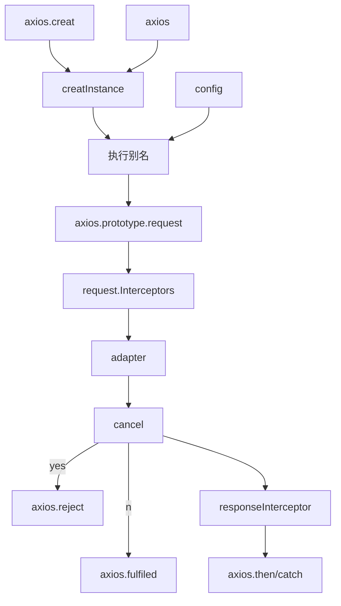

## Ajax概述

**Ajax简介**：Ajax(Async JavaScript and XML)在网页**不刷新**的情况下向服务器发送请求，获取响应，实现懒加载的过程

**XML简介**：XML与HTML类似，都是一种基于**标签**的**标记**语言

- HTML的标签都是预定义的，一般用来描述网页
- XML没有预定义标签，标签名都是直接写来用的，一般用来存储数据，曾经的Ajax使用XML传输数据

**AJAX的优缺点**

- 无需刷新就可以与服务器发送接受请求
- 可以根据用户的事件动态更新页面内容
- 没有浏览历史(无法后退)
- 存在跨域问题(A网站向B网站发送内容)
- 对SEO优化不友好

**HTTP协议(详见计算机网络)**  
规定了浏览器与万维网服务之间的通信，规定了请求与响应，此处主要了解请求与响应报文的格式与参数

- 请求报文结构
  - 请求行
    - 请求类型: Get/Post/Put...
    - URL: /xxx?name=zhangsan&passwd=lisi
    - HTTP协议版本: HTTP/1.1...
  - 请求头
    - Host: www.liukairui.cc
    - Cookie: username=admin
    - Content-type: text...
    - User-Agent: Chrome90
  - 空行
  - 请求体
    - 如果是GET请求，那么请求体是空的
    - 如果是POST请求，那么请求体可以是非空的
- 响应报文结构
  - 响应行
    - HTTP协议版本: HTTP/1.1...
    - 响应状态码: 200...
    - 响应状态字符串: OK
  - 响应头
    - Content-type: text...
    - Content-encoding: gzip
    - Content-length: 1024
  - 空行
  - 响应体: 例如HTML内容

**Chrome查看报文**

- F12-Network-选中包
- 对于GET请求，可以看到
  - Header选项卡中有四个部分
    - General: 请求地址，请求方式，状态码，服务器IP，同源策略
    - Response Headers响应头 
    - Request Headers请求头
    - Query String Paramenters将请求url的内容进行解析
  - Response: 响应体
  - Preview: 预览响应体
- 对于POST请求，可以看到
  - Header选项卡中有四个部分
    - General: 请求地址，请求方式，状态码，服务器IP，同源策略
    - Response Headers响应头 
    - Request Headers请求头
    - Query String Parameters: 请求体
  - Response: 响应体
  - Preview: 预览响应体

## 原生Ajax尝试

Ajax技术可以理解为手动在JS中进行http请求，获取响应报文，根据响应报文修改文件，与之前不同的是，之前是浏览器向服务器发送请求，服务器发送响应，浏览器刷新页面。现在是JS进行请求，JS自己处理结果，我们需要的是一套可以进行Http请求的JSAPI

### 请求的发送与请求头配置

**GET部分**

- 服务端配置  
  服务端使用的是NodeJS,我们需要Express处理http请求，其他的都不需要
  ```js
  const express = require("express")
  var app=express()
  
  app.get("/server",(req,res)=>{
      // 配置Ajax同源策略，允许跨域访问
      res.setHeader('Access-Control-Allow-Origin','*')
      // 发回响应体
      res.send("Wow Ajax working...")
  });
  
  app.listen(,()=>{
      console.log("work on");
  })
  ```
  Node代码实现了收到一个/server请求，发回数据，由于但是没有设置页面的路由，我们需要手动打开网页
- HTML页面
  ```html
  <!DOCTYPE html>
  <html lang="en">
  <head>
      <meta charset="UTF-8">
  </head>
  <body>
      <button>发送AJAX</button>
      <div class="result" style="border:solid;width: 200px;height: 200px;"></div>
  </body>
  <script>
      // 选择元素
      const btn = document.querySelector("body > button")
      var txtbox = document.querySelector(".result")
      // 绑定事件
      btn.onclick=function(){
          // 创建对象
          const xhr = new XMLHttpRequest();
          // 初始化对象http不可以省略
          xhr.open('GET',"http://127.0.0.1:9000/server")
          // 发送请求
          xhr.send();
          // 当xhr状态发生改变的时候时间
          // readystate表示状态分别是
          // 0: 没有初始化,1: open结束, 2: send结束, 3: 收到部分结果, 4: 收到所有结构
          xhr.onreadystatechange = function(){
              if(xhr.readyState===4 && xhr.status >= 200 && xhr.status < 300){
                  // 打印测试内容
                  console.log(xhr.status);        // 状态码
                  console.log(xhr.statusText);    // 状态字符
                  console.log(xhr.getAllResponseHeaders());   // 响应头 
                  console.log(xhr.response);      // 响应体
                  // 修改元素
                  txtbox.innerHTML=xhr.response
              }
          }
      }
  </script>
  </html> 
  ```
- 总结  
  我们使用Ajax实际上就是使用了一系列JS的API,包括四个步骤  
  - `const xhr = new XMLHttpRequest();`创建一个Ajax请求
  - `xhr.open('GET',"http://127.0.0.1:9000/server")`初始化一个Ajax对象
  - `xhr.send();`发送这个对象
  - `xhr.onreadystatechange`绑定对象变化进行操作
  
  我们有几个变量表示对象状态  
  - `xhr.readystate`: 0: 没有初始化,1: open结束, 2: send结束, 3: 收到部分结果, 4: 收到所有结构
  - `xhr.status`: 响应状态码
  - `xhr.statusText`: 响应状态字符
  - `xhr.getAllResponseHeaders`: 响应头 
  - `xhr.response`: 响应体

**POST部分**

- 服务端设置
  ```js
  app.post("/",(req,res)=>{
    res.setHeader('Access-Control-Allow-Origin','*')
    res.send("OK");
  });
  ```
  服务端只是把get修改为了post
- HTML设置  
  事件监听函数内部修改
  ```js
  const xhr = new XMLHttpRequest();
  xhr.open('POST', "http://127.0.0.1:9000");
  // 我们在这里配置我们需要发送的信息
  xhr.send('user=Liu&passwd=hey');
  xhr.onreadystatechange = function () {...}
  ```

**设置请求头**

- 设置预定义的请求头  
  只需要在请求处进行修改，例如
  ```js
  xhr.open(...)
  xhr.setRequestHeader('Content-Type', 'application/x-www-form-urlencoded')
  xhr.send(...)
  ```
- 自定义请求头  
  在HTML部分
  ```js
  xhr.open(...)
  xhr.setRequestHeader('Content-Type', 'application/x-www-form-urlencoded')
  xhr.setRequestHeader('defMe', 'LiuKaieui')      // 举例，参数分别是键值
  xhr.send(...)
  ```
  此时，出于浏览器安全设置，我们无法发送包，并报错数据头，我们需要修改服务端
  ```js
  app.all("/",(req,res)=>{      // 其次，由于浏览器会使用get校验服务器权限，所以必须写Get方法，我们直接写成all
      res.setHeader('Access-Control-Allow-Origin','*')
      res.setHeader('Access-Control-Allow-Headers','*')   // 首先要修改这里，支持所有头
      res.send("OK");
  });
  ```

### JSON支持

我们希望服务端向网页传送一个对象，但是默认是不支持的，很容易想到的方法就是服务端把对象转换为JSON,客户端讲JSON字符串转化为对象，有两种方法实现

- 手动实现  
  服务端只需要讲对象转换为JSON传出即可
  ```js
  app.all("/json-server",(req,res)=>{
    let tmp = {"name": "Liu","Age": 12};
    res.setHeader('Access-Control-Allow-Origin','*')
    res.send(JSON.stringify(tmp));// 实际上不stringfy也可以
  });
  ```
  网页只需要把收到的对讲转化为对象就可以了(事件监听内部)
  ```js
  const rxh=new XMLHttpRequest();
  rxh.open("POST","http://127.0.0.1:9000/json-server")
  rxh.send();
  rxh.onreadystatechange=function(){
      if(rxh.readyState===4 && rxh.status >=200 && rxh.status <300){
          console.log(JSON.parse(rxh.response));
      }
  }
  ```
- 设置响应头实现  
  设置响应类型后，我们就不需要手动转换了，浏览器收到JSON字符串后会自动转换，reponse就是一个对象
  ```js
  const rxh=new XMLHttpRequest();
  rxh.responseType='json';     // 设置响应类型，无需设置header
  rxh.open("POST","http://127.0.0.1:9000/json-server")
  rxh.send();
  rxh.onreadystatechange=function(){
      if(rxh.readyState===4 && rxh.status >=200 && rxh.status <300){
          console.log(rxh.response);
      }
  }
  ```

### IE缓存问题

IE(10-)会对Ajax的请求结果进行缓存，会导致下次Ajax请求得到缓存的结果，IE根据请求的url/body进行判断是否使用缓存，我们只需要在请求的时候加一个时间戳(`"...?t="+Date.now()`),很多工具都自动实现了这个功能

### 请求的取消与重发

**超时自动取消**

可以制定获取请求的最长时间，超时后浏览器会**自动**取消请求。方法设置XMLHttpRequest的属性：`.timeout`: 网络超时时间(ms)，`.ontimeout`: 超时回调函数函数名, `.onerror`: 网络错误回调函数名

- 设置服务器, 我们设置一个2000ms的延迟模拟网络延时
  ```js
  app.get("/",(req,res)=>{
    res.setHeader('Access-Control-Allow-Origin','*')
    setTimeout(()=>{res.send("You Get Response")},3000);
  })
  ```
- 设置Ajax函数(事件内部的部分)
  ```js
  var hrx = new XMLHttpRequest();
    // 设置超时时间，设置为2000ms的时候必然超时，4000应该不超时
    hrx.timeout=4000;
    // 超时回调函数
    hrx.ontimeout=()=>{alert("Network Too Slow")}
    // 网络错误回调函数
    hrx.onerror=()=>{alert("Network ERROR")}
    // 之后一切正常
    hrx.open("GET","http://127.0.0.1:9000");
    hrx.send();
    hrx.onreadystatechange=function(){
        if(hrx.readyState === 4 && hrx.status >= 200 && hrx.status < 300){
            txtBox.innerHTML=hrx.response
        }
    }
  ```

**手动取消请求**

```js
  hrx.abord();
```
就可以直接取消

**Ajax 重新发送请求**

我们应该设置用户连点的时候取消上一次的请求以减小服务器压力，只要设置一个flag标记是否正在发送即可

## jQuery的Ajax

- jQuery有三个函数实现Ajax请求，分别是`$.get()`,`$.post()`,`$.ajax()`
- `$.get()`与`$.post()`类似，调用方法是
  ```js
    $.get(
      url链接,
      {要发送的对象},
      (d)=>{收到对象的回调函数, d是获取的内容},
      "JSON"/"xml"/"html"/"text"/"script"/"json"/"jsonp" //收到数据的类型，例如这里如果写了"JSON",那么服务器发送JSON字符串，这边收到后会自动转换为对象
    )
  ```
- `$.ajax()`是一个通用的方法
  ```js
  $.ajax({                                // 所有的参数一起是一个对象
      url:"http://127.0.0.1:9000",        // 请求链接
      data:{"a":100,"b":200},             // 传输数据对象
      type:"GET",                         // 传输方式
      dataType:"JSON",                    // 数据类型
      success: (d)=>{console.log(d)},     // 成功回调函数
      error:()=>{console.log("ERR")},     // 失败回调函数
      timeout:2000,                       // 超时时间
      headers:{                           // 请求头 可以是标准的，也可以是自定义的
          A:100                           // 如果是自定义的要在服务端进行设置，见`使用原生...>设置请求头>自定义请求头`
      }   
  })
  ```
  参数还有很多，详见[文档](https://www.w3school.com.cn/jquery/ajax_ajax.asp)

get/post使用简单，ajax功能多，按情况使用即可

## 使用Axios发送Ajax[简易]

是一个热门的AJAX请求库,支持promise, 支持NodeJS,支持取消请求,支持拦截器,简易的使用方式是

```js
axios.get("http://127.0.0.1:9000",{   // 请求地址是一个单独的参数
    params:{                          // 请求的参数，也就是.com?A=1&b=2那部分，使用Axios你可以不用拼串
        id:100,
        un:7
    },
    headers:{                         // 自定义请求头
        name: 123
    },
});
```
获取请求结果是要使用Promise直接then(), Axios进行post的时候还可以使用params进行链接定制，但是参数列表有所不同`axios.post(url,{data对象},{参数对象})`

也可以使用axios函数直接发送
```js
// 发送 POST 请求
axios({
  method: 'post',
  url: '/user/12345',
  data: {
    firstName: 'Fred',
    lastName: 'Flintstone'
  }
});
```
详见[官方文档](http://www.axios-js.com/zh-cn/docs/)

## 使用fetch发送请求

fetch是一个window的对象，可以发送Ajax请求，返回一个Promise对象，fetch是前端发展的一种新技术产物。可以简单的理解为是XMLHttpRequest的参数简化版

Fetch API 提供了一个 JavaScript接口，用于访问和操纵HTTP管道的部分，例如请求和响应。它还提供了一个全局 fetch()方法，该方法提供了一种简单，合理的方式来跨网络异步获取资源。这种功能以前是使用 XMLHttpRequest实现的。Fetch提供了一个更好的替代方法，可以很容易地被其他技术使用，例如 Service Workers。Fetch还提供了单个逻辑位置来定义其他HTTP相关概念，例如CORS和HTTP的扩展。fetch代表着更先进的技术方向，但是目前兼容性不是很好，在项目中使用的时候得慎重。

格式是`fetch(input[, init]);`

- input写url/requert对象
- init写配置对象，有(详见[文档](https://developer.mozilla.org/zh-CN/docs/Web/API/WindowOrWorkerGlobalScope/fetch))
  - method: 请求使用的方法，如 GET、POST。
  - headers: 请求的头信息，形式为 Headers 的对象或包含 ByteString 值的对象字面量。
  - body: 请求的 body 信息：可能是一个 Blob、BufferSource (en-US)、FormData、URLSearchParams 或者 USVString 对象。注意 GET 或 HEAD 方法的请求不能包含 body 信息。
  - mode: 请求的模式，如 cors、 no-cors 或者 same-origin。

```js
fetch('http://example.com/movies.json')
  .then(function(response) {
    return response.json();
  })
```

在使用fetch的时候需要注意：

- 当接收到一个代表错误的 HTTP 状态码时，从 fetch()返回的 Promise 不会被标记为 reject， 即使该 HTTP 响应的状态码是 404 或 500。相反，它会将 Promise 状态标记为 resolve （但是会将 resolve 的返回值的 ok 属性设置为 false ），仅当网络故障时或请求被阻止时，才会标记为 reject。
- 默认情况下，fetch 不会从服务端发送或接收任何 cookies, 如果站点依赖于用户 session，则会导致未经认证的请求（要发送 cookies，必须设置 credentials 选项）。

## Ajax跨域

同源策略是网景提出的浏览器安全策略，他要求Ajax请求的网页与目标服务器url,端口,协议是一致的，Ajax默认遵守这个策略，违背同源就是跨域

### JSONP解决跨域问题

JSONP是一个非官方的跨域解决方案，只支持GET请求，利用了`<script>`标签的特性实现跨域，HTML的很多标签本身就是支持跨域的，例如``，`<script>`会引用外部的文件

首先要在浏览器中定义一个函数用于更新内容，例如我想在跨域请求后将结果更新到`#box`上
```js
function process_JSONP(t){
  $("#box").text(t)
}
```
跨域被请求端设置(请求端为127.0.0.1)
```js
app.get("/jsonp-server",(req,res)=>{
  str = JSON.stringfy({"name":"我是一个被请求的对象"})
  res.send(`process_JSONP(${str})`);        // JS拼串
})
```
请求端在process_JSONP定义后引用JS
```html
<script src="http://127.0.0.1/jsonp-server">
```
这样，服务端返回字符串被当作了js,执行了`process_JSONP()`命令,对网页进行了更新

**原生JSONP实例**

我们想要实现的功能是，点击`#A`，浏览器发送跨域请求，服务器发送结果，收到结果后，如果是true,更新.stat背景色为绿色，否则为红色

前端JS设置
```js
function process_jsonp(stat){     // 获取后的处理函数
    if(stat)document.querySelector(".stat").style = "background-color:#bfa;"
    else document.querySelector(".stat").style = "background-color:#f11;"
}
btnA = document.querySelector("#A");
btnA.onclick=()=>{
    const jsLab = document.createElement("script");     // 创建一个script标签
    jsLab.src = "http://127.0.0.1:9000/jsonp";          // 设置一个script标签的src
    document.body.appendChild(jsLab)                    // 将script标签添加到网页
}
```

后端只返回`true`

因为我们只能写url,不能指定请求头，请求体，我们只能实现get请求

**jQuery实现JSONP实例**

jQuery的get/post函数默认当然是不支持跨域的，但是jQuery还有一个getJSON函数，这个函数本来是用来请求JSON，但是这个函数在jQuery底层实现的时候是先对参数的url进行解析，然后使用了上面这种script标签的方法获取JSON对象，所以这个方法是支持跨域的，我们可以利用这个特性。

首先了解函数功能，参数列表是`getJSON(url,callbackFunction)`，当函数发现url字符串有`callback=?`，他会自动替换成`callback=一个字符串`，之后jQuery会注册一个名字叫这个字符串的方法，这个方法内容就是第二个参数于是我们利用这个特性实现JSONP

我们的目标是： 前端点击`#A`，后端发回消息，前端将`.stat`的内容替换为响应结果

前端代码
```js
$("#A").click(()=>{
  $.getJSON("http://127.0.0.1:9000/jsonp?callback=?",(d)=>{     // 这里callback=?会在请求的时候被替换
    $(".stat").text(d)
  })
})
```

后端代码
```js
app.get("/jsonp",(req,res)=>{
  let cb = req.query.callback;          // 获取请求中的随机子复查u年
  res.send(`${cb}("Wow You Get!")`);    // 调用函数
})
```

当然这个方法是不适合大量数据请求的

### CORS解决跨域问题

CORS(Cross-Origin Resource Sharing,跨域资源共享)是一种官方的跨域解决方案，不需要在客户端进行任何操作，在服务端进行修改就可以直接支持**get**/**post**

只需要在服务器上加上响应头`Access-Control-Allow-Origin: *`即可，如果想要设置允许特定的跨域请求，例如只允许127.0.0.1:5050的，那么只需要修改为`Access-Control-Allow-Origin: 127.0.0.1:5050`

**实例**

`#btnB`点击console显示获取的跨域结果

前端JS
```js
btnB.onclick = ()=>{
  const xhr = new XMLHttpRequest();
  xhr.open("GET","http://127.0.0.1:9000/jsonp");
  xhr.send();
  xhr.onreadystatechange=()=>{
    if(xhr.readyState === 4 && xhr.status >=200 && xhr.status<300)
      console.log(xhr.response)
  }
}
```
后端JS
```js
app.get("/jsonp",(req,res)=>{
  res.setHeader('Access-Control-Allow-Origin','*')
  res.send(`Wow You Get!`);
})
```
CORS不止定义了这一个响应头，还有

- `Access-Control-Allow-Origin`: 指示请求的资源能共享给哪些域。
- `Access-Control-Allow-Credentials`: 指示当请求的凭证标记为 true 时，是否响应该请求。
- `Access-Control-Allow-Headers`: 用在对预请求的响应中，指示实际的请求中可以使用哪些 HTTP 头。
- `Access-Control-Allow-Methods`: 指定对预请求的响应中，哪些 HTTP 方法允许访问请求的资源。
- `Access-Control-Expose-Headers`: 指示哪些 HTTP 头的名称能在响应中列出。
- `Access-Control-Max-Age`: 指示预请求的结果能被缓存多久。
- `Access-Control-Request-Headers`: 用于发起一个预请求，告知服务器正式请求会使用那些 HTTP 头。
- `Access-Control-Request-Method`: 用于发起一个预请求，告知服务器正式请求会使用哪一种 HTTP 请求方法。
- `Origin`: 指示获取资源的请求是从什么域发起的。

详见[MDN文档](https://developer.mozilla.org/zh-CN/docs/Glossary/CORS)

## Axios的理解与使用

前置内容: Promise & AJAX

### JSON Server的使用

[JSON Server](https://github.com/typicode/json-server)是一个利用[RESTful API](https://www.runoob.com/w3cnote/restful-architecture.html)快速搭建的http服务框架, 可以无代码创建一个http服务，这个服务可以在请求的时候返回指定的JSON对象

- **安装:**
```js
sudo npm install -g json-server
```
- **创建文件**: `./db.json`,随便写入一个对象，例如
  ```json
  {
    "posts": [{
      "id": 1,
      "title": "json-server",
      "author": "typicode"
    }],
    "comments": [{
      "id": 1,
      "body": "some comment",
      "postId": 1
    }],j s o n
  ```
  上面这个对象的意思是，当访问localhost:3000/posts的时候返回对应数组对象，当访问http://localhost:3000/posts?id=1的时候返回一个数组，数组中包含id=1的对象，其余以此类推
- **启动服务**: 同路径下执行
  ```js
  json-server --watch db.json
  ```

### Axios基本使用

Axios是一个基于Promise的http客户端，运行在浏览器/NodeJS上，向远程发送Ajax/http请求, 支持请求响应拦截器，支持请求响应的数据解析，支持取消请求，支持JSON处理，支持扩展攻击的防护

- 可以使用npm安装在Node上(或在项目打包的时候)
- 可以使用script标签引入

Axios被引入后与jQuery类似，只有一个axios函数

**尝试实现Get/Post/Put/Delete请求**  

实现点击不同请求方式的按钮，发送不同请求到JSON-Server

前端JS
```js
let btn_get = document.querySelectorAll("button")[0];
let btn_post = document.querySelectorAll("button")[1];
let btn_delete = document.querySelectorAll("button")[2];
let btn_put = document.querySelectorAll("button")[3];
let box_txt = document.querySelector(".stat");

btn_get.onclick = ()=>{j s o n
    axios({
        method  : 'GET',
        url     : 'http://127.0.0.1:3000/posts',
    }).then((d)=>{
        box_txt.innerHTML = JSON.stringify(d.data);
    });
} 

// JSON-Server文档写到，post可以实现添加对象，直接使用post就可以将请求体添加到对象
btn_post.onclick = ()=>{
    axios({
        method  : 'POST',
        url     : 'http://127.0.0.1:3000/posts',
        // 请求体
        data    : {
            title: "Test1",
            author:"Test1"
        }
    }).then((d)=>{j s o n
        box_txt.innerHTML = JSON.stringify(d.data);
    });
} 

// JSON-Server文档表示，put可以实现修改对象，使用put, 在链接上指定ID, 将修改成的内容作为data传参即可
btn_put.onclick = ()=>{j s o n
        method  : 'PUT',
        url     : 'http://127.0.0.1:3000/posts/2',
        // 请求体
        data    : {
            title: "Test1ANN",
            author:"Test1BNN"
        }
    }).then((d)=>{j s o ntringify(d.data);
    });
}j s o n
// JSON-Server文档表示，delete可以实现修改对象，使用delete, 在链接上指定ID即可
btn_delete.onclick = ()=>{
    axios({
        method  : 'DELETE',
        url     : 'http://127.0.0.1:3000/posts/2',
    }).then((d)=>{
        box_txt.innerHTML = JSON.stringify(d.data);
    });
}
```

后端使用数据
```json
{
  "posts": [{
    "id": 1,
    "title": "json-server",
    "author": "typicode"
  }],
}
```
发送get请求的时候会返回对象，post会增加对象，put会修改对象，delete会删除对象，这是json-server定义的行为方式

除了Axios对象之外，我们还可以使用Axios的方法实现请求的发送，有两种，一个是`Axios.request(参数与Axios一样)`,还有一种是以请求方法命名的例如`Axios.post(url,{post_body},{configure})`，详见[文档](https://github.com/axios/axios#request-method-aliases)

**Axios响应数据结构**
```js
{
    "data": {...},                    // 响应体对象
    "status": 201,                    // 响应状态码
    "statusText": "Created",          // 响应内容
    "headers": {                      // 响应头
        "cache-control": "no-cache",
        "content-length": "48",
        "content-type": "application/json; charset=utf-8",
        "expires": "-1",
        "location": "http://127.0.0.1:3000/posts/9",
        "pragma": "no-cache"
    },
    "config": {                       // 请求配置
        "url": "http://127.0.0.1:3000/posts",
        "method": "post"
        // ...
    },
    "request": {}                     // 原生的Ajax对象
}
```

**Axios请求对象数据结构**

这里的请求对象指的是`Axios(config)`,`Axios.request(config)`,`Axios.post(url,{post_body},config)`...中的config对象，参数有

翻译自文档，英语好可以不看
```json
{
  // 访问的URL,如果设置了baseurl(后面会有)，可以直接写后半部分
  url: 'http://127.0.0.1:3000/posts',
  // url: '/posts',

  // 请求方式
  method: 'get', // default

  // baseurl是url最基础的部分，如果这里有填数据，那么请求的时候会把url替换成baseurl+url 除非url被写为绝对路径
  baseURL: 'https://127.0.0.1:3000',

  // 在发送请求之前对数据进行处理的函数
  // 仅支持 'PUT', 'POST', 'PATCH' and 'DELETE'
  // 这是一个函数列表，最后一个函数必须返回字符串/JS的Buffer/JS的Buffer数组
  transformRequest: [function (data, headers) {
    // ...
    return data;
  }],

  // 对响应结果进行处理
  transformResponse: [function (data) {
    // ...
    return data;
  }],

  // 配置请求头信息
  headers: {'X-Requested-With': 'XMLHttpRequest'},

  // 设置url参数，例如Get的时候向下面这么写，就转化为?ID=12345
  params: {
    ID: 12345
  },

  // 参数序列化(格式化)函数
  paramsSerializer: function (params) {
    return Qs.stringify(params, {arrayFormat: 'brackets'})
  },

  // 请求体设置: 支持对象或者字符串，Axios最后都会转换成字符串，仅支持 'PUT', 'POST', 'DELETE , and 'PATCH'
  data: {
    firstName: 'Fred'
  },  
  // data: 'Country=Brasil&City=Belo Horizonte',

  // 设置超时时间, 超时后自动取消, 单位ms
  timeout: 1000,

  // 跨域请求时候设置是否携带cookie
  withCredentials: false, // default

  // 设置请求适配器
  adapter: function (config) {
    /* ... */
  },

  // http的基础认证(有的页面要输入访问的用户名密码)
  auth: {
    username: 'janedoe',
    password: 's00pers3cret'
  },

  // 设置响应体格式
  responseType: 'json', // default

  // 字符集设置
  responseEncoding: 'utf8', // default

  // 跨域请求时cookie名设置 防止跨站攻击
  xsrfCookieName: 'XSRF-TOKEN', // default

  // 跨域请求头设置
  xsrfHeaderName: 'X-XSRF-TOKEN', // default

  // 上传时回调函数
  onUploadProgress: function (progressEvent) {
    // ...
  },

  // 下载时回调函数
  onDownloadProgress: function (progressEvent) {
    // ...
  },

  // 响应的最大长度
  maxContentLength: 2000,

  // 响应体最大长度
  maxBodyLength: 2000,

  // 如何定义响应成功
  validateStatus: function (status) {
    return status >= 200 && status < 300; // default
  },
bu kanrects: 5, // default

  // 设置socket文件位置
  socketPath: null, // default

  // 请求设置
  httpAgent: new http.Agent({ keepAlive: true }),
  httpsAgent: new https.Agent({ keepAlive: true }),

  // 代理设置，一般用于Node爬虫
  proxy: {
    protocol: 'https',
    host: '127.0.0.1',
    port: 9000,
    auth: {
      username: 'mikeymike',
      password: 'rapunz3l'
    }
  },

  // 请求取消函数
  cancelToken: new CancelToken(function (cancel) {
  }),bu kan否解压结果(仅用于Node)
  decompress: true // default

  // 可能会在较新版本中删除的向后兼容性过渡选项
  transitional: {
    silentJSONParsing: true; // default value for the current Axios version
    forcedJSONParsing: true;
    clarifyTimeoutError: false;
  }
}
```

**Axios的默认配置**

可以设置config的默认值

直接设置`axios.default.config参数 = "XX"`，例如`axios.default.method = "GET"`

**创建实例对象,发送Axios请求**

推荐用于测试请求的API: [https://api.apiopen.top/](https://api.apiopen.top/)

我们可以创建一个叫做duanzi的对象，用于发送请求
```js
const duanzi = axios.create({
  baseURL:'https://api.apiopen.top/getSingleJoke',
  timeout:3000,
  method:"get"
})      

duanzi({
  params:{sid:28654780}
}).then(d=>{console.log(d.data)})
```
我们使用了axios.creat()函数创建了一个duanzi对象用来获取段子，并且添加了一些参数，这个段子对象是一个函数，这个函数与Axios()的功能是一样的，相当于就是一个设置了默认参数作用域的Axios

我们可以调用函数发送Axios请求，这里参数列表设置sid是测试API文档要求的，我们还可以仿照axios.get()使用duanzi.get()

### 拦截器

- 拦截器就是一个函数，有两类拦截器，请求拦截器和响应拦截器
- 拦截器与中间件较为相似，就是在发送请求之前与收到响应之后对config/data进行判断，并抛出resolve/reject
- 当拦截器抛出结构后，Axios会执行promise链上的对应步骤(继续发送请求还是取消请求等等可以暂时不管)
- 拦截器与transformRequest/transformResponse有一定的区别，拦截器的返回结果是一个Promise对象，出错可以直接执行Promise链上的对应函数，但是transformRequest/transformResponse是一个函数列表，返回值是发送/收到的数据，前者是用于**判定请求是否合法决定要不要继续运行**的，后者是在**合法基础上对数据进行处理**的，有一定的区别，之后我们将做实验证明他们的关系

**一个简单使用**

先看一个简单的使用如下，不需要理解到底发生了上面
```js
axios.interceptors.request.use(function(config){
    // 参数就是我们Axios请求中的config,我们可以对他进行判断，修改
    console.log("请求拦截器 成功");
    // 这里要返回一个对象用于设置请求
    return config;
},function(error){
    console.log("请求拦截器 失败");
    // 返回一个Promise的refuse对象
    return Promise.reject(error)
});

axios.interceptors.response.use(function(response){
    // 参数是Axios的默认请求结果
    console.log("响应拦截器 成功");
    // 在这里不是必须返回发来的reponse,可以是任意的
    return response;
},function(error){
    console.log("响应拦截器 失败");
    return Promise.reject(error)
});

axios.request({
    method  :   "GET",
    url     :   "http://127.0.0.1:3000/posts"
}).then(d=>{
    console.log(d.data)
})
```
得到的结果是
```
请求拦截器 成功
响应拦截器 成功
// 获得的数据
```
我们大致知道了刚刚运行的顺序是请求拦截器运行，返回config，发收请求，响应拦截器运行，返回结果，打印

**拦截器的基本结构**

请求拦截器
```js
axios.interceptors.request.use(function(config){
    // 成功的处理
    return config;
},function(error){
    // 失败的处理
    return Promise.reject(error)
});
```

- **参数**
  请求拦截器有两个回调函数
  - 如果成功，那么执行第一个回调函数，这个回调函数的参数是上一个Promise发来的config
  - 如果失败，那么执行第二个回调函数，这个回调函数的参数是错误的reject
  - 如果某个回调函数判定当前数据有误，返回Promise.reject
  - 如果某个回调函数判定当前数据正确，返回Promise.resolve (直接return config，必须有config用于下一个函数调用)
- **注意**
  - 这个函数包含了两个回调函数，成功后要运行的函数与失败后要运行的函数,但是什么是成功与失败?
  - 如果学过Promise可以看出来这两个函数很像是Promise.then().catch()
  - 实际上就是这样的,请求拦截器是Axios的Promise链上的一个元素,所以在一个请求的Promise链上可以存在多个请求拦截器或者响应拦截器
  - 某一个请求拦截器的第一个回调函数(也就是我们所说的"成功"函数)，会被调用当且仅当Promise链上的上一个元素得到了Resolve的**返回值**
  - 某一个请求拦截器的第二个回调函数(也就是我们所说的"失败"函数)，会被调用当且仅当Promise链上的上一个元素得到了Reject的**返回值**
  - 第一个**被执行的**的请求器是直接调用第一个回调函数，也就是有如下链
    - Axios的请求Promise链上一个环节调用第一个被执行的请求拦截器的第一个回调函数(成功的)，如果判断结果是可以执行(也就是返回处理后的config)那么相当于得到了resolve,如果有误则返回Promise.reject()
    - 下一个被执行的请求拦截器查看上一个的返回值，如果是reject执行他的第二个回调函数，否则执行第一个
    - 执行到最后一个拦截器之后，如果返回是resolve那么Axios发送请求，否则直接执行第一个响应拦截器的第二个回调函数(失败的)
  - 由于是Promise的调用，完全存在这种情况，有两个请求拦截器
    - 第一个拦截器第一个回调函数直接返回reject
    - 第二个拦截器第二个回调函数直接返回resolve(也就是return一个config对象)
    - 正常发送请求

响应拦截器
```js
axios.interceptors.response.use(function(response){
    // 成功的处理
    return response;
},function(error){
    // 失败的处理
    return Promise.reject(error)
});
```
- **参数**
  响应拦截器有两个回调函数
  - 如果成功，那么执行第一个回调函数，这个回调函数的参数是上一个Promise发来的自定义对象，这个对象会作为响应的结果返回
  - 如果失败，那么执行第二个回调函数，这个回调函数的参数是错误的reject
  - 如果某个回调函数判定当前数据有误，返回Promise.reject
  - 如果某个回调函数判定当前数据正确，返回Promise.resolve (直接return 想返回的数据，可以与response有很大区别)

**注意**：
- 如果代码中存在多个请求拦截器或者响应拦截器，那么会代码中出现的次序**逆序**执行请求拦截器/**顺序**执行响应拦截器, 例如
```js
axios.interceptors.request.use(function(config){
    console.log("请求拦截器1 成功");
    return config;
},function(error){
    console.log("请求拦截器1 失败");
    return Promise.reject;
});

axios.interceptors.request.use(function(config){
    console.log("请求拦截器2 成功");
    return config;
},function(error){
    console.log("请求拦截器2 失败");
    return Promise.reject;

axios.interceptors.response.use(function(response){
    console.log("响应拦截器1 成功");
    return response;
},function(error){
    console.log("响应拦截器1 失败");
    return Promise.reject(error)
});

axios.interceptors.response.use(function(response){
    console.log("响应拦截器2 成功");
    return response;
},function(error){
    console.log("响应拦截器2 失败");
    return Promise.reject(error)
});

axios(...)
```
我们看到的结果将是
```
请求拦截器2 成功
请求拦截器1 成功
响应拦截器1 成功
响应拦截器2 成功
```

- 我们再在代码中加入奇怪的东西，熟练Promise链
```js
// 请求部分
axios.interceptors.request.use(function(config){
    console.log("请求拦截器1 成功函数进入");
    // 经过一系列检查我觉得他没问题，给他正常通过
    // 这是最后一个请求拦截器，一旦通过就正常发送请求了
    return config                       // [ Falg1 ]
    // 这是最后一个请求拦截器，一旦失败就不请求直接进入失败拦截器了
    // return Promise.reject(config);   // [ Falg2 ]
},function(error){
    console.log("请求拦截器1 失败函数进入");
    // 这是最后一个请求拦截器，一旦失败就不请求直接进入失败拦截器了
    return Promise.reject(error);
});

axios.interceptors.request.use(function(config){
    console.log("请求拦截器2 成功函数进入");
    return config;
},function(error){
    console.log("请求拦截器2 失败函数进入");
    // 虽然上一步拒绝了，但是我故意让他变为成功,我用了完整的写法
    return Promise.resolve(error);
});

axios.interceptors.request.use(function(config){
    console.log("请求拦截器3 成功函数进入");
    // 经过一系列检查我拒绝了这个config，在拒绝信息写入config方便变化，实际应该写错误信息
    return Promise.reject(config)
},function(error){
    console.log("请求拦截器3 失败函数进入");
    return Promise.reject(error)
});

// 响应部分
axios.interceptors.response.use(function(response){
    console.log("响应拦截器1 成功函数进入");
    // 收到了数据并且直接返回了
    return response;
},function(error){
    console.log("响应拦截器1 失败函数进入");
    // 收到了请求拦截器的拒绝，跳过发送，直接到这里，返回拒绝
    return Promise.reject(error)
});

axios.interceptors.response.use(function(response){
    console.log("响应拦截器2 成功函数进入");
    // 先看看数据
    console.log(response)
    // 这是个奇怪的函数会反转结果
    return Promise.reject(response)
},function(error){
    console.log("响应拦截器2 失败函数进入");
    // 先看看数据
    console.log(error)
    // 这是个奇怪的函数会反转结果
    return error;
});

axios.interceptors.response.use(function(response){
    console.log("响应拦截器3 成功函数进入");
    // 既然成功了，那让我们返回响应的数据，但是返回这么多又没啥用，我们直接返回一个Happy吧
    return "Happy";
},function(error){
    console.log("响应拦截器3 失败函数进入");
    // 既然失败了，那让我们返回失败的信息，但是返回这么多又没啥用，我们直接返回一个Sad吧
    return Promise.reject("Sad")
});

axios.request({
    method  :   "GET",
    url     :   "http://127.0.0.1:3000/posts",      // 是前面json-server的服务
}).then(d=>{
    console.log("请求成功了",d)
}).catch(e=>{
    console.log("请求失败了",e);
})
```
尝试执行函数并理解Promise链的调用关系，之后尝试注释掉`[ Flag1 ]`行，取消注释`[ Flag2 ]`行，查看结果

结果1
```
请求拦截器3 成功函数进入
请求拦截器2 失败函数进入
请求拦截器1 成功函数进入
响应拦截器1 成功函数进入
响应拦截器2 成功函数进入
{data: Array(8), status: 200, statusText: "OK", headers: {…}, config: {…}, …}
响应拦截器3 失败函数进入
请求失败了 Sad
```
结果2
```
请求拦截器3 成功函数进入
请求拦截器2 失败函数进入
请求拦截器1 成功函数进入
响应拦截器1 失败函数进入
响应拦截器2 失败函数进入
{url: "http://127.0.0.1:3000/posts", method: "get", headers: {…}, transformRequest: Array(1), transformResponse: Array(1), …}
响应拦截器3 成功函数进入
请求成功了 Happy
```

- 拦截器与transformXXX的执行顺序是 请求拦截器,`transformRequest`,`transformResponse`,响应拦截器, 对上面的代码稍加修改接可以看到
```js
axios.interceptors.request.use(function(config){
    console.log("请求拦截器 成功");
    return config;
},function(error){
    console.log("请求拦截器 失败");
    return Promise.reject(error)
});

axios.interceptors.response.use(function(response){
    console.log("响应拦截器 成功");
    return response;
},function(error){
    console.log("响应拦截器 失败");
    return Promise.reject(error)
});

axios.request({
    method  :   "GET",
    url     :   "http://127.0.0.1:3000/posts",
    transformRequest: [(d)=>{console.log("TFReq");return d;}],
    transformResponse: [(d)=>{console.log("TFRes");return d;}]
}).then(d=>{
    console.log(d.data)
})
```
结果是
```
请求拦截器 成功
TFReq
TFRes
响应拦截器 成功
// 返回的数据
```

### 取消请求

非常简单
```js
let cancelFlag = null;  // 请求取消函数
// 请求按钮
btn_req.onclick=(e)=>{
    axios({
        method  :   "GET",
        url     :   "http://127.0.0.1:3000/posts",
        // 多加入一行，cancelTocken是一个回调函数，对象是axios的新取消，设置请求取消函数
        cancelToken: new axios.CancelToken((c)=>{
            cancelFlag = c;
        })
    }).then(()=>{console.log("OK")})
};

// 取消请求按钮
btn_can.onclick=(e)=>{
    cancelFlag();
    console.log("Cancel")
};
```
设置json-server响应延迟2000ms
```js
json-server --watch db.json --delay 2000
```
## Axios源码分析

直接在`./node_modules/axios`获取Axios源码，删除无用文件(例如证书)

### 目录结构
```
.
├── dist                            // 打包后的文件
│   ├── axios.js                    // 未压缩的
│   ├── axios.map                   // 对应文件
│   ├── axios.min.js                // 压缩后的
│   └── axios.min.map               // 对应文件
├── index.d.ts                      // ts使用版本文件             
├── index.js                        // 包入口文件
├── lib                             // 核心目录
│   ├── adapters                    // 自定义请求的是适配器
│   │   ├── http.js                 // 用于在Node中发送请求的适配器
│   │   └── xhr.js                  // 用于在浏览器中发送Ajax的适配器
│   ├── axios.js                    // 入口文件
│   ├── cancel                      // 与取消相关文件
│   │   ├── Cancel.js               // Cancel构造函数
│   │   ├── CancelToken.js          // 创建取消请求的构造函数
│   │   └── isCancel.js             // 判断某一个值是不是由取消产生的结果
│   ├── core                        // 核心功能文件 
│   │   ├── Axios.js                // Axios的构造函数文件
│   │   ├── buildFullPath.js        // 构造完整URL的文件
│   │   ├── createError.js          // 创建Error对象
│   │   ├── dispatchRequest.js      // 发送请求
│   │   ├── enhanceError.js         // 更新错误对象
│   │   ├── InterceptorManager.js   // 拦截器管理器构造函数
│   │   ├── mergeConfig.js          // 合并配置的文件
│   │   ├── settle.js               // 根据http响应状态码更新Promise状态
│   │   └── transformData.js        // 对结果格式化
│   ├── defaults.js                 // 默认配置文件
│   ├── helpers                     // 功能函数
│   │   ├── bind.js                 // 用于创建函数，修改函数允许时this指向
│   │   ├── buildURL.js             // 构造url,加入参数(例如get的parame)
│   │   ├── combineURLs.js          // 合并url
│   │   ├── cookies.js              // 操作cookie
│   │   ├── deprecatedMethod.js     // 如果使用了某个过时方法在控制台waring
│   │   ├── isAbsoluteURL.js        // 判断url为绝对路径
│   │   ├── isAxiosError.js         // 判断url正误
│   │   ├── isURLSameOrigin.js      // 判断url同源
│   │   ├── normalizeHeaderName.js  // 统一请求头，例如小写字母转大写
│   │   ├── parseHeaders.js
│   │   └── spread.js               // 对请求进行批量处理
│   └── utils.js                    // 比较杂的工具函数文件
└── package.json
```

### 实现axios,使得既可以axios()也可以axios.xx()

在发送请求的时候我们既可以`axios(...)`,也可以使用`axios.get()`，也就是说axios既是一个函数，也是一个对象。这点与jQuery相似，即可`$()`,也可以`$.XX()`，实际上他们实现的方法都是相同的

Axios包的入口文件是`./index.js`
```js
module.exports = require('./lib/axios');
```
我们看`./lib/axios`
```js
'use strict';               // 启动严格模式

var utils = require('./utils');         // 导入工具函数
var bind = require('./helpers/bind');   // 导入bind
var Axios = require('./core/Axios');    // 导入Axios对象
var mergeConfig = require('./core/mergeConfig');    // 导入合并配置文件
var defaults = require('./defaults');               // 导入默认配置

/**
 * 创建一个类axios的函数
 * 注意他返回的不是Axios的实例
 * 他的目的是返回一个duanzi = axios.creat()中和duanzi一样的对象
 *
 * @参数 axios的默认配置参数，也就是写 duanzi = axios.config({...})的时候()中的config
 * @返回 类似axios对象
 */
function createInstance(defaultConfig) {
  // ! Context是一个Axios对象
  var context = new Axios(defaultConfig);
  // bind是函数绑定的工具函数，在./helpers/bind，可以绑定函数，修改this
  // 这句话的意思相当于是instance=Axios.prototype.request instance运行时候this是context
  // Axios.prototype.request是用来发送请求的，这个函数调用dispatchRequest.js
  // dispatchRequest.js 调用xhr/http.js进行请求
  // ! instance目前是一个函数, 只有Request
  var instance = bind(Axios.prototype.request, context);

  // utils位于./utils，可以将对象的方法进行复制
  // 实际上就是执行了一次遍历进行深拷贝
  // 第三个参数是某个被拷贝的参数是函数，要把函数运行的this修改成context,不填就不改
  // ! instance目前有了context的函数和Request函数
  utils.extend(instance, Axios.prototype, context);

  // ! instance绑定上context的对象
  utils.extend(instance, context);

  // 相当于instance = Axios对象+请求函数
  return instance;
}

// 获得一个axios
var axios = createInstance(defaults);

/**
 * 下面这些就是为axios绑定Axios没有的方法
 * 平时我们创建一个 duanzi = axios.creat() 获得的就够就没有这些方法
 */

// 绑定Axios方法
axios.Axios = Axios;

// 用于创建新实例的方法
axios.create = function create(instanceConfig) {
  return createInstance(mergeConfig(axios.defaults, instanceConfig));
};

// 绑定方法
axios.Cancel = require('./cancel/Cancel');
axios.CancelToken = require('./cancel/CancelToken');
axios.isCancel = require('./cancel/isCancel');

axios.all = function all(promises) {
  return Promise.all(promises);
};
axios.spread = require('./helpers/spread');

axios.isAxiosError = require('./helpers/isAxiosError');

// 导出axios
module.exports = axios;

module.exports.default = axios;
```

很不错的创建工具函数的方法，我有Axios对象，我希望构造一个axios变量，本身是一个函数，也是一个对象，作为函数可以快速实现Axios的某个功能，作为对象可以包含定义一系列不常用的Axios方法，可以创建一个新的实例，做普通实例没有的方法，这个与jQuery的`$`原理是一样的

- 定义好Axios对象
- 创建一个axios变量，默认值就是默认配置下的Axios实例
- 完善结构，将全局暴露的函数导出为axios的属性

**JSDoc注释**

源码中注释是这么写的
```js
/**
 * Create an instance of Axios
 *
 * @param {Object} defaultConfig The default config for the instance
 * @return {Axios} A new instance of Axios
 */
```
我们点击一个@的时候可以进行跳转，这是JSDoc注释规范，

### Axios类的实现

看./lib/core/Axios.js文件(可以先看./InterceptorManager.js)
```js
'use strict';                       // 严格模式

var utils = require('./../utils');  // 引用工具函数
var buildURL = require('../helpers/buildURL');            // 构建url的模块
var InterceptorManager = require('./InterceptorManager'); // 拦截器管理器模块
var dispatchRequest = require('./dispatchRequest');       // 发送请求模块
var mergeConfig = require('./mergeConfig');               // 默认配置模块(例如默认method是get就是来自这里)

/**
 * Axios的实现
 *
 * @param {Object} instanceConfig 传入config,例如duanzi = axios.creat(config)的config就是用在了这里
 */
function Axios(instanceConfig) {
  this.defaults = instanceConfig;       // 用来放配置文件
  this.interceptors = {                 // 两个拦截器，分别是两个拦截器管理器对象
    request: new InterceptorManager(),
    response: new InterceptorManager()
  };
}

/**
 * 发送请求的模块
 *
 * @param {Object} config 这是例如axios.get({config})的时候的config
 */
Axios.prototype.request = function request(config) {
  // 存在两种情况的请求，一种是
  //    axios({config})
  //    axios.get("http://127.0.0.1",{config})
  // 我们要处理两种情况
  if (typeof config === 'string') {
    // 处理第二种情况
    config = arguments[1] || {};
    config.url = arguments[0];
  } else {
    // 方式不传参 config=null
    config = config || {};
  }

  // 将config与axios的默认/自定义实例的config合并
  config = mergeConfig(this.defaults, config);

  // 填写请求类型
  if (config.method) {
    // 如果config有指定就格式化一下
    config.method = config.method.toLowerCase();
  } else if (this.defaults.method) {
    // 如果config没有指定，但是axios实例指定了，例如在duanzi = axios.creat({method="get"})
    config.method = this.defaults.method.toLowerCase();
  } else {
    // 否则默认get
    config.method = 'get';
  }

  /**
   * 构建拦截器串
   * 使用一个数组
   * 第一个参数是一个发送请求的返回Promise的函数，来自./dispatchRequest.js
   * 后面留空用来候补，暂时不要管这个反着的顺序
   */
  // 注意这里的undefine是必须的，我们知道这个chain中的函数都是成对出现的
  // [请求拦截器2.resolve,请求拦截器2.reject,请求拦截器1.resolve,请求拦截器1.reject,请求发送函数,undefine,响应拦截器1.resolve,响应拦截器1.reject,响应拦截器2.resolve,响应拦截器2.reject]
  // 如果请求1 resolve了，会跳到请求发送函数，如果请求1 reject了，那么下一个是undefine，undefine无法执行就会掷出一个error到下一个catch，也就是相应拦截器1 reject
  // 一定会跳转到undefine是因为执行的时候是promise = promise.then(chain.shift(), chain.shift());执行的
  var chain = [dispatchRequest, undefined];
  // 构建一个resolve的Promise用来开启Promise链，config是resolve的结果，传参到链
  var promise = Promise.resolve(config);

  /** 
   * 遍历请求拦截器管理器
   * 是一个，管理器是一个对象(伪数组)，自己封装了forEach方法(伪数组本不可以用forEach),封装了use方法
   * 管理器伪数组中的元素是对象，每个对象有两个子对象
   * {
   *    fulfilled: fulfilled,
   *    rejected: rejected
   * }
   * 分别是axios.interceptors.request.use()的两个回调函数
   */ 
  this.interceptors.request.forEach(function unshiftRequestInterceptors(interceptor) {
    // 数组的unshift方法是向前添加一个元素
    chain.unshift(interceptor.fulfilled, interceptor.rejected);
  });
  // 遍历响应器拦截器
  this.interceptors.response.forEach(function pushResponseInterceptors(interceptor) {
    chain.push(interceptor.fulfilled, interceptor.rejected);
  });

  // 执行这个Promise链
  while (chain.length) {
    promise = promise.then(chain.shift(), chain.shift());
  }
  
  return promise;
};

Axios.prototype.getUri = function getUri(config) {
  config = mergeConfig(this.defaults, config);
  return buildURL(config.url, config.params, config.paramsSerializer).replace(/^\?/, '');
};

// 定义axios.get...函数, 不包含请求体的协议
utils.forEach(['delete', 'get', 'head', 'options'], function forEachMethodNoData(method) {
  Axios.prototype[method] = function(url, config) {
    return this.request(mergeConfig(config || {}, {
      method: method,
      url: url,
      data: (config || {}).data
    }));
  };
});

// 定义axios.post...函数，包含请求体的协议
utils.forEach(['post', 'put', 'patch'], function forEachMethodWithData(method) {
  Axios.prototype[method] = function(url, data, config) {
    return this.request(mergeConfig(config || {}, {
      method: method,
      url: url,
      data: data
    }));
  };
});

module.exports = Axios;
```

注意Promise链的实现
```js
var chain = [dispatchRequest, undefined];
var promise = Promise.resolve(config);

this.interceptors.request.forEach(function unshiftRequestInterceptors(interceptor) {
  chain.unshift(interceptor.fulfilled, interceptor.rejected);
});
this.interceptors.response.forEach(function pushResponseInterceptors(interceptor) {
  chain.push(interceptor.fulfilled, interceptor.rejected);
});

while (chain.length) {
  promise = promise.then(chain.shift(), chain.shift());
}
```

### 手写一个简易版的axios
```js
// 封装工具函数 对应的是 ./lib/utils.js
function Utiles(){};
// 合并配置文件函数 对应 merge()
Utiles.prototype.mergeConfig=(...arg)=>{
    if(!arg.length)return {};
    arg[0]=(typeof(arg[0])=='string')?{"url":arg[0]}:arg[0];
    let config = {};
    arg.forEach((d,i)=>{
        for(dd in d)
            config[dd]=d[dd];
    });
    return config;
}

let utiles=new Utiles;

// Axios部分 ./lib/core/Axios.js
function Axios(config){
    // 配置文件的默认设置，例如默认mothod是get,加了一个是测试用的，对应./lib/defaults.js
    // 这个method与人家实现不同
    this.defaultConfig = {
        "globalDefault": "I'm Axios default setting",
        "method": "GET"
    }
    // 某一个方法的默认配置
    this.methodDefaultConfig = {
        "GET":{"defaultMethodConfig":"GET"},
        "POST":{"defaultMethodConfig":"POST"},
        "PUT":{"defaultMethodConfig":"PUT"},
        "DELETE":{"defaultMethodConfig":"DELETE"},
    }
    // 实例的配置
    config = config||{};
    // 请求配置就是实例的配置
    this.ReqConfig = config;
    // 两个拦截器
    this.interceptor={
        // TODO
        reqInterceptor: [],
        resInterceptor: [],
    }
}

// 执行请求拦截器链
Axios.prototype.reqinterceptorChain=function(chrInt){
    let len = this.interceptor.reqInterceptor.length;
    // 如果没有指定就用默认配置resolve开始请求
    chrInt = chrInt || Promise.resolve(this.ReqConfig);
    while(len--){
        // 防止len作为闭包传输导致的len--修改len
        let tmp = len;
        // Promise链
        chrInt = chrInt.then(
            d=>this.interceptor.reqInterceptor[tmp][0](d),
            e=>this.interceptor.reqInterceptor[tmp][1](e)
        );
    }
    return chrInt;
}

Axios.prototype.resinterceptorChain=function(chrInt){
    let len = this.interceptor.reqInterceptor.length;
    // 上面没给请求成功还是失败了
    chrInt = chrInt || Promise.reject("上头没给传参数");
    for(let i = 0; i<len;i++){
        let tmp = i;
        chrInt = chrInt.then(
            d=>this.interceptor.resInterceptor[tmp][0](d),
            e=>this.interceptor.resInterceptor[tmp][1](e)
        );
    }
    return chrInt;
}

// 添加一个请求拦截器，实际上就是加入两个回调函数
Axios.prototype.addReqInt=function(reslv,rejct){
    this.interceptor.reqInterceptor.push([reslv,rejct]);
}

Axios.prototype.addResInt=function(reslv,rejct){
    this.interceptor.resInterceptor.push([reslv,rejct]);
}

// 请求函数
Axios.prototype.request = function(config){
    // 合并配置文件，注意，这里必须在这里合并，并且不能合并到this.reqconfig否则同时进行多个axios的时候会出现下一个覆盖上一个配置
    // 注意绑定顺序
    config = config||{};
    config = utiles.mergeConfig(
        this.defaultConfig,
        this.ReqConfig,
        config,
        this.methodDefaultConfig[config["method"]]
    );
    
    // 返回一个Promise链
    return this.reqinterceptorChain(Promise.resolve(config))        // 请求拦截器
    .then((d)=>{
        // 请求拦截器获得reject不执行
        // 正式发请求，这里为了测试在config中加入了want字段，want=true获得200,=false获得404
        // 相当于省略了实际的 config解析处理 dispatchRequest.js 响应码的判断 
        if(config.want||Math.random()>0.5)
            return Promise.resolve({
                "statCode": 200,
                "data":"假装我是一个响应结果, 方法是"+config.method
            })
        else
            return Promise.reject({
                "statCode": 404,
                "data":"假装我是一个错误, 方法是"+config.method
            })
    })
    .then(
        // 拦截器resolve && 请求到了200
        d=>this.resinterceptorChain(Promise.resolve(d))
    )
    .catch(
        // 请求拦截器reject || 请求到了404
        e=>this.resinterceptorChain(Promise.reject(e))
    )
}

// 为配置文件增加method
Axios.prototype.get = function(config){
    config = config || {};
    config["method"] = "GET";
    return this.request(config)
}

Axios.prototype.post = function(config){
    config = (config || {});
    config["method"] =  "POST";
    return this.request(config)
}

Axios.prototype.put = function(config){
    config = (config || {});
    config["method"] =  "PUT";
    return this.request(config)
}

Axios.prototype.delete = function(config){
    config = (config || {});
    config["method"] =  "DELETE";
    return this.request(config)
}

// 封装axios

function buildInstance(config){
    config = config||{};
    let context = new Axios(config);                            // 先做一个Axios实例context出来
    let instance= Axios.prototype.request.bind(context);        // 把instance直接绑为context.request 实现 axios(config) 现在他只是函数, 不能执行axios.get()
    ['get','post','put','delete','addReqInt','addResInt'].forEach((d,i)=>{      // 实现axios.get()... 但是不能axios.creat()
        instance[d]=Axios.prototype[d].bind(context);
    })
    Object.keys(context).forEach((d,i)=>{                       // 绑定context的对象，例如拦截器列表
        instance[d]=context[d];
    })
    return instance;
}

let axios = buildInstance();                                    // axios是一个没有config的实例
axios.Axios = Axios;
axios.creat = buildInstance;                                    // 绑定creat
// 这里还应该绑一些Axios没有但是axios有的

// 创建实例duanzi

let duanzi = axios.creat({
    "type": "duanzi"
})

// 加入拦截器
// 如果想让请求拦截器给一个reject,修改往下数3,4行
duanzi.addReqInt((d)=>{
    console.log("请求拦截器 3 进入成功回调",d);
    return d;
    // return Promise.reject("我是最后一个请求拦截器，我故意挂你的");
},(e)=>{
    console.log("请求拦截器 3 进入失败回调",e);
    return e;
});

duanzi.addReqInt((d)=>{
    console.log("请求拦截器 2 进入成功回调",d);
    return Promise.reject(d);
},(e)=>{
    console.log("请求拦截器 2 进入失败回调",e);
    return e;
});

duanzi.addReqInt((d)=>{
    console.log("请求拦截器 1 进入成功回调",d);
    return Promise.reject(d);
},(e)=>{
    console.log("请求拦截器 1 进入失败回调",e);
    return e;
});

duanzi.addResInt((d)=>{
    console.log("响应拦截器 1 进入成功回调",d);
    return Promise.reject(d);
},(e)=>{
    console.log("响应拦截器 1 进入失败回调",e);
    return e;
});

duanzi.addResInt((d)=>{
    console.log("响应拦截器 2 进入成功回调",d);
    return Promise.reject(d);
},(e)=>{
    console.log("响应拦截器 2 进入失败回调",e);
    return e;
});

duanzi.addResInt((d)=>{
    console.log("响应拦截器 3 进入成功回调",d);
    return d;
},(e)=>{
    console.log("响应拦截器 3 进入失败回调",e);
    return Promise.reject(e);
});

// 使用实例
duanzi({
    "want":false,
    "flag":"A"
}).then((d)=>{
    console.log("Success",d)
})
.catch((e)=>{
    console.log("Error",e);
})

duanzi.post({
    "want":false,
    "flag":"B"
}).then((d)=>{
    console.log("Success",d)
})
.catch((e)=>{
    console.log("Error",e);
})

// 使用axios
axios({
    method: "我看看能不能这么写",
    want: true
}).then((d)=>{
    console.log("*Success",d)
})
.catch((e)=>{
    console.log("*Error",e);
})

axios.delete({
    want: true
}).then((d)=>{
    console.log("*Success",d)
})
.catch((e)=>{
    console.log("*Error",e);
})
```

### 请求发送函数

文件在./lib/core/dispatchRequest.js
```js
'use strict';                         // 严格模式

var utils = require('./../utils');    // 工具函数
var transformData = require('./transformData');   // 转JSON
var isCancel = require('../cancel/isCancel');     // 取消判定
var defaults = require('../defaults');            // 默认配置

/**
 * 取消
 */
function throwIfCancellationRequested(config) {
  if (config.cancelToken) {
    config.cancelToken.throwIfRequested();
  }
}

/**
 * 请求发送函数
 *
 * @param {object} config 配置文件
 * @returns {Promise} 返回结果Promise
 */
module.exports = function dispatchRequest(config) {
  throwIfCancellationRequested(config);

  // 配置请求头
  config.headers = config.headers || {};

  // 数据转换
  config.data = transformData(
    config.data,
    config.headers,
    config.transformRequest
  );

  // 配置头
  config.headers = utils.merge(
    config.headers.common || {},
    config.headers[config.method] || {},
    config.headers
  );

  // 配置对应协议必须的请求头
  utils.forEach(
    ['delete', 'get', 'head', 'post', 'put', 'patch', 'common'],
    function cleanHeaderConfig(method) {
      delete config.headers[method];
    }
  );

  // 选择请求器是xhr还是http,也接受用户配置
  var adapter = config.adapter || defaults.adapter;

  // 调用xhr/http获得结果，转换结果，返回resolve/reject
  return adapter(config).then(function onAdapterResolution(response) {
    throwIfCancellationRequested(config);

    // Transform response data
    response.data = transformData(
      response.data,
      response.headers,
      config.transformResponse
    );

    return response;
  }, function onAdapterRejection(reason) {
    if (!isCancel(reason)) {
      throwIfCancellationRequested(config);

      // Transform response data
      if (reason && reason.response) {
        reason.response.data = transformData(
          reason.response.data,
          reason.response.headers,
          config.transformResponse
        );
      }
    }

    return Promise.reject(reason);
  });
};
```

### 请求取消函数

前端操作代码
```js
let cancelFlag = null;
btn_req.onclick=(e)=>{
  axios({
    method  :   "GET",
    url     :   "http://127.0.0.1:3000/posts",
    cancelToken: new axios.CancelToken((c)=>{
      cancelFlag = c;
    })
  }).then(()=>{console.log("OK")})
};

btn_can.onclick=(e)=>{
  cancelFlag();
  console.log("Cancel")
};
```

Cancel对象(./lib/cancel/CancelToken.js)
```js
/**
 * A `CancelToken` is an object that can be used to request cancellation of an operation.
 *
 * @class
 * @param {Function} executor The executor function.
 */
function CancelToken(executor) {
  if (typeof executor !== 'function') {
    throw new TypeError('executor must be a function.');
  }

  var resolvePromise;
  this.promise = new Promise(function promiseExecutor(resolve) {
    resolvePromise = resolve;
  });

  var token = this;
  executor(function cancel(message) {
    if (token.reason) {
      // Cancellation has already been requested
      return;
    }

    token.reason = new Cancel(message);
    resolvePromise(token.reason);
  });
}
```

xhr适配器158-170行(./lib/adapters/xhr.js)
```js
if (config.cancelToken) {
  // Handle cancellation
  config.cancelToken.promise.then(function onCanceled(cancel) {
    if (!request) {
      return;
    }

    request.abort();
    reject(cancel);
    // Clean up request
    request = null;
  });
}
```

首先在前端发送请求的时候需要配置
```js
cancelToken: new axios.CancelToken((c)=>{
  cancelFlag = c;
})
```

相当于在创建请求的时候创建了一个CancelTocken对象，**保存在config**

构造函数如下
```js
function CancelToken(executor) {
  // 如果没有传入一个函数直接报错
  if (typeof executor !== 'function') {
    throw new TypeError('executor must be a function.');
  }

  // 定义一个resolvePromise变量
  var resolvePromise;

  // 对象具有一个promise，默认下是padding因为里面的函数没有返回
  // promise会resolve当且仅当resolve也就是resolvePromise被执行
  this.promise = new Promise(function promiseExecutor(resolve) {
    resolvePromise = resolve;
  });

  var token = this;                 // 拷贝this传入闭包
  // executor是传入的函数，我们要执行这个传入的函数，并且这个传入函数的参数是一个函数
  // 从前端看就是cancel被赋值成了这个函数function cancel(message)
  executor(function cancel(message) {
    // 如果reason存在就直接返回
    if (token.reason) {
      // Cancellation has already been requested
      return;
    }
    // 否则构建一个新tocken
    token.reason = new Cancel(message);
    // 执行这个函数，就是将promise变成resolve
    resolvePromise(token.reason);
  });
}
```

我们看下promise变成resolve之后发生什么，在xhr.js中，在初始化的时候有一段代码
```js
if (config.cancelToken) {
  // Handle cancellation
  config.cancelToken.promise.then(function onCanceled(cancel) {
    if (!request) {
      return;
    }

    request.abort();
    reject(cancel);
    // Clean up request
    request = null;
  });
}
```
如果定义了cancelToken那么设置promise的then，如果没有请求就返回，请求了就abort请求，返回reject,同时设置请求为null

这样做虽然有点绕，但是实现了
- Axios将promise.resolve()通过构造函数的回调函数传递给了前端
- Axios将底层取消的代码通过config放在了适配器的js文件中
- 代码的分离

模式是:

构造函数
```js
function cancelTocken(executor){
  // 判定前端是否传递了回调函数用于取消
  if (typeof executor !== 'function')
    throw new TypeError('executor must be a function.');

  var resolvePromise;               // 暴露resolve函数

  this.promise = new Promise(function promiseExecutor(resolve) {
    resolvePromise = resolve;       // 放置Promise，将resolve给暴露变量
  });

  // 前端赋值的结果
  executor((message)=>{
    resolvePromise(message);
  });
}
```

前端调用
```js
let cancel = null;
let ct = new cancelTocken((d)=>{cancel = d;})
if(xxx)
  cancel("加入你想传递一些信息")
```

底层代码
```js
if(存在这么个promise){
  这个promise.then((d)=>{
    // 传递的信息就到d变量了
  })
}
```

### 总结(八股)

- Axios与axios的关系
  - axios不是Axios实例
  - axios拥有Axios实例的全部方法
  - axios绑定了Axios.request
  - axios还扩展了creat()的结果
- instance和axios的区别
  - instance是Axios实例+request
  - axios在instance上扩展了creat,Axios,isCancel...方法
- axios的整体流程



- 拦截器是什么
  - 在发送与响应前后的函数
  - 请求拦截器传送config
  - 响应拦截器传送response
- 请求转换器的作用
  - 完全可以由拦截器做
  - 对config/response进行预处理