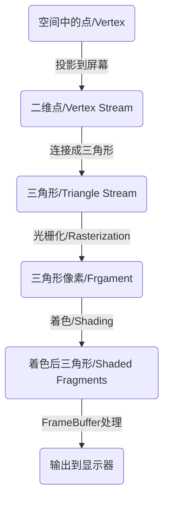

> 主讲: [闫令琪](https://sites.cs.ucsb.edu/~lingqi/)  
> 课程主页: https://games-cn.org/intro-graphics/  
> B站回放: https://www.bilibili.com/video/BV1X7411F744  

## Lecture 1 概论

**图形学定义**: 用计算机合成与操作视觉信息

**图形学应用**: 游戏/ 电影/ 动画/ 设计/ 可视化/ 虚拟现实(Virtual Reality)/ 增强显示(Augmented Reality) (VR看不到现实, AR可以看到现实, 还可以看到额外虚拟的东西)/ 数字插画/ 模拟(特效 )/ GUI/ 排版与印刷

**图形学与计算机视觉**

- 计算机视觉做的是猜测的事情, 尝试理解, 猜测图像中的信息

- 图形学做的事准确的事情, 将信息表现为图形

  ```mermaid
  graph LR
  mod(模型) --图形学>渲染--> img(图像)
  img --计算机视觉--> mod
  mod --图形学>模拟/建模--> mod
  img --计算机视觉>图形处理--> img
  ```

**难点**: 

- 创建并与虚拟世界交互
- 了解材料的物理性质
- 新的计算与显示技术

**课程大纲**

- 光栅化(Rasterization): 将三维几何形体显示在屏幕上
- 几何, 曲线与曲面(Curves and Meshes): 如何得到曲线与曲面, 用简单曲面得到复杂曲面, 在形变时曲面变化
- 光线追踪(Ray Tracing)
- 动画与模拟(Animation and Simulation)

## Lecture 2 线性代数复习

**图形学需要知识**

- 线性代数/ 微积分/ 统计学
- 光学/ 力学
- 信号处理/ 数值分析

**向量**

- 向量只有长度与方向没有绝对的始终点. 加减遵循平行四边形法则

- 默认使用列向量, 也可以写作$(x,y,z)^T$

- 用$\| \vec{a} \|$表示向量长度

- 用$\hat{a}$表示与$a$向量同方向的单位向量, 即$\hat{a} = \vec{a} / \| \vec{a}\|$

- 向量点乘

  - $\vec{a} \cdot \vec{b} = \|\vec{a}\|\|\vec{b}\|\cos\theta$, 即$\cos\theta = \hat{a}\cdot\hat{b}$

  - 在笛卡尔坐标系下
    $$
    \vec{a} \cdot \vec{b} = \left(\begin{matrix}x_a\\ y_a\end{matrix}\right) \cdot \left(\begin{matrix}x_b\\ y_b\end{matrix}\right) = x_ax_b+y_ay_b
    $$

    $$
    \vec{a} \cdot \vec{b} = \left(\begin{matrix}x_a\\ y_a\\ z_a\end{matrix}\right) \cdot \left(\begin{matrix}x_b\\ y_b\\ z_b\end{matrix}\right) = x_ax_b+y_ay_b+z_az_b
    $$

  - 向量点乘满足交换与分配率

  - 应用: 求两向量夹角 / 求向量在另一个向量上的投影 / 两个向量之间的垂直距离(投影向量减一下) / 描述两个向量有多接近 / 描述两个向量的前后关系(点积正负)

- 向量叉积

  - 输入两个向量$\vec{a}, \vec{b}$, 得到与两个向量都垂直的向量

    - 大小: $\|\vec{a}\| \|\vec{b}\| \sin\theta$
    - 方向: 使用右手螺旋法则从$\vec{a}$握到$\vec{b}$, 拇指指向

  - 在笛卡尔坐标系中
    $$
    \vec{a} \times \vec{b} = \left(\begin{matrix}x_a\\ y_a\\ z_a\end{matrix}\right) \times \left(\begin{matrix}x_b\\ y_b\\ z_b\end{matrix}\right) = \left(\begin{matrix}y_az_b-y_bz_a\\ z_ax_b-z_bx_a\\ x_ay_b-x_by_a\end{matrix}\right)
    $$
    矩阵表示
    $$
    \vec{a} \times \vec{b} = A^* b = \left(\begin{matrix}0&-z_a&y_a\\z_a&0&-x_a\\-y_a&x_a&0\end{matrix}\right) \left(\begin{matrix}x_b\\y_b\\z_b\end{matrix}\right)
    $$
    注意矩阵表示时$A^*$是一个整体表示dual matrix, 不要当成乘号

  - 不满足交换率( $\vec{a} \times \vec{b} = - \vec{b} \times \vec{a}$ ), 满足分配率

  - 应用: 

    - 建立三维直角坐标系(右手系)
    - 判定左右: $\vec{a} \times \vec{b} > 0$说明$\vec{b}$在$\vec{a}$左边
    - 判断点在多边形内: 以三角形为例, 判断点$P$在三角形$ABC$内即判断$\vec{AB} \times \vec{AP}$, $\vec{BC} \times \vec{BP}$, $\vec{CA} \times \vec{CP}$是否同号(顶点枚举顺序不重要), 我们称叉积为$0$的情况为conner case, 随你把他定义为在内部还是外部

  

  **矩阵**

  - 矩阵乘法中结果矩阵的$m$行$n$列就是第一个矩阵的$m$行乘第二个矩阵$n$列(虽然有点废话, 但是蛮好用的)
  - 矩阵乘法没有交换率, 有结合率与分配率. $(AB)^T = B^TA^T$
  - 应用: 对图像中的点应用变换

## Lecture 3 Transformation - 模型变换

两种变换:

- 模型变换: 模型变(仿射变换)
- 视图变换: 摄像机变(投影, 3D转2D...)

### 二维变换

就是利用矩阵将每个点进行线性变换, 做变换相当于求解矩阵, 也就是用n个点求一个n元一次方程. 注意, 所有的变换都默认基于原点

- 缩放(Scale)

  将图像缩放$S_{a,b}$倍相当于将每个点$x \to x\times a, y \to y\times b$, 可以用矩阵简单描述变换
  $$
  \left[
  \begin{matrix}
  x'\\y'
  \end{matrix}
  \right]=\left[
  \begin{matrix}
  s_x&0\\0&s_y
  \end{matrix}
  \right]\left[
  \begin{matrix}
  x\\y
  \end{matrix}
  \right]
  $$
  图形关于$oy$对称就相当于是缩放$S_{-1,1}$

- 切变(Shear)

  大概长这样

  

  不知道如何变换的时候就列n元一次方程, 首先发现$y$是不变的, 就看$x$, 找$(1,0)\to(1,0)$, $(0,1)\to(a,1)$
  $$
  \left\{
  \begin{align}
  1 = 1k_x + 0k_y\\
  a = 0k_x + 1k_y
  \end{align}
  \right.
  $$

  很容易推算出$k_y = a, k_x = 1$, 于是得到矩阵
  $$
  \left[
  \begin{matrix}
  x'\\y'
  \end{matrix}
  \right]=\left[
  \begin{matrix}
  1&a\\0&1
  \end{matrix}
  \right]\left[
  \begin{matrix}
  x\\y
  \end{matrix}
  \right]
  $$

- 旋转(Rotate)

  默认旋转基于原点, 以逆时针为正方向. 使用$R_\theta$表示旋转了$\theta$

  

  假设旋转了$\theta$只需要找两个特殊点就可以求得矩阵, 这里采用$(1,0)\to(\cos\theta, \sin\theta)$与$(0,1)\to(-\sin\theta, \cos\theta)$方便消元
  $$
  \left\{\begin{align}
  (\cos\theta, \sin\theta)^T = (k_{xx}\times1+k_{xy}\times 0, k_{yx}\times1+k_{yy}\times 0)^T \\
  (-\sin\theta, \cos\theta)^T = (k_{xx}\times0+k_{xy}\times 1, k_{yx}\times0+k_{yy}\times 1)^T
  \end{align}\right.
  $$
  于是得到旋转矩阵
  $$
  \left[
  \begin{matrix}
  x'\\y'
  \end{matrix}
  \right]=\left[
  \begin{matrix}
  \cos\theta&-\sin\theta\\ \sin\theta&\cos\theta
  \end{matrix}
  \right]\left[
  \begin{matrix}
  x\\y
  \end{matrix}
  \right]
  $$

- 平移(Translation)

  用$T_{tx,ty}$描述将点平移$(t_x, t_y)$. 平移不属于上述线性变换, 没法用二阶矩阵乘法描述这种变换, 可以采用如下方法表示
  $$
  \left[
  \begin{matrix}
  x'\\y'
  \end{matrix}
  \right]=\left[
  \begin{matrix}
  1&0\\0&1
  \end{matrix}
  \right]\left[
  \begin{matrix}
  x\\y
  \end{matrix}
  \right]+\left[
  \begin{matrix}
  t_x\\t_y
  \end{matrix}
  \right]
  $$
  我们希望将线性变换与平移用一个统一的方式表现出来. 于是想到了使用**齐次坐标**(Homogeneous Coordinates)表示法, 为将每个点/向量增加一维

  - 点: $(x,y)^T \to (x,y,1)^T$
  - 向量: $(x,y)^T \to (x,y,0)^T$

  用第三维$w$为非$0$表示点, $w=0$表示向量. $w\neq0$时的点$(x,y,w)^T$可以认为是$(x/w, y/w, 1)^T$. 两个点相减就是向量(所以向量$w = 0$), 看起来这种表示方法比较符合数学定义

  - 向量加减还是向量: $(x_1,y_1,0)\pm (x_2,y_2,0) = (x_1+x_2, y_1+y_2, 0)$
  - 点减点是向量: $(x_1,y_1,1)- (x_2,y_2,1) = (x_1-x_2, y_1-y_2, 0)$
  - 点加点是两点的中点: $(x_1,y_1,1)+ (x_2,y_2,1) = (x_1+x_2, y_1+y_2, 2) = (\frac{x_1+x_2}{2}, \frac{y_1+y_2}{2}, 1)$

  平移$T_{tx,ty}$可以写作
  $$
  \left[
  \begin{matrix}
  x'\\y'\\1
  \end{matrix}
  \right]=\left[
  \begin{matrix}
  1&0&t_x\\0&1&t_y\\0&0&1
  \end{matrix}
  \right]\left[
  \begin{matrix}
  x\\y\\1
  \end{matrix}
  \right]
  $$
  很容易理解, 第三列可以被认为是偏移量

  我们称旋转, 缩放, 切变, 平移为仿射变换, 所有仿射变换矩阵第三行均为$[0,0,1]$

- 矩阵乘法有结合律无交换律

  矩阵满足结合率, 例如我们先用一个旋转的矩阵$M_R$再用一个缩放矩阵$M_S$, 处理$P$, 我们可以写$P' = M_S (M_R P)$, 利用矩阵乘法结合律, 也可以写作$P' = (M_S M_R) P$

  对于如下矩阵
  $$
  \left[
  \begin{matrix}
  x'\\y'\\1
  \end{matrix}
  \right]=\left[
  \begin{matrix}
  \cos\theta&-\sin\theta&t_x\\ \sin\theta&\cos\theta&t_y\\0&0&1
  \end{matrix}
  \right]\left[
  \begin{matrix}
  x\\y\\1
  \end{matrix}
  \right]
  $$
  我们知道他即应用了旋转又应用了平移. 我们定义的旋转是基于原点的, 此时旋转与平移的顺序会影响成像

  

  模拟一下先旋转后平移与先平移后旋转可以轻松得到这个矩阵是先旋转后平移的. 我们可以得, 用同一个矩阵表示线性变换与平移时应该**先线性后平移**

- 逆矩阵

  在线性代数中若$M N = I$则$N, M$互为逆矩阵. 在线性变换中, 一个变换矩阵的逆矩阵$M^{-1}$做与变换矩阵$M$完全相反的事情(例如$M$是旋转$45^\circ$平移$(1,2)$, $M^{-1}$则是平移$(-1,-2)$旋转$-45^\circ$). 补充: 旋转矩阵是正交矩阵, 即旋转矩阵的转置就是他的逆矩阵

### 三维变换

三维变换可以用二维变换类比得到, 只是三维的向量是$(x,y,z,0)^T$, 三维的点是$(x,y,z,1)^T$或$(x,y,z,w)^T = (x/w,y/w,z/w,1)^T$, 三维变换矩阵是四阶矩阵

- 缩放
  $$
  S(s_x, s_y, s_z) = \left(\begin{matrix}
  s_x&0&0&0\\0&s_y&0&0\\0&0&s_z&0\\0&0&0&1
  \end{matrix}\right)
  $$

- 平移
  $$
  T(t_x, t_y, t_z) = \left(\begin{matrix}
  1&0&0&t_x\\0&1&0&t_y\\0&0&1&t_z\\0&0&0&1
  \end{matrix}\right)
  $$

- 旋转比较麻烦

  **绕坐标轴旋转**

  - 关于$ox$转$\alpha$
    $$
    R_x(\alpha) =\left(\begin{matrix}
    1&0&0&0\\0&\cos\alpha&-\sin\alpha&0\\0&\sin\alpha&\cos\alpha&0\\0&0&0&1
    \end{matrix}\right)
    $$
  
  - 关于$oz$转$\alpha$
    $$
    R_z(\alpha) =\left(\begin{matrix}
    \cos\alpha&-\sin\alpha&0&0\\
    \sin\alpha&\cos\alpha&0&0\\
    0&0&1&0\\
    0&0&0&1\\
    \end{matrix}\right)
    $$
    
   - 关于$oy$转$\alpha$
  $$
  R_y(\alpha) =\left(\begin{matrix}
  \cos\alpha&0&\sin\alpha&0\\0&1&0&0\\ -\sin\alpha&0&\cos\alpha&0\\0&0&0&1
    \end{matrix}\right)
  $$
  
  关于$oy$旋转矩阵的负号位置看起来有点怪? 其实没问题, 绕$ox$转我们用$yz$, 绕$oz$转我们用$zy$,  绕$oy$转我们用$zx$都是按照右手系顺序转的. 
  
  **绕任意过原点向量旋转**
  
  人们通过飞机可以做出任意姿态类比认为任意旋转姿态都可以由绕$ox, oy, oz$旋转得来. 于是绕任意过原点轴旋转可以分解为分别绕$ox, oy, oz$旋转
  $$
  R_{x,y,z}(\alpha, \beta, \gamma) = R_{x}(\alpha)R_{y}(\beta)R_{z}(\gamma)
  $$
  也有现成的罗德里格旋转公式(Rodrigues' rotation formula)计算绕任意过原点向量($n$)旋转公式
  $$
  R(\vec{n},\alpha) = \cos(\alpha)\vec{I} + (1-\cos(\alpha))\vec{n}\vec{n}^T+\sin(\alpha)\left(\begin{matrix}
  0&-n_z&n_y\\n_z&0&-n_x\\-n_y&n_x&0
  \end{matrix}\right)
  $$
  最后一个大矩阵就是叉积的矩阵表示
  
  **罗德里格旋转公式证明**
  
  - 向量叉积的几何意义
  
    设向量$\vec{k}$为垂直于向量$\vec{v}$的单位向量. 向量$\vec{v} \times \vec{k}$的方向垂直于$\vec{v}$, $\vec{k}$所成平面, 长度为$\|v\| \|k\| \sin 90^\circ = \|v\|$, 可以理解成$\vec{v} \times \vec{k}$是$\vec{v}$绕$\vec{k}$旋转$90^\circ$
  
  - 向量分解
  
    考虑$v\in R^3$的三维旋转问题，旋转轴$k$是单位向量，旋转角为$θ$，旋转后向量为$v_{rot}$, 向量$v$可以分解为平行于$k$的分量$v_\parallel$和正交于$k$的分量$v_\perp$, 显然有$v = v_\parallel + v_\perp$, 如图:
  
    
  
    尝试表示$v_\parallel$与$v_\perp$, 有
    $$
    v_\parallel = (v\cdot k)k \\
    v_\perp = v - v_\parallel = v-(k\cdot v)k = -k\times (k\times v)
    $$
    其中$v_\perp$的最后一步推导如下
  
    
  
    首先找得到$v$, $k$, 可以看到$k\times v$长度为$\|v\| \sin(<k,v>)$, 方向与$k, v$所在平面垂直, $k\times (k\times v)$长度为$\|v\|$, 方向与$k, (k\times v)$所在平面垂直, 此时$k, k\times v, k\times(k\times v)$两两垂直, 相当于我们在在$k, v$所在平面上建立了坐标系. $v_\perp$与$k\times (k\times v)$平行反向, 大小为$\|v\| \sin(<k,v>)$, 也就是$-k\times (k\times v)$
  
    再看$v$与$v_{rot}$, 可以看到两个向量都被分解为了平行与垂直向量. 在旋转中, $v_\parallel$不变, $v_\perp$发生了$\theta$角旋转, 即 $v_{\perp rot} = v_\perp\cos\theta+(k\times v)\sin\theta $
    $$
    \begin{align}
    v_{rot} &= v_{\parallel rot} + v_{\perp rot}\\
    &= v_\parallel + v_\perp\cos\theta+(k\times v)\sin\theta\\
    &= v_\parallel + (v-v_\parallel)\cos\theta+(k\times v)\sin\theta \\
    &= \cos\theta v + (1-\cos\theta)v_\parallel + \sin\theta k\times v\\
    &= \cos\theta v + (1-\cos\theta)(k\cdot v)k+\sin\theta k\times v\\
    \end{align}
    $$
    整理成矩阵形式就是
    $$
    v_{rot} = R(\vec{n},\alpha) v
    $$
  
    $$
    R(\vec{k},\alpha) = \cos(\alpha)\vec{I} + (1-\cos(\alpha))\vec{k}\vec{k}^T+\sin(\alpha)\left(\begin{matrix}
    0&-k_z&k_y\\k_z&0&-k_x\\-k_y&k_x&0
    \end{matrix}\right)
    $$
  
## Lecture 4 Transformation - 观测变换

观测变换的目的是将三维空间中的物体变为二维, 观测变换又分为视图变换与投影变换

变换有三步

- 模型变换(model transformation)是将模型放在一个需要的地方
- 观测变换的视图变换(view transformation)是将摄像机放在需要的地方
- 观测变换的投影变换(projection transformation)就是将三维场景投射到显示器上

将三个变换合称为MVP变换

### 视图变换

视图变换就是将相机放在想要放的地方, 描述相机位置应该有: 相机位置(Position)$\vec{e}$, 相机的观测方向(gaze direction)$\hat{g}$, 相机朝上方向(up direction)$\hat{t}$


当相机与观测物体同时移动但相对静止时观测的场景应该是不变的, 于是我们希望将相机放在一个固定位置, 只让场景动. 约定相机始终在原点, 看向$oz$负方向, $oy$为朝上方向


将相机从任意位置移动到原点只需做几次仿射变换

- 平移$(-x,-y,-z)$
- 将$\hat{g}$转动到$-oz$
- 将$\vec{t}$转动到$oy$
- 将$\hat{g} \times \vec{t}$转动到$ox$

将向量旋转到坐标轴不太好写, 我们可以先将坐标轴旋转到向量然后求逆矩阵(由于旋转矩阵是正交矩阵, 矩阵的转置就是逆矩阵), 最后得到
$$
\left[\begin{matrix}
x_{\hat{g}\times \hat{t}}&y_{\hat{g}\times \hat{t}}&z_{\hat{g}\times \hat{t}}&0\\x_{t}&y_{t}&z_{t}&0\\x_{-g}&y_{-g}&z_{-g}&0\\0&0&0&1\\
\end{matrix}\right]
\left[\begin{matrix}
1&0&0&-x_e\\0&1&0&-y_e\\0&0&1&-z_e\\0&0&0&1\\
\end{matrix}\right]
$$

### 投影变换

投影就是将3D转为2D的过程, 分为正交投影(Orthographic projection)与透视投影(Perspective projection)


- 透视投影(左): 认为摄像机是一个点, 考虑人类视觉特性, 平行线可能不平行, 有近大远小效果.
- 正交投影(右): 认为摄像机是一个距离物体无限远, 按照物体本身属性投影, 平行线仍旧平行, 没有近大远小效果, 一般用于工程制图

**正交投影**

正交投影实现思路简单, 

- 将场景包裹在一个立方体中
- 将场景中心移动到原点
- 将立方体缩放到$[-1,1]^3$的立方体(canonical cube)中(非等比缩放) 
- 将所有点的$z$值设为0即可(忽略覆盖问题)

这里是在视图变换结束之后将场景移动到中心并缩放到正则立方体中, 不会影响摄像机位置, 后续会通过视口变换等方法解决平移与非等比缩放等带来位置的问题


定义远(f)近(n)左(l)右(r)上(t)下(b)容易得到变换矩阵
$$
M_{ortho} = 
\left[\begin{matrix}
\frac{2}{r-l}&0&0&0\\0&\frac{2}{t-b}&0&0\\0&0&\frac{2}{n-f}&0\\0&0&0&1
\end{matrix}\right]
\left[\begin{matrix}
1&0&0&-\frac{r+l}{2}\\0&1&0&-\frac{t+b}{2}\\0&0&1&-\frac{n+f}{2}\\0&0&0&1
\end{matrix}\right]
$$
**透视投影**


我们可以将需要描述的物体放在左边这样的视锥(Frustum)中, 可以这样理解视锥: 从摄像机(原点)处往外看, 可见范围就是一个锥体, 我们截出一个台出来, (当然, 这个棱台的边会汇聚到原点)

用如下的方法定义一个视锥: 视野的长宽比, 视野范围(水平/垂直可视角度)


- 宽高比: $Aspect = x_{right} / y_{top}$
- 垂直可视角: $\tan\frac{forY}{2} = \frac{y_{top}}{\|z_{near}\|}$

我们想要做的就是将这个椎体投影到屏幕上, 解决方法是**先将椎体"压"到右边的一个立方体(Cuboid)中, 然后再做正交投影**. 在变换过程中我们可以保证

- Near面是完全不变的. 
- 在"压"的过程中Far面上各个点的$z=f$(但这不意味着椎体内部点在压的过程中z值不变)
- 由于Frustum的轴心穿过$oz$, 所以Far面的中心仍然在$oz$轴上

需要做的就是求挤压矩阵$M_{persp\to ortho}$

从$ox$负方向看视锥


通过相似三角形可以轻松得到
$$
y' = \frac{n}{z}y
$$
类似的可以得到
$$
x' = \frac{n}{z}x
$$
得到了部分变换
$$
(x,y,z,1)^T \to (nx/z, ny/z, ?, 1)
$$
这里我们进行一个小的等价变换(以节省计算资源?)
$$
(x,y,z,1)^T \to (nx/z, ny/z, ?, 1) = (nx, ny, ?, z)
$$
就剩下$z$不知道怎么求了(也就是变换矩阵的第三行不知道是什么), 设其为$(a,b,c,d)$, 我们应该有$(a,b,c,d)^T(x,y,z,1) = z'z$

- 近平面上的点不变, 即: $z = n$时, $z' = z$, 即$x,y$应该与$z$无关, 即$a = b = 0$, 同时$c \times n + d = n^2$
- 远平面中心点不变, 即: $c\times f + d = f^2$

求得: $c = n+f, d = -nf$, 最后得到透视投影矩阵
$$
M_{persp\to ortho} = \left[\begin{matrix}n&0&0&0\\0&n&0&0\\0&0&n+f&-nf\\0&0&1&0\end{matrix}\right]
$$

## Lecture 5 Rasterization - 三角形

完成变换之后, 我们将物体缩放到了一个$[-1,1]^3$的正则Cube中, 之后需要将其光栅化(Rasterize)到屏幕(Raster)上

### 光栅显示设备

- 激光切割机

- 示波器

- 阴极射线管(CRT): 通过两个偏转磁场将电子打在荧光屏上, 通过扫描的方式实现覆盖, 后又通过隔行扫描的方式减少时间开销, 但是在扫描运动场景时会造成画面撕裂(鬼影)

- 通用显示器(LCD/ LED/ OLED...): 将显存中区域映射到图像

- LCD显示器

  

  液晶显示器前后有两个垂直的光栅. 正常情况下只有波动方向相同的光才能通过光栅, 即不应该有光通过相互光栅, 液晶显示器中的液晶可以通过震动引导光改变波动方向从而操作需要显示的部分

- 墨水屏: 有黑白两种分别带电墨水, 通过加电改变两种颜色墨水朝向

### 光栅化

光栅化就是将三维图形显示到屏幕上的过程. 可以认为屏幕就是一个内存中的二维数组(左下角为$(0,0)$, 像素$(x,y)$的中心在$(x+0.5,y+0.5)$)

**将Cube缩放到屏幕(视口变换)**

忽略$z$, 将$[-1,1]$缩放到$[0, width]\times [0,height]$.
$$
M_{viewport} = \left[\begin{matrix}
\frac{width}{2}&0&0&\frac{width}{2}\\0&\frac{height}{2}&0&\frac{height}{2}\\0&0&1&0\\0&0&0&1\\
\end{matrix}\right]
$$
**使用三角形表述图像**

一般用三角形表述复杂的图像, 原因是

- 三角形只能构成一个平面(四边形就可以折叠成立体的)
- 不存在凹多边形, 容易判断点与三角形关系
- 只需要定义三角形顶点信息就可以在内部轻松插值
- 三角形可以表示任意多边形

**通过采样(simple)将三角形打碎在像素上**

采样就是将函数离散化的过程, 对于三角形光栅化来说就是询问每一个像素在不在三角形内

判断像素是否在三角形内就是通过叉积判断像素中心点与三角形关系

**通过Bounding Box缩小采样范围**

对每一个像素都采样消耗过大. 显然, 只有$[x_{min}, x_{max}]\times [y_{min}, y_{max}]$范围内的点才有可能落在三角形内, 所以只遍历这个区域. 我们称这样三个顶点的最大最小值围成的矩形为Bounding Box. 

Bounding Box也是有缺点的, 例如一些斜放的窄长三角形, Bounding Box会多算很多像素


我们可以优化一些特殊情况, 例如倾斜三角形可以从每行的一边开始从左到右采样


**锯齿(Jaggies) / 走样(asing)问题**

每个像素都有一定大小, 这导致我们的采样频率是一个常数, 采样频率过低时会出现走样问题


## Lecture 6 Rasterization - 反走样与深度测试

### 反走样

**走样的原因**: 像素有一定尺寸, 采样频率不足

**常见走样**: 锯齿 / 摩尔纹 / 车轮效应(wagon wheel illusion)...

**采样频率带来走样的原因**: 

可以看到, 使用同样的采样频率采样低频信号时, 采样结果(蓝色虚线)可以基本还原原函数, 但采样高频信号时还原能力变差(没法恢复信息)


使用同样的采样频率采样蓝黑两个函数得到同样的结果, 我们无法通过采样结果区分他们, 这就是走样 


**解决方案**: 先过滤图像的高频部分再采样, 也就是先模糊再采样, 其有效的原因如下

- 可以通过傅立叶变换得到图片的频谱

  

  这样理解图像的频谱: 假设我们用灰度值作为$oz$轴, 我们可以在原图上得到一个三维坐标系. 对这个图做傅立叶变换, 即用波函数叠加逼近图像, 每个波函数大概是这样的

  

  他们叠加最后逼近图像, 例如

  

  我们需要在频谱图中描述这些三维波函数. 我们需要用频率$f$, 幅度$A$, 相位$\phi$描述二维波函数, 在三维中我们还要用方向$\vec{n}$描述波的运动方向. 在频谱图中, 我们用点到中心的距离描述频率$f$高低, 用点的亮度描述幅度$A$, 用中心到点的方向描述方向$\vec{n}$. 可以看到在右边频谱中, 大部分点在低频(大多自然图像都是这样的). 我们还可以看到中间有两条两线, 这是因为波函数的定义域是$\mathbb{R}^2$, 我们需要不断的将图像上下边, 左右边拼接在一起, 最后得到无限大的图片, 但是图片上下边, 左右边差距过大, 所以会出现高频. 

- 对频谱应用低通滤波器

  

  图像变模糊 (变化剧烈(边缘)的部分被抹去了)

- 对频谱应用高通滤波器

  

  边缘被提取了

- 我们希望去掉高频信号, 这样可以让采样的结果走样减少. 而去掉高频会让图像变模糊. 但是会有一些采样点出现颜色过渡

  

  我们可以采用对图像做卷积替代傅立叶变换-滤波-逆变换的方法让图像变模糊(在时域上做卷积相当于在频域上做乘积), 采用非常简单卷积方法$color[x,y] = \sum_{i=-1}^{i=1}\sum_{j=-1}^{j=1}color[x+i,y+j]/9$

**注意**: 先模糊再采样而不能先采样再模糊, 原因如下

- 采样相当于用狄卡拉梳状函数乘以时域上的函数, 相当于在频域上卷积, 最后得到了重复的一堆函数

  

- 如果采样间隔过大, 就会造成重复函数在高频上的叠加, 产生走样

  

- 模糊操作相当于过滤掉了高频部分, 从而在采样时不产生叠加

  

- 先采样后模糊相当于先发生了高频叠加, 然后载过滤掉一部分叠加部分, 所以效果不好

除了简单卷积, 我们可以通过提高采样率(超采样技术(Supersampling, MSAA))再求均值的方法让图像变模糊, 例如下面是一个$2\times 2$的MSAA

- 我们将一个像素点变为$2\times 2$个像素点, 用每个小像素点采样(计算是否在三角形内)

  

  - 然后对每个像素求平均

  

  

显然, $n\times n$的MSAA需要消耗直接采样$n^2$倍的时空, 在工业中, 我们可以重新定义小像素的排列位置实现小像素在像素间的复用


还有更多的反走样方法: 例如FXAA(先采样得到锯齿图, 然后匹配锯齿, 替换锯齿), TAA(与上下帧对对比判断点是否在三角形内)

### 深度测试

之前没有考虑光栅化过程中图像在$oz$轴上的覆盖关系, 有可能出现靠后的图像覆盖在考前的图像前

处理覆盖关系的朴素想法是根据三角形距离排序, 先画距离远的, 再画距离近的, 后画的覆盖之前画的, 但是经常会遇到循环覆盖等问题(三角形各个点处$z$值可能不同), 例如


为了解决这个问题, 引入了深度缓存技术. 即开一个与成品图同样大小的数组, 为每个像素记录了该像素上已经渲染的点的$z$值, 每次尝试将一个三角形渲染在该点上时就会比较当前该点上已渲染内容的深度与三角形在该点上的深度, 如果新三角形距离相机很近就替换之. 例如左图是渲染结果, 右图是深度缓存(depth buffer)


## Lecture 7 Shading - Blinn-Phong反射模型

着色就是对不同的物体应用不同材质的过程

布林冯反射模型是用来描述光在物体上反射的简单模型. Blinn-Phong模型是一个经验模型, 不考虑阴影, 不考虑光从反射点到观察者的能量衰减, 所以模型效果不一定好, 也不一定经得起推敲

Blinn-Phong模型将光在材质上的反射分为三个区域: 

- 高光部分(Specular highlights): 光线照到发生镜面反射部分
- 漫反射区(Diffuse reflection): 光线照到发生漫反射部分
- 环境光区(Ambient lighting): 光本身照不到, 但是被其他部分光反射照到, 假设任何一个点都可以接收到大小为常量的环境光


我们假设着色点(shading point, 就是反射点)所在的面是一个小平面, shading point到光源方向$l$, shading point到观察者方向$v$, shading point所在平面法线$n$, ($l, v, n$都是单位向量)

**生成漫反射**

- 同样的光打在**单位面积**物体上时, 光与物体成角度不同, 物体接收到的光不同

  

  可以得到物体接收到的光应该是入射光强的$\cos\theta$倍, 而$\cos\theta = l \cdot n$

- 光在空间中是以球形传播的. 假设光线从光源发射传播到了半径为$1$的球面上时, 单位面积上光能量为$I$. 那么当光线到达半径为$r$的球面上时, 单位面积上光能量为$I/r^2$

- 假设漫反射是向四面八方均匀反射的, 同时不考虑反射光的能量损耗
  $$
  L_d = k_d(I/r^2)\max(0,n\cdot l)
  $$
  这里的$\max$是为了防止点积小于0(shading point在没有被光照的那面, 同时我们不考虑透明物体)

  $k_d$是漫反射系数: 表示物体吸收射入光线的能力, 比如物体是白色, 那么$k_d=0$, 所有射入光线都会被反射. 物体是黑色, 那么$k_d=1$, 所有射入光线都会被吸收, 不发生反射(一点物理知识). 一般就用颜色代表$k_d$

**生成高光反射**

在简单物理模型中, 只有镜面反射只有在入射角等于观测角的时候才能看到. 但是我们认为只要观测角和反射角差在一定范围内就可以看到光线, 只不过光线强不不同罢了


如左图, 反射光为$R$, 在$R$附近都可以看到一定强度的反射光, 我们需要衡量$R$与$v$之间的角度差以计算光强度. 我们通过半程向量$h = \frac{l+v}{\|l+v\|}$的方法衡量. 最后表述方法是
$$
\begin{align}
L_s &= k_s(I/r^2)\max (0, \cos\alpha)^p\\
&= k_s(I/r^2)\max (0, n\cdot h)^p
\end{align}
$$
$\cos\alpha$看起来比较离谱, 只有当$\alpha \geq 90^\circ$时才看不到镜面反射..., 但即使$l = -v$时$\alpha$都不到$90^\circ$, 我们需要加一个高光系数$p$, 让$(\cos\alpha)^p$快速衰减到$0$, 一般设$p$为$100-200$(p.s. 为什么不用$<R,v>$而要用半程向量呢? 因为半程向量计算更快($R$不好算). 也有用$<R,v>$的模型, 叫Phong模型, Blinn-Phong模型是他的改进)


$k_s$为镜面反射系数, 按照漫反射的思路, 这里应该表示多少光被吸收, 但是在Blinn-Phong模型不考虑这个, 一般认为镜面反射会将光全部反射出去$k_s = 1$

**生成环境光**

环境光太难算了, 我们直接认为环境光为常量$I_a$, shading point上有环境光反射系数$k_a$
$$
L_a = k_a I_d
$$

最后得到布林冯模型
$$
L = k_aI_a + k_d(I/r^2)\max(0, n\cdot l)+k_s(I/r^2)\max(0,n\cdot h)^p
$$

## Lecture 8 Shading - 着色&管线&纹理

**着色频率**

之前Shading是对某个点着色. 在渲染中我们可以将Shading应用于任何位置, 如: 三角形整个平面上 / 顶点上(内部插值) / 每个像素上. 分别对应下面三张图, 可以看到, 第二张图的在边上有明显的分异


- 应用在平面上(Flat Shading): 将着色应用于三角形面上, 整个三角形一个颜色, 我们通过三角形两边叉积求得法线

- 应用在顶点上(Gouraud Shading): 将着色应用于顶点上, 在顶点之间与三角形内部做插值. 计算顶点的发现比较困难, 我们可以计算顶点相邻的面, 根据相邻面的法线与相邻面的面积加权平均得到

  
  $$
  N_v = \frac{\sum_iN_i}{\|\sum_iN_i\|}
  $$
  叉积的结果与法线同向, 长度是面积, 正好就做了加权. 正常情况下, 我们的想法是加权后应该除以面积和$\sum_i\|N_i\|$来平均. 但是在这里老师用了$\|\sum_iN_i\|$, 因为我们已经通过面积加权的得到了方向, 现在只是想将这个超长向量化为单位向量, 所以直接除以模长就行, 不用除以每个的面积(用每个的$\sum_i\|N_i\|$求出来不一定是单位向量, 我们还要做归一化)

- 应用在像素上(Phone Shading): 先求三角形顶点的法线, 然后插值到每个像素上(注意插值后归一化), 再分别为每个像素着色

Gouraud Shading与Phone Shading都需要插值, 在三角形上可以使用重心坐标插值

**渲染管线**

渲染管线(Graphics Pipeline / Real-time Rending Pipeline): 将模型转为图像的全部过程就是渲染管线(中文看不懂也可以看到英文中的Pipeline), 也就是之前的一系列操作



可以看出, 其实三角形是我们虚拟出的概念, 实际上是不存在的

**纹理**

我们可以给三角形渲染上不同的材质/纹理(木头, 塑料...),纹理实际上就是一个二维数组, 里面存储的是每个点在布林冯模型中的反射系数/其他属性. 


我们将纹理定义在物体表面上(也就是一个二维平面), 为了让物体上的点与纹理可以一一对应, 我们想到了三角形, 只需要定义物体表面三角形对应纹理上的哪块三角形即可(三角形在映射时可以被扭曲, 但是我们希望可以尽可能少扭曲), 映射关系由艺术家完成. 一般来说我们使用将纹理定义在方形$[0,1]^2$的$u-v$坐标上

在渲染时, 为物体的每个点都定义纹理消耗太大了, 我们希望就像贴瓷砖一样复用纹理, 在设计纹理时我们需要考虑如何让纹理在接缝处出无法被看出来(下图就是为宫殿贴上重复的瓷砖)


## Lecture 9 Shading - 纹理

**重心坐标插值**

在深度缓存, 顶点着色, 像素着色, 纹理贴图时我们都需要进行插值, 在三角形中, 可以使用重心坐标插值. 

重心坐标是一个三元组$(\alpha,\beta,\gamma)$, 对于三角形$ABC$与点$P$, 重心坐标满足
$$
\left\{\begin{align}
&P = \alpha A + \beta B + \gamma C\\
&\alpha + \beta + \gamma = 1\\
&\alpha \geq 0\\
&\beta \geq 0\\
&\gamma \geq 0\\
\end{align}\right.
$$

- 当$(\alpha,\beta,\gamma)$满足$\alpha + \beta + \gamma = 1$时, $P$在三角形$ABC$所在平面上
- 当$(\alpha,\beta,\gamma)$还满足$\alpha \geq 0,  \beta \geq 0, \gamma \geq 0$时, $P$在三角形$ABC$内

应用"奔驰定理"可以得到
$$
\left\{\begin{align}
&\alpha = S_{PBC}/S_{ABC}\\
&\beta = S_{PAC}/S_{ABC}\\
&\gamma = S_{PAB}/S_{ABC} = 1-\alpha-\beta\\
\end{align}\right.
$$
缺点: 点与三角形在投影后重心坐标会发生变化

**纹理放大**

在三维场景中, 我们可以通过移动摄像机的位置放大或缩小图像(透视原理), 若场景被放的很大(比如凑在脸前面看人), 某个整数像素会对应到纹理坐标中的小数像素(纹理中的像素也被称为纹素/ Texel), 我们需要采用一系列方法对这个小数坐标值进行差值获得该点纹理

- Nearest: 直接将小数下标四舍五入. 这会造成多个像素显示一个纹素, 从而发生走样, 如右图中的Jaggies

  

- 双线性插值(Bilinear interpolation): 对于一个小数位置$P$, 我们找$P$邻近的四个纹素, 记$P$到左下角纹素的距离为$t, s$, 同时易知$y_{u_{00}, u_{01}} = x_{u_{00}, u_{10}} = 1$ 

  

  定义一个一维线性插值($x$在$v_0v_1$上): $lerp(x,v_0,v_1) = v_0+x(v_1-v_0)$

  我们分别对点$P$投影在$u_{01}u_{11}$与$u_{00}u_{10}$的位置做线性插值, 即: $u_0 = lerp(s, u_{00}, u_{10})$与$u_1 = lerp(s, u_{01}, u_{11})$得到第一次插值结果

  

  之后在垂直方向做一次线性插值 $u = lerp(t, u_{0}, u_{1})$

  于是我们得到$P$点的双线性插值$lerp(t, u_{0}, u_{1})$

- 三线性插值(Bicubic interpolation): 就是将双线性插值时选取周围4纹素换成选16纹素

三种方法效果如下


双线性插值性价比更高一些

**纹理缩小**

在三维场景中, 我们可以通过移动摄像机的位置放大或缩小图像(透视原理), 若场景被放的很小(比如看远处的山), 某个整数像素会覆盖到纹理坐标中的多个纹素, 我们需要将覆盖的一片区域转为一个像素

如果简单的将像素中心对应到纹理中心, 我们就会因采样率不足而得到摩尔纹(右图远处Moire)


最简单的方法就是使用朴素的MSAA超采样, 但是消耗过大, 我们需要一个快速超采样的办法. 将一个像素映射到一个纹素区域, 然后快速得到这个区域的纹素均值

- 采用近似的方法获得纹素覆盖的纹像区域: 对于像素P, 我们先获P及其上边与右边像素在$u-v$坐标系中对应的纹素坐标, 测量上方与右方纹素到P对应纹素距离. $L_1, L_2$. 取两者最大值作为覆盖范围的边长并构建正方形

  

  可以用微分表达
  $$
  L = \max\left( \sqrt{\left(\frac{du}{dx}\right)^2+\left(\frac{dv}{dx}\right)^2},\sqrt{\left(\frac{du}{dy}\right)^2+\left(\frac{dv}{dy}\right)^2}  \right)
  $$

- 区间求和可以采用树状数组实现, 这里采用了类似的**MipMap**实现, 该方法不像树状数组一样可以精确查询区间$[l,r]$的均值, 其只能获得近似值, 并只能查询一个正方形区间, 但是时间复杂$O(1)$, 空间复杂度$O(n)$

  1. 预处理纹理宽高为$2$的整次幂时的各像素均值

     

  2. 看起来就是做了个分块, 正常的想法是在查询时先查大分块, 到边缘时查小分块. 这样的时间复杂度是$O(logn)$, 

     Mipmap的做法是: 选一个比查询区间边长稍大的块然后获取其值, 对于边长为$l$的正方形, Mipmap直接去$level\ [log_2l]$图中查询像素中心点对应点纹素. 

     由于$level\ n$图比$level\ 0$图小了$2^n$倍, 我们需要查询的整数像素对应到纹素坐标中可能是小数. 在这里可以采用双线性插值的方法实现过渡. 

     这样的查询方法可以将时间复杂度做到$O(1)$, Mipmap占用空间也仅为原图的$1/3$(通过等比级数得到).

  3. 但是这样的方法会造成在level分界边缘的像素产生割裂(相邻几个像素应用了不同level的Mipmap), 我们希望可以在Level之间实现均匀过渡(即获取诸如Level 2.8上的图像), 可以在层与层之间再做一次线性插值: 计算出像素在$level\ [log_2l]$上的纹素后再计算像素在$level\ [log_2l]+1$上的纹素, 最后通过线性插值求得像素在$level\ log_2l$层的纹素

然而Mipmap的效果并不好, 他会将远处覆盖纹理比较斜的像素变模糊. (左图为朴素MSAA的结果, 右图为用Mipmap后MSAA的结果, 可以看到在渲染左上角与右上角时图像会边模糊)


与boungin box效果变差的原因类似, 当一个像素覆盖纹素区域是一个斜四边形时, 这导致覆盖正方形过大, 效果边模糊


可以采用**各向异性过滤**缓解这个问题


在Mipmap预处理不同尺寸正方形的基础上预处理不同尺寸的长方形, 这样在近似求覆盖面积的时候就可以将覆盖面积近似为长方形了. 这样预处理需要占用原纹理3倍的空间.

**纹理的其他用途**

- 将环境光记录为纹理 

    - Spherical Map: 可以假设在环境中央有颗光滑的球, 环境光将被投影在球面上, 那么我们可以把球面上显示的环境光当作一张贴图, 将贴图展开并存储环境光

      

    - Cube Map: 将环境环境光投射在球面上会造成纹理的扭曲, 可以将环境光投射到立方体上, 存储为六张正方形图像. 这种方法投射结果扭曲小, 但是难以存储环境光的射入方向

- 将凹凸记录为纹理

    用几何表示物体表面的凹凸太麻烦了, 这里考虑用贴图去描述表面的微小几何变化, 并在计算反射时通过贴图改变法线, 有两种实现

    - 凹凸贴图(Bump Map): 一张灰度图, 存储了每个**点**应该相对原物体上的点再凸出多少(默认黑色为0)

        

        在渲染时需要先在shading point上建立新坐标系, 然后求凹凸贴图在该点处的切线, 将切线旋转并归一化得到法线, 最后将法线从新坐标系转换到原坐标系上. 

        

        具体通过TBN实现, 实现方法: 

    - 法线贴图(Normal Map): 贴图记录的是法线值, 用贴图上每个点的$(R,G,B)^T$记录该点法线的$(x,y,z)^T$, 规定法线中每一项的值范围为$0-1$, 并在着色时候映射到$(-1,1)$

    - 位移贴图(Displacement Map): 是凹凸贴图更现代化的做法直接定义每一个**三角形顶点**的位移, 这样应用贴图后三角形上的点直接发生了变化, 这样的效果更加真实(但是计算量大)

        

        与凹凸贴图相比位移贴图直接改变了三角形, 在物体边缘与阴影上表现更好(右图右上角边缘差异, 图上的突起对其他部分突起的遮挡, 两图阴影的边缘差异)

- 三维纹理

    一般用于定义大理石, 山脉等的纹理. 一般不将其定义为一个真实的贴图, 而是由噪声动态动态生产

    

- 记录提前算好的信息

    

    我们很难计算出眼窝中的阴影, 可以直接将阴影之间定义在纹理中

## Lecture 10 Geometry - 几何表示

**几何表示分类**

- 隐式几何(Implicit): 不直接定义点, 而定义点满足的条件(例如定义球上的点$x^2+y^2+z^2=1$). 

  我们很难直接得知其表示什么结构, 但是可以很轻松的判断点在不在几何体上. 

  常见的隐式表示:

  - 代数方法: 列表达式

  - 构造立体几何法(Constructive Solid Geometry): 通过简单几何体的布尔运算(交并补)描述其他几何体

    

  - 距离函数: 不描述几何体上的点, 而描述一个点到几何体上点的距离. 这种描述方式很适合表述几何体的融合过程(我们定义SDF函数为图片上点到物体边界的距离, 将两个图像融合就是将两个距离函数相加. 距离函数为0的部分就是物体的表面)

    

  - 水平集: 提取距离函数为$n$的曲线的集合

  - 分形表示

- 显式几何(explicit): 直接给出几何体(如三角形的顶点), 或者通过参数映射的形式给出(给出参数范围, 给出参数到坐标的参数方程)

  我们很难直接得知点与几何体的关系, 但是可以很轻松的得知其表示结构
  
  常见的显式表示应用:
  
  - 点云(point cloud): 用足够密的点堆砌表面
  
  - 多边形面表示(最常用): 用多边形拼接描述复杂的物体
  
    
  
    描述物体时需要描述三角形的顶点与三角形之间的连接关系. Wavefront Object File(`.obj`)文件就采用了这种定义方法, 例如
    
    ```obj
    # Blender3D v249 OBJ File: untitled.blend
    # www.blender3d.org
    mtllib cube.mtl
    # 定义空间中的点
    v 1.000000 -1.000000 -1.000000
    v 1.000000 -1.000000 1.000000
    ...
    # 定义纹理坐标
    vt 0.748573 0.750412
    vt 0.749279 0.501284
    ...
    # 定义面上的法线
    vn 0.000000 0.000000 -1.000000
    vn -1.000000 -0.000000 -0.000000
    # 定义面
    f 1/2/8 2/9/8 3/13/8   # 用第1-2-3个点定义一个平面, 他们分别对应2-9-13个纹理坐标, 分别对应8-8-8个法线
    f 1/2/8 3/13/8 4/14/8
    ...
    ```
  
## Lecture 11 Geometry - 曲线与曲面

**曲线的显式表示**

- 贝塞尔曲线(Bezier Curves)

  - 二次贝塞尔曲线: 按顺序定义两个点$P_1$, $P_2$, 定义一个新点$P$, 取$t\in [0,1]$,  在$t=t_0$时, $P$的位置是线段$P_1P_2$上距离$P_1$长度为$t \times length_{P_1P_2}$的位置

  - 二次贝塞尔曲线: 按顺序定义三个点$P_1$, $P_2$, $P_3$, 定义三个新点$P_4$, $P_5$, $P$, 取$t\in [0,1]$,  在$t=t_0$时, $P_4$的位置是线段$P_1P_2$上距离$P_1$长度为$t \times length_{P_1P_2}$的位置,  $P_5$的位置是线段$P_2P_3$上距离$P_2$长度为$t \times length_{P_2P_4}$的位置, 连接$P_4P_5$, $P$在线段$P_4P_5$上距离$P_4$长度为$t \times length_{P_4P_5}$的位置, $P$的轨迹就是二次贝塞尔曲线

    

  - 以此类推, 三次贝塞尔曲线就是取三个线段上三个点, 连成两个线段, 取二次贝塞尔曲线在$t$时的位置, 

  - 如何实现贝塞尔曲线: 
    
    遵循贝塞尔曲线定义: $P_1\to P_2$的点可以表示为$(1-t)P_1+t(P_2)$, 递归应用即可
    
    常用的就是三次贝塞尔曲线, 我们有锚点$P_1, P_2, P_3, P_4$, 其中固定$P_1=(0,0), P_4=(1,1)$在, 变量只有$P_{2}, P_{3}$, 曲线公式为
    $$
    b(t) = P_1(1-t)^3+3P_2t(1-t)^2+3P_3t^2(1-t)+P_4t^3, t\in [0,1]
    $$
    实际效果与二次项展开类似, 可以得到更普遍的定义: 
    
    通过$n+1$个控制点可以得到$n$阶贝塞尔曲线, $b^n_j(t)$表示在$t$时刻, $n$阶第$j$个点的位置
    $$
    \begin{align}
    b^n(t) &= b^n_0(t) = \sum_{j=0}^nb_jB^n_j(t)\\
    B^n_i(t) &=\left( \begin{matrix}n\\i\end{matrix} \right)t^i(1-t)^{n-i}
    \end{align}
    $$
    其中$B^n_j(t)$为伯恩斯坦多项式, 实际说的就是二次项展开
    
  - 性质

    - $t=0$时都在起点
    - 对于三次贝塞尔: 在$t=0$时, $b^1_0(0)$与$b^1_2(0)$的运动方向切线分别为$b^{1'}_0(0)=3(b_1-b_0), b^{1'}_1(0)=3(b_3-b_2)$
    - 贝塞尔曲线上的点与控制点同时做仿射变换(投影不行), 点不变(想要对曲线做变换可以直接对控制点做变换). 
    - 贝塞尔曲线一定在控制点围成的突包内

- 逐段贝塞尔曲线(Piecewise Bezier Curves)

    当贝塞尔曲线阶数变高时, 对于$n$阶贝塞尔曲线, 我们需要$n+1$个点才能控制一个曲线, 此时曲线的控制就变困难了. 我们希望可以分段表示曲线, 然后将其拼接起来. 一般使用每四个点定义贝塞尔曲线的一段(Piecewise cube Bezier)

    

    每条曲线由两端各自的一个黑点和一个蓝点共四个控制点组成. 对于中间的点, 点上有一个共用的黑点与两个曲线各自的蓝点组成

    如果想要保证两段曲线在衔接处连续, 只需要保证在衔接处两个黑蓝线**等大共线反向**
    
- Spline: 样条曲线

**曲面的显式表示**

- 贝塞尔曲面

  可以使用四个点定义一个三阶贝塞尔曲线, 在曲面中, 可以再用16个点定义四条处于平行平面的贝塞尔曲线, 我们可以认为曲线上一个截面上的四个点是控制点, 从而构建一条贝塞尔曲线,  最后得到贝塞尔曲面

  

## Lecture 12 Geometry - 曲面操作与阴影

可以对曲面上三角形进行操作

- 曲面细分(Mesh Subdivision / upsampling): 三角形数量增加, 表示的曲面更加光滑(图$2\to 3$)
- 曲面(Mesh Simplification / downsampling): 三角形数量减少, 简化曲面(图$2\to 4$)
- 曲面正则化(Mesh Regularization / same #triangles): 让三角形面变得更加规则, 减少尖锐的三角形, 让三角形尽量接近等边三角形(图$2\to 5$)


**三角形细分**

引入更多的三角形, 同时让三角形位置相对于原来大三角形位置变化, 从而使物体变得更光滑. 常见的算法: 

- Loop Subdivision(发明者是Loop, 不要译为循环细分), 只适用于三角形

  1. 引入三角形: 三角形三边取中点, 中点间连线, 于是1个三角形变成4个

  2. 调整位置: 

     - 对于引入新顶点(中点): $P = 3/8 * (A + B) + 1/8 * (C + D)$, $A, B$为所在边的顶点. $CD$为相邻两个三角形对边顶点

     -  对于原有顶点: 
     
       $$
       \begin{align}
       P & = (1 - n*u) * original\_position + u * neighbo\_position\_sum \\
       v & = 被调整顶点度数 \\
       u & = \left\{
       \begin{matrix}
       3/16& \ &n = 3\\
       3/8n& \ &otherwise
       \end{matrix}
       \right.
       \end{align}
       $$

       注意这里是针对一个原有顶点计算的, 计算相邻点位置的时候$n$还是被调整点度数, 而不是相邻点的度数

     

- Catmull-Clark Subdivision, 适用于一般平面

  1. 定义四边形面(quad face)与非四边形面(none-quad face). 度不为4的点为奇异点(Extraordinary Vertex)

  2. 引入点: 取每个边与面的中点, 将边的中点与面的中点连接

     

     可以看到, 第一次引入新点后: 

     - 非四边形面全没了
     - 非四边形面中点变成新奇异点, 度数为原多边形面数
     - 原奇异点度数不变

  3. 调整位置

     - 对于面的中点: 位置是所在平面四个点均值
     - 对于边上中点: 位置还是相邻面中点于所在边端点均值
     - 原来的点: $\frac{\sum_if_i+2\sum_im_i+4p}{16}$, 其中$f_i$是相邻面中点, $m_i$是相邻边中点, $p$是被调整点位置

可以看到, 我们这些算法并不是根据原物体形态对顶点调整的, 而是根据已有节点获取一个新点坐标, 看起来是一种"高级的曲面插值". 这样的做法不能让细分后模型更加接近于原物体, 但是可以让模型更加光滑, 例如


**曲面简化**

有的时候我们不希望顶点太多(物体离得很远, 没必要渲染那么仔细), 所以需要曲线细分, 

算法: 边坍缩, 去掉一个边, 把相邻节点连起来

- 找到新点: 

  

  假设需要将灰色部分坍缩成三个点并产生一个蓝色的新点, 但是新点的位置难以确定. 如果采用均值会得到左边的效果, 我们使用二次度量误差(Quadric Error Metrics)评价点的位置, 让新点距离平面距离和最小.

- 找到需要坍缩的边: 为每个边计算坍缩后二次度量误差最小的边. 但是每次坍缩后其他边的二次度量误差会变化, 我们需要动态维护边的二次度量误差, 用一个Heap即可

- 这是一个贪心算法, 虽然不是最优, 但是看着不错

**阴影生成**

可以在光栅化时候进行阴影生成(Shadow Mapping). 

- Shadow Mapping是一个图像空间的做法: 在生成阴影时无需知道物体的几何信息.
- 只适用于点光源
- 会产生走样现象
- 只能生成硬阴影(一个点要么在阴影里, 要么不在阴影里)
- 存在数值精度问题

核心思想: 如果一个点不再阴影里, 那么从光源方向与摄像机方向都能看到他

实现: 

- 将光源当作摄像机维护每个点此时的Depth Buffer
- 从原摄像机点做光栅化, 对于屏幕上的每个点, 计算点到光源的距离并于上一步维护的Depth Buffer比较, 如果距离大于Depth Buffer就说明光打不到, 此处是阴影
- 由于Depth Buffer像素有尺寸(如: Depth Buffer是1080P的, 但是光栅化是2K的, 光栅化的一个像素不对应Depth Buffer上一个像素), 浮点数误差, 很难精确比较两个距离是否相等. 一般可用实际深度大于Depth Buffer深度+esp判定被遮挡. 但是依然很难准确实现

**硬阴影与软阴影**


在Shadow Mapping时, 我们认为光源是点光源, 但是实际光源是有体积的, 例如上图月食现象 中, 地球上一部分是完全看不到光的(Umbra区域), 一部分是可以看到一部分光的(Penumbra区域), 将完全看不到光的阴影称为硬阴影, 将可以看到部分光的阴影称为软阴影. 

## Lecture 13 Ray Tracing - Whitted-Style光线追踪

光线追踪与光栅化是两种**完全不同的成像方式**(相互替代)

光栅化针对单点处理, 但不能实现全局效果(软阴影,  磨砂镜面反射, 间接光照). 光追可以实现全局效果, 但是非常慢, 一般用于离线渲染(电影等)

**光线追踪的基本假设**

- 光沿直线传播(不考虑波动性)
- 光线碰撞后不改变原传播性质
- 人可以看到图像是因为光线从光源发出, 不断反射折射, 最后进入人眼. 光路是可逆的(人可以看到物体也可以认为是人眼发出了某种感知光线, 最后汇集到光源处)
- 人眼是一个点
- 光线在物体表面会发生完美折射

光线追踪就是模拟人眼发出感知光线, 通过不断反射折射最后汇集到光源的过程(汇集不到光源的感知光线就在折射反射时衰减完了...). 

**感知光线投射**


从人眼看向屏幕, 让眼睛发出的光线穿透屏幕打在物体上, 先不考虑折射与多次反射, 我们直接将着色点与光源连线, 如果连线之间没有遮挡那说明该点不在阴影中, 使用着色模型就可以计算是什么颜色. 至此, 我们得到了与光栅化相似的结果. 在光追中我们对算法进行了一些改进 

**Whitted-Style光线追踪**

一种比较古老的光追算法, 效果不是很好


我们看右侧哪个"金属球", 可以看到球上有本身的金属银色, 也有反射环境光得到的颜色. 左侧的"玻璃球"上还可以看到折射看到的背后的光 

在Whitted-Style光追中, 人眼发出的光线(eye ray / primary ray)在打到物体点上后被打散为三种光线

- eye ray通过非完美反射打到光源, 通过着色模型得到物体本身颜色
- 通过完美反射得到其他物体的颜色
- 通过折射得到的其他物体颜色


在每次反射折射后光线能量会衰弱, 可以使用递归实现该算法 

**存在的问题**

- 如何判断感知光线和哪个物体相交, 交点在哪里(我们需要让光在三维物体之间反复反射, 所以不能使用Depth Map实现)
- 反射光折射光方向与衰减计算

**光与物体交点计算**

- 光线的定义: 原点($O$)与方向(单位向量$\vec{d}$)组成, 光线就是一系列点$O+td, (0\leq t<\infty)$

- 光源与物体关系判定: 若光线与物体有偶数个交点则光源在物体外, 有奇数个交点则光源在物体内

- 光线与隐式定义曲面的交点: 将光线方程与曲面方程联立. 舍去$t$的复数根与负根, 取最小的$t$为第一个交点

- 光线与显式定义曲面的交点: 

  光线与曲面交点不是很好求, 但是光线三角形的交点还是很好求的

  - 光线与三角形求交点

    先求光线与三角形面的交点, 再判断交点在不再三角形内

    平面可以用平面上一个点$P'$及其法向量$\vec{N}$表示,  平面上任意一点$P$满足$\vec{PP'}\cdot \vec{N} = 0$, 将光线表示为$O+t\vec{d}$

    联立即可: $(O+t\vec{d}-P') \cdot \vec{N} = 0$, 使用克莱姆法则可以得到
    $$
    t = \frac{(P'-O)\cdot N}{d\cdot N}
    $$
    最后判断点是否在三角形内部

  - Moller Trumbore算法

    就是将上面步骤与重心坐标判断点与三角形位置组合在一起

    $$
    \begin{align}
    \left[\begin{matrix}
    t\\b_1\\b_2
    \end{matrix}\right]=\frac{1}{S_1\cdot E_1}
    \left[\begin{matrix}
    S_2\cdot E_2\\S_1\cdot S\\S_2\cdot D
    \end{matrix}\right]
    \end{align}
    $$

    其中
    
    $$
    E_1 = P_1-P_0\\
    E_2 = P_2-P_0\\
    S = O-P_0\\
    S_1 = D\times E_2\\
    S_2 = S\times E_1\\
    $$

  - 判断光线与每个三角形求交太慢了, 采用类似Bounding Box的思想加速求交

**Bounding Volumes**

将物体用相对简单的形状包起来, 若光线与Bounding Volumes不想交那一定不和物体相交. 为了方便计算, 我们一般用边与坐标轴平行的立方体做包围和. 在处理光线与立方体相交判定问题时我们可以采用坐标轴分解. 核心思想是: 如果点在立方体内部, 那么点与立方体投影在$xoy, yoz, zox$上时, 点都在投影矩形内部. 如果任何一个方向投影不成立, 点就不在立方体内部.

由于我们选取的立方体边都平行于坐标轴, 很容易做相交计算, 对于一个投影平面(以$xoy$为例), 只需求射线与矩形交点时$t$并对范围求交(下图先求射线与$x$交点, 再求$y$, 最后求$t$取值的交集), 对三面分别投影求交即可得到光线穿过立方体的$t$取值范围, 计$t_{enter} = t_{min}, t_{exit} = t_{max}$


讨论如下情况

- $t_{exit} < 0$: 物体在光线后面
- $t_{exit} \geq 0, t_{enter} < 0$: 光源在物体里面
- $t_{exit} \geq 0, t_{enter} < t_{exit}$: 正常情况

**利用光线与Bounding Volumes相交加速光线与曲面相交**

- Uniform Grids方法(在物体分布均匀时效果好)

  将场景均匀的分成等大的小盒子, 记录盒子与哪个物体相交, 若光线与盒子相交着判断光线与对应物体是否相交

  

  - 如何找到浅蓝色路径呢? 如果光线与一个浅蓝色格子相交, 那么下一个浅蓝色格子一定在这个格子周围八个格子
  - 格子尺寸如何确定: $格子数 \approx 27 \times 场景中物体数目$(经验公式)

- Spatial Partitions方法(在场景空旷时效果好)

  我们不希望将空间划分为等大的方块, 而是为空旷空间分配大格子, 密集空间分布小格子. 常见划分方法有: 

  

  - 八叉树(Oct-Tree): 将一个节点分为八个子节点(类似一维的二叉树). 在切割时, 若节点中有足够数量少的物体(例如节点只与一个物体相交)就停止

  - KD-Tree: 八叉树实际上是使用了二叉树的思想, 但是在高维空间中, 树的分枝数成指数倍增长(四维的16叉树), 于是提出了KD-Tree. 划分空间时依次从不同轴切物体. 切开的物体在下次切割时候独立切割(切线可以不在一起)于是可以用二叉树存储KD-Tree. 非叶子只需要保存切线, 叶子节点保存相交的曲面. 采用类似二分的方法找到第一个与光相交的叶子节点

    KD-Tree存在的问题: 难以判断物体与盒子相交. 一个物体可以出现在多个Bounding Volumes中

  - BSP-Tree: 每次将空间划分为等物体数两块. 但是BSP-Tree的切线不平行于轴线, 高维时切面难以计算

- Object Partitions & Bounding Volume Hierarchy(BVH) (综合最好)

  Spatial Partitions中判Bounding Volumes与物体关系太麻烦了, 我们可以反向操作, 通过物体生成Bounding Volumes. 然后对Bounding Volumes操作

  我们将一组物体(一个Bounding Volume)采用某种方法(例如KD-Tree思想)划分成两部分, 生成两个Bounding Volume, 递归进行多次划分与重算Bounding Volume(可以用二叉树存储这一过程). 这样一个物体只存在于一个Bounding Volume, 同时一个Bounding Volume中的物体也是已知的(例如图中虽然蓝绿Bounding Volume有交集, 但是仍然可以分清哪个三角形属于哪个区域)

  

  划分三角形的技巧

  - 每次取一个维度进行划分(划分面与坐标面平行), 但是不必要像KD-Tree一样依次划分
  - 每次将Bounding Volume最长轴砍断
  - 每次从第$n/2$个三角形处划分(计算物体重心并使用快速选择算法$O(n)$实现. 快速划分算法借助快速排序思想实现了查找第$n$大的数:在快排每次找到中间节点时只查找自己需要的那一半)
  - 当包围的节点数足够少时停止(比如5个)

## Lecture 14 Ray Tracing - 辐射度量学

辐射度量学: 精确描述光相关物理量的方法与单位, 定义了光照在空间中的属性

**Radiant Energy and Flux(Power)**

Radiant Energy: 电磁辐射出的能量, 物理量$Q$, 单位$J$

Radiant Flux(Power): 单位时间的能量类似功率, 物理量$\Phi = \frac{dQ}{dt}$, 单位$W$或$lm$(流明, 光学专用)

**Radiant Intensity**

描述辐射源的物理量, 表示**单位立体角(unit solid angle)发出**的功率
$$
I(\omega) = \frac{d\Phi}{d\omega}
$$
单位$\frac{lm}{sr} = cd$, 其中你$sr$为立体角单位

单位立体角/微分立体角

- 在二维图形中, 用弧度描述二维角, 且$\theta = \frac{l}{r}$

- 在三维图形中, 用立体角描述三维角, 且$\Omega = \frac{A}{r^2}$, A为投射球面积

  

  面积计算(利用球坐标系统)
  $$
  dA = r^2 \sin\theta\ d\theta\ d\phi
  $$
  单位立体角就是$单位面积/r^2$, $d\omega = dA/r^2=\sin\theta\ d\theta\ d\phi$

- 球体立体角为$4\pi$(设一个半径为1的球, 立体角和为面积)

**Irradiant**

描述辐射接收者的物理量, 表示**单位面积接受**的功率

物理量$E$, 单位$\frac{lm}{m^2}=lux$

此处的单位面积为与入射光线**垂直**的单位面积, 若不垂直则计算垂直分量$E = \frac{\Phi}{A}\cos\theta$

**Radiance**

描述光线的空间属性, 表示**单位立体角单位投影面积**上的功率
$$
L(p,\omega) = \frac{d^2\Phi(p,\omega)}{d\omega \cos\theta}
$$


考虑光线从一个很小的表面辐射出, 并且在一个点上向四面八方投射其在单位立体角辐射出功率就是Radiance

还可以分为Incident Radiance与Exiting Radiance, 分别表示射入与发出的能量

可以这样理解

- Irradiant: 单位面积而收到的功率
- Radiance: 单位面积单位方向收到的功率

## Lecture 15 Ray Tracing - 光线传播

**Bidirectional Reflectance Distribution Function (BRDF) 双向反射分布函数**

BRDF函数描述入射光线在物体表面的不同方向的能量反射分布. 可以将反射理解为物体表面吸收了所有入射光后将一部分光再发射出去的过程


- 单位表面吸收的从$\omega_i$方向射入能量: $dE(\omega_i) = L(\omega_i)\cos\theta_i\ d\omega_i$

- BRDF函数定义单位表面在$\omega_r$方向反射能量占接收能量占比(BRDF在每个反射方向具体值由物体材质决定)
  $$
  f_r(\omega_i\to \omega_r) = \frac{dL_r(\omega_r)}{dE_i(\omega_i)} = \frac{dL_r(\omega_r)}{L_i(\omega_i)\cos\theta_id\omega_i}
  $$

- 物体表面从任意方向接收光线在某一角度反射光(对每个入射方向积分)
  $$
  L_r(p, \omega_r) = \int_{H^2}f_r(p,\omega_i\to \omega_r)L_i(p,\omega_i)\cos\theta_i\ d\omega_i
  $$

- 上面这个方程仅考虑了从不同光源照向物体的反射光, 没有考虑间接反射

**渲染方程(Rendering Equation)**

同时考虑反射光与物体本身发出的光

$$
L_o(p, \omega_o) =L_r(p, \omega_o) + \int_{\Omega^+}f(p,\omega_i, \omega_o)L_i(p,\omega_i)(n\cdot\omega_i)\ d\omega_i
$$
对于面光源: 可以对面光源覆盖的每个立体角做积分

对于二次反射: 可以将反射来光的物体当作一个面光源处理

可以在数学形式上简化成算子微分方程
$$
L(u) = e(u) + \int L(v)K(u,v)\ dv
=E+KL
$$
$K$是入射能量, $L$是某点辐射能量算子, 应用泰勒展开求得$L=E+KE+K^2E+K^3E+...$

可以理解成点发出的能量$L=$该点直接发出的能量$E+$光源一次反射能量$KE+$两次反射能量$K^2E+...$

## Lecture 16 Ray Tracing - 蒙特卡洛路径追踪

**蒙特卡洛积分**

求定积分时的常见思路是先求不定积分, 再通过上下界获得定积分. 但是当函数较为复杂时, 不定积分不易求解. 蒙特卡洛积分是另一种积分方法. 在积分区间中随机取几个数及其对应的$f(x)$, 求这几个$f(x)$的均值, 认为定积分可以近似成
$$
\int f(x)dx = \frac{1}{N}\sum_{i=1}^N\frac{f(X_i)}{p(X_i)}
$$
$p(X_i)$为一个随机变量$X_i$在采样时被选中的概率, 当随机变量均匀在$[a,b]$采样时可以认为$p(X_i)=\frac{1}{b-a}$. 
$$
\int_a^b f(x)dx =  \frac{b-a}{N}\sum_{i=1}^Nf(X_i)
$$
**路径追踪**

Whitted-Style Ray Tracing的思想是无限弹射"感知光线", 每次记录反射点颜色. 存在问题

- 不能认为光线在物体表面发生完美镜面反射

- 将反射点直接与光源相连没有考虑漫反射(注意下图天花板与立方体侧边映射的墙面颜色)

  

可以采用图像度量学方法取代Ray Tracing. 需要做的就是解出渲染方程
$$
L_o(p,\omega_0) = L_e(p,\omega_0)+\int_{\Omega^+}L_i(p,\omega_i)f_r(p,\omega_i, \omega_o)(n\cdot \omega_i)\ d\omega_i
$$
**实现**

- 定积分求解: 蒙特卡洛积分, 在不同方向上采样, 采样区间是一个半球, $p(\omega) = 1/2\pi$(半球面立体角是$2\pi$). 在代码实现时, 只需要从着色点发出$N$条光, 求$\frac{1}{N}\sum_{i=1}^n\frac{L_i(p,\omega_i)f_r(p,\omega_i,\omega_o)(n\cdot \omega_i)}{p(\omega_i)}$
- 间接光照$L$的递归定义: 可以把间接光照的反射物体当作光源, 计算从着色点看向反射点的颜色

```
shade(p, wo)
    Randomly choose N directions wi~pdf
    Lo = 0.0
    For each wi
        Trace a ray r(p, wi)
        If ray r hit the light
        	Lo += (1 / N) * L_i * f_r * cosine / pdf(wi)
        Else If ray r hit an object at q
        	Lo += (1 / N) * shade(q, -wi) * f_r * cosine / pdf(wi)
    Return Lo
```

**问题**

- 通过这种方式求的间接光照时, 每次求间接光照都要做一个蒙特卡洛积分采样(如图, 假设一次积分采样100个点, 若这100个点都打到其他物体上, 经过$n$次间接光照我们需要做$100^{n+1}$次)

  

  规避指数爆炸最简单的方法就是将底数变成1(每次定积分只随机采一个点). 这会产生噪音(随机采样点选的不好), 但是只要穿过一个像素点的eye ray足够密集就可以避免这一问题(如图, 我们发出足够密的eye ray, 但是每次间接反射时只反射一次)

  

  **采样数$N=1$的渲染方程实现就是路径追踪**

- 没有定义递归边界

  光线是无限弹射的(虽然有损耗, 但是能量一定不会降为0, 一定是无限弹射), 计算机中不能这样. 人们引入了俄罗斯轮盘赌(Russian Roulette)的思想: 每次弹射时令光有$p$的概率继续弹射, 若随机到$p$范围内则继续弹射并将弹射结果$/p$返回, 若随机到$1-p$着直接返回$0$, 递归执行后其返回值数学期望$E = P*(Lo/P)+(1-P)*0 = Lo$

应用上述改进

```
shade(p, wo)
    Manually specify a probability P_RR
    Randomly select ksi in a uniform dist. in [0, 1]     # 轮盘赌
    If (ksi > P_RR) return 0.0;
    
    Randomly choose ONE direction wi~pdf(w)              # N=1的路径追踪
    Trace a ray r(p, wi)
    If ray r hit the light
    	Return L_i * f_r * cosine / pdf(wi) / P_RR
    Else If ray r hit an object at q
    	Return shade(q, -wi) * f_r * cosine / pdf(wi) / P_RR

ray_generation(camPos, pixel)
    Uniformly choose N sample positions within the pixel
    pixel_radiance = 0.0
    For each sample in the pixel
        Shoot a ray r(camPos, cam_to_sample)
        If ray r hit the scene at p
        	pixel_radiance += 1 / N * shade(p, sample_to_cam)
    Return pixel_radiance
```

路径追踪并不高效, 一旦采样率(穿过一个像素的eye ray, Samples Per Pixel/SPP)过低, 就会因为$N=1$产生噪音


如果我们可以提高采样线命中光源的概率就可以减少SPP, 这需要修改之前的均匀采样模式(同样概率密度函数也会变): 可以直接换采样源, 从光源处采样, 强制采样样本都从光源处来


在光源上均匀采样, 光源面积为$A$, 那么采样$p = 1/A$. 渲染方程从反射点采样变成光源采样模式, 即$d\omega = \frac{dA\cos\theta'}{\|x'-x\|^2}$
$$
\begin{align}
L_o(p,\omega_0) &= \int_{\Omega^+}L_i(p,\omega_i)f_r(p,\omega_i, \omega_o)\cos\theta\ d\omega_i\\
&= \int_{A}L_i(p,\omega_i)f_r(p,\omega_i, \omega_o)\frac{\cos\theta\cos\theta'}{\|x'-x\|^2}\ dA
\end{align}
$$
应用光源采样改进后的算法, 在每次计算反射时将光分为两部分

- 计算直接光照: 换积分域, 无需使用RR
- 计算多次反射光: 采用之前的俄罗斯轮盘赌

```
shade(p, wo)
    # Contribution from the light source.
    L_dir  = 0.0
    Uniformly sample the light at x’ (pdf_light = 1 / A)
    Shoot a ray from p to x'
    If the ray is not blocked in the middle			# 防止物体遮挡
    	L_dir = L_i * f_r * cos θ * cos θ’ / |x’ - p|^2 / pdf_light
    
    # Contribution from other reflectors. 还是原来的俄罗斯轮盘赌
    L_indir = 0.0
    Test Russian Roulette with probability P_RR
    Uniformly sample the hemisphere toward wi (pdf_hemi = 1 / 2pi)
    Trace a ray r(p, wi)
    If ray r hit a non-emitting object at q
    	L_indir = shade(q, -wi) * f_r * cos θ / pdf_hemi / P_RR
    
    Return L_dir + L_indir
```

存在的其他问题: 难以如何处理点光源($dA$太小了)

**注意蒙特卡洛积分, 俄罗斯轮盘赌思想和降低SPP方法**

**路径追踪后的工作**

- 如何对球体进行均匀采样: 采样理论
- 如何对特定形状设计好的采样方法与pdf(除了光源采样): 重要性采样
- 如何评价随机数生成质量(均匀分布, 相邻随机数之间距离): 低差异化序列
- 如何结合半球采样与光源采样: 多重重要性采样(MIS)
- 通过一个像素的eye rays如何加权得到打在像素的能量
- 像素的颜色如何确定(路径追踪的结果是"功率", 功率与颜色并非线性对应): 伽玛矫正, 颜色空间

**其他广义光追算法**

- [x] Whitted-style ray tracing
- [x] path tracing
- [ ] 单向path-tracing
- [ ] 双向path-tracing
- [ ] 光子映射
- [ ] Metropolis 光线传输
- [ ] VCM
- [ ] UPBP(大杂烩)

## Lecture 17 Materials and Appearances

研究问题: 光照与材质之间的作用, 实际上就是研究材质的BRDF函数

**勃朗材质(Lambertian Material)**

勃朗材质自己不发光, 且只发生漫反射. 


当入射光均匀打在物体上, 根据能量守恒可以得到
$$
\begin{align}
L_o(\omega_o) &= \int_{H^2}f_rL_i(\omega_i)\cos\theta_i\ d\omega_i\\
&=f_rL_i\int_{H^2}\cos\theta_i\ d\omega_i\\
&=\pi f_rL_i\\
f_r = \frac{1}{\pi}
\end{align}
$$
于是漫反射系数$f_r = \frac{\rho}{\pi}$,其中$\rho$为反射率(albedo, 可以是颜色向量, 也可以是值)

**光面材质(Glossy material)**

有镜面反射, 但是有没有那么光滑的材质. 例如铜, 铝


**理想反射/折射材料(Ideal reflective / refractive material)**

同时存在光线反射与折射. 例如水, 玻璃


**反射**

- 利用向量表示: $\omega_i + \omega_o = 2 (\omega_i\cdot n)n$
- 利用仰角表示: $\Phi_o = (\Phi_i + \pi)\ mod\ 2\pi$

**折射**

Snell定理: 不同的材质有不同折射率(真空1, 水1.33), 入射角正弦与折射角正弦折射率相乘相等. $\eta_i\sin\theta_i = \eta_t\sin\theta_t$


若射出材质折射率小于射入材质折射率, 则不发生折射(即全反射), BRDF函数表示固定入射光在不同角度反射分布, 类比有BTDF函数表示固定入射光线在不同角度折射分布, 两者统称为BSDF

**菲涅耳项(Fresnel Reflection / Term)**

在同时发生镜面反射与折射材质上, 入射角(反射角)角度不同, 发生反射与折射光线的比例不同, 入射角与物体几乎平行时, 更多的光会被反射, 入射角与物体垂直时更多的光会折射. 定义折射与反射光的比例为菲涅耳项

- 绝缘体的大致菲涅耳项(红线)

  

- 导体的大致菲涅耳项(红线)

  

可以看到导体在不同角度上菲涅耳项都很高, 所以我们用铜等导体做镜子, 而不是用丝绸, 玻璃等绝缘体 

我们需要计算入射角为$\theta$时的反射率, 但是菲涅耳项不好算, 可以采用Schlick's Approximation 近似得到
$$
R(\theta) = R_0+(1-R_0)(1-\cos\theta)^5 \\
R_0 = \left(\frac{\eta_i-\eta_t}{\eta_i+\eta_t}\right)^2
$$
其中$R_0$为在0度时的反射率, 也叫基准反射率($n_1, n_2$与材质相关)

**微表面材质(Microfacet Material)**

当从观察点离表面足够远, 我们就看不到物体与物体上的凹(macrosurface)凸(microsurface)面, 这些凹凸的几何体共同形成了独特的材质, 观察者只能看到光在表面形成的反射(如下图, 高光区与只能看到光, 看不到具体的物体)


可以用物体表面发现分布度量材质, 当物体表面法线呈现一致分布时, 物体呈现光面材质, 当物体表面法线呈现不一致分布时, 物体呈现漫反射材质


定义微表面上的BRDF: 
$$
f(i,o) = \frac{F(i,h)G(i,o,h)D(h)}{4(n,i)(n,o)}
$$

- $F(i,h)$为菲涅耳项
- $h$表示射出入向量的半程向量
- $D(h)$表示法线在$h$方向的分布(我们认为微表面是镜面反射, 只有反射面发现与半程向量同向时才会发生反射) 
- $G(i,o,h)$用于物体表面的自遮挡/投影线性(一个小突起把光线挡住了)修正, 这种现象常发生于光线几乎与物体平行射入(graazing angle), 正常情况下自遮挡会导致边缘过亮. 我们可以使用这个函数修正

**各向异性(Anisotropic)与各项同性(Isotropic)材质Materials**

- 各向同性: 物体微表面不存在方向性(法线分布均匀), 满足$f_r(\theta_i,\Phi_i;\theta_r,\Phi_r) = f_r(\theta_i,\Phi_i;\theta_r,\Phi_r - \Phi_i)$, 即旋转方位角, BRDF不变
- 各向异性: 法线分布在特殊方向, 满足$f_r(\theta_i,\Phi_i;\theta_r,\Phi_r) \neq f_r(\theta_i,\Phi_i;\theta_r,\Phi_r - \Phi_i)$, 即旋转方位角, BRDF变

**BRDF性质**

- 函数值非负
- 可加性
- 光路可逆性
- 能量不增(BRDF和小于1)
- 对于各项同性材质: 可以忽略BRDF入射角

**BRDF测量**

可以直接用机器测量不同出入射角的BRDF, 但是四维函数测量很慢, 可以利用光路可逆性减少测量量, 也可以根据材质各向同性减少测量量

## Lecture 18 Materials and Appearances

**高级光线传播**

若蒙特卡洛方法求得的定积分的期望值与真实期望一样, 我们就称估计是无偏的, 如果估计是有偏的, 但是当采样点足够多时期望可以收敛到正确值我们就称估计是一致的. 常见路径追踪方法有

- 无偏光线传播

  - 双向路径追踪Bidirectional path tracing(BDPT): 分别从光源与摄像机发出光, 同时投射, 称这样的光线为半路径, 两个半路径连起来就是一条光路. 双向路线追踪对于大片被间接光照亮的的场景效果很好(因为直接从光源开始追踪)

  - Metropolis光线传播Metropolis Light Transport(MLT): 使用马尔科夫链进行采样(根据一个样本获得与之相近的样本). 可以根据一条路径生成周围的路径. 该方式特别适合做复杂反射的光路传播. 缺点是很难分析算法收敛时间

    

- 有偏光线传播

  - 光子映射(Photon Mapping): 适合渲染光经过光学面聚焦后的结果与复杂路径

    

    一种实现方法: 

    1. 从光源出发追踪光子, 光子打倒漫反射面就不动了, 让光子都停到漫反射面上
    2. 从照相机出发追踪光子, 光子打倒漫反射面就不动了, 让光子都停到漫反射面上
    3. 计算局部的密度估计(给一个点, 求周围N个光子), 可以用$N$的范围度量我们可以看到什么

  - VCM: 光子映射+双向路径追踪, 在双向路径追踪时候若两个点在同一面上且离得足够近, 我们就认为这两个半路径相交

- 实时辐射度Instant Radiosity (IR)

  认为已经被照亮的地方是光源, 将光源直射到的地方当作新光源并取代原光源. 优点: 快, 缺点: 接缝处会出现小光点

虽然这些方法很高端, 但是路径追踪还是最准确的

**外观建模**

- 非表面模型

  - 散射介质: 光在行进的过程中会发生散射/汇聚. 如: 雾, 云

    使用Phase Function定义散射方式

    

    渲染方法: 光在任何地方方向都可能发生改变, 产生不同Path尝试折到光源

  - 头发与毛发: 研究光与曲线如何作用, 毛发有无色的高光与有色的高光

    将毛发认为是玻璃壳包裹的色素柱, 柱表面有单向锯齿. 光有三种行进方式

    

    动物毛发与人头发相比, 髓质更大, 光更容易发生散射. 得到改进后的圆柱模型(在色素中包入髓质圆柱面)

    

  - 颗粒材质Granular Material

    渲染小石子, 沙粒用

- 表面模型

  - 半透明材质Translucent Material

    渲染玉石, 人体(半透光的部位), 考虑了光打入物体后发生散射最后从其他部位射出, 使用BSSRDF函数取代BRDF函数表示从某个方向射入从其他地方射出的光分布

    

  - 布料

  - 细节度模型

    我们渲染出的物体都太完美了, 现实中的物体表面或多或少都有一些划痕与缺陷, 可以定义一些贴图让其有瑕疵. 我们的模型也没有考虑光的波动性, 没有考虑光的干涉(如金属表面不仅可以看到金属颜色, 还可以看到一些因为干涉产生的亮点)

    

- 程序化生成模型

  用函数动态生成外观(三维纹理)

## Lecture 19 Cameras Lenses

在此之前图像都是通过计算机合成的, 实际上, 我们还可以通过相机直接合成图像

相机成像模式: 小孔成像相机(Pinhole)与镜头传感器成像(Lenses Form Image on Sensor)

**小孔成像相机**

应用小孔成像原理, 没有像素大小与焦距限制, 每个点都是清晰的没有深度可言

**镜头-传感器相机**

相机的感光元件是传感器(Sensor Accumulates Irradiance During Exposure), 其记录的是Irradiance(各种方向的光)

为什么相机需要镜头呢? 因为传感器接受的是各种方向的Irradiance, 而不能接收特定方向的光, 我们需要一个透镜将不同来向的光汇聚在不同地方


摄像机镜头并非是一个薄透镜, 而是一个薄透镜组, 相机可以通过调整透镜组之间距离实现整体变焦. 通过变换焦距可以调整相机的视场. 镜头传感器相机的评价指标有: 视场(Field of View/FOV), 传感器尺寸(Sensor Size), 曝光(Exposure), 光圈(Aperture), 快门速度(Shutter), 感光度(Gain/ISO), 

**视场(Field of View/FOV)**

表示可以看到多远的范围(与透视投影那块差不多)
$$
FOV = 2\arctan\left(\frac{h}{2f}\right)
$$
其中$h$是传感器高度(一般不用宽度表示FOV), $f$是焦距(Focal Length)


FOV由两个参数决定, 我们规定, 市面上的镜头$f$应该为相机等效35mm胶片的$f$

FOV大成像宽广, FOV小成像窄远

**传感器尺寸(Sensor Size)**

传感器尺寸越大分辨率越大

**曝光度(Exposure)**

$H=T\times E$, 即曝光度是Irradiance(E)在Exposure Time(T)上的积分

- Exposure Time由快门速度决定
- Irradiance由进光功率与光圈, ISO决定

**光圈, 快门速度, 感光度**

- 光圈是仿照人体瞳孔设计的, 决定进光量, 用f-stop表示

- 快门可以理解为传感器外面的帘子, 在成像时帘子放下, 然后在规定时间后在放下. 快门速度表示传感器感光时间

  

- 感光度(ISO)可以认为是对图像的后期处理, 将相机会将接收到的光$\times ISO$倍

不同光圈, 快门速度, 感光度


- ISO表示像素增益倍数, **ISO越大, 图像越亮**, ISO在放大图像的过程中也会放大噪声, 所以**ISO过大会出现噪点**. ISO是线性的, 也就是说ISO400一定比ISO200亮一倍

- 快门速度用秒表示, **快门时间长会造成运动模糊**. 机械式快门是一个帘子, 其遮挡传感器需要时间, 所以各个传感器开始感光的时刻不同, 这会造成如下图螺旋桨的果冻效应(Rolling Shutter)

  

- 光圈用f-stop表示, $f-stop = f/d$(即焦距/光圈直径), **数字越小, 光圈越大, 透光量越大, 景深越浅, 远处成像越模糊**

**薄透镜近似假设**

- 进入透镜的所有平行光线都通过其焦点
- 通过一个焦点的所有光线在通过透镜后将是平行的
- 焦距可以任意改变(通过透镜组)
- 对于焦距$f$, 物距$z_0$, 像距$z_i$有$\frac{1}{f}=\frac{1}{z_i}+\frac{1}{z_0}$

**失焦模糊(Deforce Blur)**

当一系列三维物体在感光器件Sensor Plane上成像时, 我们可以利用光路可逆性推出在感光器件上完美成像的物距. 该物距对应的平面为Focal Plane. 不在该平面上成像的物体则会在感光元件上投射出模糊的像


如图, 蓝色感光平面距离透镜$z_s$, 完美成像平面距离透镜$z_s'$, 然而小圆点距离透镜$z_0$, 导致光线在$z_i$处聚焦后再次投射, 最后在感光平面上投出一个直径为$C$的圆, 我们称这个圆为弥散圆(Circle of Confusion/CoC). 利用相似三角形可以得到弥散圆直径$C=\frac{d'}{z_i}A = \frac{\|z_s-z_i\|}{z_i}A=\frac{\|z_s-z_i\|}{z_i}\frac{f}{N}$

可以看到, 弥散圆的直径与$z_i, z_s, f, N$有关, $z_i$与$z_0, f$有关, 而$f, z_s$是定值, 所以$C$只与物距$z_0$, 光圈直径$N$有关, 当光圈f-stop变小, 光圈直径$N$变大, 非Focal Plane上的物体成像就越模糊

**计算机模拟镜头-传感器相机拍照**

计算机也可以模拟出失焦模糊的效果


将成像面作为感光平面, 在成像平面选择一个点将该点与透镜中心连线, 计算得到对应Focal Plane上的点

**景深(Depth of Field)**

我们认为当CoC足够小时(例如小于一个像素尺寸)成像就是清晰的, 对于一次成像, 将CoC足够小时对应的物距范围长度称为景深


## Lecture 20 Light Fields, Color and Perception

**光场Light Fields/Lumigraph**

我们希望构造一个函数表示从固定点在不同角度能看到的东西

- Grayscale snapshot定义了人在球坐标系中心想不同方向看的光强度$P(\theta, \Phi)$, 只有光照强度, 我们看到的是灰度图

  

- Color snapshot定义了人在球坐标系中心想不同方向看的不同波长光强度$P(\theta, \Phi,\lambda)$, 不同波长的光对应了不同的颜色, 我们看到的是彩色图

  

- 还可以为Color snapshot加上时间维度$P(\theta, \Phi,\lambda, t)$

- 全光函数定义了场景中每个点从不同时间角度看到的颜色强度$P(\theta, \Phi,\lambda, t, V_X, V_Y, V_Z)$

  

有了全光函数, 我们就知道摄影机在任何时间, 任何地点, 任何方向看到的颜色了. 换而言之, 全光函数是我们在显示器上渲染整个场景需要的唯一信息. 但是信息似乎有点多了.  


我们定义一个平面, 记录从这个平面每个点发出的不同方向的光, 定义其为光场函数($P(x,y,\theta,\Phi)$). 光场函数记录了平面上每个点在每个方向观测的颜色. 如果把这个平面当成显示器, 我们就得到了从不同角度观察显示器上点的结果

然而, $P(x,y,\theta,\Phi)$的定义并不方便我们使用, 每次渲染时我们都要计算用户看到屏幕上点仰角. 可以在光场平面后再加入一个辅助平面, 定义一个方向为辅助平面上的点$(u,v)$与光场面上的点$(x,y)$连线的方向


将不同维度作为坐标轴, 我们可以得到不同的图像(上图中每个小图是从一个固定点看光场平面的成像, 下图的小图是一个固定的光场平面上的点被不同是$(u,v)$看到的样子)


**光场摄像机**

普通摄像机感光元件上一个基本单位(像素)接收到的是不同方向光的总和. 其记录的是摄像机在某个位置, 某个方向的成像. 

光场摄像机模拟了苍蝇的复眼, 在感光元件的每个基本单位("像素")前方放了一个透镜, 该透镜可以将不同来向的光分散的打在这个感光元件上, 感光元件分别记录该像素上不同来向的光强度. 我们可以获取同一来向的光在感光元件上的强度, 每个方向的成像就相当于是一个普通相机拍的一张照片. 这样一次拍摄就记录了一个平面上每个点收到不同方向的光, 相当于记录了一个光场函数


优点: 

- 记录了同一位置的不同方向光照
- 可以随时在拍照结束后随时更换焦距

缺点: 

- 分辨率不足, 毕竟一个透镜只对应一个像素, 透镜后需要很多感光元件分别记录不同方向来光
- 透镜难造

**颜色与感知(Color and Perception)**

不同颜色的光对应不同的波长. 不同的光还可以叠加产生新的光, 使用谱功率密度(Spectral Power Distribution, SPD)定义一个光在不同波长上的功率分布(下图是日光与LED光的SPD图)


SPD支持线性加和, 两个光的叠加就是两个光SPD的叠加(即: 光线是加色系统)

**人眼感知光线的方式**: 与相机成像类似, 光线通过瞳孔(光圈)射入人眼, 通过晶状体(薄透镜)发生折射, 打在视网膜(感光元件)上. 视网膜上分布着感知光线强度的柱状细胞(Rod Cells)与感知颜色的锥形细胞(Cone Cells). 锥形细胞分为三种细胞: S-Cone, M-Cone, L-Cone. 三种细胞分别对三种不同范围波长的光敏感度不同, 


人类感知颜色的结果就是三种细胞分别计算敏感度对感应强度的积分得到的三元组$(S,M,L)$.(p.s. 不同人眼中三种细胞数量分布差异很大, 所以理论上不同人看到的颜色其实是不同的) 理论上, 对于不同SPD的光, 只要细胞计算出$(S,M,L)$一样, 人眼感知到的颜色就是一样的. 这种现象成为**同色异谱**(下面的光SPD不同, 但是三种细胞各自算出的积分是一样的)


在显示时, 我们很难模拟自然界的任意光线(如上图中左上子图连续的SPD), 但是我们可以利用同色异谱现象, 仅仅用三个波长的光(如上图中右上子图)模拟出相同的$(S,M,L)$

**颜色匹配函数**

颜色匹配函数告诉我们描述波长为$x$的光, 需要多少的预定义的特定光组合起来. 例如CIE-RGB色彩系统使用三种特定波长的红绿蓝光描述一定波长范围的光. 其颜色匹配函数如下


注意到在一段波长区间, 绿色与红色的需求倍数是小于0的, 这表示我们无法用RGB表示这个颜色, 假设一个颜色的RGB表示是$(-0.1, 0.1, 0.1)$, 其说明我们无法表示这个光, 但是这个光与$(0.1,0,0)$光混合后, 我们可以用$(0,0.1,0.1)$表示

**颜色空间与色域**

- CIE-XYZ系统[科研常用]

  CIE-XYZ是一套人造颜色匹配系统. XYZ是三种波长的预定义光. 但这三种光并不代表特定颜色. 可以通过XYZ的非负线性组合表述可见光. 同时, Y光一定程度上代表了颜色的亮度. 

  我们希望将XYZ可以表示的颜色(即: 色域)可视化展现出来, 但是XYZ是三个颜色, 可以先将XYZ归一化, 得到$x = \frac{X}{X+Y+Z}, y = \frac{Y}{X+Y+Z}$, 这样$z = 1-x-y$就可以不用再在坐标系中表示了, 由于Y表示亮度, 我们可以让Y为定值, 仅变换$X,Y$获得$x,y$. 最后为$(x,y)$着上其表述的颜色即可

  

  在色域中间可以看到白色(因为白色是所有颜色的混合), 在色域边缘可以看到纯色

- 标准RGB系统(RGB/sRGB)[很常用]

  预定义了特定波长的标准红绿蓝, 其他颜色都用它表示. 但是sRGB有一部分颜色是表示不了的(颜色匹配函数中小于0的部分), 其只能表述XYZ颜色空间中一个三角形的部分

  

- HSV/HSL颜色空间[艺术家常用]

  使用色调(Hue, 颜色在色环上的角度)-饱和度(Saturation, 描述颜色更接近混合颜色(白色)还是纯色)-明度(Value/Lightness)定义颜色

  

- LAB色彩空间

  定义$L$轴两端是黑白, $a$轴两端是红绿, $b$轴两段是黄蓝, 其他颜色就是他们的组合. LAB色彩空间认为空间两端的颜色都是互补色(黑-白, 红-绿...)

  如果产生两种颜色的光波相混合，结果出现灰色，则两种颜色互补. 人脑认为两个颜色差异过大时就认为他们是互补的(例如很容易想象出黄绿, 蓝绿色, 但是很难想象出红绿色)

  

  还有一些与互补色相关的视觉错觉: 人如果盯一个颜色时间就了, 忽然切换到其他颜色, 人脑就会脑补出这个颜色的互补色([拮抗理论](https://www.verywellmind.com/what-is-the-opponent-process-theory-of-color-vision-2795830))

- CMYK系统

  前面的颜色系统都是加色系统(颜色混合得到白色), 但是现实中印刷等是一个减色系统(颜色混合得到黑色). CMYK是一个减色系统, 定义C(青)M(洋红/品红)Y(黄)K(黑)四种墨水的比例定义颜色. 其混合如下图

  

  注意到: 通过混合CMY就可以得到黑色K, 但是我们还是要定义K, 而不是在印刷中直接用CMY混合得到K. 这是因为K墨水最便宜, 而CMY墨水造价高...

## Lecture 21 Animation and Simulation

动画实现方式: 关键帧动画, 物理模拟

**质点弹簧系统(Mass Spring Rope)**

就是一系列相互连接的质点和弹簧. 

弹簧系统中, 端点两边物体的相互作用力与形变长度正比即: 
$$
f_{a\to b} = -f_{b\to a} =  k_s\frac{b-a}{\|b-a\|}(\|b-a\|-l)
$$
$l$为自然展开长度, $a,b$为两个质点向量. 

在模拟中, 我们用$\dot{y}$表示$y$的一阶导数, 用$\ddot{y}$表示$y$的二阶导数...

将弹簧拉开后, 根据能量守恒, 弹簧会永远运动. 为了让物体停下来, 我们要为引入摩擦力$f=-k_d\dot{b}$($b$为速度, $k_d$为常数). 这样引入摩擦力会导致弹簧整体运动时出现额外的摩擦力(弹簧两端相对静止, 整体在光滑的水平面上运动, 会发现弹簧会越来越慢). 考虑到这个问题, 引入相对速度(用$a$到$b$连线点乘相对运动运动向量相当于获得了相对运动向量在$\vec{ab}$上的投影, 然后再换成向量)
$$
f_b = -k_d\frac{b-a}{\|b-a\|}(\dot{b}-\dot{a})\frac{b-a}{\|b-a\|}
$$


弹簧之间还可以组合成不同的形状: 


用这些简单图形无法表示各式各样的材质

- 让平面结构抗切变

  拉着上图平面结构的左下与右上角, 这个网会更容易被拉歪, 即两边的节点向斜对角线汇聚. 我们需要增加弹簧抗拒切变

  

  此时再拉住左下右上, 蓝色的弹簧会抗拒压缩

  当然, 还应该给另一半对角线加入弹簧防止发生另一个方向的切变

  

- 让平面抗弯曲

  在抗切边基础上, 平面结构很容易沿着正方形边折叠, 可以在相隔顶点之间建立弹簧

  

**粒子系统(Particle Systems)**

定义了一堆微小的粒子, 然后一个一个建模, 分析每个粒子受力(粒子间作用与受到的外力)

**运动学**

给定一个模型的每个组件如何运动, 求解每个组件的位置

定义模型的骨骼系统有三种关节

- Pin: 将一个钉子钉在骨骼之间, 这样两个骨骼可以在所成二维平面内旋转
- Ball: 骨骼一段包在骨骼另一端, 这样骨骼就可以已连接端为球心旋转
- Prismatic Joint: 可以认为是两个骨骼之间有一个可以拉伸的物件连接

例如: 已知两个关节是Pin链接, 给出$\theta_1,\theta_2$变化函数求$t$时刻时$P$点的位置


**逆运动学**是给出组件某个点的位置, 求解每个组件是如何变换的(还有多解与无解可能)

例如: 已知两个关节是Pin链接, 给出$t$时刻时$P$点的位置, 求$\theta_1,\theta_2$变化函数


一运动学一般用优化方法求解, 而不是用数学方法求解

**Rigging**

通过控制线为骨骼添加动作/做造型(类似于提线木偶)

**动作捕捉**

让角色穿上有控制点的衣服, 相机捕捉到控制点就实现了动作捕捉

## Lecture 22 Animation and Simulation

**单粒子模拟(Single particle simulation)**

已知一个物体初始时的起点和速度, 很容易得到该物体在下一时刻的位置. 我们想要模拟一个粒子在速度场($v(x,t)$)的运动轨迹

可以用微分方程计算表述$\dot{x} = v(x,t)$, 希望得到位置关于时间的函数$x(t)$, 假设初始位置为$x_0$

- 可以采用欧拉方法解微分方程

    $$
    x^{t+\Delta t}=x^{t}+\Delta t\dot{x}^{t}\\
    \dot{x}^{t+\Delta t}=\dot{x}^{t}+\Delta t\ddot{x}^{t}
    $$

    但是效果不怎么好($\Delta t$不够小), **不稳定**(可能会偏离速度场)

    

- 可以采用中点法改进欧拉方法

    如图, 从$o$点出发, 先走$\Delta t$步, 到达$a$点, 取$oa$中点$b$, 获取$b$点速度, 重新从原点走$\Delta t$步, 速度取$b$点速度

    

    B点: $x_b = x(t)+\Delta t\ v(x(t),t)/2 $

    C点: $x_c = x(t)+\Delta t\ v(x_B,t) $

    联立方程
    $$
    x^{t+\Delta t} = x^t+\Delta t \dot{x}^t+\frac{(\Delta t)^2}{2}\ddot{x}^t
    $$

- 可以采用自适应改变步长法改进欧拉方法

    如图, 从$o$点出发, 先走$\Delta T$步, 到达$x_T$点, 再从$o$点出发, 走两次$\Delta T/2$步, 到达$x_{T/2}$. 计算$\|x_t-x_{T/2}\|$, 如果误差过大, 就将$\Delta T$减半, 继续迭代. 这样在不同位置我们可以选用不同的$\Delta T$计算

    

- 可以采用隐式欧拉方法(后向的方法)

    之前欧拉方法估算$t+\Delta t$时刻位置时使用的是$t$时刻的速度, 隐式欧拉方法使用下一时刻的速度估算
    $$
    x^{t+\Delta t}=x^{t}+\Delta t\dot{x}^{t +\Delta t}\\
    \dot{x}^{t+\Delta t}=\dot{x}^{t}+\Delta t\ddot{x}^{t+\Delta t}
    $$
    方程不好解(需要使用优化方法估算下一个点的速度&加速度), 但是好用又稳定:)

    隐式欧拉误差是一阶的(局部误差$O(h^2)$, 全局误差$O(h)$, $h$为步长(如本例中$\Delta t$))

- 可以采用Runge-Kutta方法改进欧拉方法

    一类方法, 特别擅长解非线性常微分方程. 其中RK4方法是一个4阶方法, 对于如下方程
    $$
    \frac{dy}{dx}=f(t,y)\\
    y(t_0)=y_0
    $$
    RK4先定义
    $$
    t_{n+1}=t_n+h\\
    y_{n+1}= y_n+\frac{1}{6}h(K_1+2K_2+2K_3+K_4)
    $$
    即下一次位置是上一次加上步长加上一个奇怪的值(相当于坐了一个双向的均值)
    $$
    k_1=f(t_n,y_n)\\
    k_2=f(t_n+h/2,y_n+hk_1/2)\\
    k_3=f(t_n+h/2,y_n+hk_2/2)\\
    k_4=f(t_n+h,y_n+hk_3)\\
    $$

- 采用非物理方法

    通过设置一系列限制不断要求修正位置, 唯一缺点就是不符合物理规律(见流体模拟)

p.s. 如何定义数值方法稳定性

- 稳定性: 度量每一步的误差(截断误差),整体误差与阶($\Delta t$)的关系. 
- 误差为$O(h^n)$说明$h$每减小一半, 局部误差减少到$1/{2^n}$

**刚体模拟(Rigid Body Simulation)**

刚体不会发生形变, 刚体运动会要求内部的点以同样的方式运动. 可以把刚体想象成一个大粒子, 只不过在求刚体运动时候会给出更多限制
$$
\frac{d}{dt}\left(
\begin{matrix}
X\\ \theta\\\dot{X}\\\omega
\end{matrix}
\right)=\left(
\begin{matrix}
\dot{X}\\ \omega\\a\\\alpha
\end{matrix}
\right)
$$
$\alpha$为角加速度, $a$为加速度

**流体模拟(Fluid Simulation)**

把流体当成很小的不可压缩的小刚体粒子组合. 流体在任何位置小刚体的密度一样(据此, 我们可以不断修正模拟的刚体位置保证流体密度处处相等). 为了模拟密度相同, 我们需要知道密度对各个小球的梯度(导数), 需要知道移动每个小球对于周围流体密度的改变

流体模拟的方法

- 质点法(拉格朗日方法): 为每个刚体单独模拟
- 网格法(欧拉方法): 将模拟的流体划分为网格. 考虑网格随着时间变化
- 混合法: 认为不同的粒子具有材质属性(密度, 质量, 粘性), 以格子为单位模拟流体的变化, 将模拟结果写回粒子

---


## Assignment 0

**环境配置(Arch Linux)**

依赖库安装

```bash
yay -S eigen opencv2
```

**作业**

- 实现旋转并位移
  $$
  \left[
  \begin{matrix}
  \cos\theta & -\sin\theta & t_x \\
  \sin\theta & \cos\theta & t_y \\
  0 & 0 & 1 \\
  \end{matrix}
  \right] \times P
  $$

**其他**

`eigen`的向量乘法

```cpp
Vector3d v(1,2,3);
Vector3d w(0,1,2);
cout << "Dot product: " << v.dot(w) << endl;//点乘 
cout << "Dot product via a matrix product: " << v.adjoint()*w << endl;//点乘 
cout << "Cross product:\n" << v.cross(w) << endl;//叉乘
```

注意: 叉乘只能用于维数为3的向量, 点乘使用于任何维数的向量

## Assignment 1

作业需要使用CPU模拟光栅渲染器, 我们需要完成一个模型变换矩阵与投影矩阵

- 创建一个绕$oz$旋转矩阵
  $$
  \left[\begin{matrix}
  \cos x & -\sin x & 0 & 0\\ \sin x & \cos x & 0 &0\\
  0 & 0 & 1 & 0\\
  0 & 0 & 0 & 1
  \end{matrix}\right]
  $$

- 创建一个投影矩阵
  $$
  \left[\begin{matrix}
  n & 0 & 0 & 0\\
  0 & n & 0 &0\\
  0 & 0 & n+f & -nf\\
  0 & 0 & 0 & 1
  \end{matrix}\right]
  $$

- 使用罗德格旋转公式完成附加题
  $$
  R(\vec{n},\alpha) = \cos(\alpha)\vec{I} + (1-\cos(\alpha))\vec{n}\vec{n}^T+\sin(\alpha)\left(\begin{matrix}
  0&-n_z&n_y\\n_z&0&-n_x\\-n_y&n_x&0
  \end{matrix}\right)
  $$

结果

- 绕$oz$旋转

  .gif)

- 绕$(1,1,1)/\sqrt{3}$旋转

  .gif)

## Assignment 2

在作业一的基础上完成: 

**基础部分**

- 创建bounding box

  ```cpp
  const float INF = 1.0 * 0x3f3f3f3f;
  float lf = INF, rt = -INF, bt = INF, tp = -INF; 
  for(int i=0;i<3;i++){
      lf = std::min(lf, v[i].x());
      rt = std::max(rt, v[i].x());
      bt = std::min(bt, v[i].y());
      tp = std::max(tp, v[i].y());
  }
  ```

- 判断点三角形内

  ```cpp
  static bool insideTriangle(float x, float y, const Vector3f* _v)
  {   
      float cnt = 0;
      for(int i=0;i<3;i++){
          const float x1 = x - _v[i].x();
          const float x2 = x - _v[(i+1)%3].x();
          const float y1 = y - _v[i].y();
          const float y2 = y - _v[(i+1)%3].y();
          const float v = x1 * y2 - x2 * y1;
          if(v != 0 && v * cnt >= 0) cnt += v;
          else if(v != 0)return false;
      }
      return true;
  }
  ```

- 维护depth buffer

  ```cpp
  for(float x = std::floor(lf); x< std::ceil(rt);x+=1.0){
      for(float y = std::floor(bt); y< std::ceil(tp);y+=1.0){
          if(insideTriangle(x,y, t.v)){
              const float deep = depth_buf[get_index(x,y)];
              auto[alpha, beta, gamma] = computeBarycentric2D(x, y, t.v);
              float w_reciprocal = 1.0/(alpha / v[0].w() + beta / v[1].w() + gamma / v[2].w());
              float z_interpolated = alpha * v[0].z() / v[0].w() + beta * v[1].z() / v[1].w() + gamma * v[2].z() / v[2].w();
              z_interpolated *= w_reciprocal;
              if(z_interpolated < deep) {
                  depth_buf[get_index(x,y)] = z_interpolated;
                  set_pixel(Eigen::Vector3f(x,y,1), t.getColor());
              }
          }
      }
  }
  ```

**提高部分**

- 改为超采样

  ```cpp
  for(float x = std::floor(lf); x< std::ceil(rt);x+=1.0){
      for(float y = std::floor(bt); y< std::ceil(tp);y+=1.0){
          int idx = 0;
          for(float delx = 0.25; delx<=1.0; delx+=0.5){
              for(float dely = 0.25; dely<=1.0; dely+=0.5){
                  const float deep = depth_buf2[4 * get_index(x,y) + idx];
                  auto[alpha, beta, gamma] = computeBarycentric2D(x+delx, y+dely, t.v);
                  float w_reciprocal = 1.0/(alpha / v[0].w() + beta / v[1].w() + gamma / v[2].w());
                  float z_interpolated = alpha * v[0].z() / v[0].w() + beta * v[1].z() / v[1].w() + gamma * v[2].z() / v[2].w();
                  z_interpolated *= w_reciprocal;
                  if(z_interpolated < deep && insideTriangle(x+delx,y+dely, t.v)) {
                      depth_buf2[4 * get_index(x,y) + idx] = z_interpolated;
                      col_buf2[4 * get_index(x,y) + idx] = t.getColor();
                  }
                  ++idx;
              }
          }
          Eigen::Vector3f color = Eigen::Vector3f{0, 0, 0};
          for(int i=0;i<4;i++)color = color + col_buf2[4 * get_index(x,y) + i];
          set_pixel(Eigen::Vector3f(x,y,1), color/4);
      }
  }
  ```

**结果**

- 无超采样

  

- 无超采样(放大$256\%$)

  

- $2\times 2$超采样

  

- $2\times 2$超采样(放大$256\%$)

  

## Assignment 3

**基础部分**

- 创建bounding box, 维护深度缓存, 使用重心坐标+插值计算颜色, 法向量, 深度, 纹理坐标

- 复用之前的投影函数
- 补全布林冯模型
- 获取纹理贴图上的颜色, 并使用布林冯模型着色
- 计算凹凸贴图法向量并着色
- 计算位移贴图法向量并着色

**提高部分**

- 找其他模型渲染(使用的是`/models/Crate`)
- 将贴图尺寸从$1024\times 1024$缩小到$512\times 512$
- 实现双线性插值
- 使用双线性插值获取贴图颜色
- 对比两者区别: 在眼窝, 蹄子处过渡更加顺滑, 斑点被放大


**结果**

- 直接渲染

  

- 使用Blinn-Phong模型渲染

  

- 纹理贴图

  

- 凹凸贴图

  

- 位移贴图

  

- 渲染一个立方体-Blinn-Phong模型

  

- 渲染一个立方体-纹理贴图

  

- 不使用双线性插值渲染牛(使用$521\times 521$纹理)

  

- 使用双线性插值渲染牛(使用$521\times 521$纹理)

  

- 两者差别

  

## Assignment 4

完成贝塞尔曲线与反走样: 

**结果**

- 贝塞尔曲线多项式计算与模拟结果对比

  

- 加入反走样后效果(上到下: 反走样-模拟实现-函数实现)

  

## Assignment 5

完成Prime Ray生成, Prime Ray与三角形相交检测: 

**结果**

- 

## Assignment 6

- 实现光线生成与光线映射

- 实现光线与三角形相交判断

- 判断点与Bounding Box相交

- 计算光线与曲面距离

- 实现SAH加速

  SAH认为光线穿透一个节点的概率与其表面积成比例. 将子BoundingBox作为一个整体, 程序总性能消耗期望应该是每个子节点消耗加权被选中的概率均值$C=C_{traw}+p_xC_{x}+p_yC_{y}$(认为$C_{traw}$是常数). 总期望消耗中, 子区域消耗可以表示为元素数量*元素表面积. 
  $$
  C=C_{traw}+\|A\|\frac{S_A}{S}C_{isect}+\|B\|\frac{S_B}{S}p_yC_{isect}
  $$
  ($ C_{isect}$是判断射线与物体是否相交的花费)

  我们的目标就是最小化$C$. 可以每个几个点采样, 取消耗最小的$C$作为子区域分割点. 由于$C$是$U$形函数, 也可以三分实现.

  但是在本例子中SAH加速效果并不明显(加速$5.52\%$), 这可能是因为物体分布过于均衡, 导致的分割点与BVH选取的重心中点相近. 如果渲染的是一个空旷场地, 效果可能会好一些

**结果**

- BVH加速结构(1467s)

  

- SAH加速结构(1386s)

  

## Assignment 7

实现路径追踪与微表面

代码中Scene分类与参数解释


**结果**

- cornellbox光线追踪(SPP = 256, cost = 93min)

  

- cornellbox光线追踪(SPP = 1024, cost = 11h)

  

- cornellbox光线追踪(SPP = 16384, cost = 177h)

  

## Assignment 8

使用显/隐模式欧拉与显式Verlet方法实现质点弹簧系统

**结果**

- 显式欧拉方法, 不添加阻尼~~(闪电五连鞭)~~

  

- 显式欧拉方法, 添加阻尼

  

- 隐式欧拉方法与Verlet方法

  
