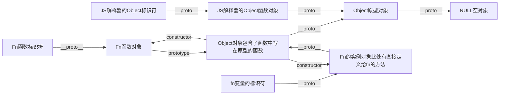
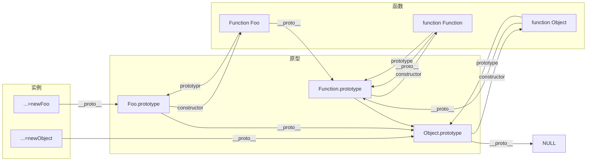

---
title: JavaScript进阶版笔记
date: 2020-11-20 01:35:50
toc: true
description: 此版为JavaScript进阶版，以讲述原理为主,主讲:尚硅谷张晓飞,视频来自B站:BV14s411E7qf与BV1MJ41197Eu
categories:
  - [前端,JS]
tags:
  - 前端
  - JavaScript
  - 笔记
---


## 数据类型

- 分类
  - 基本(值)类型
    - string: 任意字符串
    - number: 任意数字
    - boolean: true false
    - undefined: undefined
    - null: null
  - 对象(引用)类型
    - object: 任意对象
    - function: 一个特别的对象(可以执行)
    - array: 一种特别的对象(属性有数值下标属性,数组内部的元素是有序的)

- 判断
  - typeof: 返回数据类型的字符串表达`typeof tmp==="undefined"`,array和object的typeof都是object所以不能区别
  - instanceof: 实例
  - ===/== 一般判断全等用===这个不做数据转化`a===undefined` 一般用于null undefined的判断(因为他们只有一个值)

- undefined与null区别
  - undefined 表示只有定义没有赋值
  - null 表示定义了赋值了值为null
  - 设置null的初衷是为了表示这个变量准备被赋值成对象,但是目前还没有赋值,所以`typeof null`的结果是object
  - null的另一个作用是将没有用的对象的地址设置为null,当内存没人指的时候就会释放,被垃圾回收器回收

- 在什么时候将变量的值赋值为null
  - 在初始化但是临时不赋值的时候,为了标记
  - 在变量不用的时候释放内存

- 严格区分数据类型与变量类型
  - 数据的类型
    - 基本类型
    - 对象类型
  - 变量类型(实际上指的是变量值的类型,是存了数字还是地址)
    - 基本类型: 保存的是基本类型数据
    - 引用类型: 保存的是地址的路径


## 数据,变量,与内存

- 数据: 存储在内存中代表特定信息的东西,本质上是`010101..`
- 内存: 内存条通电之后可以存储数据的空间(临时的),一个内存块里面有两个小数据一个是地址值一个是存的值 
  - 内存的分类有栈,堆
  - 栈里面存全局变量和局部变量
  - 堆里面是对象的本身(但是表示堆的标识符是在堆空间里面的)
- 变量: 可变换的量,由变量名和值组成,每个变量名都占用一小块内存

内存中所有的操作的目标都是数据,操作的运算有:

- 算数运算
- 逻辑运算
- 赋值运算
- 运行函数
- 数据,变量,内存之间的关系
  

内存是存储数据的临时空间,变量是内存的标识

- 内存与赋值的问题  
  `var a=XXX;`a中到底存了什么?  
  - 当XXX是基本数据类型,那么他保存的就是这个数据
  - 当XXX是对象的时候,保存的是对象的地址值
  - 当XXX是变量的时候,保存的是XXX的内存内容(两者都有可能)
  - 当两个引用变量指向了同一个对象,通过一个变量修改数据,那么另一个变量看到的是修改后的数据
  - 对象在函数传递参数的时候是将内容赋值给了形参,对象赋值的内容是地址,所以相当于是传地址
  - 值得注意这两种情况
  ```js
    var a={age:12};
    var b=a;
    a={age:13};
    // 此时ab指向的地址发生了改变,两者不相干
    var fun=function(v){
      v={age:15};
    }
    fun(b);
    // 此时b并不会发生改变因为v是一个**独立的变量**,最开始是和b指向了一个地址,但是赋值之后指向的地址发生了改变,所以v的变化不会影响b
  ```

- JS是如何管理内存的
  1. 内存生命周期
    - 分配小的内存空间,获得小内存的使用权
    - 存储数据进行反复操作
    - 没人指向小内存空间的时候释放空间
  2. 释放内存
    - 程序或者作用域结束的时候释放作用域里面的变量(注意这里指的是释放标识符,小内存早就被释放了)
    - 对于对象使用垃圾回收器回收

## 对象
- 什么是对象
  - 多个数据的封装体
  - 用来保存多个数据的容器
  - 一个对象代表现实中的一个事物
- 为什么要用对象
  - 统一管理多个元素
- 对象的组成
  - 属性
  - 方法(特别的属性--属性值是函数)
- 访问对象内部的元素
  - `OBJ.属性名` 当属性名是关键字/包含`-`/包含` `/变量名不确定,用变量存储变量名的时候不能用
  - `OBJ["属性名"]`

## 函数
- 为什么要用函数
  - 提高代码复用
- 如何定义函数
  - 函数声明
  - 表达式
- 函数的调用
  - `fun.call(obj)`: 让一个函数成为一个陌生属性的方法是JS的一大特性
  - `AAA()`

## 回调函数
- 什么是回调函数
  - 自己定义的
  - 自己没有调用(指的是没有写明,例如window.onclick就是一个没有调用的回调函数,是在特定时间自动执行的)
  - 最后执行了

- 常见的回调函数
  - dom事件回调函数(与用户交互比较重要的点,发生时间的DOM元素)
  - 定时器回调函数
  - ajax回调函数(与后台交互比较重要的点)
  - 生命周期回调函数

## IIFE

IIFE(Immediately-Invoked Function Expression) 立即调用函数表达式

一般来说我们写的是非匿名函数,这样可以将他存起来,当时我们也可以写没有对象接受内容的匿名函数,因为没有标识符标识他,所以他必须立即执行,否则以后就无法调用了(这里的非匿名不是说`setInterval(function(){},1000)`这种,因为传值的时候相当于赋值了)

对于上述的匿名函数我们必须要当场执行
```js
function(){
  alert("123")'
}();
```
在后面加上`([参数列表])`就可以执行了,因为我们将前面当作了一个整体去执行,最好前面也加上一个`()`变成
```js
(function(){
  alert("123")'
})();
```
加上`()`之后函数定义的变量就从之前的全局变量变成了局部变量,好处有:

- 隐藏实现:这样的话其他函数就看不到这个函数了(因为本身他就要匿名,最好不要让其他函数看见)
- 不会污染外部的命名空间

于是我们可以像C++中封装函数一样去封装一个JS函数
```js
(function(){
  function work1(){
    // true work code 1;
  }
  function work2(){
  // true work code 2;
  }
  function work2(){
  // true work code 3;
  }
  window.XXX=function(){
    if()...
      return work1();
    if()...
      return work2();
    return work3();
  }
})();
```
我们希望实现一个模块,但是不想暴露细节函数,于是全员匿名,最后提供一个中控函数绑定到window,这在之后就是创建模块的方法,例如
```js
var myModule = (function module(){
  var someThing = "123";
  var otherThing = [1,2,3];

  function doSomeThing(){
    console.log(someThing);
  }

  function doOtherThing(){
    console.log(otherThing);
  }

  return {
    doSomeThing:doSomeThing,
    doOtherThing:doOtherThing
  }
})();

myModule.doSomeThing();
myModule.doOtherThing();
```

## 函数中的this
注意的一点,对于如下的例子
```js
function fun1(){
  function fun2(){
    console.log(this);
  }
  fun2();
}
fun1();
```
这里输出的this是`window`,同时请注意以下代码
```js
var tmp=new Object;
function fun1(){
  console.log(this);
  function fun2(){
    console.log(this);
  }
  fun2();
}
tmp.fun=fun1;
tmp.fun();
```

返回
```
{fun: ƒ}
VM144:5 Window {0: Window, window: Window, self: Window, document: document, name: "", location: Location, …}
```
相当于只要不是明确是对象调的都是window

- this是什么
  - **任何函数本质上都是通过对象调用的**
  - 所有函数内部都有一个变量this
  - 他指向的是调用函数的当前对象 

## JS的分号问题
- 可加可不加
- 但是如果不加分号导致二义性要加(小中括号开头的),例如
  ```js
  var a=3
  (function(){...})()
  ```
  会被认为是要执行一个名字叫做`3`的函数,参数列表为fun...
  ```js
  var a=3(function(){...})()
  ```
  那么就要加了
- 注意: JS在代码发布的时候会有一个`合理压缩`的过程,例如:
  ```js
  var a=123;
  function my_first_function(){
    // ohh here is a note
    return 3;
  }
  ```
  会被压缩成
  ```js
  var a=123;function b(){return 3;}
  ```
  不仅压行,还直接改函数名...

## prototype
任何`函数`都具有prototype属性,一个函数默认指向了一个Object空对象(原型对象),也就是说在函数被创建的时候会JS会默认创建一个对象,这个对象的内容是空的

原型对象的元素是给事例对象用的,

在`prototype`中还有一个元素是`constructor`这是一个引用变量,指向了指向prototype的对象,也就是构造函数与原型对象有一个相互引用的关系

## 显式原型与隐式原型
- 每个**函数**function都有一个`prototype`,也就是显式原型
- 每个**事例对象**都有一个`__proto__`,可以称为隐式原型
- 事例对象的`__proto__`的值是构造函数的`prototype`
- **注意**:显式原型与隐式原型都是引用对象,指向的是原型,验证方法就是在创建元素后修改显式原型的内容
- 在ES6之前程序员可以直接操作显式原型,但是不能操作隐式原型

与其他语言不同的是,大部分语言采用的是基于类的基础而JS是采用基于对象的继承,这就导致JS存在原型链

## 原型链
我们可以尝试一直输出一个对象的__porto__

```js
function Fn(){
    var FnFunctionVals=1;
        return 0;
    }
    return 666;
}
var fn=new Fn();
console.log("Fn IS ",fn);
console.log("Fn PROTO",fn.__proto__);
console.log("Fn PROTO PROTO",fn.__proto__.__proto__);
console.log("Fn PROTO PROTO PROTO",fn.__proto__.__proto__.__proto__);

console.log("Fn IS ",Fn);
console.log("Fn PROTO",Fn.__proto__);
console.log("Fn PROTO PROTO",Fn.__proto__.__proto__);
console.log("Fn PROTO PROTO PROTO",Fn.__proto__.__proto__.__proto__);
```

结果
```js
Fn IS  Fn__proto__: Object
Fn PROTO Objectconstructor: ƒ Fn()__proto__: Object
Fn PROTO PROTO Objectconstructor: ƒ Object()hasOwnProperty: ƒ hasOwnProperty()isPrototypeOf: ƒ isPrototypeOf()arguments: (...)caller: (...)length: 1name: "isPrototypeOf"__proto__: ƒ ()[[Scopes]]: Scopes[0]propertyIsEnumerable: ƒ propertyIsEnumerable()toLocaleString: ƒ toLocaleString()toString: ƒ toString()valueOf: ƒ valueOf()__defineGetter__: ƒ __defineGetter__()__defineSetter__: ƒ __defineSetter__()__lookupGetter__: ƒ __lookupGetter__()__lookupSetter__: ƒ __lookupSetter__()get __proto__: ƒ __proto__()set __proto__: ƒ __proto__()
Fn PROTO PROTO PROTO null
Fn IS  ƒ Fn(){
        var FnFunctionVals=1;
        function tmp(){
         return 666;
    }
Fn PROTO ƒ () { [native code] }
Fn PROTO PROTO Objectconstructor: ƒ Object()hasOwnProperty: ƒ hasOwnProperty()isPrototypeOf: ƒ isPrototypeOf()propertyIsEnumerable: ƒ propertyIsEnumerable()toLocaleString: ƒ toLocaleString()toString: ƒ toString()valueOf: ƒ valueOf()__defineGetter__: ƒ __defineGetter__()__defineSetter__: ƒ __defineSetter__()__lookupGetter__: ƒ __lookupGetter__()__lookupSetter__: ƒ __lookupSetter__()get __proto__: ƒ __proto__()set __proto__: ƒ __proto__()
Fn PROTO PROTO PROTO null
```
可以看到是Fn这个**对象**,请注意,此处没有调用函数的prototype而是直接调用了对象的__proto__他们是一样的,可以看到fn对象的第一个原型就是Object,这个object包含了指回fn对象的`constructor`,之后这个对象又指向了一个Object对象,最后被指向的对象没有原型了,但是他还是一个Object对象,他包含了Object最基本的对象


最后null的`__proto__`是报错...

从上面可以看到,我们其实是顺着隐式原型链连起来的,原型链是用来查找对象的属性的不是方法(虽然我认为方法也是属性...)

## 构造函数,原型等原型链之间的关系图与解释
我们有构造函数`Foo()`


从左上角开始看

- f1,f2是Foo构造函数构造的实例,他们的__proto__就是构造函数的prototype
- 对于构造函数Foo来说,prototype就是Foo的一个空实例,这个空实例的构造函数就是Foo
- 同时,Foo是一个函数,也是一个对象,Foo是由Function构造函数构造的一个function,所以Foo的__proto__是Function函数的prototype
- 对于构造函数Function来说他的prototype就是他的一个空实例,这个实例的构造函数就是他
- 同时Function是一个函数,所以Function是Function构造出来的一个对象,也具有__proto__,他的__proto__应该是Function函数的构造函数Function的prototype
- 对于Function的prototype来说,他是一个对象,所以他的__proto__就是Object
- 对于Object来说,他的prototype是他的空实例,空实例的构造函数就是Object
- 对于对象o1,他是Object的实例,所以__proto__就是Object的prototypr
- 对于Object来说,他是由Function创建的函数实例,所以他的__proto__就是Function的prototype

## 原型链的属性
我们可以把一个属性设置到原型链的属性上,那么我们声明一个事例的时候事例可以直接通过`.`访问到原型上设置的属性,当我们为这个实例设置相同的属性是时候,JS并不会查找原型链上有没有这个属性,而是直接将属性设置到了实例上,这相当于此时,对于这个实例有两个同名属性,一个在原型链上,一个在实例上,这样的修改不会影响到其他是实例

## 执行上下文

- 代码的分类
  - 全局代码
  - 函数局部代码
- 全局执行上下文
  - 在执行全局代码前将window设置为全局执行上下文
  - 对全局数据进行预处理
    - var定义为全局变量,值为undefined,添加windows属性
    - function 声明全局函数,同时赋值,添加为window方法
    - this设置为window
  - 从头执行代码 
- 函数执行上下文
  - 在调用函数之前创建对应的函数执行上下文
  - 对局部数据进行预处理
    - 将形参列表赋值为实参为执行上下文添加对应的属性
    - 将argument赋值,添加上下文属性
    - var定义局部变量,赋值为undefined,添加上下文属性
    - function声明函数,赋值函数内容,添加上下文方法
    - 赋值this
  - 执行函数代码
- 局部变量的栈
  - 我们可以将存放标识符的栈进一步细分,存储全局变量的栈,存储局部函数变量的栈,全局元素栈可以被局部函数栈访问,但是局部元素栈的元素不可以在全局被访问,相当于这个栈在全局是被隐藏的
- 执行上下文栈
  - 全局代码执行的时候JS会创建一个栈存储全局上下文对象
  - 执行window的时候压栈
  - 函数执行的时候将函数上下文对象入栈
  - 程序结束之后对象出栈
  - 全局执行结束之后应该只可以看到window的上下文对象 

## 作用域与作用域链
- 理解
   - 就是一块地盘,一个代码所在的区域
   - 相对于上下文对象,带编码的时候元素的作用域就确定了
- 分类
  - 全局作用域
  - 函数作用域
  - 块作用域(ES6之前没有)
- 作用
  - 隔离变量
- 与执行上下文的区别
  - 全局作用域外,每个函数都会创建自己的作用域,在函数定义的时候创建,而不是在函数调用的时候
  - 全局执行上下文是字啊全局作用域确定,JS代码马上要执行的时候确定的
  - 函数上下文是在调用函数的时候确定,函数体代码是在执行之前确定
  - 作用域是静态的,函数定义好就一直存在,不会变化
  - 上下文是动态的,调用的时候创建,结束的时候释放
  - 上下文环境对象是从属于作用域的
  - 全局上下文环境对应全局作用域
  - 函数上下文环境对应函数作用域
- 作用域链
  - 嵌套的作用域形成的**由内而外**的链称为作用域链
  - 当我们调用一个函数,JS顺着作用域链找不到就会报错,注意查找的时候如果这个属性是当前作用域中某个对象的属性,那么是找不到是

## 循环变量监听
以前写过这样的代码
```js
<!DOCTYPE html>
<html lang="en">
<head>
</head>
<body>
    <button>我是第0个</button>
    <button>我是第1个</button>
    <button>我是第2个</button>
</body>

<script>
    window.onload=function(){
        var bts=document.querySelectorAll("button");
        for(var i=0,len=bts.length;i<len;i++){
            bts[i].idx=i;
            bts[i].onclick=function(){
                alert(this.idx);
            }
        }
    }
</script>
</html>
```
实现了点击第几个弹出几

有一个坑就是如果不记录这个按钮是第几个就会出现谁点击都是3,这是因为在循环的时候只进行了函数声明,调用的时候函数内部i去window的作用域下找i,只找到循环结束的3,这就导致全输出3,一个解决方法是为按钮附上index值,也可以添加一个作用域不让onclick出去找i
```js
window.onload=function(){
    var bts=document.querySelectorAll("button");
    for(var i=0,len=bts.length;i<bts.length;i++){
        (function(i){
            var sigBtn=bts[i];
            sigBtn.onclick=function(){
                alert(i);
            }
        })(i);
    }
}
```
区别就是为window内部又写了一个作用域,形参为i,这样的话找i就一定找的是形参i,现在只需要告诉每个按钮i的具体值,可以使用函数调用传递参数,但是这个函数只是在这里用一下,所以完全可以匿名立即执行,于是有了上面的代码,注意匿名函数的函数作用域,实际上这就用到了闭包的技术

## 闭包
- 如何产生闭包
  - 当一个嵌套的内部函数引用了嵌套的外部函数的变量,就产生了闭包
- 闭包是什么
  - 闭包有2种理解
  - 一种认为是嵌套在内部的子函数
  - 一种认为是包含被引用变量的对象
  - 他存在与内部函数中
- 产生闭包的条件
  - 函数嵌套
  - 内部函数引用了外部函数的变量
  - 外部函数被调用(注意,闭包出现于外层函数执行子函数变量提升的时候,而不是子函数被调用,甚至可能子函数不会被调用,但是在变量提升的时候已经有了闭包,当然,如果写的是`var tmp=function(){}`那必然在父函数开始的时候不产生闭包)

陷阱
```js
function fn1(){
    var a=2;
    function fn2(){
        a++;
        console.log(a);
    }
    return fn2;
}
var f=fn1();
f()
f()
```
输出分别是3 4

看到f定义的那一句,模拟执行,f获得了fn1的返回值,我们执行fn1,首先是进入fn1,创建闭包,**把闭包给了fn2**,不调用fn2,直接返回fn2**对象,不仅仅是代码,连着fn2刚刚拿到的闭包一起返回了**,调用f的时候fn2使用了自己的闭包,找到a=2,输出了3,再次调用的时候fn2使用了自己的闭包,找到a=3,输出了4,想要恢复很简单,重新赋值f

其实错误版本的按钮点击函数,也是由于闭包惹得祸,如果没有闭包,函数已经被赋值怎么可能找到外边还有一个i呢,也是在定义的时候已经把i传进了onclick函数

- chrome开发人员工具`Call Stack`
类似于上下文栈,唯一特殊的(anonymous)指的是全局栈

- 闭包的作用
- 使函数内部的变量在函数执行结束之后仍然活在内存中
- 让外部函数可以直接操作其他作用域的局部变量
- 被闭包指向的局部变量在函数执行完后不消失的原因是有闭包在指向这个变量, 而闭包没有消失的原因是有元素指向的存储闭包的函数

- 闭包的生命周期
  - 在子函数被定义的时候产生
  - 在子函数成为垃圾对象的时候消失

## 利用闭包实现js模块

- js模块就是具有特定功能的js文件,要求如下
- 将所有的函数与功能都放在函数内部
- 函数只可以暴露一个或者多个方法
- 当我们想要返回多个方法的时候可以采用对象的方法直接封装所有的函数,属性名可以命名为方法名,更加方便

例如:
```html
<!DOCTYPE html>
<html lang="en">
<head>
    <meta charset="UTF-8">
    <meta name="viewport" content="width=device-width, initial-scale=1.0">
    <title>Document</title>
</head>
<body>
</body>
<script src="./js/myScript.js"></script>
<script>
    var fn = myModule();
    fn.dootherthing();
</script>
</html>
```
```js
function myModule(){
    var msg="My atguigu";
    function dosomething(){
        console.log("dosomtthing() "+msg.toUpperCase());
    }
    function dootherthing(){
        console.log("dootherthing() "+msg.toLowerCase());
    }
    return {
        dosomething: dosomething,
        dootherthing: dootherthing
    };
}
```

也可以使用立即调用函数直接将事例写入到window中
```html
<!DOCTYPE html>
<html lang="en">
<head>
    <meta charset="UTF-8">
    <meta name="viewport" content="width=device-width, initial-scale=1.0">
    <title>Document</title>
</head>
<body>
</body>
<script src="./js/myScript.js"></script>
<script>
    fn.dootherthing();
</script>
</html>
```
```js
(function (){
    var msg="My atguigu";
    function dosomething(){
        console.log("dosomtthing() "+msg.toUpperCase());
    }
    function dootherthing(){
        console.log("dootherthing() "+msg.toLowerCase());
    }
    window.fn={
        dosomething:dosomething,
        dootherthing:dootherthing
    }
})();
```

- 闭包的缺点
  - 局部变量释放延迟,占用内存
  - 容易造成内存泄漏
- 解决方案
  - 及时释放(`f=null`使得内部函数成为垃圾对象)
  - 不用闭包

## 内存溢出与泄漏
- 内存溢出
  - 一种程序运行的时候出现的错误
  - 当程序运行的时候需要内存超过剩余内存的时候,会抛出内存溢出错误
  ```js
    var obj={};
    for(var i=0;<10000;i++)
      obj[i]=new Array(10000000);
  ```
  会造成溢出(同时注意这种语法,obj是一个伪数组,其实就是obj下面的属性为0,1,2,3...)浏览器显示崩溃了,内存不足
- 内存泄漏
  - 占用的内存没有被及时释放,这不是错误,只是一种问题,累计的内存泄漏多了容易导致内存溢出
  - 原因
    - 错误的调用了全局变量(eg 没有写var)
    - 没有及时清理计时器或回调函数
    - 闭包

## 对象的创建模式
- Object构造函数模式
  - 先创建一个空的object对象,然后动态的添加属性/方法
  - 起始的时候对象内部的数据不确定
  - 问题:语句多
  ```js
   var p = new Object();
   p.name="1";
   p.age=2;
   p.setName=function(name){
     this.name=name; 
   }
  ```
- 对象字面量模式
  - 使用`{}`创建对象,同时指定属性/方法
  - 适用于起始对象内部的元素数据是确定的
  - 问题: 如果创建了多个对象会有重复代码
  ```js
  var p={
    name:"tom",
    age:12,
    setname:function(name){
      this.name=name;
    }
  }
  ```
- 工厂模式
  - 通过工厂函数(返回对象的函数)创建对象然后返回
  - 适用场景: 需要创建多个函数
  - 问题: 没有一个对象有具体的类型,都是Object
  ```js
    function makePeople(name,age){
      var p={
        name:"tom",
        age:12,
        setname:function(name){
          this.name=name;
        }
      }
      return p;
    }
  ```
- 自定义构造函数模式
  - 自定义构造函数,通过new创建对象
  - 适用场景: 需要创建多个类确定的对象
  - 问题: 每个对象都有相同的数据 占用内存
  ```js
    function People(name,age){
      this.name=name;
      this.age=age;
      this.setname=function(name){
        this.name=name;
      }
    }
  ```
  对于每一个事例,属性可能不相同,内存相互独立,但是方法是一样的,但是内存还是独立的,这造成了内存的占用,所以要将函数放在原型上,这样所有的函数都指向同一个"空对象"于是有了下面的模式
- 构造函数+原型的组合模式
  - 自定义构造函数,属性在函数中初始化,方法添加到原型上
  - 适用于要创建多个类型创建的对象
  ```js
    function People(name,age){
      this.name=name;
      this.age=age;
    }
    Person.prototype.setname=function(name){
      this.name=name;
    }
  ```

## 继承模式: 原型链的继承
当创建了两个对象的构造-原型函数之后,需要建立两个类的继承关系,但是js是基于对象的继承的,所以子元素需要继承父元素的原型链,只需要将子元素**构造函数**的prototype设置为父元素的**实例**,eg
```js
function Supper(){
  this.supProp="root";
}

Supper.prototype.showSupper=function(){
  alert(this.supProp);
}

function Suber(){
  this.subProp="suber";
}

Suber.prototype=new Supper();     // 注意这里要先写,否则之前写的就成垃圾了

Suber.prototype.showSuber=function(){
  alert(this.subProp);
}

var sub=new Suber();
sub.showSupper();
sub.showSuber();
```
注意,以上代码存在隐患,因为sub是sup的子元素所以把Sub的prototype设置为Sub的实例,但是Sup实例的构造函数还是Sup,这里要同意修正为sub
```js
function Supper(){
  this.supProp="root";
}

Supper.prototype.showSupper=function(){
  alert(this.supProp);
}

function Suber(){
  this.subProp="suber";
}

Suber.prototype=new Supper();     // 注意这里要先写,否则之前写的就成垃圾了
Suber.prototype.constructor = Suber;

Suber.prototype.showSuber=function(){
  alert(this.subProp);
}

var sub=new Suber();
sub.showSupper();
sub.showSuber();
```

## 继承模式:借用构造函数继承

```js
function Person(name,age){
  this.name=name;
  this.age=age;
}
function Student(name,age,p){
  Person.call(this,name,age);
  this.p=p;
}
```
相当于是
```js
function Student(name,age,p){
  this.name=name;
  this.age=age;
  this.p=p;
}
```
并没有创建出一个继承关系,但是能用

## 继承模式: 组合继承
```js
function Person(name,age){
  this.name=name;
  this.age=age;
}

Person.prototype.setname=function(name){
  this.name=name;
}

function Student(name,age,p){
  Person.call(this,name,age);
  this.p=p;
}

Student.prototype=new Person();
Student.prototype.constructor=Student;
Student.prototype.setp=function(p){
  this.p=p;
}

var s=new Student("A",1,2);
console.log(s.setname("B"));
console.log(s.setp(123));
```

## 复习
白天看

## 进程与线程

- 进程: 程序的一次允许占用了一个独立的内存空间
- 线程: 进程内部一个独立的执行单元,是程序执行的一个完整流程,是CPU最小调度单元
- 一个程序可以创建多个进程
- 一个程序如果每个**进程只有一个线程**那么就叫他但线程的
- 应用必须运行在一个进程的线程上
- 一个进程至少有一个允许的线程,叫主线程,自动创建,其他的叫分线程
- 一个进程的数据何以供多线程共享,进程之间不共享
- 线程池保存了多个线程对象容器实现复用
- 多个线程不一定同时进行,例如线程数目大于cpu核心数目

比较:

- 多线程
  - 优点:提高CPU利用率
  - 缺点:创建多线程有开心,线程切换有开销,存在锁死与状态同步问题
- 单线程
  - 优点: 代码简单
  - 缺点: 慢
- JS是单线程运行的,但是可以使用H5的web workers进行多线程允许
- 浏览器是多线程允许的
- 浏览器有单进程的,有多进程的
  - 多进程: chrome 新IE
  - 单进行: 火狐 老IE

## 浏览器内核
浏览器内核: 支持浏览器允许的核心程序

- chrome/Safasi: webkit
- firefox : Gecko
- IE : trident

> 页面的绘制（绘制，就是把一个HTML文件变成一个活灵活现的页面展示的过程...），只有一半轮子是Chrome自己做的，还有一部分来自于WebKit，这个Apple打造的Web渲染器。。。
> 之所以说是一半轮子来源于WebKit，是因为WebKit本身包含两部分主要内容，一部分是做Html渲染的，另一部分是做JavaScript解析的。在Chrome中，只有Html的渲染采用了WebKit的代码，而在JavaScript上，重新搭建了一个NB哄哄的V8引擎。目标是，用WebKit + V8的强强联手，打造一款上网冲浪的法拉利，从效果来看，还着实做的不错。。。
> 不过，虽说Chrome和WebKit都是开源的，并联手工作。但是，Chrome还是刻意的和WebKit保持了距离，为其始乱终弃埋下了伏笔。Chrome在WebKit上封装了一层，称为WebKit Glue。Glue层中，大部分类型的结构和接口都和WebKit类似，Chrome中依托WebKit的组件，都只是调用WebKit Glue层的接口，而不是直接调用WebKit中的类型。按照Chrome自己文档中的话来说，就是，虽然我们再用WebKit实现页面的渲染，但通过这个设计（加一个间接层...）已经从某种程度大大降低了与WebKit的耦合，使得可以很容易将WebKit换成某个未来可能出现的更好的渲染引擎。。。

内核是一个大程序,有很多模块

- 主线程
  - JS引擎:解析运行JS
  - HTML,CSS文档解析模块: 负责解析文本文件
  - DOM/CSS模块: 负责DOM文档结构对象的构建
  - 布局与渲染模块: 负责布局效果的绘制
- 分线程
  - 定时器模块: JS代码是单线程的,所以虽然模块是在分线程,但是代码还是在主线程
  - DOM事件响应模块
  - 网络请求模块
  - ...

## 关于定时器

定时器真的是定时执行的吗?

定时器一般会延迟一点点(可以接受),单也有可能会延长很多时间(例如在支持很大的循环)

## 验证JS是单线程执行的
```js
setTimeout(function(){
  console.log("A");
},1000);

setTimeout(function(){
  console.log("B");
},2000);

console.log("000000");
alert("pause");
console.log("111111");
```
当点击确定后等一会儿才开始alert,说明alert同时暂停了定时器模块与主线程,但是最新的chrome修改了定时器框架,不用等待了,按顺序输出 

## 事件循环模型

- 代码分类:
  - 初始化代码
  - 回调代码
- js引擎的执行流程
  - 执行初始化函数代码,有一部分代码会在所有代码执行完才运行 我们称之为异步调用  
  - 设置计时器,监听,网络请求
  - 在DOM事件发生的时候调用回调函数

* 模型的2个重要组成部分:
  * 事件管理模块
  * 回调队列
* 模型的运转流程
  * 执行初始化代码, 将事件回调函数交给对应模块管理
  * 当事件发生时, 管理模块会将回调函数及其数据添加到回调列队中
  * 只有当初始化代码执行完后(可能要一定时间), 才会遍历读取回调队列中的回调函数执行
    
## H5 Web Workers
* 可以让js在分线程执行
* Worker
  ```js
  var worker = new Worker('worker.js');
  worker.onMessage = function(event){event.data} : 用来接收另一个线程发送过来的数据的回调
  worker.postMessage(data1) : 向另一个线程发送数据
  ```
* 问题:
  * worker内代码不能操作DOM更新UI
  * 不是每个浏览器都支持这个新特性
  * 不能跨域加载JS

## Promise

### JS语法准备

#### 实例对象与函数对象

- 实例对象是`new`创建出来的对象
- 函数对象是将函数作为对象使用

**注意区分函数与对象**

- `.`左边的是对象, 例如: `X.Y.prototype`中的`X.Y`
- `()`左边的是函数, 例如: `X().Y()()`中的`X().Y()`, X的返回值是一个对象, 这个对象有Y函数, Y函数的返回值还是一个函数
- `()`整体的是返回值, 例如: `X().Y()()`中的`X().Y()()`

当一个函数Fn既体现函数的作用(调用了`Fn()`), 又体现了对象的作用`Fn.xx`, 我们说Fn是函数对象

#### 函数的call/apply/bind方法

首先这三个参数都是用于改变this的指向
```js
let obj = {
    name:'张三',
    age:18,
    func:function(){
        console.log(this.name + "年龄" + this.age);
    }
}
let obj2 = {
    name:'李四',
    age:20
}
obj.func.call(obj2) //李四年龄20
obj.func.apply(obj2); //李四年龄20
obj.func.bind(obj2)(); //李四年龄20
```
这三个结果都一样, bind后面多一个括号是因为 bind返回值是一个函数加上（）编程立即执行函数

**Call**

用法：`Object.call(obj,arg1,arg2.......)`

参数：

- 第一个参数obj是作为函数上下文的对象(也就是this)
- 第二个参数arg1：从第二个参数开始后续所有参数都是传给方法的参数

示例
```js
let obj = {
    name:'张三',
    age:18,
    func:function(job,sal){
        console.log(this.name + "年龄" + this.age +"工作："+job + "   sal:"+sal);
    }
}
let obj2 = {
    name:'李四',
    age:20
}
obj.func.call(obj2,'Programer',5000) //李四年龄20工作：Programer   sal:5000
```

**apply**

用法：`Object.apply(obj,[args])`

参数：

- 第一个参数obj是作为函数上下文的对象(也就是this)
- 第二个参数args:是一个数组作为参数传入
```js
let obj = {
    name:'张三',
    age:18,
    func:function(job,sal){
        console.log(this.name + "年龄" + this.age +"工作："+job + "   sal:"+sal);
    }
}
let obj2 = {
    name:'李四',
    age:20
}
obj.func.call(obj2,'Programer',5000) //李四年龄20工作：Programer   sal:5000
obj.func.apply(obj2,['Programer',5000]); //李四年龄20工作：Programer   sal:5000
```
**bind**

用法：`Object.bind(obj,arg1,arg2.......)`

参数：

- 第一个参数obj是作为函数上下文的对象(也就是this)
- 第二个参数arg1：从第二个参数开始后续所有参数都是传给方法的
参数

并且返回值是一个function
```js
let obj = {
    name:'张三',
    age:18,
    func:function(job,sal){
        console.log(this.name + "年龄" + this.age +"工作："+job + "   sal:"+sal);
    }
}
let obj2 = {
    name:'李四',
    age:20
}
let newFunc =obj.func.bind(obj2,'Programer',5000);
console.log(typeof newFunc); //function
newFunc();//李四年龄20工作：Programer   sal:5000
```
**总结**

- call和apply的区别：两个函数都是改变函数执行上下文的，但是传的参数不同
- bind和其他两个差别在：传参与call相同，但是bind会返回一个新的函数

#### 两种类型的回调函数

**回调函数**

- 是我自己定义的
- 我没有亲自去调用这个函数
- 但是他最后执行了

**同步回调函数**

考虑代码
```js
let arr = [1,2,3];
arr.forEach(t => console.dir(t))
console.log("END")
```
按照异步的思想, 队列中应该是: forEach() <- console.log() <- console.log(1...3)

但是执行的时候我们看到的是: `1 2 3 END`

这是因为forEach中的这个回调函数是**同步回调函数**, 这种函数会立即执行, 执行完才执行后面的函数, JS不会将这类函数放在回调队列中

**异步回调函数**

与之对应, 回调函数不会立即执行, 会放在回调队列中将来再执行, 例如`setTimeout(回调,t)`

#### 错误处理

JS的错误是一个对象模型, 有几种内置错误

- Error: 所有错误的父类
- ReferenceError: 引用错误, 引用了不寻在的变量
  ```js
  console.log(a)
  // ReferenceError: a is not defined
  ```
- TypeError: 数据类型不正确
  ```js
  let a = null;
  console.log(a.__proto__)
  // TypeError: Cannot read property '__proto__' of null
  ```
- RangeError: 数据值超出允许范围, 一般指的是爆栈, 不是数字过大或者访问越界
  ```js
  function fn(){
    fn();
  }
  fn();
  // RangeError: Maximum call stack size exceeded
  let t = Number.MAX_VALUE*2;
  console.log(t);
  // Infinity
  let arr = [1,2,3];
  console.log(arr[3]);
  // undefined
  ```
- SyntaxError: 语法错误

遇到错误需要进行处理, 相关的语句有
- `try-catch`捕获错误
  ```js
  let t;
  try {
      console.log(t.pro);
  } catch(Error){
      console.log("ERROR:",Error)
  }
  console.log("END")
  // ERROR: TypeError: Cannot read property 'pro' of undefined
  //     at Object.<anonymous> (/home/liukairui/CODE/CodeSnippet/Promise/demo1/index.js:3:19)
  //     at Module._compile (node:internal/modules/cjs/loader:1101:14)
  //     at Object.Module._extensions..js (node:internal/modules/cjs/loader:1153:10)
  //     at Module.load (node:internal/modules/cjs/loader:981:32)
  //     at Function.Module._load (node:internal/modules/cjs/loader:822:12)
  //     at Function.executeUserEntryPoint [as runMain] (node:internal/modules/run_main:79:12)
  //     at node:internal/main/run_main_module:17:47
  // END
  ```
  这里的Error是一个对象, 打印的时候打印出好几行(依靠toString),可以查看Error的结构
  ```js
    TypeError: Cannot read properties of undefined (reading 'pro')
        at <anonymous>:3:19
    message: "Cannot read properties of undefined (reading 'pro')"
    stack: "TypeError: Cannot read properties of undefined (reading 'pro')\n    at <anonymous>:3:19"
    [[Prototype]]: Error
  ```
  Error是一个TypeError类对象, 有message(错误信息)与stack(调用栈)属性, 父类是Error
- `throw error`抛出自定义的错误
  ```js
  function doRand(){
    let t = Math.random();
    if(t<0.5)
      console.log("Pass");
    else
      throw new Error("Opp")
  }
  while(1){
    try{
      doRand();
    }catch(e){
      console.log("Some Error",e.message)
    }
  }
  ```
  一般自己抛出自定义错误的时候使用Error类而不是用内置类, 这样的话错误就会抛出给函数的调用者

### Promise的使用

#### 是什么

[MDN链接](https://developer.mozilla.org/zh-CN/docs/Web/JavaScript/Reference/Global_Objects/Promise)

Promise是承诺, 承诺将来会给你一个数据, 数据可能是成功的也可能是失败的

- Promise是JS进行异步编程的**新的**解决方案(在Promise之前我们使用回调函数进行)
- 从语法上说Promise是一个**构造**函数(Promise的实例去实现功能)
- 从功能上话Promise对象用来封装一个异步操作, 并获取结果

**Promise的状态**

Promise被new出来的时候处于pading状态, 之后可以转换为resolved(成功)状态或者rejected(失败)状态, 无论转换为哪一个都不会变化了, 一般将成功结果的数据称为value并执行onResolved(), 将失败结果的数据称为reason/error并执行onRejected()最后得到一个新的Promise

**Promise的回调函数**

Promise的**执行器函数**是同步回调函数, 一旦Promise对象被创建, 执行器内部的函数就同步启动了, 但是`then`/`catch`并不会在状态变化之后同步执行, 所以Promise在状态变化之后仍然可以指定回调函数, 例如
```js
console.log("Before Promise")

const p = new Promise((resolve,reject)=>{
    console.log("Promise ON");
    resolve();
}).then(value=>{
    console.log("Then0 ON")
})

console.log("After Then0")

p.then(value=>{
    console.log("Then1 ON")
})

console.log("After Then1")

p.then(value=>{
    console.log("Then2 ON")
})

console.log("After Then2")

/*
* Promise ON
* After Then0
* After Then1
* After Then2
* Then0 ON
* Then1 ON
* Then2 ON
*/
```


#### 为什么要使用Promise

- Promise指定回调函数十分灵活(体现在时间上), 例如
  ```js
  // 对于使用回调函数, 必须在调用的时候指定
  creatMusic(config, onSuccess, onFaile);
  
  // 对于Promise, 可以随意指定回调
  const t = new Promise(()=>{});
  // Do other things
  t.then(()=>{});
  ```
- 支持链式调用, 解决了回调地狱(但是还是存在回调函数的问题, 所以终极解决方案是async/await)
- 支持异常穿透
  ```js
  const t = new Promise(()=>{});
  t.then();
  t.then();
  t.catch(); // t输出reject直接到这里, 忽略then
  ```

#### 如何使用Promise

**API**

直接看MDN

- Promise.all()
- Promise.allSettled()
- Promise.any()
- Promise.prototype.catch()
- Promise.prototype.finally()
- Promise.race()
- Promise.reject()
- Promise.resolve()
- Promise.prototype.then()

首先应该认识到:

- Promise.all之类的函数只能由Promise函数对象调用
- Promise.prototype.catch之类的函数可以由Promise实例调用
比较陌生的
- `new Promise.resolve(value)/reserve(reason)`, 语法糖 <=> 
  ```js
  new Promise((reserve,reject)=>{reserve(value)})
  ```
- `Promise.all([promise1,promise2...])`参数是一个Promise对象的数组, 返回一个Promise, 所有的Promise都reserve才是reserve(value是所有Promise的reason的数组), 其他情况都会reject(reason是第一个失败的promise的reason)
  ```js
  const [p1,p2,p3] = [
      Promise.resolve("A"),
      Promise.resolve("B"),
      // Promise.reject("B"),
      Promise.resolve("C")
  ];
  
  const res = Promise.all([p1,p2,p3]).then(
      value=>console.log(value),
      reason=>console.log(reason)
  )
  ```
- `Promise.race([promise1,promise2,...])`参数是Promise对象的数组, 返回最先变化状态的Promise

**几个关键的点**

- 改变Promise的状态与指定回调函数没有顺序要求, 但是存在一定的区别
  ```js
  new Promise((reserve,reject)=>{
    reserve(1);
  }).then(data=>{
    console.log(data);
  })
  
  new Promise((reserve,reject)=>{
    setTimeout(()=>{reserve(1)},1000);
  }).then(data=>{
    console.log(data);
  })
  ```
  上面代码是先修改状态(因为执行器函数是同步回调函数), 这样等到JS执行到then的时候Promise已经是reserved, 直接执行then. 但是下面的代码是先执行then, 后reserverd, 这时JS读取到then, 但是Promise还是peding状态, 所以会吧then中的函数先存储起来
- 区分执行器函数, then, 回调函数: 执行器函数是同步回调函数, then是同步的(这里的then只是注册了两个回调函数, 当然是同步的了), 但是then中的回调函数是异步执行的
- 注意如果有多个then, 下一个then的数据来自上一个then的返回值, 下一个是reserve还是reject取决于上一个then的结果是reserve还是reject
  ```js
  new Promise((reserve,reject)=>{
    reserve(1);
  }).then(
    value=>{console.log("T1R",value)},
    reason=>{console.log("T1J",reason)}
  ).then(
    value=>{console.log("T2R",value)},
    reason=>{console.log("T2J",reason)}
  )
  /*
   * T1R 1
   * T2R undefined
   */
  ```
  与
  ```js
  new Promise((reserve,reject)=>{
    reject(1);
  }).then(
    value=>{console.log("T1R",value)},
    reason=>{console.log("T1J",reason)}
  ).then(
    value=>{console.log("T2R",value)},
    reason=>{console.log("T2J",reason)}
  )
  /*
   * T1J 1
   * T2R undefined
   */
  ```

- 函数穿透问题: 我们知道Promise的then可以只写一半, 比如
  ```js
  new Promise((reserve,reject)=>{
    throw 10;
  }).then(
    value=>{console.log("T1R",value)}
  ).then(
    value=>{console.log("T2R",value)}
  ).catch(
    reason=>{console.log("T1F",reason)}
  )
  ```
  在执行的时候, JS会直接跳转到catch函数执行回调函数, JS并不是因为看then中没有catch的代码就不执行了, 而是这两个参数都有默认值, 可以理解为JS会默认将
  ```js
  promise.then(
    value=>{console.log("T2R",value)}
  )
  ```
  补全为
  ```js
  promise.then(
    value=>{console.log("T2R",value)},
    reason => {throw reason;}
  )
  ```

- 如何终止Promise链的执行: 只需要在希望终止的函数中返回一个`Promise<pading>`让他永远不能变化`return new Promise(()=>{})`

### 手写Promise

定义了一个Bromise模块
```js
function Bromise(executer){
    this.PENDING = 'pending';
    this.RESOLVED = 'resolved';
    this.REJECTED = 'rejected';

    this.statue = this.PENDING;
    this.data = undefined;
    this.callbacks = [];

    this.resolve = value => {
        if(this.statue !== this.PENDING)return;
        this.statue = this.RESOLVED;
        this.data = value;
        if(this.callbacks.length !== 0){
            setTimeout(()=>{
                this.callbacks.forEach(d=>{
                    d.onResolved(this.data);
                })
            })
        }
    }
    
    this.reject = reason => {
        if(this.statue !== this.PENDING)return;
        this.statue = this.REJECTED;
        this.data = reason;
        if(this.callbacks.length !== 0){
            setTimeout(()=>{
                this.callbacks.forEach(d=>{
                    d.onRejected(reason); 
                })
            })
        }
    }

    try{
        executer.call(this,this.resolve,this.reject);
    }catch(error){
        this.reject(error);
    }
}

Bromise.prototype.handle = function(callback){
    try{
        let result = callback(this.data);
        if(result instanceof Bromise)
            result.then(this.resolve,this.reject);
        else
            this.resolve(result)
    }catch(error){
        this.reject(error)
    }
};

Bromise.resolve = function(value){
    if(value instanceof Bromise)
        value.then(this.resolve,this.reject);
    return new Bromise((resolve,reject)=>{resolve(value)})
};

Bromise.reject = function(reason){
    return new Bromise((resolve,reject)=>{reject(reason)})
};

Bromise.prototype.then = function(onResolved, onRejected){
    let self = this;
    return new Bromise(function(resolve,reject){

        let self2 = this;

        if(typeof onResolved !== 'function')onResolved = value => value;
        if(typeof onRejected !== 'function')onRejected = reason => {reject(reason);};
        if(self.statue == self.RESOLVED){()=>{self2.handle(onResolved)}}
        else if(self.statue == self.REJECTED){()=>{self2.handle(onRejected)}}
        else{
            self.callbacks.push({// ! bug
                onResolved(value){self.handle(onResolved)},
                onRejected(reason){self.handle(onRejected)}
            })
        }
    })
};

Bromise.prototype.catch = function(onRejected){
    return this.then(undefined,onRejected);
};

Bromise.all = function(bromises){
    let lengs = bromises.length;
    let cnt = 0;
    let results = new Array(lengs);
    bromises.forEach((d,i)=>{
        d.then((value)=>{
            results[i] = value;
            if(++cnt == lengs)this.resolve(results)
        },(reason)=>{
            this.reject(reason);
        })
    })
};

Bromise.race = function(bromises){
    bromises.forEach((d,i)=>{
        d.then(value=>{this.resolve(value)},reason=>{this.reject(reason)});
    })
}

module.exports = Bromise;
```

### async&await

- 可以使用`async function`的方式定义一个异步函数, 函数被async修饰后会返回Promise对象(支持自动转换, 规则与`Promise.resolve()`一样)
- 可以在async函数中使用`await 表达式`的方式等待一个Promise(表达式的值不一定是一个Promise, 但是可以自动转换, 规则与`Promise.resolve()`一样)

相当于是一个Promise的语法糖

### 宏队列与微队列

在JS中实际上有两个事件队列, 宏队列与微队列, 管理器会将不同人物放入不同的队列. 微队列中仅存放微任务的回调, 例如promise的回调、MutationObserve的回调, 而宏队列存放宏任务的回调, 例如定时器回调 、DOM事件回调、ajax回调

JS是单线程的, 在执行过程中, JS会先执行同步代码, 然后执行微队列中的人物, 最后执行宏队列中任务, 在每次执行宏队列中的人物之前都要确保微队列为空, 否则先执行完毕微队列再执行人物

### 面试题

注意在pending下的then与在Resolved/Rejected下的then的区别, `Resolved.then.then`不会立即执行

```js
setTimeout(()=>{      // Step 1: 注册宏队列[TimeOut]
    console.log(1)                //      Step 11: 执行宏队列
})

new Promise((resolve,reject)=>{   // Step 2: Promise的executer是同步回调直接执行
    console.log(2);               // Step 3: 直接同步输出
    resolve();                    // Step 4: 修改状态
}).then((resolve,reject)=>{       // Step 5: 上一个Promise是Resolved, 所以加入微队列[then]
    console.log(3);               //      Step 9: 输出结果, 情况微队列, 执行resolve, 注册下一个任务到微队列[then2]
}).then((resolve,reject)=>{       // Step 6: 上一个Promise(指的是上一个then)是pending, 将函数加入callbacks数组, 不注册宏队列,微队列
    console.log(4);               //      Step 10: 优先执行微队列输出结果
})

console.log(5)                    // Step 7: 同步执行输出
                                  // Step 8: 宏队列[TimeOut], 微队列[then]
```
结果为25341
