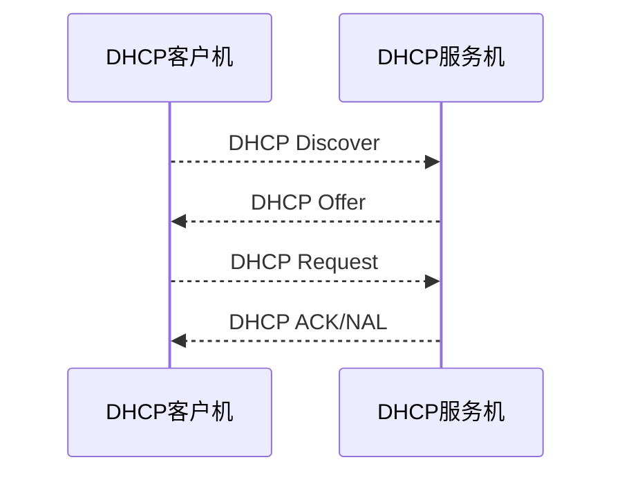

首先说明我使用的环境

```bash
[root@C7B1 filesrc]# uname -a
Linux C7B1 3.10.0-1160.el7.x86_64 #1 SMP Mon Oct 19 16:18:59 UTC 2020 x86_64 x86_64 x86_64 GNU/Linux
[root@C7B1 filesrc]# cat /proc/version 
Linux version 3.10.0-1160.el7.x86_64 (mockbuild@kbuilder.bsys.centos.org) (gcc version 4.8.5 20150623 (Red Hat 4.8.5-44) (GCC) ) #1 SMP Mon Oct 19 16:18:59 UTC 2020
[root@C7B1 filesrc]# cat /etc/issue
\S
Kernel \r on an \m
[root@C7B1 filesrc]# cat /etc/redhat-release 
CentOS Linux release 7.9.2009 (Core)
```

以下实验，如无特殊说明均指的是 CentOS7 关闭防火墙与SELinux

## 网络基础服务

### CentOS6与CentOS7区别

**常见命令**

| 项目       | CentOS6.x                                    | CentOS7.x                                                    | 区别                                                         |
| ---------- | -------------------------------------------- | ------------------------------------------------------------ | ------------------------------------------------------------ |
| 文件系统   | ext4                                         | xfs(性能好，速度快)                                          | 使用的时候ext4的瓶颈都很难达到，感知不强                     |
| 内核       | 2.6.x-x                                      | 3.10.x-x                                                     | 内核存在大升级导致防火墙等变化                               |
| 防火墙     | iptables                                     | firewalld                                                    | 后者优秀，感知不强，短期不会取而代之，大多数人习惯安装7后再重装iptables |
| 默认数据库 | MySQL                                        | MariaDB                                                      | 两者几乎相同，更换只是防止版权纠纷，MySQL优化方案比较成熟，短期不会取而代之 |
| 时间同步   | ntpq -p                                      | chronyc sources                                              |                                                              |
| 修改时区   | /etc/sysconfig/clock加入ZONE="Asia/Shanghai" | timedatectl set-timezone Asia/Shanghai                       | 7的命令实际上就是修改了6的配置文件                           |
| 修改语言   | /etc/sysconfig/i18n写入LANG="zh_CN.UTF-8"    | localectl set-locale LANG=zh_CN.UTF-8                        | 这个指的是终端的语言，自己不要改，怕不支持给乱码             |
| 主机名     | /etc/sysconfig/network写入                   | /etc/hostname写入或者hostnamectl set-hostname XXX，全是永久生效 | 主机名有一个设置要求，完整主机名是主机名.localhost.localdomain，不遵守也问题不大 |

**网络命令**

| 操作               | CentOS6.x              | CentOS7.x                 |
| ------------------ | ---------------------- | ------------------------- |
| 启动服务           | service 服务名 start   | systemctl start 服务名    |
| 关闭服务           | service 服务名 stop    | systemctl stop 服务名     |
| 重启服务           | service 服务名 restart | systemctl restart 服务名  |
| 查看所有服务状态   | service --status-all   | systemctl list-units      |
| 查看某个服务状态   | service 服务名 status  | systemctl statu 服务名    |
| 设置自启动         | chkconfig 服务名 on    | systemctl enable 服务     |
| 设置不自启动       | chkconfig 服务名 off   | systemctl disable 服务    |
| 查看所有自启动状态 | chkconfig --list       | systemctl list-unit-files |

CentOS7中所有的服务后面加上了.service，例如`httpd.service`这个写法的变化在CentOS7.0.x,CentOS7.1.x是必须的，但是后来RedHat加不加都可以了

**网络配置**

| 项目       | CentOS6.x      | CentOS7.x                       |
| ---------- | -------------- | ------------------------------- |
| 网卡名     | eth0           | ens33(7.0-7.5是ens+随机数)      |
| 网络配置   | ifconfig/setup | ip/nmtui                        |
| 网络服务名 | network        | NetworkManager(network作为备用) |

**网卡配置与网卡修改**

网卡的配置文件在`/etc/sysconfig/network-scripts/ifcfg-enp0s3`

```bash
TYPE=Ethernet
PROXY_METHOD=none
BROWSER_ONLY=no
BOOTPROTO=dhcp							# 网络连接模式 dhcp动态，static静态IP
DEFROUTE=yes
IPV4_FAILURE_FATAL=no
IPV6INIT=yes
IPV6_AUTOCONF=yes
IPV6_DEFROUTE=yes
IPV6_FAILURE_FATAL=no
IPV6_ADDR_GEN_MODE=stable-privacy
NAME=enp0s3								# 网卡名
UUID=ddc655f4-514a-499e-bbca-8dd27fa91684
DEVICE=enp0s3							# 设备名
ONBOOT=yes								# 开机加载
```

和CentOS6比起来就是多了IPv6的配置，注意大小写，**等号左面大写，右面小写**，如果可以用nmtui解决不要用这个

**将enp0s3换为eth0**

```bash
[root@bogon ~]# cd /etc/sysconfig/network-scripts/						# 进入目录
[root@bogon network-scripts]# ls ifcfg-enp0s3
ifcfg-enp0s3
[root@bogon network-scripts]# cp -a ifcfg-enp0s3 ifcfg-enp0s3.back		# 备份原文件
[root@bogon network-scripts]# mv ifcfg-enp0s3 ifcfg-eth0			    # 修改文件名
[root@bogon network-scripts]# vim ifcfg-eth0						   # 修改配置文件
```

修改网卡配置信息，改两处

```diff
TYPE=Ethernet
PROXY_METHOD=none
BROWSER_ONLY=no
BOOTPROTO=dhcp
DEFROUTE=yes
IPV4_FAILURE_FATAL=no
IPV6INIT=yes
IPV6_AUTOCONF=yes
IPV6_DEFROUTE=yes
IPV6_FAILURE_FATAL=no
IPV6_ADDR_GEN_MODE=stable-privacy
- NAME=enp0s3
+ NAME=eth0
UUID=ddc655f4-514a-499e-bbca-8dd27fa91684
- DEVICE=enp0s3
+ DEVICE=eth0
ONBOOT=yes
```

修改GRUB配置，关闭一致性命名规则(就是不让内核算名字)

```bash
[root@bogon network-scripts]# vim /etc/default/grub
```

```diff
GRUB_TIMEOUT=5
GRUB_DISTRIBUTOR="$(sed 's, release .*$,,g' /etc/system-release)"
GRUB_DEFAULT=saved
GRUB_DISABLE_SUBMENU=true
GRUB_TERMINAL_OUTPUT="console"
- GRUB_CMDLINE_LINUX="crashkernel=auto rhgb quiet"
+ GRUB_CMDLINE_LINUX="crashkernel=auto rhgb quiet net.ifnames=0 biosdevname=0"
GRUB_DISABLE_RECOVERY="true"
```

更新配置文件加载新的参数，重启

```shell
[root@bogon network-scripts]# grub2-mkconfig -o /boot/grub2/grub.cfg
[root@bogon network-scripts]# reboot
```

注意，CentOS7.x用的是Grub2，配置文件变化到`/etc/default/grub`，`/boot/grub2/grub.cfg`是grub2-mkconfig生成的

### 常见的网络协议与端口

- 网络地址与物理地址：

  IP地址是互联网协议地址，作用是为了给每个连接局域网的设备一个独一无二的数字地址，10.X.X.X，172.16.X.X-172.31.X.X.X，192.168.X.X是内网IP段

  MAC地址是物理地址，是为每一个设备设置一个固定的硬件地址，MAC工作在链路层，是一个12个16进制数

- TCP/IP五层协议

  应用层：FTP，HTTP，SMTP，Telnet，DNS...

  传输层：TCP，UDP...

  网络层：IP，ARP，ICMP...

  数字链路：PPP，PPPop...

  物理层：不常用

- 最常见网络端口

  配置文件在：`/etc/service`

  | 端口  | 服务         | 作用             |
  | ----- | ------------ | ---------------- |
  | 20/21 | FTP          | 文件共享         |
  | 22    | ssh          | 远程管理         |
  | 23    | Telnet       | 不安全的远程管理 |
  | 25    | smtp         | 发邮件           |
  | 465   | smtp(SSL)    | 发邮件           |
  | 110   | pop3         | 收邮件           |
  | 143   | IMAP4        | 收邮件           |
  | 993   | IMAP4(SSL)   | 收邮件           |
  | 80    | www服务http  | 网页访问         |
  | 443   | www服务https | 加密网页访问     |
  | 3306  | musql端口    | 数据库链接端口   |
  | 53    | DNS端口      | 域名解析端口     |

  - FTP有两个端口，21是长期监听的，用于登录等验证，具体文件传输走20端口
  - SMTP有两个，一个是加密的，一个没加密
  - pop3只能收文本文件，想要图片需要IMAP

### 网关和路由

**路由具有跨网段通信与路由选择的能力**

- 一个局域网中的设备可能需要访问另一个局域网中的设备，这个时候就需要路由器作为连接
- 一个网段去另一个网段可能有很多路可以走，这时候根据路由协议的不同路由器可能会规划出不同的走法
  路由有动态路由与动态路由，静态是规定路线的，计算少，但是网络情况变化就要修改所有路由，适合局域网，动态是自动寻路的

**网关**

- 网关首先必须是一个路由(可以是虚拟的也可以是真实的)，所以具有**路由转发与自动寻路**的能力
- 网关可以**默认路由**，只要是**电脑处理不了**的都会交给网关进行路由
- 网关可以进行NAT转换例如一个内网IP想要访问公网IP，可以经过网关，网关可以记下下这个数据包，重新包装，转发(例如几下这个包是内网ip10.65.1.1发来的，然后将这个数据包打包，用自己的公网IP名义发出，等收到包后根据包的特征返还非10.65.1.1)

**网关是逻辑概念,路由器是物理设备**,路由器可以作为网关来使用。**路由器是一个设备，而网关是一个结点（概念层）**。应该说：路由器可以实现网关的功能。另外，网关的功能还可以由局域网中一台双网卡的机器（其中一块网卡接入广域网）来实现。

- 查询路由表

  ```bash
  [root@bogon ~]# route -n
  Kernel IP routing table
  Destination     Gateway         Genmask         Flags Metric Ref    Use Iface
  10.0.2.0        0.0.0.0         255.255.255.0   U     100    0        0 eth0
  192.168.122.0   0.0.0.0         255.255.255.0   U     0      0        0 virbr0
  ```

  我们可以看到这是本机可以处理几个路由表，这是没有配配置网关的情况，当配置网关后，下方会显示一个默认路由，网关进行处理

- 临时修改网关

  添加：`route add default gw 网关的地址(路由器的地址)`

  添加：`route del default gw 网关的地址(路由器的地址)`

  之后查询可以看到

  ```bash
  [root@bogon ~]# route -n
  Kernel IP routing table
  Destination     Gateway         Genmask         Flags Metric Ref    Use Iface
  0.0.0.0         10.0.2.2        0.0.0.0         UG    100    0        0 eth0
  10.0.2.0        0.0.0.0         255.255.255.0   U     100    0        0 eth0
  192.168.122.0   0.0.0.0         255.255.255.0   U     0      0        0 virbr0
  ```

  最上面这个0.0.0.0意思是任意ip，意思是，不在下面这几个ip列表的ip本机没法路由，就直接交给网关10.0.2.2路由

### 网络管理命令

- DNS解析测试命令

  - 可以用过`nslookup`进行测试

    ```bash
    [root@bogon ~]# nslookup www.baidu.com
    Server:         192.168.43.1
    Address:        192.168.43.1#53
    
    Non-authoritative answer:
    Name:   www.baidu.com
    Address: 112.80.248.76
    Name:   www.baidu.com
    Address: 112.80.248.75
    www.baidu.com   canonical name = www.a.shifen.com.
    ```

  - 修改一张网卡的DNS

    `/etc/sysconfig/network-scripts/ifcfg-eth0`文件下`DNS1=ip`,`DNS2=ip`...

    或者使用setup

  - 修改全局DNS

    `/etc/resolv.conf`文件下`nameserver ip`

    或者使用setup

  - hosts文件

    `/etc/hosts`文件下是静态的解析记录，优先级高于DNS解析

- 网络查看命令

  查看网络连接与端口：`netstat -tuln`

  查看进程，网络连接与端口：`netstat -tulnp`

  查看所有不管是否连接的活动：`netstat -an`

- 查询本机和目标主机经过的节点数，路由追踪

  `traceroute [选项] 网址`

  - `-p` 指定UDP端口测试(默认是ICMP)
  - `-q n`指定测试n次
  - `n`以IP的方式测试，避开DNS

  注意这个功能在虚拟机NAT模式下无法实现，想要实现开机桥接模式

  这个可以测试主机连接效率

  这个功能的原理就是尝试去ping网址，成功之后就去ping他指向的网站，但是这个功能成功率不断下降，原因是很多网址禁止了这种ping

- 测试网络连通性

  `ping 网站`

  选项

  - `-i` 间隔时间
  - `-c`ping的次数
  - `-s`数据包的大小

- 地址解析，将ip转化为mac

  `arp ip`

  选项

  - `-a`查看曾经与本机连接过的所有设备的mac
  - `-d ip`删除某个ip的记录

- 网络探测命令

  `nmap`命令，默认不安装

  选项

  - `-sP` 扫描网段内有哪些计算机，例如`nmap -sP 10.0.2.0/24`子网掩码为24，网段为10.0.2.0，对方必须关闭防火墙才扫的到
  - `-sT` 查询指定ip开了哪些端口

- 常见的远程工具

  - Windows管理Linux：Xshell SecureCRT
  - Linux管理Windows：rdesktop
  - Linux管理Linux：SSH

### SSH管理

- 什么是SSH

  是Secure Shell缩写，与之前的Telnet比起来非明文传输，比较安全

- SSH的登录验证模式

  有账户密码验证与密钥对连接两种模式

**账户密码验证登录模式**

- 客户端尝试发送连接请求(问问能不能远程连接)
- 服务器生成和发送公钥给计算机
- 客户端使用公钥加密信息，发送
- 服务器解密验证

**密钥对的登录验证模式**

- 客户端向服务器发送连接请求和自己的**客户端的公钥**文件，服务器收到后直接返回**服务器的公钥**
- 服务器检查到自己没有客户端公钥时：
  - 返回没有收到客户端的公钥
- 服务器检查到有公钥的时候
  - 服务器返回一段使用**客户端的公钥**加密的challenge（随便找了点内容加密）
  - 客户端用**客户端的私钥**解密，然后用**服务器的公钥**加密
  - 服务器用**服务器的私钥**解密验证到和之前自己找的那个内容一样
- **注意**：在连接之前客户端要想办法把自己的公钥放在服务器上

**SSH连接实验**

- 环境准备

  - 修改主机名以方便识别

      ```bash
      [root@bogon ~]# uname -n					# 查看主机名
      bogon
      [root@bogon ~]# vim /etc/sysconfig/network	# 修改主机名
      ```

      ```diff
      NETWORKING=yes
      - HOSTNAME=localhost.localdomain
      + HOSTNAME=KarryZenBook14s
      ```

      注意，主机名规范应该是X.Y但是不写成这种格式基本不影响，最多有两个waring
      
      如果需要立即生效还需要修改hosts文件
      
      ```bash
      [root@bogon ~]# vim /etc/hosts
    ```
    
    将原主机名(localhost.localdomain)换成新的(KarryZenBook14s)注意原主机名是一个整体，第一列那个localhost不是主机名
    
    ```diff
      - 127.0.0.1   localhost localhost.localdomain localhost4 localhost4.localdomain4
      + 127.0.0.1   localhost KarryZenBook14s localhost4 localhost4.localdomain4
      - ::1         localhost localhost.localdomain localhost6 localhost6.localdomain6
      + ::1         localhost KarryZenBook14s localhost6 localhost6.localdomain6
    ```
    
      重启
    
  - 关闭防火墙和SELinux
  
      永久关闭防护(重启生效)
  
      ```bash
      [root@KarryZenBook14s ~]# chkconfig iptables off	# 关闭防火墙自启
      [root@KarryZenBook14s ~]# vim /etc/selinux/config
      ```
  
      修改SELinux配置
  
      ```diff
      #     disabled - No SELinux policy is loaded.
      - SELINUX=enforcing
      + SELINUX=disabled
      # SELINUXTYPE= can take one of these two values:
      ```
  
      临时关闭防火墙和SELinux
  
      ```bash
      [root@KarryZenBook14s ~]# iptables -F		# 注意，这里不是关闭了防火墙，是清空了防火墙规则
      [root@KarryZenBook14s ~]# setenforce 0
      ```

- 用户密码验证连接(客户端Windows与Linux均可)

  `ssh`命令：`ssh [-l username] [-p port] ip地址`，这里`-l`指定用户不写会自动root登录，`-p`指定端口，不写默认22，如果虚拟机是NAT的还是要写端口，例如

  ```bash
  PS C:\Users\tclkr> ssh -l root -p 9001 127.0.0.1
  ```

  退出连接：`exit`或者`Ctrl+D`

- 使用密钥对连接(客户端Windows与Linux均可)

  - 在客户端生成客户端的公钥与私钥

    ```bash
    PS C:\Users\tclkr> ssh-keygen -t rsa -b 2048
    Generating public/private rsa key pair.
    Enter file in which to save the key (C:\Users\tclkr/.ssh/id_rsa):
    # 询问存放位置
    Enter passphrase (empty for no passphrase):
    Enter same passphrase again:
    # 询问是否加密
    Your identification has been saved in C:\Users\tclkr/.ssh/id_rsa.
    Your public key has been saved in C:\Users\tclkr/.ssh/id_rsa.pub.
    The key fingerprint is:
    SHA256:xfRZov/YP/9Jas0OcLmTZ1vlPv3Ka3dmgUP65yENgHY tclkr@KarryZenBook14s
    The key's randomart image is:
    +---[RSA 2048]----+
    |          . . .  |
    |         o.o +   |
    |         o+Eo    |
    |        .......  |
    |        S  .++. .|
    |           .o*=o.|
    |            o***=|
    |             +XO@|
    |            .oB@&|
    +----[SHA256]-----+
    ```

    - `-t`加密方式，设置为rsa
    - `-b`密钥长度
    - 询问密钥位置的时候直接回车保存在默认的家目录的/.ssh/id_rsa，在Linux上可能是/root，也可能是/home
    - 之后询问是否加密私钥，这个是考虑到在不加密的情况下，如果别人获取到了计算机，就可以直接免密连接服务器，回车就是不加密，也可以连续两边输入私钥密码以后登录的时候输入私钥密码即可

  - 上传客户端公钥到服务器

    不必使用scp/ftp，ssh有自己的命令

    ```bash
    tclkr@KarryZenBook14s MINGW64 ~/Desktop
    $ ssh-copy-id -p 9001 root@127.0.0.1
    root@127.0.0.1's password:
    
    Number of key(s) added: 1
    
    Now try logging into the machine, with:   "ssh -p '9001' 'root@127.0.0.1'"
    and check to make sure that only the key(s) you wanted were added.
    ```

    ssh-copy-id可以直接复制，但是windows的PowerShell并没有这个命令，这里临时切换到了Windows的GitBash完成了操作，`-p`是指定端口

    命令执行完，你的公钥(HOME/.ssh/id_rsa.pub)内容就被追加到了(Linux的HOME/.ssh/authorized_keys)

    注意：这里**填写的用户名就是未来你要登录的用户的用户名**，不能写了一个用户还想免密登录到别的用户

    注意：**不得直接上传公钥文件**，如果不用ssh-copy-id，请将文件复制下来，自己创建文件然后粘贴，而不是使用ftp/scp直接上传，因为Windows与Linux的换行格式不同！

  - 登录服务器

    与密码登录的命令一样，只不过免密了

- 禁用密码登录

  正常情况下是允许密钥对和密码同时登录的，但是密钥对明显安全等级高，可以禁用密码登录

  修改配置文件(是sshd，d是deamon缩写，是守护程序的意思，一般服务的进程有d，客户端进程没有d)

  ```bash
  [root@KarryZenBook14s ~]# vim /etc/ssh/sshd_config
  ```

  搜索Password修改即可，**注意P大写**

  ```diff
  #PasswordAuthentication yes
  #PermitEmptyPasswords no
  - PasswordAuthentication yes
  + PasswordAuthentication no
  # Change to no to disable s/key passwords
  #ChallengeResponseAuthentication yes
  ```

- 禁止使用root远程登录

  由于很多事故是root误操作造成的，建议ssh的时候禁止root登录，可以在需要的时候由普通用户su过去

  ```bash
  [root@KarryZenBook14s ~]# vim /etc/ssh/sshd_config
  ```

  搜索RootLogin修改即可，**注意R L大写**

  ```diff
  #LoginGraceTime 2m
  - #PermitRootLogin yes
  + PermitRootLogin no
  #StrictModes yes
  ```

- 修改ssh默认端口

  默认ssh是使用22口，为了防止攻击，我们可以修改端口，尽量使用1000-65536端口(1000-端酒容易被占用)

  ```bash
  [root@KarryZenBook14s ~]# vim /etc/ssh/sshd_config
  ```

  搜索Port修改即可，**注意P大写**

  ```diff
  # possible, but leave them commented.  Uncommented options change a
  # default value.
  
  - #Port 22
  + Port 9000
  #AddressFamily any
  #ListenAddress 0.0.0
  ```

  之后`ssh -p 9000 ip`，要是使用的是NAT，要修改NAT端口转发设置

- 限制ssh监听IP

  在生产环境中服务器大都有两块网卡，一个对内，一个对外，对外的负责服务，对内的负责被管理，**注意这里限制的是ssh被访问的ip，不是限制客户机IP**，例如，有：客户机IP为10.1.1.1，服务器内网网卡IP为10.2.2.2，服务器外网网卡IP为：9.9.9.9，这个时候我们可以限制ssh只能连接到10.2.2.2不可连接到9.9.9.9，对公网暴露9.9.9.9这个IP。是限制服务器被连接的网卡IP不是客户机的IP！

  ```bash
  [root@KarryZenBook14s ~]# vim /etc/ssh/sshd_config
  ```

  搜索ListenAddress修改即可，**注意L A大写**

  ```diff
  #Port 22
  #AddressFamily any
  - #ListenAddress 0.0.0.0
  + ListenAddress 内网IP
  #ListenAddress ::
  ```

- `scp`命令

  是一个安全的远程文件赋值命令，类似于命令cp，scp的传输是加密的，所以可能会影响一点速度，但是scp不是很站资源，不会提高多少系统负荷

  `scp [-P 端口] [-r] 源文件 username@ip:目标位置` `-P`表示连接端口，scp默认是22口，`-r`递归复制,例如`scp -P 9000 -r ./download/httpd-2.2.9.tar.bz2  liukairui@127.0.0.1:/home/liukairui`

  当然，既然和cp差不多，也可以反向拷贝`scp [-P 端口] [-r] username@ip:源文件 目标位置`

  注意，ssh的端口是`-p`,scp的端口是`-P`

- `sftp`命令

  是一个安全的文件学出协议，几乎与ftp语法功能一样，但是由于使用了加密技术，安全但是低效，使用示例：`sftp -P 9001 liukairui@127.0.0.1`

  执行后进入一个交互界面，在这里的命令可能与Linux的相似，不一样，这里面的是独立的
  
  - `help`获取帮助
  
  - `pwd`与`lpwd`，pwd指的是服务器当前工作路径，lpwd是登录这个服务器前宿主机的位置,l是local的意思，例如
  
    ```bash
    sftp> pwd
    Remote working directory: /home/liukairui
    sftp> lpwd
    Local working directory: c:\users\tclkr
    ```
  
  - `cd`与`lcd`，cd进入服务器目录，lcd进入客户端的某个目录
  
  - `ls`与`lls`，ls查看服务器目录，lls查看客户端的某个目录
  
    ```bash
    sftp> cd itisserverflod
    sftp> ls
    itisserverfile
    sftp> lcd Desktop
    sftp> lls
     驱动器 C 中的卷没有标签。
     卷的序列号是 E25C-B336
    
     C:\Users\tclkr\Desktop 的目录
    
    2021/03/04  11:24    <DIR>          .
    2021/03/04  11:24    <DIR>          ..
    2021/03/01  23:04            10,337 2021.xlsx
                   1 个文件         10,337 字节
                   2 个目录 212,300,955,648 可用字节
    ```
  
  - `put`,`get`上传和下载文件到服务器
  
    ```bash
    sftp> pwd
    Remote working directory: /home/liukairui/tmp
    sftp> put .wakatime.cfg
    Uploading .wakatime.cfg to /home/liukairui/tmp/.wakatime.cfg
    .wakatime.cfg                             100%   58    41.6KB/s   00:00
    sftp> ls -al
    drwxrwxr-x    2 liukairui liukairui     4096 Mar  5 08:41 .
    drwx------    6 liukairui liukairui     4096 Mar  5 08:40 ..
    -rw-rw-r--    1 liukairui liukairui       58 Mar  5 08:41 .wakatime.cfg
    ```
  
    ```bash
    sftp> pwd
    Remote working directory: /home/liukairui/test
    sftp> lpwd
    Local working directory: c:\users\tclkr\desktop
    sftp> get .wakatime.db
    Fetching /home/liukairui/test/.wakatime.db to .wakatime.db
    /home/liukairui/test/.wakatime.db         100%   12KB   4.4MB/s   00:00
    sftp> lls
     驱动器 C 中的卷没有标签。
     卷的序列号是 E25C-B336
    
     C:\Users\tclkr\Desktop 的目录
    
    2021/03/05  08:45    <DIR>          .
    2021/03/05  08:45    <DIR>          ..
    2021/03/05  08:45            12,288 .wakatime.db
    2021/03/01  23:04            10,337 2021.xlsx
                   2 个文件         22,625 字节
                   2 个目录 212,298,076,160 可用字节
    ```
  
    注意sftp只能get服务器登录用户所属的文件
  
  - 要是`-P`换端口不行可以尝试`-oPort=端口`

### TCP Wrappers 简单防火墙

一个Linux自带的简易版防火墙，比iptables弱，生产环境用的不多，是工作在传输层的安全工具，可以对**有状态连接**的**TCP**的**特定**服务，常见的服务有telnet，sshd，vsftpd，rpcbind

- 查询服务是否被TCP Wrapper控制
先查询服务的命令所在位置(以ssh为例，但是我们要查的是服务端的，命令是sshd)
使用ldd静态的查看服务在执行的时候调用的库文件列表，使用grep查询有没有调用libwrap.so

    ```bash
  [root@KarryZenBook14s itisserverflod]# which sshd
  /usr/sbin/sshd
  [root@KarryZenBook14s itisserverflod]# ldd /usr/sbin/sshd | grep libwrap.so
          libwrap.so.0 => /lib64/libwrap.so.0 (0x00007f864052c000)
    ```

- TCP Wrappers的工作原理

  当获取连接请求后，先读取系统管理员设置的访问控制文件，符合要求就会将连接原封不动的发送给服务，否则直接拒绝

  控制文件的读取方式

  - /etc/host.allow的权限比/etc/host.deny大
  - 看到/etc/host.allow有则直接放行
  - 看到/etc/host.allow无但是/etc/host.deny没有也放行
  - 看到/etc/host.allow无但是/etc/host.deny有不放行
  - 需要个别服务允许，其他拒绝需要把服务写在allow，deny上写all
  - 需要拒绝部分直接在deny里面写要拒绝的

- TCP Wrappers的使用

  编写规则是`service_list@host: client_list`

  - service_list 服务列表

  - host **服务器**的ip，例如服务器有内网网卡IP为10.65.1.1和外网网卡2.2.2.2，我们希望只有内网网卡可以建立服务，可以在allow中将host写成10.65.1.1，不写就是哪个网卡均可

  - client_list 列出访问者的显示，多个可以用`,`或者空格隔开

    - 基于IP地址的：10.65.1.1(一个ip)，一个ip段`10.65.1.`，一个ip段`10.65.`注意，限制网段要这么写，不得写成`10.65..`
    - 基于主机名的：很少用，
    - 基于ip/掩码的，10.65.1.1/255.255.255.0，在CentOS7中支持将掩码改为/24
    - 其他规则写法：ALL和LOCAL

  - 限制网段用户访问ssh

    修改限制文件

    ```bash
    [root@KarryZenBook14s ~]# vim /etc/hosts.deny
    ```

    添加规则，注意，希望限制`10.65.11.*`写`10.65.11.`，希望限制`10.65.*.*`写`10.65.`，不得写成`10.65..`，我们限制的是访问服务器的ssh所以写的是sshd

    ```bash
    sshd:10.65.
    ```

    直接exit退出登录即可，这个服务的配置文件无需重启服务，尝试登录

    ```bash
    PS C:\Users\tclkr> ssh -l root -p 9001 127.0.0.1
    Last login: Fri Mar  5 10:09:16 2021 from 10.0.2.2
    ```

## DHCP服务

DHCP动态主机配置协议，是一种在**局域网内**的使用**UDP**的不可靠传输协议工作的协议，主要作用是集中**管理分配**网络资源，使得网络中的主机可以**动态获取IP，网关，DNS**...

### DHCP的工作原理

所谓的DHCP就是给需要IP的机器分配IP地址，当机器不需要的时候就收回来，相当于租房子一样，有一个租期，快到的时候还需要报告是否续租



可以这样粗略的理解

- DHCP客户机不知道内网中到底谁是DHCP服务机，于是想全网广播DHCP Discover包，请求DHCP服务 
- DHCP服务机收到请求后向DHCP客户机发送一个可用的IP地址
- 客户端可能接受到很多服务机发来的很多IP，选择最早收到的那个IP(证明这个路线最快的)发送DHCP Request包告诉服务器，这个IP我用了
- 服务器收到Request包后再次确认这个IP有没有被别的机器占用(可能在客户机回复的这个期间这个IP就被占用了)，如果没有占用回复DHCP ACK包，代表可用，如果被占用了回复DHCP NAL包拒绝分配

可以这样理解

- 一个人(DHCP客户端)去找工作，先给整个行业发送简历面试(DHCP Discover)
- 有公司看上了他，于是回复offer(DHCP offer)说可以来我们公司上班了
- 这个人收到了很多公司(DHCP服务器)的offer(DHCP Offer)决定选择待遇最好(回复DHCPoffer最快的)的公司上班于是就回复Offer(DHCP Request)说我去你们公司上班了
- 公司收到回复后再次确认这个offer是否有效，比如超时了？Offer发给别人了？然后回复

详细的过程

- 当DHCP客户机启动后，发现自己没有IP，于是将自己的IP设置为0.0.0.0，但是0.0.0.0不是合法IP无法通信，于是联系DHCP，联系方法就是向全网的UDP 67端口发送请求包，这个包里面包含了自己的MAC和主机名(方便后续确认)
- DHCP收到主机名后在自己的可用IP池里找一个，做好标记，将自己的MAC与自己的IP，合法的IP合法的网关，子网掩码发回，由于不知道到底是谁发来的，于是仍然是以全网广播的形式发回，此时所有发送给DHCP请求的设备都会收包，但是由于有主机名与MAC可以校验是否正确收到
- 客户机收到OFFER后找到最先收到的，保留服务器的IP，向**全网广播**REQUEST，告诉全网DHCP服务器自己和那个服务器联系上了，相当于拒绝 了其他服务器，这个数据包包含了服务器IP，服务器表示字段
- 当DHCP服务器收到DHCP客户机回答的DHCP request请求信息之后，它便向DHCP客户机发送一个包含它所提供的IP地址和其他设置的DHCP ack确认信息，告诉DHCP客户机可以使用它所提供的IP地址。然后DHCP客户机便将其TCP/IP协议与网卡绑定，另外，除DHCP客户机选中的服务器外，其他的DHCP服务器都将收回曾提供的IP地址。
- 重新登录。以后DHCP客户机每次重新登录网络时，就不需要再发送DHCP discover发现信息了，而是直接发送包含前一次所分配的IP地址的DHCP request请求信息(因为已经保留了DHCP服务器地址)。当DHCP服务器收到这一信息后，它会尝试让DHCP客户机继续使用原来的IP地址，并回答一个DHCP ack确认信息。如果此IP地址已无法再分配给原来的DHCP客户机使用时（比如此IP地址已分配给其它DHCP客户机使用），则DHCP服务器给DHCP客户机回答一个DHCP nack否认信息。当原来的DHCP客户机收到此DHCP nack否认信息后，它就必须重新发送DHCP discover发现信息来请求新的IP地址。

**DHCP的续租**

- 默认租约与最长租约：默认租约指的是服务器租告诉客户机下次续租的时间，在这个时间内如果需要续约，客户机会联系服务机，如果一直联系不到服务机，客户机会在最长租约到期的时候自动退租
- 客户机会在租约过去50%的时候找DHCP服务器续租，方式就是发送DHCPRequest包，收到ACK包代表成功，客户机就会根据包内数据更新租期，调整参数，如果没有收到，客户机会继续使用剩下的50%
- 如果50%的时候没有收到ACK，客户机会在87.5%的时候再次请求续租，如果还是失败，到最长租期的时候客户机会自动放弃IP，重新广播请求

### DHCP服务搭建

环境准备：

- 切换到VMware 使用CentOS7
- 关闭SELinux，关闭防火墙
- 关闭VMware网络编辑器的DHCP功能(编辑-虚拟网络编辑器-选择NAT和HostOnly-取消勾选DHCP)
- 准备两台机器开启网络连接设置NAT

软件：

- dhcp：DHCP**服务用**软件包(`yum -y install dhcp`)
- dhcp-common：DHCP软件命令包(BaseServer自带)

服务：

- dhcpd：DHCP服务名
- dhcrelay：DHCP中继服务

端口号：

- udp 67：服务器监听端口，收用户的请求
- udp 68：服务器源端口，发送数据包给用户

配置文件：

- dhcpd的配置文件：/etc/dhcp/dhcpd.conf(这个文件默认空，只说了模板文件在哪里)与/usr/share/doc/dhcp-***/dhcpd.conf.sample(DHCP模板文件)
- dhcrelay的配置文件：/etc/sysconfig/shcrelay

**基础实验**

- 生成配置文件：复制/usr/share/doc/dhcp-***/dhcpd.conf.sample到/etc/dhcp/dhcpd.conf

- 有很多

  ```bash
  subnet 10.254.239.32 netmask 255.255.255.224 {
    range dynamic-bootp 10.254.239.40 10.254.239.60;
    option broadcast-address 10.254.239.31;
    option routers rtr-239-32-1.example.org;
  }
  ```

  **subnet**开头的代码块，全部注释，只保留最后一个，如下

  ```bash
  subnet 10.5.5.0 netmask 255.255.255.224 {			# 分配网段 子网掩码
    range 10.5.5.26 10.5.5.30;						# IP池
    option domain-name-servers ns1.internal.example.org;	# 主机所在域
    option domain-name "internal.example.org";		# 主机名
    option routers 10.5.5.1;							# 默认网关
    option broadcast-address 10.5.5.31;				# 广播地址
    default-lease-time 600;							# 租约
    max-lease-time 7200;								# 租约
  }
  ```

  修改配置为

  ```bash
  subnet 192.168.46.0 netmask 255.255.255.0 {
    range 192.168.46.101 192.168.46.110;
    default-lease-time 600;
    max-lease-time 7200;
  }
  ```

  **注意**：subnet要写DHCP服务器所在的**网段**，主机名写0！，使用`ip a`查询ip和掩码

  启动

  ```bash
  systemctl start dhcpd
  ```

  验证dhcp启动

  ```shell
  [root@Cent7Base1 dhcp]# netstat -tlun
  Proto Recv-Q Send-Q Local Address           Foreign Address         State      
  udp        0      0 0.0.0.0:67              0.0.0.0:*                          
  ```

  看到UDP67端口已经启用,其他机器只要setup设置自动获取DHCP,然后重启服务(systemctl )

  

==DHCP服务无法关闭 实验略==

## DNS服务

DNS就是将域名与IP相互转换的服务，可以运行在公网上，域名->IP叫做正向解析，IP->域名叫做反向解析

### 域名的组成与分类

常见格式：www.baidu.com
完整格式：www.baidu.com.
完整格式多了一个点，这个在早期是必写的，现在浏览器会自动补上，可以不写，完整域名自右向左分别是

- `.`：根域，可以不写，所有的网站都是从根域出发的

  世界上有一台主根服务器，和12个辅根服务器，主根服务器辅根服务器从主根服务器同步数据，但是国内没有IPv4的根服务器，有镜像根服务器可以从主根服务器中获取镜像

- `com`：顶级域，是由ICANN组织指定和管理，顶级域有

  - 国家地区域名：cn,jp,us...
  - 通用顶级域名：org,edu,org...
  - 新通用顶级域名：top，red...

- `baidu`：二级域，是由个人去申请

- `www`：三级域，服务器网站域名

- ......

### 域名解析过程

以www.liukairui.cc为例

- 输入域名(www.liukairui.cc)
- 浏览器补根域名和:80(www.liukairui.cc.:80)
- 本机查询Hosts文件本地的DNS(在hosts中找www.liukairui.cc.:80)
- 本机Hosts文件没有找到的话找本机的DNS缓存(在缓存中找www.liukairui.cc.:80)
- 没有的话访问DNS服务器获取IP地址(去问DNSwww.liukairui.cc.:80)
- DNS服务器先在自己的解析库进行查找(去解析库中找www.liukairui.cc.:80)
- 找不到的话DNS去自己的缓存中找(缓存并不是指自己的最近查找的，而是从根服务器查找的，DNS认为这些可能不权威于是不入库)(去缓存中找www.liukairui.cc.:80)
- 找不到的话去找根服务器(问根服务器找www.liukairui.cc.:80)
- 根服务器识别网站的一级域，返回顶级域名服务器地址
- DNS去找对应的顶级域服务器(DNS服务器去找.cc.的顶级域名服务器)
- 顶级域名服务器去找二级域名ip(cc顶级域名服务器去找liukairui.cc的ip，没有www.！)
- DNS服务器去找网站问子域名IP(DNS问liukairui.cc问他www.liukairui.cc在哪里)
- liukairui.cc返回www.liukairui.cc的IP


### DNS实验

- 软件名：bind

- 服务名：named

- 软件端口

  UDP 53 监听端口，与客户机通信

  TCP 53 服务器主从同步

- 配置文件

  `/etc/named.conf` 主配置文件`/etc/named.rfc1912.zones`正反向解析配置文件

  `/var/named/named.localhost`正向解析配置文件，`/var/named/named.loopback`反向解析配置文件

- 相关文件

  `/var/named/named.ca`记录了13台根域服务器位置

  `/var/named/slaves`主从同步缓存

  `/var/named/XX.XX`地址IP对应关系映射文件与主从同步文件

- 配置 所有大括号内部都有空格！！！

  `/etc/named.conf`

  ```bash
  options {
  	listen-on port 53 { 127.0.0.1; };		# 监听网卡IP
  	listen-on-v6 port 53 { ::1; };			# 监听网卡IP(IPv6)
  	# 此处的网卡指的是**服务器连接的网卡的IP**，意思是监听来自那张网卡的请求，接受所有网卡写any
  	directory 	"/var/named";
  	dump-file 	"/var/named/data/cache_dump.db";
  	statistics-file "/var/named/data/named_stats.txt";
  	memstatistics-file "/var/named/data/named_mem_stats.txt";
  	recursing-file  "/var/named/data/named.recursing";
  	secroots-file   "/var/named/data/named.secroots";
  	# 以上是数据文件保存目录
  	allow-query     { localhost; };
  	# 允许访问服务器的客户端的IP，localhost就只有本机可以使用，改为any
  	recursion yes;
  	dnssec-enable yes;
  	dnssec-validation yes;
  	bindkeys-file "/etc/named.root.key";
  	managed-keys-directory "/var/named/dynamic";
  	pid-file "/run/named/named.pid";
  	session-keyfile "/run/named/session.key";
  };
  logging {
          channel default_debug {
                  file "data/named.run";
                  severity dynamic;
          };
  };
  zone "." IN {
  	type hint;
  	file "named.ca";
  };
  include "/etc/named.rfc1912.zones";			# 调用区域配置文件
  include "/etc/named.root.key";
  ```

  将`listen-on port `与allow-query改为any

  `/etc/named.rfc1912.zones`

  ```bash
  zone "localhost.localdomain" IN {	# 正向配置，写要解析的域名的*域*，例如swu.edu.cn写edu.cn
          type master;				# 服务器类型：主(master)/从(slave)
          file "named.localhost";		# 正向配置文件位置
          allow-update { none; };		# 允许来自哪里IP从服务器从我这里同步数据库
  };
  
  zone "1.0.0.127.in-addr.arpa" IN {	
  # 逆序填写IP(通常写的是网段,例如192.168.5.0写成0.5.168.192或者5.168.192)
  # .in-addr.arpa" IN是固定内容
          type master;
          file "named.loopback";
          allow-update { none; };
  };
  ```

  正向解析文件，XX.XX

  ```bash
  $TTL 1D								# 域名有效解析生存周期
  @       IN SOA  @ rname.invalid. (	
  # @ 要替换为DNS服务器域名 IN SOA是起始授权机构资源记录，不动即可 rname.invalid.写解析域名的域，例如想解析cs.swu.edu.cn就写swu.edu.cn. 一般要在DNS域&目标域后面加上根域.
                                          0       ; serial
                                          # 配置文件的版本，例如20210320，用于同步的标识
                                          1D      ; refresh
                                          # 从服务器多久同步一次
                                          1H      ; retry
                                          # 主从同步失败后重试周期
                                          1W      ; expire
                                          # 无法更新的时候从服务器*服务*的失效时间
                                          3H )    ; minimum
                                          # 缓存回答NO的失效时间
          NS      @			# 这个网站自己的DNS服务器位置
          A       127.0.0.1	# IPv4解析记录
          AAAA    ::1			# IPv6解析记录
  ```

  反向解析文件，XX.XX

  ```bash
  $TTL 1D
  @       IN SOA  @ rname.invalid. (
                                          0       ; serial
                                          1D      ; refresh
                                          1H      ; retry
                                          1W      ; expire
                                          3H )    ; minimum
          NS      @
          A       127.0.0.1
          AAAA    ::1
          PTR     localhost.			# 反向解析记录
  ```

  常见记录类型

  | 类型  | 作用                                                         |
  | ----- | ------------------------------------------------------------ |
  | A     | IPv4地址记录                                                 |
  | CNAME | 将公开的这个域名指向另一个不公开的域名的，但是浏览器还是现实公开的域名 |
  | TXT   | 任何东西，用来反垃圾邮件                                     |
  | NS    | 这个域名的域的DNS，例如DNSPOD有swu.edu.cn的记录，阿里云有computer.swu.edu.cn的记录，那么就需要把DNSPOD的NS指向阿里云 |
  | AAAA  | IPv6地址记录                                                 |
  | MX    | 邮件交换记录，让收件箱可以收到邮件就需要MX                   |

- **基本功能实现**

  使用两台服务器Cent7Base1(192.168.40.129)作为DNS服务器，Cent7Base2做Apache服务器(192.168.40.130)，Cent7Base3作为客户端

  - 配置主配置文件`/etc/named.conf`

    ```diff
    - listen-on port 53 { 127.0.0.1; };
    + listen-on port 53 { any; };
    - listen-on-v6 port 53 { ::1:; };
    + listen-on-v6 port 53 { any; };
    - allow-query     { localhost; };
    + allow-query     { any; };
    ```

  - 配置区域配置文件`/etc/named.rfc1912.zones`

    ```bash
    zone "mytest.com" IN {					# 域名
            type master;
            file "mytest.localhost";		# 正向文件
            allow-update { none; };
    };
    
    zone "40.168.192.in-addr.arpa" IN {		# 反写网段
            type master;
            file "mytest.loopback";			# 反向文件
            allow-update { none; };
    };
    ```

  - 数据文件`mytest.localhost`

    ```bash
    $TTL 1D
    @       IN SOA  mytest.com. rname.invalid. (
                                            0       ; serial
                                            1D      ; refresh
                                            1H      ; retry
                                            1W      ; expire
                                            3H )    ; minimum
            NS      dns.mytest.com.
    dns     A       192.168.40.129
    www     A       192.168.40.130
    ```

  - 反向解析记录`mytest.loopback`

    ```bash
    $TTL 1D
    @       IN SOA  mytest.com. rname.invalid. (
                                            0       ; serial
                                            1D      ; refresh
                                            1H      ; retry
                                            1W      ; expire
                                            3H )    ; minimum
            NS      dns.mytest.com.
    129     PTR     dns.mytest.com.
    130     PTR     www.mytest.com.
    ```

  - 启动与验证

    ```bash
    [root@Cent7Base1 named]# systemctl restart named
    [root@Cent7Base1 named]# netstat -tuln
    Active Internet connections (only servers)
    Proto Recv-Q Send-Q Local Address           Foreign Address         State      
    tcp        0      0 192.168.40.129:53       0.0.0.0:*               LISTEN     
    tcp        0      0 127.0.0.1:53            0.0.0.0:*               LISTEN     
    tcp6       0      0 :::53                   :::*                    LISTEN     
    udp        0      0 192.168.40.129:53       0.0.0.0:*                          
    udp        0      0 127.0.0.1:53            0.0.0.0:*                          
    udp6       0      0 :::53                   :::*                               
    ```

    看到有三个TCP的53和三个UDP的53

  - 使用DNS

    nmtui找到网卡配置 设置DNS为192.168.40.129

    `systemctl restart network`重启网卡
  
    nslookup www.mytest.com即可
  
    注意，`systemctl restart network`会重启所有的网卡，这是不能出现在服务器上的，这样的重启会导致公网服务中断，正确的方式是单独重启对应的网卡，例如重启ens33：`ifdown ens33;ifup ens33`即可，先断点后通电
  
    实际上，上面这个实验不会成功，因为互联网上真的有一个网站叫做www.mytest.com，IP是185.53.177.74在欧洲，于是你可能会解析到这个IP,因为vmware的首选DNS是外网的，只需要设置一个没人注册的域名就可以了，例如我试过`www.imkarryinswu.com`重新配置，顺利使用.

- **主从DNS服务器**

  使用：四台服务器，VMC7B1(192.168.40.132)作主DNS服务器，VMC7B2(192.168.40.133)作从DNS服务器，VMC7B3(192.168.40.134)作http服务器，VMC6B1(192.168.40.135)做客户机

  从服务器可以减轻主服务器压力，备份主服务器数据

  主DNS连接到从DNS,客户机连接到从DNS

  - 配置VMC6B1,VMC7B3

    开启http服务，设置DNS为192.168.40.133

  - 配置主服务器VMC7B1(基于上一个实验的配置文件)

    修改主配置文件`/etc/named.conf`

    ```diff
    - listen-on port 53 { any; };
    + listen-on port 53 { 192.168.40.132; };		# DNS监听端口为本机的一个网卡，当然可以写any
    - allow-query     { any; };
    + allow-query     { 192.168.40.133; };			# 设置允许从服务器IP同步
    ```

    区域配置文件不变

    修改正向解析配置文件`/var/named/imkarryinswu.localhost`

    ```diff
    $TTL 1D
    @       IN SOA  imkarryinswu.com. rname.invalid. (
    -                                       0       ; serial
    +                                       20210325; serial
                                            1D      ; refresh
                                            1H      ; retry
                                            1W      ; expire
                                            3H )    ; minimum
            NS      dns.imkarryinswu.com.
    -www     A       192.168.40.133
    +www     A       192.168.40.134			# http服务器位置变动
    dns     A       192.168.40.132
    ```

    修改反向解析配置文件(同正向解析配置文件)

  - 修改从服务器配置

    修改主配置文件

    ```bash
    listen-on port 53 { 192.168.40.133; };
    listen-on-v6 port 53 { ::1; };
    allow-query     { any; };
    ```

    修改从服务器区域配置

    ```diff
    zone "imkarryinswu.com" IN {
    -        type master;
    +        type slave;				# 设置类型为从服务器
    +        masters { 192.168.40.132; };	# 填写主服务器IP
    -		 file "mytest.localhost";				
    +        file "slaves/imkarryinswu.localhost";	# 文件保存位置,前面要加上slaves
    + 		 # 注意:从服务器默认保存路径是/var/named/slaves这里最好也加上，否则保存到/var/named 
    };
    
    zone "1.0.0.127.in-addr.arpa" IN {		# 反向解析同理
            type slave;
            masters { 192.168.40.132; };
            file "slaves/imkarryinswu.loopback";
    };
    ```

  - 测试

    ```bash
    [root@VMC6B1 ~]# nslookup www.imkarryinswu.com
    Server:         192.168.40.133
    Address:        192.168.40.133#53
    
    Name:   www.imkarryinswu.com
    Address: 192.168.40.134
    
    [root@VMC6B1 ~]# ping www.imkarryinswu.com
    PING www.imkarryinswu.com (192.168.40.134) 56(84) bytes of data.
    64 bytes from 192.168.40.134: icmp_seq=1 ttl=64 time=1.25 ms
    64 bytes from 192.168.40.134: icmp_seq=2 ttl=64 time=0.472 ms
    ```

  - 尝试主服务器挂掉

    主服务器

    ```bash
    systemctl stop named
    ```

    可以正常使用

- **DNS缓存服务器**

  主从服务器可以减少主服务器的压力，但是用户的查询时间并不会改变，我们希望搭建一个缓存服务器，将常用网站缓存起来，可以快速访问

  原理：主从模式是从服务器定期主动的向主服务器更新自己的DNS信息，同时可以独立为其他用户提供服务，缓存服务器不会主动更新，只有当用户请求他解析IP后他会向主服务器要解析结果，同时自己保留一份，过期销毁，不会主动向主服务器更新，主服务器挂了之后如果还有请求会从自己的缓存从拿数据，同时提示这是不权威的结果

  实验环境与主从相同，接着上次实验的结果，修改从DNS服务器为缓存服务器，关闭从服务器的named服务，yum安装程序：dnsmasq,

  配置文件

  ```bash
  domain=imkarryinswu.com		# 要缓存的域，这里不写的话缓存服务器连解析都不解析
  server=192.168.40.132		# 主DNS位置
  cache-size=15000			# 最大缓存条数
  ```

  尝试访问

  ```bash
  [root@VMC6B1 ~]# nslookup www.imkarryinswu.com
  Server:         192.168.40.133
  Address:        192.168.40.133#53
  
  Name:   www.imkarryinswu.com
  Address: 192.168.40.134
  ```

  关闭主服务器访问，尝试再次访问

  ```bash
  [root@VMC6B1 ~]# nslookup www.imkarryinswu.com
  Server:         192.168.40.133
  Address:        192.168.40.133#53
  
  Non-authoritative answer:			# 提示这不是权威的解析结果
  Name:   www.imkarryinswu.com
  Address: 192.168.40.134
  ```

- 智能DNS分离解析

  可以根据用户来源的不同，将一个域名解析成不同的IP

  实验设备： VMC7B1(192.168.40.132)做DNS服务器，同时做网关，使用内外双网卡，VMC7B2(192.168.40.133)做http服务器使用内外双网卡，VMC7B3(192.168.40.134)做内网测试机，C7B1做外网测试机

  ==虚拟机双网卡配置失败 实验略==

## VSFTP服务

### VSFTP服务概述

FTP是文件传输协议的简称，实现了在Internet上进行双向数据明文传输服务，具有一定的危险性，VSFTP是一个在Linux上的安全文件传输协议服务，值得注意的是，其仍然是明文传输

安全性：

- vsftp程序是由普通用户运行的，权限低，提高了安全性
- 任何需要高权限的行为都需要上层软件许可
- vsftp自己实现了绝大多数的管理功能，这意味着其基本不需要系统提供额外的管理美丽
- 实现了chroot功能可以限制用户只能在家目录登陆(linux的chroot实现了修改用户根目录的功能， 但是这里的根目录指的是用户的家目录而不是/)

**VSFTP的连接方式**

ftp存在两个端口，支持两种连接

- 控制连接(持续连接) 使用tcp21端口连接到服务器用于用户收发FTP命令，用于测试服务器是否联通

- 数据连接(非持续连接) 使用tcp20端口连接到服务器用于上传和下载数据

**VSFTP的工作模式**

- 主动模式(port模式)

  FTP开启21监听端口

  客户端向服务器21口发送用户名密码与登陆请求

  服务器21口向客户端发送登录成功消息

  客户端随机开放一个端口，客户端的PORT命令会记下端口并向服务器发送端口名与需要的文件名

  服务器20口连接到用户随机端口开始通信

  连接方式简单，适合频繁连接，文件小的传输

- 被动模式(Passive模式)

  FTP开启21监听端口

  客户端向服务器21口发送用户名密码与登陆请求

  服务器21口向客户端发送登录成功消息

  客户端向服务器21发送PASV命令

  服务器端接收命令后开放随机端口

  服务器把开放的随机端口告诉客户端

  客户端开放随机端口连接到服务端的随机端口

  客户端连接到随机端口(这个端口就是被动模式下了tcp20口)

  **注意**，被动模式下随机端口可能会随机到服务器ban掉的端口，所以要设置防火墙

- 默认是主动模式，为了安全的使用服务器，建议修改到被动模式

**VSFTP传输模式**

- Binary模式：不对数据做任何处理，直接0101原文传输过去，适合压缩文件，图片，可执行文件 
- ASCII模式：在进行纯文本传输的时候，判断目标操作系统，转换部分符号，例如\n,\r

RH发行版的VSFTP默认是binary模式，在用户登陆ftp后输入ascii转换为ascii模式，输入bin转换为Binary模式

**软件信息**

服务器软件名：vsftp

服务器软件包名：vsftpd

服务器服务名：vsftpd

客户端软件：ftp

配置文件：`/etc/vsftpd/vsftpd.conf`

### 登录验证方式

- 匿名用户验证

  帐户名：ftp/anonymous

  密码：空

  工作目录：`/var/ftp`(所有用户，不论是否匿名都在这里，建议每一个匿名登陆的用户单独设置工作目录)

  默认权限：默认可以下载不可上传，想要上传需要修改主配置文件和文件系统(rwx权限)
  
- 本地用户验证

  为了和Linux深度融合，vsftp使用了Linux的passwd和shadow存储了用户名和密码，于是我们很难分辨某个用户到底是ftp用户还是Linux用户，于是ftp的默认登陆位置就是帐户的家目录,登陆的时候就相当于是对应的用户登陆，所以所有的文件最大权限就是`drwx------`

  如果不希望让一个ftp帐号登陆Linux可以在创建用户的时候设置`useradd -s /sbin/nologin <username>` -s是指定用户登陆的终端，我们将终端从默认是bash修改为了nologin这个不可登陆终端就可以了,当然还可以加一个`-r`创建系统用户，但是可能会返回`530 Login incorrect.`，这是因为`/etc/shells`下没有加入nologin，系统上合法的 shell 写入在/etc/shells 文件，只需要/etc/shells 写入`/sbin/nologin`即可
  
- 虚拟用户验证机制

  我们可以创建虚拟用户来代替本地用户减少本地用户被连接

  可以使用本地用户作为虚拟用户的映射用户并提供工作目录与权限管理

  可以单独配置文件管理每一个帐户的权限

  我们可以看到`/etc/vsftpd/vsftpd.conf`的`local_umask=022`所有本地用户登陆后都会受到这个umask权限的管理，无法为每个用户单独管理权限

  我们可以将虚拟用户映射到本地用户，但是虚拟用户没有家，我们将映射到的本地用户的home做为他的默认根目录，本地用户为虚拟用户提供权限管理

### 使用FTP

- `ftp 地址`登录
- `?`查询所有可用命令
- `ls`,`cd`,`put`,`get`与sftp完全相同
- `mput`,`mget`同时上传或下载多文件
- `rename`重命名
- `delete`删除文件
- `rmdir`删除目录

### 普通实验

==vsftpd的配置文件：注释必须另起一行，行尾不留空格!!!==

- **匿名用户的登陆**

  权限控制介绍

  ```bash
  anonymous_enable=YES			# 启用匿名访问
  anon_umask=022					# 匿名用户上传文件的umask,默认匿名上传的匿名无法下载
  anon_root=/var/ftp				# 匿名用户的FTP根目录
  anon_upload_enable=YES			# 允许上传文件
  anon_mkdir_write_enable=YES		# 允许匿名用户创建目录
  anon_other_write_enable=YES		# 允许匿名用户其他写权限(删除/覆盖/重命名)
  anon_max_rate=0					# 允许匿名用户写入最大速率,0是不限速
  ```

  **设置客户端可以上传**

  首先明确，匿名用户是映射到了本地用户**显示的是**ftp，对应的权限是ftp的权限，如果文件夹所有者是root那么权限就是其他人，如果文件是自己建立的，对应权限是所有者

  找到`/etc/vsftpd/vsftpd.conf`，设置`anon_upload_enable=YES`

  修改/var/ftp文件系统权限，注意，默认/var/ftp权限是755,不要动，也不要动pub，如果设置为777，给的权限太高，vsftpd故意不让上传,提示`500 OOPS: vsftpd: refusing to run with writable root inside chroot()`。我们可以在ftp下新建一个目录，设置权限757,这样就可以自由使用了

  **设置允许下载匿名上传的文件**

  我们尝试下载一个上传的文件，但是提示`550 Failed to open file.`查看文件权限`-rw------- 1 ftp  ftp  197719 3月  26 17:33 icon`，这里需要修改权限给其他人r的权限，原因见下：主配置文件`anon_umask=022`即可，重启服务器,重新上传文件看到`-rw-r--r-- 1 ftp ftp 197719 3月  26 18:09 test`

  **允许匿名用户创建目录等操作**

  修改主文件

  ```bash
  anon_mkdir_write_enable=YES		# 允许匿名用户创建目录
  anon_other_write_enable=YES		# 允许匿名用户其他写权限(删除/覆盖/重命名)
  ```

- **设置用户进入文件夹后弹出说明**

  在需要提示的目录下创建.message文件，设置主配置文件`dirmessage_enable=YES`,每次登陆后进入文件夹只提示一次

- **匿名用户的映射用户问题**

  - 首先明确：**匿名用户就是映射到了本地的ftp用户**

  - 为什么不能在/var/ftp上传文件

    这个文件夹是属于root的，ftp相对他是其他人，想要上传，思路当然是修改其他人的w权限，但是vsftpd不让设置其他人w权限，否则报错，所以去子目录上传文件即可

  - 我创建一个文件夹，设置007权限，为什么ftp没法上传，至少要给707才可以

    首先看看vsftpd跑在哪个用户上

    ```bash
    ps aux | grep vsftpd
    root      1628  0.0  0.0  53288   580 ?        Ss   11:42   0:00 /usr/sbin/vsftpd /etc/vsftpd/vsftpd.conf
    root      1667  0.0  0.0 112824   980 pts/0    S+   11:44   0:00 grep --color=auto vsftpd
    ```

    vsftpd是跑在root上的，不管怎么说，你要让root可以进去目录吧，你还要ftp用户可以进入目录吧，创建文件夹默认是root:root，你给007，ftp完全访问，root完全没法看，上传失败，所以至少是707。当然，可以验证，有两个方法

    第一种：`chown ftp:ftp /var/ftp/XXX`然后不用改权限了，705正常使用

    第二种：`chown liukairui:liukairui /var/ftp/XXX`,`chmod 007 /var/ftp/XXX`我随便换了个所有者，root和ftp都是其他人了，正常使用

  - 为什么匿名用户上传无法下载，需要将文件设置为755才可以，700不可以

    下载文件需要的只是r权限，在本地访问一个文件的话只要访问者有r就可以了，但是这是在ftp上，因为500的权限，所有者是ftp，root没法看文件，vsftpd是在root上的，vsftp也就无法看文件，所以没法下载，权限至少需要505，可以验证

    `chown liukairui:liukairui /var/ftp/XXX/XXX`,`chmod 005 /var/ftp/XXX/XXX`我随便换了个所有者，root和ftp都是其他人了，正常使用

- **本地用户实验**

  一般本地用户的设置是以`local`开头的

  匿名用户中没有提到的有

  ```bash
  chroot_local_user=YES 		# 是否将用户禁锢在根目录(默认用户登陆后是可以出家目录的,这意味着计算机中有r权限下的文件都可以下载)
  ftpd_banner=XXX				# 用户登陆
  userlist_enable=YES			
  userlist_deny=NO			# 黑白名单，deny是YES那么/etc/vsftpd/user_list中的用户禁止登陆，如果deny=NO,enable=YES，只允许名单中人登陆
  /etc/vsftpd/ftpusers文件	   # 最高优先级黑名单，设置后userlist_enable/deny对该用户设置值无效，立即生效
  ```

  创建本地用户并设置密码
  
  ```bash
  [root@C7B1 ~]# useradd -r -s /sbin/nologin ftptest
  [root@C7B1 ~]# passwd ftptest
  ```
  
  **将用户禁锢在家**
  
  ```bash
  # (Warning! chroot'ing can be very dangerous. If using chroot, make sure that
  # the user does not have write access to the top level directory within the
  # chroot)
  chroot_local_user=YES
  ```
  
  但是登陆失败了
  
  ```bash
  500 OOPS: vsftpd: refusing to run with writable root inside chroot()
  ```
  
  user1登陆后映射的当然是user1，需要关闭user1的写权限才可以
  
  ```bash
  chmod 500 user1
  ```
  
  无法出去了
  
  如果不想修改家目录的权限也可以在主配置文件下`allow_writeable_chroot=YES`
  
  **允许部分用户设置可以访问家目录外**
  
  ```bash
  chroot_list_enable=YES
  chroot_list_file=/etc/vsftpd/chroot_list
  ```
  
  /etc/vsftpd/chroot_list直接一行一行写用户名就可以了
  
  **修改被动模式的数据传输端口**
  
  ```bash
  pasv_enable=YES
  pasv_min_port=30000
  pasv_max_port=35000
  ```
  
- **虚拟用户实验**

  **关于PAM**

  PAM(Pluggable Authentication Modules)即可插拔式认证模块，它是一种高效而且灵活便利的用户级别的认证方式，它也是当前Linux服务器普遍使用的认证方式。当然，在不同版本的Linux统中部署PAM认证是有所不同的。 PAM认证一般遵循这样的顺序：Service(服务)→PAM(配置文件)→pam_*.so。PAM认证首先要确定那一项服务，然后加载相应的PAM的配置文件(位于/etc/pam.d下)，最后调用认证文件(位于/lib/security下)进行安全认证。

  四种常见认证类型(module type)：

  1. 认证管理（authentication management）接受用户名和密码，进而对该用户的密码进行认证，并负责设置用户的一些秘密信息。

  2. 帐户管理（account management）检查帐户是否被允许登录系统，帐号是否已经过期，帐号的登录是否有时间段的限制等等。

  3. 密码管理（password management）主要是用来修改用户的密码。

  4. 会话管理（session management）主要是提供对会话的管理和记账（accounting）。

  验证控制类型也可以称做Control Flags，用于PAM验证类型的返回结果，具体有以下四种：

  1. required验证失败时仍然继续，但返回Fail(用户不会知道哪里失败)。

  2. requisite验证失败则立即结束整个验证过程，返回Fail。

  3. sufficient验证成功则立即返回，不再继续，否则忽略结果并继续。

  4. optional无论验证结果如何，均不会影响(通常用于session类型)。

  **创建用户密码文件**

  随便创建一个文件(例如vsftpd.user)，一行写用户名一行写密码

  将明文用户名密码转换为数据库文件

  ```bash
  db_load -T -t hash -f vsftpd.user vsftpd.db
  chmod 600 vsftpd.db 					# 保证安全性，不是600vsftp会报错
  ```

  - `-T`普通文件转数据库文件

  - `-t`加密类型

  - `-f`源文件

  **创建虚拟映射用户**

  ```bash
  useradd -d /var/virroot/ -s /sbin/nologin virtual
  ```

  **修改PAM配置**

  `/etc/pam.d/vsftpd.pam`[新文件]

  ```bash
  auth    required        pam_userdb.so   db=/etc/vsftpd/vsftpd
  account required        pam_userdb.so   db=/etc/vsftpd/vsftpd
  ```

  这里db不用写扩展名，会自动添加

  此时vsftpd是不会主动找他的，vsftp的验证原理是：vsftpd调用PAM调用/etc/pam.d/vsftpd去检索passwd和shadow，我们需要修改主配置文件

  ```bash
  pam_service_name=vsftpd.pam			# 将vsftp换成vsftpd.pam验证配置
  guest_enable=YES					# 允许虚拟用户
  guest_username=virtual				# 虚拟用户的映射用户名
  user_config_dir=/etc/vsftpd/dir		# 虚拟用户配置文件地址 创建dir目录存储配置文件
  ```

  还需要关闭所有非默认的匿名用户设置(换而言之只保留这两个)，原因是虚拟用户和匿名用户设置的key都是anon_XXX，如果主配置文件设置了，分配置文件的同名key就不会生效了！

  ```bash
  anonymous_enable=YES
  anon_umask=022
  ```

  在dir(或者自己的制定目录下)创建与虚拟用户同名文件，写入配置

  ```bash
  anon_upload_enable=YES
  anon_mkdir_write_enable=YES
  anon_upload_enable=YES
  anon_other_write_enable=YES
  ```

  这里用的还是anon开头的

  这个时候匿名用户配置失效了，在dir下创建ftp的配置文件也没用...

  此时，我们的本地用户也失效了，原因很简单，pam文件路径改为了vsftpd.pam，原来查找passwd的vsftp没指到，解决方法很简单，复制vsftpd的内容到vsftpd.pam

### openSSL+vsftp加密验证

ftp是明文传输的，所以很轻松就可以实现抓包

**尝试使用tcpdump进行**

```bash
tcpdump -i eth0 -nn -X -vv tcp port 21 and ip host 192.168.5.162
```

- `-i`选择网卡
- `-n`显示主机地址而不是IP
- `-nn`显示端口号而不是端口服务名
- `-X`输出头部数据包以ASCII和16进制显示
- `-vv`详细输出

```bash
13:53:32.546131 IP (tos 0x10, ttl 64, id 49814, offset 0, flags [DF], proto TCP (6), length 68)
    192.168.5.162.48210 > 192.168.5.175.21: Flags [P.], cksum 0x2ffa (correct), seq 2451149089:2451149105, ack 3588930966, win 502, options [nop,nop,TS val 3505103341 ecr 21779707], length 16: FTP, length: 16
        USER liukairui
        0x0000:  4510 0044 c296 4000 4006 eb6b c0a8 05a2  E..D..@.@..k....
        0x0010:  c0a8 05af bc52 0015 9219 9121 d5ea bd96  .....R.....!....
        0x0020:  8018 01f6 2ffa 0000 0101 080a d0eb a1ed  ..../...........
        0x0030:  014c 54fb 5553 4552 206c 6975 6b61 6972  .LT.USER.liukair
        0x0040:  7569 0d0a                                ui..

13:53:36.002522 IP (tos 0x10, ttl 64, id 49816, offset 0, flags [DF], proto TCP (6), length 66)
    192.168.5.162.48210 > 192.168.5.175.21: Flags [P.], cksum 0xcceb (correct), seq 16:30, ack 35, win 502, options [nop,nop,TS val 3505106796 ecr 21793097], length 14: FTP, length: 14
        PASS lkrXXXX
        0x0000:  4510 0042 c298 4000 4006 eb6b c0a8 05a2  E..B..@.@..k....
        0x0010:  c0a8 05af bc52 0015 9219 9131 d5ea bdb8  .....R.....1....
        0x0020:  8018 01f6 cceb 0000 0101 080a d0eb af6c  ...............l
        0x0030:  014c 8949 5041 5353 206c 6b72 3031 3031  .L.IPASS.lkrXXXX
        0x0040:  0d0a    
```

**SSL原理**

一次连接需要三个设备：CA证书服务器，服务器，客户端

CA证书服务器提供三个文件，密钥(.key文件)，相当于SSH的私钥，证书(.csr文件)，相当于SSH的公钥，签字后的证书(.crt文件)，是由证书转化而成，在证书的基础上具有一定有效期，有加密类型，有加密长度，CA服务器发布证书，同时有验证证书权威性的功能，证书颁布给服务器，用户访问网站的时候获取证书加密发送，相当于是一种密钥不从服务器产生的SSH，SSL+http得到https，SSL+ftp得到ftp over TLS

服务器向证书颁发机构申请SSL,证书颁发机构记录服务器地理位置，公司名等信息后生成证书发回，此时CA服务器和服务器没有关系了，客户端登陆FTP后服务端发送证书，加密传输

**准备**

- 检查是否安装了SSL

```bash
rpm -q openssl
```

- 查看vsftpd是否支持openSSL

```bash
ldd /usr/sbin/vsftpd | grep libssl
```

ldd用来显示共享库的依赖情况

- 生成密钥和证书文件

  我们将ftp服务器作为CA服务器

  切换目录到`/etc/ssl/certs/`

  生成RSA密钥

  ```bash
  openssl genrsa -out vsftpd.key 1024
  ```

  通过密钥生成证书

  ```bash
  [root@C7B1 certs]# openssl req -new -key vsftpd.key -out vsftpd.csr
  You are about to be asked to enter information that will be incorporated
  into your certificate request.
  What you are about to enter is what is called a Distinguished Name or a DN.
  There are quite a few fields but you can leave some blank
  For some fields there will be a default value,
  If you enter '.', the field will be left blank.
  -----
  Country Name (2 letter code) [XX]:CN			# 输入国家
  State or Province Name (full name) []:CQ    	# 省份
  Locality Name (eg, city) [Default City]:CQ		# 城市
  Organization Name (eg, company) [Default Company Ltd]:test company		# 公司名
  Organizational Unit Name (eg, section) []:test partmant					# 组织/部门
  Common Name (eg, your name or your server's hostname) []:www.1.com		# 域名
  Email Address []:1@a.com						# 邮箱
  
  Please enter the following 'extra' attributes	# 是否要生成而外的密码
  # 这里不要生成额外的密码，否则以后获取证书的时候都要先解密
  to be sent with your certificate request
  A challenge password []:						# 直接回车跳过
  An optional company name []:
  ```

  通过证书文件发布签名证书

  ```bash
  [root@C7B1 certs]# openssl x509 -req -days 365 -sha256 -in vsftpd.csr -signkey vsftpd.key -out vsftpd.crt
  ```

  `x509`：颁发格式

  修改文件夹权限500

- 修改主配置文件使vsftpd可以识别证书，调用证书，设置哪个帐户可以使用证书

  ```bash
  ssl_enable=YES						# 开启SSL
  ssl_tlsv1=YES						# 支持SSL的三个版本
  ssl_sslv2=YES
  ssl_sslv3=YES
  allow_anon_ssl=YES					# 允许匿名与虚拟用户使用SSL
  force_anon_logins_ssl=YES			# 强制匿名与虚拟用户使用SSL登陆	
  force_anon_data_ssl=YES				# 强制匿名与虚拟用户使用SSL传输文件
  force_local_logins_ssl=YES			# 强制本地用户SSL登陆
  force_local_data_ssl=YES			# 强制本地用户SSL文件传输
  rsa_cert_file=/etc/ssl/certs/vsftpd.crt			# SSL证书地址
  rsa_private_key_file=/etc/ssl/certs/vsftpd.key	# SSL密钥地址
  ```

- 尝试登陆

  ```bash
  ❯ ftp 192.168.5.175
  Connected to 192.168.5.175.
  220 (vsFTPd 3.0.2)
  Name (192.168.5.175:liukairui): ftp
  530 Anonymous sessions must use encryption.
  ftp: Login failed.
  421 Service not available, remote server has closed connection
  ftp> 
  ```

  使用filezilla

  ```bash
  状态:	正在连接 192.168.5.175:21...
  状态:	连接建立，等待欢迎消息...
  状态:	初始化 TLS 中...
  状态:	正在验证证书...
  状态:	TLS 连接已建立。
  状态:	已登录
  状态:	读取目录列表...
  状态:	列出“/”的目录成功
  ```

## SAMBA服务

### Samba概述

简称SMB(Server Message Block)信息服务块，是一种在**局域网**进行**文件与打印设备**共享的通信协议，**跨平台**，C/S模式

**与FTP对比**

- FTP：可以进行文件传输，跨平台，工作在应用层，但是无法实现文件系统挂载(将某一个远程ftp文件夹挂在客户机上当成本地目录直接使用)，无法直接修改ftp上的文件，只能下载后上传，但是传输效率高于smb
- Samba：使用smb/cifs协议，可以实现跨平台文件共享，支持远程挂载，支持远程修改文件

**smb协议和cifs协议**

cifs是改进smb的协议，目前由微软管理。在很久以前，没有这种支持文件系统挂载与远程修改的协议，有人整理了一份这样的协议，后由微软整理重命名为cifs,并实现了互联网上的文件共享，并逐渐将其演化成了一种**互联网**文件系统

Samba软件信息

- 协议：SMB/CIFS

- 软件包名：samba 

- 服务名：smb

  TCP 139

  TCP 445

- 主配置文件：`/etc/samba/smb.conf`

  别名配置文件：`/etc/samba/smbusers`

### 登录验证模式

- share匿名用户登录：与vsftp不同的是这个匿名登陆连用户名都不需要
- user本地用户验证模式：与vsftpd的本地模式类似，这是与服务端进行交互的时候需要默认的验证模式，但是他没有使用PAM验证，而是使用了tdbsam方式进行验证，他会建立passdb.tdb用来存储**密码**, 什么意思，之前vsftpd使用了PAM，vsftp调用PAM的时候调用了`/etc/passwd`和`/etc/shadow`，但是tdbsam只调用了`/etc/passwd`而密码是通过自建数据库`passdb.tdb`来验证的，也就是说，**一个用户是smaba用户的前提是他是一个Linux用户，否则压根没法读passwd,其次还要单独在samba中配置，否则passdb.tdb没有他的密码**，我们可以使用命令pdbedit命令修改samba数据库
  - `pdbedit -a <username>	`：将某用户转化为samba用户并设置密码
  - `pdbedit -x <username>	`：将某samba用户从数据库中删除
  - `pdbedit -L`：列出所有samba用户
- 别名用户访问：与vsftpd的虚拟用户相似

### 基本使用

- 创建samba用户

  ```bash
  [root@C7B1 etc]# useradd -s /sbin/nologin smbtest
  [root@C7B1 etc]# passwd smbtest 
  [root@C7B1 etc]# pdbedit -a smbtest
  ```

- 访问到samba

  **在windows下**：安装和卸载程序里面安装cifs，直接win+R,`\\远程地址`(例如`\\192.168.245.175`)，命令没有写错，可以使用`net use * /del`清除缓存

  **在linux下**：如果有图形化桌面可以使用`\\远程地址`(例如`\\192.168.245.175`)登录，如果没有可以安装smbclient连接

  列出帐户下所有位置

  ```bash
  smbclient -U smbtest -L //192.168.152.175 
  #			 用户名      注意方向与win不同
  smbclient: Can't load /etc/samba/smb.conf - run testparm to debug it
  Enter WORKGROUP\smbtest's password: 
  
          Sharename       Type      Comment
          ---------       ----      -------
          print$          Disk      Printer Drivers
          IPC$            IPC       IPC Service (Samba 4.10.16)
          smbtest         Disk      Home Directories
  SMB1 disabled -- no workgroup available
  ```

  登陆

  ```bash
  smbclient -U smbtest //192.168.152.175/smbtest
  #									  这里写的是共享名，具体见后
  smbclient: Can't load /etc/samba/smb.conf - run testparm to debug it
  Enter WORKGROUP\smbtest's password: 
  Try "help" to get a list of possible commands.
  smb: \> ls
    .                                   D        0  Sun Mar 28 09:10:04 2021
    ..                                  D        0  Sat Mar 27 22:08:08 2021
    .bash_logout                        H       18  Wed Apr  1 10:17:30 2020
    .bash_profile                       H      193  Wed Apr  1 10:17:30 2020
    .bashrc                             H      231  Wed Apr  1 10:17:30 2020
    testfile                            N 2147483648  Sat Mar 27 08:54:04 2021
    ttt                                 D        0  Sun Mar 28 08:47:18 2021
    文本文件.txt                    A        2  Sun Mar 28 09:09:09 2021
    123456                              D        0  Sun Mar 28 09:10:43 2021
  
                  5036032 blocks of size 1024. 2905712 blocks available
  smb: \> # 这里交互命令都是其自己实现的，与系统目录无关
  ```

- 实现文件挂载

  在windows下：此电脑-右击-映射网络驱动器-选择驱动器号，这里有一个规则，建议从后往前用(ZYX...)，选择文件夹`\\192.168.245.175\smbtest`勾选登陆时重新连接

  linux下各种DE千奇百怪...

  Linux命令界面下

  ```bash
  yum install -y samba-client cifs-utils 
  mount -t cifs -o guest,vers=1.0 //10.10.10.1/文件夹名/ /mnt/smb/
  # 匿名用户登陆
  mount -t cifs -o username=smbtest,password=123456,vers=1.0 //192.168.245.175/smbtest /mnt/sm
  # 有帐户的登录
  ```

  -o里的设置guest是免密码的，如果共享是有密码的话-o后面要跟username=XXX,password=XXX，XXX换成你的用户名和密码

  永久挂载就是改fstab

  ```bash
  //服务器ip/共享名 本地目录 cifs defaults,username=XXX,password=xxx 0,0 
  ```

- samba配置文件

  `/etc/samba/smb.conf`,可以参考模板`/etc/samba/smb.conf.example`

  文件由两部分global和share组成(;开头的是可能需要的配置，但是被注释了)

  ```bash
  [global]
  	workgroup = MYGROUP
  	# 工作组名，windows的概念，如果不需要多服务器协同不需要
  	server string = Samba Server Version %v
  	# 版本号，一个string+一个宏变量，samba会自动获取值
  ;	netbios name = MYSERVER
  ;	interfaces = lo eth0 192.168.12.2/24 192.168.13.2/24
  	# samba默认监听的网卡(服务器)，可以写网卡，可以写ip/掩码
  ;	hosts allow = 127. 192.168.12. 192.168.13.
  	# 允许那些客户端登陆 允许写网段，还有hosts deny写禁止的
  	# 还可以写成host allow=172. EXCEPT 172.18.5.102单独禁止
  	log file = /var/log/samba/log.%m
  	# 日志文件的位置，最后的%m是客户机主机名，相当于为每个主机名单独创建
  	max log size = 50
  	# 日志最大容量(KB)，0为不限制，超过就再新建一个文件
  	security = user
  	# 访问smaba的默认验证方式为本地
  	passdb backend = tdbsam
  	# 默认用户密码验证机制为tdbsam
  ;	security = domain
  ;	passdb backend = tdbsam
  ;	realm = MY_REALM
  ;	password server = <NT-Server-Name>
  ;	security = user
  ;	passdb backend = tdbsam
  ;	domain master = yes
  ;	domain logons = yes
  ;	logon script = %m.bat
  ;	logon script = %u.bat
  ;	logon path = \\%L\Profiles\%u
  ;	logon path =
  ;	add user script = /usr/sbin/useradd "%u" -n -g users
  ;	add group script = /usr/sbin/groupadd "%g"
  ;	add machine script = /usr/sbin/useradd -n -c "Workstation (%u)" -M -d /nohome -s /bin/false "%u"
  ;	delete user script = /usr/sbin/userdel "%u"
  ;	delete user from group script = /usr/sbin/userdel "%u" "%g"
  ;	delete group script = /usr/sbin/groupdel "%g"
  ;	local master = no
  ;	os level = 33
  ;	preferred master = yes
  ;	wins support = yes
  ;	wins server = w.x.y.z
  ;	wins proxy = yes
  ;	dns proxy = yes
  	load printers = yes
  	# 是否加载打印机
  	cups options = raw
  ;	printcap name = /etc/printcap
  ;	printcap name = lpstat
  ;	printing = cups
  ;	map archive = no
  ;	map hidden = no
  ;	map read only = no
  ;	map system = no
  ;	store dos attributes = yes
  
  [homes]
  # 用于设置用户宿主目录的共享属性，他泛指了所有本地用户
  	comment = Home Directories
  	# 共享描述，随便写
  	browseable = no
  	# 共享资源是否可见，yes后张三登陆samba可以看到这个服务器上李四也在使用samba共享文件，虽然他进不去，但是可以看到李四的文件夹，no之后就看不到了
  	writable = yes
  	# 共享是否可写，还需要配置文件系统,虽然写入文件后所有者是本地用户，但是访问的时候还是其他人权限
  ;	valid users = %S
  	# 家目录允许谁访问，%s是自己，也可以写@XXX，表示允许XXX用户组的所有用户
  ;	valid users = MYDOMAIN\%S
  
  [printers]
  # 共享打印
  	comment = All Printers
  	path = /var/spool/samba
  	# 共享路径
  	browseable = no
  	guest ok = no
  	# 允许匿名访问
  	writable = no
  	printable = yes
  	# 是否可打印
  	
  ;	[netlogon]
  # 还可以自定义共享区域，[自定义(写的是\\IP\共享名的共享名)注意这就是那个共享名!]
  ;	comment = Network Logon Service
  ;	path = /var/lib/samba/netlogon
  ;	guest ok = yes
  ;	writable = no
  ;	share modes = no
  
  ;	[Profiles]
  ;	path = /var/lib/samba/profiles
  ;	browseable = no
  ;	guest ok = yes
  
  ;	[public]
  ;	comment = Public Stuff
  ;	path = /home/samba
  ;	public = yes
  ;	writable = no
  ;	printable = no
  ;	write list = +staff
  ```

  `testparm`用来检查配置文件语法是否正确，`-v` 显示其他参数

- 访问控制

  - 配置文件开启`writable=yes`文件夹开启+w写入权限，使用ACL权限最好

  - 文件系统开启777，配置文件管控访问者(不推荐)

    ```bash
    readonly = yes
    write list = <user>,<user>,@<group>
    ```

### 实验

- **安装软件包**

  ```bash
  yum install -y samba samba-client samba-common
  ```

- **本地登陆实验**

  我们自定义共享名

  ```bash
  [localusertest]
          comment = position for test for local user
          path = /smbtest			# 制定一个路径，然后修改权限
          public = Yes			# 公开
          writable = Yes			# 可写(结合文件权限)
          browseable = Yes		# 可见
  ```

  修改文件权限

  ```bash
  mkdir /smbtest/
  chmod o+w /smbtest/
  testparm
  ```

  创建并转化为samba用户：略
  - 访问控制：使用配置文件实现限制

    只需要在共享名下修改允许访问用户列表`valid users = <user>,<user>,@<group>`

  - 对部分用户开放写权限

    需要先设置所有人只读，然后设置白名单允许部分人可以写

  ```bash
  read only = Yes
  write list = smbtest
  ```

  - 设置上传上来的文件权限

  ```bash
  create mask = 644
  directory mask = 755
  ```

  分别是创建文件的mask和创建文件夹的mask，注意，mask和umask不同，mask就是指文件权限，umask是掩码，需要计算一下

- 虚拟用户

  配置文件在`etc/samba/smbusers`[新文件]，文件格式是：`Linux用户名 = 别名1 别名2`

  修改主配置文件，在global下写下

  ```bash
  username map = /etc/samba/smbusers
  ```

## NFS服务

网络文件系统协议，目的是通过网络让不同机器彼此分享数据，是unix下的一种文件共享方法C/S架构

与samba不同的是，NFS使用NFS协议，Samba使用Samba协议，NFS适合在类Unix下进行文件分享，NFS对于传输与访问控制更加专业

NFS一般用来存储与共享视频图像资源等静态数据

### NFS挂载原理

往常我们访问服务的时候会直接访问某个端口，但是NFS使用的是随机端口，所以第一次连接就很难建立　　　

- NFS启动后会向RPC(原名portmap)注册端口号，RPC开放111端口
- 客户端通过RPC(原创过程调用)协议与服务器连接，获得NFS端口

- 客户端与服务器端连接

所以启动服务的时候要先启动RPC,之后NFS启动后会向PRC注册自己的端口号

**注意**：一般在修改nfs配置文件后不建议重启服务，这样会导致随机端口变化，建议使用reload重新加载

### 实验

**软件名**

`nfs-utils-*`：NFS软件(一般默认有)

`rpcbind-*`：NFS与RPC服务连接(一般默认有)

**服务名**

`nfs`与`rpcbind`

**配置**

- 主配置文件：`/etc/exports`
- 格式：`共享目录 客户端1(权限,用户映射,其他) 客户端2(权限,用户映射,其他)...`
- 客户端：可以用IP(只写IP即可)，网段(192.168.2.0/255.255.255.0 不能省略)，主机，域下的所有主机，*：所有主机
- 权限：ro与rw，只读和读写
- 用户映射选项：
  - `root_squash`：将本地的root映射到服务器用户`nfsnobody`
  - `no_root_squash`：保留管理员权限，将本地的root映射到服务器的root
  - `all_squash`：将所有客户机用户映射到一个服务器用户
    - `anonuid=xxx`映射到服务器xxx UID
    - `annogid=xxx`映射到服务器xxx GID
- 其他选项
  - `sync`同步传输(只要客户端出现一个文件，服务器就马上创建)，效率低，数据一致性高
  - `async`先将数据保存在内存缓存区，必要时写入磁盘

**使用**

- 查看RPC开启了那些端口

  ```bash
  rpcinfo -p localhost
  ```

- 查看nfs共享了哪些位置

  ```bash
  expoerfs
  ```

  或者使用这个命令查看本机或原创共享NFS

  ```
  showmount -e IP
  ```

- 客户端挂载

  安装nfs客户端，启动

  ```bash
  yum  install nfs-utils -y
  systemctl start nfs-utils
  systemctl enable nfs-utils
  ```

  如果没有安装可能会在挂载的时候报错坏的超级块

  挂载

  ```bash
  mount -t nfs -o vers=3 服务器IP:服务器共享文件夹完整路径 挂载路径
  ```

  注意 这里要写的是目标位置的完整路径，-o是自定义参数的开关，制定使用nfsv3版本，这样可以避免同步延迟，例如

  ```bash
  mount -t nfs -o vers=3 192.168.73.175:/var/nfstest /mnt/nfs
  ```

  自动挂载

  ```bash
  192.168.73.175:/var/nfstest /mnt/nfs defaults,vers=3 0 0
  ```

- 将客户机root映射到服务器root(默认是nfsnobody)

  ```bash
  /var/nfstest 192.168.73.0/255.255.255.0(rw,no_root_squash)
  ```

- 将客户机所有用户映射到服务器某个用户

  ```bash
  [root@C7B1 nfstest]# useradd -s /sbin/nologin nfsuser1
  [root@C7B1 nfstest]# passwd nfsuser1
  [root@C7B1 nfstest]# id nfsuser1
  uid=1006(nfsuser1) gid=1006(nfsuser1) 组=1006(nfsuser1)
  [root@C7B1 nfstest]# vim /etc/exports
  	/var/nfstest 192.168.73.0/255.255.255.0(rw,anonuid=1006,anongid=1006)
  ```

  客户机创建文件后服务器上显示所有者是nfsuser1，客户端显示所有者是1006，因为客户机没有1006用户名字，但是如果创建了一个id为1006的用户，叫做wangmazi那么客户端就会显示所有者wangmazi,这个纯属巧合，不用管。所以我们建议用一个比较大的UID作为服务器映射用户

- 卸载

  客户端卸载

  ```bash
  umount 挂载点
  ```

  服务器强制停止所有客户机的挂载，但是不停nfs

  ```bash
  exportfs -au
  ```

  服务器重挂载所有客户机

  ```bash
  exportfs -ra
  ```

**exportfs命令**

在启动nfs，修改/etc/exports后可以使用exportfs命令立刻生效改动

`-a` 全部客户机(可以加开关指定挂载或者卸载)

`-v` 输出详细信息

`-r`重新读取/etc/exports并同步更新

`-u [host:path]`卸载某个目录，例如`exportfs -u 192.168.73.0/255.255.255.0:/var/nfstest/`

常见组合

`-au`卸载所有目录

`-ra`重挂载所有目录

## LAMP平台

就是Linux Apache MySQL Php平台的缩写，具体分工是

- Linux：DHCP,DNS服务
- Apache：网页服务器，可以简单的理解成将请求发文件还给用户的机器
- PHP：解析PHP动态页面，完成内容，发送给用户
- MySQL：数据库

### 环境搭建

CentOS6的yum一直连不上，遂放弃 

以下介绍了软件包常见依赖和作用，但最后是使用CentOS7 yum安装的

**编译安装的注意事项**

- 源码包安装出错常见解决方案：`echo $?`查看返回值，如果是./configure的问题大多是依赖问题，如果是make问题大多是选项写错

- 要二次确认正确安装：看安装目录下有没有文件，确定安装目录是否正确

- 安装三步：`configure`文件检查环境，make根据configure将源码编译成二进制，make install按照configure制定的选项安装

**环境准备**

- 关闭防火墙 SELinux

- 网络安装gcc,gcc-c++,make

  这是用来编译源码包的

  ```bash
  yum install -y gcc* make
  ```

- 查询并关闭rpm安装的Apache和MySQL 防止冲突

  ```bash
  [root@C7B1 ~]# rpm -q mysql-server
  [root@C7B1 ~]# rpm -q httpd
  ```

  ```bash
  [root@C7B1 ~]# systemctl disable httpd
  [root@C7B1 ~]# systemctl stop httpd
  [root@C7B1 ~]# systemctl stop mysql-server
  [root@C7B1 ~]# systemctl disable mysql-server
  ```

**安装PHP**

- 安装依赖libxml2

  一个跨平台的C语言的xml解析器，因为xml是很多软件的配置文件的格式，建议安装

- 安装依赖libmcrypt

  加密算法函数库，被PHP直接调用，用于传输加密

  - 安装mhash与mcrypt

    被libmcrypt调用的加密函数库

- 安装依赖zlib

  PHP依赖的压缩函数库，用来传输文件的时候压缩

- 安装依赖libpng和jpeg6

  PHP用来解码png和jpeg,jpg的函数库

- 安装依赖freetype

  一个可移植的字体引擎

- 安装PHP

- 安装PHP的openSSL模块

  不是openSSL软件，这是一个模块，PHP需要借助这个模块调用openSSL

- 安装PHP的memcache模块

- 安装phpMyAdmin

**安装Apache**

- 安装依赖pcre和apr*

- 安装依赖mod_ssl

  用于https

- 安装apache

  AH00558报错：服务器主机名使用了安装默认的，与本机主机名不同，需要修改配置文件200行左右的主机名

  检查配置文件错误：`/sur/local/apache2/bin/apachectl restart`

**安装MySQL**

- 安装相关ncurses

  一个终端的MySQL操作工具

- 安装MySQL

**在CentOS7下安装**

- apache：yum直装

  ```bash
  yum install httpd
  ```

- PHP：yum安装

  ```bash
  yum install php freetype libpng memcached libxml2 libpng zlib php php-fpm
  ```

  修改httpd配置文件让他识别php
  
  ```bash
  AddType application/x-httpd-php .php .phtml
  AddType application/x-httpd-php-source .phps
  ```
  
- MySQL：yum 安装

  添加用户 安装依赖

  ```bash
  useradd -r -s /sbin/nologin mysql
  passwd mysql
  yum install -y ncurses bison cmake
  ```

  安装mysql

  ```bash
  # 下载mysql的repo源
  wget http://repo.mysql.com/mysql-community-release-el7-5.noarch.rpm
  # 安装mysql-community-release-el7-5.noarch.rpm包
  rpm -ivh mysql-community-release-el7-5.noarch.rpm
  sudo yum install mysql-server
  ```

  修改文件权限和用户

  ```bash
  chown -R root:root /var/lib/mysql
  systemctl start mysqld
  mysql -u root
  mysql> use mysql
  mysql> update user set password=password("lkr0101") where user='root';
  ```


- Apache在CentOS7中默认只开启了IPv6的80口，需要手动开启IPv4的80口，需要修改配置文件

**实际上的安装**

没有这么麻烦

```bash
# 安装Apache及其依赖
yum install httpd httpd-devel mod_ssl
# 启动Apache
systemctl start httpd
systemctl enable httpd
# 安装MySQL(直接用mairadb替代)
yum install mariadb mariadb-server mariadb-libs mariadb-devel
# 开启MySQL
systemctl start  mariadb 
systemctl enable  mariadb 
# 设置MySQL密码等安全设置
mysql_secure_installation 
mysql -uroot -p
# 安装PHP
yum -y install php
# 连接PHP和MySQL
yum install php-mysql
# 安装PHP依赖
yum install -y php-gd php-ldap php-odbc php-pear php-xml php-xmlrpc php-mbstring php-snmp php-soap curl curl-devel php-bcmath
# 安装PHP的memcached
yum install memcached php-pecl-memcache
# 验证安装成功
memcached -h
php -m|grep memcache
# 开启服务
systemctl start memcached
systemctl enable memcached
# 查看端口开启
lsof -i tcp:11211
# 安装libmcrypt
yum install epel-release
yum update
yum install libmcrypt libmcrypt-devel mcrypt mhash  
# 构建info.php页面
cd /var/www/html/
vi info.php
    <?php
        phpinfo();
    ?>
systemctl restart httpd
# 访问http://服务器IP/info.php
```

**尝试部署typecho到Apache**

[下载](http://typecho.org/)包

```bash
tar -xf 1.1-17.10.30-release.tar.gz 
cp -r ~/build/ /var/www/html/
mysql -uroot -plkr0101
	create DATABASE typecho
setfacl -m u:daemon:rwx /var/www/html/build
systemctl restart httpd
```

访问http://服务器IP/build

## Apache

跨平台的服务器软件，最流行的服务器软件之一，可以通过API扩充可以支持PHP,Python...
全线支持SSL,虚拟主机，**Apache**是以进程为基础结构的，比其他应用线程为基础结构的相比不适合多处理器模式

### 启动方式

- 系统先启动init进程
- init进程启动http守护进程
- http守护进程 启动服务的子进程(例如www)
- http守护进程启动模块

### 工作模式

有三种稳定的MPM(m多进程处理模块)工作模式：prefork,worker,event

- prefork模式

  Apache启动后，会先开启一个fork进程，收到请求后再新开一个处理进程

  成熟稳定，线程之间独立安全，但是消耗内存大，不能高并发

- worker模式

  预先定义几个子进程(不多)，每个子进程创建一点子线程(不多)和一个子监听线程，每收到一个请求，监听线程会分配请求到一个小线程，由于线程之间可以共享父进程的内存，比较高效

  支持高并发，但是存在线程安全问题

- event模式

  keep-live场景：http1.1下的持久连接，在一次对象传输结束之后，会有keepalive_timeout，如果超时还没有新的请求才会断开tcp，但是他可能产生无效的占用

  event与worker模式相似，但是解决的keep-alive场景资源浪费的问题，也就是在没有足够连接的时候断开一些很久没有传输文件的keepalive

  高效但是不支持https

- 查看apache工作模式

  ```bash
  httpd -V | grep -i "server mpm"
  ```

### 文件位置

- 配置文件

  源码安装：`PREFIX/etc/httpd.conf`,子配置文件：`PREFIX/etc/rxtra/*.conf`

  PRM安装：`/etc/httpd/conf/httpd.conf`

- 网页文件位置

  源码安装：`PREFIX/htdocs/`

  RPM安装：`/var/www/html/`

- 日志文件位置

  源码安装：`PREFIX/logs/`

  RPM安装：`/var/log/httpd`

### 配置文件

==在写Apache配置文件的时候最好写绝对路径，注释换行，行尾无空格==

- 主机环境变量配置参数

  ```bash
  ServerRoot "/etc/httpd"					# apache主目录
  Listen 80								# 服务器监听端口
  Include conf.modules.d/*.conf			# 加载模块
  User apache								# apache以什么用户登陆
  Group apache
  ServerAdmin root@localhost				# 服务器名，和主机名一样没啥用？
  ErrorLog "logs/error_log"				# 错误日志
  CustomLog "logs/access_log" common		# 访问记录日志
  DirectoryIndex index.html				# 网页文件名，按优先级写
  Include conf.modules.d/*.conf			# 生效子配置文件
  ```

- 主页目录和权限

  ```bash
  DocumentRoot "/var/www/html"			# 网页目录
  <Directory "/var/www">					# 使用这个语法可以定义目录权限
  	Options Indexes FollowSymLinks		# 访问服务器时候的访问权限
  	# Index权限可以修改为
  	# None								# 没有额外权限(访问目录找不到Index直接404)
  	# All								# 给所有权限
      # Indexes							# 给浏览权限(找不到html后开启目录浏览)
      # FollowSymLinks可以修改为
      # FollowSymLinks					# 软连接到其他目录
  	# MultiViews						# 允许文件名泛匹配(前提是开启了negotitation)
      AllowOverride None					# 允许.htaccess文件中权限生效
      # None								# .htaccess文件中权限不生效
      # All								# .htaccess文件中权限生效
      # AuthConfig						# .htaccess文件中权限只有网页认证的生效
      Require all granted					# 访问控制列表
      # Require all granted 允许所有连接
      # Require all granted (denied) 禁止所有访问
      # 但是一般都是用防火墙管控，用这个的不多
  </Directory>
  
  <IfModule dir_module>
      DirectoryIndex index.html			# 网页文件名，按优先级写
  </IfModule>
  ```

### Apache目录别名实验

默认情况下Apache接受的请求后会返回对应路径下的文件，例如XXX.com/t/s页面，Apache会访问`/var/www/html/t/s/index.html`但是，有的时候我们不想吧某个页面和其他页面混合起来，于是可以设置别名，例如将`XXX.com/t/s`重定向到其他文件夹

- 修改主配置文件，让其引用别名子配置文件

```bash
IncludeOptional conf.d/*.conf
```

正好默认就引用了

- 在子配置文件中追加

```bash
Alias /anothersite/ "/var/www/html/build/"
```

实现了将http://192.168.95.175/anothersite/别名到/var/www/html/build/目录

注意写别名的时候一定要区分最后加不加`/`不加代表文件，加上代表目录

### Apache用户验证

设置当访问服务器下的某个**目录**时需要输入用户名密码才可以访问，也就是说我们这个认证是在加载里面网页之前做的

设置加密目录`/var/www/html/lockdir/`

主配置文件设置目录保护声明

```bash
<Directory "/var/www/html/lockdir">
    AllowOverride All					# 开启权限认证文件
    Options Indexes FollowSymLinks		
    Require all granted
</Directory>
```

配置网页的登陆信息，在目录下创建/var/www/html/lockdir/.htaccess

```bash
AuthName "Welcom"									# 提示信息 
AuthType basic										# 加密类型 基础
AuthUserFile /var/www/html/lockdir/apache.passwd	# 密码保存在
require valid-user									# 允许所有在passwd的文件访问
```

创建密码文件

```bash
htpasswd -c /var/www/html/lockdir/apache.passwd lkr1	# 创建文件 创建用户 -c
htpasswd -m /var/www/html/lockdir/apache.passwd lkr2	# 已有文件 创建用户 -m
```

重启httpd，时间会很长

### 虚拟主机实验

**虚拟机和虚拟主机**

虚拟机是在物理机器上虚拟一套硬件，安装一套真正的操作系统实现的主机

虚拟主机是在一个物理机上划分出很多虚拟的空间，空间里面没有操作系统，只是负责实现一套服务器主机

**虚拟主机的类型**

- 基于IP的虚拟主机：一个服务器，多个IP,不同IP不同主机，公网IP很贵
- 基于端口的虚拟主机：一个服务器，一个IP,不同端口不同主机，但是只有80可以默认访问
- 基于域名的虚拟主机：一个服务器，一个IP，不同域名不同虚拟主机

**创建基于域名的虚拟主机**

- 在`/var/www/`创建两个网页文件，并写入html文件

- 修改客户机hosts，两个域名全部指向服务器

- 修改主配置文件Include一个conf文件，yum安装的正好是include * 所以不用配置，直接

```bash
touch etc/httpd/conf.d/virtual.conf
```

- 编辑子配置文件virtual.conf

```bash
<Directory "/var/www/baidu/">				# 配置网页文件夹
        Options Indexes FollowSymLinks
        AllowOverride None
        Require all granted
</Directory>

<VirtualHost 10.132.104.188:80>				# 这里要写监听网卡和端口，全部可以写*
        ServerAdmin lkr@163.com
        DocumentRoot "/var/www/baidu/"
        ServerName www.baidu.com			# 写域名
        ErrorLog "logs/baidu-error_log"		# 写日志
        CustomLog "logs/baidu-access_log" common
</VirtualHost>

# 另一个同理
```

- 重启http即可

### 域名跳转实验

域名跳转有301永久跳转和302临时跳转，建议服务器使用301，对搜索引擎友好

主配置文件添加模块

```bash
LoadModule rewrite_module modules/mod_rewrite.so
```

这个模块是yum安装httpd就有的

修改虚拟主机的子配置文件，**我们的目标是将baidu301到zhihu**,于是修改配置文件

```diff
<Directory "/var/www/baidu/">
        Options Indexes FollowSymLinks
-       AllowOverride Null
+       AllowOverride All
        Require all granted
</Directory>
```

创建 /var/www/baidu/.htaccess

```bash
RewriteEngine on
# 开启重定向
RewriteCond %{HTTP_HOST} ^www.baidu.com
# 如果匹配到www.baidu.com开头的域名，那么执行RewriteRule
RewriteRule ^(.*)$ http://www.zhihu.com/$1 [R=permanent,L]
# ^(.*)$ 匹配域名，实际上这条命令受到的就只有www.baidu.com/123中的/123
# $1 前面匹配到的内容
# R=... 定义网页重定向 L表示这是最后一条配置，永久重定向
```

### Apache+OpenSSL实验https

编辑主配置文件，开启SSL

```bash
<IfModule ssl_module>
        SSLRandomSeed startup builtin
        SSLRandomSeed connect builtin
</IfModule>
LoadModule ssl_module modules/mod_ssl.so
```

生成CA证书

```bash
mkdir /etc/httpd/conf/cert					# 实际上这个位置是随意的
cd /etc/httpd/conf/cert
openssl genrsa -out ca.key
openssl req -new -key ca.key -out test.csr
openssl x509 -req -days 365 -sha256 -in test.csr -signkey ca.key -out test.crt
```

在/etc/httpd/conf.d/ssl.conf下修改文件

```bash
SSLProtocol all -SSLv2 -SSLv3				# 支持的SSL协议
SSLCipherSuite HIGH:!RC4:!MD5:!aNULL:!eNULL:!NULL:!DH:!EDH:!EXP:+MEDIUM
# 修改加密套件配置
SSLHonorCipherOrder on 
# 开启服务
SSLCertificateFile /etc/httpd/conf/cert/test.crt
SSLCertificateKeyFile /etc/httpd/conf/cert/ca.key
# 证书密钥位置
```

目前，我们实现了开启SSL,但是SSL并不能直接加载在80口上，只能跑在443口上，我们需要使用虚拟主机开启443口，之后用户访问http://www.123.com会跳转到80,但是访问https://www.123.com会跳转到443口，所以接下里配置虚拟主机，在主配置文件中写下

```bash
<VirtualHost *:443>					# 监听所有443口
    ServerAdmin lkr@163.com
    DocumentRoot "/var/www/html/"	# 网站根目录，甚至可以和80的不同
    ServerName localhost:443		# 域名
    SSLCertificateFile /etc/httpd/conf/cert/test.crt
	SSLCertificateKeyFile /etc/httpd/conf/cert/ca.key
	SSLCertificateChainFile /etc/httpd/conf/cert/test.crt
</VirtualHost>
```

如果报错：XXX not support(known name XXX)，maybe you need to load XXX，就是少了模块，加载一下

重启Apache，分别访问http,https,可以看到https的SSL证书，与之前的转发相似，在主配置文件下找到80的目录，里面写入

```bash
RewriteEngine on
RewriteCond %{SERVER_PORT} !^443$
RewriteRule ^(.*)$ https://%{SERVER_NAME}/$1 [R=301,L]
```

### Apache日志切割

实验环境：恢复快照到LAMP搭建完成

Apache提供有了日志服务，有两种：错误日志和访问日志，直接写在主配置文件目录下，例如

```bash
ErrorLog "logs/baidu-error_log" combined
CustomLog "logs/baidu-access_log" common
```

这里的combined和common是制定日期记录的格式，combined记录的比较详细

**开启日志切割**：举例：将错误日志修改为每天一个文件

```bash
ErrorLog "|/sbin/rotatelogs -l /etc/httpd/logs/error_%Y%m%d.log 86400"
```

本来日志是直接写入文件的，现在管道到rotatelogs命令，然后按照日期切割，切割到制定目录，时间是86400s=1天

虽然这个rotatelogs是在sbin下，但是不是系统命令，是apache安装的

```bash
[root@C7B1 sbin]# rpm -qf rotatelogs 
httpd-2.4.6-97.el7.centos.x86_64
```

记得还有子配置文件里面也要改

### Apache不记录某类型文件

例如不记录图片格式的请求

修改主配置文件

```bash
SetEnvIf Request_URL "*.jpg$" img-req
SetEnvIf Request_URL "*.png$" img-req
...
CustomLog "logs/baidu-log" combined env!=img-req
```

意思就是如果一个访问的连接是获取图片，那么这是为环境img-req，设置服务器记录日志的时候不记录img-req环境的

### Apache静态缓存

网页有一些js/图片/css文件是静态的，并且会被频繁访问，这些数据如果可以被缓存到电脑上那么就不需要缓存了，但是这个文件也不能一直缓存，有一定的时效性

配置主配置文件(混出图片一天为例子)

```bash
LoadModule expires_module modules/mod_expires.so
<IfModule expires_module>
    ExpiresActive on
    ExpiresByType image/gif "access plus 1 days"
    # days可以换成 years、months、weeks、days、hours、minutes、seconds甚至可以组合
    # access可以缓存now或者modification,一个意思是自access/now都表示自这次访问后多久，modification是自网页上次被修改后多久
    # A12345 表示access plus 12345秒
</IfModule>
```

### Apache禁止解析PHP

设置某些目录进行PHP解析，例如有个目录是专门上传图片的，如果不加以防范，有人可能会吧脚本上传上来，被PHP解析，直接在目录内部写下

```bash
php_admin_flag engine off
<filesmatch "(.*)php">
	Order deny,allow
	Deny from all
</filesmatch>
```

## LNMP平台

将LAMP的Apache换成了Nginx

需要恢复到安装LAMP前的快照

本次安装为yum安装依赖，最新版源码包安装LNMP本体

**安装前务必检查磁盘空间，我以前听别人说因为磁盘空间不足编译失败了，还以为是笑话，没想到小丑竟是我自己，分配了14G给/结果因为空间不足编译失败了，MySQL要求内存2G+**

**配置yum源**

需要的有国内的Base源和epel扩展源(提供了yum官方没有的软件包)

```bash
cd /etc/yum.repos.d/
mkdir CentBak
mv CentO* CentBak
wget http://mirrors.163.com/.help/CentOS7-Base-163.repo
wget https://mirrors.aliyun.com/repo/epel-7.repo
yum clean all && yum makecache && yum update	# 删除重建缓存 更新
```

**安装依赖**

```bash
yum -y install gcc* pcre-devel openssl openssl-devel zlib-devel ncurses-devel cmake bison libxml2-devel libpng-devel sqlite-devel oniguruma oniguruma-devel.x86_64
```

**下载源码包**

Nginx：[http://nginx.org/en/download.html](http://nginx.org/en/download.html)

MySQL：[https://dev.mysql.com/downloads/mysql/](https://dev.mysql.com/downloads/mysql/) **选择操作系统的时候选择SourceCode而不是RedHat**，选择OS Versiob的时候选择Generic Linux

PHP：[https://www.php.net/downloads](https://www.php.net/downloads)

**Nginx**

Nginx是一个轻量高并发的Web服务器/反向代理服务器/邮件服务器

```bash
tar -xvf nginx-1.18.0.tar.gz
cd nginx-1.18.0
# 需要为Nginx创建一个运行的用户
useradd -r -s /sbin/nologin nginx
passwd nginx
# 检查环境 生成make文件 添加参数：位置 用户 组 状态统计模块 https模块
./configure --prefix=/usr/local/nginx --user=nginx --group=nginx --with-http_stub_status_module --with-http_ssl_module
make
make install
# 尝试启动
/usr/local/nginx/sbin/nginx 
netstat -tulnp
```

**MySQL**

```bash
tar -xvf mysql-boost-8.0.23.tar.gz 
cd mysql-8.0.23/
useradd -r -s /sbin/nologin mysql
passwd mysql
```

注意：我是在CentOS7上安装mysql-boost 8.0.23存在很多问题

- cmake版本为2.8但是mysql要求cmake3

  ```bash
  yum install -y cmake3
  ```

- CentOS7的GCC最高版本为4.8但是mysql要求5.2+，这个库查找源很慢，但是下载很快 耐心等等

  ```bash
  yum install centos-release-scl			# 安装scl扩展库
  yum install devtoolset-7-gcc*			# 安装包含gcc7.2的gcc组件库
  scl enable devtoolset-7 bash			# 切换scl环境
  which gcc								# 验证
  gcc --version
  export CC=/usr/local/bin/gcc			# 修改加入环境变量
  export CXX=/usr/local/bin/g++
  ```

- 我选择的是sql-boost，也就是MySQL且带有boost库，这是一个C的扩展库，但是安装前要设置目录

  ```bash
  mkdir -p /usr/local/boost
  ```

- 编译安装

  ```bash
  mkdir build
  cd build
  cmake3 \
  -DCMAKE_INSTALL_PREFIX=/usr/local/mysql \
  -DMYSQL_UNIX_ADDR=/tmp/mysql.sock \
  -DWITH_MEMORY_STORAGE_ENGINE=1 \
  -DWITH_MYISAM_STORAGE_ENGINE=1 \
  -DWITH_INNOBASE_STORAGE_ENGINE=1 \
  -DWITH_READLINE=1 \
  -DDEFAULT_CHARSET=utf8 \
  -DDEFAULT_COLLATION=utf8_general_ci \
  -DEXTRA_CHARSETS=all \
  -DENABLED_LOCAL_INFILE=1 \
  -DMYSQL_USER=mysql \
  -DMYSQL_TCP_PORT=3306 \
  -DFORCE_INSOURCE_BUILD=1 \
  -DWITH_BOOST=/usr/local/boost \
  -DDOWNLOAD_BOOST=1 \
  ../
  make
  make install
  ```

  选项分别是

  - `-DCMAKE_INSTALL_PREFIX`：安装目录
  - `-DMYSQL_UNIX_ADDR`：Unix socket 文件路径
  - `-DWITH_MEMORY_STORAGE_ENGINE`：安装memory存储引擎
  - `-DWITH_MYISAM_STORAGE_ENGINE`：安装myisam存储引擎
  - `-DWITH_INNOBASE_STORAGE_ENGINE`：安装innodb存储引擎
  - `-DWITH_READLINE`：可以方便的在命令行上面移动，增删，复制，粘贴，搜索
  - `-DDEFAULT_CHARSET`：使用编码
  - `-DDEFAULT_COLLATION`：校验字符
  - `-DEXTRA_CHARSETS`：安装扩展字符集
  - `-DENABLED_LOCAL_INFILE`：
  - `-DMYSQL_USER`：默认运行用户
  - `-DMYSQL_TCP_PORT`：TCP端口号
  - `-DFORCE_INSOURCE_BUILD`：允许在源码包内编译(即cmake目录在源码文件夹内，默认不允许)
  - `-DWITH_BOOST`：Boost安装路径
  - `-DDOWNLOAD_BOOST`：下载Boost

- 修改目录和权限

  ```bash
  [root@C7B4 ~]# ln -s /usr/local/mysql/bin/* /usr/local/bin/
  # 修改目录方便操作
  [root@C7B4 ~]# cd /usr/local/mysql/
  [root@C7B4 mysql]# chown -R root .
  [root@C7B4 mysql]# mkdir data
  [root@C7B4 mysql]# chown -R mysql data
  ```

- 初始化数据库

  ```bash
  [root@C7B4 /]# cd /usr/local/mysql/
  [root@C7B4 mysql]# mkdir mysql_install_db
  [root@C7B4 mysql]# chmod 777 ./mysql_install_db
  ```

- 生成启动/自启动

  ```bash
  [root@C7B4 mysql]# cd ~/mysql-8.0.23/support-files/
  [root@C7B4 support-files]# cp -a mysql.server.sh /etc/init.d/mysqld
  [root@C7B4 support-files]# chmod +x /etc/init.d/mysqld 
  ```


**PHP**

```bash
./configure \
--prefix=/usr/local/php \
--with-config-file-path=/usr/local/php/etc \
--enable-fpm \
--enable-sockets \
--enable-soap \
--enable-mbstring=all \
--with-mysql=/usr/local/mysql/bin/mysql_config \
--with-pod-mysqli=/usr/local/mysql \
--without-pear
make
make install
```

**生成配置文件**

```bash
cp -a php-8.0.3/php.ini-production /usr/local/php/etc/php.ini
ln -s /usr/local/bin/* /usr/local/bin/
ln -s /usr/local/sbin/* /usr/local/sbin/
```

nginx会通过一个php-fpm服务连接到PHP,Nginx会开放80端口，对请求进行判断，如果需要PHP就会使用fastcgi模块连接到PHP-fpm的9000口，PHP-fpm会访问PHP,PHP再访问MySQL，可以如下配置

```bash
[root@C7B4 ~]# cd /usr/local/php/etc/
[root@C7B4 etc]# cp -a php-fpm.conf.default php-fpm.conf
[root@C7B4 etc]# vim php-fpm.conf
	pid = run/php-fpm.pid
	user=nginx
	group=nginx
	pm.start_server=2			# 开启进程
	pm.min_spare_servers=1		# 最少空闲
	pm.max_spare_servers=3		# 最多空闲
[root@C7B4 etc]# vim /usr/local/nginx/conf/nginx.conf	# 取消注释
    location ~ \.php$ {
        root           html;
        fastcgi_pass   127.0.0.1:9000;
        fastcgi_index  index.php;
        fastcgi_param  SCRIPT_FILENAME  /scripts$fastcgi_script_name;
        include        fastcgi.conf;		# 修改一下
    }
```

重启nginx(两个要同时启动)

**一键安装：https://lnmp.org/ 为例**

去网站下载完整包，解压执行`./install.sh lnmp`，按照提示操作

之后可以使用管理命令管理了https://lnmp.org/faq/lnmp-status-manager.html

## Nginx

### 概念

- 同步与异步

  同步：消息发出去之后，调用者要等待调用结果，然后执行后续步骤

  异步：消息发出后，调用者不必一直等待返回结果，通常有两种方式

  - 主动轮询异步调用结果
  - 通过回调通知的方式获取调用结果

- 阻塞和非阻塞

  阻塞是消息发出后线程挂起，直到消息返回

  非阻塞：消息发出后线程正常工作

- 大部分程序都是同步阻塞的，无法高并发，Nginx采用了异步非阻塞的epoll模型：当有连接产生时，epoll会告诉进程那个连接有IO事件产生，然后等进程去处理事件，进行遇到函数调用后，不是干坐着等，而是注册一个事件，等函数结果后再运行，期间处理别的线程

### 工作模式

- 支持PHP

  Nginx会开放80端口，对请求进行判断，如果需要PHP就会使用fastcgi模块连接到PHP-fpm的9000口，PHP-fpm会访问PHP,PHP再访问MySQL，需要的条件有

  - Nginx支持fastCGI功能(默认支持)
  - 有php-fpm模块支持(安装PHP选项)
  - 配置文件匹配规则

- master-worker模式

  默认模式，开启后启动一个master和一个worker进程，master管理master进程(启动关闭监控)，worker提供实际上的服务，具有稳定性高，CPU亲和，热部署(`pkill -HUP nginx`)的优点

- 单进程模式

  只有一个进程，方便调试，不支持热重启等，一般用于开发

### 配置文件结构

文件在：`/usr/local/nginx/conf/nginx.conf`，注意;结尾

```nginx
user  www www;					# 运行的用户和组

worker_processes auto;			# 开启的worker进程数量，auto是根据CPU设置
worker_cpu_affinity auto;

error_log  /home/wwwlogs/nginx_error.log  crit;	# 错误日志位置
pid        /usr/local/nginx/logs/nginx.pid;		# PID文件位置

#Specifies the value for maximum file descriptors that can be opened by this process.
worker_rlimit_nofile 51200;

events
    {
        use epoll;					# 工作模型
        worker_connections 51200;	
        # *一个*工作进程的最大连接数量，和worker_processes相乘就是最发连接数
        multi_accept off;
        accept_mutex off;
    }

http								# 网站参数优化表情
    {
        include       mime.types;
        default_type  application/octet-stream;

        server_names_hash_bucket_size 128;
        client_header_buffer_size 32k;
        large_client_header_buffers 4 32k;
        client_max_body_size 50m;

        sendfile on;
        sendfile_max_chunk 512k;
        tcp_nopush on;

        keepalive_timeout 60;

        tcp_nodelay on;

        fastcgi_connect_timeout 300;
        fastcgi_send_timeout 300;
        fastcgi_read_timeout 300;
        fastcgi_buffer_size 64k;
        fastcgi_buffers 4 64k;
        fastcgi_busy_buffers_size 128k;
        fastcgi_temp_file_write_size 256k;

        gzip on;
        gzip_min_length  1k;
        gzip_buffers     4 16k;
        gzip_http_version 1.1;
        gzip_comp_level 2;
        gzip_types     text/plain application/javascript application/x-javascript text/javascript text/css application/xml application/xml+rss;
        gzip_vary on;
        gzip_proxied   expired no-cache no-store private auth;
        gzip_disable   "MSIE [1-6]\.";

        #limit_conn_zone $binary_remote_addr zone=perip:10m;
        ##If enable limit_conn_zone,add "limit_conn perip 10;" to server section.

        server_tokens off;
        access_log off;

server								# 一个server就是一个网站的配置信息(多个server就是虚拟主机了)
    {
        listen 80 default_server reuseport;				# 监听端口
        #listen [::]:80 default_server ipv6only=on;
        server_name _;									# 服务器域名
        index index.html index.htm index.php;			# 默认加载页面
        root  /home/wwwroot/default;					# 网站根目录

        #error_page   404   /404.html;

        # Deny access to PHP files in specific directory
        #location ~ /(wp-content|uploads|wp-includes|images)/.*\.php$ { deny all; }

        include enable-php.conf;

        location /nginx_status							# 具体请求内容的匹配，诸如域名跳转
        {
            stub_status on;
            access_log   off;
        }

        location ~ .*\.(gif|jpg|jpeg|png|bmp|swf)$
        {
            expires      30d;
        }

        location ~ .*\.(js|css)?$
        {
            expires      12h;
        }

        location ~ /.well-known {
            allow all;
        }

        location ~ /\.
        {
            deny all;
        }

        access_log  /home/wwwlogs/access.log;			# 访问日志目录
    }
include vhost/*.conf;
}
```

### 状态统计实验

基于LNMP一键安装的环境上

```bash
        location /test1
        {
            stub_status on;				# 开启状态统计
            access_log off;				# 不记录日志
        }
```

`nginx -t`检查配置文件，`pkill -HUP nginx `重启，访问页面，看到

```bash
Active connections: 2 				# 当前连接数
server accepts handled requests		# 成功处理的请求
 8 8 22 							# 已处理连接数 成功TCP握手数 已处理请求数
Reading: 0 Writing: 1 Waiting: 1 
```

### 目录保护实验

修改状态统计配置

```bash
        location /test1
        {
            stub_status on;				# 开启状态统计
            access_log off;				# 不记录日志
        	auth_basic "Input Passwd";
            auth_basic_user_file /usr/local/nginx/html/htpasswd.nginx;
        }
```

我们需要生成用户文件，但是这个生成目录是htpasswd只有apache有，所以要先安装下apache

```bash
[root@C7B1 ~]# yum install -y httpd
[root@C7B1 ~]# htpasswd -c /usr/local/nginx/html/htpasswd.nginx testuser1
[root@C7B1 ~]# htpasswd -m /usr/local/nginx/html/htpasswd.nginx testuser2
```

### IP验证限制

```
        location /test1
        {
            stub_status on;
            access_log off;
            auth_basic "Input Passwd";
            auth_basic_user_file /usr/local/nginx/html/htpasswd.nginx;
            allow 10.0.2.15			# 白IP
            deny 10.0.2.0/24		# 黑IP
        }
```

### 虚拟主机实验

使用基于域名的虚拟主机(test1.test.com与test1.test.com)

```bash
server {
	listen 80;
	server_name test1.test.com;
	index index.html;
	root html/test1;
	access_log logs/test1;
}
server {
	listen 80;
	server_name test2.test.com;
	index index.html;
	root html/test2;
	access_log logs/test2;
}
```

在对于目录创建index.html,修改hosts即可

### 反向代理实验

代理与反向代理的区别

代理：代替客户端完成服务，客户端可能无法访问服务器，需要借助其他服务器代替客户完成访问

反向代理：代理服务器进行服务，很多厂商的服务器IP是不会直接暴露在公网的没这是不安全的，可以放一个反向代理服务器，客户端请求反向代理服务器，反向代理服务器向服务端请求,注意，和 跳转不同，他只是转发了请求而不是全部IP直接跳转

在0.65.232.127主机中开启Apache

在Nginx服务器的配置中写入

```bash
server{
        listen 80;
        server_name pro.test.com;
        location /{
                proxy_pass http://10.65.232.127:80;
        }
}
```

相当于将/pro反向代理到Apache,修改hosts即可

### 负载均衡

目前虽然Nginx高效，但是动态页面服务不是很好，我们可以构建多个Apache服务器，让Nginx作反向代理服务器

这里我们做一个rr轮询的负载均衡，相当于轮流将请求发给多个apache

```bash
upstream serveLake{						# 定义了一个服务器池
        server 10.65.232.127:80;
        server 10.65.102.181:80;
}

server{									# 刚刚的反向代理
        listen 80;
        server_name pro.test.com;
        location /{
                proxy_pass http://serveLake;		# 修改目标
                proxy_set_header Host $host;		# 请求重写头部 否则二级页面无法访问
        }
}
```

实现加权rr访问

```bash
upstream serveLake{						# 定义了一个服务器池
        server 10.65.232.127:80 weight=1;
        server 10.65.102.181:80 weight=2;
}
```

### https+永久重写

在要加密的server中写入(如果你想要全局配置，又不想所有主机都写，可以写如子配置文件然后include文件)

```bash
server
    {
        ssl on;
        ssl_certificate /etc/ssl/test.crt;
        ssl_certificate_key /etc/ssl/test.key;
        ssl_session_timeout 5m;
        ssl_protocols TLSv1 TLSv1.1 TLSv1.2;
        ssl_prefer_server_ciphers on;
        listen 80 default_server reuseport;
		listen 443						# 记得修改端口号
		...
	}
server {	# 设置http跳https
        listen 80;
        server_name _;
        index index.html;
        rewrite ^(.)*$ https://10.65.103.177 permanent;		# 匹配所有的域名 转发到https 103
}

```

创建证书

```bash
cd /etc/ssl
openssl genrsa -out test.key 1024
openssl req -new -key test.key -out test.csr
openssl x509 -req -days 365 -sha256 -in test.csr -signkey test.key -out test.crt
```

## 邮件服务器

### 概述

- 服务器软件：Sendmail(古老稳定 不安全)，Postfix(高效稳定安全兼容性好)，Qmail(高效 配置复杂)
- 常见协议
  - SMTP：发邮件TCP25 加密为TCP465
  - POP3：收邮件TCP110 加密为TCP995
  - IMAP4：收邮件TCP143 加密TCP993

- 使用软件：Postfix(预装)

  - 主目录：/etc/postfix

  - 配置文件：main.cf

    myhostname：服务器主机名

    mydomain：邮件域

    myorigin：发件时的目标机器白名单域

    mydestination：收件的来源服务器白名单域

### 搭建DNS

```bash
yum install -y bind
vim /etc/named.conf 
	# 修改监听卡为any
vim /etc/named.rfc1912.zones 
	zone "extmail.org" IN {
        type master;
        file "mytestlkr.localhost";
        allow-update { none; };
	};
cd /var/named/
cp -R named.localhost mytestlkr.localhost
vim mytestlkr.localhost
    $TTL 1D
    @       IN SOA  extmail.org. rname.invalid. (
                                            0       ; serial
                                            1D      ; refresh
                                            1H      ; retry
                                            1W      ; expire
                                            3H )    ; minimum
            NS      dns.extmail.org.
            MX 3    mail.extmail.org.
    dns     A       192.168.238.175
    mail    A       192.168.238.175
```

### 配置邮件发送方

需要mysql存储数据，apache的网页邮箱服务，mailx 启动服务

```bash
 yum install -y gcc* make mysql-server mysql httpd mailx
```

extmail和extman是一套成熟的邮件解决方案

解压，放文件

```bash
mkdir /var/www/extsuit
tar -xf extmail-1.2.tar.gz -C /var/www/extsuit/
tar -xf extman-1.1.tar.gz -C /var/www/extsuit/
cd /var/www/extsuit/
mv extmail-1.2/ extmail
mv extman-1.1/ extman
chown -R root.root *
# 导入数据库
mysql< ./extman/docs/extmail.sql -uroot -p
vim ./extman/docs/init.sql 
	修改为 VALUES ('root@extmail.org','123456','admin','root','Super User','my question','my answer','0','2007-02-14 15:10:04','2010-11-08',1);
 mysql < ./extman/docs/init.sql
```

拷贝模板到邮件服务器

```bash
cd /var/www/extsuite/extman/docs/
cp -a mysql_virtual_alias_maps.cf mysql_virtual_domains_maps.cf mysql_virtual_mailbox_maps.cf
/etc/postfix/
useradd -u 600 -s /sbin/nologin vmail
vim /etc/postfix/main.cf
inet_interfaces = all
    #inet_interfaces = localhost
     #将此选项注释掉
	 # 在尾部添加下列内容
    virtual_mailbox_base = /home/vmail
    virtual_uid_maps = static:600
    virtual_gid_maps = static:600
    virtual_alias_maps = mysql:/etc/postfix/mysql_virtual_alias_maps.cf
    virtual_mailbox_domains = mysql:/etc/postfix/mysql_virtual_domains_maps.cf
    virtual_mailbox_maps = mysql:/etc/postfix/mysql_virtual_mailbox_maps.cf
```

重启服务&发送邮件测试&查看结果

```bash
service postfix restart
echo "hello" | mail -s test support@extmail.org
ls /home/vmail/extmail.org/postmaster/Maildir/new/
```

### 配置接收方

```bash
yum -y install dovecot dovecot-devel dovecot-mysql
chkconfig dovecot on
service dovecot start
```
配置 dovecot 能够去数据库里读数据
- 修改/etc/dovecot/conf.d/10-mail.conf
```bash
#在配置文件中增加下列两行
mail_location = maildir:/home/vmail/%d/%n/Maildir #定义 dovecot 查询邮件的位置(顶头写)
first_valid_uid = 600
```
- 修改/etc/dovecot/conf.d/10-auth.conf
```bash
!include auth-sql.conf.ext
 #取消调用数据库的记录注释
```
- 修改数据库连接配置文件(需要拷贝模板生成)
```bash
cp -a /usr/share/doc/dovecot-2.0.9/example-config/dovecot-sql.conf.ext /etc/dovecot/
vim dovecot-sql.conf.ext
 #将下列内容加入配置文件即可
	driver = mysql
	驱动类型
	connect = host=localhost dbname=extmail user=extmail password=extmail
```
- 连接数据库的信息
```bash
default_pass_scheme = MD5
password_query = \
SELECT username, domain, password \
FROM mailbox WHERE username = '%u' AND domain = '%d'
```
- 验证登录密码的查询命令
```bash
user_query = SELECT maildir, 600 AS uid, 600 AS gid FROM mailbox WHERE username = '%u'
# 查询虚拟用户对应的邮箱目录
```
- 重启 dovecot 验证是否能连接
```bash
# 安装 telnet 客户端进行登录验证
yum -y install telnet
telnet mail.extmail.org 110
user postmaster@extmail.org
 #登录 postmaster 用户
pass extmail
 #密码是 extmail
retr 1
 #查看第一封邮件
```

### Web客户端

- 修改/etc/httpd/conf/httpd.conf 配置文件,能加载邮件 web 页面
```bash
NameVirtualHost *:80
   # 取消注释,开启虚拟主机功能
   # 添加一下内容
<VirtualHost *:80>
DocumentRoot /var/www/extsuite/extmail/html
ServerName mail.extmail.org
scriptalias /extmail/cgi /var/www/extsuite/extmail/cgi
alias /extmail /var/www/extsuite/extmail/html
scriptalias /extman/cgi /var/www/extsuite/extman/cgi
alias /extman /var/www/extsuite/extman/html
suexecusergroup vmail vmail
</VirtualHost>
```
- extmail 目录中更改 cgi 的属组属主,让 vmail 有权限执行
```bash
chown -R vmail.vmail cgi/
cp -a webmail.cf.default webmail.cf
vim webmail.cf
	SYS_MAILDIR_BASE = /home/vmail
	 #邮件存放目录
	SYS_CRYPT_TYPE = plain
	 #加密类型
	SYS_MYSQL_USER = extmail
	 #MySQL 用户名
	SYS_MYSQL_PASS = extmail
	 #MySQL 密码
```
- extman 中更改 cgi 的属组属主,让 vmail 有权限执行
```bash
chown -R vmail.vmail cgi/
cp -a webman.cf.default webman.cf
vim webman.cf
	SYS_MAILDIR_BASE = /home/vmail
	SYS_SESS_DIR = /tmp
	SYS_CAPTCHA_ON = 0
	 #生产环境中开启,实验环境无法显示校验码
	SYS_CRYPT_TYPE = plain
```
- 安装 Unix-Syslog 软件
解压缩 Unix-Syslog-1.1.tar.gz 软件
```bash
cd Unix-Syslog-1.1
perl Makefile.PL
make
make install
```
- 在浏览器上访问,windows 测试需要手动指向 dns 服务器

## Rsync

在类Unix下的数据备份工具，支持完全与增量备份，支持不同主机之间的复制与原创同步，简单方便，高效，无特殊权限与端口限制，可以识别有选择保留软硬连接，文件属性权限

连接方式有SSH模式与rsync模式，后者不需要系统用户即可登陆

### SSH单次备份实验

环境要求：一台NFS服务器[模拟正常服务计算机]，一台rsync服务器[模拟备份服务器]均无需提前预装软件

在rsync服务器上建立文件夹filedist，在NFS服务器上创建filesrc文件夹

**让备份服务器主动拉取数据**

在备份服务器上

```bash
rsync -avz root@192.168.230.175:/filesrc /filedst
```

这是一个单次操作，与scp相似，修改位置就可以实现上传与下载了

**创建普通用户完成同步**

```bash
[root@C7B1 filesrc]# useradd zhangsan
[root@C7B1 filesrc]# passwd zhangsan
[root@C7B1 filesrc]# setfacl -m u:zhangsan:rwx /filesrc/		# 修改ACL实现控制
```

**免密登陆**

配置SSH密钥对即可

### Rsync单次备份实验

正常服务器中修改`/etc/rsyncd.conf `

```bash
address = 192.168.230.175				# 监听IP
port 873
log file = /var/log/rsyncd.log			# 文件位置
pid file = /var/run/rsyncd.pid
[web]									# 共享名 和Samba一样
        comment = rsync back
        path = /filesrc					# 路径
        read only = no
        dont compress = *.gz *.bz2		# 什么文件不压缩(压缩文件压缩就没有意义了)
        auth users = user1
        secrets file = /etc/rsyncd_users.db
```

创建密码文件

```bash
[root@C7B1 filesrc]# vim /etc/rsyncd_users.db
	user1:123456
[root@C7B1 filesrc]# chmod 600 /etc/rsyncd_users.db 	# 必须该权限否则报错
```

启动服务

```bash
[root@C7B1 filesrc]# rsync --daemon
[root@C7B1 filesrc]# netstat -antp | grep :873
tcp  0   0 192.168.230.175:873     0.0.0.0:*     LISTEN      1554/rsync 
[root@C7B1 filesrc]# setfacl -m u:nobody:rwx /filesrc/		# 设置映射用户权限
```

**服务器拉取**

```bash
rsync -avz rsync://user1@192.168.230.175/web /filedst/
```

-avz后还可以加上--delete，可以删除备份服务器有但是源文件服务器没有的

**服务器推送**

```bash
rsync -avz /filedst/ rsync://user1@192.168.230.175/web 
```

注意，这里只有本地开了rsync服务，所以只能进行服务器端的拉取与推送

**免密登陆**

客户端设置环境变量`RSYNC_PASSWD=虚拟密码`

### Rsync+inotify实时同步

定期同步时间固定，延时大，存在资源浪费

inotify 是一个Linux的内核特性，监控文件系统，在文件发生(包括属性)变化后会想设置的程序警告，有两个inotify，inotifywait和inotifywait，前者实时输出监控结果，后者在任务完成后才输出，我们选择前者

安装(源服务器端)

```bash
yum install epel-release
yum install gcc* inotify-tools
```

监控语法

```bash
inotifywait -mrq -e 监控动作1,监控动作2,监控动作3 监控位置 &
```

`-m`：始终保持事件监听

`-r`：递归查询目录

`-q`：打印监控信息

`-e`：手动指定监听哪些事件(modify,create,move,delete,attrib(权限修改))，不写就是所有事件

`&`：后台运行

测试

```bash
[root@C7B1 yum.repos.d]# inotifywait -mrq -e create,delete,modify /filesrc &
[1] 1772
[root@C7B1 yum.repos.d]# cd /filesrc/
[root@C7B1 filesrc]# touch 123
/filesrc/ CREATE 123					# inotifu的信息
```

编写脚本,修改+x

```bash
#!/bin/bash
a="inotifywait -mrq -e create,delete,modify /filesrc"		# 同步监控命令
b="rsync -avz /filesrc root@192.168.230.189:/filedst"		# 推送命令
$a | while read directory event file			# 开始监控，不管有没有问题直接吧结果推到while(甚至是空结果)，while做一个特殊语法的判定，判定是不是一个文件发生变化的事件，如果是就推送
do
        $b
done
```

设置自动登陆与运行

```bash
ssh-keygen -t rsa -b 2048
ssh-copy-id root@192.168.230.189
~/test.sh &
```

### unison+inotify实现双向数据同步

inotify部署两个可以实现双向，但是不好用，双向甚至不用使用unison，但是低效

**环境准备**

- 双向SSH免密登陆

- 双向安装软件

  ```
  yum install epel-release
  yum install gcc* inotify-tools unison ocaml
  ```

- 部署脚本

  源服务器

  ```bash
  #!/bin/bash
  a="inotifywait -mrq -e create,delete,modify /filesrc"		# 同步监控命令
  b="unison -batch /filesrc root@192.168.230.189:/filedst"	# 推送命令
  $a | while read directory event file			# 开始监控，不管有没有问题直接吧结果推到while(甚至是空结果)，while做一个特殊语法的判定，判定是不是一个文件发生变化的事件，如果是就推送
  do
          $b
  done
  ```

  备份服务器端

  ```bash
  #!/bin/bash
  a="inotifywait -mrq -e create,delete,modify /filedst"		# 同步监控命令
  b="unison -batch /filedst root@192.168.230.185:/filesrc"	# 推送命令
  $a | while read directory event file			# 开始监控，不管有没有问题直接吧结果推到while(甚至是空结果)，while做一个特殊语法的判定，判定是不是一个文件发生变化的事件，如果是就推送
  do
          $b
  done
  ```

## JavaWeb环境搭建

软件：Nginx/Apache + tomcat + JDK + MySQL

严格的说tomcat是Apache的子项目，JDK用来渲染JavaWeb页面，相当于PHP，tomcat虽然是Apache的一个扩展，但是是一个独立的进程连接到JDK，JDK可以链接到MySQL

我们尝试不知一个Nginx,Tomcat,JDK,MySQL的环境，Nginx在80负责反向代理，将请求发送到Tomcat的8080口，之后Tomcat请求JDK进行页面的渲染，JDK调用MySQL

### 安装JDK

我们采用源码安装JDK

**下载源码包**：https://www.oracle.com/technetwork/java/javase/downloads/jdk8-downloads-2133151.html

选择平台，tar.gz包 scp传输过去，解压 移动解压文件到/usr/local，配置环境变量

```bash
tar -xvf jdk-8u281-linux-x64.tar.gz 
mv jdk1.8.0_281 /usr/local/jdk1.8
vim /etc/profile
	export JAVA_HOME=/usr/local/jdk1.8
    export JAVA_BIN=/usr/local/jdk1.8/bin
    export PATH=$PATH:$JAVA_HOME/bin
    export CLASSPATH=.:$JAVA_HOME/lib/dt.jar:$JAVA_HOME/lib/tools.jar
source /etc/profile
```

### 安装Tomcat

下载对应版本的Tomcat：https://tomcat.apache.org/download-80.cgi 不要下src包!!!

解压到/usr/local/bin

```bash
mkdir -p /usr/local/tomcat
tar -zxvf apache-tomcat-8.5.64.tar.gz -C /usr/local/tomcat
vim /etc/profile								# 修改环境变量
	export TOMCAT_HOME=/usr/local/tomcat
	export PATH=$PATH:$TOMCAT_HOME/bin				
source /etc/profile							
chmod +x /usr/local/tomcat/bin/*				# 加入执行权限
/usr/local/tomcat/bin/catalina.sh start			# 启动
```

x86_64.tar.gz 
drwxr-xr-x  11 root    root       237 4月  5 20:33 logstash-6.2.3ELK日志分析系统

一种实时日志监控分析工具，支持集群。一般来说，我们可以grep查看一些日志的重要内容，但是低效，我们希望对日志进行集中化管理，分析。

我们希望其具有一些功能

- 可以收集多软件日志
- 可以稳定传输到管理端
- 高效存储日志
- 支持UI分析
- 支持日志警告与错误报告机制

## ELK平台搭建

ELK是三个开源软件的缩写：Elasticsearch，Logstash，Kibana，Logstash又有FileBeta进行资源收集

- Elasticsearch：负责对数据进行搜索分析和存储，具有分布式 零配置 自动分析的特点
- Logstash：负责在服务器端将收集的日志进行过滤与修改 
- Kibana：提供Web的日志分析界面
- FileBeta：负责在被收集服务器上收集传输和存储日志

### 实验部署

客户端：FileBeta

服务端：Elasticsearch，Logstash，Kibana

客户访问Nginx后，Nginx记录访问日志，FileBeta将访问日志收集通过LogStash的5044上传日志，LogStash将日志通过9200上传到本机的ElasticSearch，维护人员通过服务端Kibana的5601口查看日志，Kibana通过9200口访问ElasticSearch

**服务器配置**

- 虚拟机内存调整到4G！否则Java没法alloce空间

- 服务器下载三软件

  https://artifacts.elastic.co/downloads/kibana/kibana-6.2.3-linux-x86_64.tar.gz

  https://artifacts.elastic.co/downloads/logstash/logstash-6.2.3.tar.gz

  https://artifacts.elastic.co/downloads/elasticsearch/elasticsearch-6.2.3.tar.gz

  解压软件，修改所有者root

  复制解压文件到/usr/local

- 安装JDK 软件版本原因，请安装yum源的jdk-1.8*

- 配置Elasticsearch

  ```bash
  [root@C7B2 ~]# useradd elasticsearch			# 新建一个普通用户elasticsearch
  [root@C7B2 ~]# chown -R elasticsearch.elasticsearch /usr/local/elasticsearch-6.2.3/
  [root@C7B2 ~]# su - elasticsearch				# 登陆到普通用户
  [elasticsearch@C7B2 ~]$ cd /usr/local/elasticsearch-6.2.3/
  [elasticsearch@C7B2 elasticsearch-6.2.3]$ ./bin/elasticsearch -d	# 启动
  [elasticsearch@C7B2 elasticsearch-6.2.3]$ netstat -antp		# 看到9200开启
  ```

- 配置LogStash

  回到root, 配置LogStash的日志正则解析，我们希望解析Nginx默认的main格式，于是根据nginx配置文件中的格式写出正则
  
  ```bash
  [root@C7B2 ~]# vim /usr/local/logstash-6.2.3/vendor/bundle/jruby/2.3.0/gems/logstash-patterns-core-4.1.2/patterns/grok-patterns 
  	# 在最后追加
  	WZ ([^ ]*)
  	NGINXACCESS %{IP:remote_ip} \- \- \[%{HTTPDATE:timestamp}\] "%{WORD:method} %{WZ:request}
  	HTTP/%{NUMBER:httpversion}" %{NUMBER:status} %{NUMBER:bytes} %{QS:referer} %{QS:agent}
	%{QS:xforward}
  ```

  创建配置文件`/usr/local/logstash-6.2.3/default.conf`
  
  ```bash
  input {					# 数据入口 就是监听端口
   beats {
   port => "5044"			# 监听端口
   }
  }
  #数据过滤
  filter {
   grok {
   match => { "message" => "%{NGINXACCESS}" }	# 使用我们自定义的格式
   }
   geoip {
   source => "192.168.26.175"					# Nginx服务器IP
   }
  }
  #输出配置为本机的 9200 端口，这是 ElasticSerach 服务的监听端口
  output {
   elasticsearch {
   hosts => ["127.0.0.1:9200"]
   }
}
  ```
  
  后台启动：`nohup bin/logstash -f default.conf &`
  查看启动日志：`tailf nohup.out`
  查看端口是否启动：`netstat -napt|grep 5044`

- 配置kibana

  修改/usr/local/kibana-6.2.3-linux-x86_64/config/kibana.yml文件

  ```diff
  - # server.host: "localhost"
  + server.host: "192.168.36.189"		# 修改为日志服务器IP
  ```

  执行启动命令`nohup bin/kibana &`
  查看启动日志:`tail -f nohup.out`
  查看端口是否启动:`netstat -napt|grep 5601`

**被监控客户端配置**

- 下载软件包，解压到/usr/local/

   https://artifacts.elastic.co/downloads/beats/filebeat/filebeat-6.2.3-linux-x86_64.tar.gz

- 配置/usr/local/filebeat-6.2.3-linux-x86_64/filebeat.yml

  ```bash
  enable:false
   #修改为 true
  paths:/var/log/*.log
   #修改为/var/log/nginx/*.log
  #output.elasticsearch:
   #将此行注释掉
  #hosts: ["localhost:9200"]
   #将此行注释掉
  output.logstash:
   #取消此行注释
  hosts: ["192.168.88.100:5044"] #取消此行注释并修改 IP 地址为 ELK 服务器地址
  ```

- 启动

  ```bash
  cd /usr/local/filebeat-6.2.3-linux-x86_64
  nohup ./filebeat -e -c filebeat.yml &		# 后台启动
  tailf nohup.out								# 查看日志
  ```


**访问监控服务端:5601即可**

## 关系型数据库平台(MySQL)

DBMS统一管理磁盘上的数据，用户不用了解数据库上的实现，降低了数据库的冗余度，提供了便利。DBMS以数据为单位进行共享，具有数据的并发访问能力，具有较好的一致性，延时低，在大规模访问的时候表现远远优于文件系统，DBMS支持事物操作，一个数据的操作要么完成，要么全部不完成

**数据库的类型**

- **关系型数据库**：建立在关系模型上面，借助集合代数的数学方法来处理数据的数据库，现实中的实体群使用关系模型来表示，简单说，关系型数据库就是由多张相互链接的二维行列表格组成的数据库

  **关系模型**指的是二维表格模型，关系型数据库就是由二维表及其联系组成的一个数据组织

  **实体关系模型**：简称E-R模型，是一个数据库设计工具，使用图形的方式表示数据库的概念设计，有助于设计过程中的沟通与讨论

- **非关系型数据库**：一种轻量，不兼容SQL的数据库，不强调关系，强调Key-Value存储的特点

### 关系型数据库理论基础

**发展历程**

- 层次模型：将实体关系作为边，构成树，但是很不利于进行跨类型的查找
- 网状模型：实现了跨类型的检索，但是十分不利于数据库的实现
- 关系模型：以二维表结构定义了关系模型，每个二维表又叫一个关系，关系不需要使用指针链接，关系模式不是孤立的，是通过相同的熟悉进行连接的

**名词解释**

- 记录：数据库中的一行，一般记录一条信息
- 字段：数据库中的一列，记录同类型的数据，具有一定的数据约束
- 数据类型(字段的存储规则，决定了字段的宽度，存储方式)
  - 字符串类型(CHAR 为0-255的**固定**长度，VARCHAR 0-255的可变长度类型)
  - 数值类型(INT,FLOAT...)
  - 日期和时间类型(DATE表示年月日，TIME表示时分秒)

**MySQL约束类型**

通过对MySQL数据库的**行**/列的数据做出限制，确保数据的完整和唯一性

- 主键约束：唯一约束+非空约束的组合，主键约束不能重复，不能空，一个表只能有一个主键约束，允许在列级别创建这个列的主键约束，系统会自动在这个列组合上创建索引
- 外键约束：在多个表之间互为参照关系
- 唯一约束：列或者**列的组合**不能重复，保证数据库的唯一性，不得出现重复值，但是可以出现多个NULL值，一个表中可以出现多个唯一约束，多个表也可以创建一个唯一约束组合
- 非空约束：确保列的值不是空值，非空约束只能出现在表对象上，空值NULL可以是所有数据类型，包括INT,FLOAT...，与默认值

**MySQL索引**

索引是一个单独的结构，在我们设置一列或者列组合为一个主键后，MySQL会把这些数据复制一份出来，做一个新表以提高数据的检索效率，当我们进行查询的时候，MySQL会在新表中查询，找到后回会原始数据表中查询，建立合理的索引可以加速数据的检索过程

**MySQL锁**

是一个允许多用户使用的共享资源，当多用户并发存取资源的时候，数据可能会存在一定的破坏或者错误，加锁实现了数据库的并发控制，加锁后事务就对数据对象有了一定的控制，在事务释放锁之前其他事务不能对数据对象进行更新

**MySQL的存储引擎**

将库表记录存储为文件，建立索引，更新查询数据的实现

MySQL提供了插件式的存储引擎，可以自己选择，常见的有

- MYISAM：默认引擎，速度快，支持全文索引，不支持事务，记录锁，不支持外键约束
- INNODB：支持事务，记录锁，外键约束
- MEMORY：工作在内存中，使用散列字段保存数据，速度快，不能永久保留数据，需要持久化方法

**事务**：并发控制的基本单位，可以将一系列操作定义为一个事务，事务要么完全完成，要么完全不完成，只有INNODB支持事务管理

### MySQL基础信息

**常见版本**：

- Community Server：社区版本，开源免费
- Enterprise Edition：企业版本
- Cluster：集群版，开源免费，支持将多个集群MySQL封装成一个MySQL
- Cluster CGE：高级集群版，付费

**安装：**

源码安装参见：LNMP-环境搭建

以下环境为LNMP一键搭建命令搭建结果

**位置：**

服务名：mysqld

端口：3306

配置文件：/etc/my.cnf (这个是系统默认存在的，需要安装后覆盖)

初始化脚本：用来生成首次登陆时用户验证表 mysql_install_db

启动命令：默认的常用的是mysqld_safe如果有其他需求可以使用其他目录

数据目录：/var/lib/mysql（yum）

套接字文件：/var/lib/mysql/mysql.sock（yum），源码安装的话一般安装在tmp下，给x权限，否则无法生成

进程文件：/var/run/mysqld/mysqld.pid (断电重启后需要删除这个文件，否则系统显示启动但是没启动)

### MySQL基础命令

- 设置初始化密码

  ```bash
  /usr/local/mysql/bin/mysqladmin -uroot password 123456
  ```

- 登录

  ```bash
  mysql [-u用户名 -p密码] [-h登陆位置]  [-P 端口] [-S 套接字文件位置]
  ```

  这里的-u用户名,-p密码最好连写 否则可能会识别成要连接的库

- 查看MySQL的启用的配置文件

  ```bash
  [root@C7B1 ~]# mysql --help | grep "my.cnf"
  ```

- 登陆后创建用户

  MySQL的root权限很大，与Linux的root一样，不建议在root上直接操作，最好创建普通用户

  ```mysql
  mysql> create user liukairui@'%' identified by '123456';
  ```

  create user 用户名@'允许登陆的地址' identitified by '密码'，允许登录的地址可以是只允许服务器本地登录'localhost'，任意远程地址'%'，某个网段'192.168.20.%'
  
-  显示所有有权限的数据库

  ```mysql
  mysql> show databases;
  +--------------------+
  | Database           |
  +--------------------+
  | information_schema |
  | mysql              |
  | performance_schema |
  +--------------------+
  3 rows in set (0.00 sec)
  ```

- 用户为自己修改密码

  ```mysql
  mysql> set password=password('123456');
  ```

- root用户修改别人的密码

  ```mysql
  mysql> set password for liukairui@'%' =password('123456');
  ```

- root用户找回密码

  修改配置文件，在`[mysqld]`下加入`skip-grant-tables`，意思是跳过检查授权表，重启MySQL服务，使用`mysql -uroot`登陆即可，进入后修改密码即可，然后删除跳过检查指令

  ```mysql
  mysql> update mysql.user set password=password("123456") where user='root';
  ```

- 创建与查询数据库

  ```mysql
  mysql> create database web;
  mysql> show databases;
  ```

- 选择数据库 创建数据表

  ```mysql
  mysql> use web;									# 选定数据库
  Database changed
  mysql> create table A1(id int,name char(30));	# 创建数据表
  Query OK, 0 rows affected (0.02 sec)
  mysql> describe A1;								# 查询数据表
  +-------+----------+------+-----+---------+-------+
  | Field | Type     | Null | Key | Default | Extra |
  +-------+----------+------+-----+---------+-------+
  | id    | int(11)  | YES  |     | NULL    |       |
  | name  | char(30) | YES  |     | NULL    |       |
  +-------+----------+------+-----+---------+-------+
  2 rows in set (0.00 sec)
  mysql> create table A2(							# 创建一个复杂的数据表
      -> id int unsigned not null auto_increment,
      -> name char(30) not null default '',
      -> age int not null default 0,
      -> primary key(id));
  Query OK, 0 rows affected (0.02 sec)
  ```

- 插入数据

  ```mysql
  mysql> use web							# 选择数据库
  Database changed
  mysql> insert into A2(id,name,age) values(1,'zhangsan',30);
  	#  插入到		数据表 要插入的字段  值	  插入的值，字符串要引号
  Query OK, 1 row affected (0.01 sec)
  mysql> select * from A2;
  +----+----------+-----+
  | id | name     | age |
  +----+----------+-----+
  |  1 | zhangsan |  30 |
  +----+----------+-----+
  1 row in set (0.00 sec)
  mysql> insert into A2 values(2,'zhang423',12);		# 不写字段 顺序插入
  mysql> insert into A2 values(3,'zhangdd3');			# 不合法的输入
  # ERROR 1136 (21S01): Column count doesn't match value count at row 1
  mysql> insert into A2 values(4,'zhang4',1),(5,'li5',67);	# 插入多个
  mysql> select * from A2
      -> ;
  +----+----------+-----+
  | id | name     | age |
  +----+----------+-----+
  |  1 | zhangsan |  30 |
  |  2 | zhang423 |  12 |
  |  4 | zhang4   |   1 |
  |  5 | li5      |  67 |
  +----+----------+-----+
  4 rows in set (0.00 sec)
  ```

- 复制表

  ```mysql
  mysql> create table A3(aa varchar(30),bb varchar(30),cc varchar(30));
  # 随意创建一个A3表
  mysql> insert into A3 select * from A2;			# 把A2中查到的所有内容添加到A3
  mysql> select * from A3;
  +------+----------+------+
  | aa   | bb       | cc   |
  +------+----------+------+
  | 1    | zhangsan | 30   |
  | 2    | zhang423 | 12   |
  | 4    | zhang4   | 1    |
  | 5    | li5      | 67   |
  +------+----------+------+
  4 rows in set (0.00 sec)
  ```

-  删除数据库或数据表

  ```mysql
  mysql> drop table A1;
  mysql> show tables;
  +---------------+
  | Tables_in_web |
  +---------------+
  | A2            |
  | A3            |
  +---------------+
  2 rows in set (0.00 sec)
  mysql> drop database web;
  mysql> show databases;
  +--------------------+
  | Database           |
  +--------------------+
  | information_schema |
  | mysql              |
  | performance_schema |
  +--------------------+
  3 rows in set (0.00 sec)
  mysql> show tables;
  ERROR 1046 (3D000): No database selected
  ```

- 删除记录

  ```mysql
  mysql> delete from A1 where age=1;
  mysql> delete from A1 where age between 3 and 5;
  ```

- 修改数据

  ```mysql
  mysql> select * from A1;
  +------+-------+-------+
  | id   | name  | age   |
  +------+-------+-------+
  | 3    | das   |     1 |
  | 1    | a1    |     5 |
  | 7    | a71   | 34675 |
  | 6    | 234a1 |    55 |
  | 2    | a41   |    35 |
  | 3    | a41   |    25 |
  | 4    | a1    |    53 |
  +------+-------+-------+
  7 rows in set (0.00 sec)
  mysql> update A1 set name='testok' where age=55;
  mysql> select * from A1;
  +------+--------+-------+
  | id   | name   | age   |
  +------+--------+-------+
  | 3    | das    |     1 |
  | 1    | a1     |     5 |
  | 7    | a71    | 34675 |
  | 6    | testok |    55 |
  | 2    | a41    |    35 |
  | 3    | a41    |    25 |
  | 4    | a1     |    53 |
  +------+--------+-------+
  7 rows in set (0.00 sec)
  ```

- 修改表名

  ```mysql
  mysql> alter table A1 rename Atest ;
  Query OK, 0 rows affected (0.00 sec)
  
  mysql> show tables;
  +---------------+
  | Tables_in_web |
  +---------------+
  | Atest         |
  +---------------+
  1 row in set (0.00 sec)
  ```

- 修改字段**类型**

  ```mysql
  mysql> alter table Atest modify name char(99);
  Query OK, 7 rows affected (0.02 sec)
  Records: 7  Duplicates: 0  Warnings: 0
  
  mysql> describe Atest;
  +-------+----------+------+-----+---------+-------+
  | Field | Type     | Null | Key | Default | Extra |
  +-------+----------+------+-----+---------+-------+
  | id    | char(30) | YES  |     | NULL    |       |
  | name  | char(99) | YES  |     | NULL    |       |
  | age   | int(11)  | YES  |     | NULL    |       |
  +-------+----------+------+-----+---------+-------+
  3 rows in set (0.00 sec)
  ```

- 修改字段详情(包括字段名，类型，非空等属性)

  ```mysql
  mysql> alter table Atest change name mname char(99) not null;
  Query OK, 7 rows affected (0.02 sec)
  Records: 7  Duplicates: 0  Warnings: 0
  
  mysql> describe Atest;
  +-------+----------+------+-----+---------+-------+
  | Field | Type     | Null | Key | Default | Extra |
  +-------+----------+------+-----+---------+-------+
  | id    | char(30) | YES  |     | NULL    |       |
  | mname | char(99) | NO   |     | NULL    |       |
  | age   | int(11)  | YES  |     | NULL    |       |
  +-------+----------+------+-----+---------+-------+
  3 rows in set (0.00 sec)
  ```

- 添加字段

  ```mysql
  mysql> alter table Atest add testcol int;
  Query OK, 7 rows affected (0.02 sec)
  Records: 7  Duplicates: 0  Warnings: 0
  
  mysql> describe Atest;
  +---------+----------+------+-----+---------+-------+
  | Field   | Type     | Null | Key | Default | Extra |
  +---------+----------+------+-----+---------+-------+
  | id      | char(30) | YES  |     | NULL    |       |
  | mname   | char(99) | NO   |     | NULL    |       |
  | age     | int(11)  | YES  |     | NULL    |       |
  | testcol | int(11)  | YES  |     | NULL    |       |
  +---------+----------+------+-----+---------+-------+
  4 rows in set (0.00 sec)
  ```

  指定添加字段位置

  ```mysql
  mysql> alter table Atest add testcol2 int after id;
  Query OK, 7 rows affected (0.02 sec)
  Records: 7  Duplicates: 0  Warnings: 0
  
  mysql> describe Atest;
  +----------+----------+------+-----+---------+-------+
  | Field    | Type     | Null | Key | Default | Extra |
  +----------+----------+------+-----+---------+-------+
  | id       | char(30) | YES  |     | NULL    |       |
  | testcol2 | int(11)  | YES  |     | NULL    |       |
  | mname    | char(99) | NO   |     | NULL    |       |
  | age      | int(11)  | YES  |     | NULL    |       |
  | testcol  | int(11)  | YES  |     | NULL    |       |
  +----------+----------+------+-----+---------+-------+
  5 rows in set (0.00 sec)
  ```

- 删除字段

  ```mysql
  mysql> alter table Atest drop mname;
  Query OK, 7 rows affected (0.02 sec)
  Records: 7  Duplicates: 0  Warnings: 0
  
  mysql> describe Atest;
  +----------+----------+------+-----+---------+-------+
  | Field    | Type     | Null | Key | Default | Extra |
  +----------+----------+------+-----+---------+-------+
  | id       | char(30) | YES  |     | NULL    |       |
  | testcol2 | int(11)  | YES  |     | NULL    |       |
  | age      | int(11)  | YES  |     | NULL    |       |
  | testcol  | int(11)  | YES  |     | NULL    |       |
  +----------+----------+------+-----+---------+-------+
  4 rows in set (0.00 sec)
  ```

- 修改表权限

  ```mysql
  mysql> grant all on web.* to liukairui@'%';
  #    授权 所有权限 在 数据库 数据表 给 用户 来自
  ```

  创建用户并授权

  ```mysql
  mysql> grant all on web.* to liukairui@'%' identified by '123456';
  #    授权 所有权限 在 数据库 数据表 给 用户 来自  密码
  ```

  取消授权

  ```mysql
  mysql> revoke all on web.* to liukairui@'%';		# 注意to变成from
  ```

  - 这里的web.*就是web数据库的所有表，可以写成数据库.表名 例如 web.Atest

  - 授予权限all就是给了所有权限，可以改为用,隔开的select, insert, update, delete
  - 用什么授予的就要用什么收回，例如`*`授予的不能收回一个表，一个表授予的不能`*`收回

### 数据库的备份和还原

**mysqldump 备份**

```bash
mysqldump -u 用户名 -p 数据库名 > /备份路径/备份文件名(备份整个数据库)
mysqldump -u 用户名 -p 数据库名 表名 > /备份路径/备份文件名(备份数据表)
	备份多个库:--databases 库 1,库 2
	备份所有库:--all-databases
	备份多个表:库名 表 1 表 2
还原:mysql 数据库 < 备份文件
```

**mysqlhotcopy 备份**:

支持工作时备份

备份：`mysqlhotcopy --flushlog -u=’用户’ -p=’密码’ --regexp=正则 备份目录`

例如：`mysqlhotcopy --flushlog -u=’用户’ -p=’密码’ --regexp=^a` 备份a开头的数据库

还原:`cp -a 备份目录 数据目录`(/var/lib/mysql)

原理很简单，就是把/var/lib/mysql下的数据库复制了一份，但是提供了正则和刷新功能

**binlog日志备份**

binlog是一种只记录数据库状态修改操作(select, insert, update, delete)的日志

当数据库损坏后我们可以制定一个时间段的日志，mysql会按照日志记录的操作内容操作数据库，恢复表，甚至是数据

要在配置文件中加入`log-bin=mysql-bin `，开启日志

恢复数据

```bash
mysqlbinlog--start-datetime ‘YY-MM-DD HH:MM:SS’ --stop-datetime ‘YY-MM-DD HH:MM:SS’ 二进制日志 | mysql -uroot -p
```

还可以使用`--start-position`，`--stop-position`按照大小恢复数据

### MySQL主从备份

原理：主从两台计算机开启二进制日志，主机生成二进制日志后实时上传到从服务器，从服务器根据二进制日志完全复刻一个表出来，当主机**故障**后，从服务器可以保留有完整的数据库，但是，防故障，不防误操作，你删库之后从服务器也删库

- 对主服务器操作

    ```bash
    log-bin=mysql-bin			# 开启二进制日志
    server_id=1					# 设置服务器ID=1
    ```
    
    对从服务器操作
    
    ```bash
    server_id=2					# 设置服务器ID=2
    ```
    
    注意 默认配置文件有一个server-id或者server_id，要把那行删除！

- 主服务器授权

  ```mysql
  mysql> grant replication slave on *.* to root@'192.168.75.189' [identified by '123456'];
  #            这里不写all 是一个特殊权限		   位置              看你是不是创建用户
  ```

- 主服务器查询当前状态

  ```mysql
  mysql> show master status;
  +------------------+----------+--------------+------------------+
  | File             | Position | Binlog_Do_DB | Binlog_Ignore_DB |
  +------------------+----------+--------------+------------------+
  | mysql-bin.000018 |      107 |              |                  |
  +------------------+----------+--------------+------------------+
  1 row in set (0.00 sec)
  ```

  看到当前二进制文件是000018，位置是107

- 在从服务器上进行配置

  查看serverID

  ```mysql
  mysql> show variables like 'server_id';
  +---------------+-------+
  | Variable_name | Value |
  +---------------+-------+
  | server_id     | 2     |
  +---------------+-------+
  1 row in set (0.00 sec)
  ```

  修改master

  ```mysql
  mysql> CHANGE MASTER TO							# 主从备份
      -> master_user='root',						# 用户名
      -> master_password='123456',				# 密码
      -> master_host='192.168.75.175',	    	# 主服务器IP
      -> master_log_file='mysql-bin.000022',		# 二进制日志文件
      -> master_log_pos=107;						# 二进制日志位置
  Query OK, 0 rows affected (0.02 sec)
  ```

  之后可以看到生成了`/usr/local/mysql/var/master.info`

  启动

  ```mysql
  mysql> start slave;
  ```

  查看启动成功

  ```mysql
  mysql> show slave status\G
  *************************** 1. row ***************************
                 Slave_IO_State: Waiting for master to send event
                    Master_Host: 192.168.193.175
                    Master_User: root
                    Master_Port: 3306
                  Connect_Retry: 60
                Master_Log_File: mysql-bin.000029
            Read_Master_Log_Pos: 107
                 Relay_Log_File: C7B2-relay-bin.000002
                  Relay_Log_Pos: 253
          Relay_Master_Log_File: mysql-bin.000029
               Slave_IO_Running: Yes			# 这两行两个yes就OK
              Slave_SQL_Running: Yes
  ```

  主服务器使用对应用户创建数据库，从服务器就可以看到,我们可以发现在主服务器修改的数据，从服务器看得到，从服务器写的数据主服务器看不到
  
- **无法连接问题**

    发现SQL线程Yes,但是IO线程还是connecting

    ```mysql
    mysql> show slave status\G
    *************************** 1. row ***************************
    ......
    			 Slave_IO_Running: connecting
                Slave_SQL_Running: Yes
    ```

    查看MySQL的err日志，发现显示Error 2003 trying to connect master user@xxx.xxx.xxx.xxx password=xxx...

    确保已经做到如下几点

    - 关闭防火墙与SELinux
    - 没有修改MySQL端口
    - 在主服务器`netstat -antp`看到3306口在监听
    - 从服务器上没有设置主机绑定
    - 开启二进制日志
    - 二进制日志文件与位置正确
    - 用户密码正确

    尝试

    - 主机与物理机安装`telnet`

    - 主服务器安装telnet，尝试`telnet localhost 3306`，建立会话成功

    - 物理机安装telnet，尝试`telnet 主机IP 3306`，建立会话失败

    - 这个和防火墙有关，进行如下尝试

      ```bash
      systemctl start firewalld			# 开启防火墙
      firewall-cmd --zone=public --add-port=3306/tcp --permanent	# 开启3306
      firewall-cmd --reload				# 应用配置
      ```

    - 之后telnet与MySQL均连接成功

    原因

    ==为什么==

### MySQL主主备份

主从同步的原理就是主向从发送bin-log日志，从服务器通过bin-log构建主服务器的数据库，主从同步可以进行数据同步，还可以分摊主服务器的**查询**压力

主主备份可以进行**写**压力的分摊

在主从同步的基础上

在主从服务上进行配置

```bash
replicate-do-db=test					# 使用test进行数据同步
binlog-ignore-db=mysql					# 设置不同步的库
binlog-ignore-db=information_schema		# 设置不同步的库
# 防止主键冲突，设置主键从1开始，每次+2,也就是1 3 5 7...
auto-increment-increment=2				
auto-increment-offset=1
```

双向进行主从同步

### MySQL一主多从

在主从的基础上，在给授权的时候多给一次，记得修改server_id

### MySQL多主一从

原理是多个服务器连接到一个从服务器的MySQL，从服务器上开启多个MySQL进程，每个进程是一个独立分MySQL,多个主服务器对这个从服务器的不同数据库进行读写即可，在主从备份下需要重写从服务器的配置

```bash
[mysqld_multi]
mysqld=/usr/bin/mysqld_safe
mysqladmin=/usr/bin/mysqladmin
log=/tmp/multi.log

[mysqld10]					# 主服务器id=10的从服务器配置
port=3306					# 10的端口号
datadir=/var/lib/mysqlda/	# 设置保存位置
pid-file=/var/lib/mysqla/mysqld.pid		# 设置PID文件
socket-file=/var/lib/mysqla/mysqld.sock	# 设置Socket文件
user=mysql					# MySQL启动要运行在哪个用户上
server_id=1					# 设置服务器ID= 1这个两个进程一样！

[mysqld20]					# 主服务器id=20的从服务器配置
port=3307					# 20的端口号
datadir=/var/lib/mysqldb/	# 设置保存位置
pid-file=/var/lib/mysqlb/mysqld.pid		# 设置PID文件
socket-file=/var/lib/mysqlb/mysqld.sock	# 设置Socket文件
user=mysql					# MySQL启动要运行在哪个用户上
server_id=1					# 设置服务器ID=1
```

初始化从服务器

```bash
mysql_install_db --datadir=/var/lib/mysqla --user=mysql
mysql_install_db --datadir=/var/lib/mysqlb --user=mysql
```

修改/var/lib/mysql{a,b}的所有者为mysql

启动从服务器**线程**

```bash
mysqld_multi --defaults-file=/etc/my.cnf start 10	# 开启10的从服务线程
mysqld_multi --defaults-file=/etc/my.cnf start 20	# 开启20的从服务线程
```

启动从服务器MySQL

```bash
mysql -P 3306 -S /var/lib/mysqla/mysql.sock
mysql -P 3307 -S /var/lib/mysqlb/mysql.sock
```

从服务器分别获取授权

### MySQL读写分离

在主从备份的基础上实现将所有写入的事件分配给主服务器，将所有查询的操作分配给从服务器，实现读写分离

原理：引入一个中间件，类似于Nginx的负载均衡，MySQL自带有MySQL Proxy，很多企业都有基于此开发的中间件，我们采用Amoeba中间件

需要三台服务器：

- 主服务器(192.168.193.175 MySQL 用户root 密码123456)
- 从服务器(192.168.193.189 MySQL 用户root 密码123456)
- 中间件Amoeba服务器(192.168.193.219 )

==注意：在进行这个实验的时候，Amoeba服务器不得部署一键安装LNMP，这是因为Amoeba和TomCat使用端口冲突，我尝试关闭LNMP或者修改端口，都失败了，可能与LNMP一键脚本有关==

**实验步骤**

- 下载amoeba [https://pilotfiber.dl.sourceforge.net/project/amoeba/Amoeba%20for%20mysql/2.2.x/amoeba-mysql-binary-2.2.0.tar.gz](https://pilotfiber.dl.sourceforge.net/project/amoeba/Amoeba%20for%20mysql/2.2.x/amoeba-mysql-binary-2.2.0.tar.gz)

- 修改三台服务器防火墙配置

    ```bash
    systemctl start firewalld			# 开启防火墙
    firewall-cmd --zone=public --add-port=3306/tcp --permanent	# 开启3306
    firewall-cmd --reload				# 应用配置
    ```

- 主从服务器完成主从备份配置

- 创建数据库dmeo,创建表demoA,插入三条数据

- 主从服务器用户授权(主从授权不一样)

    ```bash
    grant all on *.* to root@'%'
    ```

- 在Amoeba服务器下yum安装gcc*，Java，amoeba

    ```bash
    yum install gcc*
    mkdir amoeba 											# 解压amoeba
    tar -xf amoeba-mysql-binary-2.2.0.tar.gz -C ./amoeba
    tar -xvf jdk-8u281-linux-x64.tar.gz 
    mkdir /amoeba
    cp -r amoeba /usr/local/amoeba							# 复制amoeba
    cd /usr/local/
    chmod -R +x /usr/local/amoeba/bin/
    cd
    cp -r jdk1.8.0_281/ /amoeba/jdk							# 安装jdk
    vim /etc/profile
        # 追加
        export JAVA_HOME=/amoeba/jdk
        export PATH=$JAVA_HOME/bin:$PATH
        export CLASSPATH=.:$JAVA_HOME/bin/tools.jar:$JAVA_HOME/lib/dt.jar:$CLASSPATH
        export AMOEBA_HOME=/usr/local/amoeba
        export PATH=$PATH:$AMOEBA_HOME/bin
    source /etc/profile
    /usr/local/amoeba/bin/amoeba 							# 看看有没有回显就可以
    java -version
    which java												# 验证Java安装成功
    ```

- 修改配置文件`/usr/local/amoeba/conf/amoeba.xml`这个文件主管的是用户和amoeba的连接与服务器池的定义

    ```diff
    # 修改server标签下的信息，这个标签是用来表示别人连接Ameoba的选项
    - <property name="ipAddress">127.0.0.1</property>
    + <property name="ipAddress">192.168.193.219</property>		# 修改绑定IP
    - <property name="user">root</property>
    + <property name="user">amoebauser</property>				# 修改amoeba用户，与系统用户不同
    - <property name="password"></property>
    + <property name="password">123456</property>				# 设置密码
    # 修改一下几行 分别是 设置默认主服务器池 主服务器池 从服务器池
    - <property name="defaultPool">server1</property>
    + <property name="defaultPool">master</property>
    - <!-- <property name="writePool">server1</property> -->
    + <property name="writePool">master</property>
    - <!-- <property name="readPool">server1</property> -->
    + <property name="readPool">slaves</property>
    ```

- 修改配置文件`/usr/local/amoeba/conf/dbServers.xml  `这个文件主管的是amoeba和SQL服务器的连接

    ```xml
    <?xml version="1.0" encoding="gbk"?>

    <!DOCTYPE amoeba:dbServers SYSTEM "dbserver.dtd">
    <amoeba:dbServers xmlns:amoeba="http://amoeba.meidusa.com/">
        <!-- 这个是自带的不要动 -->
        <dbServer name="abstractServer" abstractive="true">
            <factoryConfig class="com.meidusa.amoeba.mysql.net.MysqlServerConnectionFactory">
                <property name="manager">${defaultManager}</property>
                <property name="sendBufferSize">64</property>
                <property name="receiveBufferSize">128</property>

                <!-- mysql port -->
                <property name="port">3306</property>

                <!-- mysql schema -->
                <property name="schema">test</property>

                <!-- mysql user -->
                <property name="user">root</property>

                <!--  mysql password
                <property name="password">password</property>
                -->
            </factoryConfig>

            <poolConfig class="com.meidusa.amoeba.net.poolable.PoolableObjectPool">
                <property name="maxActive">500</property>
                <property name="maxIdle">500</property>
                <property name="minIdle">10</property>
                <property name="minEvictableIdleTimeMillis">600000</property>
                <property name="timeBetweenEvictionRunsMillis">600000</property>
                <property name="testOnBorrow">true</property>
                <property name="testOnReturn">true</property>
                <property name="testWhileIdle">true</property>
            </poolConfig>
        </dbServer>
        <!-- 从这里开始配置主服务器 master就是刚刚指定的 -->
        <dbServer name="master"  parent="abstractServer">
            <factoryConfig>
                <!-- IP 端口 数据库 用户 密码 -->
                <property name="ipAddress">192.168.193.175</property>
                <property name="port">3306</property>
                <property name="schema">demo</property>
                <property name="user">root</property>
                <property name="password">123456</property>
            </factoryConfig>
        </dbServer>

        <!-- 从这里开始配置从服务器 我们给他一个名字slave1 -->
        <dbServer name="slave1"  parent="abstractServer">
            <factoryConfig>
                <!-- mysql ip -->
                <property name="port">3306</property>
                <property name="schema">demo</property>
                <property name="user">root</property>
                <property name="password">123456</property>
                <property name="ipAddress">192.168.193.189</property>
            </factoryConfig>
        </dbServer>

        <!-- 这里创建从服务器池 名字是刚才指定的 是一个虚拟的机器组合 -->
        <dbServer name="slaves" virtual="true">
            <poolConfig class="com.meidusa.amoeba.server.MultipleServerPool">
                <!-- 轮询方式 -->
                <property name="loadbalance">1</property>
                <!-- 从服务器池 slave1,slave2... -->
                <property name="poolNames">slave1</property>
            </poolConfig>
        </dbServer>

    </amoeba:dbServers>
    ```

- 修改启动脚本配置 加大空间，修改amoeba/bin/amoeba文件，修改为256k即可

    ```bash
    DEFAULT_OPTS="-server -Xms256m -Xmx256m -Xss256k"
    ```

- 启动

  ```bash
  /usr/local/amoeba/bin/amoeba start
  ```

  看到说他守护在8066就OK了

**结果验证**

- 物理机登陆到Amoeba(使用Amoeba用户名)

  ```bash
  mysql -uamoebauser -p123456 -h192.168.90.84 -P8066 
  ```

- 物理机查看数据库

  ```bash
  show databases
  ```

  可以看到全部数据库

- 物理机创建数据，查看数据

  ```mysql
  use demo
  insert into demoA values(111,"AA","AA");
  ```

- 在从服务器上登陆MySQL，关闭主从

  ```bash
  stop slave;
  ```

- 物理机正常访问数据，写入数据，但是写入的数据不会显示在数据表中

- 关闭从服务器，正常写入数据，查询数据失败

- 开启从服务器，开启主从同步

  ```bash
  start slave;
  ```

  刚刚没有查询到的数据全部同步，主从同步正常

## 非关系型数据库平台(Redis)

随着Web2.0的兴起，传统的关系型数据库有很大的问题，多样的非关系型数据库可以解决性能瓶颈的问题

Redis是一个键值对模型的数据库，支持字符串，哈希，链表，集合，有序集合，其部署服务器也叫做数据结构服务器，这些数据结构都支持交并补差的操作，目前Redis主要用于配合Mysql实现高效的数据检索(例如京东的商品筛选)

Redis 和 Memcached 类似，它支持存储的 value 类型相对更多，与 memcached 一样，为了保证效 率，数据都是缓存在内存中，区别是 Redis 会周期性的把更新的数据写入磁盘或者把修改操作写入追 加的记录文件，并且在此基础上实现了 master-slave(主从)同步。

### 在CentOS7下安装Redis

去[官网](https://redis.io/)下载最新源码包

```bash
# 升级gcc cmake
gcc -v
yum install centos-release-scl
yum install devtoolset-9-gcc* cmake3 cmake tcl
scl enable devtoolset-9 bash
which gcc
export CC=/opt/rh/devtoolset-9/root/usr/bin/gcc
export CXX=/opt/rh/devtoolset-9/root/usr/bin/g++
# make
tar -xf redis-6.2.1.tar.gz 
cd redis-6.2.1/
make
make install PREFIX=/usr/local/redis
# 请注意 正确安装的输出就这么少
cd src && make install
make[1]: 进入目录“/root/redis-6.2.1/src”
Hint: It's a good idea to run 'make test' ;)
    INSTALL install
    INSTALL install
    INSTALL install
make[1]: 离开目录“/root/redis-6.2.1/src”

mkdir /usr/local/redis/etc
cp ./redis.conf /usr/local/redis/etc/			# 复制配置文件方便操作
```

配置允许后台启动：/usr/local/redis/etc/redis.conf

```diff
- daemonize no
+ daemonize yes
```

启动服务 必须加配置文件

```bash
/usr/local/redis/bin/redis-server /usr/local/redis/etc/redis.conf
```

连接测试	

```bash
redis-cli			# 使用客户端链接 ctrl+D退出 
	# -h IP:			# 连接指定的 redis 服务器
	# -p 6379:  		# 指定 redis 服务器的端口
	# -a 				# 密码:使用密码登录
	# -n 				# 数据库号: 指定连接哪个数据库
	# --raw		    	# redis 支持存储中文

pkill -9 redis		# 关闭客户端
redis-cli shutdown  # 或者这样关闭客户端
```

### 数据类型

- string 类型及操作
	string 是最简单的类型,一个 key 对应一个 value,string 类型是二进制安全的。redis 的 string 可以包含任何数据。
	- set:设置 key 对应的值为 string 类型
		```bash
		redis127.0.0.1:6379>set name lkr
		```
		
	- setnx:设置 key 对应的值为 string 类型,如果 key 已经存在,返回 0,nx 是 not exist 的意思
	
	- get:获取 key 对应的 string 值,如果 key 不存在返回 nil
	
	- mset & mget 同时设置和获取多个键值对
	
	- incrby:对 key 的值做加加(指定值)操作,并返回新的值
	
	- del:删除一个已创建的 key
	
- hash 类型及操作
  Redis hash 是一个 string 类型的 field(字段)和 value 的映射表,它的添加、删除操作都是 0(1)平均;hash 特别适合用于存储对象,相较于将对象的每个字段存成单个 string 类型,将一个对象存储在 hash 类型中会占用更少的内存,并且可以更方便的存取整个对象。

  - hset:设置 hash field 为指定值,如果 key 不存在,则先创建。
  例如:为 num1 表创建一个叫 name 字段(key),键值是 liuchuan 
  ```bash
  redis127.0.0.1:6379>hset num1 name liuchuan
  ```
  - hget、hmset、hmget 意义同上近似
  - hdel:删除制定表中的某一个键值对
  - hgetall:列出表中的所有键值对

- list 类型及操作
	- list 是一个链表结构,主要功能是 push、pop、获取一个范围内的所有值等等,操作中 key 理解为链表的名字。Redis 的 list 类型其实就是一个每个子元素都是 string 类型的双向链表。我们可以通过push、pop 操作从链表的头部或尾部添加删除元素。
	- lpush:在 key 对应 list 的头部添加字符串元素。
	
	  ```bash
	  redis127.0.0.1:6379>lpush zhangsan zhangsan
	  redis127.0.0.1:6379>lpush zhangsan 18
	  ```
	
	- lrange:从指定链表中获取指定范围的元素
	
	  ```bash
	  redis127.0.0.1:6379>lrange zhangsan 0 -1
	  ```
	
	  0 -1:此范围代表全部元素,意为从头到尾
	
	- lpush、rpush、lpop、rpop、lrange

- Set 类型及操作
  set 是集合,他是 string 类型的无序集合。Set 是通过 hash table 实现的,对集 、交集、差集。通过这些操作我们可以实现社交网站中的好友推荐和 blog 的 tag 功能。集合不允许有重复值。

  - sadd:添加一个或多个元素到集合中
  	```bash
  	redis127.0.0.1:6379>sadd mset 1 2 3 4
  	```
  	
  - smembers:获取集合里面所有的元素
  	```bash
  	redis127.0.0.1:6379> smembers mset		
  	```
  	
  - srem:从集合中删除指定的一个或多个元素

  - spop:随机从集合中删除一个元素,并返回

  - scard:获取集合里面的元素个数

  - sdiff:返回集合 1 与集合 2 的差集。以集合 1 为主
  	```bash
  	redis127.0.0.1:6379>sdiff mset1 mset2		
  	```
  	
  - sinter:获得两个集合的交集

  - sunion:获得指定集合的并集

- zset 类型及操作
  zset 是 set 的一个升级版本,它在 set的基础上增加了一个顺序属性,这一属性在添加修改元素的时候可以指定,每次指定后,zset 会自动重新按新的值调整顺序。可以理解为有两列的 mysql 表,一列存的 value,一列存的顺序。操作中 key 理解为 zset 的名字。

  - zadd:向一个指定的有序集合中添加元素,每一个元素会对应的有一个分数。你可以指定多个分数/成员组合。如果一个指定的成员已经在对应的有序集合中了,那么其分数就会被更新成最新的,并且该成员会重新调整到正确的位置,以确保集合有序。分数的值必须是一个表示数字的字符串。
  	```bash
  	redis127.0.0.1:6379>zadd zset 2 zhangsan 1 lisi 1 wangwu
  	```
  - zrange:返回有序集合中,指定区间内的成员。其中成员按照 score(分数)值从小到大排序。具有相同 score 值的成员按照字典顺序来排列。
  	```bash
  	redis127.0.0.1:6379>zrange zset 0 -1 withscores	
  	```
  	注: withscores 返回集合中元素的同时,返回其分数(score)
  - zrem:删除有序集合中指定的值
  	```bash
  	redis127.0.0.1:6379>zrem zset zhangsan
  	```
  - zcard:返回有序集合元素的个数

### 其他相关命令
- keys:按照键名查找指定的键。支持通配符(* ?等)
redis127.0.0.1:6379>keys h*llo
- exists:确认一个键是否存在(1 表示存在)
- del:删除一个键(通用)
- expire:设置一个键(已存在)的过期时间,如果键已经过期,将会被自动删除
- ttl:以秒为单位,返回指定键的剩余有效时间
当 key 不存在时,返回 -2 。
当 key 存在但没有设置剩余生存时间时,返回 -1 。
否则,以秒为单位,返回 key 的剩余生存时间。
- select:选择一个数据库,默认连接的数据库是 0,可以支持共 16 个数据库。在配置文件中,通过
databases 16 关键字定义。
- move:将当前数据库的键移动到指定的数据库中
- type:返回键的类型
- dbsize:返回当前库中键的数量(所有类型)
- save:保存所有的数据。很少在生产环境直接使用 SAVE 命令,因为它会阻塞所有的客户端的请求,可以使用 BGSAVE 命令代替. 如果在 BGSAVE 命令的保存数据的子进程发生错误的时,用 SAVE命令保存最新的数据是最后的手段。
- info:获取服务器的详细信息
- config get:获取 redis 服务器配置文件中的参数。支持通配符
- flushdb:删除当前数据库中所有的数据
- flushall:删除所有数据库中的所有数据

###  Redis 高级应用

**密码防护**：给 redis 服务器设置密码
- 修改配置文件/usr/local/redis/etc/redis.conf
```bash
requirepass 123456
```
- 重启 redis
```bash
pkill redis
../bin/redis-server .../etc/redis.conf
```
- 客户端登录
```
../bin/redis-cli -a 123456
```
**主从同步**
- Redis 主从复制过程:
	- Slave 与 master 建立连接,发送 sync 同步命令
	- Master 会启动一个后台进程,将数据库快照保存到文件中,同时 master 主进程会开始收集新的写命令并缓存。
	- 后台完成保存后,就将此文件发送给 slave
	- Slave 将此文件保存到硬盘上
- 主服务器给自己设置好密码即可(iptables&SELinux 关闭)
	- 主:找到 bind 127.0.0.1 注释掉,或者修改为本机的 IP 地址(重启)
	- 从:
		```bash
		replicaof <masterip> <msterport>
		masterauth <masterpass>
		```
- 重启从服务器,然后测试(可通过 info 命令获取当前服务器身份类型)

**数据持久化**
Redis 是一个支持持久化的内存数据库,也就是说需要经常将内存中的数据同步到硬盘来保证持久化。
- snapshotting(快照)--默认方式RDB 持久化方式能够在指定的时间间隔能对你的数据进行快照存储。是默认的持久化方式。这种方式是将内存中数据以快照的方式写入到二进制文件中,默认的文件名为 dump.rdb。这种持久化方式被称为快照 snapshotting(快照)。
	- 过了 900 秒并且有 1 个 key 发生了改变 就会触发 save 动作
	- 过了 300 秒并且有 10 个 key 发生了改变 就会触发 save 动作
	- 过了 60 秒并且至少有 10000 个 key 发生了改变 也会触发 save 动作
	结论:在 redis.conf 文件中 dir ./定义了数据库文件的存放位置,默认是当前目录。所以每次重启 redis服务所在的位置不同,将会生成新的 dump.rdb 文件;建议服务器搭建完成时先修改快照文件保存位置。
	
- append-only file(缩写 aof)使用 AOF 会让你的 Redis 更加耐久: 你可以使用不同的持久化策略:每次写的时候备份、每秒备份、无备份。使用默认的每秒备份策略,Redis 的性能依然很好(备份是由后台线程进行处理的,主线程会尽力处理客户端请求),一旦出现故障,你最多丢失 1 秒的数据。
  打开 redis.conf 配置文件开启 AOF 持久化
    ```bash
  appendonly no
  # 默认不使用 AOF 持久化(450 行)将 no 改成 yes。
  appendfsync always
  # 有写操作,就马上写入磁盘。效率最慢,但是最安全
  appendfsync everysec
  # 默认,每秒钟写入磁盘一次。
  appendfsync no
  # 不进行 AOF 备份,将数据交给操作系统处理。最快,最不安全
    ```
  测试:重启 redis 服务,登录 client 添加一个键值,退出然后 ls 命令查看下是否生成 appendonly.aof。可以用 cat 查看。


---

**完结撒花**