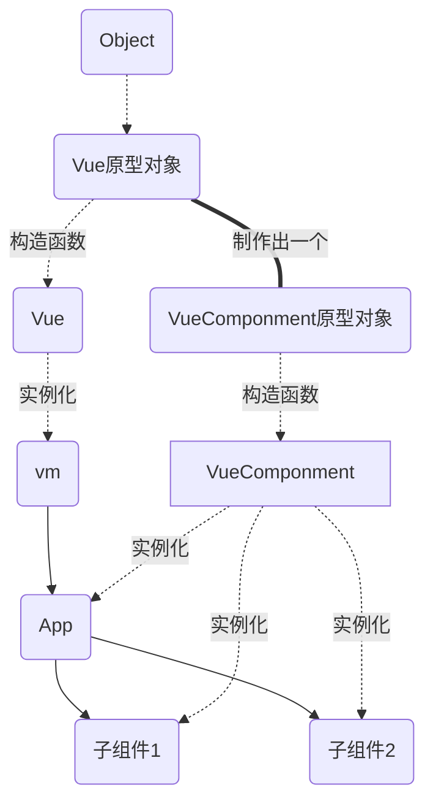
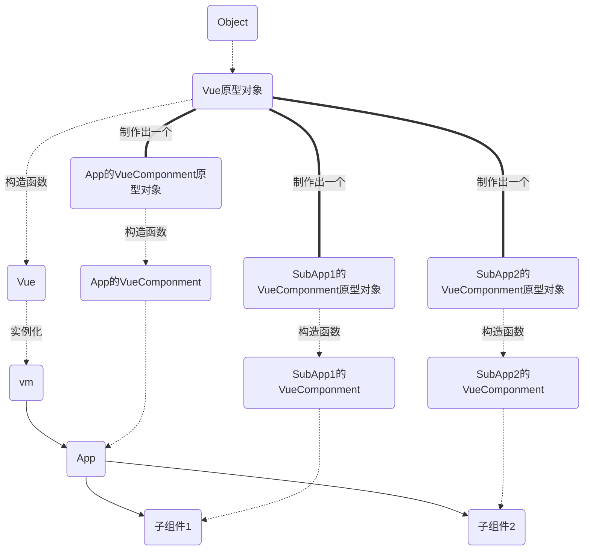

Vue包括

- Vue: 基础用户界面
- Vue-cli: 脚手架, 用于工程化开发
- vue-router: 前端路由
- vuex: 数据保管服务

## Vue2核心

Vue是一套用于构建用户界面(数据->页面)的渐进式(自底向上)JavaScript框架

- 采用**组件化**的模式构建: 每一个组件都是一个`.vue`文件, 文件包含了组件需要的JS/CSS/HTML
- **声明式**编码: 在写代码的时候不需要实现考虑DOM的实现, 也无需直接操作DOM元素(像我们之前使用的NodeJS的拼串实际上就是命令式编码)
- 采用**虚拟DOM**+**Diff算法**, 尽量复用DOM节点(在内容发生变化的时候优先在虚拟DOM中修改, 之后使用Diff算法比较变化后有哪些元素发生变化, 只对变化的元素进行更新)

引入Vue开发版: `<script src="https://cdn.jsdelivr.net/npm/vue@2.6.14/dist/vue.js"></script>`

引入后, `global`就增加了`Vue`对象

Vue2的全局配置可以在`Vue.config`中修改, 

### HelloWorld

一个简单的实例调用Vue
```html
<!DOCTYPE html>
<html>
<head>
    <script src="https://cdn.jsdelivr.net/npm/vue@2.6.14/dist/vue.js"></script>
</head>
<body>
    <div id="root">
        <h1>hello, {{name}}</h1>    <!--4. 插值语法将数据写入h1-->
    </div>
</body>
<script>
    new Vue({           // 1. 创建一个Vue实例, 参数是配置对象
        el: '#root',    // 2. 选中MVVM到的元素, 参数可以是CSS选择器, 也可以是JS的元素对象(getElement...)
        data: {         // 3. 需要绑定的数据, 可以是一个对象
            name: "Liu"
        }
    });    
</script>
</html>
```

尝试修改

```html
<div id="root">
    <h1>hello, {{name}}</h1>   
    <h1>hello, {{name}}</h1>   
</div>

<script>
    new Vue({           
        el: 'h1',       // 有两个元素存在, 相当于我同时选了两个元素
        data: {         
            name: "Liu"
        }
    }); 
</script>
```

发现, 只有第一个元素被选中了, 一个Vue实例只能对应**第一个选中的**元素, 如果真的想实现可以尝试

```html
<div id="root">
    <h1 class = 'R1'>hello, {{name}}</h1>
    <h1 class = 'R2'>hello, {{name}}</h1> 
</div>

<script>
    new Vue({           
        el: '.R1',       
        data: {         
            name: "Liu"
        }
    });  
    new Vue({           
        el: '.R2',       
        data: {         
            name: "Liu"
        }
    });    
</script>
```

再去关注插值语法中 `{{  }}` 可以写入些什么? 可以写入的是JS表达式, 例如  


- MVVM的变量(会被转译为app.data.变量): `name`, `name.toUpperCase()`  
- 算数表达式: `1+1`  
- JS的表达式: `Date.now()`

我们还需要对元素的属性进行MVVM, 例如a标签的地址, 按照之前的思路我们应该写`href={{url}}`, 这是不被接受的, 我们需要**指令语法指定标签属性**来被Vue绑定, 指定方法是将`href={{url}}`改写为: `v-bind:href="url"`或者`:href="url"`, 此处的`href`可以是任意属性, 之后Vue会将**引号**内的内容做替换, 例如
```html
<body>
    <div id="root">
        <h1>插值语法: hello, {{name.toUpperCase()}}</h1>
        <h1>指令语法: </h1>
        <a v-bind:href='url'>click</a>
    </div>
</body>
<script>
    new Vue({           
        el: '#root',       
        data: {         
            name: "Liu",
            url: "https://liukairui.cc"
        }
    });  
</script>
```

- 插值语法: 用于标签体, 使用`{{  }}`  
- 指令语法: 用于标签属性/标签体/标签事件, 使用`v-XX: = ""`

### 数据绑定

数据绑定有单向数据绑定与双向数据绑定, 区别是

- 单向数据绑定使用`v-bind:`进行绑定, 只会在JS文件中对应值发生变化的时候修改DOM, 在DOM中值发生变化时并不会修改JS中变量
- 双向数据绑定使用`v-model:`进行绑定, JS文件中对应值发生变化的时候修改DOM, 在DOM中值发生变化会反向修改JS中变量

```html
<body>
    <div id="root">
        Name1: <input type="text" :value="name">
        Name2: <input type="text" v-model:value="name">
    </div>
</body>
<script>
    new Vue({           
        el: '#root',       
        data: {         
            name: "Liu",
        }
    });  
</script>
```
可以尝试修改Name1中的值, Name2不变, 修改Name2中的值, Name1发生变化

但是, 并不是所有的属性都可以使用`v-model:`绑定, `v-model:`只能绑定到表单类元素, 注意的是`v-model:value`可以简写成`v-model`(这是默认值)

**el与data的多种写法**

- 可以使用`.$mount()`指定挂在对象, 从而取代el  
  ```diff
  const app = new Vue({           
  -   el: '#root',       
      data: {         
          name: "Liu",
      }
  });  
  + app.$mount('#root')
  ```
  使用这种方法的有点是绑定更加灵活, 例如
  ```diff
  const app = new Vue({           
  -   el: '#root',       
      data: {         
          name: "Liu",
      }
  });  
  - app.$mount('#root')
  + setTimeout(()=>{app.$mount('#root')},1000);
  ```
- 可以使用函数代替对象作为data(但是要求函数返回一个对象)
  ```diff
  const app = new Vue({           
      el: '#root',    
  -   data: {         
  -       name: "Liu",
  -   },   
  +   data() {
  +     return{
  +         name: 'Liu'
  +     }
  +   },
  });  
  ```
  p.s. 这个函数是Vue在执行的时候帮你调用的, 这里要求函数不能写箭头函数, 否则函数内部的this就变成global了, 而不是Vue(在后期后果有点严重)

### MVVM模型

MVVM的意思是: 模型(JS)-视图(DOM)-视图模型

- 模型中的数据通过视图模型的Bind绑定到视图上
- 模型视图使用listeners监听视图的变化, 修改模型中的数据

可以将他们对应起来

```html
<body>
    <div id="root">                                         <!-- V: 视图 -->
        Name1: <input type="text" :value="name">
        Name2: <input type="text" v-model:value="name">
    </div>
</body>
<script>
    const vm = new Vue({                                    // VM: 视图模型
        el: '#root',            
        data: {                                             // M: 模型
            name: "Liu",
        }
    });  
</script>
```

可以在浏览器中Console中查看`vm`, 打印后可以看到是一个Vue对象, 里面有一个name属性正好是我们设置的name, 我们可以尝试调用一些非我们定义的属性, 例如`:value="$el"`我们发现页面确实显示了`vm`的`$el`变量, 由此可见`vm`确实是一个视图模型, 视图通过调用视图模型变量实现数据绑定

### 数据代理

数据代理调用了方法是`Object.defineProperty()`, 使用方法是: `Object.defineProperty(对象,键,{值的配置})`, 例如

```js
let person = {
  name: 'AAA',
  isMale: true,
};

Object.defineProperty(person, 'age', {
  value: 18,
  // enumerable:true, //控制属性是否可以枚举，默认值是false
  // writable:true, //控制属性是否可以被修改，默认值是false
  // configurable:true //控制属性是否可以被删除，默认值是false

  //当有人读取person的age属性时，get函数(getter)就会被调用，且返回值就是age的值
  get(){
      console.log('有人读取age属性了')
      return number
  },
  
  //当有人修改person的age属性时，set函数(setter)就会被调用，且会收到修改的具体值
  set(value){
      console.log('有人修改了age属性，且值是',value)
      number = value
  }
});
```

`Object.defineProperty()`与直接为对象加入元素的区别是, 该方法获得的对象默认不可枚举, 不可修改, 不可删除

数据代理就是通过一个对象, 代理对另一个对象属性的操作(读/写)

简单的数据代理, `obj2`代理`obj1`
```js
let obj = {x:100}
let obj2 = {y:200}

Object.defineProperty(obj2,'x',{
    get(){
        return obj.x
    },
    set(value){
        obj.x = value
    }
})
```

在Vue中, 视图模型VM就实现了对模型M的代理, 在定义Vue实例的时候, data中的数据会被链接到`app._data`中(还要加入一些MVVM用的函数), 而data中的键`key`又会被app.key代理

- 视图V获取数据(app.key)的时候, VM中的get就会获取M中的数据(app._data.key)
- 视图V设置数据的时候, VM中的set就会修改M中的数据

### 事件处理

使用`v-on:XX`绑定事件, 例如`v-on:click = 'showAlert'`, 这样, 在点击之后, Vue会寻找methods中的showAlert函数处理事件

```html
<body>
    <div id="root">
        <h1>Hi, {{name}} for here</h1>
        <button v-on:click = 'showAlert'>ClickMe</button>
    </div>
</body>
<script>
    const app = new Vue({           
        el: '#root',    
        data() {
            return{
                name: 'Liu',
            }
        },
        methods: {
            showAlert(){
                alert('你好')
            }
        },
    });  
</script>
```
这里`v-on:click`可以简写为`@click`

这里的回调函数的调用方式有

- 在调用方式为`@click = 'showAlert'`时, 函数可以接受一个参数`event`
- 在调用方式为`@click = 'showAlert(15)'`时, 函数只接受一个变量15, event消失了
- 在调用方式为`@click = 'showAlert(15, $event)'`时, 函数接受15与`event`两个参数, 此时相当于使用关键字手动调用了event

习惯这种`'foo(1,2)'`调用函数的方式

```html
<body>
    <div id="root">
        <h1>Hi, {{name}} for here</h1>
        <button @click = 'showAlert'>ClickMe</button>
        <button @click = 'showLog($event, 50)'>ClickMe2</button>
    </div>
</body>
<script>
    const app = new Vue({           
        el: '#root',    
        data() {
            return{
                name: 'Liu',
            }
        },methods: {
            showAlert(){
                alert('你好')
            },
            showLog(e, v){
                console.log('你好', e, v)
            }
        },
    });  
</script>
```
点击ClickMe2后输出: `你好, 鼠标事件, 50`

同时应该知道, 这些函数与data一样在vm上, 但是没有做数据代理(谁会修改回调函数呢?)

既然这么说了, 理论上我们可以把methods的东西放在data里面(反正最终都是绑定到vm上), 但是这会增大Vue的负担, 额外的将这些方法进行了数据代理

### 事件修饰符

部分标签存在默认行为, 朴素的`v-on:`不会进行阻止, 例如
```html
<a href = 'baidu.com' @click = 'showLog'>ClickMe2</a>
```
就会先执行showLog, 然后跳转网页, 我们可以手动阻止, 也可以将`v-on:click`(`@click`)改为`v-on:click.prevent`(`@click.prevent`)阻止

这里的`.prevent`就是事件修饰符, Vue中的修饰符有

1. `prevent`：阻止默认事件 (常用) ；
2. `stop`：阻止事件冒泡 (常用) ；
3. `once`：事件只触发一次 (常用) ；
4. `capture`：使用事件的捕获模式；
5. `self`：只有event.target是当前操作的元素时才触发事件；
6. `passive`：事件的默认行为立即执行，无需等待事件回调执行完毕；

修饰符支持连写`@click.stop.once = 'foo'`

### 键盘事件

**按键事件的别名**

我们希望实现一个input中按下回车在Console输出input内容, 可以这么写   

```html
<body>
    <div id="root">
        <input type="text" placeholder="按下回车" @keyup = 'showInfo'>
    </div>
</body>
<script>
    const app = new Vue({           
        el: '#root',    
        data() {
            return{
                name: 'Liu',
            }
        },methods: {
            showInfo(e){
                if(e.keyCode ==13)
                    console.log(e.target.value);
            }
        },
    });  
</script>
```
我们需要手动判断按下的是不是回车, 实际上Vue提供了很多键盘事件别名实现当特定情况发生再触发事件, 可以将上述代码修改为
```diff
<body>
    <div id="root">
-       <input type="text" placeholder="按下回车" @keyup = 'showInfo'>
+       <input type="text" placeholder="按下回车" @keyup.enter = 'showInfo'>
    </div>
</body>
<script>
    const app = new Vue({           
        el: '#root',    
        data() {
            return{
                name: 'Liu',
            }
        },methods: {
            showInfo(e){
-               if(e.keyCode ==13)
                console.log(e.target.value);
            }
        },
    });  
</script>
```
`@keyup.enter`表示只有enter键才能触发, 类似的别名还有

- 回车 => enter
- 删除 => delete (捕获“删除”和“退格”键)
- 退出 => esc
- 空格 => space
- 换行 => tab (特殊，必须配合keydown去使用)
- 上 => up
- 下 => down
- 左 => left
- 右 => right

那么, 他们为什么叫做事件别名呢? 这是因为Vue将JS原生代码中的Enter等键名起了一个别名小写化为了enter, 可以使用`@keyup.Enter`等验证原名也是可用的

据此, 我们可以借助Vue设置一些没有别名的键的事件`@ketup.key`, 例如`@keyup.s = showInfo`实现按下s键时调用`showInfo(e)`(`@keyup.ASCII代码 = showInfo`也可以触发, 但是强烈不推荐)

注意: 这里的`key`应该与JS中的Key大小写相同(例如Alt不能写成alt), 如果想要查看某一个键的key可以让js打印`e.key`, 同时如果某一个键的Key是多个大写单词拼成的(例如CapsLock), 应该全部转换为小写并在单词连接处加`-`(例如CapsLock -> caps-lock, 这种命名法叫做kebab-case)

在自定义事件修饰的时候, 系统级修饰键(ctrl、alt、shift、meta)存在特殊规则

- 配合keyup使用：按下修饰键的同时，再按下其他键，随后释放其他键，事件才被触发. (同时不会阻止默认行为)
- 配合keydown使用：正常触发事件. 

我们也可以自定义别名
```js
Vue.config.keyCodes.myhui = 13;      // 回车的ASCII(别名也是kebab-case)
// @keyup.myhui
```

修饰符支持连写`@keyup.ctrl.y = 'foo'`(不能与浏览器默认快捷键冲突, 无法阻止默认行为)

### 计算属性

尝试实现一个组件, 在输入框输入姓名, 显示`So, Hi 姓-名`, 可以使用最原始的插值语法

```html
<body>
    <div id="root">
        姓:<input type="text" v-model:value="v_x">
        名:<input type="text" v-model:value="v_m">
        <p>so, Hi {{v_x}} {{v_m}}</p>
    </div>  
</body>
<script>
    const app = new Vue({           
        el: '#root',    
        data() {
            return{
                v_m: 'Kr',
                v_x: 'L',
            }
        },
    });  
</script>
```
更先进的
```html
<body>
    <div id="root">
        姓:<input type="text" v-model:value = 'v_x'>
        名:<input type="text" v-model:vaule = 'v_m'>
        <p>so, Hi {{getFullName()}}</p>
    </div>  
</body>
<script>
    const app = new Vue({           
        el: '#root',    
        data() {
            return{
                v_m: 'Kr',
                v_x: 'L',
            }
        },methods: {
            getFullName(){
                return this.v_x+'-'+this.v_m.toUpperCase();
            }
        },
    });  
</script>
```
使用指令语法
```html
<body>
    <div id="root">
        姓:<input type="text" @keyup.enter = 'chgLst'>
        名:<input type="text" @keyup.enter = 'chgFst'>
        <p>so, Hi {{v_x}} {{v_m}}</p>
    </div>  
</body>
<script>
    const app = new Vue({           
        el: '#root',    
        data() {
            return{
                v_m: 'Kr',
                v_x: 'L',
            }
        },methods: {
            chgLst(e){
                this.v_x = e.target.value;
            }, chgFst(e){
                this.v_m = e.target.value;
            }
        },
    });  
</script>
```
还可以使用计算属性实现, 所谓计算属性就是通过已有的属性计算出我们需要的属性, 在Vue中属性存放在data中, 计算属性被单独的写在`computed`里面, 如何让Vue在获取数据的同时刷新数据值, 我们想到了`Object.defineProperty()`中的`get`属性, 他可以在读取数据的时候执行特定函数, 并得到结果, 实际上Vue就是这么实现的, 并且将结果绑定到`vm`上.

```js
<body>
    <div id="root">
        姓:<input type="text" v-model:value = 'v_x'>
        名:<input type="text" v-model:vaule = 'v_m'>
        <p>so, Hi {{fullName}}</p>
    </div>  
</body>
<script>
    const app = new Vue({           
        el: '#root',    
        data() {
            return{
                v_m: 'Kr',
                v_x: 'L',
            }
        },computed: {
            fullName: {
                get(){
                    return this.v_x+'-'+this.v_m.toUpperCase();
                }
            }
        }
    });  
</script>
```

在浏览器中, 我们可以看到`app.fullName: (...)`, 浏览器不会显示数值, 因为我们没有调用`get()`, 点击`(...)`之后, 浏览器才会通过`get()`获取值, 这也证明了computed中值被绑定到了`vm`中

计算属性采用了缓存机制与插值语法相比性能更优, 当数据没有变化的时候不会反复`get()`

计算属性还支持Set, 例如我需要有一个按钮, 按下之后就将名字修改成`布-吉岛`, 可以设置如下

```html
<script>
    const app = new Vue({           
        el: '#root',    
        data() {
            return{
                v_m: 'Kr',
                v_x: 'L',
            }
        },computed: {
            fullName: {
                get(){
                    return this.v_x+'-'+this.v_m.toUpperCase();
                },
                set(v){
                    [this.v_x, this.v_m] = v.split('-') 
                }
            }
        },methods: {
            initFull(){
                this.fullName = '布-吉岛'
            }
        },
    });  
</script>
```

当确定你的计算属性只get不set的时候, 可以做简写
```js
computed: {
    fullName(){
        return this.v_x+'-'+this.v_m.toUpperCase();
    },
}
```
最终变成了methods的样子\`~\`

### 监视属性

当某一个属性发生变化的时候, 执行相关动作, 与计算属性不同的是: 

- 计算属性是构造一个虚拟的变量, 用于Vue的调用, 如果检测到构造这个变量的变量被修改了, 就在下次get的时候修改
- 监视属性是监视属性, 变更的时候立刻执行回调函数

我们可以尝试写一个组件, 点击按钮反转天气文字, 使用计算属性可以这样写
```html
<body>
    <div id="root">
        <h1>今天天气很{{weather}}</h1>
        <button @click = 'togWeather'>togWeather</button>
    </div>  
</body>
<script>
    const app = new Vue({           
        el: '#root',    
        data() {
            return{
                v: false
            }
        },computed: {
            weather(){
                return this.v?'炎热':'凉爽'
            },
        }, methods: {
            togWeather(){
                this.v=!this.v;
            }
        },
    });  
</script>
```
使用监视属性
```html
<body>
    <div id="root">
        <h1>今天天气很{{weather}}</h1>
        <button @click = 'togWeather'>togWeather</button>
        <p>{{numbers}}{{numbers.a}}</p>
    </div>  
</body>
<script>
    const app = new Vue({           
        el: '#root',    
        data() {
            return{
                v: false,
                weather: '布吉岛',
                numbers: {
                    a:1,
                    b:2,
                    c:3
                }
            }
        }, methods: {
            togWeather(){
                this.v=!this.v;
            }
        }, watch:{
            v: {
                handler(newValue, oldValue){
                    this.weather = newValue?'凉爽':'炎热'
                },
                // immediate: true,        // 初始化的时候立即调用函数
            },
            'numbers.a':{                   // 监视对象属性的变化
                handler(n,o){
                    console.log(n,o);
                }
            },
            numbers:{
                deep: true,                 // 开启深度监视, 如果不开启, 只会监视这个对象的地址有没有发生改变
                handler(n,o){
                    console.log(n,o);
                }
            }
        }
    });  
</script>
```
监视属性写在单独的watch中

其中`handler()`就是数据变化后的回调函数, 传入新值和老值

如果想要监控在初始化是时候执行一次就加上`immediate`, 如果想要检测对象内部值的变化要使用deep, 否则只监视对象地址变化

如果监视属性只有handler可以简写成

```js
watch:{
    v(newValue, oldValue){
        this.weather = newValue?'凉爽':'炎热'
    },
}
```

可以在vm声明结束后声明变量监控

```js
vm.$watch('监视变量',{}/function(newV, oldV){})
```

### 计算属性与属性监控的区别

- computed和watch之间的区别：  
    1.computed能完成的功能，watch都可以完成.   
    2.watch能完成的功能，computed不一定能完成，例如：watch可以进行异步操作. 

闲来无事写了一个计算属性的异步调用
```html
<!DOCTYPE html>
<html>
<head>
    <script src="https://cdn.jsdelivr.net/npm/vue@2.6.14/dist/vue.js"></script>
</head>
<body>
    <div id="root">
        <h1>今天气温{{weather.is_hot}}度</h1>
        <h1>顺便看看这个计时器ID: {{weather.counter}}</h1>
        <button @click = 'togWeather'>点击让5s后温度下降一度</button>
    </div>  
</body>
<script>
    const app = new Vue({           
        el: '#root',    
        data() {
            return{
                // v.val代表温度, 这样每次对象地址变换但是val不变Vue依旧会刷新
                // Vue太精明了, this.v = this.v + 1 - 1 + Math.random()*0 不会触发计算属性刷新
                v: new Object({val: 50}),           
                // 降低一度?
                chgMe: false
            }
        }, methods: {
            togWeather(){
                this.chgMe=!this.chgMe;
                // 修改v触发计算属性
                this.v = new Object({val: this.v.val});
            }
        }, computed: {
            weather(){
                // 通过返回new Object刷新地址 防止缓存
                return new Object({
                    is_hot: this.v.val,
                    counter: setTimeout(() => {
                        console.log("IN-timeOut");
                        if(this.chgMe){
                            this.chgMe = false;
                            // !用这个方法返回新的v, 但是会触发新的定时器...
                            // this.v = new Object({val: this.v.val - 1});
                            // !返回新的v.val, 地址不变, 但是为什么还是触发新的定时器?
                            this.v.val -= 1;
                            console.log("IN-chg")
                        }
                    }, 5000)
                })
            }
        }
    });  
</script>
</html>
```

### Class与Style的绑定

- 字符串绑定class(**样式名字不确定个数确定**)  
  可以动态指定class, 由于class有多个, 不变的可以正常写, 变化的使用数据绑定
  ```html
  <div class="basic" :class = 'classB' @click = 'changeMod'>{{name}}</div>
  ```
  这样我们就只需要维护一个变量`classB`就实现了Class的调整, 用于动态决定class值
- 数组绑定class(**样式名字不确定个数不确定**)  
  ```html
    <div class="basic" :class = 'classArray' @click = 'changeMod'>{{name}}</div>
  ```
  也可以绑定成数组
- 对象绑定class(**样式名字确定个数确定动态决定要不要**)
  ```html
    <div class="basic" :class = 'classObj' @click = 'changeMod'>{{name}}</div>
    <!-- ... -->
    classObj: {
        atguigu1: false,
        atguigu2: true,
    }
  ```
  对象的TF对应加不加class

对于内联样式

```html
<!-- 绑定style样式--对象写法 -->
<div class="basic" :style="styleObj">{{name}}</div> <br/><br/>
<!-- 绑定style样式--数组写法 -->
<div class="basic" :style="styleArr">{{name}}</div>
<!-- ... -->
styleObj2:{
    backgroundColor:'orange'
},
styleArr:[
    {
        fontSize: '40px',           // 注意这里要转驼峰命名, 注意单位
        color:'blue',
    },
    {
        backgroundColor:'gray'
    }
]
```

### 条件渲染

符合某些条件再渲染某些元素

- `v-show`渲染  
  使用`v-show`属性实现, 值是一个布尔表达式, 例如
  ```html
  <body>
      <div id="root">
          <h2 v-show = "show">{{welcomText}}</h2>
          <button @click='togShow'>切换</button>
      </div>  
  </body>
  <script>
      const app = new Vue({           
          el: '#root',    
          data() {
              return{
                  welcomText: '欢迎来到',
                  show: true
              }
          }, methods: {
              togShow(){
                  this.show = !this.show;
              }
          }, computed: {
          }
      });  
  </script>
  ```
  不显示之后可以看到h2的`display = none`
- `v-if`渲染  
  也可以实现`v-show`功能, 但是比较狠, 一旦为false直接删除元素
  ```html
  <!DOCTYPE html>
  <html>
  <head>
      <script src="https://cdn.jsdelivr.net/npm/vue@2.6.14/dist/vue.js"></script>
  </head>
  <body>
      <div id="root">
          <h2 v-if = "show">{{welcomText}}</h2>
          <button @click='togShow'>切换</button>
      </div>  
  </body>
  <script>
      const app = new Vue({           
          el: '#root',    
          data() {
              return{
                  welcomText: '欢迎来到',
                  show: true
              }
          }, methods: {
              togShow(){
                  this.show = !this.show;
              }
          }, computed: {
          }
      });  
  </script>
  </html>
  ```
  所以, 如果DOM变化频率高建议用show, 频率低用if, 否则频繁的插入删除节点不易于维护  
  `v-if`还支持`v-else-if`,`v-else`, 在连续的if/else-if/else之间不能出现多余的元素
  ```html
  <body>
      <div id="root">
          <h2 v-if = "show === 1">1</h2>
          <h2 v-else-if = "show === 2">2</h2>
          <h2 v-else-if = "show === 3">3</h2>
          <h2 v-else = "show === 4">4</h2>
          <button @click='togShow'>切换</button>
      </div>  
  </body>
  <script>
      const app = new Vue({           
          el: '#root',    
          data() {
              return{
                  welcomText: '欢迎来到',
                  show: 1
              }
          }, methods: {
              togShow(){
                  this.show = (this.show)%4 + 1;
              }
          }, computed: {
          }
      });  
  </script>
  ```
  当有一些紧挨的元素想要批量显示, 可以写
  ```html
  <h2 v-if = "show === 1">A</h2>
  <h2 v-if = "show === 1">A</h2>
  <h2 v-if = "show === 1">A</h2>
  <h2 v-if = "show === 2">B</h2>
  <h2 v-if = "show === 2">B</h2>
  <h2 v-if = "show === 2">B</h2>
  ```
  比较麻烦, 可以改成
  ```html
  <div v-if = "show === 1">
      <h2>A</h2>
      <h2>A</h2>
      <h2>A</h2>
  </div>
  <div v-if = "show === 2">
      <h2>B</h2>
      <h2>B</h2>
      <h2>B</h2>
  </div>
  ```
  但是修改了DOM结构, 会跟着变很多CSS/JS, 解决方法是直接吧if绑定在template标签上, 这种标签在最终渲染的时候会被隐藏, 例如
  ```html
  <template v-if = "show === 1">
      <h2>A</h2>
      <h2>A</h2>
      <h2>A</h2>
  </template>
  <template v-if = "show === 2">
      <h2>B</h2>
      <h2>B</h2>
      <h2>B</h2>
  </template>
  ```
  最终会渲染为
  ```html
  <h2>A</h2>
  <h2>A</h2>
  <h2>A</h2>
  ```

### 列表渲染

类似for循环生成多个标签, 使用了与JS的for类似写法
```html
<body>
    <div id="root">
        <div v-for="(item, index) in items" :key="item.id">{{item.id}}-{{item.val}}</div>
    </div>  
</body>

<script>
    const app = new Vue({           
        el: '#root',    
        data() {
            return{
                items: [
                    {id: 1, val: "Liu"},
                    {id: 2, val: "Kai"},
                    {id: 3, val: "Rui"}
                ]
            }
        }
    });    
</script> 
```
其中被遍历的对象可以是任意可迭代对象例如

- 数组: `(值,下标) in arr`
- 对象: `(值,键名) in obj`
- 字符串: `(字符,下标) in str`
- 类似py的range写法: `(数字,index) in 数字`
  ```
  (v,index) in 5
  (1,0)
  (2,1)
  (3,2)
  (4,3)
  (5,4)
  ```

内部的元素要指明是`对象.属性`

**注意这个Key**

这里的Key相当于是**当前这条迭代对象的唯一标识符**, 尽量使用后端提供的ID, 如果不写:key默认会指定为`:key=index` **这是一种非常危险的做法**

首先要明白**Vue为什么要在循环中加入这个Key?**, 如果仅仅是为了表示循环, key完全可以默认表示index, 而不需要用户指定. 这个Key是用于Vue的diff算法中的, 当数据发生变化后, diff算法会对比虚拟DOM发生了什么变化, 这个时候识别for中哪条元素变化就是通过Key识别的

当我们使用index做Key时, 上面例子渲染的是
```html
<div :key=0>{{1}}-{{"Liu"}}</div>
<div :key=1>{{2}}-{{"Kai"}}</div>
<div :key=2>{{3}}-{{"Rui"}}</div>
<!-- 
    使用的数据是
    {id: 1, val: "Liu"},
    {id: 2, val: "Kai"},
    {id: 3, val: "Rui"}
 -->
```
当我们在后面加入一条新数据后, 
```html
<div :key=0>{{1}}-{{"Liu"}}</div>
<div :key=1>{{2}}-{{"Kai"}}</div>
<div :key=2>{{3}}-{{"Rui"}}</div>
<div :key=3>{{4}}-{{"CC"}}</div>
<!-- 
    使用的数据是
    {id: 1, val: "Liu"},
    {id: 2, val: "Kai"},
    {id: 3, val: "Rui"},
    {id: 4, val: "CC"}
 -->
```
Vue的Diff算法会对比前后虚拟DOM的不同
```diff
<div :key=0>{{1}}-{{"Liu"}}</div>
<div :key=1>{{2}}-{{"Kai"}}</div>
<div :key=2>{{3}}-{{"Rui"}}</div>
+ <div :key=4>{{4}}-{{"CC"}}</div>
```
`Key=1,2,3`没有变化, 于是在浏览器DOM中加入一条数据

看起来使用index也没有什么问题, 但是如果我们的数据是
```
{id: 4, val: "CC"},
{id: 1, val: "Liu"},
{id: 2, val: "Kai"},
{id: 3, val: "Rui"}
```
呢?

**使用id渲染结果是**
```html
<div :key=4>{{4}}-{{"CC"}}</div>
<div :key=1>{{1}}-{{"Liu"}}</div>
<div :key=2>{{2}}-{{"Kai"}}</div>
<div :key=3>{{3}}-{{"Rui"}}</div>
```
Vue对比之前代码发现, 
```diff
+ <div :key=4>{{4}}-{{"CC"}}</div>
<div :key=1>{{1}}-{{"Liu"}}</div>
<div :key=2>{{2}}-{{"Kai"}}</div>
<div :key=3>{{3}}-{{"Rui"}}</div>
```
于是在浏览器DOM中增加一个标签

**使用index渲染结果是**
```html
<div :key=0>{{4}}-{{"CC"}}</div>
<div :key=1>{{1}}-{{"Liu"}}</div>
<div :key=2>{{2}}-{{"Kai"}}</div>
<div :key=3>{{3}}-{{"Rui"}}</div>
```
Vue对比之前代码发现, 
```diff
- <div :key=0>{{1}}-{{"Liu"}}</div>
+ <div :key=0>{{4}}-{{"CC"}}</div>
- <div :key=1>{{2}}-{{"Kai"}}</div>
+ <div :key=1>{{1}}-{{"Liu"}}</div>
- <div :key=2>{{3}}-{{"Rui"}}</div>
+ <div :key=2>{{2}}-{{"Kai"}}</div>
+ <div :key=3>{{3}}-{{"Rui"}}</div>
```
Vue可不认识你是在前面加入了元素, 他只认识Key, 这样Vue就需要重新在浏览器DOM中渲染所有的标签, **造成巨大的资源损失**

同时, 对于表单等输入类数据, 存在十分严重的问题, 如果在input中输入了数据, 在乱序修改数组后输入数据会保留在相对位置不变, 例如

```html
<div :key=1>{{1}}-{{"Liu"}}<input/></div>
<div :key=2>{{2}}-{{"Kai"}}<input/> <!--我在这里输入了AAA--> </div>
<div :key=3>{{3}}-{{"Rui"}}<input/></div>
```
用:key=index后

在前面加入数据
```diff
- <div :key=0>{{1}}-{{"Liu"}}<input></div>
+ <div :key=0>{{4}}-{{"CC"}}<input></div>
- <div :key=1>{{2}}-{{"Kai"}}<input></div>
+ <div :key=1>{{1}}-{{"Liu"}}<input><!--Vue认准了输入AAA的input在Key=1里面--></div>
- <div :key=2>{{3}}-{{"Rui"}}<input></div>
+ <div :key=2>{{2}}-{{"Kai"}}<input></div>
+ <div :key=3>{{3}}-{{"Rui"}}<input></div>
```
直接造成了输入框内容移位

- 用index作为key可能会引发的问题：  
  1. 若对数据进行：逆序添加、逆序删除等破坏顺序操作:  
	会产生没有必要的真实DOM更新 ==> 界面效果没问题, 但效率低.   
  2. 如果结构中还包含输入类的DOM：  
	会产生错误DOM更新 ==> 界面有问题.   
- 开发中如何选择key?:  
  1. 最好使用每条数据的唯一标识作为key, 比如id、手机号、身份证号、学号等唯一值.   
  2. 如果不存在对数据的逆序添加、逆序删除等破坏顺序操作，仅用于渲染列表用于展示，使用index作为key是没有问题的.   


### 通过列表渲染实现搜索功能, 搜索排序
```html
<body>
    <div id="root">
        <input type="text" v-model:value = 'searchTxt'>
        <button @click='searchBy = 0'>Norm</button>
        <button @click='searchBy = 1'>A->Z</button>
        <button @click='searchBy = -1'>Z->A</button>
        <div v-for="(item, index) in searchRes" :key="item.id">{{index+1}}-{{item.val}}</div>
    </div>  
</body>

<script>
    const app = new Vue({           
        el: '#root',    
        data() {
            return{
                items: [
                    {id: 1, val: "123"},
                    {id: 2, val: "234"},
                    {id: 3, val: "211"},
                ],
                searchBy: 0,
                searchTxt: ''
            }
        },
        computed:{
            searchRes(){
                const res = this.items.filter((d)=>{
                    return d.val.includes(this.searchTxt)
                });
                res.sort((n,o)=>{
                    return this.searchBy*(n.val-o.val);
                })
                return res;
            }
        }
    });    
</script>  
```

### Vue数据代理与检测的原理

Vue的数据代理之前说是使用`Object.defineProperty`实现的, 但是他具体是怎么实现的呢, 想当然的, 我们这样实现

```js
const data = {
  demo: 10,
};

Object.defineProperty(data, 'demo', {
  get() {
    console.log("YOU GET");
    return this.demo;
  },
  set(v) {
    console.log("YOU SET and SYNC to DOM");
    this.demo = v;
  },
});

console.log(data.demo);
data.demo = 11;
```

但是JS会报错
```js
RangeError: Maximum call stack size exceeded
    at Object.get [as demo] (/home/liukairui/CODE/code-snippet/Vue/VueDemo/demo.js:7:17)
    at Object.get [as demo] (/home/liukairui/CODE/code-snippet/Vue/VueDemo/demo.js:7:17)
    at Object.get [as demo] (/home/liukairui/CODE/code-snippet/Vue/VueDemo/demo.js:7:17)
```

显示与之前学的不同, 以前我们使用`Object.defineProperty`是维护一个变量, 然后get的时候通过其他变量获得值得, 但是这次是获取他自己, 这样JS又会调用`get`返回自己, 造成无限递归, 爆栈

那Vue是如何避免无限递归的呢, 使用一个中间层, 在get的时候获取原始数据, 在Set的时候修改原始数据并更新DOM, 我们实现一个简单的例子

```js
const data = {
  demo1: 10,
  demo2: 10,
  demo3: 10,
  demo4: 10,
};

function Observer(obj) {
  let keys = Object.keys(obj); // 获取被监视对象的全部Key
  keys.forEach((d)=>{
    Object.defineProperty(this, d, {
      get() {
        return obj[d];
      },
      set(v) {
        obj[d] = v;
        console.log("我开始刷新DOM了")
      },
    });
  });
}

let _data = new Observer(data);

console.log(_data.demo1);
_data.demo1 = 15;
console.log(_data.demo1);

console.dir(_data);
console.dir(data);
```
结果是
```
10
我开始刷新DOM了
15
Observer {}
{ demo1: 15, demo2: 10, demo3: 10, demo4: 10 }
```

可以看到开发者工具中`vm`有_data, 这里的`_data`相当于我们的`Observer`, 可以看到`_data`中有每一个属性的`get`, 但是他不是`Object.defineProperty`是Vue自定义的
```js
get items: ƒ reactiveGetter()
set items: ƒ reactiveSetter(newVal)
```
响应式的get和set, 还记得代码中data的属性`p`会同时绑定到`vm.p`与`vm._data.p`, 这两个p是完全等价的, 当我们修改任何一个属性的时候会调用这个响应式的get/set

同时Vue的响应式get/set可以对对象进行"穿透", 不论对象有多少层, 或者数组有多少个元素, Vue都可以递归将对象内部的对象设置get/set, 直到内部是一个非对象

例如, 我们使用Vue定义
```js
const app = new Vue({           
    el: '#root',    
    data() {
        return{
            items: [
                {
                    id: 1, 
                    bas: {
                        name: "A",
                        age: 12,
                    }
                },
            ],
        }
    }
}); 
```
看到`app._data`
```js
items: Array(1)
    0:
        bas: Object                                         
            age: 12
            name: "A"
            __ob__: Observer {value: {…}, dep: Dep, vmCount: 0}
            get age: ƒ reactiveGetter()                             // item.has.age监视
            set age: ƒ reactiveSetter(newVal)
            get name: ƒ reactiveGetter()                            // item.has.name监视
            set name: ƒ reactiveSetter(newVal)
            [[Prototype]]: Object
        id: 1
        __ob__: Observer {value: {…}, dep: Dep, vmCount: 0}
        get bas: ƒ reactiveGetter()                                 // item.has监视
        set bas: ƒ reactiveSetter(newVal)
        get id: ƒ reactiveGetter()                                  // item.id监视
        set id: ƒ reactiveSetter(newVal)
        [[Prototype]]: Object
    length: 1
    __ob__: Observer {value: Array(1), dep: Dep, vmCount: 0}
    [[Prototype]]: Array
__ob__: Observer {value: {…}, dep: Dep, vmCount: 1}
get items: ƒ reactiveGetter()                               // 对于item的get
set items: ƒ reactiveSet(newVal)
```

在实际开发中会遇到这样的一个问题

```html
<body>
    <div id="root">
    <div v-for="item in items">{{item.name}}</div>
    <button @click='chg'>修改值</button>
    </div>  
</body>

<script>
    const app = new Vue({           
        el: '#root',    
        data() {
            return{
                items: [
                    {name: 1},
                    {name: 2},
                    {name: 3},
                    {name: 4},
                ],
            }
        }, methods: {
            chg(){
                // this.items[0].name = 'S';   // Ok
                this.items[0] = {name: 'S'};   // Err
            }
        },
    });  
</script>  
```
执行被注释的代码, 页面修改成功, 但是执行没有注释的代码, 那么页面就修改失败了, 这是因为对这个对象整体赋值的时候没有为他内部的元素加入`reactiveGetter()`

那么, 如果我们希望实现将
```js
data() {
    return{
        info: {name: 4},
    }
}
```
变为
```js
data() {
    return{
        info: {name: 4, birth: '2000'},
    }
}
```
应该怎么处理呢, 首先应该使用类似`Object.defineProperty`的方法加入get与set, 使属性可以被监视代理, 可以使用`Vue.set(对象, '属性', 值)`或者`vm.$set(对象, '属性', 值)`, 例如`vm.set(vm.info, 'bitrh', '2000')`

对于对象很好说, 对于数组, 我们将
```js
data() {
    return{
        info: [{name: 4}]
    }
}
```
变为
```js
data() {
    return{
        info: [{name: 4}, {birth: '2000'}],
    }
}
```
我们知道, 如果直接对JS的Array进行push那么birth所在对象应该是不会被监控, 但是在列表渲染小节中中我们发现这是可行的, 这是因为Vue对Array的push, pop...进行了重新封装, 不需要什么手动Set, 但是如果我们还是想要对数组中的元素进行直接替换, 我们需要使用`vm.$set(vm.arr,下标,newVal)`

**注意, $set的数据不能是Vue对象, 也不能在data上直接set数据, 建议set到data.obj上**

**数据劫持**: 将data中的属性转化为geter/geter形式, 每次修改获取数据都被上述函数劫持, 代为修改读取

### 表单数据

```html
<!DOCTYPE html>
<html>
<head>
    <script src="https://cdn.jsdelivr.net/npm/vue@2.6.14/dist/vue.js"></script>
</head>
<body>
    <div id="root">
    <form @submit.prevent="ajaxSubmit">
        <!-- 用trim去除两边空格 -->
        帐号<input v-model.trim='userInfo.account' type="text"><br><br>
        密码<input v-model='userInfo.passwd' type="password"><br><br>
        <!-- 这里加了两个number, 第一个是让Vue知道输入的是数字, 第二个是浏览器限制输入内容必须是数字 -->
        年龄<input v-model.number='userInfo.age' type="number"><br><br>
        性别<br><br>
        <!-- 要亲自配置value -->
        男<input type="radio" name="sex" v-model='userInfo.sex' value="男"><br><br>
        女<input type="radio" name="sex" v-model='userInfo.sex' value="女"><br><br>
        爱好<br><br>
        <!-- 要亲自配置value -->
        男<input type="checkbox" v-model="userInfo.hobby" value="男">
        女<input type="checkbox" v-model="userInfo.hobby" value="女">
        都<input type="checkbox" v-model="userInfo.hobby" value="都">
        位置<br><br>
        <select v-model="userInfo.pos">
            <option value="N">N</option>
            <option value="S">S</option>
            <option value="W">W</option>
            <option value="E">E</option>
        </select><br><br>
        多行<br><br>
        <!-- lazy标记使得内容只在失去焦点的时候才MVVM, 提高了性能 -->
        <textarea v-model.lazy='userInfo.multext'></textarea>
        同意<input type="checkbox" v-model="userInfo.subt">
        <!-- 同样是复选框 -->
        <button type="submit">提交</button>
    </form>
    </div>  
</body>

<script>
    const app = new Vue({           
        el: '#root',    
        data() {
            return{
                userInfo: {
                    account: '',
                    passwd: '',
                    age: '',
                    sex: '',
                    hobby: [],      // 同样是复选框
                    pos: 'S',
                    multext: '',
                    subt: ''        // 同样是复选框
                }
            }
        }, methods: {
            ajaxSubmit(){
                console.log(JSON.stringify(this._data.userInfo));     // 忽略get等函数, 直接转化为json
                return false;   // 阻止默认行为
            }
        },
    });  
</script>  

</html>
```
收集表单数据：  

- 若：`<input type="text"/>`，则v-model收集的是value值，用户输入的就是value值. 
- 若：`<input type="radio"/>`，则v-model收集的是value值，且要给标签配置value值. 
- 若：`<input type="checkbox"/>`
  1. 没有配置input的value属性，那么收集的就是checked (勾选 or 未勾选，是布尔值) 
  2. 配置input的value属性:
       - v-model的初始值是非数组，那么收集的就是checked (勾选 or 未勾选，是布尔值) 
       - v-model的初始值是数组，那么收集的的就是value组成的数组
- 备注：v-model的三个修饰符：
  - lazy：失去焦点再收集数据
  - number：输入字符串转为有效的数字
  - trim：输入首尾空格过滤

### 过滤器

- 定义：用于对要显示的数据进行特定格式化后再显示 (适用于一些简单逻辑的处理. 只能用于插值语法/v-bind
- 语法：
    1. 注册过滤器：`Vue.filter(name,callback)` 或 `new Vue{filters:{}}`, 或者在Vue声明的时候与data并列写
    2. 使用过滤器：`{{ xxx | 过滤器名}}`  或  `v-bind:属性 = "xxx | 过滤器名"`
- 备注：
    1. 如果在调用的时候不写参数会传递一个参数是管道的输入, 如果在调用的时候写n个参数, 过滤器会收到n+1个, 第一个是管道输入
    2. 过滤器也可以接收额外参数、多个过滤器也可以串联
    3. 并没有改变原本的数据, 是产生新的对应的数据

```html
<body>
    <div id="root">
        <div>{{nowtime}}</div>
        <div>{{Date.now() | timeFormter}}</div>
    </div>  
</body>

<script>
    const app = new Vue({           
        el: '#root',    
        computed: {
            nowtime(){
                return dayjs().format('YYYY-MM-DD HH:mm:ss')
            }
        },
        filters: {
            timeFormter(v){
                return dayjs(v).format('YYYY-MM-DD HH:mm:ss')
            }
        }
    });  
</script>  
```

**Vue3已经删除了...**

### 内置指令

之前使用的`v-if`, `v-for`等都属于Vue自己定义的内置指令, 其他内置指令还有

- `v-text = "str"`: 将标签内部text属性值替换为str值(相当于标签内部值是str), 对于str中的特殊符号会进行转意
- `v-html = "str"`: 将标签内部html属性值替换为str值(相当于标签内部值值是str), 对于str中的特殊内容不会转意
  ```js
  <body>
      <div id="root">
          <div>{{str1}}</div><br>
          <div v-text = "str1">看看这段文本会不会被舍弃</div><br>
          <div v-html = "str1">看看这段文本会不会被舍弃</div><br>
          <div>{{str2}}</div><br>
          <div v-text = "str2">看看这段文本会不会被舍弃</div><br>
          <div v-html = "str2">看看这段文本会不会被舍弃</div><br>
      </div>  
  </body>
  <script>
      const app = new Vue({           
          el: '#root',
          data(){
              return {
                  str1: "AAA",
                  str2: "<a href='https://liukairui.cc'>这是一个链接</a>"
              }
          }    
      });  
  </script>  
  ```
  输出结果是
  ```
  AAA
  AAA
  AAA
  <a href='https://liukairui.cc'>这是一个链接</a>
  <a href='https://liukairui.cc'>这是一个链接</a>
  这是一个链接
  ```
  可以看到`v-text`实际上与插值语法类似, 但是插值语法更加灵活, `v-html`可以将字符串直接转化为html标签或者js内容, 这是十分危险的, 不建议使用

- `v-cloak`: 这是一个flag, 一旦Vue发现这个Flag的存在, 就会立刻删除这个`v-cloak`(不是这个标签), 他在Vue没有完成加载的时候发挥作用, 防止未经渲染的元素直接暴露在用户面前, 例如:
  ```html
  <body>
      <div id="root">
          <div v-cloak>这是一段文字{{str1}}</div>
      </div>  
  </body>
  <script>
      const app = new Vue({           
          el: '#root',
          data(){
              return {
                  str1: "AAA",
              }
          }    
      });  
  </script>  
  ```
  在Vue被载入之前, 用户会在浏览器端看到`这是一段文字{{str1}}`, 我们希望用户不要看到这些没有渲染的内容, 可以加入一个CSS属性
  ```css
  [v-cloak]{
      display: none;
  }
  ```
  在Vue成功加载之后, Vue会自动删除`v-cloak`, 隐藏属性自动消失
- `v-once`: 是一个flag, 被打上这个属性后的元素只会在初始化的时候渲染一次, 之后变为静态元素, 不再渲染
  ```html
  <body>
      <div id="root">
          <div v-once>当前n: {{n}}</div>
          <div>当前n: {{n}}</div>
          <button @click="n++">n++</button>
      </div>  
  </body>
  <script>
      const app = new Vue({           
          el: '#root',
          data(){
              return {
                  n: 1
              }
          }
      });  
  </script>  
  ```
  点击按钮后第一行不变, 第二行自增
- `v-per`: 是一个flag, 将标签转换为静态标签, 永不应用Vue渲染

### 自定义指令

自己也可以定义一个`v-XX`的指令, 我们知道一个带有`v-XX`的指令的标签应该类似于
```html
<div v-XX="vals"></div>
```
那么对于一个Vue指令来说, 有用的有:

- 这个指令所在的标签的JS对象
- 指令中传入的值

对于自定义指令

- 所有的自定义指令写在与data同级的`directives: {}`中

自定义指令有三个阶段

- 指令与元素成功绑定时 (一上来) : `bind`
- 指令所在元素被插入页面时: `inserted`
- 指令所在的模板被重新解析时: `update`

自定义指令有两种定义模式

- 对于需要在三个不同阶段分别指定回调函数的
  ```js
  directives:{
      xx:{   
          bind(element,binding){
              // ...
          },
          inserted(element,binding){
              // ...
          },
          update(element,binding){
              // ...
          }
      }
  }
  ```
- 对于仅需要定义bind与update且两个函数相同的时候
  ```html
  directives:{
      xx(element,binding){
          // ...
      },
  }
  ```

其中

- 每个函数传入两个参数: 这个指令所在的标签的JS对象, 指令中传入的值
- 简写形式中的xx的命名是: `v-XX`的XX, 如果XX中有大写字母则需要转化为小写, XX中有`-`等特殊符号, 需要为key外面包上双引号

还可以将自定义指令声明到全局: Vue.directive(指令名,配置对象) 或   Vue.directive(指令名,回调函数)

**注意**: 在原生JS中, 在我们将一个元素插入DOM之前一些指令是无效的, 例如
```js
const input = document.createElement('input')
input.className = 'demo'
input.value = 99
input.onclick = ()=>{alert(1)}

// 如果只在此处调用两条指令, 指令无效, 因为没有绑定DOM没法给焦点, 无法获取父元素
input.focus()
input.parentElement.style.backgroundColor = 'skyblue'

document.body.appendChild(input)

// 如果只在此处调用两条指令, 指令有效
input.focus()
input.parentElement.style.backgroundColor = 'skyblue'
```
我们也应该注意, 如果在自定义指令中要使用`force`, `parentElement`函数, 应该使用复杂的定义形式, 在`inserted`与`update`中使用

### Vue的生命周期

Vue对象有自己的生命周期, 为了方便我们在特定的生命周期运行相关的函数, Vue向外暴露了四对八个特殊API用于用户在特定的生命周期执行回调函数(AKA: 生命周期回调函数、生命周期函数、生命周期钩子), 这些回调函数的this是Vue实例

例如, 我们希望一些代码可以在元素被挂载的时候执行, 我们可以使用`mounted`函数
```html
<body>
    <div id="root">
        初始化时间戳: <div v-once>{{nowtime}}</div>
        当前时间戳: <div>{{nowtime}}</div>
    </div>  
</body>
<script>
    const app = new Vue({           
        el: '#root',
        data(){
            return {
                nowtime: Date.now()
            }
        },
        mounted() {
            setInterval(()=>{this.nowtime = Date.now()},10)
        },
    });  
</script> 
```


- 常用的生命周期钩子：  
    1.mounted: 发送ajax请求、启动定时器、绑定自定义事件、订阅消息等【初始化操作】.   
    2.beforeDestroy: 清除定时器、解绑自定义事件、取消订阅消息等【收尾工作】. 
- 关于销毁Vue实例  
    1.销毁后借助Vue开发者工具看不到任何信息.   
    2.销毁后自定义事件会失效，但原生DOM事件依然有效.   
    3.一般不会在beforeDestroy操作数据，因为即便操作数据，也不会再触发更新流程了. 

## Vue2组件化编程

在传统的时候, 我们将一个页面分为多个部分, 每个部分一般分别对应一个CSS&JS文件. 

某一个部分可能在不同的时候复用, 所以一个CSS/JS可能被不同的页面引用, 网站中存在复杂的依赖关系, 为了解决JS复用时的复杂的依赖关系, 我们发明了模块化, 为了解决CSS复用时的复杂依赖关系, 我们将不同部分的CSS单独成文件, 但是我们无法解决HTML结构的复用

在Vue中引入了组件的概念, 页面中每一个部分都可以独立成一个组件, 一个组件中包含了实现自己功能的CSS/JS/HTML片段/资源文件

组件就是实现应用中实现局部功能代码和资源的集合

在Vue中有**单文件组件**与**非单文件组件**: 非单文件组件就是一个文件中有多个组件, 单文件组件就是一个文件中有一个组件

### 非单文件组件

我们有如下页面
```html
<body>
    <div id="root">
        <h2>学校名称: {{schName}}</h2>
        <h2>学校地址: {{schAdd}}</h2>
        <hr>
        <h2>学生名称: {{stuName}}</h2>
        <h2>学生地址: {{stuAdd}}</h2>
    </div>  
</body>
<script>
    const app = new Vue({           
        el: '#root',
        data(){
            return {
                schName: "xilan",
                schAdd: "BBei",
                stuName: "san",
                stuAdd: "BeiJ",
            }
        }
    });  
</script>  
```
我们想要将学生与学校抽离成两个组件

先创建组件
```js
const school = Vue.extend({     // 声明一个组件
    // el: '#root',             // 组件是为了复用, 不能一上来就指定挂载
    data(){                     
        // 组件中必须使用函数返回数据, 
        // 如果直接指定对象, 当组件挂载到多处, 一处修改, 由于指向内存一样, 处处变化
        return {
            schName: "xilan",
            schAdd: "BBei",
        }
    }
})
```
然后注册组件
```js
const school = Vue.extend({
    // 我是为app服务的, app又不知道里面应该怎么写html, school要存储把自己需要的html结构
    // 规则, template中只能有一个根元素, 所以要给两个h2套div, 最外层不能是<template></template>
    template: `
        <div>
            <h2>学生名称: {{stuName}}</h2>
            <h2>学生地址: {{stuAdd}}</h2>
        </div>
    `,
    data(){
        return {
            schName: "xilan",
            schAdd: "BBei",
        }
    }
})

const app = new Vue({    
    el: "#root", 
    components:{
        // 注册这个组件, 键上的school是告诉Vue我这个组件叫做school
        // 值中的school告诉Vue我这个组件注册到哪个变量, 这里是注册到school变量(前面那个)
        // 至于前面那个const school = Vue...中的school叫什么都可以, 只是一个变量, 与值保持一直就可以
        school: school
        // 相当于对外宣布: 这个school组件是我app组件的子组件了          
    },
});  
```
最后编写组件标签引入
```html
<body>
    <div id="root">
        <school></school>
        <!-- 下面写法脚手架环境限定 -->
        <school/>
    </div>  
</body>
<script>
    const school = Vue.extend({
        template: `
            <div>
                <h2>学校名称: {{schName}}</h2>
                <h2>学校地址: {{schAdd}}</h2>
            </div>
        `,
        data(){
            return {
                schName: "xilan",
                schAdd: "BBei",
            }
        }
    })

    const app = new Vue({    
        el: "#root", 
        components:{
            school: school
        },
    });  
</script>
```
组件是可复用的, 修改一个组件中的变量, 另一个组件中变量不会变化, 这就是问什么我们要data是一个函数的原因

**局部注册与全局注册**

1. 局部注册：靠new Vue的时候传入components选项
2. 全局注册：靠Vue.component('组件名',组件)

**Vue组件的推荐命名**

- 一个单词的: 全小写/首字母大写
- 多个单词的: 
  - 全小写, 单词之间`-`连接, 例如`my-school`, 写键的时候记得加双引号
  - 首字母大写, 例如`MySchool`, 需要在脚手架环境里面使用
- 不要与HTML元素同名组件

也可以自定义某一个组件在Vue开发者工具中的名字(不改变源码中的名字), 在组件定义中加入`name: '新名字'`

**组件的简写**

Vue组件支持简写

完整
```js
const school = Vue.extend({
    template: `
        <div>
            <h2>学校名称: {{schName}}</h2>
            <h2>学校地址: {{schAdd}}</h2>
        </div>
    `,
    data(){
        return {
            schName: "xilan",
            schAdd: "BBei",
        }
    }
})
```

简写
```js
const school = {
    template: `
        <div>
            <h2>学校名称: {{schName}}</h2>
            <h2>学校地址: {{schAdd}}</h2>
        </div>
    `,
    data(){
        return {
            schName: "xilan",
            schAdd: "BBei",
        }
    }
}
```
到时候new Vue定义的时候会做兼容处理

### 组件的嵌套

就是组件中嵌套组件

```html
<body>
    <div id="root">
        <school></school>
    </div>  
</body>
<script>
    const det = Vue.extend({
        template:`
            <div>
                You are {{msg}}
            </div>
        `,
        data(){
            return {msg: 'welcom'}
        }
    });

    const school = Vue.extend({
        template:`
            <div>
                <h2>NAME:{{name}}</h2>
                <h2>ADDR:{{addr}}</h2>
                <det></det>
            </div>
        `,
        // det可不能写外面
        data(){
            return {
                name: "XL",
                addr: "BBei"
            }
        },
        components:{
            det         // 套娃了属于是, 注意先声明后使用
        }
    })

    new Vue({
        el: "#root",
        components:{
            school,
        }
    })
</script>  
```

在实际开发中, 我们一般采取如下的嵌套方式: vm只有一个子组件app, app管理类所有的子组件, 到时候html中不需要写代码了, 直接

```js
const app = Vue.extend({
    template:`
        <div>	
        <!-- ... -->
        </div>
    `,
    components:{
    }
})
new Vue({
    template:'<app></app>',         // 这里引入
    el:'#root',
    components:{app}
})
```

### VueComponent

分析下面代码
```js
const school = Vue.extend({
    template:`
        <div>
            <h2>NAME:{{name}}</h2>
            <h2>ADDR:{{addr}}</h2>
            <det></det>
        </div>
    `,
    data(){
        return {
            name: "XL",
            addr: "BBei"
        }
    },
})

new Vue({
    el: "#root",
    components:{
        school,
    }
})
```

- school是什么?  
  ```js
  console.log(school)
  ```
  ```js
  ƒ VueComponent (options) {
      this._init(options);
  }
  ```
  是一个构造函数
- `VueComponent`是什么时候在哪里被调用的  
  首先不是在定义school的时候, 毕竟school才是构造, 我没有调用school
  我们每次在组件标签引入的时候Vue就调用了这个构造函数, 即`new VueComponent({配置})`  
  **每次调用Vue.extend返回的都是一个全新的VueComponent(一个是A组件的构造函数, 一个是B组件的构造函数, 虽然功能一样, 但是内存不一样, 是两个隔离的)**
- this指向：
    1. 组件配置中：  
        data函数、methods中的函数、watch中的函数、computed中的函数 它们的this均是【VueComponent实例对象】. 
    2. new Vue(options)配置中：  
        data函数、methods中的函数、watch中的函数、computed中的函数 它们的this均是【Vue实例对象】. 
- VueComponent的实例对象，以后简称vc (也可称之为：组件实例对象) . Vue的实例对象，以后简称vm. 

### vm与vc的关系

Vue官网说组件是可以复用的Vue实例

虽然vm管理着vc, 但是看起来vm与vc是完全相同的两个类,   

虽然在构造的时候一个使用的是`new Vue` 一个是`Vue.extend`, 但是两个的属性却几乎相同

他们之间的区别有: 

- vm可以指定el
- vm可以使用对象作为data

关系是
```js
VueComponent.prototype.__proto__ === Vue.prototype
school.prototype instanceof Vue === true
```


相当于VueComponent是Vue的子类, 使得组件可以继承Vue的大部分方法

### 单文件组件

每一个组件都是`XXX.vue`(与组件名命名规则相同), 浏览器当然那不认识, 需要经过webpack/ 脚手架(Vue官方的webpack配置)进行编译

一个Vue文件应该包含HTML, CSS, JS, 于是Vue设计出了三个标签放三个内容
```html
<template>
  <!-- HTML代码 -->
  <div></div>
</template>

<script>
// JS代码
</script>

<style>
/* CSS代码 */
</style>
```
将前面的school转入到vue文件中

School.vue
```html
<template>
  <div>
    <h2>NAME:{{ name }}</h2>
    <h2>ADDR:{{ addr }}</h2>
  </div>
</template>

<script>
export default {        // 任何一种暴露方式都可以, 这里我没有引入Vue, 不如直接采用简写返回对象
  name: 'School',       // 定义一个名字, 最好与文件名相同, 方便引用
  data() {
    return {
      name: 'XL',
      addr: 'BBei',
    };
  },
};
</script>

<style>
div {
  background-color: #bfa;
}
</style>
```

App.vue引入School组件
```html
<template>
<div><school></school></div>
</template>

<script>
import School from './School.vue';      // 采用ES6语法引入, 浏览器不支持, 还需要脚手架打包
export default {
  name: 'App',
  components: { School },

};
</script>
```

main.js引入App组件, 创建vm
```js
import App from './App.vue'

new Vue({
    el: '#root',
    components: {App},
    template: `
        <App/>
    `
})
```
index.html
```html
<!DOCTYPE html>
<html>
<head>
</head>
<body>
    <div id="root"></div>
</body>
<script> 
</script>
</html>
```

## Vue脚手架

Vue脚手架是Vue官方的标准化开发平台

```npm
sudo npm install -g @vue/cli
```

### 初步使用

创建一个Vue项目
```npm
vue create 项目名
```
使用脚手架初始化的时候, Vue会自动创建一个helloworld案例

开启内置服务器运行
```npm
npm run serve
```

可以查看一下他的文件结构
```bash
.
├── babel.config.js         // babel配置文件
├── package.json            
├── package-lock.json
├── node_modules
│   └── ...
├── public                  
│   ├── favicon.ico
│   └── index.html
├── README.md
└── src                     
    ├── App.vue             // App组件
    ├── assets              // 放静态资源
    │   └── logo.png
    ├── components          // App的子组件
    │   └── HelloWorld.vue
    └── main.js             // 入口JS文件, run server之后会执行这个文件初始化Vue, 打包JS
```

main.js
```js
import Vue from 'vue'               // 脚手架已经帮你安装好了npm的Vue
import App from './App.vue'         // 引入App

Vue.config.productionTip = false    // 关闭生产环境提示

new Vue({
  render: h => h(App),              // ?? 实现了将App放入Components
}).$mount('#app')
```

App.vue
```html
<template>
  <div id="app">
    
    <HelloWorld msg="Welcome to Your Vue.js App"/>
  </div>
</template>

<script>
import HelloWorld from './components/HelloWorld.vue'

export default {
  name: 'App',
  components: {
    HelloWorld
  }
}
</script>

<style>
#app {
  font-family: Avenir, Helvetica, Arial, sans-serif;
  -webkit-font-smoothing: antialiased;
  -moz-osx-font-smoothing: grayscale;
  text-align: center;
  color: #2c3e50;
  margin-top: 60px;
}
</style>

```

index.html
```html
<!DOCTYPE html>
<html lang="">
  <head>
    <meta charset="utf-8">
    <!-- IE兼容 -->
    <meta http-equiv="X-UA-Compatible" content="IE=edge">
    <!-- 移动端理想视口 -->
    <meta name="viewport" content="width=device-width,initial-scale=1.0">
    <!-- 图标, 注意, 这里的引用链接对静态资源地址做了替换, 参考webpack -->
    <link rel="icon" href="<%= BASE_URL %>favicon.ico">
    <!-- 去package.json中获取网页标题(见webpack) -->
    <title><%= htmlWebpackPlugin.options.title %></title>
  </head>
  <body>
      <!-- 如果浏览器不支持JS那么下面这个标签就会被渲染 -->
    <noscript>
      <strong>We're sorry but <%= htmlWebpackPlugin.options.title %> doesn't work properly without JavaScript enabled. Please enable it to continue.</strong>
    </noscript>
    <!-- 容器 -->
    <div id="app"></div>
    <!-- built files will be auto injected -->
  </body>
</html>
```

public与assets区别  

- public放不会变动的文件（相当于vue-cli2.x中的static）  
  public/ 目录下的文件并不会被Webpack处理：它们会直接被复制到最终的打包目录（默认是dist/static）下。必须使用绝对路径引用这些文件，这个取决于你vue.config.js中publicPath的配置，默认的是/。
- assets放可能会变动的文件   
  assets目录中的文件会被webpack处理解析为模块依赖，只支持相对路径形式。  
  简单来说就是就是public放别人家js文件（也就是不会变动），assets放自己写的js文件（需要改动的文件）

### render函数

我们原来的vm是这么声明的
```js
new Vue({
    el: '#root',
    comments: {App},
    template: `<App/>`
})
```
但是在脚手架中我们看到了代码
```js
new Vue({
  render: h => h(App),
}).$mount('#app')
```

我们尝试用我们的代码替换脚手架中的代码, Vue报错

```
[Vue warn]: You are using the runtime-only build of Vue where the template compiler is not available. Either pre-compile the templates into render functions, or use the compiler-included build.
[Vue warn]：在模板编译器不可用的情况下，您正在使用仅运行时版本的Vue。可以将模板预编译为render函数，也可以使用编译器附带的构建。
```

Vue说我们正在使用一个**运行时**的版本, 这个版本不对劲, 没法编译, 想要编译, 要么用render要么用一个有编译器的Vue

- 解决办法1
    也就是说我们在main.js中引用npm的Vue是残血版的, 查看`./node_modules/vue/package.json`可以看到这个包的入口是`vue.runtime.esm.js`, 就是因为这个JS的Vue是残血的才导致我们无法渲染, 满血版的Vue在`./node_modules/vue/dist/vue.js`, 在main.js中修改
    ```diff
    - import Vue from 'vue'
    + import Vue from './node_modules/vue/dist/vue.js'
    ```
    之后发现可以运行

- 解决办法2
    我们尝试使用render函数  
    首先明白render是做什么的, render是用来渲染页面的, 接受一个参数, 这个参数是一个函数, 我们可以使用函数创建元素, 然后将结果返回交给Vue去渲染, 例如我想新建一个`h1`
    ```js
    render(createElement){
        return createElement('h1','hello')
    }
    ```
    如果需要创建一个组件, 就不需要两个参数了, 直接写
    ```js
    render(createElement){
        return createElement(App)
    }
    ```
    可以简写成
    ```js
    render: h => h(App),
    ```

那么为什么Vue团队不在npm中直接调用满血Vue呢? 精简体积, Vue1/3的体积都是模板解析器, 我们现在在使用脚手架, 一旦打包文件, webpack也会打包Vue依赖, 这时页面已经编译完毕, 模板解析器没用了, 如果使用满血版的Vue, 模板解析器也会被webpack白白打包到最终文件夹中, 浪费了体积

这时候有一个问题, 我有一个App, 你让我这么写, 那我有多个组件呢? 从helloworld中可以看到, 只有vm的渲染需要使用这个函数, vm只有一个App, 所以不必担心这个问题

```js
// main.js
new Vue({
  render: h => h(App),
}).$mount('#app')
// App.vue
export default {
  name: 'App',
  components: {
    HelloWorld
  }
}
```

### 修改默认配置

脚手架相当于是封装了webpack等工具的命令, 我们希望我们可以手动配置一些指令(例如webpack打包方式), 可以这样**查看**配置文件
```npm 
vue inspect > out.js
```
如果想要修改配置我们可以建立`vue.config.js`来覆盖默认配置, 规则见[官方文档](https://cli.vuejs.org/zh/config/#vue-config-js)

常用的一份例子
```js
module.exports = {
  pages: {
    index: {
      //入口
      entry: 'src/main.js',
    },
  },
  lintOnSave:false, //关闭语法检查
  //开启代理服务器（方式一）
  devServer: {
    proxy: 'http://localhost:5000'
  },
}
```

### Ref属性

我们希望在加载结束后输出某一个DOM, 在JS中我们可以使用`document.querySelector()`但是这相当于是在Vue中使用JS操作DOM, 这是Vue不提倡的, Vue也有一套自己的获取元素指令, 与$\LaTeX$中的ref类似, 使用Ref属性标注元素, 然后使用Ref引用

```html
<template>
  <h2 ref="getD">Welcom</h2>
</template>
```
```js
mounted(){
  console.dir(
    this.         // 这里的This是VC
    $refs.        // VC上的这个属性存储了所有Ref
    getD
  )
}
```

看起来和加ID没什么区别, 实际上确实没什么区别, 但是当我们需要引用一个组件的时候
```html
<template>
  <h2 ref="getD">Welcom:{{name}}from{{addr}}in his{{age}}<ShowEmoji id="getSub" ref="getSubR"/></h2>
</template>
```
使用原生JS
```js
document.querySelector('#getSub');

/**
 * span#getSub
 *     __vue__: VueComponent {_uid: 3, _isVue: true, $options: {…}, _renderProxy: Proxy, _self: VueComponent, …}
 *     accessKey: ""
 *     ariaAtomic: null
 *     ariaAutoComplete: null
 *     ariaBusy: null
 *     ariaChecked: null
 *     ariaColCount: null
 *     ariaColIndex: null
 *     ariaColSpan: null
 *     ariaCurrent: null
 *     ariaDescription: null
 */
```
使用Vue的Ref
```js
this.$refs.getSubR

/**
 * VueComponent
 *     $attrs: （…）
 *     $children: []
 *     $createElement: ƒ (a, b, c, d)
 *     $el: span#getSub
 *     $listeners: （…）
 */
```
可以看到原生JS只能组件当作一个普通的元素去处理, 但Vue的Ref可以将元素识别为组件, 并返回VC

Ref存在的意义

- 替代ID
- 引用子组件中的元素

### props属性

截至目前, 所有的数据都是通过`data()`给出的, 这意味着我们的组件无法复用(因为调用者没办法给这个组件传参), 我们需要在调用子组件的时候将数据传给子组件, 有以下组件
```html
<template>
  <div>
    <h2>{{msg}}</h2>
    <h2>Welcom:{{name}}from{{addr}}in his{{age}}</h2>
  </div>
</template>

<script>
export default {
  data(){
    return {
      msg: 'it work',
      name: 'Liu',
      addr: 'BB',
      age: 20,
    }
  },
}
</script>
```
我们需要在App.vue调用他的时候传递参数`name`, `addr`, `age`, 而不是在data中指定数据

首先在App.vue中指定
```html
<div id="app">
    <School name="Liu" addr="CQ" age="21"/>
</div>
```
这相当于是给了这个组件几个属性, 但是我们还要告诉Vue哪些组件上的属性应当被Vue当作data中的属性去处理(否则你写一个id="abc")也被Vue当作组件中data的属性就不好了
```html
<script>
export default {
  data(){
    return {
      msg: 'it work',
    }
  },
  props: ['name', 'age', 'addr']
}
</script>
```
这样数据就可以复用了, 这里props属性中元素可以乱序

存在一个问题, 以这种方式传入的数据都是一个纯字符串, 我们可能希望传入的是一个数字, JS对象, JS表达式, 但是HTML标签中`key=""`的传入方式使得我们无法使用原生HTML传入, 我们可以这样处理`:key="JS表达式"`, 这样相当于是为`key`绑定了数据, 我们可以传入我们想要的对象类型

props还有其他写法

```js
props: [
    name: String,
    age: Number,
    addr: String,
]
```

这不仅为你的组件提供了文档，还会在组件收到错误的类型时从浏览器的 JavaScript 控制台提示用户。

Props还可以这样写, 叫做Props验证
```js
  props: {
    // 基础的类型检查 (`null` 和 `undefined` 会通过任何类型验证)
    propA: Number,
    // 多个可能的类型
    propB: [String, Number],
    // 必填的字符串
    propC: {
      type: String,
      required: true
    },
    // 带有默认值的数字
    propD: {
      type: Number,
      // 有require的时候default无效
      default: 100
    },
    // 带有默认值的对象
    propE: {
      type: Object,
      // 对象或数组默认值必须从一个工厂函数获取
      default: function () {
        return { message: 'hello' }
      }
    },
    // 自定义验证函数
    propF: {
      validator: function (value) {
        // 这个值必须匹配下列字符串中的一个
        return ['success', 'warning', 'danger'].indexOf(value) !== -1
      }
    }
  }
```

如果验证失败, 浏览器控制台会报错, 诸如
```js
nvalid prop: type check failed for prop "age". Expected Number with value NaN, got String with value "dc21".
```

根据数据类型的重要性, 选择props的样式

**注意**: Props是单向下行绑定, 也就是说子元素收到的Props应该是只读禁止修改的, 修改非对象的Props虽然不会影响父组件的值, 但是会造成Vue的一些错误, 修改对象的Props会直接影响父组件的值, 所以不要对Props中的值进行修改, 如果真的需要修改可以使用如下方式

```html
<template>
  <div>
    <h2>{{msg}}</h2>
    <h2>Welcom:{{newName}}from{{addr}}in his{{age}}</h2>
  </div>
</template>

<script>
export default {
  data(){
    return {
      msg: 'it work',
      newName: this.name.split('').reverse().join('')
    }
  },
  props: {
    name: String, 
    age: Number,
    addr: String,
  }
}
</script>
```
这种方式可行的原因是, 在Vue中props是一等公民, Vue会优先加载, 加载结束之后才加载data, 注意不要重名

### Mixin混入

! Vue3已废弃 !

与Less中的Mixin类似, 将函数从组件中抽象出来

定义抽出要混合的函数

```js
export default {
    data(){
        return {
            mixinV: 1,
        }
    },
    methods: {
        WelcomMsg(){
            return "Hiiiiiiiiii"
        }
    }
}
```
保存到文件`demo.js`

在需要使用的组件中引入
```js
import WelcomMsg from './GetWelcomMsg';

export default {
  data(){
      // ...
  },
  mixins:[WelcomMsg],       // 引入
}
```
使用
```html
<h2>{{WelcomMsg()}}{{mixinV}}</h2>
```
也可以全局混入
```js
Vue.mixin(xxx)
```

**注意**

- 当混入属性与原组件中属性键名冲突时, 优先使用原组件中的值
- 当混入的生命周期钩子函数与原组件冲突, 保留两者并优先执行混合中的生命周期钩子函数

### 插件

我们可以将Vue的全局配置(混入, 过滤器...)封装到一个插件中, 在创建`vm`之前引入使用

这样我们以后只需要下载引入别人写好的种种插件就可以使用大量好用的过滤器了

插件本质上是一个JS文件, 对象必须包含一个install函数, 在内部直接声明全局配置即可, install的第一个参数是Vue，第二个以后的参数是插件使用者传递的数据。


建立一个Plugin, `plugin.js`
```js
export default {
	install(Vue,x,y,z){
		console.log(x,y,z)
		//全局过滤器
		Vue.filter('mySlice',function(value){
			return value.slice(0,4)
		})

		//定义全局指令
		Vue.directive('fbind',{
			//指令与元素成功绑定时（一上来）
			bind(element,binding){
				element.value = binding.value
			},
			//指令所在元素被插入页面时
			inserted(element,binding){
				element.focus()
			},
			//指令所在的模板被重新解析时
			update(element,binding){
				element.value = binding.value
			}
		})

		//定义混入
		Vue.mixin({
			data() {
				return {
					x:100,
					y:200
				}
			},
		})

		//给Vue原型上添加一个方法（vm和vc就都能用了）
		Vue.prototype.hello = ()=>{alert('你好啊')}
	}
}
```

在`main.js`的`new Vue`之前引入插件

```js
import plugins from './plugins'
Vue.use(plugins,1,2,3)
```

### Scoped样式

可以在`.vue`文件中声明样式, Vue在执行的时候会将这些样式**全部合并到一个**CSS文件中, 这意味着不同vue文件中的样式可能会发生冲突, 例如在某个组件中声明`*{background-color: #bfa;}`这相当于是为页面的所有元素都应用了样式, 或者两个组件中都有一个同名类, 同时在两个vue文件中声明了不同的css样式, 这时css文件中就会出现对同一个选择器的多条配置, css会选择靠后的样式(也就是后引用的文件中的样式)

为了为不同组件的同名类应用不同的样式, 在Vue中可以声明如下
```diff
- <style>
+ <style scoped>
    .title{
        background-color: #bfa;
    }
  </style>
```
加入这个flag之后, Vue会在组件的标签上加入`data-v-xxxxxxxx`标记, 这个xxxxxxxx可以保证不重复, 之后样式会被转写
```diff
- .title{
+ .title[data-v-xxxxxxxx]{
    background-color: #bfa;
  }
```
这样就可以保证声明的样式只给自己的元素使用

### 在Vue文件在中使用Less

在`<style>`标签中可以指定语言, 不写就是默认`lang="css"`
```diff
- <style>              // 或
- <style lang="css">
+ <style lang="less">
// Less Code
</style>
```
指定Less后还需要安装WebPack的Less支持`less-loader`

由于目前(10/23/2021)Vue还采用的是webpack4(./node_modules/webpack/package.json), 而`less-loader`最新版本只支持webpack5, 我们需要指定安装版本

```bash
npm install less-loader@7
```

之后就可以运行了

### 持久化存储

我们希望将数据存储到本地, 可以使用两个JS的API: `Window.sessionStorage` 和 `Window.localStorage`, 他们只能存储键值对, 值只能是String, 大小一般支持5MB左右(不同浏览器可能还不一样), 可以在浏览器-开发工具-Application中找到当前域名与子域名存储的数据

**两个API的区别是**

- `SessionStorage`存储的内容会随着浏览器窗口关闭而消失(翻译就是当前会话的存储)
- `LocalStorage`存储的内容，需要手动清除才会消失

**使用方法**

- `xxxxxStorage.setItem('key', 'value');`该方法接受一个键和值作为参数，会把键值对添加到存储中，如果键名存在，则更新其对应的值。
- `xxxxxStorage.getItem('person');`该方法接受一个键名作为参数，返回键名对应的值。
- `xxxxxStorage.removeItem('key');`该方法接受一个键名作为参数，并把该键名从存储中删除。
- `xxxxxStorage.clear()`该方法会清空存储中的所有数据。

**注意**

1.`xxxxxStorage.getItem(xxx)`如果xxx对应的value获取不到，那么getItem的返回值是null
2.`JSON.parse(null)`的结果依然是null

### 组件化编码流程-ToDo案例

在工作中应该遵循组件化的编码流程


- 拆分静态组件：组件要按照功能点拆分，命名不要与html元素冲突
- 实现动态组件：考虑好数据的存放位置，数据是一个组件在用，还是一些组件在用：  
  - 一个组件在用：放在组件自身即可  
  - 一些组件在用：放在他们共同的父组件上  
- 实现交互：从绑定事件开始。

**拆分静态组件**


在项目中我们首先做的应该是将一个ToDo List分割为一个个组件  

- 输入框(有插入数据功能)  
- 显示项目框  
- 项目框(完成任务, 删除单个任务)  
- 底部组件(全选/不选任务 完成数量, 删除完成了的任务)  

之后应该先写出HTML与CSS样式, 使用官方提供的文件

```html
<!doctype html>
<html lang="en">
<head>
  <meta charset="utf-8">
  <title>React App</title>

  <link rel="stylesheet" href="index.css">
</head>
<body>
<div id="root">
  <div class="todo-container">
    <div class="todo-wrap">
      <div class="todo-header">
        <input type="text" placeholder="请输入你的任务名称，按回车键确认"/>
      </div>
      <ul class="todo-main">
        <li>
          <label>
            <input type="checkbox"/>
            <span>xxxxx</span>
          </label>
          <button class="btn btn-danger" style="display:none">删除</button>
        </li>
        <li>
          <label>
            <input type="checkbox"/>
            <span>yyyy</span>
          </label>
          <button class="btn btn-danger" style="display:none">删除</button>
        </li>
      </ul>
      <div class="todo-footer">
        <label>
          <input type="checkbox"/>
        </label>
        <span>
          <span>已完成0</span> / 全部2
        </span>
        <button class="btn btn-danger">清除已完成任务</button>
      </div>
    </div>
  </div>
</div>

</body>
</html>
```

```css
/*base*/
body {
  background: #fff;
}

.btn {
  display: inline-block;
  padding: 4px 12px;
  margin-bottom: 0;
  font-size: 14px;
  line-height: 20px;
  text-align: center;
  vertical-align: middle;
  cursor: pointer;
  box-shadow: inset 0 1px 0 rgba(255, 255, 255, 0.2), 0 1px 2px rgba(0, 0, 0, 0.05);
  border-radius: 4px;
}

.btn-danger {
  color: #fff;
  background-color: #da4f49;
  border: 1px solid #bd362f;
}

.btn-danger:hover {
  color: #fff;
  background-color: #bd362f;
}

.btn:focus {
  outline: none;
}

.todo-container {
  width: 600px;
  margin: 0 auto;
}
.todo-container .todo-wrap {
  padding: 10px;
  border: 1px solid #ddd;
  border-radius: 5px;
}

/*header*/
.todo-header input {
  width: 560px;
  height: 28px;
  font-size: 14px;
  border: 1px solid #ccc;
  border-radius: 4px;
  padding: 4px 7px;
}

.todo-header input:focus {
  outline: none;
  border-color: rgba(82, 168, 236, 0.8);
  box-shadow: inset 0 1px 1px rgba(0, 0, 0, 0.075), 0 0 8px rgba(82, 168, 236, 0.6);
}

/*main*/
.todo-main {
  margin-left: 0px;
  border: 1px solid #ddd;
  border-radius: 2px;
  padding: 0px;
}

.todo-empty {
  height: 40px;
  line-height: 40px;
  border: 1px solid #ddd;
  border-radius: 2px;
  padding-left: 5px;
  margin-top: 10px;
}
/*item*/
li {
  list-style: none;
  height: 36px;
  line-height: 36px;
  padding: 0 5px;
  border-bottom: 1px solid #ddd;
}

li label {
  float: left;
  cursor: pointer;
}

li label li input {
  vertical-align: middle;
  margin-right: 6px;
  position: relative;
  top: -1px;
}

li button {
  float: right;
  display: none;
  margin-top: 3px;
}

li:before {
  content: initial;
}

li:last-child {
  border-bottom: none;
}

/*footer*/
.todo-footer {
  height: 40px;
  line-height: 40px;
  padding-left: 6px;
  margin-top: 5px;
}

.todo-footer label {
  display: inline-block;
  margin-right: 20px;
  cursor: pointer;
}

.todo-footer label input {
  position: relative;
  top: -1px;
  vertical-align: middle;
  margin-right: 5px;
}

.todo-footer button {
  float: right;
  margin-top: 5px;
}
```

之后我们要创建几个组件

```bash
.
├── babel.config.js
├── package.json
├── package-lock.json
├── README.md
└── src
    ├── App.vue
    ├── components
    │   ├── TaskFoot.vue
    │   ├── TaskInput.vue
    │   ├── TaskItem.vue
    │   └── TaskList.vue
    └── main.js
```

完成组件之间的引用与声明

将刚刚的静态资源拆分到各个文件

**实现动态组件**

此处关乎数据的通信, 依目前知识, 我们只可以完成

- 父组件向子组件的数据传输(官方建议单向数据流)

无法完成

- 兄弟组件之间的数据传输
- 子组件向父组件传输数据

有一个很简单的方法实现子组件向父组件通信: 父组件向子组件传输自己的一个可以修改某个元素的函数, 子组件通过调用函数影响父组件的数据

其实类比的我们可以想到兄弟组件之家可以通过mixin通讯, 但是先不使用(后期有更好的办法)

对于ToDo案例, 输入框要向项目框写入数据, 所以数据只能放在最近公共祖先App中, 修改数据的方法也应该在App中, 然后通过单向数据流传给子组件

**实现交互**

- todo数据结构设计:
  ```js
  {
    id: String,
    things: String,
    done: String,
  }
  ```
- todos数据结构设计:`[{todo}, {todo}, {todo}]`
- 添加数据: 
  应该如何生成唯一保证不重复的ID?  
  正常情况下ID应该是后端数据库提供, 在这里可以使用npm包的实现代替,   
  可以使用UUID这个库, 但是这个库实在是太大了  
  可以使用小一点的替代包`nanoid`, 这个包分别向外暴露`nanoid`函数, 直接调用即可
  ```js
  import { nanoid } from 'nanoid'
  methods:{
    addTask(v){
      this.todos.unshift({
        id: nanoid(),
        done: false,
        things: v
      })
    },
  }
  ```
- 点击复选框切换数据
  ```js
  methods:{
    sftTask(id){
      // find函数可以返回第一个符合条件的元素 
      const task = this.todos.find(d => d.id == id );
      task.done = !task.done;
    },
  }
  ```
- 删除指定的Todo
  ```js
  methods:{
    delTask(id){
      // 直接删除数组中的元素并不方便, 这是一种很棒的方法
      this.todos = this.todos.filter( d => d.id != id)
    },
  }
  ```
- 删除所有完成的Todo
  ```js
  methods:{
      delTasks(){
      this.todos = this.todos.filter( d => !d.done )
    }
  }
  ```
- 为组件传递参数
  ```html
  <TaskInput :addTask="addTask"/>
  <TaskList :todos="todos" :delTask="delTask" :sftTask="sftTask" />
  <TaskFoot :todos="todos" :delTasks="delTasks" :setTasks="setTasks"/>
  <TaskItem
    v-for="task in todos"  
    :key="task.id"  
    :task="task"
    :delTask="delTask"
    :sftTask="sftTask"
  />
  ```

**完成编写**

main.js
```js
import Vue from 'vue'
import App from './App.vue'

Vue.config.productionTip = false

new Vue({
  render: h => h(App),
}).$mount('#app')
```

app.vue
```html
<template>
<div id="root">
  <div class="todo-container">
    <div class="todo-wrap">
      <TaskInput :addTask="addTask"/>
      <TaskList :todos="todos" :delTask="delTask" :sftTask="sftTask" />
      <TaskFoot :todos="todos" :delTasks="delTasks" :setTasks="setTasks"/>
    </div>
  </div>
</div>
</template>

<script>

import TaskInput from './components/TaskInput.vue';
import TaskFoot from './components/TaskFoot.vue';
import TaskList from './components/TaskList.vue';
import { nanoid } from 'nanoid'

export default {
  name: 'App',
  components: {
    TaskInput,
    TaskFoot,
    TaskList,
  },
  data(){
    return{ 
      todos: []
    }
  },
  methods:{
    addTask(v){
      this.todos.unshift({
        id: nanoid(),
        done: false,
        things: v
      })
    },
    sftTask(id){
      const task = this.todos.find(d => d.id == id );
        task.done = !task.done;
    },
    setTasks(v){
      this.todos.forEach( d => d.done = v)
    },
    delTask(id){
      this.todos = this.todos.filter( d => d.id != id)
    },
    delTasks(){
      this.todos = this.todos.filter( d => !d.done )
    }
  }
}
</script>

<style>
/*base*/
body {
  background: #fff;
}

.btn {
  display: inline-block;
  padding: 4px 12px;
  margin-bottom: 0;
  font-size: 14px;
  line-height: 20px;
  text-align: center;
  vertical-align: middle;
  cursor: pointer;
  box-shadow: inset 0 1px 0 rgba(255, 255, 255, 0.2), 0 1px 2px rgba(0, 0, 0, 0.05);
  border-radius: 4px;
}

.btn-danger {
  color: #fff;
  background-color: #da4f49;
  border: 1px solid #bd362f;
}

.btn-danger:hover {
  color: #fff;
  background-color: #bd362f;
}

.btn:focus {
  outline: none;
}

.todo-container {
  width: 600px;
  margin: 0 auto;
}
.todo-container .todo-wrap {
  padding: 10px;
  border: 1px solid #ddd;
  border-radius: 5px;
}
</style>
```

**TaskInput.vue**
```html
<template>
<div class="todo-header">
  <input type="text" v-model="taskName" @keyup.enter="addToTodos" placeholder="请输入你的任务名称，按回车键确认"/>
</div>
</template>

<script>
export default {
  name: 'TaskInput',
  data(){
    return {
      taskName: ''
    }
  },
  props: ['addTask'],
  methods:{
    addToTodos(){
      if(this.taskName.trim().length == 0)return;
      this.addTask(this.taskName);
      this.taskName = '';
    }
  }
}
</script>

<style scoped>
/*header*/
.todo-header input {
  width: 560px;
  height: 28px;
  font-size: 14px;
  border: 1px solid #ccc;
  border-radius: 4px;
  padding: 4px 7px;
}

.todo-header input:focus {
  outline: none;
  border-color: rgba(82, 168, 236, 0.8);
  box-shadow: inset 0 1px 1px rgba(0, 0, 0, 0.075), 0 0 8px rgba(82, 168, 236, 0.6);
}
</style>
```

- `addToTodos()`完成了数据的初步校验, 注意这些前段要求完成的内容
- `v-model="taskName"`中taskName是组件自己的元素, 即使使用model也不会影响单向数据流

**TaskFoot.vue**
```html
<template>
<div class="todo-footer" v-show="todos.length">
  <label>
    <input type="checkbox" v-model="allStat"/>
  </label>
  <span>
    <span>已完成{{countDone}}</span> / 全部{{todos.length}}
  </span>
  <button class="btn btn-danger" @click="delTasks">清除已完成任务</button>
</div>
</template>

<script>
export default {
  name: 'TaskFoot',
  props: ['todos', 'delTasks', 'setTasks'],
  computed:{
    countDone(){
      return this.todos.filter( d => d.done ).length;
    },
    allStat: {
      deep: true,
      get(){
        return this.countDone == this.todos.length
      },
      set(v){
        this.setTasks(v)
      }
    }
  },
}
</script>

<style scoped>
/*footer*/
.todo-footer {
  height: 40px;
  line-height: 40px;
  padding-left: 6px;
  margin-top: 5px;
}

.todo-footer label {
  display: inline-block;
  margin-right: 20px;
  cursor: pointer;
}

.todo-footer label input {
  position: relative;
  top: -1px;
  vertical-align: middle;
  margin-right: 5px;
}

.todo-footer button {
  float: right;
  margin-top: 5px;
}

</style>
```

注意这个input  

  我们首先需要他的值绑定一个检测是否全选的计算属性, 点击他应该全选所有的Todo, 正常的想法应该这么些
  ```html
  <input type="checkbox" :checked='isAllSelect' @click="chgAllstat"/>
  ```
  此时我们可以将这两个属性绑定到一个计算属性上
  ```html
  <input type="checkbox" v-model="allStat"/>
  <script>
    // ...
    computed:{
        allStat: {
            deep: true,
            get(){
                return this.countDone == this.todos.length
            },
            set(v){
                this.setTasks(v)
            }
        }
    },
  </script>
  ```
  通过get获取checked的属性, 通过set绑定click的动作  
  注意, 我们是将一个组件自己的元素做了MVVM, 不会直接修改单向数据流上的数据

**TaskList.vue**

```html
<template>
  <ul class="todo-main">
    <TaskItem
      v-for="task in todos"  
      :key="task.id"  
      :task="task"
      :delTask="delTask"
      :sftTask="sftTask"
    />
  </ul>
</template>

<script>
import TaskItem from "./TaskItem";
export default {
  name: "TaskList",
  props: ["todos", "delTask", "sftTask"],
  components: {
    TaskItem,
  },
};
</script>

<style scoped>
/*main*/
.todo-main {
  margin-left: 0px;
  border: 1px solid #ddd;
  border-radius: 2px;
  padding: 0px;
}

.todo-empty {
  height: 40px;
  line-height: 40px;
  border: 1px solid #ddd;
  border-radius: 2px;
  padding-left: 5px;
  margin-top: 10px;
} /*footer*/
.todo-footer {
  height: 40px;
  line-height: 40px;
  padding-left: 6px;
  margin-top: 5px;
}

.todo-footer label {
  display: inline-block;
  margin-right: 20px;
  cursor: pointer;
}

.todo-footer label input {
  position: relative;
  top: -1px;
  vertical-align: middle;
  margin-right: 5px;
}

.todo-footer button {
  float: right;
  margin-top: 5px;
}
</style>
```

- 注意这种`v-for`拿出来的属性直接调用值作为参数, 传参的键与变量名同名的编码风格

**TaskItem.vue**

```html
<template>
<li>
  <label>
    <input type="checkbox" v-model="changestat"/>
    <span>{{task.things}}</span>
  </label>
  <button class="btn btn-danger" @click.once="delTask(task.id)">删除</button>
</li>
</template>

<script>
export default {
  name: 'TaskItem',
  props: ['task', 'delTask', 'sftTask'],
  computed:{
    changestat: {
      get(){
        return this.task.done
      },
      set(){
        // 如何验证我们是通过这个函数修改的值, 而不是直接突破单项数据流修改的呢? 注释下一行代码
        this.sftTask(this.task.id)
      }
    }
  }
}
</script>

<style scoped>
/*item*/
li {
  list-style: none;
  height: 36px;
  line-height: 36px;
  padding: 0 5px;
  border-bottom: 1px solid #ddd;
}

li label {
  float: left;
  cursor: pointer;
}

li label li input {
  vertical-align: middle;
  margin-right: 6px;
  position: relative;
  top: -1px;
}

li button {
  float: right;
  display: none;
  margin-top: 3px;
}

li:before {
  content: initial;
}

li:last-child {
  border-bottom: none;
}

li:hover{
  background-color: #EEE;
}

li:hover button{
  display: block;
}
</style>
```

至此我们的页面已经可以运行, 但是数据不会存储, 我们需要将data中的数据做本地存储

**App.js**
```js
export default {
  // ...
  data(){
    return{ 
      todos: JSON.parse(localStorage.getItem('todos')) || []
    }
  },
  watch:{
    todos: {
      deep: true,
      handler(v){
        localStorage.setItem('todos',JSON.stringify(v))
      }
    }
  }
  // ...
}
```

### 组件自定义事件

JS本身为HTML提供了诸如`onclick`的一系列的事件, 当动作发生时会触发事件对应的函数, 我们也可以为组件自定义一些事件

当然, 我们没办法向原生事件一样自定义一个复杂的点击事件, 我们可以让组件在他自己内部调用这些事件,

比如, 父组件为子组件制作一个获取子组件data的自定义事件
```html
<template>
  <div>
    <h1>It is {{ name }}</h1>
    <student v-on:getData="showData" />
  </div>
</template>

<script>
import Student from "./Student.vue";

export default {
  data() {
    return {
      name: "xilandaxue",
    };
  },
  components: {
    Student,
  },
  methods: {
    // 父组件绑定的数据接收函数
    showData(v) {
      console.log("I receive", v);
    },
  },
};
</script>
```

子组件
```html
<template>
  <div>
    <h2>Welcom-{{ name }}-from-{{ addr }}-in-his-{{ age }}</h2>
  </div>
</template>

<script>
export default {
  data() {
    return {
      name: "Liu",
      age: 20,
      addr: "BB",
    };
  },
  mounted() {
    // 子组件通过this.$emit触发父组件的为他绑定的事件
    // 第一个参数是要调用的事件, 之后的参数是要传输的内容
    this.$emit("getData", this._data);
  },
};
</script>

<style>
</style>
```

看起来似乎我们在TodoList中的Props也可以实现, 但是这种方式更加灵活

- 不需要刻意的去接收函数
- 可以在任意时间为子组件绑定
- 可以在任意时间取消子组件的绑定
- 是在**为子组件定义一个他自己的事件**

一般的形式
```html
<!-- 绑定一个自定义事件 -->
<student v-on:getData="showData" />
<student v-on:getData.once="showData" /> 仅触发一次
```
```js
// call
this.$emit("getData", this._data, "param1", "param2");
// def Function
methods: {
    showData(...args) {
      console.log("I receive", args);
    },
  },
```

**绑定组件的另一种形式**


微调子组件
```html
<template>
  <div>
    <h2>Welcom-{{ name }}-from-{{ addr }}-in-his-{{ age }}</h2>
    <button @click="proClick">点击输出data</button>
  </div>
</template>

<script>
export default {
  data() {
    return {
      name: 'Liu',
      age: 20,
      addr: 'BB',
    }
  },
  methods: {
    proClick(){
      // 3. 在点击的时调用事件
      this.$emit('getData', this._data, 'param1', 'param2')
    }
  },
}
</script>
```
修改父组件
```html
<template>
  <div>
    <h1>It is {{ name }}</h1>
    <!-- 1. 为标签添加ref属性 -->
    <student ref="aStu" />
  </div>
</template>

<script>
import Student from './Student.vue'

export default {
  data() {
    return {
      name: 'fad',
    }
  },
  components: {
    Student,
  },
  methods: {
    showData(...args) {
      console.log('I receive', args)
    },
  },
  mounted() {
    // 2. 在挂载时为元素增加自定义事件
    this.$refs.aStu.$on('getData', this.showData)
    // 仅触发一次
    // this.$refs.aStu.$once('getData', this.showData)
  },
}
```

**组件的解除绑定**

组件中
```js
this.$off('某个自定义事件')
this.$off(['某个自定义事件','某个自定义事件',...])
this.$off()   // 解绑所有事件
```

在Vue生命周期中, 当生命周期运行到`beforeDestory`时, 自定义的事件会自行销毁

**在组件中使用原生事件**

之前的原生事件都是绑定在组件上的, 自定义事件是绑定在原生HTML标签上的, 如果我们希望组件可以使用原生事件, 在原生事件上面加入`.native`修饰符

例如
```html
<template>
  <student @click.native="show" />
</template>

<script>
import Student from './Student.vue'

export default {
  components: {
    Student,
  },
  methods: {
    show() {
      alert('OK')
    },
  },
}
</script>
```
否则Vue会认为click是组件自定义事件

### 全局事件总线

**全局事件总线并不是一个总线**, 只是功能和计算机中的总线一样罢了, 他可以提供组件之间跨组件传输的通道

首先总结学过的数据传输方式

- 父组件传输信息给子组件: Props
- 子组件传输信息给父组件: 
  - Props传递回调函数(麻烦)
  - 组件自定义事件
- 与祖先节点之间的相互通信: 逐层传递Props/自定义事件

目前我们需要解决的问题还有:

- 与兄弟组件之间的相互通信
- 与祖先节点之间的优雅的相互通信

我们希望可以优雅一个中间组件(总线), 这个组件可以看作是所有组件的子节点(可能是虚拟的, 不必须写入HTML), 他应该满足这样的条件

- 所有的组件都可以直接访问到这个节点
- 所有的组件都可以为他绑定一个事件, 使得他可以进行数据的传输

首先盘点一下什么样的一个对象可以被任意一个组件访问呢?

- `window`可以被所有对象看到, 但是如果我们将事件绑定到window上污染了全局变量
- 父组件不行, 一个节点无法访问自己的父亲
- 子组件可行, 一个节点可以为自己访问自己的子节点, 如果我们声明一个'傀儡'组件用于数据通信, 然后为这个组件绑定我们需要的自定义事件用于数据传输, 那么这个傀儡组件必须是所有组件的子组件, 是不是有点麻烦, 需要在每个组件的HTML中添加一个看不到的`<傀儡 @自定义传输事件1="a_function"/>`
- 组件的原型对象上的属性可以被组件访问

可以设想这样一个模式


这里省略了实例到原型对象关系

从这里看, 似乎`VueComponment原型对象`是一个不错的选择, 毕竟vm上没有数据, 没有必要把数据绑定在vm上

但是这个图有一个小错误, 每一个实例的`VueComponment`都是一个独立了原型对象



看来只能将数据绑定到Vue的原型对象上了, 也就是声明一个`Vue.傀儡`

第二个问题是: `Vue.傀儡`应该是一个什么类型的属性呢

`Vue.傀儡`应该可以被绑定一个自定义事件, 供我们调用

我们知道$on属性是定义在Vue上的, 所以`Vue.傀儡`应该是一个vm/vc, 我们可以使用这样的方式实现数据传输

main.js
```js
const bus = Vue.extend({})    // 定义一个傀儡组件bus
Vue.$bus = bus;               // 把傀儡绑定到Vue上, 改名到$bus
```
收取数据组件
```js
mounted() {
  this.$bus.$on('myAct', (data)=>{
    // code
  })
}
```
发送数据组件
```js
this.$bus.$emit('myAct', this.schName)
```

就是有点不方便, 要多定义一个变量, 我们可以这样优雅的实现

main.js
```js
new Vue({
  render: h => h(App),
  beforeCreate(){         // 在vm还没有被创建之前给vm绑定到Vue.$bus上, vm也有Vue的$on方法, 然后再创建vm
    Vue.prototype.$bus = this;
  }
}).$mount('#app')
```

于是我们实现了这样的一个数据传输: 

- 数据的接收者将一个收到数据的回调函数通过自定义事件绑定在了`$bus`身上
- 数据的发送者调用`$bus`上的自定义事件从而传输数据

**我们实现这样一个例子**

页面中有
```html
XX学校-创建元素的时间戳
学生姓名-创建元素的时间戳
输入框: __________
|炸学校|
```
输入内容之后, 点击炸学校学校名会被替换, 刷新时间戳

学生与学校是兄弟组件

main.js
```js
import Vue from 'vue'
import App from './App.vue'

Vue.config.productionTip = false

new Vue({
  render: h => h(App),
  beforeCreate(){
    Vue.prototype.$bus = this;
  }
}).$mount('#app')
```

App.vue
```html
<template>
  <div class="app">
    <School />
    <Student />
  </div>
</template>

<script>
import School from './components/School.vue'
import Student from './components/Student.vue'
export default {
  name: 'App',
  components: {
    School,
    Student,
  },
}
</script>

<style></style>
```

Student.vue
```html
<template> 
  <div class="stu">
    <h1>{{name}}{{since}}</h1>
    <input type="text" v-model="schName">
    <button @click="noSchool">炸学校</button>
  </div>
</template>

<script>
export default {
  name: 'Student',
  data() {
    return {
      name: 'Liu',
      since: Date.now(),
      schName: ''
    }
  },
  methods: {
    noSchool() {        
      this.$bus.$emit('BoomSchool', this.schName)     // 发送方调用事件
    }
  }
}
</script>
```

School.vue
```html
<template>
  <h1>{{name}}-{{since}}</h1>
</template>

<script>
export default {
  name: 'Student',
  data() {
    return {
      name: 'XiLanDaXue', 
      since: Date.now(),
    }
  },
  mounted() {
    this.$bus.$on('BoomSchool', (data)=>{     // 接收方为傀儡绑定一个事件
      this.name = data;
      this.since = Date.now();
    })
  },
  destroyed(){
    this.$bus.$off('BoomSchool')        // 最好在注销的时候删除事件, 防止事件重名, 原来我们写自定义组件不用手动销毁的原因是原来的自定义事件会随着组件的毁灭而消失, 但是现在傀儡组件是vm是不会被注销的
  }
}
</script>
```

全局事件总线一般用于祖孙, 兄弟之间的数据传输

**记得及时销毁事件**

### 消息订阅与发布(PubSub)

是另一种全局数据传输的方式

数据接收者首先要订阅消息, 订阅的时候要说明自己要订阅的订阅名(可不是变量名), 受到变量时候的回调函数  
数据的发布者发布消息的时候要指定同名的订阅名与值

消息订阅并不是JS/Vue原生的, 我们需要借助一些模块实现, 这里使用的是`pubsub-js`

```npm
npm install pubsub-js
```

还是上面学校的例子

数据订阅(接收)者`school.vue`
```js
import pubsub from 'pubsub-js'      // 收发者引用
export default {
  data() {
    return {
      name: 'XiLanDaXue', 
      since: Date.now(),
    }
  },
  mounted(){
    // 定义一个this.pubId用来标识这个订阅的Id方便日后销毁(与定时器一样的API设计)
    // 第一个参数是订阅名 第二个是回调函数
    // 回调函数中第一个参数是订阅名(不知道他返回这个有什么意义, 在工程中一般写一个下划线占位), 第二个参数是传值
    this.pubId = pubsub.subscribe('boomSchool', (_, value) => { 
      this.name = value;
    })
  },
  destroyed(){
    // 组件销毁的时候销毁消息订阅
    pubsub.unsubscribe(this.pubId)
  }
}
```

数据发布者`student.vue`

```js
import pubsub from 'pubsub-js';
export default {
  name: 'Student',
  data() {
    return {
      name: 'Liu',
      since: Date.now(),
      schName: ''
    }
  },
  methods: {
    noSchool() {
      pubsub.publish('boomSchool', this.schName)
    }
  }
}
```

### $nextTick函数

接受一个函数作为参数, Vue会在下一次渲染页面的时候(下一次DOM完全修改结束之后)调用这个回调, 例如: 

我们希望在之前todo的基础上实现一个编辑

点击编辑按钮, 原来的任务span变为input(自动获取焦点), input失去焦点的时候修改数据

我们对代码修改如下


TaskItem.vue增加进入编辑状态与申请修改的函数
```html
<template>
  <li>
    <label>
      <input type="checkbox" v-model="changestat" />
      <!-- 1. 使用v-if决定是显示哪个框框 -->
      <!-- 2. 绑定一个titleTry表示正在尝试修改成啥 -->
      <!-- 3. 失去焦点事件="tryModify" -->
      <input
        type="text"
        v-if="isEdit"
        v-model="titleTry"
        @blur="tryModify"
        ref="inBox"
      />
      <span v-else>{{ task.things }}</span>
    </label>
    <!-- 4. 点击编辑进入编辑模式 -->
    <button class="btn btn-danger" @click="enterEdit">编辑</button>
    <button class="btn btn-danger" @click.once="delOne">删除</button>
  </li>
</template>

<script>
export default {
  data() {
    // 5. 在这里设置isEdit与titleTry防止修改单向数据流
    return {
      isEdit: false,
      titleTry: this.task.things,
    }
  },
  methods: {
    enterEdit() {
      // 设置修改模式True
      this.isEdit = true;
    },
    tryModify() {
      // 关闭修改模式
      this.isEdit = false
      // 过滤空格
      let newThing = this.titleTry.trim()
      if (newThing.length <= 0 || newThing === this.task.things) return
      // 调用事件修改(这个事件在App.vue中定义)
      this.$bus.$emit('chgTask', this.task.id, newThing)
    },
  },
}
</script>

```

app.Vue
```js
methods: {
  chgTask(id, title) {
    const task = this.todos.find( d => d.id == id)
    task.things = title
  },
},
// 省略绑定解绑
```

此时我们完成了大部分任务, 除了input框不会自动获取焦点, 尝试修改进入编辑模式的函数

```js
enterEdit() {
  this.isEdit = true
  this.$refs.inBox.focus()
},
```

发现修改无效, 原因很简单, 我们在上一行才修改了`isEdit`此时input框还没有立即被加载到DOM, 我们在下一句就要求他获取焦点了, 此时获取焦点就失败了, 有两个方法解决

```js
enterEdit() {
  this.isEdit = true
  setTimeout(()=>{this.$refs.inBox.focus()},100);
},
```

这样Vue在重新渲染页面后我在获取焦点, 实际上还有一个优雅的解决方法

```js
enterEdit() {
  this.isEdit = true
  this.$nextTick(() => {
    this.$refs.inBox.focus()
  })
},
```

`this.$nextTick(() => {})` 是一个Vue函数, 其中的回调函数会在Vue下一次渲染的时候在执行(此时input已经被加载到页面了)

那么为什么Vue不再`isEdit`一变化就立刻阻塞修改DOM呢? 很简单, 为了防止频繁的数据修改导致频繁的DOM修改

### 过渡与动画

vue 动画的理解

  1. 操作 css 的 trasition 或 animation
  2. vue 会给目标元素添加/移除特定的 class

过渡的相关类名:

  1. xxx-enter-active: 指定显示的 transition
  2. xxx-leave-active: 指定隐藏的 transition
  3. xxx-enter/xxx-leave-to: 指定隐藏时的样式

基本过渡动画

1. 在目标元素外包裹<transition name="xxx">
2. 定义 class 样式  
    - 指定过渡样式: transition
    - 指定隐藏时的样式: opacity/其它

### 网络库请求

在HTML中发送Ajax请求的方式有

- 原生XHR: 浏览器原生支持, 指令复杂
- jQuery的Ajax库: 封装了XHR, 但是jQuery主要还是用来做元素选择的
- axios: 封装了XHR, 支持Promise
- fetch: 浏览器原生支持, Promise式的请求
- vue-source: Vue1.0时代的XHR封装, API与axios几乎相同. 但是目前不用了, 尤雨溪推荐使用axios

**解决跨域问题**

同源策略: 网景提出的浏览器安全策略，他要求Ajax请求的网页与目标服务器**url, 端口，协议**是一致的，Ajax默认遵守这个策略，违背同源就是跨域

同源策略是这样的: 

1. 浏览器访问非同源的服务器
2. 服务器默认会返回资源
3. 浏览器收到资源
4. 浏览器发现发件服务器与当前域名非同源, 拦截资源, 不给网页
   

**注意, 浏览器是收到数据了**

为什么要有这么一个同源策略呢? 

同源策略实际上是在保护浏览器

最早迫使浏览器采用不信任互联网应用这个设计思想的攻击方式，就是跨站点脚本攻击。在这种攻击中，一个恶意的人员会向普通用户 发送一封电子邮件，邮件里有一个指向恶意人员的网站的链接。普通用户毫无防备心地点击链接，让浏览器加载恶意网页，浏览器允许 JavaScript 程序默认在任何网页上运行，因此恶意人员上会有一个 JS 程序在普通用户的设备上运行，访问普通用户设备上她能访问的一些数据，然后秘密发送数据到恶意用户的服务器上。

**那么在生产环境中我们应该如何解决跨域问题呢?**

- JSONP(程序员智慧结晶, 不常用)
- 服务器设置响应头: `Access-control-allow-origin: *`, 这样我们的服务器浏览器看到响应头后就会放行
- 通过代理服务器: 假设我们的域名是`mydomain.com:80`, 请求域名是`yourdomain.com:9000`, 我们在我们自己网站的服务器上配置请求, 之后网页只需要请求自己的服务器(加入特定参数, 例如`mydomain.com:80/api/yourdomain.com:9000`), 服务器就会请求到`yourdomain.com:9000`, 由于服务器只是使用基本http服务请求对方服务器, 没有同源策略限制, 然后服务器返回数据到网页

可以看到, 好用的都是在服务器上设置的

**那么在生产开发环境中我们应该如何解决跨域问题呢?**

还是代理服务器, 服务器在哪里呢? 当然是Vue自带的那个, 应该如何配置呢? Vue自带的那个服务器其实就是webpack的devserve, 只需要像配置webpack一样即可

vue.config.js配置
```js
module.exports = {
  pages: {
    index: {
      //入口
      entry: 'src/main.js',
    },
  },
	lintOnSave:false, //关闭语法检查
	//开启代理服务器（方式一）
	/* devServer: {
    proxy: 'http://localhost:5000'
  }, */
	//开启代理服务器（方式二）
	devServer: {
    proxy: {
      '/atguigu': {
        target: 'http://localhost:5000',
				pathRewrite:{'^/atguigu':''},
        // ws: true, //用于支持websocket
        // changeOrigin: true //用于控制请求头中的host值
      },
      '/demo': {
        target: 'http://localhost:5001',
				pathRewrite:{'^/demo':''},
        // ws: true, //用于支持websocket
        // changeOrigin: true //用于控制请求头中的host值
      }
    }
  }
}
```

- 用方式1配置代理服务器
  1. 若按照上述配置代理, 页面请求资源后, devserver会有限匹配前端资源, 当请求了前端不存在的资源时，那么该请求会转发给服务器
  2. 配置简单，请求资源时直接发给前端（8080）即可。
  3. 不能配置多个代理，不能灵活的控制请求是否走代理。
- 用方式2配置代理服务器
  1. 类似nginx的转写机制
  2. 可以配置多个代理，且可以灵活的控制请求是否走代理。
  3. 配置略微繁琐，请求资源时必须加前缀。

### 网络请求的GitHub案例

使用axios请求完成需求

- 在输入框输入内容, 点击搜索, 通过请求githubAPI: `https://api.github.com/search/users?q=xxx`匹配用户
- 第一次登陆没有加载用户列表的时候显示欢迎
- 请求数据的时候显示loading
- 支持显示请求错误信息

**我是这么写的**

引入BootStrap:  
  当然不能把css文件全部复制到vue文件中, 有两种方法  
  1. 使用ES6引入`import '../public/bootstrap.min.css'`, 但是这个不好, 我们使用ES的import之后JS会开启"严格模式", 由于BootStrap还要引入其他文件, 依赖的解决十分麻烦
  2. 在HTML中引入  
     仿照HTML文件中icon的引入方式, 把bootstrap文件放在public文件夹中`<link rel="stylesheet" href="<%= BASE_URL %>bootstrap.min.css">`

app.vue
```html
<template>
  <div class="container">
    <SearchBox />
    <UserList />
  </div>
</template>

<script>
import SearchBox from './components/SearchBox'
import UserList from './components/UserList'

export default {
  name: 'App',
  components: {
    SearchBox,
    UserList,
  },
}
</script>

<style></style>
```
SearchBox.vue
```html
<template>
  <section class="jumbotron">
    <h3 class="jumbotron-heading">Search Github Users</h3>
    <div>
      <input
        type="text"
        placeholder="enter the name you search"
        v-model="keyWords"
      />&nbsp;<button @click="getUserList">Search</button>
    </div>
  </section>
</template>

<script>
import axios from 'axios'
export default {
  name: 'SearchBox',
  data() {
    return {
      keyWords: '',
    }
  },
  methods: {
    getUserList() {
      this.$bus.$emit('searching')
      axios.get(`https://api.github.com/search/users?q=${this.keyWords}`).then(
        d => this.$bus.$emit('getList', { userList: d.data }),
        e => this.$bus.$emit('getList', { err: true, msg: e.message })
      )
    },
  },
}
</script>

<style scoped></style>
```
UserList.vue
```html
<template>
  <div class="row">
    <h1 v-if="firstLoad">Hello new commer</h1>
    <h1 v-else-if="loading">is Loading...</h1>
    <div v-else-if="!errMsg.length">
      <div v-for="user in users.items" :key="user.id" class="card">
        <a :href="user.html_url" target="_blank">
          
        </a>
        <p class="card-text">{{ user.login }}</p>
      </div>
    </div>
    <h1 v-else>{{ errMsg }}</h1>
  </div>
</template>

<script>
export default {
  name: 'UserList',
  data() {
    return {
      users: [],
      firstLoad: true,
      loading: false,
      errMsg: '',
    }
  },

  mounted() {
    this.$bus.$on('searching', () => (this.loading = true))
    this.$bus.$on('getList', d => {
      this.firstLoad = false
      this.loading = false
      if (d.err) this.errMsg = d.msg
      else {
        this.users = d.userList
        this.errMsg = ''
      }
    })
  },
}
</script>

<style scoped>
.card {
  float: left;
  width: 33.333%;
  padding: 0.75rem;
  margin-bottom: 2rem;
  border: 1px solid #efefef;
  text-align: center;
}

.card > img {
  margin-bottom: 0.75rem;
  border-radius: 100px;
}

.card-text {
  font-size: 85%;
}

.album {
  min-height: 50rem; /* Can be removed; just added for demo purposes */
  padding-top: 3rem;
  padding-bottom: 3rem;
  background-color: #f7f7f7;
}
</style>
```
main.js
```js
import Vue from 'vue'
import App from './App.vue'

Vue.config.productionTip = false

new Vue({
  render: h => h(App),
  beforeCreate(){
    Vue.prototype.$bus = this;
  }
}).$mount('#app')
```

我们看一下人家是怎么写的, 这里想说的是人家状态的维护方式, 我们的维护方式是

```js
data() {
  // 搜索结果
  // 第一次加载flag
  // 加载中flag
  // errMsg错误消息
  return {
    users: [],
    firstLoad: true,
    loading: false,
    errMsg: '',
  }
},

mounted() {
  // 加载中标记
  this.$bus.$on('searching', () => (this.loading = true))
  this.$bus.$on('getList', d => {
    this.firstLoad = false
    this.loading = false
    // 错误处理
    if (d.err) this.errMsg = d.msg
    // 正确数据处理
    else {
      this.users = d.userList
      this.errMsg = ''
    }
  })
},
```
我们希望不要每接受一种数据都要特殊处理, 看看老师是这么写的
```js
data() {
  return {
    keyWord:''
  }
},
methods: {
  searchUsers(){
    // 请求前更新List的数据
    // 1. isFirst只会在这里修正一次
    this.$bus.$emit('updateListData',{isLoading:true,errMsg:'',users:[],isFirst:false})
    this.$http.get(`https://api.github.com/search/users?q=${this.keyWord}`).then(
      response => {
        console.log('请求成功了')
        // 2. 在调用者这边处理数据, 合成一个Obj, 这里只需要写我们需要设置的数据, 比如isFirst就不需要设置
        this.$bus.$emit('updateListData',{isLoading:false,errMsg:'',users:response.data.items})
      },
      error => {
        //请求后更新List的数据
        this.$bus.$emit('updateListData',{isLoading:false,errMsg:error.message,users:[]})
      }
    )
  }
},
```
```js
export default {
  name:'List',
  data() {
    return {
      info:{
        isFirst:true,
        isLoading:false,
        errMsg:'',
        users:[]
      }
    }
  },
  mounted() {
    this.$bus.$on('updateListData',(dataObj)=>{
      // 3. 我们收到一个数据之后, 直接使用解构赋值的方式合并数据
      this.info = {...this.info,...dataObj}
    })
  },
}
```

我们定义了一个方法, 用这个方法帮我们**合并配置文件**, 对于我们不需要修正的配置可以不用传递参数, 通过解构赋值修正我们指定的参数, 这样的调用方法更加通用化

### slot插槽

**默认插槽**

我们希望在自定义组件中加入一些不同类型的`div`, 例如我们有一个自定义组件
```html
<div>
  <h1>Title</h1>
  <div>一些东西</div>
  <h2>SubTitle</h2>
</div>
```
希望在调用这个组件的时候自定义h1后面, h2前面的div的类型(比如img/video/div...)可以使用插槽

在父组件中写下
```html
<template>
  <div>
    <!-- 1. 原来我们只写一个<Student/> 我们把他改成标签对，把需要放的内容写到里面 -->
    <Student></Student>
    <Student><iframe src="//player.bilibili.com/player.html?aid=336289709&bvid=BV1dR4y1J7WF&cid=432323314&page=1" scrolling="no" border="0" frameborder="no" framespacing="0" allowfullscreen="true"> </iframe></Student>
    <Student><div>SubTitle</div></Student>
  </div>
</template>

<script>
import Student from './Student.vue'
export default {
  name: 'School',
  components: {
    Student,
  },
}
</script>

<style scoped>
  /* 3. 这个属性是为了子组件中img指定的 */
  /*    Vue在解析标签的时候img标签是在父组件中解析的，所以在父组件中指定样式 */
  img{
    border: dashed blue 3px;
  }
</style>
```

在子组件中写下
```html
<template>
  <div class="cont">
    <h1>It is Title</h1>
    <!-- 2. 写一个slot标签, 用来告诉Vue将刚刚定义的标签填充到这里 -->
    <slot></slot>
  </div>
</template>

<script>
export default {}
</script>

<style>
/* 4. 这一部分在是指定子组件中解析的内容 */
.cont{
  background-color: #bfa;
  margin: 20px;
  border: 5px solid black;
}
</style>
```

注意： `<slot></slot>`也可以写内容， 当没有元素使用插槽的时候(例如`<Student />`)会被展示， 有元素使用的时候不现实

**具名插槽**

当组件中有多个插槽的时候使用需要为每个插槽命名, 然后再指定插槽

```html
<template>
  <div class="cont">
    <h1>It is Title</h1>
    <!-- 为插槽命名 -->
    <slot name="imgSlot"></slot>
    <slot name="subSlot"></slot>
  </div>
</template>
```
```html
<Student>
  <!-- 指定目标插槽 -->
  
  <!-- 可以只用这样的方式追加 -->
  <div slot="subSlot">SubTitle1</div>
  <div slot="subSlot">SubTitle1</div>
</Student>
```

为了结构清晰, 我们可以这样封装

```html
<Student>
  <!-- 指定目标插槽 -->
  
  <div slot="subSlot">
    <div>SubTitle1</div>
    <div>SubTitle2</div>
  </div>
</Student>
```

这徒增了一层结构, 可以使用template
```html
<Student>
  <!-- 指定目标插槽 -->
  
  <template slot="subSlot">
    <div>SubTitle1</div>
    <div>SubTitle2</div>
  </template>
</Student>
```

**当且仅当**我们使用template之后slot可以简化

第一种简化写法`<template v-slot:subSlot>`
```html
<Student>
  <template v-slot:subSlot>
    <div>SubTitle1</div>
    <div>SubTitle2</div>
  </template>
</Student>
```
第二种简化写法`<template #subSlot>`
```html
<Student>
  <template #subSlot>
    <div>SubTitle1</div>
    <div>SubTitle2</div>
  </template>
</Student>
```

**作用域插槽**

插槽的使用者通常是无法获取子元素的数据的, 这不是十分方便, 我们需要作用域插槽将子组件中的数据传递到插槽使用者

例如: 我们有学生组件, 学生组件数据有姓名,年龄, 我们希望School组件在调用Student组件的时候使用多种方式显示数据, 例如`ul`, `ol`, `div`, 我们希望使用插槽传入这个ul/div/ol, 但是我们的数据还在Student上面, 需要将数据从Student传输到School

可以这样写

Student.vue
```html
<template>
  <div class="cont">
    <h1>Stu data</h1>
    <!-- 1. 把需要传输的数据绑定到slot上, 可以绑定多个 -->
    <slot :stuInfo="stuInfo" note="无备注"></slot>
  </div>
</template>

<script>
export default {
  data(){
    return {
      stuInfo: {
        name: "Lo",
        age: 20
      }
    }
  }
}
</script>
```

School.vue
```html
<template>
  <div>
    <Student>
      <!-- 插槽必须在外面套上template -->
      <!-- 使用scope="stuDatas"接收数据, 此时stuDatas = {stuInfo: {...}, note: "无备注"} -->
      <template scope="stuDatas">
        <ul>
          <li>{{stuDatas.stuInfo.name}}</li>
          <li>{{stuDatas.stuInfo.age}}</li>
        </ul>
        <span>{{stuDatas.note}}</span>
      </template>
    </Student>


    <Student>
      <!-- 也可以使用解构赋值指定 -->
      <template scope="{stuInfo, note}">
        <div>
          <div>{{stuInfo.name}}</div>
          <div>{{stuInfo.age}}</div>
        </div>
        <span>{{note}}</span>
      </template>
    </Student>


    <Student>
      <!-- slot-scope是同功能的新API名 -->
      <template slot-scope="stuDatas">
        <ol>
          <li>{{stuDatas.stuInfo.name}}</li>
          <li>{{stuDatas.stuInfo.age}}</li>
        </ol>
        <span>{{stuDatas.note}}</span>
      </template>
    </Student>
  </div>
</template>

<script>
import Student from './Student.vue'
export default {
  name: 'School',
  components: {
    Student,
  },
}
</script>
```

## Vuex

Vuex是在Vue中实现集中式数据管理的Vue插件, 对Vue应用中多个组件共享状态进行集中的管理与读写, 也是一种组件之间的通信方式

在大型项目中, 如果需要使用全局事件总线, 我们可能需要多次指定数据的处理函数, 例如我们有保存数据的组件A, 读写数据的组件B, C, D, 其中读数据需要BCD绑定三个事件, 写需要A绑定一个事件

有了vuex之后, vuex相当于是公共数据池, 组件可以无需绑定事件使用API直接读写数据

**什么时候需要Vuex**

- 多个视图依赖于同一状态。
- 来自不同视图的行为需要变更同一状态。

### 纯Vue实现累加器

支持:

- 显示累加值
- 选择每次加减多少
- 加减按钮
- 当累加结果奇数时加
- 延时加

很容易实现
```html
<template>
  <div class="Calc">
    <h1>now sum {{ sum }}</h1>
    <select v-model.number="step">
      <option value="1">1</option>
      <option value="2">2</option>
      <option value="3">3</option>
    </select>
    <button @click="plus">+</button>
    <button @click="drop">-</button>
    <button @click="addO">sum为奇数+</button>
    <button @click="addW">延迟+</button>
  </div>
</template>

<script>
export default {
  data() {
    return {
      sum: 0,
      step: 1,
    }
  },
  methods: {
    plus() {
      this.sum += this.step
    },
    drop() {
      this.sum -= this.step
    },
    addO() {
      this.sum += (this.sum % 2) * this.step
    },
    addW() {
      setTimeout(() => {
        this.sum += this.step
      }, 500)
    },
  },
}
</script>
```

### Vuex工作原理


Vuex包含三个部分

- 存放数据的State对象
- 维护数据的Mulations对象, 上面有多个操作方法
- 维护响应用户动作的**回调函数**的Action
- (这三个部分由Store对象管理, 图中没花)

基本的流程是

- 用户通过某些方式(比如说上面的点击), 在VC上触发对事件的修改
- VC将修改数据的方法与数据通过dispatch发送给Action
- Action将收到的方法名与自己的修改动作进行匹配, 将找到的动作与修改的值提交到Mutation
- Mutation是一个数据维护器, 直接维护State对象上的数据
- State对象被修改后重新渲染VC

可以这么理解三个元素

- Action是一个对象, 与VC/后端交互, 里面包括了VC触发的动作, 同时还与后端通信, 获得动作所需的部分数据
- Mutation是一个对象, 更像是一个工具包, 里面包括了修改数据的各种方法(同时Mutation的动作被Vue开发工具监控)
- State是存放数据的对象
- 在Vuex中还有一条隐藏的线`VC->Multations`, 当我们的修改动作不需要与后端交互, 比较简单的时候可以直接将动作交给Multations
- 联系生活, VC是一个客户, Action是服务员, Mutation是大厨, State是菜, 客户叫服务员发菜单/点菜, 服务员找大厨, 当然也可以客户直接对话大厨

### 搭建环境

安装
```npm
npm i vuex
```
引入`main.js`
```js
import Vuex from 'vuex'
Vue.use(Vuex)
```
此时就可以在创建vm的时候就可以增加store配置并被Vue识别了了  

在使用store配置之前我们要先创建Store对象(插件只能做一些全局的配置, 插件的创建还要靠我们手动完成, 之后Vuex中存储的数据也要在这里配置)

创建`src/store/index.js`
```js
import Vuex from 'vuex'

// 定义好Vuex中的对象
const actions = {}
const mutations = {}
const state = {}

// 创建Store
export default new Vuex.Store({
  actions,
  mutations,
  state,
})
```

之后将store对象给Vue  
`main.js`
```js
import Vue from 'vue'
import App from './App.vue'

Vue.config.productionTip = false

import Vuex from 'vuex'
// 引入Store
import store from './store/index'
Vue.use(Vuex)

new Vue({
  render: h => h(App),
  store, 
}).$mount('#app')
```
这样写会报错
```js
Uncaught Error: [vuex] must call Vue.use(Vuex) before creating a store instance.
```
说什么应该先`use(Vuex)`然后再`import store`, 于是想当然的
```diff
import Vuex from 'vuex'
- import store from './store/index'
Vue.use(Vuex)
+ import store from './store/index'
```
但是还是报错, 这是因为在ES中JS解析器会优先解析所有的import, 类似于变量提升的做法, 解决方法很简单, 将`use(Vuex)`定义到store中

main.js
```diff
import Vuex from 'vuex'
// 引入Store
import store from './store/index'
- Vue.use(Vuex)
```
src/store/index.js
```diff
+ import Vue from 'vue'
import Vuex from 'vuex'
+ Vue.use(Vuex)

const actions = {}
const mutations = {}
const state = {}

export default new Vuex.Store({
  actions,
  mutations,
  state,
})
```

### Vuex实现累加器

先实现一个加(按照注释中序号实现)

Clac.vue
```js
export default {
  data() {
    return {
      // 1. sum是要维护的数据, 我们要放在Vuex中维护
      step: 1,
    }
  },
  methods: {
    plus() {
      // 3. 实现 VC -> Action
      // 调用Action, 使用的动作名称叫做numPlus
      this.$store.dispatch('numPlus', this.step)
    },
  },
}
```

src/store/index.js
```js
import Vue from 'vue'
import Vuex from 'vuex'
Vue.use(Vuex)

const actions = {
  // 4. 配置Action中的动作, 实现Action -> Mutations
  // 两个参数 
  //   - context上下文: Action可能需要的函数(commit...), 可以理解成miniStore
  //   - 参数值
  numPlus(context, value){
    // 调用Mutations, 调用的动作是NumPlus(习惯命名为Action的方法首字母大写)
    context.commit('NumPlus', value)
  },
  },
}
const mutations = {
  // 5. 配置Mutations中的动作, 实现Mutations -> State
  // 两个参数 
  //   - state对象, 已经做了数据代理
  //   - 参数值
  NumPlus(state, value){
    state.sum += value
  },
}
const state = {
  // 2. 把数据放在这里
  sum: 0,
}

export default new Vuex.Store({
  actions,
  mutations,
  state,
})
```

之后实现剩下的几个方法

```html
<template>
  <div class="Calc">
    <h1>now sum {{$store.state.sum}}</h1>
    <select v-model.number="step">
      <option value="1">1</option>
      <option value="2">2</option>
      <option value="3">3</option>
    </select>
    <button @click="plus">+</button>
    <button @click="drop">-</button>
    <button @click="addO">sum为奇数+</button>
    <button @click="addW">延迟+</button>
  </div>
</template>

<script>
export default {
  data() {
    return {
      step: 1,
    }
  },
  methods: {
    plus() {
      this.$store.dispatch('numPlus', this.step)
    },
    addO() {
      this.$store.dispatch('numAddO', this.step)
    },
    addW() {
      this.$store.dispatch('numAddW', this.step)
    },
    drop() {
      // 我们发现numDrop的Action似乎什么事情都没有做只是调用了NumDrop, 于是我们可以抛弃Action直接调用NumDrop
      // 注意修改Action名numDrop为Mutations名NumDrop
      this.$store.commit('NumDrop', this.step)
    },
  },
}
</script>
```

src/store/index.js
```js
import Vue from 'vue'
import Vuex from 'vuex'
Vue.use(Vuex)

const actions = {
  numPlus(context, value){
    context.commit('NumPlus', value)
  },
  numAddO(context, value){
    // 芜湖, 这里终于复用了Mutation
    context.commit('NumPlus', (context.state.sum % 2) * value)
  },
  numAddW(context, value){
    // 业务逻辑的处理是在这里进行的, 服务员的作用也体现在这里, 毕竟不能和大厨说给我怎么怎么在修改
    setTimeout(() => {
      // 芜湖, 这里终于复用了Mutation
      context.commit('NumPlus', value)
    }, 500);
  },
}
const mutations = {
  NumPlus(state, value){
    state.sum += value
  },
  // 虽然确实可以复用NumPlus, 但是还是先写出来了
  NumDrop(state, value){
    state.sum -= value
  },
}
const state = {
  sum: 0,
}

export default new Vuex.Store({
  actions,
  mutations,
  state,
})
```

**context究竟是什么?**

context叫做上下文, 是Stor的子集, 包含了Action可能需要的函数(commit...)

可以大致看看里面有什么

```js
{getters: {…}, state: {…}, rootGetters: {…}, dispatch: ƒ, commit: ƒ, …}
  commit: ƒ boundCommit(type, payload, options)
  dispatch: ƒ boundDispatch(type, payload)
  getters: {}
  rootGetters: {}
  rootState: {__ob__: Observer}
  state: {__ob__: Observer}
  [[Prototype]]: Object
```

- 有`commit`用来调用Mutations
- 有`dispatch`可以用来调用其他Action, 方便函数的抽离, 多个Action的交互
- 有`state`可以直接读写数据

看起来我们可以使用context中的`context.state`直接写数据, 但是不推荐, 一来是开发者工具无法监控, 二来不方便复用


实际上我们甚至可以直接像这样的方法修改数据, 但是同样的原因不推荐
```js
methods: {
  plus() {
    this.$store.state.sum++
  },
}
```

### 其他Store中的对象

Store中的对象
```js
Store {_committing: false, _actions: {…}, _actionSubscribers: Array(1), _mutations: {…}, _wrappedGetters: {…}, …}
  [认识]commit: ƒ boundCommit(type, payload, options)
  [认识]dispatch: ƒ boundDispatch(type, payload)
  getters: {}
  registerModule: (e,r,o)=> {…}
  replaceState: e=>{f.initialState=B(e),o(e)}
  strict: false
  unregisterModule: e=> {…}
  _actionSubscribers: [{…}]
  [认识]_actions: {numPlus: Array(1), numAddO: Array(1), numAddW: Array(1)}
  _committing: false
  _devtoolHook: {enabled: undefined, _buffer: Array(3), store: Store, initialState: {…}, Vue: ƒ, …}
  _makeLocalGettersCache: {}
  _modules: ModuleCollection {root: Module}
  _modulesNamespaceMap: {}
  [认识]_mutations: {NumPlus: Array(1), NumDrop: Array(1)}
  _subscribers: [ƒ]
  [认识]_vm: Vue {_uid: 1, _isVue: true, $options: {…}, _renderProxy: Proxy, _self: Vue, …}
  _watcherVM: Vue {_uid: 0, _isVue: true, $options: {…}, _renderProxy: Proxy, _self: Vue, …}
  _wrappedGetters: {}
  [认识]state: （…）
```

**getters对象**

getters相当于是Vue中的计算属性, 只不过在Vue中计算属性只能在组件内部使用(毕竟调用了data中的数据), 但是getters中的属性可以全局使用(getters调用了state中的数据), 举例

src/store/index.js
```js
const getters = {
  bigSum(state){    // 接受一个参数state
    return state.sum*10;
  }
}

export default new Vuex.Store({
  actions,
  mutations,
  state,
  getters   // 使用
})
```

Calc.vue
```html
<h1>big sum {{$store.getters.bigSum}}</h1>
```

可以感觉到在Vuex中: state与单组件中data类似, getters与computed类似

**简化编码mapState与mapGetters**

这样的插值语法有点长了, 改成这样
```html
<template>
  <div class="Calc">
    <h1>now sum {{ sum }}</h1>
    <h1>big sum {{ bigSum }}</h1>
    <select v-model.number="step">
      <option value="1">1</option>
      <option value="2">2</option>
      <option value="3">3</option>
    </select>
    <button @click="plus">+</button>
    <button @click="drop">-</button>
    <button @click="addO">sum为奇数+</button>
    <button @click="addW">延迟+</button>
  </div>
</template>

<script>
export default {
  data() {
    return {
      step: 1,
    }
  },
  methods: {
    // ...
  },
  computed: {
    sum() {
      return this.$store.state.sum
    },
    bigSum() {
      return this.$store.getters.bigSum
    },
  },
}
</script>
```

可以预见的是, 在大型项目中, 这样机械的计算属性会多次出现
```js
computed: {
  sum() {
    return this.$store.state.sum
  },
  bigSum() {
    return this.$store.getters.bigSum
  },
},
```
我们希望有一个方法可以帮助我们批量的生成这样机械的代码

Vuex提供了这样的方法mapState, mapGetter, 他们的作用是

传入一个对象, 对象中的键值分别是计算属性, 需要调用的值, 例如我们有下面代码

```js
computed: {
  sumWithWay1() {
    return this.$store.state.sum
  },
  sumWithWay2() {
    return this.$store.state.summ
  },
  bigSum() {
    return this.$store.getters.bigSum
  },
},
```
这样调用mapState, mapGetter
```js
mapState({'sumWithWay1': 'sum', 'sumWithWay2': 'summ'})
mapGetters({'bigSum': 'bigSum'})
```
会分别获得两个对象
```js
{
  sumWithWay1() {
    return this.$store.state.sum
  },
  sumWithWay2() {
    return this.$store.state.summ
  },
},
{
  bigSum() {
    return this.$store.getters.bigSum
  },
}
```
这样只需要解构赋值就可以把他们插入计算属性, 例如上面的例子
```js
import { mapGetters, mapState, } from "vuex";
export default {
  // ...
  computed: {
    ...mapState({'sum': 'sum'}),
    ...mapGetters({'bigSum': 'bigSum'}),
  },
}
```

当我们的计算属性名与需要调用的名字相同时, 例如
```js
computed: {
  sum() {
    return this.$store.state.sum
  },
  summ() {
    return this.$store.state.summ
  },
  bigSum() {
    return this.$store.getters.bigSum
  },
},
```
可以写成数组形式
```js
import { mapGetters, mapState, } from "vuex";
export default {
  // ...
  computed: {
    ...mapState(['sum', 'summ']),
    ...mapGetters(['bigSum']),
  },
}
```


同时, 使用mapGetters, mapState生成的计算属性会在开发者工具中标注`vuex bind`

**简化编码mapAction与mapMutation**

再看之前的代码
```js
import { mapGetters, mapState, } from "vuex";
export default {
  data() {
    return {
      step: 1,
    }
  },
  methods: {
    plus() {
      this.$store.dispatch('numPlus', this.step)
    },
    drop() {
      this.$store.commit('NumDrop', this.step)
    },
    addO() {
      this.$store.dispatch('numAddO', this.step)
    },
    addW() {
      this.$store.dispatch('numAddW', this.step)
    },
  },
  computed: {
    ...mapState(['sum']),
    ...mapGetters(['bigSum']),
  },
}
```
看到methods中的代码比较机械, 我们让Vue帮助我们生成代码
```js
{
  plus(value) {
    this.$store.dispatch('numPlus', value)
  },
}
```
可以简化成
```js
mapAction({"plus":"numPlus"})
```
mapMutation同理(mapMutations是映射Commit的), 还有一个小问题, 如何传参数指定`value`, 只能在HTML中操作
```diff
- <button @click="plus">+</button>
+ <button @click="plus(step)">+</button>
```
如果在这里不传参, value默认是出发事件的事件对象


于是之前的代码变成
```diff
<template>
  <div class="Calc">
    <h1>now sum {{ sum }}</h1>
    <h1>big sum {{ bigSum }}</h1>
    <select v-model.number="step">
      <option value="1">1</option>
      <option value="2">2</option>
      <option value="3">3</option>
    </select>
-   <button @click="plus">+</button>
+   <button @click="plus(step)">+</button>
-   <button @click="drop">-</button>
+   <button @click="drop(step)">-</button>
-   <button @click="addO">sum为奇数+</button>
+   <button @click="addO(step)">sum为奇数+</button>
-   <button @click="addW">延迟+</button>
+   <button @click="addW(step)">延迟+</button>
  </div>
</template>

<script>
import { mapActions, mapGetters, mapMutations, mapState, } from "vuex";
export default {
  data() {
    return {
      step: 1,
    }
  },
  methods: {
-   plus() {
-     this.$store.dispatch('numPlus', this.step)
-   },
-   drop() {
-     this.$store.commit('NumDrop', this.step)
-   },
-   addO() {
-     this.$store.dispatch('numAddO', this.step)
-   },
-   addW() {
-     this.$store.dispatch('numAddW', this.step)
-   },
+   ...mapActions({
+     'plus': 'numPlus',
+     'addO': 'numAddO',
+     'addW': 'numAddW', 
+   }),
+   ...mapMutations({
+     'drop': 'NumDrop',
+   }),
  },
  computed: {
    ...mapState(['sum']),
    ...mapGetters(['bigSum']),
  },
}
</script>
```

与之前类似, 如果键值一样可以简化
```html
<template>
  <div class="Calc">
    <!-- ... -->
    <button @click="numPlus(step)">+</button>
    <button @click="NumDrop(step)">-</button>
    <button @click="numAddO(step)">sum为奇数+</button>
    <button @click="numAddW(step)">延迟+</button>
  </div>
</template>

<script>
import { mapActions, mapGetters, mapMutations, mapState, } from "vuex";
export default {
  // ...
  methods: {
    ...mapActions(['numPlus','numAddO','numAddW']),
    ...mapMutations(['NumDrop']),
  },
  // ...
}
</script>
```

### Vuex模块化与名字空间

现在的Vuex相当于是一个全局变量, 不同组件变量的方法与数据都混杂在一起, 让代码更好维护，让多种数据分类更加明确, 我们希望可以对Vuex中的内容拆分成不同的模块

- 修改```index.js```

   ```javascript
   const countAbout = {
     namespaced:true,//开启命名空间
     state:{x:1},
     mutations: { ... },
     actions: { ... },
     getters: {
       bigSum(state){
          return state.sum * 10
       }
     }
   }
   
   const personAbout = {
     namespaced:true,//开启命名空间
     state:{ ... },
     mutations: { ... },
     actions: { ... }
   }
   
   const store = new Vuex.Store({
     modules: {
       countAbout,
       personAbout
     }
   })
   ```

1. 开启命名空间后，组件中读取state数据：

   ```js
   //方式一：自己直接读取
   this.$store.state.personAbout.list
   //方式二：借助mapState读取：
   ...mapState('countAbout',['sum','school','subject']),
   ```

2. 开启命名空间后，组件中读取getters数据：

   ```js
   //方式一：自己直接读取
   this.$store.getters['personAbout/firstPersonName']
   //方式二：借助mapGetters读取：
   ...mapGetters('countAbout',['bigSum'])
   ```

3. 开启命名空间后，组件中调用dispatch

   ```js
   //方式一：自己直接dispatch
   this.$store.dispatch('personAbout/addPersonWang',person)
   //方式二：借助mapActions：
   ...mapActions('countAbout',{incrementOdd:'jiaOdd',incrementWait:'jiaWait'})
   ```

5. 开启命名空间后，组件中调用commit

   ```js
   //方式一：自己直接commit
   this.$store.commit('personAbout/ADD_PERSON',person)
   //方式二：借助mapMutations：
   ...mapMutations('countAbout',{increment:'JIA',decrement:'JIAN'}),
   ```

其实就是调用的时候方法改成`'moduel/方法'`与`'模块',{increment:'JIA',decrement:'JIAN'}`

我们制作两个组件, 组件一与之前的Clac一样, 第二个组件制作一个简单的mini累加器, 在Clac组件中显示miniClac的结果

/src/store/index.js

```js
import Vue from 'vue'
import Vuex from 'vuex'
Vue.use(Vuex)

const Calc = {
  namespaced: true,
  actions: {
    numPlus(context, value) {
      context.commit('NumPlus', value)
    },
    numAddO(context, value) {
      context.commit('NumPlus', (context.state.sum % 2) * value)
    },
    numAddW(context, value) {
      setTimeout(() => {
        context.commit('NumPlus', value)
      }, 500);
    },
  },
  mutations: {
    NumPlus(state, value) {
      state.sum += value
    },
    NumDrop(state, value) {
      state.sum -= value
    },
  },
  state: {
    sum: 0,
  },
  getters: {
    bigSum(state) {
      return state.sum * 10;
    }
  }
};

const MiniClac = {
  namespaced: true,
  actions: {
    miniPlus(context, value) {
      context.commit('ADD_V', value)
    }
  },
  mutations: {
    ADD_V(state, v) {
      state.res += v;
    }
  },
  state: {
    res: 0
  }
}

export default new Vuex.Store({
  modules: {
    // kv格式 模块名: 配置对象
    Calc,
    MiniClac
  }
})
```

App.vue
```html
<template>
  <div>
    <Calc />
    <MiniClac />
  </div>
</template>

<script>
import Calc from './components/Calc'
import MiniClac from './components/MiniCalc'
export default {
  name: 'App',
  components: {
    Calc,
    MiniClac,
  },
  mounted() {
    console.log(this)
  },
}
</script>
```

MiniClac.vue
```html
<template>
  <div class="Calc">
    <h1>now sum {{ res }}</h1>
    <button @click="miniPlus(1)">+</button>
  </div>
</template>

<script>
import { mapActions, mapState, } from "vuex";
export default {
  methods: {
    ...mapActions('MiniClac',['miniPlus']),
  },
  computed:{
    ...mapState('MiniClac', ['res'])
  }
}
</script>
```

Clac.vue
```html
<template>
  <div class="Calc">
    <h1>now sum {{ sum }}</h1>
    <h1>big sum {{ bigSum }}</h1>
    <select v-model.number="step">
      <option value="1">1</option>
      <option value="2">2</option>
      <option value="3">3</option>
    </select>
    <button @click="numPlus(step)">+</button>
    <button @click="NumDrop(step)">-</button>
    <button @click="numAddO(step)">sum为奇数+</button>
    <button @click="numAddW(step)">延迟+</button>
  <h1>下面一个组件的Sum是{{ res }}</h1>
  </div>
</template>

<script>
import { mapActions, mapGetters, mapMutations, mapState, } from "vuex";
export default {
  data() {
    return {
      step: 1,

  methods: {
    ...mapActions('Calc', ['numPlus','numAddO','numAddW']),
    ...mapMutations('Calc', ['NumDrop']),
  },
  computed: {
    ...mapState('Calc', ['sum']),
    ...mapGetters('Calc', ['bigSum']),
    ...mapState('MiniClac', ['res'])
  },
  mounted(){
    console.log(this.$store)
  }
}
</script>
```

## Vue-router

router是路由器的意思, 在计算机网络中路由就是选择转发路径的过程

在网页中, Vue-router用于实现单页面应用(SPA)

单页面的优势:

- 只有一个页面, 不发生跳转, 所有界面都是部分刷新
- 方式HTML页面之间的相互跳转
- 在页面跳转的时候虽然链接地址会变化, 但是也只是局部刷新

在WPA中, 用户通过按钮跳转站内页面, 浏览器刷新链接地址, Vue-router监控浏览器地址路径变化, 局部刷新需要显示的内容

### 基本路由

实现这样的一个功能, 页面拥有导航区与内容区, 在导航区域有两个按钮, 内容区默认空, 导航区点击按钮后在内容区显示对应的VC

```npm
npm i vue-router
```

Vue-router是一个Vue的插件库, 我们需要use引入, 之后我们就可以在Vue中使用`router`这个配置项, 这个配置需要传入一个vue-router的配置对象, 与Vuex一样, 我们需要单独做一个文件配置这个对象, 一般起名`src/router/index.js`

```js
// 首先路由库要引入
import VueRouter from 'vue-router';
// 我们需要动态加载的组件
import About from '../components/About.vue'
import Home from '../components/Home.vue'

export default new VueRouter({
  // 在这里我们配置路由规则
  // 看到路径地址为什么的时候使用哪个组件(上面引入的)
  routes: [
    {
      path: '/about',
      component: About
    },
    {
      path: '/home',
      component: Home
    },
  ]
})
```

main.js
```js
import Vue from 'vue'
import App from './App.vue'
// 引入Vue-router库
import VueRouter from 'vue-router'
// 引入配置文件
import router from './router/index'

Vue.config.productionTip = false
// 使用插件
Vue.use(VueRouter)

new Vue({
  render: h => h(App),
  router
}).$mount('#app')
```

在App.vue中配置
```html
<template>
  <div>
    <div class="row">
      <div class="col-xs-offset-2 col-xs-8">
        <div class="page-header"><h2>Vue Router Demo</h2></div>
      </div>
    </div>
    <div class="row">
      <div class="col-xs-2 col-xs-offset-2">
        <div class="list-group">
          <!-- 1. 这里原来是 -->
          <!-- <a class="list-group-item" href="./about.html">About</a>
          <a class="list-group-item active" href="./home.html">Home</a> -->
          <!-- 2. 首先要把a标签替换成vue-router提供的router-link -->
          <!-- 3. Vue在解析的时候会识别-处理-换回a标签 -->
          <!-- 4. href改为to, 只写要转写的成的域名部分 -->
          <!-- 5. 点击后激活的类写入active-class中, 这样即使我们没有点击, 只是访问/home那么Home哪个按钮的active-class也会应用 -->
          <router-link class="list-group-item" active-class="active" to="/about">About</router-link>
          <router-link class="list-group-item" active-class="active" to="/home">Home</router-link>
        </div>
      </div>
      <div class="col-xs-6">
        <div class="panel">
          <div class="panel-body">
            <!-- 6. 与插槽类似告诉Vue在哪里放激活的内容 -->
            <router-view></router-view>
          </div>
        </div>
      </div>
    </div>
  </div>
</template>

<script>
// 路由来的组件可不需要引入与注册
export default {
  name: 'App',
  components: {},
}
</script>
```

在开发的时候, 为了区分是路由要用到的路由组件还是普通组件, 我们一般需要将组件分成两个文件夹`pages`(路由组件), `components`(一般组件)

注: 

- 一个验证Vue-router启动成功当简单方法是打开页面后`http://localhost:8080/`变成了`http://localhost:8080/#/`
- 在我们切换地址的时候Vue会先销毁原有的不需要的路由组件, 然后挂载需要的组件
- 当一个组件被作为路由组件使用的时候, VC的身上就多了两个新的属性  
  ```js
  $route: Object
    fullPath: "/home"
    hash: ""
    matched: [{…}]
    meta: {}
    name: undefined
    params: {}
    path: "/home"
    query: {}
    [[Prototype]]: Object
  $router: VueRouter
  ```
  第一个`$route`是这个VC独有的路由配置, 包括了我们自己配置的路由信息, 也有Vue-router帮我们加入的属性  
  第二个`router`是全局的路由器, 在不同组件上面完全一样

### 嵌套路由(多级路由)

希望实现每一个路由组件内部还有路由组件, 在上面例子的基础上在Home中可以选择message/news组件

App.vue
```html
<template>
  <div>
    <div class="row">
      <div class="col-xs-offset-2 col-xs-8">
        <div class="page-header"><h2>Vue Router Demo</h2></div>
      </div>
    </div>
    <div class="row">
      <div class="col-xs-2 col-xs-offset-2">
        <div class="list-group">
          <router-link class="list-group-item" active-class="active" to="/about">About</router-link>
          <router-link class="list-group-item" active-class="active" to="/home" aria-current="page">Home</router-link>
        </div>
      </div>
      <div class="col-xs-6">
        <div class="panel">
          <div class="panel-body">
            <router-view></router-view>
          </div>
        </div>
      </div>
    </div>
  </div>
</template>

<script>
export default {
  name: 'App',
}
</script>
```

About.vue
```html
<template>
  <h1>It IS About</h1>
</template>

<script>
export default {
  name: 'About'
}
</script>

<style>

</style>
```

home.vue
```html
<template>
  <div>
    <h2>Home组件内容</h2>
    <div>
      <ul class="nav nav-tabs">
        <li>
          <router-link
            class="list-group-item"
            active-class="active"
            to="/home/news"
            >News</router-link
          >
        </li>
        <li>
          <router-link
            class="list-group-item"
            active-class="active"
            to="/home/message"
            >Message</router-link
          >
        </li>
      </ul>
      <router-view></router-view>
    </div>
  </div>
</template>

<script>
export default {
  name: 'Home',
  mounted() {
    console.log(this)
  },
}
</script>

<style></style>
```

HomeMessage.vue
```html
<template>
  <ul>
    <li><a href="/message1">message001</a>&nbsp;&nbsp;</li>
    <li><a href="/message2">message002</a>&nbsp;&nbsp;</li>
    <li><a href="/message/3">message003</a>&nbsp;&nbsp;</li>
  </ul>
</template>

<script>
export default {
  name: 'HomeMessgae',
}
</script>

<style></style>
```

HomeNews.vue
```html
<template>
  <ul>
    <li>news001</li>
    <li>news002</li>
    <li>news003</li>
  </ul>
</template>

<script>
export default {
  name: 'HomeNews',

}
</script>

<style></style>
```

注意多级路由的配置方法

src/router/index.js
```js
import VueRouter from 'vue-router';
import About from '../pages/About'
import Home from '../pages/Home'
import HomeMessage from '../pages/HomeMessage'
import HomeNews from '../pages/HomeNews'

export default new VueRouter({
  routes: [{
      path: '/about',
      component: About
    },
    {
      path: '/home',
      component: Home,
      // 要这样配置子路由
      children: [{
          // 这里只写子路由域名, 不用不全home, 不能写/message
          path: 'message',
          component: HomeMessage
        },
        {
          path: 'news',
          component: HomeNews
        },
      ]
    }
  ]
})
```

### 路由传参-query

在路由组件中, 我们希望为这个组件传递参数, 有两种方法实现: `query参数`与`params`

我们假设要实现这样一个例子

点击上一个例子中的message信息, 显示作者与id, 形如`
```
- it is msg 1  
- it is msg 2  
- it is msg 3  
===============
id = 001
author = Liu
```

很明显
```
id = 001
author = Liu
```
又是一个组件, 但是这个组件的数据是灵活的, 我们需要往里面传递参数, 不管怎么说我们先搭建起基础的框架

路由组件`DetailM.vue`
```html
<template>
  <ul>
    <li>id = 不知道是什么</li>
    <li>author = 不知道是什么</li>
  </ul>
</template>

<script>
export default {
  name: 'DetailM'
}
</script>

<style>

</style>
```

配置路由
```js
children: [{
  path: 'detailM',
  component: DetailM
}]
```

Message.vue中引入
```html
<template>
  <ul>
    <li v-for="msg in msgList" :key="msg.id">
      <router-link to="/home/message/detailM">{{msg.title}}</router-link>&nbsp;&nbsp;
    </li>
    <router-view></router-view>
  </ul>
</template>

<script>
export default {
  name: 'HomeMessgae',
  data() {
    return {
      msgList: [
        { id: '001', title: 'it is msg 1', author: 'Liu' },
        { id: '002', title: 'it is msg 2', author: 'Kai' },
        { id: '003', title: 'it is msg 3', author: 'Rui' },
      ],
    }
  },
}
</script>

<style></style>
```

我们需要解决这些问题

- 数据怎么传输  
- 如何接受数据

我们目前可以加入query参数的方法, 也就是在跳转链接中加入数据, 在浏览器端显示就是
```
http://localhost:8080/#/home/message/detailM?id=001&author=Liu
                                            ^与get类似的传参
```
那么to里面应该这样写
```
:to="/home/message/detailM?id=msg.id&author=msg.author"
^ 我们要插JS变量于是v-bind       ^ 参数         ^ 参数
```
发现直接炸了, 很简单, 你见过JS中变量和字符串写一起啊, 如何解决呢? 很自然的想到了模板字符串
```
:to=`/home/message/detailM?id=${msg.id}&author=${msg.author}`
                                ^ 参数           ^ 参数
```
还是炸了, 因为HTML可不认识模板字符串, 解决方法更简单, 我们吧模板字符串作为一个JS表达式
```
:to="`/home/message/detailM?id=${msg.id}&author=${msg.author}`"
                                 ^ 参数           ^ 参数
```
之后解决如何接受数据, 还记得我们说路由组件上有一个`$route`, 这个对象上就有已经解析好的参数
```js
$route: Object
  fullPath: "/home/message/detailM?id=001&author=Liu"
  hash: ""
  matched: (3) [{…}, {…}, {…}]
  meta: {}
  name: undefined
  params: {}
  path: "/home/message/detailM"
  query:
    author: "Liu"
    id: "001"
  [[Prototype]]: Object
[[Prototype]]: Object
```
于是在`DetailM.vue`中使用
```html
<template>
  <ul>
    <li>id = {{$route.query.id}}</li>
    <li>author = {{$route.query.author}}</li>
  </ul>
</template>

<script>
export default {
  name: 'DetailM',
}
</script>
```

### 命名路由

可以为路由起一个名字, 方法很简单, 就是给一个name属性

```js
export default new VueRouter({
  routes: [{
      // 起名字
      name: 'about', 
      path: '/about',
      component: About
    },
    {
      path: '/home',
      component: Home,
      children: [{
          path: 'message',
          component: HomeMessage,
          children: [{
            // 三层路由起一个名字
            name: 'detailM',
            path: 'detailM',
            component: DetailM
          }]
        },
        {
          path: 'news',
          component: HomeNews
        },
      ]
    }
  ]
})
```

为某个路由命名后我们可以在to中简化编码, 可以这样调用(to传入一个对象, name是名字)

```html
<router-link
  :to="{
    name: 'detailM',
    query: {
      id: msg.id,
      author: msg.author,
    },
  }"
  >{{ msg.title }}</router-link
>
```

命名路由的目的就是简化路径

### 路由传参-params

query参数很像是Ajax的get请求, 还有一种数据传输的方式, 允许浏览器访问地址

```
to="/home/message/detailM/001/Liu"
```
看起来是有一个四级路由001和一个五级路由Liu, 实际上这里的001与Liu是我们要传输的数据, 我们可以指定一个规则, 当页面请求`/home/message/detailM`的时候后面的两个地址分别是id与author

`index.js`配置
```js
children: [{
  // 三层路由起一个名字
  name: 'detailM',
  path: 'detailM/:id/:author',
  component: DetailM
}]
```
使用`:parmas`的方式指定要填充的变量名,

使用模板字符串的形式发送数据
```html
<router-link :to="`/home/message/detailM/${msg.id}/${msg.author}`">{{
```
接收数据(注意是`$route.params`)
```html
<ul>
  <li>id = {{$route.params.id}}</li>
  <li>author = {{$route.params.author}}</li>
</ul>
```
这里传递参数还支持对象写法
```html
<router-link
  :to="{
    name: 'detailM',
    params: {
      id: msg.id,
      author: msg.author,
    },
  }"
  >{{ msg.title }}</router-link
>
```
不过地址部分只能用name不能用path

### 路由的Props

看下我们的路由组件
```html
<template>
  <ul>
    <li>id = {{ $route.params.id }}</li>
    <li>author = {{ $route.params.author }}</li>
  </ul>
</template>

<script>
export default {
  name: 'DetailM',
}
</script>
```
每次插值的时候都非常麻烦: `{{ $route.params.xxx }}`

我们想要尝试简化, 需要使用路由的Props, 在组件中Props用于父组件向子组件传递数据, 路由的Props指的是Vue-router向路由组件传递数据, `props`有多种写法

- 传入一个对象直接指定Props
  ```js
  children: [{
    name: 'detailM',
    path: 'detailM/:id/:author',
    component: DetailM,
    props: {id:'001', author: 'Lu'}
  }]
  ```
  在`Detail.vue`中引入Props
  ```html
  <template>
    <ul>
      <li>id = {{ id }}</li>
      <li>author = {{ author }}</li>
    </ul>
  </template>
  
  <script>
  export default {
    name: 'DetailM',
    props: ['id', 'author']
  }
  </script>
  ```
  这种传输对象的方法只能**传输死数据**, 不太合适  
- `props: true`自动转换params参数
  ```js
  children: [{
    // 三层路由起一个名字
    name: 'detailM',
    path: 'detailM/:id/:author',
    component: DetailM,
    props: true
  }]
  ```
  当设置`props: true`后path中的变量会自动转换, 只需要与上面一样引入
  ```html
  <template>
    <ul>
      <li>id = {{ id }}</li>
      <li>author = {{ author }}</li>
    </ul>
  </template>
  
  <script>
  export default {
    name: 'DetailM',
    props: ['id', 'author'],
  }
  </script>
  ```
  这种方法只支持params方式的数据传输, 不好用
- 函数返回的方式
  ```js
  children: [{
    // 三层路由起一个名字
    name: 'detailM',
    path: 'detailM/:id/:author',
    component: DetailM,
    props($route){
      return {
        id: $route.params.id,
        author: $route.params.author,
      }
    }
  }]
  ```
  这个props函数最终会被Vue-router调用, 传入$route参数, 我们需要返回一个对象, 对象的KV格式与方法一相同, DetailM.vue代码不变, 实现query/params数据传输, 但是还是有点小问题, 对比最初的写法, 代码似乎并没有得到精简, 让我们进行一下精简
  ```js
  children: [{
    // 三层路由起一个名字
    name: 'detailM',
    path: 'detailM/:id/:author',
    component: DetailM,
    props({ params }){
      return {
        id: params.id,
        author: params.author,
      }
    }
  }]
  ```
  通过解构赋值的方式直接获取params/query, 我们还可以继续精简
  ```js
  children: [{
    // 三层路由起一个名字
    name: 'detailM',
    path: 'detailM/:id/:author',
    component: DetailM,
    props({ params:{id, author} }){
      return {id, author}
    }
  }]
  ```
  通过连续解构赋值的方法, 在我们获取到params之后直接将他的值再次解构赋值得到id与author


### router-link的Replace属性

浏览器维护历史记录使用的是一个栈, 需要后退的时候弹出栈顶元素, 我们每次点击router-link后浏览器也会将新的地址push到栈中, BOM还支持另一种跳转方式`Replace`, 其实现方式是在push之前pop栈顶元素, 这样看起来就像是我们重写了栈顶元素routerlink也支持这个跳转模式
```html
<router-link
  :replace="true"
  class="list-group-item"
  active-class="active"
  to="/home/news"
  >News</router-link
>
<router-link
  replace
  class="list-group-item"
  active-class="active"
  to="/home/message"
  >Message</router-link
>
```
第一个之完全模式, 第二个是简写模式


### 编程式路由导航

**this.$router.push/replace**

目前的路由有一个局限, 我们只能为`<a></a>`标签设置路由, 因为我们使用的`<router-link>`会在Vue-router解析之后变成a标签, 尝试解决这个问题

我们尝试HomeMessage的每个message写两个button并为点击事件配置跳转规则
```html
<button @click="navPush(msg)">Use Push Route</button>
<button @click="navReplace(msg)">Use Replace Route</button>
```
```js
methods: {
  // 首先我们没法像<router-link>中一样直接拿到msg, 所以要传递参数
  navPush(msg) {
    // 之后调用vc.$router上的push/replace函数实现push/replace跳转, 
    // 参数与之前to的对象写法一样
    this.$router.push({
      name: 'detailM',
      params: {
        id: msg.id,
        author: msg.author,
      },
    })
  },
  navReplace(msg) {
    this.$router.replace({
      name: 'detailM',
      params: {
        id: msg.id,
        author: msg.author,
      },
    })
  },
},
```

**this.$router.back/forward**

`$router`中的`this.$router.back/forward`实现了BOM的前进与后退, 我们实现两个按钮用来进行浏览器的前进后退

```html
<button @click="back">Back</button>
<button @click="forward">Forward</button>
```

```js
methods:{
  back(){this.$router.back()},
  forward(){this.$router.forward()}
}
```

**this.$router.go(x)**

这个API可以指定BOM前进/后退x步, x为正数就是前进|x|步骤, 负数就是后退|x|步

也就是说

```
this.$router.go(1)  <==>  this.$router.forward()
this.$router.go(-1) <==>  this.$router.back()
```

### 缓存式路由组件

当我们在切换路由的时候, 前一个路由表单中保存的内容并不会保存, 例如

```
Nav
  [x]News
  [ ]Message
Show
  - News1 |__INPUT__|
  - News2 |__INPUT__|
  - News3 |__INPUT__|
```
```
Nav
  [ ]News
  [x]Message
Show
  - Message1
  - Message2
  - Message3
```
我们在News标签中INPUT可以输入内容, 但是当切换到Message之后按照Vue-router的规则会News组件会被销毁, 数据也就消失了, 我们想要实现切换标签的时候数据不消失, 也就是阻止Vue销毁组件, 方式很简单, 在HTML中加入

```diff
<template>
  <div>
    <h2>Home组件内容</h2>
    <div>
      <ul class="nav nav-tabs">
        <li>
          <router-link
            :replace="true"
            class="list-group-item"
            active-class="active"
            to="/home/news"
            >News</router-link
          >
        </li>
        <li>
          <router-link
            replace
            class="list-group-item"
            active-class="active"
            to="/home/message"
            >Message</router-link
          >
        </li>
      </ul>
+     <keep-alive>
        <router-view></router-view>
+     </keep-alive>
    </div>
  </div>
</template>
```

这样的话, Vue就会保护所有放入router-view中的路由组件不被销毁

我们也可以指定只保护哪个组件(写入组件名)

```html
<keep-alive include="HomeNews">
  <router-view></router-view>
</keep-alive>
```
指定多个
```html
<keep-alive :include="['HomeNews', 'otherVC']">
  <router-view></router-view>
</keep-alive>
```


### 完善生命周期


在Vue中有三个生命周期钩子没有被体现

1. `$nextTick`下一次渲染触发
2. `activated`路由组件被激活时触发。
3. `deactivated`路由组件失活时触发。

第一个我们都了解, 为什么Vue要发明activated与deactivated呢?  

以前我们想要在组件销毁与创建的时候做一些操作, 我们可以将动作写在`beforeDestroy`与`mounted`

在一般的路由组件中我们也可以这么干, 但是如果一个路由组件被`keep-alive`那么这个组件就永远不会被销毁, 这就造成了即使组件已经不展示了, 其内部消耗资源的函数可能仍然在进行, 此时我们可以通过这两个生命周期钩子管理

### 路由守卫-全局路由守卫

路由守卫和Express的**中间件**类似, 通常在跳转之前进行数据的处理与权限校验, 例如用户需要先登录然后点击个人中心

我们应该在哪里配置这个路由守卫呢, 与Express类似, 配置在路由规则, 也就是`src/router/index.js`

路由守卫是一个函数, 会在组件**初始化**, 与组件**加载**的时候的时候执行, 

先看下Express的中间件
```js
// 前一步 后一步 下一步的函数
function middleware(req, res, next) {
    console.log('middlewareC before next()');
    next();
    console.log('middlewareC after next()');
}
```
路由守卫也类似
```js
// router是我们VueRouter创建的对象(先不要管他是哪里来的)
// beforeEach()是一个路由守卫函数, 看名字就知道, 在目标路由组件加载之前这个函数会被调用
// from: 触发路由跳转的组件
// to  : 路由跳转到的组件
// next: 执行Vue-router工作下一步(激活组件)
router.beforeEach((to,from,next)=>{
  console.dir({from, to, next});
  // 只有调用next的时候函数, 元素才可能会被挂载
  next();
})
```

关于这个`from`, `to`还要说一句, 在正常路由跳转的时候`from`与`to`分别是发起与跳转的VC, 但是当VC初始化的时候守卫也会被出发, 这个时候`from`与`to`的`path`都是`/`

我们实现一个功能, 点击Home标签的时候会验证localStorage有没有haveLogin == 'true'(只能存字符串嘛), 有就显示Home路由组件, 没有就啥都不显示

```js
import VueRouter from 'vue-router';
import About from '../pages/About'
import Home from '../pages/Home'
import HomeMessage from '../pages/HomeMessage'
import HomeNews from '../pages/HomeNews'
import DetailM from '../pages/DetailM'

// 我们要在创建Router后配置, 所以要用变量接住router
const router = new VueRouter({
  routes: [{
      name: 'about', 
      path: '/about',
      component: About
    },
    {
      name: 'home',
      path: '/home',
      component: Home,
      children: [...]
    }
  ]
})

// 和Vue-router商量商量配置
router.beforeEach((to,from,next)=>{
  // 可以使用path识别跳转内容
  // if(to.path == '/home' && !(localStorage.getItem('isLogin')=='true'))return;
  // 如果定义了name也可以用name
  if(to.name == 'home' && !(localStorage.getItem('isLogin')=='true'))return;
  next();
})

export default router;
```

我们继续实现一个功能, 当我们跳转到时候检查对应的路由规则, 如果这个路由规则有`isAuth==true`我们就开始`localStorage`的`isLogin`

首先要解决的问题是如何在路由配置中设置`isAuth`标记, 当然不能在外层直接加, 那样Vue-router才不认识, Vue-router为什么提供了一个meta属性用来存储自己需要的属性, 例如

```js
const router = new VueRouter({
  routes: [{
      name: 'about', 
      path: '/about',
      component: About,
      meta: {
        isAuth: true
      }
    },
    {
      name: 'home',
      path: '/home',
      component: Home,
      children: [...]
    }
  ]
})
```

就为跳转到about打上标记了, 之后修改路由守卫
```js
router.beforeEach((to,from,next)=>{
  if(to.meta.isAuth && !(localStorage.getItem('isLogin')=='true'))return;
  next();
})
```

**后置路由守卫**

刚刚我们看到的这个与中间件类似的路由守卫叫做**前置路由守卫**, 我们还有**后置路由守卫**, 后置路由守卫在页面跳转后调用

```js
router.afterEach((to,from)=>{
  console.dir({to,from})
})
```

没有`next`, 毕竟调用完毕了就没next了

一般来说前置路由守卫做权限校验等控制工作, 后置路由守卫做页面跳转之的服务工作, 例如

我们希望实现功能, 页面跳转之后如果路由规则中有`meta.newTitle`, 我们就进行BOM的标题替换

src/router/index.js
```js
import VueRouter from 'vue-router';
import About from '../pages/About'
import Home from '../pages/Home'
import HomeMessage from '../pages/HomeMessage'
import HomeNews from '../pages/HomeNews'
import DetailM from '../pages/DetailM'

// 我们要在创建Router后配置, 所以要用变量接住router
const router = new VueRouter({
  routes: [{
      name: 'about',
      path: '/about',
      component: About,
      meta: {
        isAuth: true,
        newTitle: 'IT IS ME'
      }
    },
    {
      name: 'home',
      path: '/home',
      component: Home,
      children: [ ... ],
    }
  ]
})

router.beforeEach((to, from, next) => {
  if (to.meta.isAuth && !(localStorage.getItem('isLogin') == 'true')) return;
  next();
})

// 后置路由守卫
router.afterEach((to) => {
  // 我的写法
  // if(to.meta.newTitle)document.title = to.meta.newTitle
  // else document.title = 'Vue-demo'

  // 看看人家老师的写法
  document.title = to.meta.newTitle || 'Vue-demo' 
})

export default router;
```

### 路由守卫-独享路由守卫

`beforeEach`与`afterEach`叫做全局路由守卫, 从名字也可以看出是对于每一个路由都生效的, 我们还可以对某一条路由单独配置信息, 但是API就不能用`xxxEach`, 这里用的是`beforeEnter(to, from, next)`, **但是没有独享后置守卫!!**

我们使用独享路由守卫实现刚刚的功能

```js
const router = new VueRouter({
  routes: [{
      name: 'about',
      path: '/about',
      component: About,
      beforeEnter(_, __, next) {
        if (localStorage.getItem('isLogin') == 'true') {
          next();
          // 没有独享后置路由就这样凑合实现
          // 当然可以配合全局路由守卫实现
          document.title = 'OK'
        }
      },
    },
    {
      name: 'home',
      path: '/home',
      component: Home,
      children: [ ... ]
    }
  ]
})
```

### 路由守卫-组件内路由守卫

这个名字听起来就是前面的功能换了一个壳, 想当然的理解, 路由到我们这个组件的时候调用前置守卫, 进来之后调用后置守卫

还真不是

组件内路由守卫有两个API: `beforeRouteEnter(to, from, next)`,`beforeRouteLeave(to, from, next)`, 功能分别是

- `beforeRouteEnter(to, from, next)`: 这个组件已经被路由到并进入后的回调
- `beforeRouteLeave(to, from, next)`: 要从这个组件路由走的回调

例如
```js
export default {
  name: 'About',
  beforeRouteEnter(to, from, next) {
    console.log(`Welcom in from ${from} to ${to}`);
    next()
  },
  beforeRouteLeave(to, from, next) {
    console.log(`Bye from ${from} to ${to}`);
    next();
  }
}
```

那, 为什么要叫做before**Route**Enter呢? 这个单词的意思就是说, 只有当这个组件被通过路由调用(`nav`的点击或者`localhost:8080/#/about`进入的时候)才会有回调, 如果将组件作为组件引入就不会触发

那这个组件有什么作用呢? 一般也用来做鉴权, 与全局路由守卫作用差不多

### 路由器的两种工作模式


1. 对于一个url来说，什么是hash值？—— #及其后面的内容就是hash值。
2. hash值不会包含在 HTTP 请求中，即：hash值不会做为链接的内容发给服务器。例如我的页面是`mydomain.com/about/#/study/highschool`那么页面在get的时候服务器只会收到`mydomain.com/about/`剩下的不发送给后端的Hash就方便前端使用了

1. hash模式：
   1. 地址中永远带着#号，不美观 。
   2. 若以后将地址通过第三方手机app分享，若app校验严格，则地址会被标记为不合法。
   3. 兼容性较好。
2. history模式：
   1. 开启方法: VueRouter配置对象中加入`mode: 'history'`
   2. 地址干净，美观 。
   3. 兼容性和hash模式相比略差, 坑多
   4. 应用部署上线时需要后端人员支持(因为我们无法区分那一部分不发送给后端, 所以所有内容都会发送, 需要后端帮忙判断)，解决刷新页面服务端404的问题。   
   当我们直接点击页面的nav后页面可以正常跳转, 但是如果是通过直接输入链接访问某个路由组件那么服务器就会报错404

### 打包上线解决history404问题

打包Vue
```bash
npm run build
```
此处以Node.JS的Express为例

要么使用正则匹配, 要么安装中间件[connect-history-api-fallback](https://www.npmjs.com/package/connect-history-api-fallback)

```npm
npm i connect-history-api-fallback express
```
文件结构
```
.
├── app.js        // Express
└── static        // Vue打包文件
    ├── favicon.ico
    ├── index.html
    └── js
        └── ...
```
在express中使用中间件
```js
const express = require('express');
const history = require('connect-history-api-fallback');

const app = express();
// 引入就行, 其他不用管
app.use(history())
app.use(express.static(__dirname + '/static'))

app.get('/', (req, res) => {
  res.send()
})

app.listen(5000, (err) => {
  if (!err) console.log('ok')
})
```

实际上还可以使用nginx配置代理

## UI框架的使用

这个东西没什么好说的, 自己看文档

- 移动端常用UI组件库
  - [Vant](https://youzan.github.io/vant)
  - [Cube UI](https://didi.github.io/cube-ui)
  - [Mint UI](http://mint-ui.github.io)
- PC端常用UI组件库
  - [Element UI](https://element.eleme.cn)
  - [IView UI](https://www.iviewui.com)
  - [Ant Design](https://ant.design/)
  - [Naive UI](https://www.naiveui.com)

## Vue3

### Vue3特性

- 性能上
  - 打包体积减小
  - 渲染更快
  - 内存消耗低
- 功能上
  - 使用了webpack5的tree-shaking算法
  - 重写了虚拟DOM与diff算法
  - 重写了响应式的实现
- 语法上
  - 使用TS
- API变化
  - 提出了Composition API
  - 新增了内置组件
  - 新的生命钩子函数
  - 禁止使用 `data: {}`
  - 移除`v-on:keyX`中的修饰符(`@key-up.13`这种)

### 使用Vite创建Vue工程

可以使用传统方式创建(略), 也可以使用vite创建

按照[官网](https://vitejs.dev/)的原话, Vite是一个下一代前端开发与构建工具, 既然有下一代, 那之前一直用的是什么呢? 当然是webpack. 所以说Vite的作用就是**取代webpack**(野心真大), Vite的优势有

- 开发环境中，无需打包操作，可快速的冷启动: 在webpack中, 我们不论是开发还是生产环境中, 我们都需要打包, 但是Vite不需要
- 轻量快速的热重载（HMR）
- 真正的按需编译，不再等待整个应用编译完成: 这个和我们之前理解的按需编译不一样, 在webpack中我们说按需编译就是webpack检测发现那个文件发生了变化就单独编译哪个文件. Vite更加激进, 用户需要操作哪个组件他才去编译哪个组件

对比webpack与Vite的构建模式


可以看到, webpack在开始构建的时候先进入入口, 分析所有的文件, 然后打包, 最后开启端口, 启动devServer开始服务


Vite在开始构建的时候启动devServer开始服务, 当收到http请求的时候, Vite会找到入口, 分析用户访问**路由需要的文件(组件)**, 然后打包用户需要的组件

**使用Vite**

```npm
npm init vite-app demo      # 创建一个工程demo, 此时他只会创建并写入package.json
cd demo
npm install                 # 根据package.json安装依赖
npm run dev                 # 跑起来
```

### Vue3工程结构分析

Vite还是有点小众, 我们分析脚手架创建的工程

实际上Vue3中的绝大多数文件结构与Vue2一样, 只有几个文件的内容不太一样

main.js
```diff
- import Vue from 'vue'
+ import { createApp } from 'vue'
import App from './App.vue'
- Vue.config.productionTip = false

- new Vue({
-   render: h => h(App),
- }).$mount('#app')
+ createApp(App).mount('#app')
```

- 在Vue2中, 我们引入的是Vue**构造函数**, 然后通过new创建了一个vm,  
  在Vue3中, 我们引入的是vue中的createApp工厂函数, 工厂函数的特点是无需使用new构造实例
- 之后是这句工厂函数, 我们把他拆开对比
  ```diff
  - const vue2_vm = new Vue({
  -   render: h => h(App),
  - })
  - vue2_vm.$mount('#app')
  + const vue3_vm = createApp(App)
  + vue3_vm.mount('#app')
  ```
  很容易就看出来了`const vue3_vm = createApp(App)`其实就是创建了一个vm, 然后传入App, 在vm中创建app子组件. 与Vue2不同的是Vue3中的App上的属性更少, 更加的轻量  
  下一句就很好理解了, 把App挂载到vm上

App.vue
```html
<template>
  
  <HelloWorld msg="Welcome to Your Vue.js App"/>
</template>

<script>
import HelloWorld from './components/HelloWorld.vue'

export default {
  name: 'App',
  components: {
    HelloWorld
  }
}
</script>

<style>
/* ... */
</style>
```

唯一的变化就是在HTML部分不再要求根标签只能是一个

### Composition API

Composition有组合的意思, 所以我们也叫这个为组合式API

至于什么是"组合式", 我们先不解释

#### setup

- `setup`是Vue3中的一个新的配置项, 传入的是一个函数, 
- `setup`是所有其他组合式API的舞台
- 组件中用到的: 数据, 方法, 计算属性, 监视属性, 生命周期都要配置到setup中(怪啊~直接把原来的配置对象迁移到这里了)  
  例如
  ```html
  <template>
    <h1>name: {{name}}</h1>
    <h1>age: {{age}}</h1>
    <button @click="sayHi">Say myself</button>
  </template>
  
  <script>
  export default {
    name: 'App',
    setup(){
      // *** 原来的data()部分
      // 有可能发生改变, 不用const
      let name = "lu";
      let age = 20;
      // *** 原来的methods
      function sayHi(){
        // 当然这里就不需要this了
        alert(`I'm ${name} in my ${age}`);
      }
      // 将配置文件中需要的内容向外暴露
      return {name, age, sayHi}
    }
  }
  </script>
  ```
  

这个setup函数有两种返回值,   

- 第一种就是像上面一样, 返回一个对象, 包括我们需要的所有变量
- 第二种是返回一个**渲染函数**
  ```html
  <template>
    <h1></h1>
  </template>
  
  <script>
  // 与我们在main.js中一样, h就是那个渲染函数
  import { h } from 'vue'
  export default {
    name: 'App',
    setup() {
      // 返回一个函数的时候
      return function () {
        // 这个函数的返回值应该是一个渲染函数的结果
        // 参数分别是渲染的选择器与装入的值
        return h('h1', 123)
      }
      // 简化一下代码
      // return () => h('h1', '123')
    },
  }
  </script>
  ```

- Vue2.x配置（data、methos、computed...）中**可以访问到**setup中的属性、方法。
- 但在setup中**不能访问到**Vue2.x配置（data、methos、computed...）。
- 如果有重名, setup优先。
- **总之不要Vue2/3配置风格混用**

**setup不能是一个async函数, 否则Vue拿到的函数返回值永远都是Promise([Object])**

#### ref函数

在Vue2.x中`ref`与id类似是用来标记HTML标签的. Vue3引入了一个ref函数用来进行响应式数据的处理

我们希望实现一个点击按钮这个人长大一岁的功能, 按照Vue2.x的思路, 我们写下
```html
<template>
  <h1> name : {{name}} </h1>
  <h1> age : {{age}} </h1>
  <button @click="makeOld">涨一岁</button>
</template>

<script>
export default {
  name: 'App',
  setup(){
    let name = "Lu";
    let age = 20;
    function makeOld(){
      age++;
    }
    return { name, age, showMe, makeOld, };
  }
}
</script>
```

但是似乎页面中无法实现, 为了检测数据是否真的被修改, 我们重新定义函数
```js
function makeOld(){
  age++;
  console.log(this)
}
```

我们看到结果
```js
Proxy {name: 'Lu', age: 20, makeOld: ƒ}
  [[Handler]]: Object
  [[Target]]: Object
  [[IsRevoked]]: false
```
发现age没有变化... 同时发现:  
在Vue2.x中我们输出的this是一个vc, 但是在此他是一个`Proxy`对象,   
这个对象是什么先不要管, 我们先搞清楚为什么数据没有变化  
在Vue3中, 使用形如`let age = 20`的数据是**非响应式的**, 他会被Vue认为是**"死数据(可以理解为是没有被代理的)"**, 如何让变量变为响应式的呢? 在Vue3中我们要将他声明如此
```js
// 我们需要使用Vue的ref函数进行**基本数据属性**的代理
import { ref } from 'vue';
export default {
  name: 'App',
  setup(){
    // 之后将ref函数的返回值返回给name
    let name = ref("Lu");
    return { name };
  }
}
```
尝试输出name查看一下ref的返回值究竟是什么
```js
RefImpl
  dep: Set(1) {ReactiveEffect}
  __v_isRef: true
  _rawValue: "Lu"
  _shallow: false
  _value: "Lu"
  value: （…）
  [[Prototype]]: Object
  constructor: class RefImpl
    value: （…）
    get value: ƒ value()
    set value: ƒ value(newVal)
    [[Prototype]]: Object
```
是一个`RefImpl`对象, RefImpl(=Reference Implement 引用的实现)简称引用对象, 虽然我们不了解他, 但是可以看一下他身上的方法

- 以下划线开头的我们先不管, 首先看到的就是`value`, 同时这个`value`似乎是被代理了
- 之后看到的是他的原型对象, 上面还有一个`value`, 同时这个`value`也被代理了, 并且上面还有`get`与`set`函数. 看起来是一个标准的数据代理
- 实际上这个RefImpl的原型就是一个做了数据代理的对象, 并且在RefImpl中又把`value`暴露出去方便使用时候的调用, 这个设计思路其实很像Vue2中vm/vc的数据代理, 当我们在vc中定义一个变量`bra`那么在VC上可以看到
  ```js
  VC 
    // ...
    bra: (...),
    // ...
    _data
      bra: (...), 
      get: f(),
      set: f(),
  ```

至此, 我们理解了`RefImpl`对象到底是干什么的, 那我们就会实现上面例子了
```html
<template>
  <!-- 在Vue3模板解析的时候, Vue发现你插值的值是RefImpl会自动获取RefImpl.value无需单独指定 -->
  <h1> name : {{name}} </h1>
  <h1> age : {{age}} </h1>
  <button @click="makeOld">涨一岁</button>
</template>

<script>
import { ref } from 'vue';
export default {
  name: 'App',
  setup(){
    // 既然都是一个对象了, 直接const
    const name = ref("Lu");
    const age = ref(20);
    function makeOld(){
      // 数据是存储到RefImpl.value/ RefImpl.__proto__.value
      age.value++
    }
    return { name, age, makeOld};
  }
}
</script>
```

上例中`ref`函数看起来只是将数据代理从VC中抽离了, 但是没有什么创新点

我们记得在Vue2中, 对于对象我们似乎是无法做到"深度代理"的, 为了方便代理数组, Vue重写了`Array`的`push`等方法实现了对于Array的代理, 但是数组下标的修改仍然不会被Vue发现, 在Vue3中我们实现了对于对象的代理

Vue3借用了ES6中的新特性: Proxy与Reflect(强烈推荐阅读MDN), 并将这两个函数的封装成`reactive`函数

- [Proxy](https://developer.mozilla.org/zh-CN/docs/Web/JavaScript/Reference/Global_Objects/Proxy): 用于创建一个**对象**的代理，从而实现基本操作的拦截和自定义（如属性查找、赋值、枚举、函数调用等）。
- [Reflect](https://developer.mozilla.org/zh-CN/docs/Web/JavaScript/Reference/Global_Objects/Proxy): 一个内置的对象，它提供拦截 JavaScript 操作的方法。这些方法与proxy handlers (en-US)的方法相同。Reflect不是一个函数对象，因此它是不可构造的。

我们尝试去代理一个对象

```html
<template>
  <h1>name : {{ info.name }}</h1>
  <h1>sex : {{ info.age }}</h1>
</template>

<script>
import { ref } from 'vue'
export default {
  name: 'App',
  setup() {
    // 既然都是一个对象了, 直接const
    const info = ref({
      age: 10,
      name: 'Liu',
    })
    console.log(info)
    return { info }
  },
}
</script>
```
看到console的输出
```js
RefImpl {_shallow: false, dep: undefined, __v_isRef: true, _rawValue: {…}, _value: Proxy}
  dep: Set(1) {ReactiveEffect}
  __v_isRef: true
  _rawValue: {age: 10, name: 'Liu'}
  _shallow: false
  _value: Proxy {age: 10, name: 'Liu'}
  value: Proxy
    [[Handler]]: Object
    [[Target]]: Object
    [[IsRevoked]]: false
  [[Prototype]]: Object
```
惊奇的发现value中的内容变成了一个`Proxy`, 根据MDN的描述, 我们知道了, Vue的`ref`只是将这个对象的外层使用ref进行了代理, 但是内层的代理是通过`Proxy`实现的(而实现让Proxy对内层代理又使用了reactive函数), 我们继续实现上例中的`变老`功能

```html
<template>
  <h1>name : {{ info.name }}</h1>
  <h1>sex : {{ info.age }}</h1>
  <button @click="getOld">变老</button>
</template>

<script>
import { ref } from 'vue'
export default {
  name: 'App',
  setup() {
    // 既然都是一个对象了, 直接const
    const info = ref({
      age: 10,
      name: 'Liu',
    })
    function getOld() {
      // info: RefImpl对象
      // info.value: Proxy对象
      // info.value.age: 读取内层的age实际上是在读取Proxy的属性, 不需要写成 info.value.age.value 了
      info.value.age++
    }
    return { info, getOld }
  },
}
</script>
```

对象与基本数据类型代理的区别是: 对象内层的数据读取就不需要`.value`了


#### reactive函数

强烈推荐阅读MDN

- [Proxy](https://developer.mozilla.org/zh-CN/docs/Web/JavaScript/Reference/Global_Objects/Proxy): 用于创建一个**对象**的代理，从而实现基本操作的拦截和自定义（如属性查找、赋值、枚举、函数调用等）。(支持深层代理)
- [Reflect](https://developer.mozilla.org/zh-CN/docs/Web/JavaScript/Reference/Global_Objects/Proxy): 一个内置的对象，它提供拦截 JavaScript 操作的方法。这些方法与proxy handlers (en-US)的方法相同。Reflect不是一个函数对象，因此它是不可构造的。

`reactive()`可以定义一个对象类型的响应式数据(不能定义基本类型的响应式数据)

```html
<template>
  <h1>name : {{ info.name }}</h1>
  <h1>sex : {{ info.age }}</h1>
</template>

<script>
import { reactive } from 'vue'
export default {
  name: 'App',
  setup() {
    const info = reactive({
      age: 10,
      name: 'Liu',
    })
    console.log(info)
    return { info, }
  },
}
</script>
```

输出结果后我们发现输出的就是一个`Proxy`, 对比`ref(Obj)`的输出, 我们发现`reactive`函数进行代理的时候不用多包一层`ref`的皮了, 所以实现数据修改的时候

```diff
<template>
  <h1>name : {{ info.name }}</h1>
  <h1>sex : {{ info.age }}</h1>
  <button @click="getOld">变老</button>
</template>

<script>
import { reactive } from 'vue'
export default {
  name: 'App',
  setup() {
    const info = reactive({
      age: 10,
      name: 'Liu',
    })
    function getOld() {
-     info.value.age++;   // ref
+     info.age++;         // reactive
    }
    return { info, getOld, }
  },
}
</script>
```

看起来`reactive`很香, 但是`reactive`无法代理基本数据类型就很难受, 一个抖机灵的解决方法是: 变量分类组合封装为一个一个对象即可, 这样我们就永远不需要ref, 也不需要在修改中使用`value`, 但是这带来了一个副作用: 在插值语法中我们需要`{{obj.attr}}`调用, 看起来也没有简化多少

**reactive对比ref**

-  从定义数据角度对比：
   -  ref用来定义：**基本类型数据**。
   -  reactive用来定义：**对象（或数组）类型数据**。
   -  备注：ref也可以用来定义**对象（或数组）类型数据**, 它内部会自动通过`reactive`转为**代理对象**。
-  从原理角度对比：
   -  ref通过`Object.defineProperty()`的`get`与`set`来实现响应式（数据劫持）。
   -  reactive通过使用**Proxy**来实现响应式（数据劫持）, 并通过**Reflect**操作源对象内部的数据。
-  从使用角度对比：
   -  ref定义的数据：操作数据**需要**`.value`，读取数据时模板中直接读取**不需要**`.value`。
   -  reactive定义的数据：操作数据与读取数据：**均不需要**`.value`。

#### Vue的响应式原理

**Vue2.x实现响应式的原理**

- 对于对象类型的数据: 我们使用`Object.defineProperty(obj, attr, {})`对数据的修改进行数据劫持
- 对于数组类型的数据: Vue重写了`Array`的`push`等方法实现了对于Array的代理, 但是数组下标的修改仍然不会被Vue发现, 在Vue3中我们实现了对于对象的代理
- 这种方式存在问题:  
  - 属性的增删并不会被检测  
    解决方案: `vm.$set(this.obj, 'attr', 'value')`, `vm.$delete(this.obj, 'attr')`
  - 通过下标修改数组不会被检测  
    解决方案: `vm.$set(this.arr, index下标数, 'value')`, `this.arr.splice(index, index+1, 'value')`

**Vue3实现响应式的原理**

对于对象, Vue3使用`Proxy`解决了响应式的问题


#### setup的两个注意点

- setup执行的时机
  - 在beforeCreate之前执行一次，this是undefined。
  
- setup的参数
  - props：值为对象，包含：组件外部传递过来，且组件内部声明接收了的属性。
  - context：上下文对象
    - attrs: 值为对象，包含：组件外部传递过来，但没有在props配置中声明的属性, 相当于 `this.$attrs`。  
    在Vue2中, 传入的attrs如果被props接收了, Vue就会代理数据, 如果没有被接收, Vue不代理数据, 并将数据存储到`vc.$attrs`  
    在Vue3中, props接收数据方式与Vue2相同, 传入的参数如果没有声明接收, Vue会警告并将数据放入setup的第二个参数中`context.attrs`中, 如果接收了, 会将props中的所有数据整理成一个对象, 并作为setup的第一个参数props传入
    - slots: 收到的插槽内容, 相当于 `this.$slots`。  
    在Vue2中, 传入的slot会保存到`vc.$slot`中
    在Vue3中, 传入的参数如果没有声明接收, Vue会警告并将数据放入setup的context的attrs中  
    - emit: 分发自定义事件的函数, 相当于 `this.$emit`。

例如

App.vue
```html
<template>
  <HelloWorld school="snu" student="ceeaa" teacher="binn" @sayNo="sayNo">
    <!-- Vue的slot新写法 -->
    <template v-slot:s1><h2>Hi</h2></template>
    <template v-slot:s2><h2>Bye</h2></template>
  </HelloWorld>
</template>

<script>
import HelloWorld from './components/HelloWorld'
export default {
  components: { HelloWorld },
  setup() {
    function sayNo() {
      console.log('NO')
    }
    return { sayNo }
  },
}
</script>
```
helloworld.vue
```html
<template>
  <div></div>
  <slot name="s1"></slot>
  <button @click="speak">x</button>
</template>

<script>
export default {
  name: 'HelloWorld',
  props: ['school', 'student'],
  // Vue3新写法要求接收事件, 不写就是报个警告, 不影响使用
  emits: ['sayNo'],
  setup(props, context) {
    // 只有声明接收的才在这里有
    // Proxy{school: 'snu', student: 'ceeaa'}
    console.log(props)
    // 存放没有接收的数据
    // Proxy{teacher: 'binn', __vInternal: 1}
    console.log(context.attrs)
    // 存放所有slot
    // Proxy{_: 1, __vInternal: 1, s1: ƒ, s2: ƒ}
    console.log(context.slots)
    // emit函数
    console.log(context.emit)
    function speak() {
      // this都是undefine了, 用context
      context.emit('sayNo')
    }
    return { speak }
  },
}
</script>
```

#### 计算属性

Vue3里面计算属性更像是一个属性了, 定义方式为

```js
// 只有getter的简写版
const attr = computed(()=>{})
// 完全版
const attr = computed({
  get(){},
  set(value){}
})
```

举例
```html
<template>
  A: <input type="text" v-model="a" /> <br />
  B: <input type="text" v-model="b" /> <br />
  A+B:<span>{{ ab }}</span>
</template>

<script>
// 引入
import { computed, ref } from 'vue'
export default {
  name: 'HelloWorld',
  setup() {
    const a = ref('')
    const b = ref('')
    const ab = computed(() => a.value + b.value)
    return { a, b, ab }
  },
}
</script>
```

#### 数据监视

Vue3中数据监视与计算属性类似, 都变成函数化的了

```js
watch( 监视对象, () => { 回调函数 }, { watch配置 } )
```
watch配置有
```js
{
  deep: true,
  immediate: true
}
```

Vue的监视还有一些没有解决的问题, 我们分情况讨论

- 如果是监视ref属性  
  - 监视一个ref  
    ```js
    // 要用的属性
    const a = ref('')
    const b = ref('')
    const c = ref('')
    const d = ref('')
    // 到时候会输出 `a的旧值 a的新值`
    watch(a, (newV, oldV) => {
      console.log(oldV, newV)
    })
    ```
  - 使用同样的回调监视多个ref定义的   
    ```js
    // 输出 `[b, c]的旧值 [b, c]的新值` 比如
    // [b, c] = [0, 0]变为[b, c] = [0, 1]就会输出 Opps it changed [0, 0] [0, 1]
    watch([b, c], (newV, oldV) => {
      console.log('Opps it changed', oldV, newV)
    })
    ```
  - 监视ref定义的, 立即执行
    ```js
    watch(
      d,
      (newV, oldV) => {
        console.log(oldV, newV)
      },
      { immediate: true }
    )
    ```
- 监视reactive定义的
  - 监视一个reactive定义的对象
    ```js
    // 要用的属性
    const person = reactive({
      name: 'L',
      age: 12,
      job: {
        sal: [1, 2, 3],
      },
    })
    // 监视reactive定义的, 由于reactive使用proxy实现, 自带了深度监视的功能, deep属性无效开不开都可以
    watch(person, (newV, oldV) => {
      console.log('P', oldV, newV)
    })
    ```
    上述代码存在问题, 当属性变化(例如age从12->13)的时候`oldV`与`newV`中的age都是13, 因为`oldV`与`newV`都是指向一个Proxy对象, 目前(2021/11/04)没有官方解决的办法  
  - 我尝试这样解决
    ```js
    const age = ref(12)
    const personN = reactive({
      name: 'L',
      age,
    })
    
    watch(personN, (newV, oldV) => {
      console.log('PN', oldV, newV)
      console.log('PN', oldV.age, newV.age)
    })
    ```
    但是不行, 定义为`const personN = ref(...)`也不行
  - 监视reactive定义的**一个属性**, 其变化时候可以正确显示oldV与newV
    ```js
    watch(
      () => person.name,
      (newV, oldV) => {
        console.log('PA', oldV, newV)
      }
    )
    ```
  - 监视reactive定义的多个属性, 其变化时候可以正确显示oldV与newV
    ```js
    watch(
      () => [person.name, person.age],
      (newV, oldV) => {
        console.log('PA', oldV, newV)
      }
    )
    ```
  - 监视reactive定义的一个属性对象, 这个时候内部的对象不是Proxy, 那么deep属性有效了, 如果需要深度监视还要开启`deep=true`
    ```
    watch(
      () => person.job,
      (newV, oldV) => {
        console.log('PJ', oldV, newV)
      },
      { deep: true }
    )
    ```

实际上, 我们似乎可以使用这种方法监控reactive对象变化, 最开始的想法是
```js
const person = reactive({
  name: 'L',
  age: 12,
  job: {
    sal: [1, 2, 3],
  },
})


watch(
  () => [...person],
  (oldV, newV) => {
    // console.dir('old',{...person,oldV},'new',person)
    console.log(oldV,newV)
  },
  { deep: true }
)
```
但是person是一个reactive对象, JS提示不可迭代, 于是尝试如下, 成功了
```js
const person = reactive({
  name: 'L',
  age: 12,
  job: {
    sal: [1, 2, 3],
  },
})

watch(
  // 又涉及到了深拷贝的问题, 似乎需要lodash, 或者手写那个函数
  () => JSON.parse(JSON.stringify(person)),
  (oldV, newV) => {
    // console.log('old',{...person,oldV},'new',person)
    console.log(oldV,newV)
  },
  { deep: true }
)
```
深拷贝的话可能需要这个函数

```js
const mapTag = '[object Map]';
const setTag = '[object Set]';
const arrayTag = '[object Array]';
const objectTag = '[object Object]';
const argsTag = '[object Arguments]';

const boolTag = '[object Boolean]';
const dateTag = '[object Date]';
const numberTag = '[object Number]';
const stringTag = '[object String]';
const symbolTag = '[object Symbol]';
const errorTag = '[object Error]';
const regexpTag = '[object RegExp]';
const funcTag = '[object Function]';

const deepTag = [mapTag, setTag, arrayTag, objectTag, argsTag];


function forEach(array, iteratee) {
  let index = -1;
  const length = array.length;
  while (++index < length) {
    iteratee(array[index], index);
  }
  return array;
}

function isObject(target) {
  const type = typeof target;
  return target !== null && (type === 'object' || type === 'function');
}

function getType(target) {
  return Object.prototype.toString.call(target);
}

function getInit(target) {
  const Ctor = target.constructor;
  return new Ctor();
}

function cloneSymbol(targe) {
  return Object(Symbol.prototype.valueOf.call(targe));
}

function cloneReg(targe) {
  const reFlags = /\w*$/;
  const result = new targe.constructor(targe.source, reFlags.exec(targe));
  result.lastIndex = targe.lastIndex;
  return result;
}

function cloneFunction(func) {
  const bodyReg = /(?<={)(.|\n)+(?=})/m;
  const paramReg = /(?<=\().+(?=\)\s+{)/;
  const funcString = func.toString();
  if (func.prototype) {
    const param = paramReg.exec(funcString);
    const body = bodyReg.exec(funcString);
    if (body) {
      if (param) {
        const paramArr = param[0].split(',');
        return new Function(...paramArr, body[0]);
      } else {
        return new Function(body[0]);
      }
    } else {
      return null;
    }
  } else {
    return eval(funcString);
  }
}

function cloneOtherType(targe, type) {
  const Ctor = targe.constructor;
  switch (type) {
    case boolTag:
    case numberTag:
    case stringTag:
    case errorTag:
    case dateTag:
      return new Ctor(targe);
    case regexpTag:
      return cloneReg(targe);
    case symbolTag:
      return cloneSymbol(targe);
    case funcTag:
      return cloneFunction(targe);
    default:
      return null;
  }
}

function clone(target, map = new WeakMap()) {

  // 克隆原始类型
  if (!isObject(target)) {
    return target;
  }

  // 初始化
  const type = getType(target);
  let cloneTarget;
  if (deepTag.includes(type)) {
    cloneTarget = getInit(target, type);
  } else {
    return cloneOtherType(target, type);
  }

  // 防止循环引用
  if (map.get(target)) {
    return map.get(target);
  }
  map.set(target, cloneTarget);

  // 克隆set
  if (type === setTag) {
    target.forEach(value => {
      cloneTarget.add(clone(value, map));
    });
    return cloneTarget;
  }

  // 克隆map
  if (type === mapTag) {
    target.forEach((value, key) => {
      cloneTarget.set(key, clone(value, map));
    });
    return cloneTarget;
  }

  // 克隆对象和数组
  const keys = type === arrayTag ? undefined : Object.keys(target);
  forEach(keys || target, (value, key) => {
    if (keys) {
      key = value;
    }
    cloneTarget[key] = clone(target[key], map);
  });

  return cloneTarget;
}

module.exports = {
  clone
};
```

来自: [掘金](https://juejin.cn/post/6844903929705136141)


导出时 `watch`不需要导出(关键也导不出)

最后注意区分ref与reactive的watch区别

- reactive进行watch的时候传入的是`Proxy`
- ref进行watch的时候传入的是`RefImpl`, 不要自以为监视哪个就写哪个于是写了`p.value`, 这样写JS就只能受到字面值
- 如果定义的时候是`p = ref({...})`, 那么watch的时候自然要写`watch(p.value,()=>{})`或者`watch(p.value,()=>{},{deep:true})`否则无法监视

#### watchEffect函数

- watch的套路是：既要指明监视的属性，也要指明监视的回调。
- watchEffect的套路是：不用指明监视哪个属性，监视的回调中用到哪个属性，那就监视哪个属性。
- watchEffect有点像computed：  
  - 但computed注重的计算出来的值（回调函数的返回值），所以必须要写返回值。
  - 而watchEffect更注重的是过程（回调函数的函数体），所以不用写返回值。
```js
//watchEffect所指定的回调中用到的数据只要发生变化，则直接重新执行回调。
watchEffect(()=>{
    const x1 = sum.value
    const x2 = person.age
    console.log('watchEffect配置的回调执行了')
})
```

我可以在内部写一个很复杂的业务逻辑, 然后也不用管了, 一旦里面调用的数据发生了变化就会马上刷新结果

#### Vue3生命周期

**Vue2生命周期**


**Vue3生命周期**


**对比生命周期**

- `beforeCreate`, `created`函数没变化
- `beforeMount`, `mounted`函数没变化
- `beforeDestroy`, `destroyed`变为`beforemount`,`unmounted`

**对比流程**

- 在Vue2中, vm被创建出来之后要么配置项中有`el`, 要么使用`$mount`在能开始挂载
- 在Vue3中之后对象被创建同时调用mount, 生命周期才会开始

在Vue2中可以在配置文件第一层直接写钩子, 在Vue3中也可以, 但是如果想要在`setup`组合API中使用这些钩子需要改名

- `beforeCreate`=>`setup()` 
- `created`=>`setup()`
- `beforeMount` =>`onBeforeMount`
- `mounted`=>`onMounted`
- `beforeUpdate`=>`onBeforeUpdate`
- `updated` =>`onUpdated`
- `beforeUnmount` =>`onBeforeUnmount`
- `unmounted` =>`onUnmounted`

前两个看起来很奇怪, 他们本身就是setup函数, 也就是说setup本身就是两个钩子, 之前我们又说`setup`在`beforeCreate`之前执行是为什么呢? 这句话的意思是, 如果你在配置中写了`beforeCreate`, 那么执行顺序是`setup(代表了这两个钩子)`->`beforeCreate(在外部配置的)`

上面这些都是函数, 在使用之前要从`vue`中`import`

#### 自定义Hook函数

Hook本质上是一个函数, 实现了将setup中的组合试API进行再封装

类似于vue2.x中的mixin, 实现了复用代码, 让setup中的逻辑更清楚易懂。

我们实现一个打点功能的页面

```html
<template>
  <h2>当前点击时鼠标的坐标为：x：{{ point.x }}，y：{{ point.y }}</h2>
</template>

<script>
import { reactive, onMounted, onBeforeUnmount } from 'vue'
export default {
  name: 'Test',
  setup() {
    //实现鼠标“打点”相关的数据
    let point = reactive({
      x: 0,
      y: 0,
    })

    //实现鼠标“打点”相关的方法
    function savePoint(event) {
      point.x = event.pageX
      point.y = event.pageY
      console.log(event.pageX, event.pageY)
    }

    //实现鼠标“打点”相关的生命周期钩子
    onMounted(() => {
      window.addEventListener('click', savePoint)
    })

    onBeforeUnmount(() => {
      window.removeEventListener('click', savePoint)
    })
    return { point }
  },
}
</script>
```
之后就可以抽象为hook

src/hooks/usePoint.js(**一般放在hooks文件夹下, 以useXXX命名**)
```js
// 注意引入
import {reactive,onMounted,onBeforeUnmount} from 'vue'
export default function (){
	//实现鼠标“打点”相关的数据
	let point = reactive({
		x:0,
		y:0
	})

	//实现鼠标“打点”相关的方法
	function savePoint(event){
		point.x = event.pageX
		point.y = event.pageY
		console.log(event.pageX,event.pageY)
	}

	//实现鼠标“打点”相关的生命周期钩子
	onMounted(()=>{
		window.addEventListener('click',savePoint)
	})

	onBeforeUnmount(()=>{
		window.removeEventListener('click',savePoint)
	})
  // 这里要单独return让使用者接上
	return point
}
```
**注意要单独return让使用者接上, 在hooks中也要引入**


使用的时候直接引入

```html
<template>
	<h2>我是Test组件</h2>
	<h2>当前点击时鼠标的坐标为：x：{{point.x}}，y：{{point.y}}</h2>
</template>

<script>
	import usePoint from '../hooks/usePoint'
	export default {
		name:'Test',
		setup(){
			const point = usePoint()
			return {point}
		}
	}
</script>
```

在此, 组合式API的组合终于得到了体现

#### toRef与toRefs

之前我们发现在JS中使用Ref存在问题: 我们每次使用的时候都要使用`.value`获得值, 有点麻烦, 想到的策略是将Ref分类成多个对象, 然后使用`reactive`声明, 这产生了问题: 在插值语法中我们必须多次写对象名, 我们想简化插值语法中的写法

自然的, 我们可以在`return`的时候做手脚
```html
<template>
<span>
  {{ name }}
  {{ age }}
  {{ doing }}
</span>
<button @click="age++">++</button>
</template>

<script>
import { reactive } from 'vue'
export default {
  name: 'HelloWorld',
  setup() {
    const person = reactive({
      name: 'Lu',
      age: 12,
      obj: {
        sth: {
          to: {
            doing: 'OK',
          },
        },
      },
    })

    return {
      name : person.name,
      age  : person.age,
      doing: person.obj.sth.to.doing
    }
  },
}
</script>
```

但是发现这种简写方式会造成`++`按钮无效, 原因是在return的时候, 我们将响应式数据的值直接复制给了非响应式的数据, 数据失去了响应性  

于是想到了这样的方案

```js
return {
  name : ref(person.name),
  age  : ref(person.age),
  doing: ref(person.obj.sth.to.doing)
}
```
发现可以实现, 但是当我们查看person的值时, 我们发现person内部的值根本没变, 这是因为上面的代码本质上是将响应式的数据值取出, 新建了一个响应式的数据, 此时对于导出数据的修改压根不会触及原数据

为了解决这个问题, Vue提供了API: `toRef(obj,'attr')`, 我们可以这样写

```js
return {
  name : toRef(person, 'name'),
  age  : toRef(person, 'age'),
  doing: toRef(person.obj.sth.to, 'doing')
}
```
此时我们发现, 点击按钮, 原数据实现了修改

这看起來并没有减少工作量, 当要导出变量过多, 还是难以处理, Vue还提供了API: `toRefs(obj)`, Vue会自动为每一个浅层(非deep)属性做`toRef`, 于是我们可以这样实现

```html
<template>
  <span>
    {{ name }}
    {{ age }}
    <!-- 注意这里, toRefs只转化了一层, 所以要写全 -->
    {{ obj.sth.to.doing }}
  </span>
  <button @click="age++">++</button>
</template>

<script>
import { reactive, toRefs } from 'vue'
export default {
  name: 'HelloWorld',
  setup() {
    const person = reactive({
      name: 'Lu',
      age: 12,
      obj: {
        sth: {
          to: {
            doing: 'OK',
          },
        },
      },
    })

    return { ...toRefs(person) }
  },
}
</script>
```

p.s. toRef转换后的数据类型为Object.
```js
ObjectRefImpl {_object: 'OK', _key: undefined, __v_isRef: true}
  __v_isRef: true
  _key: undefined
  _object: "OK"
  value: （…）
  [[Prototype]]: Object
```

### 不常用的Composition API

**从此往后为尚硅谷笔记原文, 加了部分代码**

#### shallowReactive 与 shallowRef

- shallowReactive：只处理对象最外层属性的响应式（浅响应式）。
- shallowRef：只处理基本数据类型的响应式(此时与Ref一样), 不进行对象的响应式处理。

- 什么时候使用?
  -  如果有一个对象数据，结构比较深, 但变化时只是外层属性变化
  -  如果有一个对象数据，后续功能不会修改该对象中的属性，而是生新的对象来替换(指的是定义时`x=shallowRef(...)`以后直接`x={...}`)
  -  性能好


#### readonly 与 shallowReadonly

- readonly: 让一个响应式数据变为只读的（深只读）。
- shallowReadonly：让一个响应式数据变为只读的（浅只读）。
- 应用场景: 不希望数据被修改时

这两个API传入的参数可以是: `ref`, `reactive`, `shallowReactive`, `shallowRef`的值

```html
<template>
  <span>
    {{ name }}
    {{ age }}
    {{ obj.sth.to.doing }}
  </span>
  <button @click="age++">++</button>
</template>

<script>
import {  toRefs, readonly, reactive } from 'vue'
export default {
  name: 'HelloWorld',
  setup() {
    let person = reactive({
      name: 'Lu',
      age: 12,
      obj: {sth: {to: {doing: 'OK',},},},
    })
    // 此后数据不可修改
    person = readonly(person)
    return { ...toRefs(person) }
  },
}
</script>
```
修改时同时报错
```js
Set operation on key "age" failed: target is readonly. 
Proxy {name: 'Lu', age: 12, obj: {…}}
```

#### toRaw 与 markRaw

- toRaw：  
  - 作用：将一个由`reactive`生成的**响应式对象**转为**普通对象**
  - 使用场景：用于读取响应式对象对应的普通对象，对这个普通对象的所有操作，不会引起页面更新。
- markRaw：
  - 作用：标记一个对象，使其永远不会再成为响应式对象。
  - 应用场景:
    1. 有些值不应被设置为响应式的，例如复杂的第三方类库等。
    2. 当渲染具有不可变数据源的大列表时，跳过响应式转换可以提高性能。

```js
// 想要返回person, 加一岁, 但是原数据不变
function showRawPerson(){
  const p = toRaw(person)
  p.age++
  console.log(p)
}

// 返回一个非响应式的数据
function addCar(){
  let car = {name:'奔驰',price:40}
  person.car = markRaw(car)
}
```

#### customRef

> 创建一个 自定义的 ref，并对其 依赖项 跟踪 和 更新触发 进行 显式控制 。

也就是说自定义一个ref

一个很好的例子就是页面防抖(在input中输入数据, 只有当连续一段时间不输入数据, 另一个标签才刷新数据)

```html
<template>
  <span>
    <input type="text" v-model="vall" />
    <h2>{{ vall }}</h2>
  </span>
</template>

<script>
import { customRef } from 'vue'
export default {
  name: 'HelloWorld',
  setup() {
    // 1. 使用自定义的myRef
    const vall = myRef('')
    // 2. 定义Ref, 传入上面的`''`
    function myRef(value) {
      // 3. 自定义Ref函数必须有一个返回值, 返回值是customRef返回值
      // 4. customRef函数里面必须是一个'工厂函数'
      // 5. 这个回调函数包括两个参数, 追踪与刷新
      return customRef((track, trigger) => {
        // 
        let timerID;
        return {
          // 6. 这个工厂函数必须返回一个对象, 这个对象有get与set属性, 与计算属性类似
          get() {
            // 10. Vue收到刷新指令后遍历所有数据, 我们要通过track追踪函数告诉Vue这个变量是需要被刷新的
            track()
            // 7. 先不管上面的, 这句话就是返回value
            return value
          },
          set(newV) {
            // 11. 我们需要延迟, 思路就是每次set的时候开定时器, 下一次更新的时候如果定时器没有结束就重新开一个定时器
            clearTimeout(timerID);
            timerID = setTimeout(()=>{
              // 8. 先不管上面的, 下面这句话就是刷新数据
              value = newV
              // 9. 刷新数据后我们需要调用函数告诉Vue要刷新DOM了
              trigger()
            },1000)
          },
        }
      })
    }
    return { vall }
  },
}
</script>
```

#### provide 与 inject


- 作用：实现**祖与后代**组件间通信

- 父组件有一个 `provide` 选项来提供数据，后代组件有一个 `inject` 选项来开始使用这些数据

**具体写法**：

1. 祖组件中：
  ```js
  setup(){
    // ...
    let car = reactive({name:'奔驰',price:'40万'})
    provide('car',car)
    // ...
  }
  ```

2. 后代组件中：  
  ```js
  setup(props,context){
  	// ...
    const car = inject('car')
    return {car}
   	// ...
  }
  ```

与事件订阅类似

#### 响应式数据的判断

- isRef: 检查一个值是否为一个`ref`对象
- isReactive: 检查一个对象是否是由 `reactive` 创建的响应式代理
- isReadonly: 检查一个对象是否是由 `readonly` 创建的只读代理
- isProxy: 检查一个对象是否是由 `reactive` 或者 `readonly` 方法创建的代理

### Composition API 的优势

- Vue3中的API是组合式的API(Composition API)
- Vue2中的API是配置式的API(Options API)

#### Options API 存在的问题

使用传统OptionsAPI中，新增或者修改一个需求，就需要分别在data，methods，computed里修改


#### Composition API 的优势

我们可以更加优雅的组织我们的代码，函数。让相关功能的代码更加有序的组织在一起。


### 新组件

#### Fragment

- 在Vue2中: 组件必须有一个根标签
- 在Vue3中: 组件可以没有根标签, 内部会将多个标签包含在一个Fragment虚拟元素中
- 好处: 减少标签层级, 减小内存占用

#### Teleport

Teleport有传送, 瞬间移动的意思, 这个标签可以将本身属于本组件中的标签移动到指定位置

例如, 有`App.vue`, `S1.vue`, `S2.vue`, 我们希望实现在S2中点击按钮, S2中显示一个巨大元素, 这个元素应该在App.vue组件下面, 而不是在App.vue中

原来的代码

App.vue
```html
<template>
  <div id="bk"><S1/></div>
</template>

<script>
import S1 from './components/S1'
export default {
  components: { S1 },
}
</script>

<style scoped>
#bk {
  background-color: #bfa;
  height: 100px;
}
</style>
```

S1.vue
```html
<template>
<S2></S2>
</template>

<script>
import S2 from './S2'
export default {
  name: 'S1',
  components:{S2},
}
</script>
```

S2.vue
```html
<template>
<button @click="showT = true">弹窗</button>
<div class="tc" v-show="showT">OK</div>
</template>

<script>
import { ref } from 'vue'
export default {
  name: 'S2',
  setup() {
    let showT = ref(false)
    return { showT }
  },
}
</script>

<style scoped>
.tc{
  width: 300px;
  height: 300px;
  background-color: #aaa;
}
</style>
```

现在运行会发现: 弹出的灰色窗口覆盖了绿色窗口, 我们希望灰色窗口在绿色窗口下面

只需加入teleport并在to中指定要去的地方(参数为CSS选择器), Vue就可以直接移动组件的结构

S2.vue
```html
<template>
  <button @click="showT = true">弹窗</button>
  <teleport to="body">
    <div class="tc" v-show="showT">OK</div>
  </teleport>
</template>
```

同时, 被移动的标签可以在基于被转移的位置进行css设计, 例如上面的标签移动到了body, 那么所有的样式都是以body为基础解析的, 不受父组件影响

#### Suspense

**这个组件目前(2021/11/04)处于试验阶段**

Vue的页面在加载的时候是所有组件一起加载的, 要么加载不出来, 要么一起加载, 我们希望组件可以异步加载, 也就是当父组件加载成功就先显示, 然后子组件再加载

我们平时使用的就是同步加载
```html
<template>
<S2></S2>
</template>

<script>
import S2 from './S2'
export default {
  name: 'S1',
  components:{S2},
}
</script>
```

可以这样实现异步加载
```html
<template>
  <S2></S2>
</template>

<script>
// 引入异步加载函数
import { defineAsyncComponent } from 'vue'
// 异步加载, 不让import阻塞
const S2 = defineAsyncComponent(()=>import('./S2'))
export default {
  name: 'S1',
  components: { S2 },
}
</script>
```

我们希望在异步加载完成之前加入一个遮罩层告诉用户东西正在加载, 只需要对HTML修改

我们需要将被异步加载的东西用一个Suspense括起来
```html
<template>
<Suspense>
    <S2></S2>
  </Suspense>
</template>
```
`<Suspense>`内部实现是两个插槽, 当异步加载中的时候, Vue会激活一个插槽, 当异步加载完成的时候, Vue会激活另一个插槽, 当然, 两个插槽只能是具名插槽

```html
<template>
  <Suspense>
    <template v-slot:default><S2></S2></template>
    <template v-slot:fallback>加载中!!!</template>
  </Suspense>
</template>
```
两个插槽必须按照要求命名`default`是加载完成的插槽名, `fallback`是加载中的插槽名

**注意**

当我们异步加载子组件的时候, 并且使用`<Suspense>`时, 

- 我们可以让子组件的setup返回一个Promise, 只有`resolve(本身需要返回的对象)`之后父组件才能加载成功子组件
- 我们也可以让`setup()`变为`async setup()`之后在内部使用`await`


### 其他Vue3变化

#### 全局API的转移

- Vue 2.x 有许多全局 API 和配置。
  例如：注册全局组件、注册全局指令等。
  ```js
  //注册全局组件
  Vue.component('MyButton', {
    data: () => ({
      count: 0
    }),
    template: '<button @click="count++">Clicked {{ count }} times.</button>'
  })
  
  //注册全局指令
  Vue.directive('focus', {
    inserted: el => el.focus()
  }
  ```

- Vue3.0中对这些API做出了调整：

  将全局的API，即：`Vue.xxx`调整到应用实例（`app`）上

  | 2.x 全局 API（`Vue`） | 3.x 实例 API (`app`)                        |
  | ------------------------- | ------------------------------------------- |
  | Vue.config.xxxx           | app.config.xxxx                             |
  | Vue.config.productionTip  | <strong style="color:#DD5145">移除</strong> |
  | Vue.component             | app.component                               |
  | Vue.directive             | app.directive                               |
  | Vue.mixin                 | app.mixin                                   |
  | Vue.use                   | app.use                                     |
  | Vue.prototype             | app.config.globalProperties                 |


#### 其他改变

- data选项应始终被声明为一个函数。

- 过度类名的更改：

  - Vue2.x写法

    ```css
    .v-enter,
    .v-leave-to {
      opacity: 0;
    }
    .v-leave,
    .v-enter-to {
      opacity: 1;
    }
    ```

  - Vue3.x写法

    ```css
    .v-enter-from,
    .v-leave-to {
      opacity: 0;
    }
    
    .v-leave-from,
    .v-enter-to {
      opacity: 1;
    }
    ```

- **移除**keyCode作为 v-on 的修饰符，同时也不再支持`config.keyCodes`

- **移除**`v-on.native`修饰符

  - 父组件中绑定事件

    ```html
    <my-component
      v-on:close="handleComponentEvent"
      v-on:click="handleNativeClickEvent"
    />
    ```

  - 子组件中声明自定义事件

    ```html
    <script>
      export default {
        emits: ['close']
      }
    </script>
    ```

- **移除**过滤器（filter）

  > 过滤器虽然这看起来很方便，但它需要一个自定义语法，打破大括号内表达式是 “只是 JavaScript” 的假设，这不仅有学习成本，而且有实现成本！建议用方法调用或计算属性去替换过滤器。

- ......

## Vue3.2新特性

- 新的单文件组件特性
- Web Components
- 性能提升
- 服务端渲染
- Effect 作用域 API

### `< script setup >`语法糖

将原来`setup()`中的组合式API拆出来

```html
<script setup lang="ts">
  // 1. 引入子组件时无需注册
  import Child from './Child.vue'
  // 2. 无需使用return返回变量
  const t = computed(()=>new Date())
  // 3. 更简单的props
  const props = defineProps<{
    visible: boolean;
  }>();
  console.log(props.visible)
  // 4. 支持默认值的Props
  const props = withDefaults(defineProps<{
    title?: string,
    list?: List.Basic[],
  }>(), {
    title: 'Hello withDefaults',
    list: () => [{ id: 3, content: '3', isDone: false }],
  });
  // 5. 更简单的emits
  const emit = defineEmits<{
    (e: 'handleCancel', id: number): void;
  }>();
  // 调用
  emit('handleCancel', id);
  // 6. 允许在顶层(没有async)使用await
  const t = await reqLogin()
  // 7. useSlots 和 useAttrs访问`$slot`, `$attrs`
  const slot = useSlots();
  console.log('TestUseSlots', slot.header && slot.header());		// 获取到使用插槽的具体信息
  const attrs = useAttrs();
  console.log('TestUseAttrs', attrs);		// 获取到使用组件时传递的 attributes
  // 6. 显式暴露, 默认情况下setup中的变量, 不导出, 即外界ref获取到组件时(理论上)无法获取内部变量
  defineExpose({
    t
  })
</script>
```

### `<style>`v-bind新特性

简单说就是支持在CSS中使用JS的变量

```html
<template>
  <div class="box">hello linge</div>
</template>

<script setup>
import { ref } from 'vue'
const color = ref('red')
color.value = 'green' // 就变色了
</script>
<style>
.box {
  width: 100px;
  height: 100px;
  color: v-bind(color);
  background-color: v-bind('isActive?"red": "white"');
}
</style>
```

实际就是利用了[CSS的自定义属性](https://developer.mozilla.org/zh-CN/docs/Web/CSS/Using_CSS_custom_properties)

**注意**: v-bind里面写的js表达式必须使用引号包起来