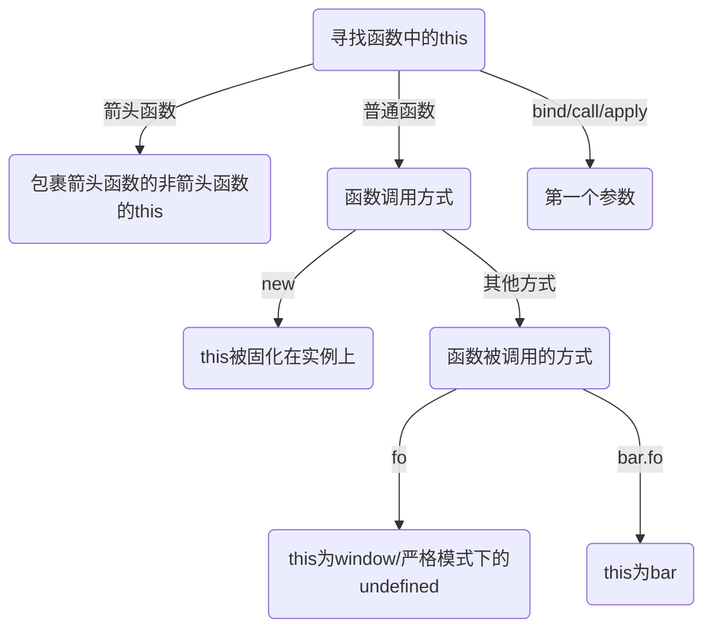

## 作用域与闭包

作用域是一套根据名字查找变量的规则, 作用域维护了所有声明的变量并确定变量的访问权限.

### 作用域在编译中的交互

JavaScript 是一门解释型语言, 解释器有三部分构成

- 引擎: 负责整个解释过程
- 编译器: 进行词法语法分析与代码生成
- 作用域: 维护了所有声明的变量确定变量的访问权限

**引擎请求**

在解释过程中, 引擎会不断的向作用域发出 `LHS` 与 `RHS` 查询. 可以认为 `LHS` 查询是在查询左值, `RHS` 是在查询右值(或者理解为非左值). 换而言之, 当变量要进行赋值操作时, 引擎会执行 `LHS` 查询, 这时引擎不关心变量的值, 而关心变量的位置. 其他情况下引擎执行 `RHS` 查询, 这时引擎只关心变量的值. 作用域收到请求后根据请求标识符返回值. 例如, 在下面这段代码执行时发生了如下查询:

```js
function foo(a){
    console.log(a);
}

var b = 2;

foo(2)
```

1. 将 `function foo(a){}` 看作 `var foo = function(){}`, 引擎执行 `var foo` 时发出 `RHS` 请求查询 `foo`, 查询不到, 遂创建 `foo` 变量
2. 引擎执行 `foo = ...` 时发出 `LHS` 请求查询 `foo`, 查询到后分配变量
3. 引擎执行 `var b` 时发出 `RHS` 请求查询 `b`, 查询不到, 遂创建 `b` 变量
4. 引擎执行 `b = 2` 时发出 `LHS` 请求查询 `b`, 查询到后分配变量
5. 引擎执行 `foo(2)` 时发出 `RHS` 请求查询 `foo`
6. 引擎执行 `foo(2)` 时发出 `LHS` 请求查询 `a`, 查询到后隐式分配变量
7. 引擎执行 `console` 时发出 `RHS` 请求查询 `console`
8. 引擎执行 `console.log` 时发出 `RHS` 请求查询 `console` 下的 `log`
9. 引擎执行 `console.log(a)` 时发出 `RHS` 请求查询 `a`

**作用域回应**

作用域在收到引擎的 `LHS/RHS` 请求后会在本作用域下查找并返回对标识符的引用

**引擎的处理**

- 若作用域没找到标识符:

  引擎会请求上一层作用域直到全局作用域. 若在全局作用域中还是没找到标识符

  - 若发起的是 `RHS` 请求: 直接抛出 `ReferenceError`
  - 若发起的是 `LHS` 请求: 在非严格模式下会直接创建变量, 在严格模式下会抛出 `ReferenceError` 异常. **注意, 这种情况针对的是诸如 `b = a` 的情况, 如果是 `var b = a`, 那么引擎会先执行 `RHS` 创建 `b` 再执行 `LHS` 赋值**.

- 若作用域找到标识符

  - 若是 `LHS` 请求则进行赋值操作
  - 若是 `RHS` 请求则继续判断是否对右值进行非法操作(如对非函数变量执行函数调用)

### 词法作用域

作用域有两种常见的模式

- 词法作用域: 大多数语言(包括JS)采用的
- 动态作用域: Bash/Perl语言采用

简单的说, 词法作用域就是在**程序执行之前的词法分析阶段**确定的静态作用域. 编译器会在词法分析阶段根据**变量的位置关系**确定直接确定作用域.

引擎请求作用域查找时, 作用域只会查找一级标识符, 例如: 查询 `console.log` 时, 作用域只查询 `console`, 在下一次查询时候才在 `console` 中查询 `log`

**遮蔽效应**

对于存在嵌套关系的作用域, 引擎在查询时会优先查找内部作用域而忽略外部作用域中的同名标识符. 全局作用域中的变量会被自动加入全局对象(`window/global`), 可以直接通过 `global` 访问全局作用域变量, 这也是忽略内层作用域的唯一方法.

**欺骗词法作用域**

词法作用域是在词法分析进行的, 这意味着程序员无法在运行时修改作用域, 但是存在几种方法可以动态干预作用域

- `eval` 函数: 动态的为 `eval` 传入参数可以对当前作用域做动态修改
- `with` 函数: 相当于手动创建了一个作用域, `with` 的参数会被"解构"作为作用域中的变量
- `apply/call/bind`函数.

动态干预方法存在诸多弊端

- 性能下降: JavaScript 在执行前会执行静态分析与性能优化, 但是无法分析 `eval/with` 中的动态作用域, 亦无法进行性能优化.

- 严格模式不可用:

  - 在严格模式下 `eval` 函数内部有自己的作用域, 此时 `eval` 函数无法干预原作用域
  - 严格模式下 `with` 不可用

- 污染全局变量: 例如

  ```js
  function foo(t, v) {
    with (t) {
      a = v;
    }
  }
  
  const obj1 = { a: 2 };
  const obj2 = { b: 2 };
  
  foo(obj1, 1);
  foo(obj2, 2);
  
  console.log(obj1);       // { a: 1 }
  console.log(obj2);       // { b: 2 }
  console.log(global.a);   // 2 发生泄漏
  
  ```


**动态作用域**

JavaScript 使用的是词法作用域模型, 但是部分语言在采用动态作用域

- 词法作用域: 词法分析阶段根据**变量的位置关系**确定直接确定作用域.
- 动态作用域: 作用域在运行时**动态变化**, 动态作用域的作用域链一般是基于调用栈的(这与 `JavaScript` 的 `this` 特性很像)

例如, 对于代码:

```js
function foo() {
  console.log(a);
}

function bar() {
  var a = 3;
  foo();
}

var a = 2;
bar();
```

- 静态作用域: 在执行 `foo` 时, 引擎发起 `RHS` 请求 `a`, 找不到, 向外直接查找全局 `a = 2`

- 动态作用域: 在执行 `foo` 时, 引擎发起 `RHS` 请求 `a`, 找不到, 顺着作用域链(调用栈)直接查找 `bar` 中的 `a = 3`, 看起来很像 JavaScript 的 `this` 机制

  ```js
  function foo() {
    console.log(this.a);
  }
  
  function bar() {
    this.a = 3;
    foo.apply(this);
  }
  
  this.a = 2;
  bar();
  ```

### 函数与块作用域

**函数作用域**

函数内部的变量与方法位于函数作用域中, 无法被外部访问.

利用函数作用域可以隐藏代码的部分内部实现, 从而实现

- 最小特权原则
- 规避变量冲突(其他实现规避冲突的方法有配置命名空间, 模块化管理)

在实践中, 实现函数作用域的方法有

- 直接在代码内部定义函数, 并在定义后调用函数

  ```diff
  // 上文
  + function foo(){
      // 保护起来的部分
  + }
  + foo()
  // 下文
  ```

  这种方法必须声明一个具名函数, 然后在调用, 不仅繁琐, 具名函数还无形中污染了外层作用域

- 使用函数表达式代替函数

  ```diff
  // 上文
  + (function foo(){
      // 保护起来的部分
  + })()
  // 下文
  ```

  JavaScript 在解析句子时, 若发现第一个关键字是 `function` 则会将这句话判定为**函数定义**, 遇到其他符号(例如这里的`(`), 则会将这句话当作**表达式**. 可以通过 `(function foo(){})()` 的方法定义函数. 此时, 不仅不用显式调用函数, `foo` 标识符也**不能被外部访问**, 不会污染外层作用域

- 匿名函数

  ```diff
  // 上文
  + (function(){
      // 保护起来的部分
  + })()
  // 下文
  ```

  缺点: 难以得知函数语义, 调试困难. 函数内部无法通过函数名调用函数名上的变量(如: `callee`)

- IIFT

  实际上有两种IIFT的写法

  ```js
  (function(){})()
  (function(){}())
  ```

  两者在功能上完全一致, 任选其一即可

**ES6的块作用域**

`ES6` 中的关键字 `let`, `const` 都支持变量块作用域, 其实现的原理是: 在声明变量时**隐式**的将变量劫持在所在的块作用域上. 但这两个关键字不支持变量提升, 在实践时最好将变量声明在作用域首部.

**ES6之前的块作用域实现**

在 `ES6` 前的时代, `JavaScript` 只有全局作用域与函数作用域, 伟大的程序员们利用部分特性实现了部分块作用域

实际上在 `ES6` 前有部分语法"支持"块作用域

- `with` 为内部代码手动创建了一个作用域, 内部代码可以认为是包在 `with(){}` 产生的块作用域中

- `try-catch` 方法的 `catch` 分句会创造块作用域. 利用这个特性, 部分 JavaScript 的 polyfill 转译工具会将 `ES6` 的块作用域翻译为 `try-catch` 语句, 例如

  ```js
  {
    let a = 2;
    console.log(a);
  }
  ```

  翻译为

  ```js
  try {throw 2;} catch (a) {
    console.log(a);
  }
  ```

  **注意**:

  > 早期 JavaScript 要求统一作用域下的不同 `try-catch` 语句的 `catch` 分句中不能使用相同的标识符声明错误, 即
  > ```js
  > try {
  >     throw 2;
  > } catch (error) {
  >     console.log(error);
  > }
  >
  > try {
  >     throw 2;
  > } catch (error) {
  >     console.log(error);
  > }
  > ```
  >
  > 是错的, 需要将 `error` 改为 `error1`, `error2`...


### 函数与变量提升

对于 `var` 与 `function` 声明的标识符, 存在变量提升. JavaScript 引擎会在编译阶段进行静态代码分析, 获得词法作用域, 完成声明.

- 对于 `var` 声明的变量或函数: JavaScript 只会提升变量定义, 在正式定义前, 变量是 `undefined`

- 对于 `function` 声明的函数: JavaScript 会提升函数函数声明与定义.

- 若作用域中同时存在 `var` 与 `function` 声明. `function` 优先, 例如:

  ````js
  foo();        // 1
  
  var foo = function () {
    console.log(2);
  };
  
  function foo() {
    console.log(1);
  }
  
  foo();        // 2
  ````

  相当于

  ```js
  function foo() {  // funciton 优先
    console.log(1);
  }
  
  var foo;         // var滞后, 于是这个就废掉了
  
  foo(); // 1
  
  foo = function () {
    console.log(2);
  };
  
  foo(); // 2
  ```


### 闭包

当函数在自己定义作用域以外的部分执行时, 函数会保留对原作用域的引用, 这个引用就是闭包. 换而言之, 一旦使用了同步/异步的回调函数, 就产生了闭包.

函数可以保持对闭包的引用, 但是无法保证闭包内的值并不变. 同时, 闭包可以阻止所在函数作用域的垃圾回收.

**实现模块化**

JavaScript 的模块化就借用了闭包实现, 以下是一个模块化的基本模式

```js
function onemod(){
    let attr1 = 1;

    function method1(){
        // do sth
    }

    return {
        method1
    }
}
```

在函数内部定义变量与方法, 通过 `return` 将需要暴露的变量导出.

函数每次调用就会导出一个全新模块. 但是, 也因为函数可以传入参数, 编译器无法对此类模块做出静态分析与优化. 在 `ES6` 中, 每个模块被定义为文件通过 `import/export` 导入导出, 此时编译器可以在编译阶段对模块进行静态分析.

## `this` 和对象原型

### 关于 `this`

**`this` 不是什么**

- `this` 不是函数自身

  无法通过 `this` 获取函数作为对象的属性. 若想对函数对象操作还是需要使用**函数标识符**或在函数内使用 **`arguments.callee`** (已弃用)

- `this` 不是函数作用域

  `this` 不指向函数作用域, 作用域在编译阶段就生成了, 但 `this` 是在运行时动态变换的. 作用域是存在于 JavaScript 引擎中的"对象", 无法在代码中被引用

**`this` 是什么**

this是函数调用时被调用函数上下文中的一个属性, 其具体的指向取决于函数的调用方式

**为什么需要`this`**

`this` 提供了一种让函数调用隐式传递其对象引用的模式, 在函数被调用时, `this` 作为函数上下文中的一项被传入函数

### `this` 的指向

分析 `this` 的指向首先要分析函数的调用位置, 也就是分析调用栈的第二项

我们将先从易到难的介绍各种规则, 然后规定规则的优先级

**规则**

- 默认绑定

  当函数被直接调用(如: `foo()`)时, `this` 会被绑定到 `global/window` 对象. 在严格模式下, `this` 无法指向全局对象, 其会指向 `undefined`

- 隐式绑定

  若被调用对象被其他对象在**形式上**包含, `this` 将指向被包含对象. 可以从下面几个例子中理解形式上的包围

  ```js
  window.a = 0;

  // SITUATION 1: 包围

  const foo = {
    demo() {
      console.log(this.a);
    },
    a: 1,
  };

  foo.demo(); // 1, 没问题, 调用时是 foo.demo(), demo被foo包围了

  // SITUATION 2: 形式上包围

  function demoGlobal() {
    console.log(this.a);
  }

  const bar = {
    demo: demoGlobal,
    a: 2,
  };

  bar.demo(); // 2, 虽然 bar.demo 引用自全局函数, 但是在bar.demo中demo被bar包围了

  // SITUATION 3: 形式上包围

  const demoFromFoo = foo.demo;

  demoFromFoo(); // 0, 虽然 demoFromFoo 引用自 foo.demo , 但是在这里并没有被包围

  // SITUATION 4: 回调函数

  setTimeout(foo.demo, 1000); // 0, 可以简化调用过程为
  // function setTimeout(fn, delay) { // 这里其实进行了一次函数的赋值, 与SITUATION 3 类似, 于是失去了包围对象
  //   sleep(delay);
  //   fn();
  // }

  // SITUATION 5: 包围陷阱

  const baz = {};
  (baz.demo = foo.demo)(); // 0, 赋值语句返回的是目标函数的引用, 相当于就是一个 function(){...} , 但是在这里并没有被包围

  // SITUATION 6: 只关注前一层包围

  const outer = {
    inner: {
      a: 3,
      demo: demoGlobal,
    },
    a: 4,
  };

  outer.inner.demo(); // 3, 只关心包围的第一的外层元素(inner)
  ```

  也将 SITUATION 3&4 的情况称为**隐式丢失**

- 显式绑定

  JavaScript 中改变 `this` 指向的方法有 `call / apply / bind`, 对于 `call / apply`, 这两个函数可以直接修改 `this` 的指向. `bind` 函数可以返回一个修改 `this` 后的函数, 可以将其实现**简单的**理解为

  ```js
  function bind(fn, self) {
    return function () {
      return fn.apply(self);
    };
  }
  ```

  部分 API 自身就支持改变 `this` 指向, 如 `Array.prototype.forEach()` 支持修改回调的 `this`

  ```js
  const obj = { a: 1, b: 2, c: 3 };
  const array = ['a', 'b', 'c'];

  array.forEach(function (d) {
    console.log(this[d]); // undefined undefined undefined
  });

  array.forEach(function (d) {
    console.log(this[d]); // 1 2 3
  }, obj);
  ```

- `new` 绑定

  使用 `new` 新建实例时, 构造函数的 `this` 将绑定到创建的实例

- 箭头函数: 直接绑定非外层非箭头函数的 `this`

**优先级**

0. 箭头函数
1. `new` 绑定
2. 显式绑定: 注意, `new` 的优先级高于 `ES6` 实现的 `bind`, 那个 `bind` 与前面简化的 `bind` 不同
3. 隐式绑定
4. 默认绑定

讨论 `new` 绑定与 `bind` 绑定的优先级是有意义的, 如下

```js
class Foo {
  constructor(a, b, c) {
    //...
  }
}

const initAs12X = Foo.bind(null, 1, 2);
new initAs123(3);
new initAs123(4);
```

我们确定了构造函数的前两项为 `1, 2`, 希望在 `new` 的时候只指定第三项, 就可以这么写, 先用 `bind` 为函数传入前两个参数, 并绑定 `null` 作为 `this`,  然后又用 `new` 覆盖 `this`.

在 JavaScript 中, `bind` 函数可以用来实现函数柯里化.

最后, 引用来自掘金小册的流程图




**陷阱**

- 无用 `this`:

  有时函数的 `this` 并不重要, 但是部分回调函数需要指定 `this`(如通过 `bind` 实现柯里化, `forEach`函数). 我们可以传入 `null` 占位, 但是若函数的 `this` 为可选参数且默认值为 `global`, 填入 `null` 会让 `this` 指向 `global`, 这可能会污染全局作用域. 解决方法是实现一个人畜无害的对象, 将其称之为 `DMZ`(Demilitarized zone, 非军事区) 对象, 可以使用 `Object.create(null)` 实现, 这个对象比 `{}` 更"空",

  ```js
  var empty = Object.create(null);
  foo.bind(empty, /* ... */);
  ```

- 隐式丢失问题

### 对象

**构造**

可以通过**字面量**与**构造函数**两种方式构造对象, 在字面量构造对象时, `Key` 有多重写法

```js
let pre = 'C-';

const obj = {
  a: 1, // 一般模式
  'A-1': 1, // A-1 会被理解为A减1, 放弃简写, 将Key用引号引起来
  [pre + 1]: 1, // 可以用[]实现计算属性, 结果相当于 'C-1': 1
};
```

在 JavaScript 的基本类型中, 只有 Object 是对象. `typeof null === 'object'`, 这是因为

> 在 JavaScript 中二进制前三位都为 0 的话会被判断为 `object` 类型, `null` 的二进制表示全是 `0`, 自然前三位也是 `0`, 所以执行 `typeof` 时返回 `object`

**访问**

可以通过**属性访问**(`obj.a`)与**值访问**`obj['a']`访问元素, 两者效果相同

当属性访问的 `Key` 违反 JavaScript 语法时(如`a.1`)可以用值访问替代. 值访问中,  `[]`包裹的表达式可以是非 `string`, 但是在最后都会转换为 `string`, 例如

```js
let obj = {};

obj[2] = 1;
obj[true] = 2;
obj[obj] = 3;

console.log(obj['2']); // 1
console.log(obj['true']); // 2
console.log(obj[new String(obj)]); // 3
console.log(obj['[object Object]']); // 3
console.log(obj[new Object()]); // 3
```

虽然后三项都不是同一个 `object`, 但是他们转换为 `string` 后都是 `'[object Object]'`, 应此映射值一样

**复制**

- 浅拷贝

  - 对于` JSON` 安全的对象: `JSON.parse(JSON.stringify(obj));`
  - `ES6` 下: `Object.assign(obj);`

  这两个方法会将所有**可枚举对象**拷贝出来, 但是 `JSON` 方法拷来的对象的属性描述符(如: writable)会被抹去, `Object.assign` 来的对象的属性描述符会保留

- 深拷贝

  ```js
  // 深拷贝
  export function deepCopy(source, target) {
    const copyedObjs = []; // 此数组解决了循环引用和相同引用的问题，它存放已经递归到的目标对象
    copyedObjs.push({ fromTarget: source, toTarget: target });
    function deepCopyFunction(sourceItem, targetItem) {
      Object.keys(sourceItem).forEach((key) => {
        if (
          typeof sourceItem[key] !== 'object' ||
          sourceItem[key] === null ||
          sourceItem[key] === undefined
        ) {
          targetItem[key] = sourceItem[key];
        } else {
          for (let i = 0; i < copyedObjs.length; i += 1) {
            if (copyedObjs[i].fromTarget === sourceItem[key]) {
              targetItem[key] = copyedObjs[i].toTarget;
              return;
            }
          }
          targetItem[key] = {};
          if (Array.isArray(sourceItem[key])) targetItem[key] = [];
          copyedObjs.push({
            fromTarget: sourceItem[key],
            toTarget: targetItem[key],
          });
          deepCopyFunction(sourceItem[key], targetItem[key]);
        }
      });
    }
    return deepCopyFunction(source, target);
  }
  ```


**属性描述符**

可以用 `Object.defineProperty(obj, attr, config)` 定义对象的属性与属性标识, `config` 结构为

```js
{
    configurable?: boolean, // 是否允许修改属性描述符, 默认 false
    enumerable?: boolean, // 是否可以枚举, 默认 false
    value?: any, // 值, 默认 undefined
    writable?:  // 值是否可修改, 默认 false
    get(),
    set()
}
```

- 显而易见的是: 将 `configurable` 改为 `false` 后无法改回, 但是, 即使 `configurable: false`,  仍然可以将 `writable` 从 `true` 改为 `false`, 且无法改回.
- 可以使用 `delete` 删除属性(但并不意味着会被垃圾回收, 因为被删除对象可能会被其他对象引用)

**属性不变性**

- 配置 `{configurable: false, writable: false}` 即可创建常量属性
- 调用 `Object.preventExtensions()` 可以让对象无法再添加新的属性(添加会造成静默失败, 在严格模式下会造成 `typeError` )
- 调用 `Object.seal()` 可以让对象无法再添加/删除属性, 无法重写属性描述符
- 调用 `Object.freeze()` 可以让对象在 `seal` 的基础上 `writable: false`. 如需冻结整个对象, 该需要递归冻结每个属性, 同时, 引用这个属性的所有对象的该属性都会被冻结

**getter与setter**

- 访问对象的属性实际上是在对象上的 `[[Get]]` 方法, 默认的 `[[Get]]` 方法会先查找对象上是否有该属性, 若是对象上没有该属性, `[[Get]]` 就会顺着**原型链**向上查找, 都找不到则返回 `	undefined`. **这与作用域的查找不同, 作用域查找失败后会向外层作用域查找, 都找不到则抛出 `Reference Error`**
- 为对象设置属性等操作会出发 `[[put]]`, `[[put]]` 会先检查属性是否存在, 在检查是否定义了属性标识符, 若是则直接调用 `setter`, 再检查属性是否是 `writebale` 的, 如果是则会造成静默失败或 `TypeError`, 若不是则会设置值
- 可以在 `defineProperty` 时指定 `getter` 与 `setter` 接替默认 `[[Get]]` 与 `[[Put]]`, **若定义了 `getter` 没有的定义 `setter`, 在设置属性时 `[[Put]]` 不会赋值, 而是直接忽略赋值且不抛出错误. 所以最高成对定义 `getter/setter`**

**查找**

- `in` 可以判断 `key` 是否在对象或其原型链上(包括不可枚举的属性)
- `hasOwnProperty` 可以判断 `key` 是否在对象上, 但不检查原型链
- `for-in` 可以遍历对象上的可枚举元素的 `key`
- `for-of` 可以遍历有迭代器对象上的所有值
- `Object.keys()` 可以返回对象上的可枚举元素
- `Object.getOwnPropertyNames()` 可以返回对象上的所有元素

### 混入

- 显式混入

  ```js
  function mixin( sourceObj, targetObj ) {
  	for (var key in sourceObj) {
  		// 仅拷贝非既存内容
  		if (!(key in targetObj)) {
  			targetObj[key] = sourceObj[key];
  		}
  	}
  	return targetObj;
  }
  ```

- 寄生继承

  ```js
  // “传统的 JS 类” `Vehicle`
  function Vehicle() {
  	this.engines = 1;
  }
  Vehicle.prototype.ignition = function() {
  	console.log( "Turning on my engine." );
  };
  Vehicle.prototype.drive = function() {
  	this.ignition();
  	console.log( "Steering and moving forward!" );
  };

  // “寄生类” `Car`
  function Car() {
  	// 首先, `car` 是一个 `Vehicle`
  	var car = new Vehicle();

  	// 现在, 我们修改 `car` 使它特化
  	car.wheels = 4;

  	// 保存一个 `Vehicle::drive()` 的引用
  	var vehDrive = car.drive;

  	// 覆盖 `Vehicle::drive()`
  	car.drive = function() {
  		vehDrive.call( this );
  		console.log( "Rolling on all " + this.wheels + " wheels!" );
  	};

  	return car;
  }

  var myCar = new Car();

  myCar.drive();
  // Turning on my engine.
  // Steering and moving forward!
  // Rolling on all 4 wheels!
  ```

- 隐式混入

  ```js
  var Something = {
  	cool: function() {
  		this.greeting = "Hello World";
  		this.count = this.count ? this.count + 1 : 1;
  	}
  };
  
  Something.cool();
  Something.greeting; // "Hello World"
  Something.count; // 1
  
  var Another = {
  	cool: function() {
  		// 隐式地将 `Something` 混入 `Another`
  		Something.cool.call( this );
  	}
  };
  
  Another.cool();
  Another.greeting; // "Hello World"
  Another.count; // 1 (不会和 `Something` 共享状态)
  ```

### 原型

**尝试理解原型链**

首先要明确, 虽然人们致力于通过语法糖让程序员像写类一样写 JavaScript 的"类"与"继承". 但是, 实际上 JavaScript 的继承是基于原型链的.

原型是为实现继承而提出的, 可以尝试将对象的原型理解成**这个对象是基于什么样子的玩意魔改出来的**. 注意, 基于什么**样子的**玩意, 不是基于**什么玩意**. 以下面这个继承关系为例

```js
class Father {
  constructor() {
    this.f = 1;
  }
}

class Son extends Father {
  constructor() {
    super();
    this.s = 1;
  }
}
```

最开始, 我以为, 原型就是告诉实例对象, 他是基于**什么玩意**构造出来的.

如果不考虑继承关系, 可以这么想象 `Father` 与 `Son`


有两个独立的框框, 框中, 左边的圆是构造函数, 中间原型, 右边是其构造出的实例. 按照刚刚的理解, 原型是一个神秘的 `object`, 当我们要构造函数的时候, 只需要将执行 `构造函数.apply(原型)`, 然后我们就得到了实例, 看起来不错. 要是知道原型是什么就好了.

那, 如果 `Son` 的原型是 `Father` 的实例会怎么样呢? 不错诶! `Son构造函数.apply(father)` 得到 `son` 看起来合情合理!


将原型链扩展完. 还是很棒! `Father构造函数.apply({})` 得到 `father` 看起来也合情合理! `Object.apply(一个奇怪的东西)` 得到 `{}` 看起来也合情合理! 至于这个奇怪的东西, 我们只知道他的 `__proto__` 是 `null`


世界线收束了? 不对劲, 这么我们在直接操作原型呢? 这么一串搞下来, 我们直接魔改了 `Object` 的原型 :(

实际上不是这样的, 原型是一个对象, 他就像一个指路牌一样描述了构造函数(`.constructor`)是谁, 原型链的上一层是谁`.__proto__`, 这个类上有什么方法.

看看 `Son.prototype`

```js
constructor: class Son         // 构造函数
[[Prototype]]: Object          // 原型链上一级
    constructor: class Father
    [[Prototype]]: Object
```


但是, 对于创建对象来讲, 这足够了! 一旦我拥有了原型对象, 我就知道了其构造函数与原型链的前一级, 在创建对象的时候, 我递归让上一级帮我创建父类的实例, 然后将哪个实例喂给这一级的构造函数, 对象创建成功


这就解释了 `Son.prototype.__proto__ === Father.prototyp`, 原型链即使这条蓝色的链表, 红色的就是其构造的过程:)

看起来没问题. 但是, 为啥要把类上的方法存储在原型上呢? 因为这样所有的子类就访问父类的同一个方法. 这与基于类的继承的实现方法不太相同, 但是 JavaScript 本身就是基于原型链继承的而不是基于类继承的.

于是, 这个经典的图就可以理解了. 无非就是加入了 **Object&Function 既是函数也是对象** 的想法


**基于原型链的继承**

- 差异继承

  回想 Java 等基于类继承的语言. 子类在实例化时只会执行父类的构造函数, 并不会实例化父类, 父类的属性均会实例化在子类上.

  但是 JavaScript 是基于原型链继承的, 构造的过程实际上是一层一层的的调用构造函数并一层一层的构造实例. 这意味着在构建子类时父子类实例都会被创建, 继承关系只是在原型上通过 `__proto__` 维护子对象与父对象的关联, 子类实例上只维护其与父类的差异. 也称这种继承为差异继承.

- `prototype` 与屏蔽

  对象的**赋值**会触发 `[[Put]]` 操作. `[[put]]` 查找对象失败后会顺着对象的原型链查找标识符, 于是产生了一些奇怪的规则.

  假设执行 `foo.bar = 1`, 且 `foo` 上没有 `bar`

  - 原型链上找到了标识符且标识符 `writable: true`, **会直接在 `foo` 上创建 `bar`, 然后赋值. 称其为屏蔽属性**(WTF!!)

  - 原型链上找到了标识符且标识符 `writable: false`, **会静默失效, 在严格模式下会抛出错误**

  - 原型链上找到了标识符且标识符有 `setter`, 直接应用 `setter`

  **上面的规则都是针对 `=` 赋值的, 使用 `Object.defineProperty()` 就不会产生这些破玩意**

- 什么是所谓的构造函数

  实际上, 构造函数就是普通函数, 构造函数也可以像普通函数一样调用. 但是一旦函数前面加上了 `new`, `new` 会劫持普通函数并将其当作构造函数调用

- 原型上的 `constructor`

  ```js
  function C1() {
    this.v = 1;
  }

  function C2() {
    this.v = 2;
  }

  C2.prototype = C1.prototype;

  const c = new C2();
  console.log(c); // C1 { v: 2 }
  console.log(c.constructor === C2); // false
  console.log(c.constructor === C1); // true
  ```

  对象上的 `constructor` 并不是对象的构造者, 因为 `constructor` 是在对象的原型上, `constructor` 原型的构造函数

- 手动原型继承

  这是一些继承方案

  ```js
  function C1() {
    this.x = 1;
  }
  
  C1.prototype.sayC1 = () => {
    console.log('IM C1');
  };
  
  function C2() {
    C1.call(this); // 将C1的变量定义继承到了C2
    this.y = 2;
  }
  
  C2.prototype = Object.create(C1.prototype); // 👍 将C1的方法继承到C2可行方案1(ES6前)
  // Object.setPrototypeOf(C2.prototype, C1.prototype); // 👍 将C1的方法继承到C2可行方案2(ES6)
  // C2.prototype = C1.prototype; // 👎错误方案1
  // C2.prototype = new C1(); // 👎错误方案2
  
  C2.prototype.sayC2 = () => {
    console.log('IM C2');
  };
  
  const c = new C2();
  console.log(c); // C1 { x: 1, y: 2 }
  c.sayC1(); // IM C1
  c.sayC2(); // IM C2
  ```

  继承变量没得说, 直接 `apply()` 就行, 但是有四个继承方法的方案

  - `C2.prototype = Object.create(C1.prototype);` 这是在ES6之前的方案

    `Object.create()` 方法用于创建一个新对象, 并使用参数对象来作为新创建对象的原型

    一个简易的 `create` 实现

    ```js
    function create(o) {
      function F() {}
      F.prototype = o;
      return new F();
    }
    ```

  - `Object.setPrototypeOf(C2.prototype, C1.prototype);`: `ES6` 新增的解决方案

  - `C2.prototype = C1.prototype;` 会造成修改 `C2.prototype` 时直接修改了 `C1.prototyoe`

    ```js
    function C1() {
      this.x = 1;
    }

    C1.prototype.say = () => {
      console.log('IM C1');
    };

    function C2() {
      C1.call(this); // 将C1的变量定义继承到了C2
      this.y = 2;
    }

    C2.prototype = C1.prototype;
    C2.prototype.say = () => {
      console.log('IM C2');
    };

    const c1 = new C1();
    const c2 = new C2();

    c1.say(); // IM C2
    c2.say(); // IM C2
    ```

  - `C2.prototype = new C1();` 不推荐这个方法, 原因是

    - `C2` 的原型上会有 `C1` 的变量
    - 调用 `new C1()` 构造函数可能产生副作用(如修改全局变量)

    如下是两者对比

    ```js
    C1 (C2.prototype = Object.create(C1.prototype)版)
      [[Prototype]]: Object
        sayC1: () => {   console.log('IM C1'); }
        constructor: ƒ C1()
        [[Prototype]]: Object
    C1 (C2.prototype = new C1()版)
      x: 1
      [[Prototype]]: Object
        sayC1: () => {   console.log('IM C1'); }
        constructor: ƒ C1()
        [[Prototype]]: Object
    ```

**对象关联**

通过继承可以让两个对象关联起来. 如果只是想实现跨对象调用方法, 这就显得比较麻烦了(因为要维护 `constructor/__proto__`), 我们可以利用 `Object.create()` 实现两个对象的关联. 实现关联后最好不要使用外部委托的调用模式, 即

```js
const foo = {
    sayF(){}
}

const bar = Object.create(foo)
bar.sayF() // 外部委托
```

而是采用内部委托

```js
const foo = {
    sayF(){}
}

const bar = Object.create(foo)
bar.doSayF = function(){
    this.sayF(); // 内部委托
}
bar.doSayF();
```

这样可以提高代码可读性与安全性


### 面向委托与面向对象的设计

- 传统的OOP编程: 鼓励在继承时使用方法重写(和多态)覆盖父类更加抽象的方法

- 委托编程: 要求将两个对象当作协作的兄弟, 当某个对象上没有方法时会要求另一个对象帮忙实现, 此外委托编程还有一些特点

  - 变量直接存储在委托上: 因为被委托者只是将原型上的属性连接到了委托者, 不会带被委托者的属性
  - 被委托者方法创建的变量会直接存在委托者上: 调用时候一般是 `委托者.方法()`, 此时 `this` 被隐式绑定在了委托者上
  - 不鼓励重写方法, 鼓励在委托者身上定义更加具有描述性的方法名: JavaScript 的原型链`[[put]]` 机制让重写很麻烦
  - 不关注类与类之间的层次关系而是关心对象与对象之间的相互借用关系(拿来吧你🖐)
  - 不得循环委托

  **反类化**

  有的时候, 我们不需要类, 只是需要类上的方法, 此时我们可以在用委托机制在不实例化父类的情况下使用类上的方法

  **内省**

  检查一个对象是不是一个构造函数的实例

  ```js
  function Foo(){/*...*/}
  Foo.prototype...
  
  function Bar(){/*...*/}
  Bar.prototype = Object.create(Foo.prototype);
  var b1 = new Bar("b1");
  
  // 让Foo和Bar互相关联
  Bar.prototype instanceof Foo;// true
  Object.getPrototypeOf(Bar.prototype) === Foo.prototype; //true
  Foo.prototype.isPrototypeOf(Bar.prototype);// true
  
  // 让b1关联到Foo和Bar
  b1 instanceof Foo;// true
  b1 instanceof Bar;// true
  Object.getPrototypeOf(b1) === Bar.prototype; //true
  Foo.isPrototypeOf(b1);// true
  Bar.isPrototypeOf(b1);// true
  ```

  还有一种更加脆弱的内省模式，但是在开发者上面用的很多

  ```js
  if(a1.something){
  	a1.somethinf();
  }
  ```

  ### `ES6` 的 `class` 语法

  **优点**:

  - 通过 `supper` 基本杜绝了 `prototype`, 并实现了多态
  - 简洁的继承定义
  - 不能声明属性, 只能声明方法

  **缺点**

  - 反词法

      ```js
      var LoginController = {
        errors: [],
        getUser() { // 无需function
        }
      };
      ```

      这是个语法糖, 编译后变为

      ```js
      var AuthController = {
        errors: [],
        getUser: () => {
        },
      };
      ```

      编译后 `getUser` 引用了一个匿名函数, 这意味着

      1. 使调试时的栈追踪变得困难
      2. 使自引用（递归，事件绑定等）变得困难
      3. 使代码（稍稍）变得难于理解

  - 存在变量名与方法名之间的屏蔽, `supper` 造成的隐式屏蔽

  - 可以通过修改 `prototype` 的方法在 `class` 定义后修改 `class` 定义

## 类型与语法

### 类型

JavaScript 是有类的, 但是 JavaScript 是一个动态若类型语言, 我们没法说变量属于什么类型, 只能说变量对应的值是什么类型的.

内置类型有 `null, undefined, boolean, number, string, object, symbol`, 可以用 `typeof` 判断值的类型

`typeof` 判断类型是存在部分特例

- `typeof null === 'object'`, 这是 JavaScript 的一个小 bug. 若确实需要检测 `null` 可以使用 `!foo && typeof foo === 'object'` 判定

- `typeof function () {} === 'function'`, 虽然函数是 `Object` 的子类, 但是 `typeof` 会特殊的返回`function` 而不是 `object`. 同时, 函数的 `length` 是其形参的数量, 形参的数量不包括剩余参数个数，仅包括第一个具有默认值之前的参数个数。

  ```js
  function fun1(a) {} // fun1.length = 1
  function fun2(a, b) {} // fun2.length = 2
  function fun3(a, b, c) {} // fun3.length = 3
  function fun4(a, b, c, d = 1) {} // fun4.length = 3
  function fun5(...args) {} // fun5.length = 0
  function fun6(a = 1, b, c, d) {} // fun6.length = 0
  ```

- `typeof 未定义值 === 'undefined'`

**`undefined` 与 `undeclared`**

- 当我们访问一个已定义但是没有赋值的变量时, 会返回 `undefined`
- 当我们返回一个没有定义的(undeclared) 值时,
  - 若在是访问对象上的标识符, 会返回 `undefined`, (对象上 `[[Get]]` 的保护机制)
  - 否则抛出 `ReferenceError`

但是 `typeof` 的保护机制会让 `undefined` 与 `undeclared` 均返回 `undefined`

```js
let a;
console.log(typeof a); // undefined
console.log(typeof b); // undefined
```

这种保护机制可以让我们轻松的判断全局作用域上是否有某个属性, 方便外部 JavaScript 模块加载时检测全局环境, 实现选择性加载

```js
if (typeof foo) {
  foo = function () {};
}
```

**`void`关键字**

`void` 表达式永远返回 `undefined` 值, 例如

```js
console.log(void true); // undefined
console.log(void setInterval(() => {}, 1000)); // undefined
```

**`undefined` 与 `null`**

一般用 `null` 表示空值, 用 `undefined` 表示没有值.

比较特殊的是: **`null` 是一个关键字, 但是 `undefined` 只是一个标识符, 他的值默认为undefined**, 所以以下代码是成立的

```js
const undefined = 1;
const demo = {};
console.log(undefined); // 1
console.log(demo.t); // undefined
console.log(demo.t === undefined); // false, 因为 undefined 标识符对应的不是 undefined 值
console.log(demo.t === void 0); // true, 因为 void 0 返回的是 undefined 值
```

### 值

- 数组

  - 删除元素: `delete a[1] / a.splice(1,1);`伪数组转数组

    常见的伪数组有 `DOMList`, `arguments`, 伪数组没有数组上的部分方法, 转换方法为(假设 `foo -> bar`)

    - 遍历伪数组元素
    - `bar = Array.prototype.slice.call(foo);`
    - `bar = Array.from(foo);`
    - `bar = [...foo];`

- 字符串

  字符串不是字符数组, 两者身上的方法有差异

  - 字符串不可变

    - 字符串的值不可被外部修改

        ```js
        let s = '123';
        s[1] = 0;
        console.log(s); // '123'

        let a = [...'123'];
        a[1] = '0';
        console.log(a); // ['1', '0', '3']
        ```

    - 字符串上的方法不得修改字符串的值(换而言之, 调用字符串的方法只会返回新值, 而不会修改字符串原值)

  - 字符串可以使用部分字符数组的方法:

    - 字符串可以通过 `Array` 原型方法访问 `Array.prototype.reverse.call(s)`

    - 若访问的方法会修改原字符串, 那么该方法将无法调用

      ```js
      const s = '123';
      Array.prototype.reverse.apply(s); // TypeError: Cannot assign to read only property '0' of object '[object String]'
      ```

      可以先将字符串转换为数组在调用方法最后转回

- 数字

  JavaScript 只有数字一个类型, 没有所谓整数小数之分. 数字全部使用 IEEE 754 的 64 位版本实现

  - 简写规则

    在书写字面量时, 可以省略前导与后继 `0`, 例如 `0.12 === .12`, `12.0 === 12.`

    受简写规则影响, 部分方法调用是无效的

    ```js
    (12).toFixed(); // 👍 有效
    0.12.toFixed(); // 👍 有效, 第二个点不可能是小数点
    12.toFixed(); // 👎 无效, JS会其为 (12.)toFixed
    12..toFixed(); // 👍 有效, 第一个点是简写, 第二个点是链式调用
    12 .toFixed(); // 👍 有效, 注意数字与点之间有空格
    ```

  - 格式化方法

    - `toFixed` 指定小数位数

      ```js
      var a = 42.59;

      a.toFixed( 0 ); // "43"
      a.toFixed( 1 ); // "42.6"
      a.toFixed( 2 ); // "42.59"
      a.toFixed( 3 ); // "42.590
      ```

    - `toPrecision` 指定有效位数

      ```js
      var a = 42.59;
      
      a.toPrecision( 1 ); // "4e+1"
      a.toPrecision( 2 ); // "43"
      a.toPrecision( 3 ); // "42.6"
      a.toPrecision( 4 ); // "42.59"
      a.toPrecision( 5 ); // "42.590"
      ```

  - 运算误差: JavaScript 自带 `Number.EPSILON` 作为运算误差, 这个值一般为 $2^{-52}-1$

  - 整数检测: `Number.isInteger / Number.isSafeInteger` 可分别用于整数, 安全整数检测

  - 参与位运算: 虽然 IEEE 754 允许最大安全整数为 $2^{53}-1$, 但是, 在执行位运算时, 只有后 32 位数会参与运算, 其余位将被忽略. 借助此特性, 可以通过 `a | 0` 将 `a` 转为 32 位整数

  - `NaN`: `NaN` 是一个数值类型, 但不是数字. 当出现 Number 运算结果无法返回数字时就会返回 `NaN`. 所以, `NaN` 可以用来提示数值运算出错

    `NaN !== NaN`, 这是 JavaScript 唯一自己与自己不等的元素. 判断 `NaN` 可以采用以下方法

    - `Number.isNaN(a)`: 利用 ES6 的新方法判断 `a` 是不是 `NaN`
    - `a !== a;`: 反向利用其反自反的特性判断 `a` 是不是 `NaN`
    - `Object.is(NaN, a)`: 利用新方法判断 `a` 是不是 `NaN` (后面解释实现)

  - `0 & -0`

    部分场景需要使用负号表示方向, JavaScript 中有 `0` 与 `-0`.

    - `-0 === 0`

    - 可以通过字面量, 非加减的表达式, 类型转换产生 `-0`

    - `-0` 转为字符串后会失去负号

      ```js
      console.log(-0 + ''); // 0
      console.log((-0).toString()); // 0
      console.log(String(-0)); // 0
      ```

    - `'-0'` 字符串转为非字符串时会保留负号

      ```js
      console.log(+'-0');
      console.log(Number('-0'));
      console.log(JSON.parse('-0'));
      ```

    - 判定 `-0`

      - 手动实现方法

        ```js
        function isNegZero(v) {
          const n = Number(v);
          return v === 0 && 1 / v === -Infinity;
        }
        ```

      - `Object.is(-0, a)`: 利用新方法判断 `a` 是不是 `-0`

        这个 `is` 方法看起来很神奇, 其实就是特判了 `NaN` 与 `-0` 的 `===`

  - `Infinity`

    设有限正数 `a`

    - 与有限数加减法: `Infinity (+/-) a === Infinity`
    - 与 `Infinity` 加减法: `Infinity - Infinity === NaN`, `Infinity - -Infinity === Infinity`
    - 与有限非0数乘除法: `Infinity (*//) a === Infinity`, `Infinity (*//) -a === -Infinity`
    - 与0乘除法: `a/0 === Infinity`, `-a/0 === -Infinity`, `Infinity / 0 === Infinity`, `Infinity * 0 = NaN`,
    - 与 `Infinity` 乘除法: `Infinity * Infinity === Infinity`, `Infinity / Infinity === NaN`

### 原生函数

在写 TS 时会遇到一个问题, 描述类型的时候应该用小写(如: `string`), 而不能用大写(如: `String`), 因为大写的是构造函数.

JavaScript 内建的函数(原生函数)有: `String, Number, Boolean, Array, Object, Function, RegExp, Date, Error, Symbol`.

**封装**

- 对于基本类型非 `Object` 类型(`String, Number, Boolean, Symbol`)的值

  基本类型值与通过构造函数创建的值不同. 通过构造函数创建的值是一个对象

  ```js
  const s1 = 'aaa';
  const s2 = new String('aaa');
  console.log(s1); // aaa
  console.log(s2); // [String: 'aaa']
  console.log(s1 === s2); // false
  ```

  同时对象永远为 `true`

  ```js
  const b1 = false;
  const b2 = new Boolean(false);
  console.log(!!b1); // false
  console.log(!!b2); // true
  console.log(b1 === b2); // false
  console.log(b1 == b2); // true
  ```

  看起来基本类型值与对象还是有区别的, 对象中封装了基本类型值. 基本类型值本身只是一个基本类型值, 上面没有方法(如: `s.length`), 但是当基本类型值要访问其对应原生函数对象上的方法时, **JavaScript 会自动将基本类型值封装为对象**. 封装为对象当然要耗费时间, 但是**不要为此故意将字面量声明为对象**, JavaScript 引擎会对代码做性能调优并决定在什么时候封装对象.

- 对于基本类型为 `Object` 类型(`Array, Object, Function, RegExp, Date, Error`)的值

  使用字面量创建(如果可以)与使用函数创建是完全一样的

  - `Array`

    - 创建 `Array` 时可以不带 `new`

    - 通过 `Array(n)` 可以创建包含 `n` 个空值(`empty item`)的数组

    - 直接改大数组的 `length` 会导致产生空值

    - 空值不是 `undefined`, 不同函数对空值与 `undefined` 的处理不同
      ```js
      const a = new Array(3);
      const b = [undefined, undefined, undefined];
    
      console.log(a.join('-')); // --
      console.log(b.join('-')); // --
    
      console.log(a.map((d, i) => i)); // [ <3 empty items> ]
      console.log(b.map((d, i) => i)); // [ 0, 1, 2 ]
      ```

      `join` 不考虑空值的存在, 直接通过 `arr.length` 遍历每个元素. 而 `map` 在处理空值时会直接跳过空值

      应此, `Array(n)` 创建的空值数组是危险的, 可以使用 `Array.apply(null, { length: n })` 创建长度为 `n` 的 `[undefined...]` 数组

  - `Object, Function, RegExp`

    - 不建议使用构造函数构造这些对象, 可以直接使用`{}, function, //` 构建
    - 对于需要修改的正则表达式可以使用 `RegExp` 构建(但是 `RegExp` 的效率不及 `//`)

  - `Date, Error`

    - 无法用字面量创建这些值
    - `new Date()` 不带参数默认使用当前时间
    - 不带 `new` 的 `Date()` 无论参数如何, 都返回日期字符串
    - 若只是想获得当前时间戳可以使用静态方法 `Date.now()`
    - 创建 `Error` 时可以不带 `new`

- 封装对象的 `[[class]]`: 所有 `typeof` 返回 `object` 的变量上面都有一个 `[[class]]`, 表示对象的"子类型"

  ```js
  function f() {}
  const n = new Number(1);
  const b = new Boolean(false);
  const a = new Array([1, 2, 3]);
  //...
  
  console.log(Object.prototype.toString.apply(n)); // [object Number]
  console.log(Object.prototype.toString.apply(b)); // [object Boolean]
  console.log(Object.prototype.toString.apply(a)); // [object Array]
  ```

**拆封**

可以使用 `obj.valueof()` 获取对象封装的值

```js
const b = new Boolean(false);
const s = new String('aaa');
const a = new Array(1, 2, 3);
console.log(b.valueOf()); // false
console.log(s.valueOf()); // aaa
console.log(a.valueOf()); // [1, 2, 3]
```

### 强制类型转换

JavaScript 强制类型转换只支持转化为基本类型值

**抽象值操作**

抽象类型函数是类型中内置的一些个怪方法, 在类型转换时 JavaScript 会调用这些函数实现对应类型转换

- `ToString` 转换为 `String`

  - 普通对象: 对象的 `toString` 默认返回对象的 `[[class]]` 值

  - 数组: `Array` 的 `toString` 被重新定义过, 等价于 `return this.join(',')`, 注意: 没有 `[]`

  - JSON对象:

    - `JSON.stringify`

      `JSON.stringify(value[, replacer [, space]])` 有两个可选参数

      - `replacer` 若是函数, 每个属性都会经过该函数的转换, 若是一个数组，则只有包含在这个数组中的属性名才会被转换, 若是 `null` 或者未提供，则对象所有的属性都会被序列化.

        ```js
        const unSafe = {
          a: 1,
          b: '2',
          c: [1, 3, 4],
        };

        // {"a":1,"c":[1,3,null]}
        JSON.stringify(unSafe, (k, v) => (k === 'b' || k === '2' ? undefined : v))
        ```

      - `space`: 若为数字则为每级缩进指定字符, 若为字符串, 则将字符串前**十**位作为缩进字符串

        ```js
        const obj = {
          a: 1,
          c: [1, 3, 4],
        };
      
        console.log(JSON.stringify(obj, null, 2));
        // {
        //   "a": 1,
        //   "c": [
        //     1,
        //     3,
        //     4
        //   ]
        // }
      
        console.log(JSON.stringify(obj, null, '123'));
        // {
        // 123"a": 1,
        // 123"c": [
        // 1231231,
        // 1231233,
        // 1231234
        // 123]
        // }
      
        console.log(JSON.stringify(obj, null, '1234567890-='));
        // {
        // 1234567890"a": 1,
        // 1234567890"c": [
        // 123456789012345678901,
        // 123456789012345678903,
        // 123456789012345678904
        // 1234567890]
        // }
        ```

    - `toJSON`

      在 `stringify` 时, 若对象中存在非 JSON 安全值(`undefined / function / symbol / 循环引用`)会忽略或报错, 若忽略值在数组中则会采用 `null` 代替

      ```js
      JSON.stringify({
        norm: 12, // 正常
        a: undefined, // 跳过
        b: function () { // 跳过
          return 1;
        },
        c: Symbol('12'), // 跳过
        d: [
          1, // 正常
          undefined, // null
          () => {}, //null
          Symbol(12), // null
        ],
        e: t, // 报错
      });
      ```

      为了让调用者可以自定义非 JSON 安全值的转换行为, `JSON.stringify` 实际进行了几个过程, 先执行`replacer`, 再执行对象的 `toJSON` 方法, 再对返回值的 `toString`

      对象的 `toJSON` 方法应该返回一个 JSON 安全的对象方便 `toString` 调用. 该函数只会调用一次, 并且没有参数

      ```js
      const unSafe = {
        a: undefined,
        b: () => {},
        c: 1,
        toJSON() {
          return { ...this, a: 'UNDEFINED', b: 'FUNCTION' };
        },
      };
      
      console.log(JSON.stringify(unSafe)); // {"a":"UNDEFINED","b":"FUNCTION","c":1}
      ```

- `toNumber` 转换为 `Number`

  - 特殊的: `true => 1, false => 0, undefined => NaN, null => 0`

  - 字符串

    ```js
    console.log(Number('12')); // 12, 10进制
    console.log(Number('012')); // 12, 忽略8进制
    console.log(Number('0x12')); // 18, 接受16进制
    console.log(Number('0b111')); // 7, 接受2进制
    console.log(Number('0b121')); // NaN, 出现非法字符返回NaN
    console.log(Number('1a2b3c4')); // NaN, 出现非法字符返回NaN
    ```

  - 对象 / 数组 / 基本类型封装对象:

    - 对于基本类型封装的对象, 直接提取基本类型. 若转换后非数值则在转换为数字.
    - 对于其他对象, 若对象定义了 `valueOf` 函数则使用 `valueOf` 函数转换, 否则使用 `toString` 转换. 若转换后非数值则在转换为数字.

    ```js
    var a = {
    	valueOf: function(){
    		return "42";
    	}
    };
    
    var b = {
    	toString: function(){
    		return "42";
    	}
    };
    
    var c = [4,2];
    c.toString = function(){
    	return this.join( "" );	// "42"
    };
    
    Number( a );			// 42
    Number( b );			// 42
    Number( c );			// 42
    Number( "" );			// 0
    Number( [] );			// 0
    Number( [ "abc" ] );	// NaN
    ```

- `toBoolean` 转换为 `Boolean`

  规定假值: `undefined`, `null`, `false`, `+0 / -0 / NaN`, `''`, 其他都是真值
  部分被废弃 / 非标准的 JavaScript 也会被标记为 `false` (例如 `document.all` 已经被废弃, 在老版浏览器中依然存在 `!!document.all === true`, 在新版浏览器中为 `!!document.all === true`, 这可以用于浏览器版本判定)

**强制类型转换**

- `String & Number`

  - `+var` 可以实现 `String` 到 `Number`

  - `~~var` 可以实现将值按位反转再翻回来从而实现小数转 32 位整数.

    与 `floor / cell` 不同, 上述函数会做向上或下取整, 但是 `~~` 会直接去尾

    同时 `~` 相当于取反码, `-1` 的反码为 `0`. 而 `-1` 经常被用作错误标记(如 `indexof`). 所以, 所以经常用于判断值是否为 `-1`

    ```js
    const s = 'asdfghjkl';
    if (~s.indexOf('f')) console.log('find it');
    else console.log('not find  f');
    ```

  - `Number & parseInt`: `Number` 构造函数可以读入纯数字的字符串并返回 `Number` 包装对象. 而 `parseInt` 读入字符串并解析数字直到遇到非数字停止.

    ```js
    const a = '42';
    const b = '42px';

    console.log(Number(a)); // 42
    console.log(Number.parseInt(a, 10)); // 42

    console.log(Number(b)); // NaN
    console.log(Number.parseInt(b, 10)); // 42
    ```

    如果不指定进制, `parseInt` 的行为也不一样

    ```js
    Number.parseInt('0x10'); // 16 自动识别 16 进制
    Number.parseInt('0b10'); // 0 自动识别 2 进制
    Number.parseInt('010'); // 10 不识别 8 进制
    ```

    同时, 两函数在遇到非字符串输入时会先转换为 `String` 在转换

    ```js
    const obj1 = {
      toString: () => '42px',
    };

    const obj2 = {
      toString: () => '42',
    };

    console.log(Number(obj1)); // NaN
    console.log(Number.parseInt(obj1, 10)); // 42

    console.log(Number(obj2)); // 42
    console.log(Number.parseInt(obj2, 10)); // 42
    ```

    这种转换会带来一些"半隐式"的转换问题

    ```js
    Number.parseInt(1 / 0, 19); // 18 ( Infinity 会被转换为 'Infinity', 'I' 在 19 进制中是 18)
    Number.parseInt(0.000008); // 0 (这个数会被转换为 '0.000008')
    Number.parseInt(0.0000008); // 8 (这个数会被转换为 '8e-7')
    Number.parseInt(false, 16); // 250 (会被转换为 'false', 'fa' 都是 16 进制数)
    Number.parseInt(parseInt, 16); // 15  (会被转换为 'function..', 'f' 是 16 进制数 )
    ```

  - `+` 二元加法造成的类型转换: 若加法两边有字符串就将两边转换为字符串(与直接转字符串不同, 流程是先 `toValue` 再 `toString` )执行字符串拼接, 否则先转换为 `Number` 再执行数值相加.

    ```js
    const obj = {
      valueOf: () => 4,
      toString: () => '42',
    };

    console.log(String(obj)); // 42: 直接 toString = '42'
    console.log(obj + ''); // 4: 先 valueOf = 4 然后 toString = '4'
    console.log(obj + 1); // 5: valueOf = 4, 4 + 1 = 5
    ```

  - `true => 1, false => 0`

- `Boolean`

  - `!!` 可以用于转换类型为 `Boolean`

  - `if / for / while / do...while / ?:` 表达式会自动转换 `Boolean`

  - `|| / &&` 的**左**操作数在作条件判断时会自动转换. 这两个逻辑运算符的返回值并不一定是 `Boolean` 而是根据短路原则直接返回第一或第二个元素

    ```js
    const a = 0;
    const b = {};
    
    console.log(a || b); // a 转为 false, 直接返回 b
    console.log(b || a); // b 转为 true, 直接返回 b
    console.log(a && b); // a 转为 false, 直接返回 a
    console.log(b && a); // b 转为 true, 直接返回 a
    ```

**`==` 类型转换**

`===` 是不进行类型转换的相等, 不可能产生类型转换, 类型转换只会发生在 `==`

- 特殊情况: `NaN != NaN`, `-0 == 0`

- `String == Number`: 将 `string` 转为 `toNumber(string)` 后比较

- `Boolean == *`: 将 `boolean` 转为 `toNumber(boolean)` 后比较

  ```js
  "0" == null;			// false
  "0" == undefined;		// false
  "0" == false;			// true -- 噢！
  "0" == NaN;				// false
  "0" == 0;				// true
  "0" == "";				// false

  false == null;			// false
  false == undefined;		// false
  false == NaN;			// false
  false == 0;				// true -- 噢！
  false == "";			// true -- 噢！
  false == [];			// true -- 噢！
  false == {};			// false

  "" == null;				// false
  "" == undefined;		// false
  "" == NaN;				// false
  "" == 0;				// true -- 噢！
  "" == [];				// true -- 噢！
  "" == {};				// false

  0 == null;				// false
  0 == undefined;			// false
  0 == NaN;				// false
  0 == [];				// true -- 噢！
  0 == {};				// false
  ```

- `undefined == null`

- 对象与非对象: 将对象转为基本类型值再比较. 以下是怪情况

  ```js
  Number.prototype.valueOf = function() {
  	return 3;
  };

  new Number( 2 ) == 3;	// true
  ```

  ```js
  var i = 2;

  Number.prototype.valueOf = function() {
  	return i++;
  };

  var a = new Number( 42 );

  if (a == 2 && a == 3) {
  	console.log( "Yep, this happened." );
  }
  ```

- 奇葩情况

  ```js
  [] == ![];		// true, 右侧 ![] => false, [] => '' => false
  ```

  ```js
  console.log([2].toString()); // 2
  console.log([null].toString()); // ''
  ```

  ```js
  console.log(0 == '\n'); // true, '\n' / '' / 各种unicode空格 => 0
  ```

  ```js
  "0" == false;			// true -- 噢！
  false == 0;				// true -- 噢！
  false == "";			// true -- 噢！
  false == [];			// true -- 噢！
  "" == 0;				// true -- 噢！
  "" == [];				// true -- 噢！
  0 == [];				// true -- 噢！
  ```

  总之, `==` 两边不要写 `true / false`, 避免使用 `[], '', 0`

- 各种情况比较表: [dorey/JavaScript-Equality-Table](dorey/JavaScript-Equality-Table)


  

**比较符**

JavaScript 只定义了 `<`. `a > b` 会被自动转为 `b < a`, `a <= b` 会被转换为 `!(b < a)`.

在比较时, 双方会先转换为基本数值类型再比较

### 语法

**结果值**

在 DevTools 中, 在输入语句后即使没有 `Console` 语句, DevTool 也会输出一个结果, 这里显示的是语句的结果值.

```js
> let a = 1
< undefined
> a
< 1
```

在正常代码中, 如果一个语句中只有 `a`, JavaScript 是不会输出结果的, 但是 DevTool 会输出这个语句的结果值

- 声明语句 `let a = 1` 有结果值, 但是会被 JavaScript引擎屏蔽, 最终显示 `undefined`

- 赋值语句 `a = b` 的结果值为赋的值(但是不是 `a` ! 只是 `a` 对应的右值!)

  由于赋值语句的结果值是赋的右值, 可以借助这个特性实现链式赋值

  ```js
  a = b = c = 1
  ```

  值得注意的是, 声明语句的结果值被屏蔽为了 `undefined`. 所以, 不能链式声明

  ```js
  let a = b = c = 1 // 👎 静默失效
  ```

- 代码块 `{}` 的结果值是代码块的最后一个语句 / 表达式

在编程中, 可以使用 `eval` 获取结果值(但是不建议), 未来可能可以通过 `do` 获取结果值

```js
let a, b;

a = do {
  if (true) {
    b = 12;
  }
};

console.log(a); // 42
```

**表达式的结果是右值**

表达式的结果值是右值, 这就意味着这样的写法是非法的

- `++a++`: 相当于 `++(a++)`, 而 `a++` 返回的是右值, 无法对右值做 `++`
- `(a || b) = 1`: `||` 是选择符号, 看起来的意思是若 `a` 是假值则执行 `b = 1` 否则 `a=1`. 但是 `(a || b)` 返回的是右值

**多重语法**

- `{}`: 可以是对象也可以是代码快, 这就导致了

  ```js
  [] + {} // 结果值: "[Obejct Obejct]" ({} 前有 +, 所以{}是一个对象)
  {} + [] // 结果值: 0 ({}前啥也没有, 所以是个代码块, 其等价于 +[], 格式转换为 0)
  a = [] + {} // a == "[Obejct Obejct]" ({} 前有 +, 所以{}是一个对象)
  b = {} + [] // b == [Obejct Obejct]" ({} 前有 =, 所以{}是一个对象)
  ```

  同时, 代码块内属性的含义也变了

  ```js
  // 此时是一个对象
  a = {
    foo: 1 // 对象中的一个属性
  };
  
  // 此时是一个简单的代码块
  {
    foo: 1 // 代码快中的标签
  }
  ```

  标签([MDN](https://developer.mozilla.org/zh-CN/docs/Web/JavaScript/Reference/Statements/label))类似于 C 语言中 `goto` 的 label, 与之不同的是 JavaScript 中没有 `goto`, 只能通过 `continue / break` 跳转, 同时不能对非循环的块代码执行 `continue`

  同时注意, 标签名前后不能有双引号, 即

  ```json
  {
    "foo": 1
  }
  ```

  是不合法的(震惊 JavaScript 竟然不完美兼容 JSON!)

**优先级与结合性**

- 优先级: `! > && > || ?:` ([详见MDN](https://developer.mozilla.org/zh-CN/docs/Web/JavaScript/Reference/Operators/Operator_Precedence#%E6%B1%87%E6%80%BB%E8%A1%A8))
- 结合性: `?:` 是右结合的 ([详见MDN](https://developer.mozilla.org/zh-CN/docs/Web/JavaScript/Reference/Operators/Operator_Precedence#%E6%B1%87%E6%80%BB%E8%A1%A8))

**自动分号(ASI)**

JavaScript 会自动在行末加 `;`, 这可以防止很多不经意间造成的问题

```js
do{
    // ...
}while(); // 这里在语法中必须加 ; 得益于 ASI, 程序员可以不用加
```

**暂时性死区**

就是在变量声明前使用变量(针对 `let`, `var` 有声明提升不会出事). 提前使用会造成 `Reference Error`

```js
a = 1; // 啥事没有
b = 1; // ReferenceError
let b;
```

还有个小例外

```js
console.log(typeof a); // undefined, 没有报错!
console.log(typeof b); // ReferenceError
let b;
```

**函数参数**

在非严格模式下函数参数列表中标识符会与 `arguments` 变量建立"连接"关系

```js
function test(a, b) {
  a = 2;
  b = 2;
  console.log(arguments[0]); // 只修改了 a , 但是 arguments[0] 连接到了 a, 所以依然被修改了...
  console.log(arguments[1]);
}

test(1, 0); // 2,2
```

无需考虑函数默认值问题, 启用默认值会自动启用函数严格模式

**try...finally**

`finally`块包含的语句在`try`块和`catch`之后, 无论 `try` 是否抛出异常 `finally` 子句都会执行. 这里的 `finally` 就像一个回调一样, 执行顺序为 `try -> (catch) -> finally -> 函数的正常功能`

- 当 `try` 中出现 `return` 时

  ```js
  function demo() {
    try {
      return 0;
    } finally {
      console.log('1'); // 虽然 try return 了, 但是由于 finally 的存在, return 会被"暂存" 到finall 结束
    }
    console.log('2');
  }

  demo(); // 1
  ```

- 当 `try / catch & finally` 中出现 `return` 时

  ```js
  function demo() {
    try {
      console.log('0');
      return 0;
    } finally {
      console.log('1');
      return 1; // finally 的 return 会覆盖 try 的
    }
    console.log('2');
    return 2;
  }

  let res = demo(); // console => 0, 1
  console.log(res); // 1
  ```

  ```js
  function demo() {
    try {
      console.log('0');
      throw 0;
    } catch (err) {
      console.log('1');
      return 1;
    } finally {
      console.log('2');
      return 2; // finally 的 return 会覆盖 catch 的
    }
    console.log('3');
    return 3;
  }

  let res = demo(); // console => 0, 1, 2
  console.log(res); // 2

  ```

- 该规则同样适用于 `continue`

  ```js
  for (let i = 0; i < 5; i++) {
    try {
      continue;
    } finally {
      console.log(i);
    }
    console.log('*');
  }

  // 0, 1, 2, 3, 4, 5(没有*)
  ```

- 最迷惑的是与 `break` 一起使用

  ```js
  function foo() {
    lab: {
      try {
        return 0;
      } finally {
        break lab;
      }
    }
    return 1;
  }
  
  console.log(foo()); // 1
  ```

**switch**

- 最简形式: `case` 接一个值, JavaScript 会将 `a` 与 case 值做 `===` 比较

  ```js
  a = true;

  switch (a) {
    case 1: // a == 1 成立, 但是 a === 1 不成立
      console.log('0');
      break;
    case true: // 走这里了
      console.log('1');
      break;
  }
  ```

- 如果像做一些类型转换, 可以将 `switch` 的值换成 `true`

  ```js
  a = true;

  switch (true) {
    case a == 1:
      console.log('0'); // 走这里了
      break;
    case a == true:
      console.log('1');
      break;
  }
  ```

- 如果要用 `switch (true)` 的写法的话, 需要保证计算 `case` 的计算结果一定是 `true` 而不是可以转换为 `true`, `switch` 做的是 `===`

  ```js
  a = true;
  s = 'demo';
  
  switch (true) {
    case a && s: // && 返回 b 而 b !== true
      console.log('0');
      break;
    default:
      console.log('1'); // 走这里了
      break;
  }
  ```

## 异步

### 异步

**控制台异步**

实际上 `console.*` 系列函数并不是 ES 标准语法, 其是由宿主环境决定的. 而宿主环境经常会为降低 I/O 开销而延迟输出, 这种 I/O 异步的策略会造成输出"出错"

**程序执行时机**

JavaScript 中的代码是分块的(如一个个函数), 我们希望可以干预函数执行的顺序与时机(如 Ajax 请求成功后再执行某个函数, 先执行别的函数等一会儿再执行某个函数), 有两种常见方法

- 回调函数
- `setTimeout` 等异步API

**调用栈, 事件循环与任务队列**

JavaScript 是一个单线程的异步编程语言, 让一个单线程的语言实现多任务异步是有点麻烦的. JavaScript 搞了事件循环机制, 包括了调用栈, 任务队列, 事件循环

- 调用栈(Call Stack): 存档代码执行时的 ConText(如函数嵌套)

- 事件循环: 每当调用栈清空(当前工作结束)时, 事件循环会向任务队列首部取任务, 放调用栈执行

- 任务队列: 当有异步任务需要执行(如: 定时器**到期**)时, JavaScript 会向任务队列中压入任务. 任务队列又分宏队列与微队列, 不同的任务会放入不同的队列

  宏队列  

  |                                                      | 浏览器 | Node |
  | ---------------------------------------------------- | ------ | ---- |
  | 整体代码(script)                                     | ✅      | ✅    |
  | UI交互事件                                           | ✅      | ❌    |
  | I/O                                                  | ✅      | ✅    |
  | setTimeout<br />(setTimeout(,0)是常用的放队尾的方法) | ✅      | ✅    |
  | setInterval                                          | ✅      | ✅    |
  | setImmediate                                         | ❌      | ✅    |
  | requestAnimationFrame                                | ✅      | ❌    |
  
  微队列  
  
  |                            | 浏览器 | Node |
  | -------------------------- | ------ | ---- |
  | process.nextTick           | ❌      | ✅    |
  | MutationObserver           | ✅      | ❌    |
  | Promise.then catch finally | ✅      | ✅    |

总流程如下

1. 从宏任务队列中，按照**入队顺序**，找到第一个执行的宏任务，放入调用栈，开始执行；
2. 执行完**该宏任务**下所有同步任务后，即调用栈清空后，该宏任务被推出宏任务队列，然后微任务队列开始按照入队顺序，依次执行其中的微任务，**直至微任务队列清空为止**；
3. 当微任务队列清空后，一个事件循环结束；
4. 接着从宏任务队列中，找到下一个执行的宏任务，开始第二个事件循环，直至宏任务队列清空为止。

这里有几个重点：

- 当我们第一次执行的时候，解释器会将整体代码`script`放入宏任务队列中，因此事件循环是从第一个宏任务开始的；
- 如果在执行微任务的过程中，产生新的微任务添加到微任务队列中，也需要一起清空；微任务队列没清空之前，是不会执行下一个宏任务的。

**异步并行**

异步与并行不一样, 异步是允许指定代码块的运行时机, 并行是多个代码块同时运行. 更加形象的说, 异步就是维护一个事件循环, 并行就是维护一堆事件循环.

异步与并行都会带来不确定性, 异步的不确定性是不知道任务会在什么时候被塞到队列尾部, 而并行的不确定性是不确定指令之间的执行顺序

所幸, JavaScript 是单线程的异步语言, 这意味着 JavaScript 调度最小单位是单个任务(函数要么全运行要么不运行, 我们将其成为**完整运行**), 不会出现抢占式调度

**并发**

将常见的并发模式分为三种

- 非互动式: 进程间不共享内存

- 互动式: 进程间共享内存

  这会导致由于未知执行顺序造成的资源竞争

  ```js
  var res = [];

  function response(data) {
  	res.push( data );
  }

  // ajax(..) 是某个包中任意的Ajax函数
  ajax( "http://some.url.1", response );
  ajax( "http://some.url.2", response );
  ```

  一般解决方案有

  - 编号

    ```js
    var res = [];

    function response(data) {
    	if (data.url == "http://some.url.1") {
    		res[0] = data;
    	}
    	else if (data.url == "http://some.url.2") {
    		res[1] = data;
    	}
    }

    // ajax(..) 是某个包中任意的Ajax函数
    ajax( "http://some.url.1", response );
    ajax( "http://some.url.2", response );
    ```

  - 设置大门(只有两个进程都完成才能继续)

    ```js
    var a, b;

    function foo(x) {
    	a = x * 2;
    	if (a && b) {
    		baz();
    	}
    }

    function bar(y) {
    	b = y * 2;
    	if (a && b) {
    		baz();
    	}
    }

    function baz() {
    	console.log( a + b );
    }

    // ajax(..) 是某个包中任意的Ajax函数
    ajax( "http://some.url.1", foo );
    ajax( "http://some.url.2", bar );
    ```

  - 设置"门闩"(即函数只给特定次调用者用)

    ```js
    var a;
    
    function foo(x) {
    	a = x * 2;
    	baz();
    }
    
    function bar(x) {
    	a = x / 2;
    	baz();
    }
    
    function baz() {
    	console.log( a );
    }
    
    // ajax(..) 是某个包中任意的Ajax函数
    ajax( "http://some.url.1", foo );
    ajax( "http://some.url.2", bar );
    ```

- 协作式

  对于计算量很大的同步任务, 经常将其拆解为异步的多个不冲突任务以放置 JavaScript 运行阻塞

  ```js
  var res = [];
  
  // `response(..)`从Ajax调用收到一个10000000000的数组, 要同步执行一定会花很多时间
  function response(data) {
  	res = res.concat(
  		data.map( function(val){
  			return val * 2;
  		} )
  	);
  }
  
  // ajax(..) 是某个包中任意的Ajax函数
  ajax( "http://some.url.1", response );
  ajax( "http://some.url.2", response );
  ```

  将其分解

  ```js
  var res = [];
  
  function response(data) {
  	// 一次只处理1000件
  	var chunk = data.splice( 0, 1000 );
      res = res.concat(
  		// 制造一个新的变形过的数组，所有的`data`值都翻倍
  		chunk.map( function(val){
  			return val * 2;
  		} )
  	);
  
  	if (data.length > 0) {
  		// 异步规划下一个批处理
  		setTimeout( function(){ // 通过 setTImeout 将任务再次放入队尾
  			response( data );
  		}, 0 );
  	}
  }
  
  // ajax(..) 是某个包中任意的Ajax函数
  ajax( "http://some.url.1", response );
  ajax( "http://some.url.2", response );
  ```

**语句顺序**

JavaScript 编译器在执行代码前会做代码优化, 这可能改变语句执行顺序, 但是这些改变都是安全的, 不必担心

### 回调

JavaScript 是单线程的, 其实现异步的最基本模式就是让主线程在不同任务上下文之间快速切换. 基础的异步模式有回调与 `Promise`.

**回调的问题**

回调会让代码变得难以预测, 跟踪, 调试. 其存在多种问题

- 回调地狱

  称多层嵌套回调函数的代码为回调地狱. 回调地狱不仅会造成代码形式上的难以理解, 更重要的是在同步异步函数混杂的回调嵌套代码中, 代码的行为与异步函数的执行时机往往是多样化的且容易被搞错.

- 信任问题

  当使用第三方库异步函数时, 我们需要为第三方函数传入回调. 而我们完全不清楚第三方库触发回调的时机, 次数, 三方函数出错后行为. 过早过晚过多或出错后触发回调将会带来未知的问题. 使用者在设计回调时需要考虑回调在不同时机调用的处理问题. 同时, 称这种将函数执行时机交给三方函数的行为称为: 控制权反转

**解决**

- 解决回调地狱: 链式回调

  将嵌套式回调

  ```js
  function doA() {
    setTimeout(function () {
      setTimeout(function () {
        console.log('end');
      }, 1000);
    }, 1000);
  }
  ```

  转为链式回调

  ```js
  function doA() {
    // do something
    setTimeout(doB, 1000);
  }

  function doB() {
    // do something
    setTimeout(doC, 1000);
  }

  function doC() {
    // do something
    setTimeout(() => console.log('end'), 1000);
  }
  ```

  这让代码在形式上看起来清晰了一点, 但是没有根本解决问题. 函数的执行还是难以追踪的.

- 解决信任问题: `Error-Else` 风格

  也称 Node.JS 分格. 在设计回调函数时, 传入第一个参数为 Error 信息. 若函数出错, 在执行回调时候将第一个参数设置为 Error 信息, 回调一旦看到第一个函数非假就知道上层函数出错了, 若 Error 为假, 则从第二个参数开始获取传入信息.

- 解决信任问题: 借用并发解决方案

  为解决回调时机问题, 可以借助并发思路, 通过设置 flag 识别运行时机, 解决运行时机问题

### Promise

回调存在的两个问题: 信任问题 & 回调地狱(异步代码难以理解). 在 ES6 中, Promise & 生成器分别解决了这两个问题.

**鸭子类型**

如何判断一个对象是 Promise 对象呢? JavaScript 的判断方式是检查对象是否是 "thenable" 的, 即: 对象是否具有 `then` 方法. **任何有 `then` 方法的对象都是 Promise**

显然, 这会造成严重的兼容问题, 老代码中定义 `then` 的对象都莫名其妙变成了 Promise

`Promise.resolve` 可以一定程度上解决这一问题. 该函数不仅可以返回一个 Promise, 更重要的是其可以将参数中的 `thenable` 转换为非 `thenable`

**Promise 解决了信任问题**

- 控制权反转: 在回调中, 我们将回调交给三方函数. 三方函数的执行是不可预测的. 而在 Promise 中, 三方异步函数只在结束时向我们返回执行结果 / 错误信息.

- 调用过早: 在回调中, 可能出现异步函数结束前调用回调的问题, 在 Promise 中, 即使后继函数被注册, 也要等到 Promise 被决议后的下一个 trick 再执行

- 调用过晚: 在回调中, 可能会出现后注册的回调先执行的问题

  ```js
  function test1(fn) {
    console.log('TEST1');
    fn();
  }

  function test2() {
    console.log('TEST2');
  }

  test1(() => {
    console.log('Hook');
  });
  test2();

  // TEST1
  // Hook         // 👎
  // TEST2
  ```

  在 Promise 中, 后继函数的执行顺序是严格按照注册顺序来到

  ```js
  let p = Promise.resolve();

  p.then(() => {
    console.log('THEN 1');
    p.then(() => console.log('Hook'));
  });

  p.then(() => console.log('THEN 2'));

  // THEN 1
  // THEN 2
  // Hook        // 👍
  ```

- 超时不调用: 在回调中, 如果三方函数不调用, 我们也没办法, 但是在 Promise 中, 可以通过 `Promise.race()` 的方式解决这一问题

  ```js
  function timeOutError(t) {
    return new Promise((_, reject) => {
      setTimeout(() => reject('TIME OUT'), t);
    });
  }

  Promise.race([
    new Promise((resolve) => {
      setTimeout(() => resolve('OK'), 3000);
    }),
    timeOutError(2000),
  ]).then(
    (d) => console.log('T1 FUL: ', d),
    (d) => console.log('T1 REJ: ', d)
  );

  Promise.race([
    new Promise((resolve) => {
      setTimeout(() => resolve('OK'), 1000);
    }),
    timeOutError(2000),
  ]).then(
    (d) => console.log('T2 FUL: ', d),
    (d) => console.log('T2 REJ: ', d)
  );

  // T2 FUL:  OK
  // T1 REJ:  TIME OUT
  ```

- 调用次数不正确: Promise 一旦确定就无法更改(之后的 `resolve` / `reject` 静默失效), 通过 `then` 注册的函数也只能执行一次

- 传参异常: 在回调中可能出现参数长度不正确, 但是 Promise 只允许传入一个参数, 多传的参数静默失效

- 异常处理: 在回调中, 如果三方函数出现异常, 回调函数可能不执行. 但是在 Promise 中, 若执行出现异常, Promise 会自动执行 reject, 捕获异常并传递到后继函数.

**为什么是 `resolve` 而不是 `fulfill`**

Promise 的状态有 `pending` & `fulfilled` & `rejected`, 但是我们在构造 Promise 回调的时候习惯上写的却是 `resolve` & `reject`. 为什么这里不用 `fulfill` & `reject` 呢?

`fulfilled` 表示 Promise 被接受, 而 `rejected` 表示被拒绝. 然而 Promise 构造函数上的 `resolve & reject` 功能却不是这样的

- `reject` 调用会让 Promise 无条件变为 `rejected`, 且原因为传入的参数

- `resolve` 调用会让 Promise 变为调用 `Promise.resolve` 后的结果. 如果传入的是一个 Error, Promise 将变为 `rejected`

  ```js
  new Promise((resolve) => {
    resolve(Promise.reject());
  }).then(
    () => console.log('FLU'),
    () => console.log('REJ')
  );
  
  // REJ
  ```

  也就是说 `resolve` 不会让 Promise 无条件变为 `fulfilled`, 这也就是不用 `fulfill` 的原因

**链式调用**

- Promise 每次调用 `then` 都会创建并返回一个 Promise 替代原 Promise
- 若 `then` 中函数返回非 Promise, 则自动为其包上 `Promise.resolve`. 不返回则相当于返回 `undefined` 即返回 `Promise.resolve(undefined)`
- `then` 中函数的返回值将被用作下一个 `then` 中函数的参数.
- `then` 中的函数抛出错误, 并不会引全局错误, 而是会返回 `Promise.reject` 交由下一个 `then` 处理.
- `then` 函数有两个默认值, 第一个会将收到的参数重新 `resolve` 传给下一级, 第二个会将传入的参数重新作为错误抛出
- `catch(fn)` 相当于 `then(undefined, fn)`

**为什么不是 `try...catch`**

Promise 中使用 `reject` 而不是 `try...catch` 的原因是 `reject` 可以异步的处理错误.

**并发**

- `Promise.all` 可以实现并发执行, 传入 `Promise.all` 数组中的每个元素在执行前都会被 `Promise.resolve` 过滤一遍. 若执行时出现了一个 `reject` 则直接返回 `reject`, 否则全部执行并返回结果数组
- `Promise.race` 无论结果如何, 只返回第一个. (为 `Promise.race` 传入空数组会导致 Promise 永远处于 `pedding` 状态)
- `Promise.none`: `Promise.all` 的反面, 只有全 `rejected` 才返回数组
- `Promise.any`: 忽略拒绝, 返回第一个 `fulfilled`, 若都失败则返回失败
- `Promise.first`: ~~和 any 一样~~
- `Promise.last`: 返回最后一个成功

**缺陷**

~~其实我觉得这都不是缺陷~~

1. 无法可靠捕获 `Promise` 最终的结果: 我们不知道 Promise 什么时候执行完, 也无法知道 Promise 是否出现错误. 最简单的想法是在 Promise 最后注册一个 `then` 用于通知 Promise 执行完成. 但是, 如果这个这个函数出错了, 我们将无法得知 Promise 最后是 `fulfilled` 还是 `rejected`. 唯一的可行方法是利用浏览器的垃圾回收机制, 若一个 Promise 处于待回收状态, 那么这个 Promise 肯定是执行完了, 这个时候可以检测 Promise 的状态
2. 一旦确定无法修正: Promise 一旦做出决定就无法变化, 这意味着很难让 Promise 做重复性工作(一旦监听到鼠标按下就执行函数), 我们只能借助辅助函数不断的生成新的 Promise
3. 无法取消. 我们可以使用 `Promise.race` 实现超时报错, 但是报错并不会影响超时的 Promise 继续执行.

### 生成器

Promise 解决了异步的信任问题, 而生成器解决了回调地狱问题. 将异步代码转换为看似同步的顺序代码风格.

**异步执行**

生成器返回一个迭代器, 调用者可以在任何时机调用迭代器以实现看似同步的异步调用. 一个生成器可以生成多个迭代器. 这些迭代器之间可以交替执行, 迭代器之间独立无法直接通信, 但是可以通过外部变量闭包通信.

**双向数据传递**

我们希望在每次调用迭代器时候都能为生成器传入参数, 并获得迭代器的相应. 可以通过 `yield X` 或 `return X` 的方式获取返回值, 通过 `yield` 传入参数

```js
function* foo(x) {
  console.log('B');
  let y = x * (yield 'C');
  // 3.      ^ 执行到这里就停下, 返回 C
  console.log('D');
  return y; // <- 5. 执行到这里, 返回 y
}

const it = foo(2); // 1. 只是返回生成器, 但是一点都不执行
console.log('A');
console.log(it.next()); // 2. 开始执行生成器
console.log(it.next(3)); // 4. 传入 3 继续执行
```

**构造迭代器**

为对象加入 `[Symbol.iterator]` & `next` 方法, 即可将对象变为迭代器.

- `[Symbol.iterator]` 方法是一个计算属性, 与 TypeScript 的计算属性一样, `Symbol.iterator` 就是 `Symbol` 的静态成员. 该方法应该返回一个迭代器自身.
- `next` 方法返回 `{done: boolean, value: }` 对象.

`for...of`可以实现遍历迭代器

```js
const it = {
  [Symbol.iterator]: function () {
    return this;
  },
  next() {
    // 返回一个随机数
    return { done: false, value: Math.random() };
  },
};

for (i of it) { // 永远不 done 就会陷入死循环
  console.log(i);
}
```

**生成器与迭代器**

为生成器产生的迭代器做一些改造可以实现特殊功能

- 实现一个计数器

  ```js
  function* foo() {
    let cnt = 0;
    while (true) {
      yield ++cnt;
    }
  }

  const counter1 = foo();
  const counter2 = foo();

  console.log(counter1.next()) // 1
  console.log(counter2.next()) // 1
  console.log(counter1.next()) // 2
  console.log(counter1.next()) // 3
  ```

- 实现关闭迭代器钩子

  ```js
  function* foo() {
    let cnt = 0;
    try {
      while (true) {
        yield ++cnt;
      }
    } finally {
      // 相当于实现了一个执行结束的钩子, 可以用来做垃圾回收
      console.log('OK I will clean all the code');
    }
  }
  
  const counter1 = foo();
  const counter2 = foo();
  
  console.log(counter1.next()); // 1
  console.log(counter2.next()); // 1
  console.log(counter1.next()); // 2
  console.log(counter1.next()); // 3
  // 关闭生成器, 执行 finally
  counter2.return();
  ```

**同步风格的异步代码**

```js
function foo(x,y) {
	ajax(
		"http://some.url.1/?x=" + x + "&y=" + y,
		function(err,data){
			if (err) {
				// 向`*main()`中扔进一个错误
				it.throw( err );
			}
			else {
				// 使用收到的`data`来继续`*main()`
				it.next( data );
			}
		}
	);
}

function *main() {
	try {
		var text = yield foo( 11, 31 ); // 返回并执行异步, 异步执行后会调用生成器下一步. 同时支持错误处理
		console.log( text );
	}
	catch (err) {
		console.error( err );
	}
}

var it = main();

// 使一切开始运行！
it.next();
```

**生成器与Promise**

迭代器可以用来写异步代码且不产生回调地狱. 但是生成器需要外界不断控制自己执行下一块代码. 这个工作如果由 Promise 完成那就会变得十分优雅

```js
function* foo() {
  let a = yield request('demo.com'); // request 会返回一个 Promise
  try {
    console.log('GET', a);
  } catch {
    console.log('ERROR', a);
  }
}

let it = foo();
let p = it.next().value; // p 现在是一个Promise对象

it.then(
  (d) => it.next(d),
  (e) => it.throw(e)
); // 让 Promise 执行流程控制
```

在这里, Promise 的异步控制只是在程序执行成功与出错的时候返回与抛出消息. 完全可以用一个函数实现

```js
// 感谢Benjamin Gruenbaum (@benjamingr在GitHub)在此做出的巨大改进！
function run(gen) {
	var args = [].slice.call( arguments, 1), it;

	// 在当前的上下文环境中初始化generator
	it = gen.apply( this, args );

	// 为generator的完成返回一个promise
	return Promise.resolve()
		.then( function handleNext(value){
			// 运行至下一个让出的值
			var next = it.next( value );

			return (function handleResult(next){
				// generator已经完成运行了？
				if (next.done) {
					return next.value;
				}
				// 否则继续执行
				else {
					return Promise.resolve( next.value )
						.then(
							// 在成功的情况下继续异步循环，将解析的值送回generator
							handleNext,

							// 如果`value`是一个拒绝的promise，就将错误传播回generator自己的错误处理g
							function handleErr(err) {
								return Promise.resolve(
									it.throw( err )
								)
								.then( handleResult );
							}
						);
				}
			})(next);
		} );
}
```

在 ES7 中, 还可以使用 `async` & `await` 实现上述功能

**并发**

可以借助 Promise API 实现并发(这也启示了我们应该在哪里使用 `async` & `await`)

```js
function* foo() {
  let [a, b] = yield Promise.all([
    request('demo-partA.com'),
    request('demo-partB.com'),
  ]);
  let c = yield request(`demo-full.com?a=${a}&b=${b}`);
  console.log(c);
}

let it = foo();
let p = it.next().value; // p 现在是一个Promise对象

it.then((d) => it.next(d)); // 让 Promise 执行流程控制
```

**生成器委托**

可以将生成器嵌套生成器直接扁平化为一维生成器

```js
function* foo() {
  console.log(yield);
  console.log(yield);
}

function* bar() {
  console.log(yield);
  let it = foo();
  it.next();
  it.next(yield);
  it.next(yield);
  console.log(yield);
}

let it = bar();
it.next();
it.next(1);
it.next(2);
it.next(3);
it.next(4);
```

变为

```js
function* foo() {
  console.log(yield);
  console.log(yield);
}

function* bar() {
  console.log(yield);
  yield *foo() // 在调用的时候带上 * 这样相当于实现了生成器"转移"
  console.log(yield);
}

let it = bar();
it.next();
it.next(1);
it.next(2);
it.next(3);
it.next(4);
// 1 2 3 4
```

生成器委托的对象可以是任何可迭代的值

```js
let foo = [9, 8];

function* bar() {
  console.log(yield);
  yield* foo;
  console.log(yield);
}

let it = bar();
it.next();
console.log(it.next(1).value);
console.log(it.next().value);
it.next();
it.next(2);

// 1 9 8 2
```

也可以委托异常

```js
function *foo() {
	try {
		yield "B";
	}
	catch (err) {
		console.log( "error caught inside `*foo()`:", err );
	}

	yield "C";

	throw "D";
}

function *bar() {
	yield "A";

	try {
		yield *foo();
	}
	catch (err) {
		console.log( "error caught inside `*bar()`:", err );
	}

	yield "E";

	yield *baz();

	// note: can't get here!
	yield "G";
}

function *baz() {
	throw "F";
}

var it = bar();

console.log( "outside:", it.next().value );
// outside: A

console.log( "outside:", it.next( 1 ).value );
// outside: B

console.log( "outside:", it.throw( 2 ).value );
// error caught inside `*foo()`: 2
// outside: C

console.log( "outside:", it.next( 3 ).value );
// error caught inside `*bar()`: D
// outside: E

try {
	console.log( "outside:", it.next( 4 ).value );
}
catch (err) {
	console.log( "error caught outside:", err );
}
// error caught outside: F
```

**形实转换(Thunk)**

一种古老的模式: 执行某个无参函数, 相当于这个另一个函数. 例如

```js
function foo(x,y) {
	return x + y;
}

function fooThunk() {
	return foo( 3, 4 );
}

// 稍后
console.log( fooThunk() );	// 7
```

实际上, 这种模式也实现了异步. 但是 Thunk 的无参意味着硬编码. 可以通过工厂函数解决这个问题.

**polyfill**

我们可以轻松实现 Promise 的兼容代码, 因为 Promise 是一个API, 但是生成器是一种语法. 我们没法实现兼容. 可以先看看生成器的实现

```js
function foo(url) {
	// 管理 generator 状态
	var state;

	// generator-范围的变量声明
	var val;

	function process(v) {
		switch (state) {
			case 1:
				console.log( "requesting:", url );
				return request( url );
			case 2:
				val = v;
				console.log( val );
				return;
			case 3:
				var err = v;
				console.log( "Oops:", err );
				return false;
		}
	}

	// 制造并返回 iterator
	return {
		next: function(v) {
			// 初始状态
			if (!state) {
				state = 1;
				return {
					done: false,
					value: process()
				};
			}
			// 成功地让出继续值
			else if (state == 1) {
				state = 2;
				return {
					done: true,
					value: process( v )
				};
			}
			// generator 已经完成了
			else {
				return {
					done: true,
					value: undefined
				};
			}
		},
		"throw": function(e) {
			// 在状态 *1* 中，有唯一明确的错误处理
			if (state == 1) {
				state = 3;
				return {
					done: true,
					value: process( e )
				};
			}
			// 否则，是一个不会被处理的错误，所以我们仅仅把它扔回去
			else {
				throw e;
			}
		}
	};
}
```

如果真的需要在不支持 ES6 的环境下实现生成器. 可以考虑代码转译工具.


## 性能

### 性能提升

异步可以实现多任务并发并显著提高性能. JavaScript 中其他性能提升特性有

**Web Worker([MDN](https://developer.mozilla.org/zh-CN/docs/Web/API/Web_Workers_API/Using_web_workers))**

Web Worker 并不是 ES 标准语法, 只是宿主环境的功能. 其可以提供一个并行的, 不共享作用域与资源的新线程. 通过与主线程 `post` & `listen` 消息实现通信. 消息传递有如下方式

- 转换为 String
- [结构化拷贝](https://developer.mozilla.org/zh-CN/docs/Web/API/Web_Workers_API/Structured_clone_algorithm): 高级的克隆算法, 支持循环引用等特殊对象的拷贝
- [所有权转移](https://developer.mozilla.org/zh-CN/docs/Web/API/Web_Workers_API/Using_web_workers#%E9%80%9A%E8%BF%87%E8%BD%AC%E8%AE%A9%E6%89%80%E6%9C%89%E6%9D%83%E5%8F%AF%E8%BD%AC%E8%AE%A9%E5%AF%B9%E8%B1%A1%E6%9D%A5%E4%BC%A0%E9%80%92%E6%95%B0%E6%8D%AE): 直接将对象的引用与所有权发给 Worker, 此时宿主函数无法访问对象

Web Worker 也支持创建共享 Worker(并不是资源共享, 而是一个 Worker 可以与多个宿主通行). 在实现共享 Worker 时, 需要为每次通行建立新的 port

**SIMD**

单指令多数据(SIMD)是一种数据并行方法. 其原理是将多个小数据拼成一个大数据一起运算. CPU 将其底层 API 暴露给 JavaScript 以实现高效计算

**asm.js**

是一个 JavaScript 子集(只保留可优化的语法), 可以将 JavaScript 编译为二进制文件

### 性能测试

错误的测试方法: 多次循环测执行时间

**问题**

- 计时器本身有不可忽视的误差
- 不能通过简单的除以测试次数的方法计算单次执行时间(考虑到极端数据, 执行事件方差等). 应该用一系列统计学方法衡量执行时间
- 指令通过循环测得的执行效率与真实环境的执行效率可能不同

**解决方案**

- [Benchmark.js](https://benchmarkjs.com/): 提供了一套性能检测框架, 提供详细的测试结果
- [jsPerf.com](https://github.com/jsperf/jsperf.com): 该网站提供不同 JavaScript 运行时性能测试

**优化哪些**

- 全局视角: 专注优化执行频率极高的部分

  > 非关键路径的优化都是万恶之源

- 微优化: 不关注微优化(如: `++a` 与 `a++` 的区别, `x >>> 1` 与 `x/2` 的区别), 编译器会在执行前自动优化. 虽然不同引擎优化不尽相同, 但是

  > 永远不要觉得自己比引擎聪明

  这些微优化很可能随着引擎种类的不同, 引擎版本的不同而失效.

- 尾调用优化(TCO): ES6 的一个特殊优化.

  当一个函数在执行过程中调用另一个函数时, 引擎需要开辟一个而外的空间(栈帧)管理调用栈. 但是如果函数调用发生在函数最后, 那么引擎就无需开辟新栈帧, 直接覆盖使用老栈帧即可.

  ```js
  function foo(x) {
  	return x;
  }
  
  function bar(y) {
  	return foo( y + 1 );	// 尾部调用
  }
  
  function baz() {
  	return 1 + bar( 40 );	// 不是尾部调用, 因为调用后还要执行加法
  }
  
  baz();  // 42
  ```

## 回顾 JavaScript

- 在浏览器环境中通过 JavaScript 输入字符串

  ```js
  const v = prompt('Please input a string');
  console.log(v);
  ```

- 在注释中应该写的是程序为什么是这样运行的, 而不是程序是什么(暴论)

- JavaScript 中通常使用全大写书写变量并使用 `_` 连接单词(指的是常量而不是不变的const)

- `?:` 运算符不一定用在赋值上, 但是这肯定是最常见的

- 基于原型链的继承方案与类继承方案是两套完全不同的设计模式. 原型链继承的主要思想是委托.

- 兼容方案

  - polufilling: 直接实现某个新功能API
  - transpliling: 通过转译实现新语法

## ES6

### 语法

**Let & Const**

- 新增 `let & const` 声明, 这俩都具有块作用域其不会发生提升. `let` 声明会产生暂时性死区(TDZ)问题, 建议在块首第一行就一起声明 `let` 变量

  ```js
  {
    let a = 1, b = 2, c, d; //最好放一行, 方便看. 暂时无法赋值的就只声明以规避 TDZ
    console.log(a, b);
    c = a + b;
    d = a * b;
    console.log(c, d);
  }
  ```

- 在 `for` 的括号中使用 `let` 声明迭代变量相当于为每个循环块中声明了一次变量(裸着可以理解为条件部分与循环体之间有一层作用域)

  ```js
  for (let i = 0; i < 10; i++) { // 相当于为每个循环体声明了一个 i
    console.log(i);
  }
  ```

**函数**

- 函数实参部分有自己的块作用域

  ```js
  var w = 1, z = 2;

  // 在作用域内找不到 w 就去全局找
  // 在作用域内找到了 x 且 x 已经声明, 不存在 TDZ, 搞定
  // 在作用域内找到了 z 但是 z 还没有被初始化, 抛出异常
  function foo( x = w + 1, y = x + 1, z = z + 1 ) {
  	console.log( x, y, z );
  }

  foo();					// ReferenceError
  ```

- 只有向函数实参传入 `undefined` (或者不传参)才会触发默认值

- 默认值是惰性求值的(如果有参数传入就不计算默认值的表达式了)

- 如果希望默认值是一个空函数可以使用 `Function.prototype` 而不是 `function() {}`

**解构与赋值**

- 对象解构:

  - 对象解构与对象的表述不太相同, 对象的表述是 `标识符-值` 模式, 但是对象的解构是 `对应属性-目标标识符`

    ```js
    var aa = 10, bb = 20;

    var o = { x: aa, y: bb }; // 标识符: 值
    var     { x: AA, y: BB } = o; // 对应属性: 目标标识符

    console.log( AA, BB );				// 10 20
    ```

  - 在对象解构中如果对应属性和目标标识符同名, 可以只写目标标识符

    ```js
    const o = { a: 1, b: 2 };
    const { a, b } = o;
    ```

    实际上是

    ```js
    const o = { a: 1, b: 2 };
    const { a: a, b: b } = o;
    ```

    中省去 `a:` 的结果

  - 在对象解构中如果对象前没有关键字(如 `let / var / const`)就需要为加一层`()`防止将对象解析为代码块

    ```js
    const o = { a: 1, b: 2 };
    const { a: a, b: b } = o; // 正常版本
    { a: a, b: b } = o; // {} 会被解析为代码快
    ({ a: a, b: b } = o;) // ok
    ```

  - 对象解构时允许出现计算属性

    ```js
    const o = { a: 1, b: 2, c: 3 };
    const t = {};
    for (let k of Object.keys(o)) {
      ({ [k]: t[k] } = o); // 前者是计算属性, 后者只是属性访问
    }
    console.log(t); // { a: 1, b: 2, c: 3 }
    ```

  - 支持重复赋值

    ```js
    const o = { a: { b: 1, c: 2 } };

    const {
      a: na,
      a: { b: nb, c: nc },
    } = o;

    console.log(na, nb, nc); // { b: 1, c: 2 } 1 2
    ```

  - 支持连环赋值, 由于赋值的结果值是原值, 所以支持在链上不完全解构

    ```js
    const o = { a: 0, b: 1, c: 2 };

    const { a: a1, b: b1 } = ({ a: a2, c: c2 } = { b: b3, c: c3 } = o);
    console.log(a1, b1, a2, c2, b3, c3); // 0 1 0 2 1 2
    ```

  - 对象解构默认值

    就是在目标标识符后面加上 `= x`

    ```js
    const { x, y, z, w: WW = 20 } = { x = 4, y = 5, z = 6 };
    console.log( x, y, z, WW );			// 4 5 6 20
    ```

    同时由于简化对象解构是简化了前半部分 `x:` 所以支持简写

    ```js
    var [ a = 3, b = 6, c = 9, d = 12 ] = [1, 2, 3]
    var { x = 5, y = 10, z = 15, w = 20 } = { x = 4, y = 5, z = 6 }
    ```

    但是不要过度依赖, 会严重降低可读性

    ```js
    var x = 200, y = 300, z = 100;
    var o1 = { x: { y: 42 }, z: { y: z } };
    
    ( { y: x = { y: y } } = o1 );
    ( { z: y = { y: z } } = o1 );
    ( { x: z = { y: x } } = o1 );
    
    console.log( x.y, y.y, z.y ); // 300 100 42
    ```

- 数组解构

  - 支持部分赋值

    ```js
    const arr = [1, 2, 3, 4];
    const [, a, , b] = arr;
    console.log(a, b);
    ```

- 数组 / 对象解构支持嵌套

  ```js
  var a1 = [ 1, [2, 3, 4], 5 ];
  var o1 = { x: { y: { z: 6 } } };
  
  var [ a, [ b, c, d ], e ] = a1;
  var { x: { y: { z: w } } } = o1;
  
  console.log( a, b, c, d, e ); // 1 2 3 4 5
  console.log( w ); // 6
  ```

**对象**

- 简洁属性(当属性与变量同名)

  ```js
  const x = 2, y = 3,
  const o = {
      x,
      y
  };
  ```

- 简洁方法

  ```js
  const o = {
    x() {
      // ..
    },
    *y() { // 生成器
      // ..
    },
  };
  ```

  这种简洁方法相当于是

  ```js
  var o = {
    x: function () {
      // ..
    },
    y: function* () {
      // ..
    },
  };
  ```

  带来的后果就是对象中的方法变成了匿名函数, 这不利于内部对方法引用

  ```js
  runSomething( {
  	something(x,y) {
  		if (x > y) {
  			return something( y, x ); // error
  		}
  		return y - x;
  	}
  } );
  ```

  ```js
  runSomething( {
  	something: function something(x,y) {
  		if (x > y) {
  			return something( y, x ); // ok, 因为有块作用域
  		}
  		return y - x;
  	}
  } );
  ```

- 简洁 `getter & setter`

  ```js
  var o = {
  	__id: 10,
  	get id() { return this.__id++; },
  	set id(v) { this.__id = v; }
  }
  ```


- `supper`

  不止 `class` 支持 `supper`, 对象也可以使用 `supper`

  ```js
  const o1 = {
    a: 'FA',
  };
  
  const o2 = {
    a: 'SON',
    // na: super.a // 👎, supper 不能用于属性声明时
    foo() {
      console.log(this.a);
      console.log(super.a);
    },
  };
  
  Object.setPrototypeOf(o2, o1);
  o2.foo(); // SON FA
  // console.log(o2.super.a); // 👎, supper 不能用于属性访问
  ```

**模板字符串**

- 在模板字符串中, 除非出现转义, `\n, \r, \r\n` 都会被转为 `\n`

- 模板字符串没有自己的动态作用域

  ```js
  let a = 1;
  const s = `hi, ${(a = 2)}`;
  console.log(a); // 2
  ```

- 模板字符串的标签函数([MDN](https://developer.mozilla.org/zh-CN/docs/Web/JavaScript/Reference/Template_literals#%E5%B8%A6%E6%A0%87%E7%AD%BE%E7%9A%84%E6%A8%A1%E6%9D%BF%E5%AD%97%E7%AC%A6%E4%B8%B2))

  可以在模板字符串前面加一个函数名, 这样模板字符串会作为参数传入函数, 函数的返回结果作为模板字符串的结果. 参数传入的形式比较特殊. 传入两个数组, 第一个数组包含为 `${}` 的内容, 将 `${}` 作为分隔符将字符串分开, 第二个数组包含所有 `${}` 传入的内容

  简单的实现

  ```js
  function tag(strings, ...values) {
    return strings.reduce(function (s, v, idx) {
      return s + (idx > 0 ? values[idx - 1] : '') + v;
    }, '');
  }

  var desc = 'awesome';

  var text = tag`Everything is ${desc}!`;

  console.log(text); // Everything is awesome!
  ```

  将模板字符串中插入的所有数字前加上 `$` 并保留两位小数

  ```js
  function dollabillsyall(strings, ...values) {
  	return strings.reduce( function(s,v,idx){
  		if (idx > 0) {
  			if (typeof values[idx-1] == "number") {
  				// 看，也使用插值性字符串字面量！
  				s += `$${values[idx-1].toFixed( 2 )}`;
  			}
  			else {
  				s += values[idx-1];
  			}
  		}

  		return s + v;
  	}, "" );
  }

  var amt1 = 11.99,
  	amt2 = amt1 * 1.08,
  	name = "Kyle";

  var text = dollabillsyall
  `Thanks for your purchase, ${name}! Your
  product cost was ${amt1}, which with tax
  comes out to ${amt2}.`

  console.log( text );
  // Thanks for your purchase, Kyle! Your
  // product cost was $11.99, which with tax
  // comes out to $12.95.
  ```

- 模板字符串函数中的 `raw`

  类似于 HTML 中的 `pre` 标签

  ```js
  function showraw(strings, ...values) {
    console.log(strings);
    console.log(strings.raw);
  }
  
  showraw`Hello\nWorld`;
  // [ "Hello
  // World" ]
  // [ "Hello\nWorld" ]
  ```

**箭头函数**

- 箭头函数: 一般用于短小的, 不需要自己作用域的匿名函数(无需绑定, 监听, 递归).
- 箭头函数有自己的作用域, 但是父作用域与声明时的作用域绑定. 箭头函数没有自己的 `this`, `arguments`, `super`, `new.target` 均从父作用域继承

**迭代器**

- JavaScript 中默认可迭代的对象有

  - Array
  - String
  - 生成器
  - Collections & TypedArrays

- `for...of` 可以迭代可迭代对象

  ```js
  var o = {};
  
  for (o.a of [1,2,3]) {
  	console.log( o.a );
  }
  // 1 2 3
  
  for ({x: o.a} of [ {x: 1}, {x: 2}, {x: 3} ]) {
    console.log( o.a );
  }
  // 1 2 3
  ```

**正则表达式**

- Unicode

  Unicode 字符可以分为 BMP(基本多语言平面)部分(0x000000-0x00ffff)与其他部分(0x00ffff-0x10ffff). 在 ES6 之前, 正则只能匹配 BMP 部分的内容, 非 BMP 部分的字符会被匹配为多个 BMP 字符

  ```js
  const s = '👍👍👍';
  console.log(s.length); // 6
  console.log(/^👍.👍$/.test(s)); // false 将一个 👍 解析为两个字符所以 . 失效了
  console.log(/^👍.{2}👍$/.test(s)); // true
  console.log(/^👍.👍$/u.test(s)); // true 加上 u 后支持解析 Unicode 非 BMP 部分
  console.log(/^👍.{2}👍$/u.test(s)); // false
  ```

  支持 Unicode 后还可以用这种操作

  ```js
  const s = '👍🏻';
  console.log(/[👍-👍🏼]/u.test(s)); // true
  ```

- 定点标识(黏滞标识)

  定点标识(`lastIndex`)可以指定从哪一位开始正则匹配(必须从这一位开始).

  ```js
  const re = /foo/y; // 使用 y 开启定点标识
  str = 'abcfooabc';

  console.log(re.lastIndex); // 默认是0
  console.log(re.test(str)); // false: 让第0位 a 作为开头匹配失败
  console.log(re.lastIndex); // 由于匹配失败变为0
  re.lastIndex = 3;
  console.log(re.test(str)); // true: 让第3位 f 作为开头匹配成功
  console.log(re.lastIndex); // 匹配成功后 lastIndex 匹配部分最后一位的下一位 6
  console.log(re.test(str)); // false: 让第6位 a 作为开头匹配失败
  console.log(re.lastIndex); // 由于匹配失败变为0
  ```

  我们必须手动将 `lastIndex` 设置到指定的位置, 或在每次匹配成功后自动修改位置. 这玩意看起来没什么用. 常规的使用场景有

  - 要求每若干位置出现一次匹配串

    ```js
    const re = /[0-9]+\.[^ ]+/y; // 使用 y 开启定点标识
    str = '1.你好, 我是ABC    2.Hello, IM A  3.HI';

    // 测试每15位出现一次 x.一段文字
    for (let i = 0; i < str.length; i += 15) {
      re.lastIndex = i;
      console.log(re.test(str));
    }
    ```

  - 已知匹配串的固定模式由 JavaScript 自动更新 `lastIndex`

    ```js
    const re = /[0-9]+\.[^0-9]+/y; // 使用 y 开启定点标识
    str = '1.你好, 我是ABC          2.Hello, IM A     3.HI';
    
    // 测试文本符合 x.一段文字 的模式并获得每次模式开头的下标
    while (re.lastIndex < str.length) {
      console.log(re.test(str));
      console.log(re.lastIndex);
    }
    
    // true 21 true 39 true 43
    ```

  **注意**: 若正则使用了 `^` 而定点标识的 `lastIndex !== 0` 那必定匹配失败

- flags

  - `g`: 全局匹配
  - `i`: 忽略大小写
  - `m`: 支持多行模式(此时 `^` 与 `$` 既表示行始末也表示文本始末)
  - `u`: 支持 Unicode 非 BMP 区域字符
  - `y`: 支持定点标识

**Unicode**

- Unicode 的表示
  - ES6 之前: 使用 `"\uxxxx"` 但是只支持 BMP 部分字符
  - ES6 的 Unicode 转义: `"\u{1-ffff}"` 支持全部 Unicode 字符

**Symbol**

- 使用 `symbol(string)` 即可声明 Symbol(无需 `new`)

- `Symbol.toString` 的结果为

  ```js
  const s = Symbol('hihi');
  console.log(s.toString()); // Symbol(hihi)
  ```

- 可以通过 `Symbol.for` 将一个 Symbol 注册为全局符号. `Symbol.for` 相当于一个单例构造函数 API. 若构造用字符串从未被注册则会构造并返回 Symbol. 若已经注册, 则直接返回 Symbol(前提是必须用 `Symbol.for` 创建)

  ```js
  const s1 = Symbol('ruru');
  const s2 = Symbol('ruru');
  console.log(s1 === s2); // false

  const s3 = Symbol.for('hihi');
  const s4 = Symbol.for('hihi');
  console.log(s3 === s4); // true
  ```

- `Symbol.keyfor` 可以获取 `Symbol.for` 注册 Symbol 的描述字符串

  ```js
  const s1 = Symbol.for('ruru');
  console.log(Symbol.keyFor(s1)); // ruru

  const s2 = Symbol('hihi'); // undefined
  console.log(Symbol.keyFor(s2));
  ```

- 当 Symbol 作为对象属性时, 无法通过 `Object.key / Object.getOwnPropertyNames` 获取, 可以通过 `Object.getOwnPropertySymbols` 获取

  ```js
  const o = {
    a1: 1,
    ['c' + 1]: 2,
    [Symbol('hihi')]: 3,
  };
  
  console.log(o); // { a1: 1, c1: 2, [Symbol(hihi)]: 3 }
  console.log(Object.keys(o)); // [ 'a1', 'c1' ]
  console.log(Object.getOwnPropertyNames(o)); // [ 'a1', 'c1' ]
  console.log(Object.getOwnPropertySymbols(o)); // [ Symbol(hihi) ]
  ```

### 代码组织

**迭代器**

- 接口

  - `next` 函数[必须实现]: 返回一个 `{value:, done: boolean}`

  - `return` 函数[可选实现]: 返回一个 `{value:, done: boolean}`, 用来结束迭代器, 并完成代码清理工作

  - `throw` 函数[可选实现]: 返回一个 `{value:, done: boolean}`, 用来通过异常的方式结束迭代器并调用并完成代码清理工作

    若是调用生成器的 `throw` 相当于是在生成器函数执行上下文上插入一个错误, 结束迭代器.

  - `[Symbol.iterator]` 函数[可选实现]: 返回一个迭代器

- 自定义迭代器: 只需要返回一个 `thenable` 的对象即可

  ```js
  var Fib = {
  	[Symbol.iterator]() {
  		var n1 = 1, n2 = 1;

  		return {
  			// 使迭代器成为一个可迭代对象
  			[Symbol.iterator]() { return this; },

  			next() {
  				var current = n2;
  				n2 = n1;
  				n1 = n1 + current;
  				return { value: current, done: false };
  			},

  			return(v) {
  				console.log(
  					"Fibonacci sequence abandoned."
  				);
  				return { value: v, done: true };
  			}
  		};
  	}
  };

  for (var v of Fib) {
  	console.log( v );

  	if (v > 50) break;
  }
  // 1 1 2 3 5 8 13 21 34 55
  // Fibonacci sequence abandoned.
  ```

- 迭代器相关 API

  `...` & `for...of` & 数组解构(不能是普通对象) 都需要消耗迭代器生成序列

**生成器**

- yield 的优先级与 `=` 基本相同, `yield` 时注意加 `()`

  ```js
  var a, b;

  a = 3; // 合法
  b = 2 + a = 3; // 不合法
  b = 2 + (a = 3); // 合法
  yield 3; // 合法
  a = 2 + yield 3; // 不合法
  a = 2 + (yield 3); // 合法
  ```

- `yield` 委托返回后会自动 `next`

  ```js
  function* foo(x) {
    if (x < 3) {
      x = yield* foo(x + 1);
    }
    return x * 2;
  }

  var it = foo(1);
  it.next(); // { value: 24, done: true }
  ```

- `yield` 与 `next`

  ```js
  function* foo() {
    console.log(yield 1);
    console.log(yield 2);
    console.log(yield 3);
  }

  const it = foo(); // 1. 先构造生成器, 但是不执行
  console.log(it.next('A')); // 2. 传入 'A' 可惜没东西接收, 执行到 yield 暂停, 返回 1, 输出 1
  console.log(it.next('B')); // 3. 转入 'B' 被 console.log 接收, 执行到第2个 yield 暂停, 返回 2, 输出 2
  console.log(it.next('C')); // 3. 转入 'C' 被 console.log 接收, 执行到第3个 yield 暂停, 返回 3, 输出 3
  console.log(it.next('D')); // 3. 转入 'D' 被 console.log 接收, 执行结束, 返回 done
  ```

  在执行 `next` 时: 先传入, 再暂停, 最后返回. **对于同一个 `yield`, 传入参数的 `next` 与返回参数的 `next` 不同!**.

  同时注意: 在第三个 `next` 执行结束后虽然没有 `yield` 了, 但是仍然不返回 `{done: true}`, 这是因为 `for...of` 语句在遇到 `{done: true}` 后会立马停止(这是书上的说法, 我觉得不对, 为了碟醋包饺子行为)

- 调用生成器上迭代器的 `throw` 相当于为上下文加入 Error, 用 `try...catch` 可以捕获

**模块**

- ES6 之前的模块: 通过函数与闭包实现

  ```js
  function Hello(name) {
    function greeting() {
      console.log('Hello ' + name + '!');
    }
  
    return {
      greeting: greeting, // 需要暴露的API
    };
  }
  
  var me = Hello('Kyle');
  me.greeting(); // Hello Kyle!
  ```

  还有 AMD, CMD 等各种兼容方案

- ES6 模块特性

  - 模块基于文件: 一个文件一个模块, 暂时无法在一个文件中放多模块

  - 模块是单例的: 实例只有一个, 多个模块导入同一个模块, 该模块被多模块共享(如果不想共享, 可以考虑搞一个工厂函数)

    - `/index.js`

      ```js
      import './mod1.js';
      import './mod2.js';
      import { o } from './mod3.js';

      console.log(o); // {a: 2}, 所有模块引入的都是一个实例
      ```

    - `/mod1.js`

      ```js
      import { o } from './mod3.js';
      o.a = 1;
      ```

    - `/mod2.js`

      ```js
      import { o } from './mod3.js';
      o.a = 2;
      ```

    - `/mod3.js`

      ```js
      export let o = {
        a: 1,
      };
      ```

  - 模块是静态定义的: 这意味着在网络请求模块时可以预加载  


  - 导入声明只能在模块的顶层使用

    ```js
    import { o } from './mod3'; // 👍

    function demo() {
      import { o } from './mod3'; // 👎
    }
    ```

  - 自动提升: 所有导入的对象会自动提升到顶层作用域最前面

    ```js
    console.log(foo); // [Function: foo]
    console.log(bar); // 1
    import { foo, bar } from './mod3.js'; // 不论是导入的函数还是变量, 都会提升
    ```

  - 支持循环依赖

    JavaScript 执行模块的过程: 打开文件 - 扫描文件的所有导出并记录导出项 - 扫描文件的所有导入 - 对于每个导入, 以同样的模式扫描每个导入文件

    对于循环依赖: 设模块 A 被首先加载, 经过上述扫描, 更具加载指令加载模块 B 并做同样的扫描分析. 看到 B 加载 A 时发现 A 以及扫描过, 直接标注这个导入合法

    - `mod1.js`

      ```js
      import { foo } from './mod2.js';

      export function bar() {
        console.log('IM MOD 1');
      }

      foo();
      ```

    - `mod2.js`

      ```js
      import { bar } from './mod1.js';
    
      export function foo() {
        console.log('IM MOD 2');
      }
    
      bar();
      ```

- 导出模块

  有两种导出方式

  - 命名导出: 将模块与**变量本身**绑定, 导出的是变量的引用(或指针). **这意味着在导出后若修改变量的值, 导出的变量也会发生变化**

    - 一个一个导出

      ```js
      export let o = { // 需要导出 o 就在前面加个 export
        a: 1,
      };

      export let a = 1;
      ```

    - 批量导出

      ```js
      let o = {
        a: 1,
      };

      let a = 1;

      export { o, a }; // 将需要导出的内容写入一个括号内.
      ```

      注意: 这个括号只是语法, 不是对象, **不是导出了一个匿名对象**

    - 导出并重命名

      ```js
      let o = {
        a: 1,
      };
    
      let a = 1;
    
      export {
        o as q, // 导出的就只有 q 没有 o 了, 但是 q 就是 o 的指针
        a
      };
      ```

  - 默认导出: 将模块与**值**绑定, 导出的是值, 不导出变量名. **这意味着在导出后若修改变量的值, 导出的值也不会变化**. 默认导出只能绑定一个值

    - 一般写法

      ```js
      let o = {
        a: 1,
      };

      export default o;
      ```

    - 命名导出与默认导出同时导出

      ```js
      export default {
        a: 1,
      };

      export let a = 1;
      ```

    - 在批量命名导出时指定一个值默认导出

      ```js
      let o = {
        a: 1,
      };

      let a = 1;

      export {
        o,
        a as default // 相当于默认导出值 1, 命名导出 o
      };
      ```

    - 不要图方便将所有需要导出的变量默认导出, 这会导致 JavaScript 无法做静态分析

      ```js
      const a = 1;
      const b = 2;
      const c = 3;

      export default { // 👎
        s: a,
        b,
        c,
      };
      ```

    - 导入同时导出

      ```js
      export * from './mod.js';
      ```

      相当于从 `/mod.js` 导入所有命名导出, 然后再导出. 此时 `/mod.js` 中的命名导出不会被导入, 会直接导出

- 导入模块

  两种导出方式对应两种导入方式

  - 导入默认导出的值

    ```js
    import s from './mod.js';
    ```

    默认导入的是值, 需要自己命名, 同时导出的是值, 导入后默认为常量, 不可修改值.

  - 导入命名导出的变量

    - 按需导入

      ```js
      // mod.js
      //   export {a,b,c} // 注意, 这不是导出匿名对象! 只是语法
      import { a, b } from './mod.js'; // 注意, 这不是对象解构! 只是语法!
      ```

      这种方法最好, 但是每次需要变量都要修改导入命令

    - 全部导入

      将全部命名导出的变量导入固然方便, 但是会污染命名空间. 解决方案是全部导入并重命名

      ```js
      import * as s from './mod.js';
      ```

  - 混合导入默认与命名导出

    ```js
    // mod.js
    //   export default function foo() {}
    //   export function bar() {}
    //   export function baz() {}
    //   export function yoo() {}
    
    import s, { bar, baz } from './mod';
    ```

**类(ES6)**

- `class` 语法糖

  - `constructor` 相当于原来的函数名

  - 类上的方法(包括 `getter` & `setter`)都支持简洁模式

  - 类上的方法相当于 `类.prototype.方法`

- 与 ES5 的区别

  - 在 ES6 之前可以用 `Foo.call(obj)` 创建对象, 使用 `class` 后只能用 `new`

  - `class` 不像 `function` 一样支持提升

  - `class` 声明的类会创建作用域词法分析符

- `supper`

  - `supper` 在不同位置表意不同

    - 在构造函数中: 父类的构造函数

    - 在类的非构造函数中: 指向父类, 可以调用父类的静态方法, 构造函数(只能带 `new` 用: `new super.constructor`)

    - 在对象中: 指向对象的 `__protp__`

  - 子类构造函数必须先调用 `this` 在访问 `this`(JavaScript 的委托继承)

  - 类上的 `supper` 是静态绑定的

    ```js
    class ParentA {
      constructor() {
        this.id = 'a';
      }
      foo() {
        console.log('ParentA:', this.id);
      }
    }
    
    class ParentB {
      constructor() {
        this.id = 'b';
      }
      foo() {
        console.log('ParentB:', this.id);
      }
    }
    
    class ChildA extends ParentA {
      foo() {
        super.foo();
        console.log('ChildA:', this.id);
      }
    }
    
    class ChildB extends ParentB {
      foo() {
        super.foo();
        console.log('ChildB:', this.id);
      }
    }
    
    // 常规操作
    var a = new ChildA();
    a.foo(); // ParentA: a
             // ChildA: a
    var b = new ChildB();
    b.foo(); // ParentB: b
             // ChildB: b
    
    // 修改 this
    b.foo.call(a); // ParentB: a (supper不变, 依然指向 B, this 变了)
                   // ChildB: a
    ```

- `extends`

  相当于 ES6 之前用 `prototype` 将两个类连起来. 除此之外, `extends` 还完美支持了原生类型的扩展. 例如: 在 ES6 之前, 手动创建的 `Array` 子类并不会像 `Array` 一样实现自动更新 `.length` 但是 `extends` 支持

- `new.target`

  在构造函数中查看此属性可以返回类名, 在其他函数中是 `undefined`. 可以通过此属性判断构造函数是作为被继承类构造还是直接构造

  ```js
  class Foo {
    constructor() {
      console.log('Foo: ', new.target.name);
    }
  }

  class Bar extends Foo {
    constructor() {
      super();
      console.log('Bar: ', new.target.name);
    }
    baz() {
      console.log('baz: ', new.target);
    }
  }

  var a = new Foo();
  // Foo: Foo

  var b = new Bar();
  // Foo: Bar   <-- 虽然调用的是 Foo 的构造函数, 但是 new 的是 Bar
  // Bar: Bar

  b.baz();
  // baz: undefined
  ```

- `static`

  用于声明类上的静态对象, 相当于在 ES5 的构造函数上直接绑定对象. 子类可以通过 `supper` 直接调用

### 集合

主要包含 `TypedArray`, `Map`, `WeakMap`, `Set`, `WeakSet`

**`TypedArray`**

- 静态长度与类型的 `Array`, 一般用于表示二进制数据.

- `TypedArray` 存在大小端问题(低位存左边还是右边)
- 通过 `ArrayBuffer` 申请空间(Buffer), 通过[类型数组构造函数](https://developer.mozilla.org/zh-CN/docs/Web/JavaScript/Reference/Global_Objects/TypedArray)创建指定类型与大小的视图, 并绑定的 Buffer. Buffer 与视图可以是一对多的关系

**`Map` & `WeakMap`**

- 构造函数接受 [`Object.entire()` 模式](https://developer.mozilla.org/zh-CN/docs/Web/JavaScript/Reference/Global_Objects/Object/entries)的数组

- 通过 `get` / `set` / `delete` 方法查询 / 增加 / 删除Map

- 通过 `has` 方法查询是否有键名

- 通过 `clear` 方法清空 Map

- Map 本身是可迭代的

  - 迭代器每次迭代一个数组, 第一个是 Key, 第二个是 Value
  - 可以通过 `entries` 获取键值对数组
  - 可以通过 `keys` 获取键值对数组
  - 可以通过 `values` 获取键值对数组

  ```js
  const m = new Map([
    ['a', 1],
    ['b', 2],
    ['c', 3],
  ]);
  console.log(m.entries()); // [Map Entries] { [ 'a', 1 ], [ 'b', 2 ], [ 'c', 3 ] }
  console.log(m.values()); // [Map Iterator] { 1, 2, 3 }
  console.log(m.keys()); // [Map Iterator] { 'a', 'b', 'c' }
  ```

- 如果将对象作为 `Map` 的 Key, 对象的引用次数将 `+1`, 这意味着不将 Key 删除, 对象将无法被 GC. `WeakMap` 解决了这一问题

  - `WeakMap` 的 Key 只能是对象但是对象引用次数不会被影响
  - 当对象被 GC 时, 映射会自动删除
  - `WeakMap` 没有 `size`, `clear` 方法

**`Set` & `WeakSet`**

- 相当于 `set` 换为 `add` 且 `Vaule === Key` 的 `Map` & `WeakMap`

- 不支持强制类型转换(`1 !== '1'`)

- 同样支持迭代器

  ```js
  const s = new Set([1, 2, 3, 3, 2, 1]);
  console.log(s.entries()); // [Set Entries] { [ 1, 1 ], [ 2, 2 ], [ 3, 3 ] }
  console.log(s.values()); // [Set Iterator] { 1, 2, 3 }
  console.log(s.keys()); // [Set Iterator] { 1, 2, 3 }
  ```

- `WeakSet` 的 Key 只能是对象

###  ES6新API

**Array**

- `Array.of` 方法

  类似 `Array` 构造函数, 区别是若传入单个数字会创建一个长度为 1 的数组, 而不是那么长的数组. 不仅规避的 `Array` 的陷阱, 还防止了 `<empty items>` 的出现

  ```js
  console.log(new Array(5)); // [ <5 empty items> ]
  console.log(Array.of(5)); // [ 5 ]
  console.log(new Array(5, 6, 7)); // [ 5, 6, 7 ]
  console.log(Array.of(5, 6, 7)); // [ 5, 6, 7 ]
  ```

- `Array.from` 方法

  将一个 `Object` 中的正整数 Key 提取出来构造数组. 长度为 `object.length`, 找不到的下标直接设为 `undefined`

  ```js
  fakeArr = document.querySelectorAll('body')
  arr = Array.from(fakeArr) // [body]
  ```

  相对于 `Array.prototype.slice` 不会产生空值

  ```js
  const o = {
    0: 'HIHI',
    1: 'RURU',
    3: 'LALA',
    length: 4,
  };

  console.log(Array.from(o)); // [ 'HIHI', 'RURU', undefined, 'LALA' ]
  console.log(Array.prototype.slice.apply(o)); // [ 'HIHI', 'RURU', <1 empty item>, 'LALA' ]
  ```

- `Array.prototype.copyWithin` 方法

  浅复制数组的一部分到同一数组中的另一个位置.

  用法: `arr.copyWithin(target[, start[, end]])`, 区间前取后不取, 起止位置接受负数(倒数第几个)

  ```js
  [1, 2, 3, 4, 5].copyWithin(3, 0); // [1,2,3,1,2]
  [1, 2, 3, 4, 5].copyWithin(3, 0, 1); // [1,2,3,1,5]
  [1, 2, 3, 4, 5].copyWithin(0, -2); // [4,5,3,4,5]
  [1, 2, 3, 4, 5].copyWithin(0, -2, -1); // [4,2,3,4,5]
  ```

  拷贝的顺序是自右向左的

  ```js
  [1,2,3,4,5].copyWithin( 2, 1 );
  // 自左向右拷贝的话是
  // [1,2,3,4,5] -> [1,2,2,4,5] -> [1,2,2,2,5] -> [1,2,2,2,5] -> [1,2,2,2,2]
  // 自右向左拷贝的话是
  // [1,2,3,4,5] -> [1,2,3,4,4] -> [1,2,3,3,4] -> [1,2,2,3,4]
  ```

- `Array.prototype.find`方法: 使用 `===` 查找元素返回 `boolean`. 如果需要自定义比较规则, 可以使用 `Array.prototype.some`([MDN](https://developer.mozilla.org/zh-CN/docs/Web/JavaScript/Reference/Global_Objects/Array/some)). 如果想要找到下标可以用 `Array.prototype.findIndex`([MDN](https://developer.mozilla.org/zh-CN/docs/Web/JavaScript/Reference/Global_Objects/Array/findIndex))

**Object**

- `Object.is(..)` 方法

  比 `===` 更严格的比较

  ```js
  var x = NaN,
    y = 0,
    z = -0;

  x === x; // false
  y === z; // true

  Object.is(x, x); // true
  Object.is(y, z); // false
  ```

- `Object.assign` 方法

  用来合并对象, 只保留原对象中自有(非继承)的, 可枚举的属性

**Number**

- `Number.isNaN()`

- `Number.isFinite()`: 不进行强制类型转换判断是不是有穷的(NaN, Infinity都不算). 如需类型转换, 可以使用全局的 `isFinite`

  ```js
  a = '10';
  b = 10;
  isFinite(a); // true
  Number.isFinite(a); // false
  isFinite(a); // true
  Number.isFinite(a); // false
  ```

- `Number.isInteger()`: 判断是不是整数, 虽然 JavaScript 的数都是基于 IEEE 754 的, 但是还是可以通过判断小数位是否全 0 判断是不是整数

**String**

- `String.prototype.repeat` 方法

  ```js
  "foo".repeat( 3 ); // 'foofoofoo'
  ```

### 元编程

通过操作程序实体, 在编译时计算出运行时需要的常数, 类型, 代码的方法(说白了就是操作代码实体)

**获取函数名**

通过 `.name` 可以获取函数名

```js
(function () {}); // name:
(function* () {}); // name:
window.foo = function () {}; // name:

class Awesome {
  constructor() {} // name: Awesome
  funny() {} // name: funny
}

var c = class Awesome {}; // name: Awesome

var o = {
  foo() {}, // name: foo
  *bar() {}, // name: bar
  baz: () => {}, // name: baz
  bam: function () {}, // name: bam
  get qux() {}, // name: get qux
  set fuz(v) {}, // name: set fuz
  ['b' + 'iz']: function () {}, // name: biz
  [Symbol('buz')]: function () {}, // name: [buz]
};

var x = o.foo.bind(o); // name: bound foo
(function () {}.bind(o)); // name: bound

export default function () {} // name: default

var y = new Function(); // name: anonymous
var GeneratorFunction = function* () {}.__proto__.constructor;
var z = new GeneratorFunction(); // name: anonymous
```

**Symbol**

- `Symbol.iterator`: 返回对象的迭代器

- `Symbol.toStringTag`: toString的返回结果

- `Symbol.hasInstance`: 判断对象是不是该类型的实例

  ```js
  function Foo(greeting) {
    this.greeting = greeting;
  }
  
  Foo.prototype[Symbol.toStringTag] = 'Foo';
  
  Object.defineProperty(Foo, Symbol.hasInstance, {
    value: function (inst) {
      return inst.greeting == 'hello';
    },
  });
  
  var a = new Foo('hello'),
    b = new Foo('world');
  
  b[Symbol.toStringTag] = 'cool';
  
  a.toString(); // [object Foo]
  String(b); // [object cool]
  
  a instanceof Foo; // true
  b instanceof Foo; // false
  ```

- `Symbol.species`

- `Symbol.toPrimitive`

- 正则相关:

  - `Symbol.match`
  - `Symbol.replace`
  - `Symbol.search`
  - `String.prototype.split`
    对应四个正则方法, 一般不要改, 引擎实现的版本性能很好

- `Symbol.isConcatSpreadable`: 对象在合并时是否可以展开

  ```js
  var a = [1,2,3], b = [4,5,6];
  b[Symbol.isConcatSpreadable] = false;
  [].concat( a, b ); // [1,2,3,[4,5,6]]
  ```

- `Symbol.unscopables` 属性是否可以在 `with` 中暴露

  ```js
  var o = { a: 1, b: 2, c: 3 },
    a = 10,
    b = 20,
    c = 30;
  
  o[Symbol.unscopables] = {
    a: false,
    b: true,
    c: false,
  };
  
  with (o) {
    // o.b 不暴露, 所以只能请求外部的 b
    console.log(a, b, c); // 1 20 3
  }
  ```

### ES6+

- `async & await` 异步支持: 相当于生成器 + Promise 语法糖

- 对象的 `...`: **这不是 Spread 表达式, 对象默认是不可迭代的**.

  ```js
  const o = {
    a: 1,
    b: 2,
  };

  console.log(...o); // TypeError: Found non-callable @@iterator
  ```

  这个功能可以将对象解构成并并入其他对象

  ```js
  const o = {
    a: 1,
    b: 2,
  };

  const o2 = {
    c: 3,
    ...o,
  };

  console.log(o2); // { c: 3, a: 1, b: 2 }
  ```

- `Array.prototype.includes`: 查找数组并返回数组中是否有元素. 支持查找 `NaN`, 无法区分 `+0 & -0`

  ```js
  const arr = [1, 2, NaN, +0];
  console.log(~arr.indexOf(NaN)); // 0, 找不到
  console.log(arr.includes(NaN)); // true, 找的到
  console.log(arr.includes(-0)); // true, 无法区分
  ```

- `Object.observe()` (没有支持但是很伟大的 API)

  - 相当于一个钩子函数, 支持对象在如下变化后调用函数

    - add

    - update

    - delete

    - reconfigure(通过 `Object.defineProperty(..)` 而重新配置时触发)

    - setPrototype(不论是使用`__proto__.setter`, 还是使用`Object.setPrototypeOf(..)`都会触发)

    - preventExtensions(状态改变, `Object.seal(..)` 和 `Object.freeze(..)` 也会触发)

  - 也支持自定义事件并触发(这不就相当于是个全局事件总线??)
  - 可以直接使用该功能实现 MVVM
  - 虽然目前没有实现, 但是实现了对 DOM 树监控的 [MutationObserver](https://developer.mozilla.org/zh-CN/docs/Web/API/MutationObserver)

