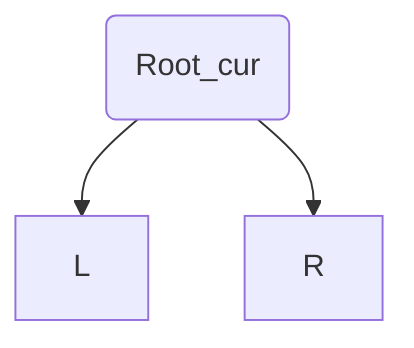

### 简介

#### 缘起

🤔想想本科CS教育大多都教的是什么?

- 算法: 在给你一个问题, 要你尽**快**算出解.
- 数据库: 给你一些数据, 要你**快**速储存查找.
- 分布式算法/GPU编程: 一个CPU不够用, 给你更快的硬件(集群或者GPU), 要你更**快**算出解
- 人工智能课: 写出指数增长的搜索算法, 然后再用剪枝, 学习等方法**加速**.
- 体系结构课: 是在用电路门造出更**快**的CPU.  

为什么我们一个劲去优化机器, 程序员难道不重要吗? 随着代码规模的增大, 重构, 调试, 测试, API设计变得越来越复杂. 于是人们提出了函数式编程. 函数式编程不关心代码的逻辑执行速度(复杂度). 程序员只负责将问题描述给计算机, 而速度优化则一口气交给计算机处理.

⚠️**注意**: Haskell并没有在工业界流行. 这意味着你很难将Haskell应用于大型项目(虽然Haskell具有这样的能力)

#### 什么是Haskell/函数式编程

🔡Haskell是一门纯粹函数式编程语言

**🏎函数式与命令式编程对比**

- 🏃‍♂️执行操作:

  - 命令式编程: 给计算机一系列指令, 计算机根据指令执行变量状态变化. 最后得到结果
  - 函数式编程: 告诉计算机我们需要解决什么样的问题

  例如: 获取字符串$s$中的大写字母

  - 命令式编程: 遍历$s$ - 如果字符$c$满足$'A' \leq c \leq 'Z'$ - 将$c$放入数组$res$ - 返回$res$
  - 函数式编程: 我要获得一个字符串 - 这个字符串中的字符来自$s$ - 只有大写字母满足要求 - 大写字母指的是${'A', 'B',...,'Z'}$

  不难发现, 我们可以很难将命令式编程中的语句转化为数学函数(比如遍历的`for`就无法转换为函数), 但是可以很轻易的将函数式编程语句的内容转化为数学表达式
  $$
  f(s) = \{x|x \in s , x \in Caps\} \ \ \  where\ Caps = \{'A', 'B',...,'Z'\}
  $$
  他的Haskell表达式也很数学化(暂时看不懂也没有大碍)

  ```haskell
  f s = [x|x<-s, x `elem` ['A'..'Z']]
  ```

  回头想想, 我们经常把命令式编程语句中的`function`称作"函数". 但是这些"函数"内部却总是有数学函数无法实现的内容(例如循环, 变量重复赋值). 所幸函数式编程解决了这个问题

- 🙅变量与常量

  - 命令式编程: 常量一旦声明就无法变化, 而变量可以随时重新赋值
  - 函数式编程: 变量一旦被指定, 就不可以更改了. 函数能做的唯一事情就是利用引数计算结果(毕竟数学函数中可没有重复赋值的操作, 但数学中可到处都是复合函数)

- 💊副作用(side effect, 即改变非函数内部的状态)

  - 命令式编程: 函数可能存在副作用(修改外部变量值)
  - 函数式编程: 无副作用, 且函数式编程中的函数是纯函数(即: 以同样的参数调用同一个函数两次, 得到的结果一定是相同)

- ⏱惰性求值

  - 命令式编程: 除非使用特殊数据结构, 默认非惰性求值, 例如在JS中写下

    ```js
    [1,2,3].map(d=>d+1).map(d=>d/2);
    ```

    解释器会对数组遍历两次

  - 函数式编程: 默认惰性求值, 例如在Haskell中写下

    ```haskell
    map (/2) (map (+1) [1,2,3])
    ```

    数组只会遍历一次, 即每一个元素都调用函数两次, 最后得到结果. 好像有点问题: 如果我想定义一个`cnt`, 并让`cnt`在每次执行加法/乘法的时候`+1`, 最后加`cnt`到结果上呢? 即

    ```js
    let t = [1,2,3];
    let cnt = 0;
    for(let i=0; i<t.length;i++){
        t[i]+=1;cnt++;
        t[i]/=2;cnt++;
        t[i]+=cnt;
    }
    ```

    Haskell的惰性求值似乎会让这样的函数无法实现? 但是还记得副作用吗, Haskell中的函数都是纯函数, 纯函数的执行不能对外部产生副作用. 也正是因为函数都是纯函数, 所以惰性求值时候将元素经常连续变化并不会造成结果存在差异.

    惰性求值的另一个好处是我们可以处理一个无限数组例如: 获取前10个奇数

    ```haskell
    [1..]           -- 获取一个[1,2,3...]的无限数组
    filter (odd) [1..]    -- 过滤出所有奇数 [1,3,5..]
    take 10 filter (odd) [1..]   -- 取前10项
    ```

**🚫Haskell是静态强类型语言**

- 静态类型意味着我们需要在运行前明确指出变量的类型, 同时Haskell支持类型推导, 这意味着我们不必告诉Haskell每一个变量的类型(例如Haskell会自动推断`a = 1+1`的`a`是数值, 同时由于Haskell不可重复赋值, a的类型不会再有变化)
- 强类型意味着Haskell不会自动进行类型转换(除了部分语法糖)

#### 环境配置

🛠最方便的方法就是使用`Haskell Platform`, 此程序包包含

- [GHC](https://www.haskell.org/ghc/): Haskell编译器
- [cabal-install](https://cabal.readthedocs.io/): 包管理器
- [stack](https://docs.haskellstack.org/): 跨平台开发工具
- [haskell-language-server](https://github.com/haskell/haskell-language-server): 语言支持

对于`archlinux`, 由于GHC采用动态链接, 需要增加几个软件

```bash
pacman -S ghc cabal-install stack haskell-language-server happy alex haskell-haddock-library
```

对于VSCode用户

- [Haskell Extension Pack](https://marketplace.visualstudio.com/items?itemName=mogeko.haskell-extension-pack)
- [Simple GHC (Haskell) Integration](https://marketplace.visualstudio.com/items?itemName=dramforever.vscode-ghc-simple)
- [Haskell GHCi Debug Adapter Phoityne](https://marketplace.visualstudio.com/items?itemName=phoityne.phoityne-vscode)

GHC在编译Haskell文件(`.hs`文件)的同时提供了交互模式(类似Node, Python, 虽然他是编译型语言(这里应该感谢纯函数的特性)), 只需要终端输入`ghci`即可进入交互模式. 在交互模式中

```haskell
:l xx.hs    -- 可以加载xx.hs文件, 其中.hs可以省略
:r          -- 刷新已经加载的文件
```

### 基础语法

#### 运算符

- 数学运算: `2 + 15`, `49 * 100`, `1892 - 1472`, `5 / 2`, `50 * (100 - 4999)`

  注意: `5 * -3`会报错, 因为**在Haskell中函数是一等公民**, 而`*`本身就是一个二元函数. Haskell会将表达式解析为`( 5 * - ) 3`, 所以应该改为`5 * (-3)`

- Boolean运算: `True`, `False`(必须大写), `&&`, `||`, `not`, `==`, `/=`(即`!=`)

数学运算与Boolean运算都不支持默认类型转换(整数支持默认转换为小数)

#### 函数调用

- 函数调用: 调用方法为`函数名 参数1 参数2...`, 看起来很怪, 没有`()`, 也没有`,`分隔. 例如

  ```haskell
  succ 8                 -- 获取8的后继, 即9
  min 9 10               -- 8,9最小值
  max 9 10               -- 8,9最大值
  succ 9 + max 5 4 + 1   -- 函数调用具有最高优先级, 即(succ 9) + (max 5 4) + 1
  ```

- 中缀函数: 对于二元函数, 我们可以将`f x y`写成``x `f` y``, 注意, 这里的`` ` ``, 是必须的. 例如

  ```haskell
  2 `min` 4    -- 即 min 2 4
  1 `elem` [2,3,1] -- 即elem 1 [2,3,1], 其中elem x xs返回x是否在xs中 
  ```

- 函数调用是自左向右的

#### 函数编写

- 函数定义与数学中的函数表达式很类似, 例如

  - 需要定义表达式$doubleMe(x) = x+x$, 只需要

      ```haskell
      doubleMe x = x+x
      ```

  - 需要定义表达式$doubleUs(x,y) = x+x+y+y$, 只需要

      ```haskell
      doubleUs x y = x+x+y+y
      ```

      当然, 也可以调用函数

      ```haskell
      doubleUs x y = doubleMe x + doubleMe y
      ```

- 变量就是常函数(因为变量不可修改值, 所以, 可以像构建常函数一样构建变量)

  ```haskell
  testValue = 12
  ```

- 无需关心**函数之间**的位置, 例如

  ```haskell
  doubleUs x y = doubleMe x + doubleMe y
  doubleMe x = x + x
  demoRes = demoUs 1 2
  ```

  并不会报错

- 条件语句If: `if-then-else`结构, 例如

  ```haskell
  doubleSmallNumber x = if x > 100
                        then x
                        else  x*2
  ```

  支持压行书写

- 使用`_`表示我们不关系这个变量取值, 例如定义函数
  $$
  f(x,y,z) = x\\
  g(x,y,z) = y\\
  g(x,y,z) = z
  $$
  Haskell表示就是

  ```haskell
  f x _ _ = x
  g _ y _ = y
  h _ _ z = z
  ```

  这和JS中`_`表示不关心变量不一样, 这个甚至可以重名
  
- 在Haskell中使用`'`表示类似, 但是不同的函数, 比如我们想使用两种方式实现$Fibonacci$

  ```haskell
  fib n = if n<=2 then n else fib (n-1) + fib (n-2)
  ```

  忽然我们又想实现一个$Fibonacci$

  ```haskell
  fib' n = if n<=3 then n else fib (n-1) + fib (n-2)
  ```

  这只是一种命名习惯, 不强制, 也没有其他效果

#### List类型基础

📜这里的List和JS/Python的数组类似, 我喜欢把他作为**可重复无序集合**使用.

- 声明一个List很简单

    ```haskell
    t = [1,2,3]
    ```

    ⚠️List中的元素类型必须相同

- 字符串实际上是字符List的语法糖

    ```haskell
    "231" == ['2','3','1']  -- True
    ```

- 可以使用`++`运算合并List, 例如

    ```haskell
    t = [1,2,3] ++ [4,5,6]   -- [1,2,3,4,5,6]
    ```

    ⚠️其实现原理是遍历`++`前的数组并合并到后者, 所以这是一个低效运算子

- 可以使用`:`运算符将元素加入List头部, 例如

    ```haskell
    t = 1:[2,3,4]    -- [1,2,3,4]
    ```

    支持链式调用, 例如

    ```haskell
    t = 1:2:3:[4,5,6]   -- [1,2,3,4,5,6]
    ```

- 可以使用`!!`取List的某一位

    ```haskell
    t = [1,2,3,4,5,6] !! 2   -- 3
    ```

    ⚠️越界访问会报错

- 取值方法

  - `head List`返回**首个**元素: `head [1,2,3]`为`1`
  - `tail List`返回**非首个**元素们: `tail [1,2,3]`为`[2,3]`
  - `last List`返回**最后一个**元素: `last [1,2,3]`为`3`
  - `init List`返回**非最后一个**元素: `init [1,2,3]`为`[1,2]`

    ⚠️对空数组执行均会报错

- 其他方法

  - `length List`返回数组长度: `length [1,2,3]`为`3`
  - `null List`返回是否为空: `null [1,2,3]` 为 `False`
  - `reverse List`反转数组: `reverse [1,2,3]`为`[3,2,1]`, 并不会反转原数组(因为纯函数)
  - `take n List`返回前`n`的元素, 越界部分不返回, `n==0`返回`[]`

    ```haskell
    take 2  [1,2,3,4]  -- [1,2]
    take 10 [1,2,3,4]  -- [1,2,3,4] 
    take 0  [1,2,3,4]  -- [] 
    take -1 [1,2,3,4]  -- Error!
    ```

  - `drop`与`take`类似, 作用为删除前`n`个元素

  - `maximum List`返回最大值: `maximum [1,9,2,3,4]`为`9`

  - `maximum List`返回最大值: `minimum [8,4,2,1,5,6]`为`1`

  - `sum List`返回和: `sum [8,4,2,1,5,6]`为`26`

  - `product List`返回积: `product [8,4,2,1,5,6]`为`1920`

- `elem ele List`判断`ele`是否在`List`中: ``4 `elem` [3,4,5,6]``为`True`

#### List的Range

📜类似于Python的Range, 但是更加智能

```haskell
t = [1..5]   -- [1,2,3,4,5]
t = ['a'..'f']  -- ['a','b','c','d','e','f']
-- 默认Step为1, 自定义时需要列前两项
t = [1,1.2..2]  --  [1.0,1.2,1.4,1.5999999999999999,1.7999999999999998,1.9999999999999998]
-- 但是精度堪忧, 建议使用其他方法(后面会提到)
t = [1..]   -- [1,2,3..]定义无限长List
t = [1,3..]   -- [1,3,5,7..]
```

`repeat n`返回无限个`n`组成的List(等价于`[n,n..]`)

```haskell
t = repeat 5   -- [5,5,5,5...]
```

一般搭配`take`使用

#### List的Comprehension

🔰非常类似于集合的定义(这也是我把List当无序可重集合的原因)

对于一个集合
$$
S = \{ 2x | x \in \mathbb N , \sqrt{x} \in \{1,..,100\} \}
$$
首先他是一个List, 所以应该包着`[]`, 之后有一个竖线分隔符, 左边是输出函数(集合中的代表元素), 右边是约束, 例如`[x|条件]`, 条件中$\in$使用`<-`表示, 那么刚刚集合就可以表示为``t = [ 2*x | x <- [1..100], (sqrt x) `elem` [1..100]]``

还可以结合之前的函数与`if`语句, 例如:

定义`List`它能够使`List`中所有大于 10 的奇数变为 `"BANG"`，小于 10 的奇数变为 `"BOOM"`，其他则统统扔掉

```haskell
boomBangs xs = [ if x < 10 then "BOOM!" else "BANG!" | x <- xs, odd x]
```

同时支持同多List中取元素

```haskell
[ x*y | x <- [2,5,10], y <- [8,10,11]]  --[16,20,22,40,50,55,80,100,110]
```

🤔**使用comprehension的时候注意思考方式**: 我需要的List是什么样子的, 而不是List是怎么算出来的

#### Tuple类型基础

📜这里的Tuple和Python的元组类似. 与List不同的就是: Tuple是定长的, 其中可以为任意不同数据类型(例如`('a',1)`)

⚠️Tuple也是有类型的, 这意味着若List中有Tuple, 那么所有的Tuple类型应该相同(每个Tuple的长度相同, 每一个位置的类型相同), 即

```haskell
[(1,2,3), (4,5,6)]   -- 👍
[(1,2,3), (4,5,True)]  -- 💩
[(1,2,3), (4,5)]   -- 💩
[(1,2), (4,5.0)]          -- 👍 同时你将获得[(1,2.0), (4,5.0)]
```

**方法:**

- `fst Tuple`获取**二元**Tuple的第一个元素, 不可用于其他长度Tuple!

- `snd Tuple`获取**二元**Tuple的第二个元素, 不可用于其他长度Tuple!

- `zip List List`获取一个交叉配对的Tuple List

  ```haskell
  zip [1,2,3,4,5] [5,5,5,5,5]
  -- [(1,5),(2,5),(3,5),(4,5),(5,5)]
  zip [1 .. 5] ["one", "two", "three", "four", "five"]
  -- [(1,"one"),(2,"two"),(3,"three"),(4,"four"),(5,"five")]
  ```

  这个`zip`函数确实很形象啊😂, 同时若两个List长度不一样的, 则舍弃长出的部分(拉拉链的时候要是两边不一样长也只能拉到较短的位置), 这种特性与惰性求值组合后`zip`就可以处理无限数组了

  ```haskell
  zip "Karry" [1..]
  -- [('K',1),('a',2),('r',3),('r',4),('y',5)]
  ```

- `zipWi1th f List List`: 与`zip`类似, 将每次取得的两个元素调用`f`并返回

  ```haskell
  add x y = x + y
  zipWith add [1 .. 10] [1 .. 10]
  -- [2,4,6,8,10,12,14,16,18,20]
  ```

**😆有趣的例子**: 还是要注意思考方式

- 所有三边长度皆为整数且小于等于 10，周长为 24 的三角形

  ```haskell
  triangles = [ (a,b,c) | c <- [1..10], b <- [1..10], a <- [1..10], a+b>c, a+c>b, b+c>a]
  ```

- 三边都小于等于 10 的直角三角形(三边按顺序输出)

  ```haskell
  triangles' = [ (a,b,c) | c <- [1..10], b <- [1..c], a <- [1..b], a^2 + b^2 == c^2]
  ```

- 周长为24, 三边都小于等于 10 的直角三角形

  ```haskell
  triangles'' = [ (a,b,c) | c <- [1..10], b <- [1..c], a <- [1..b], a^2 + b^2 == c^2, a+b+c == 24]
  ```

### 类型与类型类

#### 类型(Types)

Haskell是静态类型语言且支持类型推导. 但Haskell不支持隐式类型转换(除了Int->Float)

可以在`ghci`中使用`:t 表达式`的方式获取类型

```haskell
:t 'a'     -- 'a'::Char
:t True    -- True::Bool
:t "HELLO!"   -- "HELLO"::String
:t max    -- max :: Ord a => a -> a -> a
:t [1,2,3]   -- [1,2,3] :: Num a => [a]
:t 12.3    -- 12.3 :: Fractional p => p
:t (True, 1)  -- (True, 1) :: Num b => (Bool, b)
:t (==)    -- (==) :: Eq a => a -> a -> Bool
```

🙄常见的类型有

- `Int`: 表示$-2^{31} \sim 2^{31}-1$的整数
- `Integer`: 表示整数, 无界
- `Float`: 单精度浮点数
- `Double`: 双精度浮点型
- `Bool`: 布尔型, 取值为`True`与`False`
- `Char`: 字符型, `String = [Char]`表示字符串

🙄类型表示时的术语

- 使用大写字母开头表示类型

- `::`表示"类型为", 例如: "HELLO"的类型为String

- `[a]`表示`a`类型的数组

- 对于函数, 将参数与返回值类型依次使用`->`连接即可,  例如

  - `a->b`表示这是一个函数, 接受一个`a`类型的参数, 返回一个`b`类型变量

  - `a->b->c->d`表示这是一个函数, 按顺序接受`a`,`b`, `c`类型变量, 返回`d`类型变量

  将参数与返回值类型简单粗暴的连接在一起看起来有点"欠考虑", 实际上, 这样的模式在函数式编程中十分符合直觉

  当函数可以接受多种类型的参数并返回不同类型的类型时, 我们一般采用`a`, `b`, `c`...表示某一种类型, 这与命令式语言中的**多态**类似, 例如`reverse`函数: `[a] -> [a]`

- 运算符也是一个函数, 例如`==`类型就是一个`a->a->Bool`, 不过在进行类型判断应该使用括号将运算符括起来, 如`:t (==)`

- Tuple的类型是每一项的类型组成的Tuple

- 至今没有解决的`=>`表示什么, 这需要类型类的知识

#### 类型变量(Type variables)与类型类(Type variables)

🎁前面提到, 我们可以通过使用`a`, `b`等变量表示任意类型, 例如`sum`函数表示`[a]->a`, 此时的`a`就是**类型变量**, 例如

- `fst`函数: `[a] -> a`
- `length`函数: `[a] -> Int`
- `div`函数: `a -> a -> a`

此时, `div`函数似乎有点问题, 我们只用`a`代表了某一种类型, 但是`Char`类型能除吗? 我们应该将类型变量限定到一定类型范围, 例如`div`函数的`a`应该是一个可计算类型, 用`:t`检查`div`函数

```haskell
ghci> :t div
div :: (Integral a) => a -> a -> a
```

这里的`(Integral a)`用来描述`a`这个类型是一个`Integral`类型类(括号表示省略). 注意描述: **类型变量`a`是一个`Intergral`类型类的类型变量**, 在描述结束时候使用`=>`链接类型声明

🪆有点套娃的意思了. 将这些术语与命令式编程对应一下.

- 函数的参数与返回值可能是多种类型的(**对应多态**)

- 于是我们将每种类型用不同的类型变量表示(**对应模板, 用类型变量代表某一个类**)

- 为了约束类型变量, 我们提出了类型类. 那什么样的类属于某个类型类呢?

  **完成了类型类中定义的成员与方法的类**都可以属于类型类(**对应接口**).

🌰看几个常见的例子

- `Eq`类型类表示可以表示相等的类型类. `Eq`类型类要求实现`==`函数以用于判断.

  例如`:t (==)`类型为`(==) :: Eq a => a -> a -> Bool`

- `Ord`类型类表示可以比较类型类, `Ord`类型类要求实现`<`, `>`, `<=`, `>=`函数.

  `:t min`类型为`min :: Ord a => a -> a -> a`

- `Show`类型类表示可以转换为字符串的类型类, `Show`类要求实现`show`函数用于转换为字符串

  例如: `:t show`类型为`show :: Show a => a -> String`

  例如: `show 123`表示`"123"`, `show [1,2,3]`表示`"[1,2,3]"`

- `Read`类型与`Show`类型相反. `read`函数可以将字符串转换为`Read`类型类的成员

  例如: `:t read`类型为`read :: Read a => String -> a`

  但是: 将`String`转换为`Read`类型类中哪个类型呢, 比如"True"应该转换为字符串还是布尔呢

  - 可以使用Haskell自带的类型推导: `read "123" + 1`得到`124`
  - 可以使用Haskell类型声明手动指定: `read "123" :: Float`得到`123.0`

- `Enum`类型类的成员都是可枚举的. 其成员实现了`succ`(后继子)与`pred`(前继子)方法. `Bool`, `Char`, `Ordering`, `Int`, `Integer`, `Float`, `Double`类型都术语该类型类

  例如: `:t succ`类型为`succ :: Enum a => a -> a`

- `Bounded`类型类的成员都有上限与下限

  - `:t minBound`类型为`minBound :: Bounded a => a`, 例如: `minBound :: Int`为`-9223372036854775808`
  - `:t maxBound`类型为`maxBound :: Bounded a => a`

- `Num`为数字类型类

- `Integral`: 表示整数, 包含`Int` 和 `Integer`

  当我们想显式将`Integral`转化为`Num`时, 可以使用`fromIntegral`函数

  ⚠️`Integer`与`Integral`区别

- `Floating`: 表示浮点数, 包含`Float` 和 `Double`

⚠️如果一个类型属于多个类型类可以这样写

### 函数

Haskell有一套独特的函数语法

#### 模式匹配(Pattern matching)

模式匹配通过检查数据的特定结构来检查其是否匹配，并按模式从中取得数据. 这在函数定义中很常用

👂听起来和字符串正则匹配很像. 在定义函数时可以这样写

```haskell
lucky :: (Integral a) => a -> String  
lucky 7 = "LUCKY NUMBER SEVEN!"  
lucky x = "Sorry, you're out of luck, pal!"
```

在调用 `lucky` 时, 模式会从**上至下进行检查, 一旦有匹配, 那对应的函数体就被应用了**. 这个模式中的唯一匹配是参数为`7`，如果不是`7`，就转到下一个模式，它匹配一切数值并将其绑定为 `x` . 若是自上而下检查所有模式都没有命中, Haskell会报错. 所以在使用模式匹配的时候务必要考虑**边界条件与特殊值**(这与你在数学表达式中考虑边界值一样重要)

一个实现阶乘的例子

```haskell
factorial :: (Integral a) => a -> a  
factorial 0 = 1  
factorial n = n * factorial (n - 1)
```

🤔看起来模式匹配只是用于类似数学中递归定义的一个语法糖?(简化了`switch-case`)

👻并不是, 模式匹配还有高级用法(我更喜欢把他理解为JS正则中`if(regExp.test()){args = regExp.exec()}`的语法糖或者是`Object`结构赋值的语法糖)

- 实现一个二维向量相加

    ```haskell
    addVectors :: (Num a) => (a, a) -> (a, a) -> (a, a)  
    addVectors a b = (fst a + fst b, snd a + snd b)
    ```

    用模式匹配写后

    ```haskell
    addVectors :: (Num a) => (a, a) -> (a, a) -> (a, a)  
    addVectors (x1, y1) (x2, y2) = (x1 + x2, y1 + y2)
    ```

    在定义函数的时候我就将参数与传入值进行了匹配

- 实现一个`List`的`reverse`(注意实现思路与模式匹配的应用)

    ```haskell
    reverse' :: [a] -> [a]
    reverse' (x : xs) = reverse' xs ++ [x]
    reverse' [] = []
    ```

  - `x : xs`: 表示匹配一个List, 将这个List的第一个元素设置为`x`, 剩下的设置为`xs`

      例如: 使用其匹配的时候`[1,2,3]`就会匹配为`1:[2,3]`, 于是`x = 1, xs = [2,3]`

      ⚠️使用这样的方式匹配数组时需要加上括号表示他们是一体的

  - `reverse`函数是什么呢? 就是把数组的第一个元素放到最后, 在前面加上反转后的剩下的元素

  - 什么时候会匹配失败呢? 当参数是空数组的时候就取不出来头, 于是设置一个边界值

- 实现一个`List`的`head`函数

    ```haskell
    head' :: [a] -> a
    head' (x:_) = x
    head' [] = error "empty list"
    ```

    我们并不关心模式匹配时首元素后面的元素, 那么可以用`_`代替

- 实现一个快速排序

    ```haskell
    qsort :: (Ord a) => [a] -> [a]
    qsort (target:xs) = [x|x<-xs, x<=target] ++ [target] ++ [x|x<-xs, x>target]
    qsort [] = []
    ```

    这是一个经典的例子, 快速排序是什么, 就是随便这一个元素, 把比他小的排序后放在左边, 比他大的排序后放在右边

- 还可以在匹配时使用`@`语法保留对整体的引用

    ```haskell
    capital :: String -> String  
    capital "" = "Empty string, whoops!"  
    capital all@(x:xs) = "The first letter of " ++ all ++ " is " ++ [x]
    ```

#### Guards(守卫)

💂🏽`guard`用来检查一个值的某项属性是否为真. 听起来和路由守卫一样, 如果条件判断通过就放行. 例如计算BMI函数:

```haskell
bmiTell :: (RealFloat a) => a -> String  
bmiTell bmi         -- 注意这里没有等号
    | bmi <= 18.5 = "underweight"      -- 等号在这里
    | bmi <= 25.0 = "Pffft"                -- 与if-else一样只会匹配第一个通过的
    | bmi <= 30.0 = "fat"  
    | otherwise   = "whale"      -- 最后可以使用otherwise兜底
```

👀看起来是个语法糖: `|`和`if-else-if`一样, `otherwise`和兜底`else`一样, 但是用在此处相当简洁.

⚠️如果使用`Guard`且没有使用`otherwise`且全部匹配失败, Haskell会匹配下一个函数, 例如:

```haskell
f :: (Ord a, Num a) => a -> [a]
f x
  | x < 0 = error "make sure x >= 0"
  | x == 0 = [0]
f x = x : f (x - 1)
```

如果`x>0`, `f x`会先进入第一个函数, 两个`guard`都匹配失败了, 于是进入下一个模式匹配

#### Where绑定

改进一下BMI, 要求用户输入身高与体重👇

```haskell
bmiTell :: (RealFloat a) => a -> a -> String  
bmiTell weight height  
    | weight / height ^ 2 <= 18.5 = "underweight"  
    | weight / height ^ 2 <= 25.0 = "Pffft"  
    | weight / height ^ 2 <= 30.0 = "fat"  
    | otherwise                   = "whale"
```

与命令式语言一样, 我们想把`weight / height ^ 2`定义成变量, 可以使用`where`关键字

```haskell
bmiTell :: (RealFloat a) => a -> a -> String  
bmiTell weight height  
    | bmi <= 18.5 = "underweight"  
    | bmi <= 25.0 = "Pffft"  
    | bmi <= 30.0 = "fat"  
    | otherwise   = "whale"
    where bmi = weight / height ^ 2
```

就像写数学公式一样
$$
\begin{equation}
f(h,w) = \left\{ \\
\begin{aligned}
&\text{underweight} & BMI\leq 18.5 \\
&\text{Pffft} & 18.5< BMI\leq 25 \\
&\text{fat} & 25< BMI\leq 30 \\
&\text{whale} & 30< BMI
\end{aligned}
\right.
\ \ \ where\ BMI = w/h^2
\end{equation}
$$
`where`后面可以跟多个名字和函数定义

```haskell
bmiTell :: (RealFloat a) => a -> a -> String  
bmiTell weight height  
    | bmi <= skinny = "You're underweight, you emo, you!"  
    | bmi <= normal = "You're supposedly normal. Pffft, I bet you're ugly!"  
    | bmi <= fat    = "You're fat! Lose some weight, fatty!"  
    | otherwise     = "You're a whale, congratulations!"  
    where bmi = weight / height ^ 2  
          skinny = 18.5  
          normal = 25.0  
          fat = 30.0
```

⚠️注意

- `where` 绑定中定义的名字只对本函数可见, 其中的名字都是一列垂直排开

- `where` 绑定也可以使用模式匹配, 前面那段代码可以改成：

    ```haskell
    where bmi = weight / height ^ 2  
          (skinny, normal, fat) = (18.5, 25.0, 30.0)
    ```

- `where`可以嵌套使用

#### Let绑定

与`where`类似, 作用域不同. `where`绑定在函数底部, 在**所有`guard`内**可见, 但`let`只对`let-in`绑定的`in`**表达式**可见, 例如

```haskell
cylinder :: (RealFloat a) => a -> a -> a  
cylinder r h = 
    let sideArea = 2 * pi * r * h  
        topArea = pi * r ^2  
    in  sideArea + 2 * topArea
```

#### Case表达式

与命令式编程的`case`类似, 同样支持模式匹配

```haskell
case expression of pattern -> result  
                   pattern -> result  
                   pattern -> result  
                   ...
```

例如

```haskell
describeList :: [a] -> String  
describeList xs = "The list is " ++ case xs of [] -> "empty."  
                                               [x] -> "a singleton list."   
                                               xs -> "a longer list."
```

#### 将函数定义为中缀函数

不使用反引号也可以定义中缀函数. 但是, 函数名只能使用`:|!@#$%^&*-+./<>?\~`, 之后可以使用下面任意方式定义

```haskell
a |+| b   = method1
(|+|) a b = method1 a b 
(|+|)     = method1
```

#### 定义函数的结合性与优先级

例如

```haskell
infixr 9 op
```

- `infi*`定义结合性  
  `infixr`是右结合, `infixl`是左结合, `infix`无左右优先性.
- 数字定义优先级  
  优先级一共有十个, `0-9`, 数字越大越高, 如果定义时省略了数字, 则默认为9. 预定义的有

| 值  | 左结合    | 无结合                           | 右结合     |
| --- | --------- | -------------------------------- | ---------- |
| 9   | !!        |                                  | .          |
| 8   |           |                                  | ^, ^^, **  |
| 7   | *,/,`div` |                                  |            |
| 6   | +, -      |                                  |            |
| 5   |           |                                  | :, ++      |
| 4   |           | ==,/=,<,<=,>,>=,`elem`,`notElem` |            |
| 3   |           |                                  | &&         |
| 2   |           |                                  |            |
| 1   | >>, >>=   |                                  |            |
| 0   |           |                                  | $,$!,`seq` |

### 递归

🪆使用模式匹配与递归可以优雅的实现递归. 在实现递归时最需要关注的就是**边界条件**. **而递归的的实现思路就是描述问题是如何定义的**

- 实现`List`的`max`函数

  命令式思路: 设一个变量来存储当前的最大值，然后用循环遍历该 `List`，若存在比这个值更大的元素，则修改变量为这一元素的值

  函数式思路: `List`的最大值就是`head`和`tail`最大值的最大值. 空`List`的最大值为Error

  ```haskell
  maximum' :: (Ord a) => [a] -> a  
  maximum' [] = error "maximum of empty list"  
  maximum' [x] = x  
  maximum' (x:xs)   
      | x > maxTail = x  
      | otherwise = maxTail  
      where maxTail = maximum' xs
  ```

- 实现`replicate n x`函数(将`x`重复`n`次)

  ```haskell
  replicate' :: (Num i, Ord i) => i -> a -> [a]  
  replicate' n x  
      | n <= 0    = []  
      | otherwise = x:replicate' (n-1) x
  ```

  ⚠️这里使用`Guard`而不是模式匹配是因为模式匹配无法匹配`<0`

- 实现`take`函数

  ```haskell
  take' :: (Num i, Ord i) => i -> [a] -> [a]  
  take' 0 _ = []
  take' _ [] = []
  take' n (x:xs) = x : take' (n-1) xs
  ```

  更加周全的的代码(同样因为我们要匹配`n<0`的情况, 所以不能用模式匹配了)

  ```haskell
  take' :: (Num i, Ord i) => i -> [a] -> [a]  
  take' n _  
      | n <= 0   = []  
  take' _ []     = []  
  take' n (x:xs) = x : take' (n-1) xs
  ```

- 实现`repeat`函数

  ```haskell
  repeat' :: a -> [a]  
  repeat' x = x:repeat' x
  ```

- 实现`zip`函数

  ```haskell
  zip' :: [a] -> [b] -> [(a, b)]
  zip' [] _ = []
  zip' _ [] = []
  zip' (x1:xs1) (x2:xs2) = (x1,x2):zip' xs1 xs2
  ```

- 实现`elem`函数

  ```haskell
  elem' :: (Eq a) => a -> [a] -> Bool
  elem' e [] = False
  elem' e (x : xs) = (e == x) || elem' e xs
  ```

  但是有点不函数式, 改一改

  ```haskell
  elem' :: (Eq a) => a -> [a] -> Bool
  elem' e (x : xs)
    | e == x = True
    | otherwise = elem' e xs
  elem' e _ = False
  ```

- 温习一下快速排序(并使用`where`让其看起来更像函数式)

  ```haskell
  qsort :: (Ord a) => [a] -> [a]
  qsort (target:xs) = lowers ++ [target] ++ uppers 
    where lowers = qsort [x|x<-xs, x<=target]
          uppers = qsort [x|x<-xs, x>target]
  qsort _ = []
  ```

⚠️思路: 定义边界条件, 再定义个函数, 让它从一堆元素中取一个并做点事情后, 把余下的元素重新交给这个函数

- 实现埃筛

  ```haskell
  primes = filterPrime [2..]
    where filterPrime (p:xs) =
            p : filterPrime [x | x <- xs, x `mod` p /= 0]
  ```

  这种生成器生成+验证器验证的模式值得学习  
- 实现斐波那契

  ```haskell
  fib :: Int -> [Int]
  fib n = take n $ fibList [1, 1]
    where
      fibList [a, b] = a : fibList [b, a + b]
  ```

  注意学习如何存储递归中需要的调用值
  
### 函数Pro

😕函数式编程与数学表达式看起来太像了.

👼于是我天真的以为函数式编程就是用数学的方式描述问题, 然后将其表示为函数式编程语句.

🤔实际上函数式编程更加注重**将函数作为"一等公民", 从而操作函数或是函数的一部分解决问题**

#### 函数柯里化与不全调用

在JS中经常能听到这个函数柯里化这个词语, 在JS中, 柯里化就是把多参函数变成单参函数, 并返回一个单参数函数用于吃下下一个参数.

🍬但是, Haskell中所有函数都只有一个参数, 所有函数都是柯里化函数. 而多参函数只是一个语法糖!

😱拿`max`函数举例. `max`函数实际上只接受一个参数`x`, 然后返回一个和`x`比较大小的函数,例如

```haskell
comp x y = x y  -- 接受x,y 返回x y的结果
maxWith5 = max 5     -- 返回一个max 5函数
res = zipWith comp (repeat maxWith5) [1 .. 10]
-- [5,5,5,5,5,6,7,8,9,10]
```

也就是说`maxWith5`就是一个函数, 函数接受一个参数, 返回和`5`比较大的那个, 也就是我们之前写的`max 5 6`可以写成`(max 5) 6`

再看看`maxWith5`, 试试写出他的类型:`Ord a => a -> a`. 显而易见, 接受一个`Ord`类型类的`a`类变量, 返回一个`a`类变量. 而之前那个`max`函数呢? 收到一个`a`类变量, 返回一个`Ord a => a -> a`类函数. 试试写出`max`函数类型: `Ord a => a -> (a->a)`这个括号没啥用(因为Haskell是自左向右解析的)于是简化成`Ord a => a -> a -> a`这也就解释了**为什么把参数类型与结果用`->`连在一起是符合直觉的**

⚛像`max 5`这样的函数调用就是**不全调用**, 而中缀函数也存在不全调用, 例如`elem [1..]`, `==4`, `*5`

#### 高阶函数

🌌高阶函数: 接收函数作为参数或返回函数的函数就是高阶函数, 例如

```haskell
applyTwice :: (a -> a) -> a -> a  
applyTwice f x = f (f x)
```

这个类型似乎有点特别, 多了一个括号, 表示第一个参数是一个函数而不是类型`a`(因为Haskell是右结合的)

结合函数柯里化与不全调用, 我们可以写出这样的表达式

```haskell
applyTwice (+3) 10         -- 16 (调用函数子  😲
applyTwice (++ " HAHA") "HEY"  --"HEY HAHA HAHA"  
applyTwice ("HAHA " ++) "HEY"    -- "HAHA HAHA HEY"  
ghci> applyTwice (multThree 2 2) 9  -- 144  
ghci> applyTwice (3:) [1]           -- [3,3,1]
```

结合函数子可以实现多种炫酷的操作. 这就是把函数当成对象用

实现一个`zipWith`, 体验一下无参数的不全调用

```haskell
zipWith' :: (a -> b -> c) -> [a] -> [b] -> [c]
zipWith' f (x : xs) (y : ys) = f x y : zipWith' f xs ys

zipWith' (+) [4,2,5,6] [2,6,2,3]         --[6,8,7,9]  
zipWith' max [6,3,2,1] [7,3,1,5]         -- [7,3,2,5]  
zipWith' (++) ["foo ", "bar ", "baz "] ["fighters", "hoppers", "aldrin"]    
-- ["foo fighters","bar hoppers","baz aldrin"]  
zipWith' (*) (replicate 5 2) [1..]       -- [2,4,6,8,10]  
zipWith' (zipWith' (*)) [[1,2,3],[3,5,6],[2,3,4]] [[3,2,2],[3,4,5],[5,4,3]]  
-- [[3,4,6],[9,20,30],[10,12,12]]
```

可以借助高阶函数实现命令式中的`for`、`while`、赋值、状态检测

`flip`是一个常用高阶函数, 实现功能很简单

```haskell
flip :: (a -> b -> c) -> b -> a -> c  
flip f y x = f x y
```

也就是传入一个二元函数, 传回一个接受参数相反的二元函数(**注意: 传回的是函数而不是函数的运行结果!**)

⚠️`flip`经常用来对库函数进行改进, 例如我需要函数

```haskell
pushFont :: [a]->a->[a]
pushFont xs x = x:xs
```

要是函数参数能反过来就好了, 于是我就可以写

```haskell
pushFont :: [a]->a->[a]
pushFont = flip (:)
```

不需要添加参数, 就算固执的添加上了参数, 函数只是变成这样

```haskell
pushFont :: [a]->a->[a]
pushFont x xs = flip (:) x xs
```

都是在最后调用函数, 那么加不加参数没关系. 记住: **我们定义的是函数, 而不是运算结果**

#### Lambda函数

与JS类型, 可以生成匿名函数, 通常在这个函数只是用一次的时候使用, 语法为`\参数1 参数2 -> 表达式`, 例如

```haskell
flip' :: (a -> b -> c) -> b -> a -> c  
flip' f x y = \x y -> f y x
```

尽管这与 `flip' f x y = f y x` 等价，它可以更明白地表示出它会产生一个新的函数

#### map&filter&fold&scan

这几个函数与JS的`Array.map`, `Array.filter`, `Array.reduce`很像, 所以十分重要

他们本身是List的方法, 但是在库函数加载的时候被自动引用了, 也就是类似于

```haskell
map = Array.map
```

- `map`

  ```haskell
  map :: (a -> b) -> [a] -> [b]  
  map _ [] = []  
  map f (x:xs) = f x : map f xs
  ```

  传入映射函数与`List`, 返回对每个元素映射后的结果

  ```haskell
  map (+3) [1,5,3,1,6]                    -- [4,8,6,4,9]  
  map (++ "!") ["BIFF", "BANG", "POW"]    -- ["BIFF!","BANG!","POW!"]  
  map (replicate 3) [3..6]               -- [[3,3,3],[4,4,4],[5,5,5],[6,6,6]]  
  map (map (^2)) [[1,2],[3,4,5,6],[7,8]]  -- [[1,4],[9,16,25,36],[49,64]]  
  map fst [(1,2),(3,5),(6,3),(2,6),(2,5)] -- [1,3,6,2,2]
  ```

  使用函数子作为函数调用就让`map`炫酷多了

  以上的所有代码都可以用 List Comprehension 来替代。`map (+3) [1,5,3,1,6]` 与 `[x+3 | x <- [1,5,3,1,6]` 完全等价.

- `filter`

  ```haskell
  filter :: (a -> Bool) -> [a] -> [a]  
  filter _ [] = []  
  filter p (x:xs)   
      | p x       = x : filter p xs  
      | otherwise = filter p xs
  ```

  传入判断函数, 传出符合要求的元素

  ```haskell
  filter (>3) [1,5,3,2,1,6,4,3,2,1]         -- [5,6,4]  
  filter (==3) [1,2,3,4,5]                  -- [3]  
  filter even [1..10]                       -- [2,4,6,8,10]  
  let notNull x = not (null x) in filter notNull [[1,2,3],[],[3,4,5],[2,2],[],[],[]]  
  -- [[1,2,3],[3,4,5],[2,2]]  
  filter (`elem` ['a'..'z']) "u LaUgH aT mE BeCaUsE I aM diFfeRent"  
  -- "uagameasadifeent"  
  filter (`elem` ['A'..'Z']) "i lauGh At You BecAuse u r aLL the Same"  
  -- "GAYBALLS"
  ```

  以上都可以用 `List Comprehension` 的限制条件来实现。并没有教条规定你必须在什么情况下用 `map` 和 `filter` 还是 `List Comprehension`. 如果有多个限制条件，只能连着套好几个 `filter` 或用 `&&` 等逻辑函数的组合之, 这时就不如 `List comprehension`

- `fold`系列函数有`foldl`, `foldlr`,`foldl1`, `foldlr1`

  ```haskell
  foldl' :: (b -> a -> b) -> b -> [a] -> b
  foldl' _ pre [] = pre
  foldl' f pre (tar : tails) = fold' f (f pre tar) tails
  ```

  与`reduce`类似, 参数有: 指定返回累加值函数, 累加初始值, 数组. 例如:

  实现数组求和

  ```haskell
  sum' :: (Num a) => [a] -> a  
  sum' = foldl (+) 0
  ```

  又省略参数了, 因为**我们定义的是函数, 而不是运算结果**

  实现`reverse`(看我是多蠢🙃)

  ```haskell
  reverse' :: [a] -> [a]
  reverse' xs = foldl (\acc x -> x:acc) [] xs
  ```

  首先`xs`是可以省略的(**我们定义的是函数, 而不是运算结果**)

  其次`\acc x -> x:acc`实际上就是`flip (:)`于是改成

  ```haskell
  reverse' :: [a] -> [a]
  reverse' = foldl (flip (:)) []
  ```

  `foldr`与`foldl`的区别就是前者是自右向左遍历, 例如

  ```haskell
  reverse' :: [a] -> [a]
  reverse' = foldr (:) []
  
  map' :: (a -> b) -> [a] -> [b]  
  map' f = foldr (\x acc -> f x : acc) []
  ```

  `foldl1` 与 `foldr1` 的行为与 `foldl` 和 `foldr` 相似，只是你无需明确提供初始值。他们假定 List 的首个(或末尾)元素作为起始值

  实现一些库函数

  ```haskell
  maximum' :: (Ord a) => [a] -> a  
  maximum' = foldr1 (\x acc -> if x > acc then x else acc)  
  product' :: (Num a) => [a] -> a  
  product' = foldr1 (*)  
  
  filter' :: (a -> Bool) -> [a] -> [a]  
  filter' p = foldr (\x acc -> if p x then x : acc else acc) []  
  
  head' :: [a] -> a  
  head' = foldr1 (\x _ -> x)  
  
  last' :: [a] -> a  
  last' = foldl1 (\_ x -> x)
  ```

- `scan`系列包括`scanl`,`scanr`,  `scanl1`和`scanr1`. 可以简单理解为`scanl`,`scanr`返回的是`foldl`, `foldr`的每一步中间值. `scanl1`和`scanr1`与`foldl1`, `foldr1`类似

  ```haskell
  scanl' :: (a -> b -> b) -> b -> [a] -> [b]
  scanl' f xs0 = foldl (\aac x -> aac ++ [f x (last aac)]) [xs0]
  ```

  可以看到`scan*`似乎是调试`fold*`的好工具

与之前的语法组合, 可以发现

- `Lambda`表达式可以搭配这些函数实现炫酷效果

- 可以使用`takeWhile`方便的处理用上述函数处理无限长数组的结果

  ```haskell
  takeWhile' :: (a -> Bool) -> [a] -> [a]
  takeWhile' _ [] = []
  takeWhile' f (x : xs)
    | f x = x : takeWhile' f xs
    | otherwise = []
  ```

#### `$`与`.`调用

- `$`也是一个函数

  ```haskell
  ($) :: (a -> b) -> a -> b  
  f $ x = f x
  ```

  🤨看起来就是将连个函数和参数连起来. 差不多, 但是别忘了在Haskell中函数调用具有最高优先级(且是左结合, 即: 同级表达式自右向左计算, 例如 f a b = (f a) b, 可以粗暴理解成将左边的结合在一起), 但是这里的`$`具有最低优先级(且是右结合, 即: 同级表达式自左向右计算, 例如 f $ a b = f (a b), 可以粗暴理解成将右边的结合在一起)

  例如

  ```haskell
  t = max 5 max 6 7
  ```

  在Haskell中会报错, 原因是Haskell将代码理解成了(左结合了)

  ```haskell
  t = ((max 5) max) 6 7
  ```

  我们只能添加括号

  ```haskell
  t = max 5 (max 6 7)
  ```

  另一个方式就是使用`$`

  ```haskell
  t = max 5 $ max 6 7
  --  |---| 先解析这一段返回一个函数
  --        ^ 遇到了$于是无法解析, 解析右边
  --          |------|解析这一段的得到7
  --  (max 5) 7  变成了这样
  -- 最后得到7
  ```

  看`$`起来就像是为左右两边分别加了等优先级的隔离符(括号)**从而保护两边分别计算**, 例如

  ```haskell
  map ($ 3) [(4+),(10*),(^2),sqrt]  
  -- [7.0,30.0,9.0,1.7320508075688772]
  ```

  ⚠️但是注意`$`右结合的, 是单值函数(左边是**函数**右边是**单参数**). 可能你会想Haskell中的函数本身就是柯里化的函数🙄? 似乎没有什么影响?🤨 于是想当然的进行如下改进

  ```haskell
  t :: [(Int, Int)]
  t = zip (map (+ 5) [1 .. 10]) (map (* 5) [10 .. 20])
  -- 改为 -->
  t = zip $ map (+ 5) [1 .. 10] $ map (* 5) [10 .. 20]
  ```

  🤨看起来是可行的

  ```haskell
  -- Step 1
  zip $ [6..15] $ [10..100]
  -- Step 2
  (zip [6..15]) [10..100]
  -- Step 3
  newFunction [10..100]
  ```

  💀执行就出问题, 别忘了`$`是低优先级右结合的, Haskell是这么理解代码的

  ```haskell
  -- Step 1 $ 是低优先级的, 其他先计算
  zip $ [6..15] $ [10..100]
  -- Step 2 $ 是右结合的...
  zip ([6..15] $ [10..100])
  ```

  左边算出来是个List, 不是`$`接收的函数, 如何验证呢? 这样改

  ```haskell
  t :: [b] -> [(Integer, b)]
  t = zip $ map (+ 5) [1 .. 10]
  
  tt :: [(Integer, Integer)]
  tt = t $ map (* 5) [10 .. 20]
  ```

  实际上VSCode的HLint插件因为给我们提示

  ```haskell
  However, $ has low, right-associative binding precedence, so it sometimes allows parentheses to be omitted; for example:
  
  f $ g $ h x  =  f (g (h x))
  It is also useful in higher-order situations, such as map ($ 0) xs, or Data.List.zipWith ($) fs xs
  ```

  看到了吧, 不能将`$`了理解为路障🚧, 简单的将代码左右加上括号, 而是一个网🕸️, 将`$`后面的都包起来

  ```haskell
  f $ g x $ h x --理解为--> f (g x) (h x)  💩
  f $ g x $ h x --理解为--> f (g x (h x))  👍
  ```

  ~~毕竟`$`💵从来不是障碍🚧, 而是陷阱把你包起来🕸️~~

  😲`$` **还可以将数据作为函数使用** 例如映射一个函数调用符到一组函数组成的 List：

  ```haskell
  map ($ 3) [(4+),(10*),(^2),sqrt]
  ```

- `.`调用(Function composition, 函数组合)

  ```haskell
  (.) :: (b -> c) -> (a -> b) -> a -> c    
  -- 注意, 这里要求函数的返回值与下一个函数的参数类型是相同的
  f . g = \x -> f (g x)
  ```

  与数学中的复合函数类似, 我们可以这样表示组合函数
  $$
  f(g(x)) = (f \circ g)(x)
  $$
  在Haskell中我们也可以将`f (g x)`(或者`f $ g x`)表示为`f . g x`

  ```haskell
  f = (+ 1)
  g = (* 10)
  
  t1 :: Integer -> Integer
  t1 x = f (g x)   -- 最简单的形式
  
  t2 :: Integer -> Integer
  t2 x = f $ g x   -- 把括号干掉
  
  -- t2' :: Integer -> Integer
  -- t2' = f $ g   -- Error
  
  t3 :: Integer -> Integer
  t3 = f . g
  ```

  - 我们平时写的是`t1`的形式, 为了方便的写$f ( g (x) )$, 我们引入`$`. 并实现了`t2`形式
  - 我们想换成$(f \circ g)(x)$形式, 这时就需要`.`运算

  看起来`.`, `$`是等价的互换形式(`$`, `.`都是右结合的), 但是他们的类型有很大的区别

  ```haskell
  ($) :: (a -> b) -> a -> b  
  (.) :: (b -> c) -> (a -> b) -> a -> c  
  ```

  - `$`接收**函数与变量**, 返回一个**变量**
  - `.`接收**两个函数**, 返回一个**函数**

  没人说变量不能是一个函数, 函数不能是变量, 直觉看起来`$`用于表达式`.`用于函数, 例如

  ```haskell
  map (\xs -> negate (sum (tail xs))) [[1..5],[3..6],[1..7]]  
  -- 优化为 -->
  map (negate . sum . tail) [[1..5],[3..6],[1..7]]  
  [-14,-15,-27]
  ```

  对于多参函数, 我们可以借用`()`或`$`

  ```haskell
  sum (replicate 5 (max 6.7 8.9))
  (sum . replicate 5 . max 6.7) 8.9
  sum . replicate 5 . max 6.7 $ 8.9
  ```

  😲`.`**另一用途就是定义point free style**

  - 感谢柯里化函数, 当函数参数按顺序仅仅出现在实现的尾部时候时我们可以将参数省略, 例如

    ```haskell
    myFun :: (Ord a) => a -> a -> a
    myFun x y = max x y
    ```

    简化为

    ```haskell
    myFun :: (Ord a) => a -> a -> a
    myFun = max
    ```

  - 如果参数顺序出现, 但是参数在括号内部呢?

    ```haskell
    myFun x y = (* 2) (max x y)
    ```

    使用`.`将一个参数从括号中解放出来

    ```haskell
    myFun x = (* 2) . max x
    ```

    `.`是右结合的, 所以我们只能解放一个参数

    这样的省略参数形式就是point free style

### 模块

Haskell 中的模块是含有一组相关的函数，型别和型别类的组合。而 Haskell 进程的本质便是从主模块中引用其它模块并调用其中的函数来执行操作。其中缺省自动加载的函数均在`Prelude`模块中. Haskell模块加载规则与Python类似

```haskell
import Data.List             -- 加载List模块
import Data.List(sort, nub)   -- 仅加载List模块的sort&nub
import Data.List hiding (nub) -- 引入除nub外的List模块(一般用于名字冲突)

sort [1,2,3]     -- 直接调用即可, 无需模块名

import qualified Data.Map     -- 引入Map模块, 但是使用需要指明模块(用于名字冲突)

Data.Map.sort [1,2,3]     -- 指明模块名引入

import qualified Data.Map as M -- 指明缩写

M.sort [1,2,3]     -- 指明模块名引入
```

在`ghci`中可以采用`:m 模块 [模块...]`的方式加载

```haskell
:m Data.List Data.Map Data.Set
```

#### `Data.List`模块

> 源码见: [List](https://hackage.haskell.org/package/base-4.16.0.0/docs/src/Data-List.html) [OldList](https://hackage.haskell.org/package/base-4.16.0.0/docs/src/Data-OldList.html)
>
> 两个模块关系:
>
> ```haskell
> import Data.OldList hiding ( all, and, any, concat, concatMap, elem, find,
>                              foldl, foldl1, foldl', foldr, foldr1, mapAccumL,
>                              mapAccumR, maximum, maximumBy, minimum, minimumBy,
>                              length, notElem, null, or, product, sum )
> ```
>
>

- `intersperse`:

  将元素置于 List 中每**对**元素的中间

  ```haskell
  intersperse' :: a -> [a] -> [a]
  intersperse' _ [] = []
  intersperse' _ [x] = [x]
  intersperse' e (x : xs) = x : e : intersperse' e xs
  
  intersperse'' :: a -> [a] -> [a]
  intersperse'' _ [] = []
  intersperse'' e arr = init $ foldr (\x aac -> x : e : aac) [] arr
  ```

- `intercalate` 取两个 List 作参数. 它会将第一个 List 交叉插入第二个 List 中间，并返回一个 List.

  ```haskell
  intercalate' :: [a] -> [[a]] -> [a]
  intercalate' _ [] = []
  intercalate' _ [x] = x
  intercalate' item (x : xs) = x ++ item ++ intercalate' item xs
  
  intercalate'' :: [a] -> [[a]] -> [a]
  intercalate'' item xs = take (length mid - length item) mid
    where
      mid = foldl (\aac x -> aac ++ x ++ item) [] xs
  ```

- `transpose` 函数可以反转一组 List 的 List. 你若把一组 List 的 List 看作是个 2D 的矩阵，那 `transpose` 的操作就是将其列转为行

  尝试实现一下

  - 最开始我想不到可以同时操作多数组同一位置的方法, 于是借助命令式编程的方法愚蠢实现🙃(使用List.Range实现循环)

      ```haskell
      transpose :: [[a]] -> [[a]]
      transpose xss = [heads cur xss | cur <- [0 .. (max2D xss - 1)]]
        where
          max2D xss = foldl max 0 (map length xss)
          heads cur xss' = flat (map (\xs -> if length xs <= cur then [] else [xs !! cur]) xss')
            where
              flat [] = []
              flat (x : xs) = x ++ flat xs
      ```

  - 后来想到

      🤔如果这是C语言, 那么二维数组本质就是一维数组组合, 所以可以将第二行同一位置的元素移动到上一行同位置右边实现

      但是在Haskell中没有指针这么底层的东西把线性结构分为二维数组, 但是我们可以手动分界

      😎`transpose'`实现原理大概是

      1. 将数组转为3D

            ```haskell
            [
                [1,2,3],
                [4,5,6],
                [7,8,9]
            ]
            -->
            [
                [[1],[2],[3]],
                [[4],[5],[6]],
                [[7],[8],[9]]
            ]
            ```

      2. 两两合并

            ```haskell
            [
                [[1],[2],[3]],
                [[4],[5],[6]],
                [[7],[8],[9]]
            ]
            -->
            [
                [[1,4],[2,5],[3,6]],
                [[7],[8],[9]]
            ]
            -->
            [
                [[1,4,7],[2,5,8],[3,6,9]],
            ]
            ```

      3. `transpose'''`就是将不同长度数组都`repeat`到等长

      于是得到

      ```haskell
      -- 普通款👇
      ----- 合并两行 [7,8,9]->[[1,4],[2,5],[3,6]]->[[1,4,7],[2,5,8],[3,6,9]] 
      mergeRow :: [[a]] -> [[a]] -> [[a]]
      mergeRow = zipWith (++)
      
      ----- 将一个一维数组转化为二位 [1,2,3] -> [[1],[2],[3]]
      form2D :: [a] -> [[a]]
      form2D = map (: [])
      
      transpose' :: [[a]] -> [[a]]
      transpose' = foldl1 mergeRow . stakedForm
        where
          stakedForm = map form2D
      
      -- 压行款👇😎
      transpose'' :: [[a]] -> [[a]]
      transpose'' = foldl1 (zipWith (++)) . map (map (: []))
      
      -- 解决对不齐👇
      transpose''' :: [[a]] -> [[a]]
      transpose''' = foldl1 mergeRow' . stakedForm
        where
          stakedForm = map $ map (: [])
          mergeRow' xs1 xs2 = takeWhile (not . null) . zipWith (++) (infForm xs1) $ infForm xs2
            where
              infForm = (++ repeat [])
      ```

  - 😒但是不够函数化, 我们相当于告诉Haskell执行的方式就是把两个List连起来, 继续进行一下优化

      ```haskell
      transpose'''' :: [[a]] -> [[a]]
      transpose'''' xs
        where
          zipWith' _ [] yys = yys
          zipWith' _ xxs [] = [[xx] | xx <- xxs]
          zipWith' f (xx : xxs) (yy : yys) = f xx yy : zipWith' f xxs yys
      transpose'''' [] = []
      ```

- `concat`将List连起来(去除一层嵌套)

  ```haskell
  concat' :: [[a]] -> [a]
  concat' = foldl1 (++)
  ```

- `concatMap`将List转换为二维List再`concat`

  ```haskell
  concatMap' :: [a -> [b]] -> [a] -> [b]
  concatMap' f = concat . (map f)
  ```

- `and`取一组布尔值`List`作参数. 只有其中的值全为`True`的情况下才会返回`True`.

  ```haskell
  and' :: [Bool] -> Bool
  and' = foldl1 (&&)
  ```

- `or`一组布尔值`List`中若存在一个`True`它就返回`True`

  ```haskell
  or' :: [Bool] -> Bool
  or' = foldl1 (||)
  ```

- `any`与`all`

  ```haskell
  any' :: [a -> Bool] -> [a]
  any' f = or . (map f)
  
  all' :: [a -> Bool] -> [a]
  all' f = and . (map f)
  ```

- `iterate`: 取一个函数和一个值作参数. 它会用该值去调用该函数并用所得的结果再次调用该函数，产生一个无限的 List.

  ```haskell
  iterate' :: (a -> a) -> a -> [a]
  iterate' f x = x : iterate' f (f x)
  ```

- `splitAt`取一个 List 和数值作参数，将该 List 在特定的位置断开。返回一个包含两个 List 的二元组.

  ```haskell
  splitAt' :: Int -> [b] -> ([b], [b])
  splitAt' n xs = (lefts xs, rights)
    where
      len = max 0 $ min (length xs) n
      lefts = take len
      rights = reverse . take (length xs - len) $ reverse xs
  ```

  例如

  ```haskell
  let (a,b) = splitAt 3 "foobar" in b ++ a  
  -- "barfoo"
  ```

- `takeWhile`从一个 List 中取元素，一旦遇到不符合条件的某元素就停止.

  ```haskell
  takeWhile' :: (a -> Bool) -> [a] -> [a]
  takeWhile' f (x : xs)
    | f x = x : takeWhile' f xs
    | otherwise = []
  takeWhile' _ [] = []
  ```

- `dropWhile`与`takeWhile`相似，不过是扔掉符合条件的元素。一旦限制条件返回 `False`，它就返回 List 的余下部分.

  ```haskell
  dropWhile' :: (a -> Bool) -> [a] -> [a]
  dropWhile' f (x : xs)
    | f x = dropWhile' f xs
    | otherwise = xs
  dropWhile' _ [] = []
  ```

- `span`与`break`返回首次失败/成功左右数据

  ```haskell
  span' :: (a -> Bool) -> [a] -> ([a], [a])
  span' f xs = (takeWhile f xs, dropWhile f xs)
  
  break' :: (a -> Bool) -> [a] -> ([a], [a])
  break' f = span (not . f)
  ```

- `sort`排序一个`List`

  ```haskell
  sort' :: (Ord a)=>[a] -> [a]
  sort' (tar:xs) = lowers ++ [tar] ++ uppers
    where lowers = sort' [x|x<-xs, x<=tar]
          uppers = sort' [x|x<-xs, x>tar]
  sort' [] = []
  ```

- `group`取一个 List 作参数，并将其中相邻并相等的元素各自归类，组成一个个子 List.

  ```haskell
  group' :: Eq a => [a] -> [[a]]
  group' (x : xs)
    | null res = [[x]]
    | x == head headx = (x : headx) : tail res
    | otherwise = [x] : res
    where
      res = group' xs
      headx = head res
  group' [] = []
  
  -- 看下源码的实现模式
  
  group' :: Eq a => [a] -> [[a]]
  group' [] = []
  group' (x : xs) = (x : ys) : group' zs
    where
      (ys, zs) = span (== x) xs
  ```

  统计元素出现次数

  ```haskell
  ghci> map (\l@(x:xs) -> (x,length l)) . group . sort $ [1,1,1,1,2,2,2,2,3,3,2,2,2,5,6,7]  
  -- [(1,4),(2,7),(3,2),(5,1),(6,1),(7,1)]
  ```

- `inits` 和 `tails` 与 `init` 和 `tail` 相似，只是它们会递归地调用自身直到什么都不剩

  ```haskell
  inits' :: [a] -> [[a]]
  inits' xs = scanr (\_ acc -> init acc) xs xs
  
  tails' :: [a] -> [[a]]
  tails' xs = scanl (\acc _ -> tail acc) xs xs
  ```

- `isInfixOf`数组模式匹配

  ```haskell
  import Data.List (tails)
  
  isInfixOf' :: Eq a => [a] -> [a] -> Bool
  isInfixOf' needle haystack = foldl (\acc x -> acc || take len x == needle) False $ tails haystack
    where
      len = length needle
  ```

- `isPrefixOf`与`isSuffixOf`分别检查一个 List 是否以某子 List 开头或者结尾.

  ```haskell
  isPrefixOf' :: (Eq a) => [a] -> [a] -> Bool
  isPrefixOf' needle haystack = needle == take len haystack
    where
      len = length needle
  
  isSuffixOf' :: (Eq a) => [a] -> [a] -> Bool
  isSuffixOf' needle haystack = reverse needle == take len (reverse haystack)
    where
      len = length needle
  ```

- `elem`与`notElem`检查一个 List 是否包含某元素.

  ```haskell
  elem' :: Eq a => a -> [a] -> Bool
  elem' v = foldl (\acc x -> acc || x == v) False
  
  notElem' :: Eq a => a -> [a] -> Bool
  notElem' v xs = not (elem' v xs)
  ```

- `partition` 取一个限制条件和 List 作参数，返回两个 List，第一个 List 中包含所有符合条件的元素，而第二个 List 中包含余下的.

  ```haskell
  partition' :: (a -> Bool) -> [a] -> ([a], [a])
  partition' p = foldr (select' p) ([], [])
  
  select' :: (a -> Bool) -> a -> ([a], [a]) -> ([a], [a])
  select' p x (ts, fs)
    | p x = (x : ts, fs)
    | otherwise = (ts, x : fs)
  ```

  `partition`与`span` 和 `break` 不同, `span` 和 `break` 会在遇到第一个符合或不符合条件的元素处断开，而 `partition` 则会遍历整个 List

- `find` 取一个 List 和限制条件作参数，并返回首个符合该条件的元素，而这个元素是个 `Maybe` 值，`Maybe` 值是 `Just something` 或 `Nothing`。与一个 List 可以为空也可以包含多个元素相似，一个 `Maybe` 可以为空，也可以是单一元素。同样与 List 类似，一个 Int 型的 List 可以写作 `[Int]`，`Maybe`有个 Int 型可以写作 `Maybe Int`。先试一下 `find` 函数再说.

  ```haskell
  find (>4) [1,2,3,4,5,6]  
  -- Just 5  
  find (>9) [1,2,3,4,5,6]  
  -- Nothing  
  :t find  
  -- find :: (a -> Bool) -> [a] -> Maybe a
  ```

- `elemIndex` 与 `elem` 相似，只是它返回的不是布尔值，它只是'可能' (Maybe)返回我们找的元素的索引，若这一元素不存在，就返回 `Nothing`。

  ```haskell
  :t elemIndex  
  elemIndex :: (Eq a) => a -> [a] -> Maybe Int  
  4 `elemIndex` [1,2,3,4,5,6]  
  -- Just 3  
  10 `elemIndex` [1,2,3,4,5,6]  
  -- Nothing
  ```

- `elemIndices`与 `elemIndex` 相似，只不过它返回的是所有满足条件的`List`

  ```haskell
  elemIndices' :: (Eq a) => a -> [a] -> [Integer]
  elemIndices' target xs = [cur| (x, cur) <- zip xs [0..], x == target]
  ```

- `findIndex`与`elemIndices`类似, 但之返回第一个满足条件的索引的Maybe

- `zip*`, `zipWith*`支持多数组`zip`(最大到`zip7`)

  ```haskell
  zip4 [2,3,3] [2,2,2] [5,5,3] [2,2,2]  
  -- [(2,2,5,2),(3,2,5,2),(3,2,3,2)]
  ```

- `lines`根据换行符`split`

  ```haskell
  lines' :: String -> [String]
  lines' xs
    | null snds = [fsts]
    | otherwise = fsts : lines' (tail snds)
    where
      (fsts, snds) = span (/= '\n') xs
  ```

- `unlines`是 `lines` 的反函数，它取一组字串的 `List`，并将其通过 `'\n'`合并到一块.

  ```haskell
  unlines' :: [String] -> String
  unlines' = foldl (\acc x -> acc ++ x ++ ['\n']) ""
  ```

- `words`和`unwords`可以把一个字串分为一组单词或执行相反的操作

  ```haskell
  words "hey these are the words in this\nsentence"  
  -- ["hey","these","are","the","words","in","this","sentence"]  
  unwords ["hey","there","mate"]  
  -- "hey there mate"
  ```

  其中间隔符判断采用`Data.Char.isSpace`

  ```haskell
  isSpace c
    | uc <= 0x377 = uc == 32 || uc - 0x9 <= 4 || uc == 0xa0
    | otherwise = iswspace (ord c) /= 0
    where
      uc = fromIntegral (ord c) :: Word
  ```

  即全部Unicode空格与 `\t`, `\n`, `\r`, `\f`, `\v`

- `delete`取一个元素和 List 作参数，会删掉该 List 中首次出现的这一元素.

  ```haskell
  delete 'h' "hey there ghang!"  
  -- "ey there ghang!"  
  ```

- `\`类似查集, 在插入时检查元素是否已经存在, ⚠但不去重左操作数, 不去重右操作数

  ```haskell
  ghci> [1,2,2,3] \\ [2,2,3,3,4]
  -- [1]
  ghci> [1,2,2,3] \\ [2,3,3,4]
  -- [1,2]
  ```

- `union`类似并集, 在插入时检查元素是否已经存在, ⚠不去重左操作数

  ```haskell
  [1,2,3,3] `union` [2,2,5,9]
  -- [1,2,3,3,5,9]
  ```

- `intersect`类似交集, 在插入时检查元素是否已经存在, ⚠不去重左操作数

  ```haskell
  intersect [1,2,2,3] [2,2,2,3,3,4]
  -- [2,2,3]
  ```

- `insert`可以将一个元素插入一个**可排序(而不是已排序)**的`List`, 并将其置于首个大于等于它的元素之前，如果使用 `insert` 来给一个排过序的 List 插入元素，返回的结果依然是排序的.

  ```haskell
  insert 4 [1,2,3,5,6,7]  
  --[1,2,3,4,5,6,7]  
  insert 'g' $ ['a'..'f'] ++ ['h'..'z']  
  -- "abcdefghijklmnopqrstuvwxyz"  
  insert 3 [1,2,4,3,2,1]  
  -- [1,2,3,4,3,2,1]
  ```

- `length`,`take`,`drop`,`splitAt`,`!!`,`replicate`都有一个`generic*`版本, 区别就是将类型参数中的`Int`替换为`Num`,  例如

  ```haskell
  :t genericLength 
  -- genericLength :: Num i => [a] -> i
  :t length 
  -- length :: Foldable t => t a -> Int
  ```

- `nub`, `delete`, `union`, `intsect` , `group` 都有`*By`版本, 它们的区别就是前一组函数使用 `(==)` 来测试是否相等，而带 `By` 的那组则取一个函数作参数来判定相等性，`group` 就与 `groupBy (==)` 等价

  例如将相邻且同号元素放一起

  ```haskell
  let values = [-4.3,-2.4,-1.2,0.4,2.3,5.9,10.5,29.1,5.3,-2.4,-14.5,2.9,2.3]  
  groupBy (\x y -> (x > 0) == (y > 0)) values  
  -- [[-4.3,-2.4,-1.2],[0.4,2.3,5.9,10.5,29.1,5.3],[-2.4,-14.5],[2.9,2.3]]
  ```

- `on`函数

  ```haskell
  on :: (b -> b -> c) -> (a -> b) -> a -> a -> c  
  f `on` g = \x y -> f (g x) (g y)
  ```

  例如上面功能可以些为

  ```haskell
  groupBy ((==) `on` (> 0)) values  
  -- [[-4.3,-2.4,-1.2],[0.4,2.3,5.9,10.5,29.1,5.3],[-2.4,-14.5],[2.9,2.3]]
  ```

- `sort`，`insert`，`maximum`, `min`都有`*By`, 判别函数返回`Ordering`类型(`LT`,`EQ`,`GT`)

  例如按照`List`长度将二维`List`排序

  ```haskell
  xs = [[5,4,5,4,4],[1,2,3],[3,5,4,3],[],[2],[2,2]]  
  sortBy (compare `on` length) xs  
  -- [[],[2],[2,2],[1,2,3],[3,5,4,3],[5,4,5,4,4]]
  ```

#### `Data.Char`模块

- 范围判断函数

  - `isControl`: 是否是控制字
  - `isSpace`: 是否是空格
  - `isUper`: 是否为大写
  - `isAlpha`: 是否为字母
  - `isAlphaNum`: 是否为字母或数字
  - `isPrint`: 是否是可打印的
  - `isDigit`: 是否为数字.
  - `isOctDigit`: 是否为八进制数字
  - `isHexDigit`: 是否为十六进制数字
  - `isLetter`: 是否为字母
  - `isMark`: 是否为`unicode`注音字符(如: `é`).
  - `isNumber`: 是否为数字
  - `isPunctuation`:是否为标点符号
  - `isSymbol`: 是否为货币符号
  - `isSeperater`: 是否为`unicode`空格或分隔符.
  - `isAscii`: 是否在`unicode`字母表的前 128 位
  - `isLatin1`: 是否在`unicode`字母表的前 256 位.
  - `isAsciiUpper`: 是否为大写的 ascii 字符
  - `isAsciiLower`: 是否为小写的 ascii 字符

  实现`words`函数

  ```haskell
  words xs= filter (not . any isSpace) . groupBy ((==) `on` isSpace) $ xs
  ```

  - `generalCategory`获取字符属于哪个分类, 函数类型为`generalCategory :: Char -> GeneralCategory`, 这里的`GeneralCategory`与`Ordering`类似, 为枚举类型

    ```haskell
    ghci> generalCategory ' '  
    Space  
    ghci> generalCategory 'A'  
    UppercaseLetter  
    ghci> generalCategory 'a'  
    LowercaseLetter  
    ghci> generalCategory '.'  
    OtherPunctuation  
    ghci> generalCategory '9'  
    DecimalNumber  
    ghci> map generalCategory " \t\nA9?|"  
    [Space,Control,Control,UppercaseLetter,DecimalNumber,OtherPunctuation,MathSymbol]
    ```

- 转换函数

  - `toUpper`: 将一个字符转为大写字母
  - `toLower`: 将一个字符转为小写字母
  - `toTitle`: 将一个字符转为`title-case`，对大多数字元而言，`title-case` 就是大写.
  - `digitToInt`: 将一个**字符(不支持字符串)**转为`Int`值，而这一字符必须得在`'1'..'9','a'..'f'`或`'A'..'F'` 的范围之内(相当于转换为16进制, 但因为是给字符转换, 所以没什么问题)
  - `intToDigit`是`digitToInt`的反函数, 取一个 `0` 到 `15` 的 `Int` 值作参数，并返回一个小写的字符.
  - `ord`与`char` 函数可以将字符与其对应的数字相互转换.

#### `Data.Map`模块

通过树实现的Map. 由于Map中函数与其他函数冲突较多, 最好采用`qualified import`

- `fromList`: `List`转`Map`, List为K-V二元组, Key相同会覆盖

  ```haskell
  Map.fromList :: (Ord k) => [(k,v)] -> Map.Map k v
  
  Map.fromList [("betty","555-2938"),("bonnie","452-2928"),("lucille","205-2928"),("lucille","205-000")] 
  -- fromList [("betty","555-2938"),("bonnie","452-2928"),("lucille","205-000")] 
  ```

- `fromListWith`用来解决重复K的问题

  ```haskell
  import qualified Data.Map as M
  
  res = M.fromListWith (\v1 v2 -> v1 ++ ", " ++ v2) [("betty", "555-2938"), ("bonnie", "452-2928"), ("lucille", "205-2928"), ("lucille", "205-000")]
  
  -- fromList [("betty","555-2938"),("bonnie","452-2928"),("lucille","205-000, 205-2928")]
  ```

- `empty`返回空`Map`

  ```haskell
  empty
  -- fromList []
  ```

- `insert K V`插入

  ```haskell
  Map.insert 3 100 Map.empty
  -- fromList [(3,100)] 
  Map.insert 5 600 (Map.insert 4 200 ( Map.insert 3 100  Map.empty)) 
  -- fromList [(3,100),(4,200),(5,600)]
  ```

- `insertWith`用于处理重复K

  ```haskell
  import qualified Data.Map as M
  res = M.insertWith (+) 3 100 $ M.fromList [(3, 4), (5, 103), (6, 339)]
  
  -- fromList [(3,104),(5,103),(6,339)]
  ```

- `null`判空Map

  ```haskell
  Data.Map.null empty
  -- True
  ```

- `size`返回Map大小

  ```haskell
  Data.Map.size $ Data.Map.fromList [(2,4),(3,3),(4,2),(5,4),(6,4)] 
  -- 5
  ```

- `singleton K V`返回一个K-V的Map

  ```haskell
  Map.singleton 3 9 
  -- fromList [(3,9)] 
  ```

- `lookup K`返回`Maybe V`/`Nothing`

  ```haskell
  import qualified Data.Map as M
  t = M.fromList [("betty", "555-2938"), ("bonnie", "452-2928"), ("lucille", "205-2928"), ("lucille", "205-000")]
  res = M.lookup "bonnie" t
  -- Just "452-2928"
  ```

- `member K map`判断Ke y是否存在

  ```haskell
  import qualified Data.Map as M
  
  t = M.fromList [("betty", "555-2938"), ("bonnie", "452-2928"), ("lucille", "205-2928"), ("lucille", "205-000")]
  
  res = M.member "bonnie" t
  ```

- `map`, `filter`同`List`

- `toList` 是 `fromList` 的反函数。

  ```haskell
  Map.toList . Map.insert 9 2 $ Map.singleton 4 3 
  -- [(4,3),(9,2)]
  ```

- `keys`/`elems`返回`K/V`组成的`List`

  ```haskell
  import qualified Data.Map as M
  
  t = M.fromList [("betty", "555-2938"), ("bonnie", "452-2928"), ("lucille", "205-2928"), ("lucille", "205-000")]
  
  res = M.elems t
  -- ["555-2938","452-2928","205-000"]
  res' = M.keys t
  -- ["betty","bonnie","lucille"]
  ```

#### `Data.Set` 模块

使用树实现的集合, 建议使用`qualified import`引入

- `fromList`, `List`转`Set`

  ```haskell
  import qualified Data.Set as S
  
  a = S.fromList [1,2,3,4,3,2,1]
  -- fromList [1,2,3,4]
  ```

- `intersection`交集, `difference`差集

  ```haskell
  import qualified Data.Set as S
  
  a = S.fromList [1, 2, 3, 4, 3, 2, 1]
  b = S.fromList [1, 2, 2, 1]
  
  S.intersection a b
  -- fromList [1,2]
  
  S.difference a b
  -- fromList [3,4]
  
  S.union a b
  -- fromList [1,2,3,4]
  ```

- `null`, `size`, `member`, `empty`, `singleton`, `insert`, `delete`与List类似

- `isSubsetOf`, `isProperSubsetOf`判断是不是子集与真子集

  ```haskell
  import qualified Data.Set as S
  
  a = S.fromList [1, 2, 3, 4, 3, 2, 1]
  b = S.fromList [1, 2, 2, 1]
  c = S.fromList [1, 2]
  
  b `S.isSubsetOf` a
  -- True
  
  c `S.isProperSubsetOf` b
  -- False
  ```

- 支持`Map`, `Filter`

  ```haskell
  import qualified Data.Set as S
  
  S.filter odd $ S.fromList [3, 4, 5, 6, 7, 2, 3, 4]
  -- fromList [3,5,7]
  S.map (+ 1) $ S.fromList [3, 4, 5, 6, 7, 2, 3, 4]
  -- fromList [3,4,5,6,7,8]
  ```

- 通常使用`Set`完成`List`的去重操作, 其速度优于`List.nub`

  ```haskell
  setNub xs = Set.toList $ Set.fromList xs  
  ```

  唯一的缺点是会丢失顺序

#### 声明模块

- 声明单模块

  - 创建文件, 文件名为`模块名.hs`, 模块名需开头大写

  - 文件首部写出模块名与需要导出的方法, 例如`Demo.hs`

    ```haskell
    module Demo
      ( demo1,
        demo2,
      )
    where
    
    demo1 :: Integer -> Integer
    demo1 = demo3 . (1 +)
    
    demo2 :: Integer -> Integer
    demo2 = demo3 . (1 -)
    
    -- demo3仅作为内部调用使用, 无需导出, 可以不在module中写
    demo3 :: Integer -> Integer
    demo3 = (* 2)
    ```

  - 将模块放在同级目录, 例如

    ```bash
    .
    ├── Demo.hs
    └── test.hs
    ```

    就可以在`test.hs`中调用

    ```haskell
    import Demo
    
    res :: Integer
    res = demo1 1
    -- 4
    ```

- 也可以分层设计模块, 只需要将其放入子文件中并使用`.`引入

  ```bash
  .
  ├── Demos
  │   ├── DemoA.hs
  │   └── DemoB.hs
  └── test.hs
  ```

  其中

  - `DemoA.hs`

    ```haskell
    module Demos.DemoA
      ( demo1,
        demo2,
      )
    where
    
    demo1 :: Integer -> Integer
    demo1 = demo3 . (1 +)
    
    demo2 :: Integer -> Integer
    demo2 = demo3 . (1 -)
    
    demo3 :: Integer -> Integer
    demo3 = (* 2)
    ```

  - `DemoB.hs`

    ```haskell
    module Demos.DemoB
      ( demo1,
        demo2,
      )
    where
    
    demo1 :: Integer -> Integer
    demo1 = demo3 . (2 +)
    
    demo2 :: Integer -> Integer
    demo2 = demo3 . (2 -)
    
    demo3 :: Integer -> Integer
    demo3 = (* 4)
    ```

  - `test.hs`

    ```haskell
    import qualified Demos.DemoA as A
    import qualified Demos.DemoB as B
    
    a = A.demo1 1
    -- 4
    b = B.demo1 1
    -- 12
    ```

### 声明类型与类型类

#### 代数数据类型

代数数据类型: 由值的一些集合, 以及这些集合之间的一些函数构成的类型. 这些函数都是一阶函数, 不能以其他函数作为参数.

- 例如`Bool`类型的定义

    ```haskell
    data Bool = False | True
    ```

  - `data`关键字用于声明新类别

  - `=`右边是**值构造子**, 包含了这个类型的所有可能值(即`True`, `False`, 用`|`分开)

  - 什么是值构造子呢? 听起来很像命令式编程中的构造函数🤔. 不妨执行`:t False`. 得到`False :: Bool`, 我们可以这样想: `False`是一个函数, 这个函数是一个常函数, 不接受任何参数, 返回一个`Bool`类型的数据

      **值构造子的本质是个函数，可以返回一个型别的值**

- 例如定义一个支持圆形或正方形的`Shape`类型.

  - 首先我们知道这个类型的取值应该是圆/正方形:

      ```haskell
      data Shape = Circle | Rectangle
      ```

  - 有点反直觉, 这里的`Circle`与`Rectangle`是什么?

      是值构造子, 也就是说他们就是一个一个独立的**值**, 这里的`Circle`和之前的`False`是一个东西

  - 如何表示一个`Circle`呢, 可以使用三个参数(项)表示`x, y, r`. 可以将参数类型附在值构造子后表示这个构造子的类型. 同理可以用`x1, y1, x2, y2`表示长方形

      ```haskell
      data Shape = Circle Float Float Float | Rectangle Float Float Float Float
      ```

  - 尝试检查`Circle`类型:

      ``````haskell
      Circle :: Float -> Float -> Float -> Shape
      ``````

      是一个函数, 接受三个`Float`, 返回一个`Shape`.  看起来与命令式编程相差甚远🤔, 我们并没有**实现值构造字**, 没有描述我们是如何将三个`Float`类型的变量表示为一个`Shape`类型的圆的. 别忘了Haskell的函数是纯函数😆. 使用相同的三个参数就可以获取同一个圆. 可以这样理解: `Circle 1 1 1`就代表一个圆, 他的类型就是`Shape`,

**不要将值构造子与类混淆, 一个很好的方法是记住例子: `Bool`是类型, `True`是值构造子**, 在函数声明类型的应该使用类型而不是值构造子. 例如: 实现获取圆面积的函数

```haskell
data Shape = Circle Float Float Float | Rectangle Float Float Float Float

getCiecleSize :: Shape -> Float       -- 👍
getCiecleSize :: Circle -> Float      -- 👎
```

千万不要把值构造子用作类型声明, 这就和你将`True`用作类型声明一样愚蠢

```haskell
tellMessage :: Bool -> String      -- 👍
tellMessage :: True -> String      -- 👎
tellMessage True = "Wow, it is true"
tellMessage False = "Opps, it is false"
```

问题来了, 我们只想计算`Circle`的面积, 但是我们在函数声明的时候只要求参数是`Shape`, 没法过滤`Rectangle`啊🤯! 好好想想, 如果我们只是想实现输入`True`返回字符串, 输入`Fasle`不管, 应该如何实现呢? 模式匹配

```haskell
tellMessage :: Bool -> String
tellMessage True = "Wow, it is true"
```

一样样的, 不过`Circle`构造子有参数, 我们要一并匹配

```haskell
getCiecleSize :: Shape -> Float
getCiecleSize (Circle _ _ r) = pi * r ^ 2
```

再实现一个获取`Shape`面积的方法

```haskell
surface :: Shape -> Float
surface (Circle _ _ r) = pi * r ^ 2
surface (Rectangle x1 y1 x2 y2) = (abs $ x2 - x1) * (abs $ y2 - y1)
```

😆最后优化一下, 定义一个`Point`类

```haskell
data Point = Point Float Float
data Shape = Circle Point Float | Rectangle Point Point

surface :: Shape -> Float
surface (Circle _ r) = pi * r ^ 2
surface (Rectangle (Point x1 y1) (Point x2 y2)) = (abs $ x2 - x1) * (abs $ y2 - y1)
```

值得注意的是类型`Point`与值构造子`Point`重名了. 没啥稀奇的,

- 前面的`Point`是类型, 用于类型声明, 类似于`Bool`
- 后面的`Point`是值构造子, 用于表示值, 类似于`True`

🧰我们还可以将`Shape`的定义与方法打包成模块

```haskell
module Shapes
( Point(..)
, Shape(..)
, surface
) where
```

类型后的`(..)`表示导出类型的全部值构造子. 这样导入者就可以直接定义类型了. 如果我们不希望导入者直接构造实例, 我们可以声明像`Map.fromList`的函数构造类型

#### Record Syntax

🏷︎Haskell提供了`record syntax`, 可以在定义类型的同时, 为每个字段指定读取器. 就像命令式编程一样, 我们可以为每项赋予标识, 例如定义`Person`类型时, 我们可以写下

```haskell
data Person = Person { firstName :: String
                     , lastName :: String
                     , age :: Int
                     , height :: Float
                     , phoneNumber :: String
                     , flavor :: String
                     }
```

这样就为`Person`值构造子参数赋予了标签

与直接使用`Person :: Person String String...`声明不同的是**`Haskell`为每一个参数绑定的标识符绑定了一个函数**, 例如

```haskell
ghci> :t flavor
flavor :: Person -> String
```

这个函数取`Person`类型值, 返回这个值中该元素所在位值

```haskell
data Person = Person
  { firstName :: String,
    lastName :: String,
    age :: Int,
    height :: Float,
    phoneNumber :: String,
    flavor :: String
  }

per = Person "Kairui" "Liu" 12 123 "13456789022" "i do not know"

flavor per   -- "i do not know"
```

等价于

```haskell
flavor' :: Person -> String
flavor' (Person _ _ _ _ _ f) = f
```

#### 类型参数

类似于命令式编程中的"模板", 可以在声明类型的时候加入类型变量参数, 例如`Maybe`类型

```haskell
data Maybe a = Nothing | Just a
```

接受一个类型参数并在`Just`中使用, 在调用`Just X`的时候, Haskell会自动判断类型并返回

甚至可以在类型定义时限定类型变量类型(**但是强烈不建议**), 因为在函数类型定义时我们还是需要声明类型的类型类

```haskell
data (Ord k) => Map k v = ...
```

实现一个矢量加法

```haskell
data Vector a = Vector a a a deriving (Show)

plusV :: (Num a) => Vector a -> Vector a -> Vector a
plusV (Vector x1 y1 z1) (Vector x2 y2 z2) = Vector (x1 + x2) (y1 + y2) (z1 + z2)

plusV (Vector 1 2 3) (Vector 1 2 3)
-- Vector 2 4 6
```

#### 递归定义类型

定义值构造子的时候使用本身的类型就构成了数据类型递归定义.

- 定义一个`List`. 一个`List`要么是空的`[]`, 要么是`elem:List`

    ```haskell
    data List a = Empty | Cons a (List a) 
    ```

    其中`Cons`就是`:`

    ```haskell
    ghci> :t (:)
    (:) :: a -> [a] -> [a]
    ```

    也就是: `List`有两个值, 要么是`Empty`值构造子要么是`Cons`值构造子. 其中`Cons`值构造子有两个参数, `a`与`List a`

    同样也可以使用`Record Syntax`定义`List`

    ```haskell
    data List a = Empty | Cons { listHead :: a, listTail :: List a} 
    ```

    例如`[1,2,3]`相当于`1:2:3:[]`

    ```haskell
    Cons 1 $ Cons 2 $ Cons 3 Empty
    ```

    定义`++`

    ```haskell
    infixr 5  ++
    (++) :: [a] -> [a] -> [a]
    []     ++ ys = ys
    (x:xs) ++ ys = x : (xs ++ ys)
    ```

- 定义搜索二叉树(先不管`deriving...`)

    ```haskell
    data BST a = EmptyTree | Node a (BST a) (BST a) deriving (Show, Eq)
    
    -- 获取单元素
    getOne :: a -> BST a
    getOne a = Node a EmptyTree EmptyTree
    
    insertNode :: (Ord a, Eq a) => a -> BST a -> BST a
    insertNode x EmptyTree = getOne x
    insertNode x (Node a lt rt)
      | x < a = Node a (insertNode x lt) rt
      | x > a = Node a lt (insertNode x rt)
      | x == a = Node a lt rt
    
    elemNode :: (Ord a, Eq a) => a -> BST a -> Bool
    elemNode x EmptyTree = False
    elemNode x (Node a lt rt)
      | x == a = True
      | x < a = elemNode x lt
      | x > a = elemNode x rt
    
    t1 :: BST Integer
    t1 = insertNode 10 . insertNode 5 $ getOne 7
    -- Node 7 (Node 5 EmptyTree EmptyTree) (Node 10 EmptyTree EmptyTree)
    
    t2 :: Bool
    t2 = elemNode 3 t1
    -- False
    
    t3 :: Bool
    t3 = elemNode 10 t1
    -- True
    ```

#### 类型别名

👻与命令式编程中类型别名类似.

- 看看`String`语法糖是如何定义的

    ```haskell
    type String = [Char]
    ```

    就是将类型映射到另一个类型组

- 定义一个电话簿

    ```haskell
    -- 正常款
    phoneBook :: [(String,String)]
    phoneBook =
        [("betty","555-2938")
        ,("penny","853-2492")
        ]
        
    -- 别名款
    type PhoneBook = [(String,String)]
    
    -- Record Syntax 别名款
    type PhoneNumber = String
    type Name = String
    type PhoneBook = [(Name,PhoneNumber)]
    ```

#### 派生

类似命令式编程的接口与派生, 在Haskell中当类型可以通过派生的方式归属于一个类型类

**我们只讨论如何声明类型为预定于`Type Classes`**, 不过等自己会定义`Type Class`时自然也就会派生了

类型是可以属于一个类型类的(例如`Bool`是一个`Eq`类型类的), 我们也可以声明自己的类型属于某个类型类. 例如

- 定义`Shape`派生自`Show`(使其可以被打印)

  ```haskell
  data Shape = Circle Float Float Float | Rectangle Float Float Float Float deriving (Show)
  ```

  只需使用`deriving (Show)`即可声明类型派生自`Show`. 之后就可以在`ghci`中打印`Shape`了

  🎁同时, 若类似是通过`Record Syntax`定义的 , `show`到处的形式会略有不同

  ```haskell
  data Shape = Circle Float Float Float | Rectangle Float Float Float Float deriving (Show)
  
  data Shape' = Circle' {x :: Float, y :: Float, r :: Float} | Rectangle' {x1 :: Float, y1 :: Float, x2 :: Float, y2 :: Float} deriving (Show)
  
  t = show (Circle 1 2 3)
  -- "Circle 1.0 2.0 3.0"
  t' = show (Circle' 1 2 3)
  -- "Circle' {x = 1.0, y = 2.0, r = 3.0}"
  ```

  🤔有点小问题, 从头到尾我们都没有实现`Show`类型类中的一个函数啊. 怎么就打印出来了呢?

  这是因为`Show`类型类中存在默认实现, 我们也可以手动重写

  ```haskell
  data Shape = Circle Float Float Float | Rectangle Float Float Float Float    -- 注意没有"deriving"
  
  -- 实现接口
  instance Show Shape where
    show (Circle x y r) = "Look! it is a circle, with origin (" ++ show x ++ ", " ++ show y ++ "), and r = " ++ show r
    show (Rectangle x1 y1 x2 y2) = "Look! it is a rectangle, from (" ++ show x1 ++ ", " ++ show y1 ++ "), to (" ++ show x2 ++ ", " ++ show y2 ++ ")"
  ```

  ```haskell
  ghci> show (Circle 1 2 3)
  "Look! it is a circle, with origin (1.0, 2.0), and r = 3.0"
  ghci> show (Rectangle  1 2 3 4)
  "Look! it is a rectangle, from (1.0, 2.0), to (3.0, 4.0)"
  ```

- 定义`Shape`派生自`Eq`

  默认`Eq`实现为: 分别比较每一个元素是否相等

  ```haskell
  data Person = Person { firstName :: String
                       , lastName :: String
                       , age :: Int
                       } deriving (Eq)
  
  mikeD = Person {firstName = "Michael", lastName = "Diamond", age = 43}
  adRock = Person {firstName = "Adam", lastName = "Horovitz", age = 41}
  mca = Person {firstName = "Adam", lastName = "Yauch", age = 44}
  mca == adRock         -- False
  mikeD == adRock       -- False
  mikeD == mikeD        -- True
  mikeD == Person {firstName = "Michael", lastName = "Diamond", age = 43}  
  -- True
  ```

  重写时需要实现`==`

  ```haskell
  data Shape = Circle Float Float Float | Rectangle Float Float Float Float
  
  instance Eq Shape where
    (Circle x1 y1 r1) == (Circle x2 y2 r2) = x1 == x2 && y1 == y2 && r1 == r2
    (Rectangle x11 y11 x21 y21) == (Rectangle x12 y12 x22 y22) = x11 == x12 && y11 == y12 && x21 == x22 && y21 == y22
    _ == _ = False
  
  -- 别看不懂, 只是简单的中缀表达式
  
  t1 = Circle 1 1 1 == Circle 1 1 1            -- True
  t2 = Circle 1 1 2 == Circle 1 1 1            -- False
  t3 = Rectangle 1 1 2 3 == Rectangle 1 1 2 3  -- True
  t4 = Rectangle 1 1 2 3 == Rectangle 1 1 2 4  -- False
  t5 = Circle 1 1 2 == Rectangle 1 1 2 4       -- False
  ```

- 定义`Bool`类型派生自`Ord`. 使得其支持`<`, `>`, `==`, `succ`, `pred`, `minBound`, `maxBound`, `..`

  ```haskell
  data Bool = False | True deriving (Ord)
  
  succ False      -- True
  pred True       -- False
  ```

  `Ord`的顺序就是定义类型时`|`的顺序.

#### 定义`TypeClasses`

`Haskell`的`TypeClasses`与命令式编程中的接口类似. 我们需要定义`TypeClasses`与`TypeClasses`中函数. 使用`class`关键字定义🙃(多少有点嘲讽), 其需要实现的方法在`where`中. 例如

- `Eq`类型类的定义

  ```haskell
  class Eq a where
      (==) :: a -> a -> Bool
      (/=) :: a -> a -> Bool
      x == y = not (x /= y)
      x /= y = not (x == y)
  ```

  😲看起来有点离谱, 这波循环定义属实是没想到...要是真是这么定义的可太离谱了. 可是人家真的是这么定义的. 毕竟, 这是默认定义, 我们在实现接口的时候可以重写

  实现一个红绿灯类型, 并派生自`Eq`

  ```haskell
  data TrafficLight = Red | Yellow | Green
  
  instance Eq TrafficLight where
      Red == Red = True
      Green == Green = True
      Yellow == Yellow = True
      _ == _ = False
  ```

  我们定义了红绿灯的三个值, 并且重写了`==`(只有三种情况是True, 其他都是`False`)

  然后就不用定义`/=`了, `Haskell`直接使用默认的`/=`定义

其中类型定义也可以对类型参数变量进行定义, 定义`Mybe`类型的元素派生自`Eq`

```haskell
instance (Eq m) => Eq (Maybe m) where
    Just x == Just y = x == y
    Nothing == Nothing = True
    _ == _ = False
```

可以使用`:info`获取类型所派生的`TypeClasses`

```haskell
ghci> :info Maybe
type Maybe :: * -> *
data Maybe a = Nothing | Just a
        -- Defined in ‘GHC.Maybe’
instance Applicative Maybe -- Defined in ‘GHC.Base’
instance Eq a => Eq (Maybe a) -- Defined in ‘GHC.Maybe’
instance Functor Maybe -- Defined in ‘GHC.Base’
instance Monad Maybe -- Defined in ‘GHC.Base’
instance Semigroup a => Monoid (Maybe a) -- Defined in ‘GHC.Base’
instance Ord a => Ord (Maybe a) -- Defined in ‘GHC.Maybe’
instance Semigroup a => Semigroup (Maybe a)
  -- Defined in ‘GHC.Base’
instance Show a => Show (Maybe a) -- Defined in ‘GHC.Show’
instance Read a => Read (Maybe a) -- Defined in ‘GHC.Read’
instance MonadFail Maybe -- Defined in ‘Control.Monad.Fail’
instance Foldable Maybe -- Defined in ‘Data.Foldable’
instance Traversable Maybe -- Defined in ‘Data.Traversable’
```

**看一个例子: `yes-no typeclass`**😎

`yes-no typeclass`类似弱类型的`Bool`

```haskell
class YesNo a where
    yesno :: a -> Bool
    
instance YesNo Int where
    yesno 0 = False
    yesno _ = True
 
instance YesNo [a] where
    yesno [] = False
    yesno _ = True
    
instance YesNo Bool where
    yesno = id    -- id的作用就是返回参数
```

实现一个方法

```haskell
yesnoIf :: (YesNo y) => y -> a -> a -> a
yesnoIf yesnoVal yesResult noResult =
    if yesno yesnoVal then yesResult else noResult
```

#### Functor typeclass

🚧`Functor typeclass`是Haskell中很重要的`TypeClasses`, 其仅定义了`fmap`方法, 该方法用于实现该类型的`map`, 怎么处理`f x`到`y`

```haskell
class Functor f where
    fmap :: (a -> b) -> f a -> f b
```

例如在`List`中

```haskell
instance Functor [] where
    fmap = map
    
fmap (*2) [1..3]
-- [2,4,6]
```

在`Maybe`中实现

```haskell
instance Functor Maybe where
    fmap f (Just x) = Just (f x)
    fmap f Nothing = Nothing
```

在`Either`中实现(如果是`Right`就映射, 如果是`Left`就不)

```haskell
data Either a b = Left a | Right b  -- Either 定义

instance Functor (Either a) where
    fmap f (Right x) = Right (f x)
    fmap f (Left x) = Left x
```

#### Kind

在定义`Type`的时候我们可以通过给定类型参数而实现类似"模板"("多态")的功能. 也就是说, 定义`Type`的时候可以给一个参数类型, 返回一个"具体"的`Type`. 🤔看起来有点像函数?

还有个问题, 看看`Just 5`的类型`(Just 5) :: Num a => Maybe a`, 他是怎么知道`5`是`Num`类型的呢? 🤔很简单, `5`上边绑定了一个`Type`标签🏷. 可以使用`:k`查看

```haskell
ghci> :k Int
-- Int :: *
```

`*`标记表示一个"具体"的Type, 就是定义类型的时候没有类型参数.

```haskell
ghci> :k Maybe
-- Maybe :: * -> *
```

与`:t`类似, 这个`Kind`的意思是接受一个`*`(具体的类型), 返回一个`*`(具体的类型), 同理

```haskell
ghci> :k Maybe Int
-- Maybe Int :: *
```

表示`Maybe Int`是一个具体的类型. `Kind`也支持柯里化

```haskell
ghci> :k Either
-- Either :: * -> * -> *
ghci> :k Either String
-- Either String :: * -> *
ghci> :k Either String Int
-- Either String Int :: *
```

---

### 输入与输出

在命令式语言中轻而易举实现的IO, 在`Haskell`却是一件难事, Terminal显示的内容本身是一个变量, 而`Haskell`的函数是无副作用的纯函数. 向屏幕输出意味着修改了外部变量. 就像将IPv6数据包打包成IPv4数据包以通过IPv4环境一样. `Haslell`采取了类似"隧道"的方法解决这一问题🪆

- 将需要输出的数据"包装"成一种特殊的类型送出函数, 这个特殊的类型可以与非纯函数环境接触, 非纯函数环境中函数获取包装中的数据并输出
- 在获取输入时, 非纯函数环境将数据"包装"为特殊类型, 将特殊类型数据传入`Haskell`, `Haskell`取出其内部的数据

#### 基础IO函数

- **`main`&`do`方法**📇

  首先要了解的是`main`, **所有IO相关动作都必须直接或间接绑定在`main`函数上才会被执行**

    ```haskell
    main = putStrLn "hello, world"
    ```

  `main`中不可能只绑定一个IO函数, 可以使用`do`可以链接一串IO指令

  ```haskell
  main = do
      putStrLn "Hello"
      putStrLn "Helloha"
      putStrLn "nihao"
  ```

  将所有IO都直接写在`main`上是在有点冗长, 我们可以间接绑定IO函数

  ```haskell
  main = do
    putStrLn "hi"
    name <- getLine
    demo name
  
  demo name = putStrLn ("Hi " ++ name ++ " !")
  
  demo2 = putStrLn "hiii" -- 没绑在main上就不执行
  
  ```

- **"包装"的类型**🎁

  - 虽然并不知道IO函数有那些, 但是隐隐约约还是知道上面的`putStrLn`是用来输出的, 尝试看看其包装的类型

      ```haskell
      ghci> :t putStrLn 
      putStrLn :: String -> IO ()
      ```

      收入一个`String`, 得到一个`IO ()`类型(`IO action`), 这里的`IO`就是包装, 后面接着一个空Tuple, 作为一个输出函数, 我们将数据放在盒子里面输出, 外部环境接受并拿走数据, 这个包装里面就成空的了, 所以返回一个空包装

  - 虽然并不知道IO函数有那些, 但是隐隐约约还是知道上面的`getLine`是用来输入的, 尝试看看其包装的类型

      ```haskell
      ghci> :t getLine
      getLine :: IO String
      ```

      没毛病, 就是一个IO包装, 包装内是一个`String`.  

      那么如何获取包装中的数据呢? , 使用`<-`符号将包装类型`IO String`解包为`String`, **注意: `<-`符号只能用于`do`语句, 这保证了不纯粹的东西只存在于do中**

  - `main`的类型: `main`的类型为`do`的最后一条指令决定, 而`do`返回类型必须是`IO *`

      ```haskell
      main = do
        putStrLn "hi"       -- 👍, 类型为IO ()
      
      main = do
        putStrLn "hi"
        getLine             -- 👍, 类型为IO String
      
      main = do
        putStrLn "hi"
        name <- getLine     -- 👎, 类型为String
      ```

- `let binding`

  在函数中, 我们可以使用`where`/`let-in`指定局部函数, 但是在`do`语句中我们只能使用`let`(因为`do`是一个表达式)

  ```haskell
  import Data.Char
  
  main = do
      putStrLn "What's your first name?"
      firstName <- getLine
      putStrLn "What's your last name?"
      lastName <- getLine
      let bigFirstName = map toUpper firstName
          bigLastName = map toUpper lastName
      putStrLn $ "hey " ++ bigFirstName ++ " " ++ bigLastName ++ ", how are you?"
  ```

- **`do-block`与`return`**

  以下函数实现了不断从Terminal读取字符串, 并将句子中的单词反转

  ```haskell
  main = do
      line <- getLine
      if null line
          then return ()
          else do
              putStrLn $ reverseWords line
              main
  
  reverseWords :: String -> String
  reverseWords = unwords . map reverse . words
  ```

  - 可以看到`main`也可以递归调用, 但是在这个`else`语句中我们顺序调用了两个语句, 所以应该用`do`包起来

  - 注意`line=null`后的`then return ()`,  这个`return`的作用是**使用一个 `pure value`构造一个`IO action`**, 也就是说这里`return ()`只是构造了一个`IO Action ()`, 作为`do-block`的最后一句, `IO Action ()`成为了返回值

  - 谨记: `return`函数只是构造了一个`IO Action`, 绝不是命令式编程中的停止解析返回, 下面的代码会返回`IO ()`(因为`putStrLn`)

    ```haskell
    main = do
        return ()
        return "HAHAHA"
        line <- getLine
        return "BLAH BLAH BLAH"
        return 4
        putStrLn line
    ```

- 常见IO函数

  - `putStrLn string`将`string`打印在Terminal中并**换行**
  - `putStr string` 跟 `putStrLn` 只是不换行
  - `putChar char` 接受一个字符，并回传一个 `IO action` 将他打印到终端上
  - `print`接受`Show`类型的值，调用 `show` 来将值变成字串然后将其输出到终端上. 基本上, 他就是 `putStrLn . show`
  - `getChar` 是一个从输入读进一个字符的 `IO action`
  - `when`传入`Bool`与`IO Action`, 若为`True`则回传`IO Action`, 为`False`则回传`IO ()`

- IO函数中的"`Functor`"

  - `sequence`: 接收`IO Action`的`List`, 依次执行并返回`IO 返回值的List`即: `[IO a] -> IO [a]`

    ```haskell
    main = do
      xs <- sequence [getLine, getLine, getLine]
      print xs
    ```

    记得, `sequence`返回的是`IO [a]`, 所以还用`<-`返回

    ```haskell
    main = do
      xs <- sequence . map print $ [1 .. 3]
      print xs        -- [(),(),()] print返回的是空Tuple, 这里也是
    ```

  - `mapM`相当于先`map`再`sequence`. 即

    ```haskell
    main = do
      xs <- mapM print [1, 2, 3]
      print xs
    ```
  
    相当于
  
    ```haskell
    main = do
      xs <- mapM' print [1, 2, 3]
      print xs
    
    mapM' :: (a -> IO b) -> [a] -> IO [b]
    mapM' f = (sequence . map f)
    ```
  
    `mapM_`就是返回为`return ()`的`mapM`
  
  - `forever`是`Monad`的方法, 其接收一个`IO Action`并死循环执行, 如
  
    ```haskell
    import Control.Monad.Logic (forever)
    import Unicode.Char (toUpper)
    
    main = forever $ do
      t <- getLine
      putStrLn $ map toUpper t
    ```
  
    等价于
  
    ```haskell
    import Control.Monad.Logic (forever)
    import Unicode.Char (toUpper)
    
    main = do
      t <- getLine
      putStrLn $ map toUpper t
      main
    ```
  
  - `forM`是`Monad`的方法, `forM`之于`forever`相当于`mapM`之于`sequence`. 作用是先Map, 再对每一项执行函数.
  
    实现输入四个字符串并输出
  
    ```haskell
    import Control.Monad
    
    main = do
        colors <- forM [1,2,3,4] (\a -> do
            putStrLn $ "Which color do you associate with the number " ++ show a ++ "?"
            color <- getLine
            return color)
        putStrLn "The colors that you associate with 1, 2, 3 and 4 are: "
        mapM putStrLn colors
    ```
  
    等价于
  
    ```haskell
    main = do
      t <-
        forM'
          [1, 2, 3, 4]
          ( \a -> do
              putStrLn $ show a ++ ": "
              i <- getLine
              return i
          )
      mapM putStrLn t
    
    forM' (x : xs) f = f x : forM' xs f
    forM' [] _ = []
    ```

#### 文件与字符流

- `getContents`: 从Terminal读取`String`直到`EOF`, 且`getContents`是惰性的, 需要多少从内存中拿多少, 之前`forever`大写的程序可以改成

  ```haskell
  import Unicode.Char (toUpper)
  main = do
    t <- getContents
    putStrLn $ map toUpper t
  ```

  正因为是惰性的, 我们可以分批输入内容(只有在`map`的时候才会调入)🫗

- 读写文件📄

  ```haskell
  import System.IO
  
  main = do
      handle <- openFile "girlfriend.txt" ReadMode
      contents <- hGetContents handle
      putStr contents
      hClose handle
  ```

  其中, `openFile`获取文件Handle(可以理解成一个文件指针及其`Context`)类型定义

  ```haskell
  openFile :: FilePath -> IOMode -> IO Handle
  ```

  `IOMode`描述了文件读写的模式, 定义

  ```haskell
  data IOMode = ReadMode | WriteMode | AppendMode | ReadWriteMode
  ```

  `FilePath`定义

  ```haskell
  type FilePath = String
  ```

  `openFile`返回`IO Handle`, 之后使用`hGetContents`将文件Handle中数据取出得到`IO String`. `hGetContents`与`getContents`类似, 也是Lazy的, 在读取文件时并不会将文件全部读入内存. 文件操作结束后使用`hClose`关闭文件

- 另一种读写文件的方式是`withFile`, 定义

  ```haskell
  withFile :: FilePath -> IOMode -> (Handle -> IO a) -> IO a
  ```

  即: 接收两个参数与文件处理函数, 最后返回一个`IO`, 例如

  ```haskell
  import System.IO
  
  main = do
      withFile "girlfriend.txt" ReadMode (\handle -> do
              contents <- hGetContents handle
              putStr contents)
  ```

  容易实现`withFile`

  ```haskell
  withFile' :: FilePath -> IOMode -> (Handle -> IO a) -> IO a
  withFile' path mode f = do
      handle <- openFile path mode
      result <- f handle
      hClose handle
      return result
  ```

- 与`hGetContents`比起来更加容易的文件读入函数有`hGetLine`, `hPutStr`, `hPutStrLn`, `hGetChar`, 他们都接受一个`IO Handle`, 行为与去掉`h`前缀函数相同

- 也可以省略`IO Handle`与`hClose`使用如下`readFile`, `writeFile`, `appendFile`函数读写文件

  ```haskell
  import System.IO
  
  main = do
      contents <- readFile "girlfriend.txt"
      putStr contents
  ```

  ```haskell
  import System.IO
  
  main = do
      contents <- readFile "girlfriend.txt"
      writeFile "girlfriendcaps.txt" "123456"
  ```

  ```haskell
  import System.IO
  
  main = do
      todoItem <- getLine      -- getLine 不包含回车
      appendFile "todo.txt" (todoItem ++ "\n")
  ```

- IO函数是惰性的, 可以手动使用`hSetBuffering`配置buffer, 类型定义我i哦

  ```haskell
  hSetBuffering -> IO Handle -> BufferMode
  ```

  其中

  ```haskell
  type BufferMode = NoBuffering | LineBuffering | BlockBuffering (Maybe Int)
  ```

  最后一项表示Buffer大小为多少Byte

- `openTempFile`函数可以在当前目录下创建并打开一个随机名字的文件, 用于暂存数据

#### 命令行参数

`System.Environment`的`getArgs`与`getProgName`定义了命令行相关参数

- `getArgs`返回参数数组, 最后一个元素是所有参数String

- `getProgName`返回程序名, 例如

  ```haskell
  import System.Environment
  import Data.List
  
  main = do
      args <- getArgs
      progName <- getProgName
      putStrLn "The arguments are:"
      mapM putStrLn args
      putStrLn "The program name is:"
      putStrLn progName
  ```

  ```haskell
  $ ./arg-test first second w00t "multi word arg"
  The arguments are:
  first
  second
  w00t
  multi word arg
  The program name is:
  arg-test
  ```

### 函数式地解决问题

一个不错的思考思路是

1. 明确我们输入与输出的数据类型
2. 忘掉`Haskell`, 想想我们自己是怎么一步步解题的
3. 思考如何在`Haskell`中表达我们的数据, 应该如何定义我们的行为
4. 在 Haskell 中要如何对这些数据做运算来产生出解答

#### 求解逆波兰表达式

[逆波兰表示法-wiki](https://zh.wikipedia.org/zh-cn/%E9%80%86%E6%B3%A2%E5%85%B0%E8%A1%A8%E7%A4%BA%E6%B3%95)

在命令式编程中, 我们可以使用一个栈轻松处理, 在`Haskell`中, 向后加入元素很麻烦, 不如向前加入元素

1. 明确我们输入与输出的数据类型: `String->Num`
2. 忘掉`Haskell`, 想想我们自己是怎么一步步解题的
   1. 如果数字则压栈, 遇到符号则弹两个元素, 计算后压栈
3. 思考如何在`Haskell`中表达我们的数据, 应该如何定义我们的行为
   1. 将`String`变为一个个元素`String`(数字/符号)的`List`
   2. 计算到最后就得到了一个单元素`List`
   3. 取出这个元素
4. 在 Haskell 中要如何对这些数据做运算来产生出解答
   1. 使用`words`解析
   2. 使用`flodl`遍历
   3. 使用`guard`判断元素类型
   4. 使用`x:xs`压栈
   5. 使用`(x:y:ys)`模式匹配获取tops与剩下内容

```haskell
solveRPN :: (Fractional a, Read a) => String -> a
solveRPN xs = head $ foldl foldingNum [] (words xs)
  where
    foldingNum (x : y : ys) "+" = x + y : ys
    foldingNum (x : y : ys) "-" = x - y : ys
    foldingNum (x : xs) "-" = (-x) : xs    -- 只有双目运算匹配失败才会匹配
    foldingNum (x : y : ys) "*" = x * y : ys
    foldingNum (x : y : ys) "/" = x / y : ys
    foldingNum ys nums = read nums : ys
```

#### 最短路搜索

有两个起点与两个终点, 你可以指定起点与终点, 求起点到终点最小值

有两条主要道路，他们中间有很多小路连接彼此。如果你要走小路的话都会花掉一定的时间。你的问题就是要选一条最佳路径让你可以尽快前往终点,

```bash
ST ==50==+==05==+==40==+==10== ED
        ||     ||     ||
        30     20     25
        ||     ||     ||
ST ==10==+==90==+==02==+==8== ED
```

输入格式: 路径按照自左向右每组: 上下右的模式输入(最后两个ED之间长度为0), 例如上例

```haskell
[50, 10, 30, 5, 90, 20, 40, 2, 25, 10, 8, 0]
```

1. 明确我们输入与输出的数据类型: `[Num]->[Char]`
2. 忘掉`Haskell`, 想想我们自己是怎么一步步解题的
   1. 分别计算每走到一个上下岔路口的最小距离
3. 思考如何在`Haskell`中表达我们的数据, 应该如何定义我们的行为
   1. 我们需要下一组路径的上方路线花费, 下方路线花费, 岔路之间花费, 到达前一个上下岔路口花费, 转移到下一个岔路
4. 在 Haskell 中要如何对这些数据做运算来产生出解答
   1. `到达上方路口花费=min(前一个上方路口花费+上方路线花费, 前一个下方路口花费+下方路线花费+上下路口花费)`
   2. 到达下方路口花费同理

```haskell
pathGet :: (Num a, Ord a) => [a] -> a -> a -> [Char]
pathGet (t : b : r : xs) ct cb
  | cct < ccb = 'A' : pathGet xs cct ccb
  | otherwise = 'B' : pathGet xs cct ccb
  where
    cct = min (ct + t) (cb + b + r)
    ccb = min (ct + t + r) (cb + b)
pathGet _ ct cb
  | ct < cb = "A"
  | otherwise = "B"

res = pathGet [50, 10, 30, 5, 90, 20, 40, 2, 25, 10, 8, 0] 0 0
```

### 从Functor到Monoids

#### Functor是什么

在Haskell中, `Functor`是一个类型类, 其仅定义了一个`fmap`方法用于描述Type是如何被Map Over的. 什么是map over呢?  

Haskell的`List`中有一个`map`方法, 允许传入一个函数与`List`, 返回一个将List的中每一个元素都执行函数的结果. 这与JS的`Array.map`类似. 所以我们当时认为`Map`就是一个映射. 然而, `Map`不止可以应用于`List`. `Map`可以用于任何定义了`fmap`的对象

我们将对象分为简单对象与高阶对象. 简单对象也可以称之为"值", 例如数字, Char就是简单对象, 我们可以直接对其进行朴素操作. 高阶对象好像一个用盒子包装过的对象🎁, 回顾List的定义

```haskell
data List a = Empty | Cons a (List a) 
```

在这里, 我们将List当作一个整体. 其中包含了一些相对"简单"的对象. 我们无法用普通函数直接操作这些普通对象. 例如我们没法对一个`[1,2,3]`这个整体执行`(+1)`操作, 如何刺入高阶对象🤺, 让普通函数操作高阶对象内部的普通元素呢? 将Type定义为使用`Functor`并使用`fmap`, 例如我想将`Maybe`中的值`(+1)`:

```haskell
ghci> t = Just 2
ghci> t + 1
-- <interactive>:2:1: error:
--     • Non type-variable argument in the constraint: Num (Maybe a)
--       (Use FlexibleContexts to permit this)
--     • When checking the inferred type
--         it :: forall {a}. (Num a, Num (Maybe a)) => Maybe a
ghci> fmap (+1) t
-- Just 3
```

`Maybe`是一个高阶对象, 也是`Functor`的派生Type. 因此, 我们可以使用`fmap`对内部元素进行操作. 那, 其中`fmap`拿到函数与`Maybe`之后的行为由`Maybe`类型定义时实现(类比, `map`拿到函数与`List`之后怎么知道要将函数应用于每个元素呢? 这也是由`List`派生`Functor`时候实现的)

📊**总结: `Functor`是一个类型类, 定义了一个`fmap`函数, 该函数描述如何用一个普通函数对高阶对象进行操作**

`fmap`的定义如下

```haskell
fmap :: (Functor f) => (b -> c) -> f b -> f c
```

可以看看`Maybe`的`Functor`实现

```haskell
instance Functor Maybe where  
    fmap f (Just x) = Just (f x)  
    fmap f Nothing = Nothing
```

也可以仿制一个`List`的`Functor`实现

```haskell
data List' a = Empty | Cons a (List' a) deriving (Show)

instance Functor List' where
  fmap _ Empty = Empty
  fmap f (Cons x xs) = Cons (f x) (fmap f xs)

t = fmap (+ 1) $ Cons 1 $ Cons 2 $ Cons 3 Empty
```

⚖**最后: `Functor`的`fmap`实现应该遵循如下法则**

- 如果我们对 functor 做 map `id`，那得到的新的 functor 应该要跟原来的一样. 即: `fmap id = id`
- 先将两个函数合成并将结果`map over`一个`functor`的结果, 应该跟先将第一个函数`map over`一个`functor`，再将第二个函数`map over`那个`functor`的结果是一样的. 即: `fmap (f . g) = fmap f . fmap g`或`fmap (f . g) F = fmap f (fmap g F)`

#### Applicative Functors

仔细看`fmap`的类型定义, 我们的函数只能接收一个参数, 并返回一个参数. 我们无法让函数接收多个参数, 例如`\ x y -> x + y`

✨为此, 我们可以采用`Functors`的升级版`Applicative Functors`, 即`Applicative`类型类, 其类型定义如下

```haskell
class (Functor f) => Applicative f where  
    pure :: a -> f a  
    (<*>) :: f (a -> b) -> f a -> f b
    (<$>) :: (a -> b) -> f a -> f b
```

- `(Functor f) => Applicative f`说明`Applicative Functors`必须是`Functors`
- `pure`方法接收一个值, 返回一个值为该类型的高阶对象
- `<*>`接收一个包裹着函数的高阶对象, 再接收一个高阶对象, 得到另一个高阶对象. 看起来与`fmap`类似, 只不过接收的函数用高阶对象包起来了
- `<$>`看起来就是函数不包对象的`<*>`

**可以看看`Maybe`的`Applicative Functors`定义**

```haskell
instance Applicative Maybe where  
  pure = Just  
  Nothing <*> _ = Nothing  
  (Just f) <*> something = fmap f something
  f <$> x = fmap f x
```

使用

```haskell
ghci> Just (+3) <*> Just 9  
-- Just 12
ghci> pure (+) <*> Just 3 <*> Just 5    -- 也可以使用pure进行转换
-- Just 8  
ghci> (+) <$> Just 3 <*> Just 4         -- 还可以直接使用<$>
-- Just 7
ghci> (++) <$> Just "johntra" <*> Just "volta"  
Just "johntravolta"
```

于是我们可以用`pure f <*> p1 <*> p2 <*> ...` / `f <$> p1 <*> p2 <*> ...`进行多参数调用了

**再看下`List`的`Applicative Functors`定义**

```haskell
instance Applicative [] where  
    pure x = [x]  
    fs <*> xs = [f x | f <- fs, x <- xs]
```

- 第一行还好理解, 收入一个普通元素, 返回单元素`List`
- 第二行说`<*>`收入两个`List`, 用第一个`List`的每个元素执行第二个`List`
- 😒为什么List的`<*>`是这样定义的呢, 为啥不能像`zipWith`一样工作呢? 😱这是Haskell的List的定义, 不要纠结...

例如

```haskell
ghci> [(*0),(+100),(^2)] <*> [1,2,3]  
-- [0,0,0,101,102,103,1,4,9]
ghci> (++) <$> ["ha","heh","hmm"] <*> ["?","!","."]  
-- ["ha?","ha!","ha.","heh?","heh!","heh.","hmm?","hmm!","hmm."]
-- 等价于
ghci> [ x ++ y | x <- ["ha","heh","hmm"], y <- ["?","!","."]]     
-- 等价于
ghci> [(++)] <*> ["ha", "heh", "hmm"] <*> ["?", "!", "."]
```

**看看`IO`的`Applicative Functors`定义**

```haskell
instance Applicative IO where  
    pure = return  
    a <*> b = do  
        f <- a  
        x <- b  
        return (f x)
```

例如

```haskell
main = do  
    a <- (++) <$> getLine <*> getLine  
    putStrLn $ "The two lines concatenated turn out to be: " ++ a
```

**还有一个比较难理解的`(->) r`的`Applicative Functors`**

```haskell
instance Applicative ((->) r) where  
    pure x = (\_ -> x)  
    f <*> g = \x -> f x (g x)
```

`(->) r`表示一个接收参数类型为`r`的函数, 例如

```haskell
ghci> (\x y z -> [x,y,z]) <$> (+3) <*> (*2) <*> (/2) $ 5  
-- [8.0,10.0,2.5]
```

**还有类似于`Zip`的`List` `ZipList`**

```haskell
instance Applicative ZipList where  
        pure x = ZipList (repeat x)  
        ZipList fs <*> ZipList xs = ZipList (zipWith (\f x -> f x) fs xs)
```

这样的操作很棒, `<*>`允许我们像使用`zipWith`一样使用`<*> zipList`

```haskell
ghci> getZipList $ (+) <$> ZipList [1,2,3] <*> ZipList [100,100,100]  
-- [101,102,103]  
ghci> getZipList $ (+) <$> ZipList [1,2,3] <*> ZipList [100,100..]  
-- [101,102,103]  (zipWith要求结果以短List为准)
```

⚖**最后: `Applicative Functors`的`fmap`实现应该遵循如下法则**

- `pure f <*> x = fmap f x``
- `pure id <*> v = v``
- `pure (.) <*> u <*> v <*> w = u <*> (v <*> w)``
- `pure f <*> pure x = pure (f x)``
- `u <*> pure y = pure ($ y) <*> u`

#### newtype

可以通过`data`声明一个`Type`, 然而, 如果我们的`Type`中只有**一个值构造子, 值构造子只有一个字段**, 我们可以使用`newtype`定义

```haskell
data ZipList a = ZipList { getZipList :: [a] }
-- 等价于
newtype ZipList a = ZipList { getZipList :: [a] }
```

优点有

- 🏃‍♂️`newtype`比较快, Haskell会将`newtype`理解为现有类型的二次包装, 在调用的时候只需要解包即可, 无需关心值到底匹配到了哪个值构造子
- 😴`newtype`是惰性的, 类型只有在需要的时候才会解包, 然后计算

#### Monoids

`Monoids`的意思是中译是幺半群, 相关数学定义如下

- $G$为非空集合，如果在$G$上定义的二元运算 *，满足*

  - 封闭性: 对于任意$a, b \in G$, 有$a * b \in G$
  - 结合律: 对于任意$a, b, c \in G$, 有$(a*b)*c=a*(b*c)$
  - 幺元: 存在幺元$e$, 使得对于任意$a\in G$, $e*a=a*e=a$
  - 逆元: 对于任意$a\in G$，存在逆元$a^{-1}$，使得$a^{-1}*a=a*a^{-1}=e$

  则称$(G, *)$是群，简称$G$是群

- 如果仅满足封闭性和结合律, 则称$G$是一个半群

- 如果仅满足封闭性, 结合律并且有幺元, 则称G是一个含幺半群

再看下`Monoid`在Haskell中的定义

```haskell
class Monoid m where  
    mempty :: m              -- 常数, 表示幺元
    mappend :: m -> m -> m   -- 函数, 表示幺半群中的二元运算函数
    mconcat :: [m] -> m      -- 函数, 将一堆Monoid"压缩"为一个
    mconcat = foldr `mappend` mempty -- 缺省实现, 使用幺元作为起始, 使用二元运算合并
```

其中二元运算需要满足幺元与结合律, 即

- ``mempty `mappend` x = x``
- ``x `mappend` mempty = x``
- ``(x `mappend` y) `mappend` z = x `mappend` (y `mappend` z)``

**看看熟悉类型的`Monoids`是如何定义二元运算与幺元的**

- `List`

  ```haskell
  instance Monoid [a] where  
      mempty = []  
      mappend = (++)
  ```

  - 幺元为`[]`
  - 二元运算为`++`

  例如

  ```haskell
  ghci> [1,2,3] `mappend` [4,5,6]  
  -- [1,2,3,4,5,6]  
  ghci> ("one" `mappend` "two") `mappend` "tree"  
  -- "onetwotree"  
  ghci> "one" `mappend` ("two" `mappend` "tree")  
  -- "onetwotree"  
  ghci> "one" `mappend` "two" `mappend` "tree"  
  -- "onetwotree"  
  ghci> "pang" `mappend` mempty  
  -- "pang"  
  ghci> mconcat [[1,2],[3,6],[9]]  
  -- [1,2,3,6,9]  
  ghci> mempty :: [a]  
  -- []
  ```

- 数集上的`*`与`+`

  Haskell定义了`Sum`与`Product`

  - 幺元分别为`0`, `1`
  - 二元运算分别为`+`, `*`

  ```haskell
  newtype Product a =  Product { getProduct :: a }  
      deriving (Eq, Ord, Read, Show, Bounded)
  
  instance Num a => Monoid (Product a) where  
      mempty = Product 1  
      Product x `mappend` Product y = Product (x * y)
  ```

  例如

  ```haskell
  ghci> getProduct $ Product 3 `mappend` Product 9  
  -- 27  
  ghci> getProduct $ Product 3 `mappend` mempty  
  -- 3  
  ghci> getProduct $ Product 3 `mappend` Product 4 `mappend` Product 2  
  -- 24  
  ghci> getProduct . mconcat . map Product $ [3,4,2]  
  -- 24
  ```

- `Any`与`All`

  类似于数学中的存在与任意

  - 幺元分别为`false`, `true`
  - 二元运算分别为`||`, `&&`

  ```haskell
  newtype Any = Any { getAny :: Bool }  
      deriving (Eq, Ord, Read, Show, Bounded)
      
  instance Monoid Any where  
      mempty = Any False  
      Any x `mappend` Any y = Any (x || y)
  ```

  ```haskell
  newtype All = All { getAll :: Bool }  
          deriving (Eq, Ord, Read, Show, Bounded)
  
  instance Monoid All where  
          mempty = All True  
          All x `mappend` All y = All (x && y)
  ```

  例如

  ```haskell
  ghci> getAny $ Any True `mappend` Any False  
  -- True  
  ghci> getAny $ mempty `mappend` Any True  
  -- True  
  ghci> getAny . mconcat . map Any $ [False, False, False, True]  
  -- True  
  ghci> getAny $ mempty `mappend` mempty  
  -- False
  ghci> getAll $ mempty `mappend` All True  
  -- True  
  ghci> getAll $ mempty `mappend` All False  
  -- False  
  ghci> getAll . mconcat . map All $ [True, True, True]  
  -- True  
  ghci> getAll . mconcat . map All $ [True, True, False]  
  -- False
  ```

- `Maybe`

  - 幺元为`Nothing`
  - 二元运算见下

  ```haskell
  instance Monoid a => Monoid (Maybe a) where  
      mempty = Nothing  
      Nothing `mappend` m = m  
      m `mappend` Nothing = m  
      Just m1 `mappend` Just m2 = Just (m1 `mappend` m2)
  ```

  例如

  ```haskell
  ghci> Nothing `mappend` Just "andy"  
  -- Just "andy"  
  ghci> Just LT `mappend` Nothing  
  -- Just LT  
  ghci> Just (Sum 3) `mappend` Just (Sum 4)  
  -- Just (Sum {getSum = 7})
  ```

**看看`Monoids`中的`mconcat`有什么用**

与`fmap`类似的使用方式, 其使用`fold*`调用, 只不过这个`fold*`并非preclude的`List.fold*`, 需要手动引入

```haskell
import qualified Foldable as F

ghci> :t F.foldr  
-- F.foldr :: (F.Foldable t) => (a -> b -> b) -> b -> t a -> b
```

例如`Maybe`的`fold*`

```haskell
ghci> F.foldl (+) 2 (Just 9)  
-- 11  
ghci> F.foldr (||) False (Just True)  
-- True
```

⚖**最后: `Monad`实现应该遵循如下法则**

- `retrun x >>= f`应该等于 `f x`
- `m >>= return` 会等于 `m`
- `(m >>= f) >>= g` 跟 `m >>= (\x -> f x >>= g)` 是相等的

### Monad应用

`Monad`封装了高阶对象之间的计算与转换方式, 从而使高阶对象可以被轻易的用朴素的方法操作

#### `Monad`上的方法

```haskell
class Monad m where  
    return :: a -> m a  

    (>>=) :: m a -> (a -> m b) -> m b  

    (>>) :: m a -> m b -> m b  
    x >> y = x >>= \_ -> y  

    fail :: String -> m a  
    fail msg = error msg
```

- `return`与`Applicative`中的`pure`类似
- `>>=`函数,接受一个`Monad`与一个普通值到`Monad`的函数, 返回一个`Monad`
- `>>`函数接受两个`Monad`, 返回后者
- `fail`接受一个`String`, 抛出一个异常

看看`Maybe`的`Monad`实现

```haskell
instance Monad Maybe where  
    return x = Just x  
    Nothing >>= f = Nothing  
    Just x >>= f  = f x  
    fail _ = Nothing
```

#### 维护两个数

杆子两端有若干只鸟🐦, 当左右两端鸟数差小于等于2时, 杆子平衡, 否则杆子失衡. 给若干加减鸟的操作, 返回杆子状态

我们可以用`Maybe`的`Just`表示平衡状态, 用`Nothing`表示失衡

```haskell
type Birds = Int  
type Pole = (Birds,Birds)

landLeft :: Birds -> Pole -> Maybe Pole  
landLeft n (left,right)  
    | abs ((left + n) - right) < 4 = Just (left + n, right)  
    | otherwise                    = Nothing  

landRight :: Birds -> Pole -> Maybe Pole  
landRight n (left,right)  
    | abs (left - (right + n)) < 4 = Just (left, right + n)  
    | otherwise                    = Nothing
```

可以使用`>>=`连续调用函数⛓

```haskell
ghci> return (0,0) >>= landRight 2 >>= landLeft 2 >>= landRight 2  
-- Just (2,4)
ghci> return (0,0) >>= landLeft 1 >>= landRight 4 >>= landLeft (-1) >>= landRight (-2)  
-- Nothing
```

可以使用`>>`直接设置状态

```haskell
ghci> return (0,0) >>= landLeft 1 >> Nothing >>= landRight 1  
-- Nothing
```

**看来`(>>=)`可以方便的实现一个`Monad`被多个函数调用, 而`<$> ... <*>`可以实现一个函数调用多个参数**

#### `do`表示法

可以将`>>=`表达式链

```haskell
foo :: Maybe String  
foo = Just 3   >>= (\x -> 
      Just "!" >>= (\y -> 
      Just (show x ++ y)))
```

用`do`语句表示

```haskell
foo :: Maybe String  
foo = do  
    x <- Just 3  
    y <- Just "!"  
    Just (show x ++ y)
```

看起来`do`就像是命令式变成的一个`Block`, 允许用户存一些变量进去, 再返回结果, 这里也要采用`<-`将值从高阶对象中取出

的但是这个就比较离谱

```haskell
routine :: Maybe Pole
routine = do
  start <- return (0, 0)
  first <- landLeft 2 start
  Nothing
  second <- landRight 2 first
  final <- landLeft 1 second
  return final
```

不论`return final`还是`start`, `first`, `second`都是`Nothing`...

当我们在 `do` 表示法写了一行运算，但没有用到 `<-` 来绑定值的话，其实实际上就是用了 `>>`, 相当于设置了状态, 不是很理解

```haskell
routine :: [Int]
routine = do
  start <- return 1
  []
  return (start + 1)

-- []
```

```haskell
routine :: Maybe [Int]
routine = do
  start <- return [1]
  Just [1,2,3,4,5,6]
  return (999:start)
  
-- Just [999,1]
```

```haskell
main = do
  start <- getLine
  first <- getLine
  return "opps"
  second <- getLine
  print start

-- 1\n2\n3\n
-- 1
```

#### `List`的`Monad`定义

```haskell
instance Monad [] where  
    return x = [x]  
    xs >>= f = concat (map f xs)  
    fail _ = []
```

与`Applicative`有些区别, 例如

```haskell
ghci> (*) <$> [1,2,3] <*> [10,100,1000]  
-- [10,100,1000,20,200,2000,30,300,3000]
ghci> [3,4,5] >>= \x -> [x,-x]  
-- [3,-3,4,-4,5,-5]
```

#### 随机数

在命令式编程中可以借助`random`类似的函数轻松实现随机数. 然而Haskell中函数都是纯函数, 这意味着每次`random`的结果都应该是定值😰, 为了解决这一问题, Haskell将`random`定义为了一个特别的类型

```haskell
random :: (RandomGen g, Random a) => g -> (a, g)
```

我们需要传入一个`RandomGen`然后获得一个随机数`a`与一个`RandomGen`. `RandomGen`像是一个生成器🧫, 通过同一个生成器调用`random`可以得到相同的结果. 每次`random`后我们可以获得一个全新的`RandomGen`用于下次`random`. 可以利用`mkStdGen`生成一个`RandomGen`

```haskell
mkStdGen :: Int -> StdGen
ghci> random (mkStdGen 100)
```

于是我们可以生成一些不同类型的`random`

```haskell
ghci> random (mkStdGen 949488) :: (Float, StdGen)
-- (0.8938442,1597344447 1655838864)
ghci> random (mkStdGen 949488) :: (Bool, StdGen)
-- (False,1485632275 40692)
ghci> random (mkStdGen 949488) :: (Integer, StdGen)
-- (1691547873,1597344447 1655838864)
```

🪙生成三次投硬币的结果

```haskell
threeCoins :: StdGen -> (Bool, Bool, Bool)
threeCoins gen =
    let (firstCoin, newGen) = random gen
    (secondCoin, newGen') = random newGen
    (thirdCoin, newGen'') = random newGen'
    in  (firstCoin, secondCoin, thirdCoin)
    

ghci> threeCoins (mkStdGen 21)
-- (True,True,True)
```

Haskell还提供`randomR`定义随机数上下界

```haskell
ghci> randomR (1,6) (mkStdGen 359353)
-- (6,1494289578 40692)
```

也提供了生成无限个有限随机数的`randomRs`

```haskell
ghci> take 10 $ randomRs ('a','z') (mkStdGen 3) :: [Char]
-- "ndkxbvmomg"
```

#### ByteString

在读取大文件的时候`[Char]`的效率往往很低, 可以使用ByteString, 其每个元素都是一个`Byte`. 存在两个`ByteString`

- `strict`型: 位于`Data.ByteString`, 非惰性, 无`Thunk`, 保证了不会出现"over head"
- `Lazy`型: 位于`Data.ByteString.Lazy`, 保存在64K的chunks中(这似的其大概率可以被装入L2 Cache)

其定义了方法

- `pack :: [Word8] -> ByteString`

  接受一个`Word8`数组, 返回`ByteString`, 其中`Word8`就是`0-255`的`Int`

  ```haskell
  import qualified Data.ByteString.Lazy as B
  import qualified Data.ByteString as S
  
  ghci> B.pack [99,97,110]
  -- Chunk "can" Empty
  ghci> B.pack [98..120]
  -- Chunk "bcdefghijklmnopqrstuvwx" Empty
  ```

- `unpack`与`pack`相反, 把一个`bytestring`变成一个`byte list`

- `fromChunks`接受一串`strict`的`bytestrings`并把他变成一串`lazy bytestring`

- `toChunks`接受一个`lazy bytestrings`并将他变成一串`strict bytestrings`

- `ByteString`也支持`:`, 其中`B.empty`相当于`[]`

#### `Write Monad`

✍️我们希望维护一个状态, 并在每次apply函数的时候为其加上日志, 此时就可以使用`Write Monad`

```haskell
instance (Monoid w) => Monad (Writer w) where  
    return x = Writer (x, mempty)  
    (Writer (x,v)) >>= f = let (Writer (y, v')) = f x in Writer (y, v `mappend` v')
```

例如

```haskell
import Control.Monad.Writer  

newtype Writer w a = Writer { runWriter :: (a, w) }

logNumber :: Int -> Writer [String] Int  
logNumber x = Writer (x, ["Got number: " ++ show x])  

multWithLog :: Writer [String] Int  
multWithLog = do  
    a <- logNumber 3  
    b <- logNumber 5  
    return (a*b)
    
-- ghci> runWriter multWithLog  
-- (15,["Got number: 3","Got number: 5"])
```

**可以使用difference-lists提高写log的效率**

简单理解我们之前使用的List在执行`[1,2]++[3,4]`时是同步的, 但是`DiffList`在执行的时候是惰性的, 这保证了可以快速`++`, 只有在读取时才执行, 实现也很简单

```haskell
instance Monoid (DiffList a) where  
    mempty = DiffList (\xs -> [] ++ xs)  
    (DiffList f) `mappend` (DiffList g) = DiffList (\xs -> f (g xs))
```

#### `Reader Monad`

`Reader Monad`是将一个柯里化函数作为`Monad`对象

```haskell
instance Monad ((->) r) where  
    return x = \_ -> x  
    h >>= f = \w -> f (h w) w
```

#### `State Monad`

`State Monad`用于实现状态转换, 他保存了计算结果与下一次执行的state, 例如之前随机数就用到了`State Monad`

```haskell
instance Monad (State s) where  
    return x = State $ \s -> (x,s)  
    (State h) >>= f = State $ \s -> let (a, newState) = h s  
                                        (State g) = f a  
                                    in  g newState
```

#### `Error Monad`

就是`Either`的`Monad`实现. 相比`Maybe`他可以记录错误信息

```haskell
instance (Error e) => Monad (Either e) where  
    return x = Right x   
    Right x >>= f = f x  
    Left err >>= f = Left err  
    fail msg = Left (strMsg msg)
```

#### 其他`Monad`方法

- `leftM`相当于`functor`的`fmap`

  ```haskell
  liftM :: (Monad m) => (a -> b) -> m a -> m b
  ```

- `join`相当于去掉一层包裹

  ```haskell
  join :: (Monad m) => m (m a) -> m a
  ```

  ```haskell
  ghci> join (Just (Just 9))  
  Just 9  
  ghci> join (Just Nothing)  
  Nothing  
  ghci> join Nothing  
  Nothing
  ```

- `filterM`将一个`List`转换为合法的`Monad List`

  ```haskell
  filterM :: (Monad m) => (a -> m Bool) -> [a] -> m [a]
  ```

- `foldM`折叠一个`List`并转为`Monad`

  ```haskell
  foldM :: (Monad m) => (a -> b -> m a) -> a -> [b] -> m a
  ```

  例如

  ```haskell
  ghci> foldl (\acc x -> acc + x) 0 [2,8,3,1]  
  -- 14
  ```

### 用Zippers保存状态

Haskell的函数是纯函数式, 这意味着对函数传入相同的变量, 函数会有相同的输出, 但是有些时候我们也需要记录执行的状态📹(例如需要维护一个树, 然而当我锁定并修改子树后Haskell只能返回一个新子树, 不能修改原树), 这时可以定义一个`Zippers`数据结构保存状态🤐

#### 维护二叉搜索树

之前定义过二叉搜索树

```haskell
data Tree a = Empty | Node a (Tree a) (Tree a) deriving (Show)
```

检索树上元素时候需要向左/向右/向上走, 而纯函数的特性让我们只能定义这样的函数

```haskell
goLeft :: Tree a -> Tree a
```

我们的函数只能返回一个树的子树, 这导致实现向上走是非常困难的🤦‍♂️. 同时, 如果专门存储原树, 我们将无法获取原树

```haskell
tree = geLeft (Node 1 (Empty) (Empty))
```

此时`tree`是`Empty`, 但是原树是什么我们不知道. 我们需要将原树作为状态存储起来, 对于一棵树



当我们要将位置从Root转换到L时, 我们可以像之前Log一样把`Root`与`R`存储起来, 我们定义一个数据结构`Crumb`🥯, `LeftCrumb`表示其走向了L, 此时存储了`LeftCrumb Root (Tree R)`, 反之类似

```haskell
data Crumb a = LeftCrumb a (Tree a) | RightCrumb a (Tree a) deriving (Show)
```

可以将状态们存储为`[Crumb]`, 用`Tuple`存储当前位置与状态, 最后得到了

```haskell
data Crumb a = LeftCrumb a (Tree a) | RightCrumb a (Tree a) deriving (Show)
type Breadcrumbs a = [Crumb a]

goLeft :: (Tree a, Breadcrumbs a) -> (Tree a, Breadcrumbs a)
goLeft (Node x l r, bs) = (l, LeftCrumb x r:bs)    -- 当前为左子树, root与右子树压入Breadcrumbs

goRight :: (Tree a, Breadcrumbs a) -> (Tree a, Breadcrumbs a)  
goRight (Node x l r, bs) = (r, RightCrumb x l:bs)

goUp :: (Tree a, Breadcrumbs a) -> (Tree a, Breadcrumbs a)  
goUp (t, LeftCrumb x r:bs) = (Node x t r, bs)    -- top的root做当前位置, 展开右子树
goUp (t, RightCrumb x l:bs) = (Node x l t, bs)
```

我们还, 可以为这样的存储模式起个别名

```haskell
type Zipper a = (Tree a, Breadcrumbs a)
```

最后实现一下节点的维护操作

```haskell
modify :: (a -> a) -> Zipper a -> Zipper a  
modify f (Node x l r, bs) = (Node (f x) l r, bs)  
modify f (Empty, bs) = (Empty, bs)
```

操作

```haskell
x -: f = f x
freeTree = ...
-- 向左, 向右, 替换为P 
newFocus = (freeTree,[]) -: goLeft -: goRight -: modify (\_ -> 'P')
```

#### 维护`List`

可以将一个List分为`cur`及其右边的`List`与`cur`左边的`List`的逆序

```haskell
goForward :: ListZipper a -> ListZipper a  
goForward (x:xs, bs) = (xs, x:bs)  

goBack :: ListZipper a -> ListZipper a  
goBack (xs, b:bs) = (b:xs, bs)
```

例如

```haskell
ghci> let xs = [1,2,3,4]  
ghci> goForward (xs,[])  
-- ([2,3,4],[1])  
ghci> goForward ([2,3,4],[1])  
-- ([3,4],[2,1])  
ghci> goForward ([3,4],[2,1])  
-- ([4],[3,2,1])  
ghci> goBack ([4],[3,2,1])  
-- ([3,4],[2,1])
```

#### 维护一个文件系统

📁一个文件系统就是一个多叉树, 树上有两种类型(文件与文件夹), 他们都有文件(夹)名, 文件夹中应该还包含一颗子树, 文件中应该包含文件中的数据

```haskell
import Data.List (break)  

type Name = String  
type Data = String  
-- 一个文件/文件夹
data FSItem = File Name Data | Folder Name [FSItem] deriving (Show)

-- 上层文件夹名 文件夹中该文件前面的文件 文件夹中该文件之后的文件
data FSCrumb = FSCrumb Name [FSItem] [FSItem] deriving (Show)
type FSZipper = (FSItem, [FSCrumb])

-- 向上走就是将他前后的文件和他合在一起
fsUp :: FSZipper -> FSZipper  
fsUp (item, FSCrumb name ls rs:bs) = (Folder name (ls ++ [item] ++ rs), bs)

-- 进入文件夹
fsTo :: Name -> FSZipper -> FSZipper  
fsTo name (Folder folderName items, bs) =   
  let (ls, item:rs) = break (nameIs name) items  
  in  (item, FSCrumb folderName ls rs:bs)  

-- 判断文件(夹)名
nameIs :: Name -> FSItem -> Bool  
nameIs name (Folder folderName _) = name == folderName  
nameIs name (File fileName _) = name == fileName

-- 重命名文件
fsRename :: Name -> FSZipper -> FSZipper  
fsRename newName (Folder name items, bs) = (Folder newName items, bs)  
fsRename newName (File name dat, bs) = (File newName dat, bs)

-- 新建文件
fsNewFile :: FSItem -> FSZipper -> FSZipper  
fsNewFile item (Folder folderName items, bs) =   
    (Folder folderName (item:items), bs)
```

例如

```haskell
-- myDisk = ...

ghci> let newFocus = (myDisk,[]) -: fsTo "pics" -: fsTo "skull_man(scary).bmp"
ghci> fst newFocus        -- 显示FSItem
-- File "skull_man(scary).bmp" "Yikes!"
ghci> let newFocus2 = (myDisk,[]) -: fsTo "pics" -: fsRename "cspi" -: fsUp
```

🧗**最后, 注意考虑边界, 为我们的函数设置兜底条件, `Maybe`可以用于表示给出的动作是否合法**, 例如:  

```haskell
goUp :: Zipper a -> Maybe (Zipper a)  
goUp (t, LeftCrumb x r:bs) = Just (Node x t r, bs)  
goUp (t, RightCrumb x l:bs) = Just (Node x l t, bs)  
goUp (_, []) = Nothing
```

---
参考资料:

- [Haskell趣学指南](https://learnyouahaskell.mno2.org/zh-cn)
- [魔力Haskell](https://github.com/winterland1989/magic-haskell/)
- [知乎 - 为什么国外大学计算机系本科生培养如此强调函数式编程?](https://www.zhihu.com/question/450773131/answer/1807321110)
