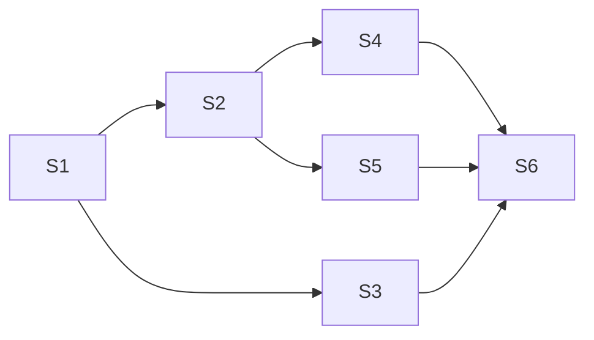
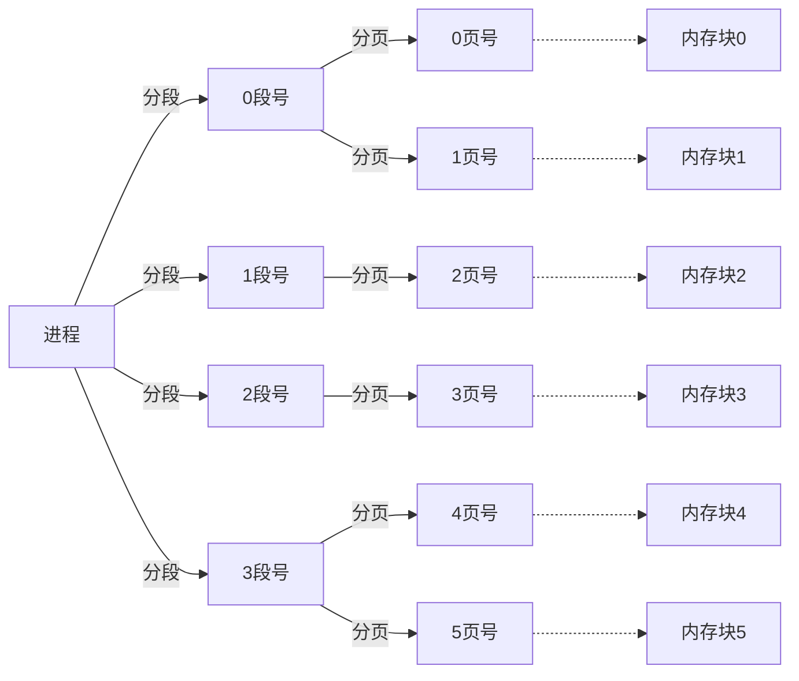

## 系统

### 操作系统的概念功能与目标

操作系统定义

- 负责协调硬件, 软件等计算机资源的工作
- 为上层应用程序, 用户提供简单易用的服务, 接口与环境
- 是计算机中最接近硬件的软件

操作系统的功能

- 作为系统的管理者应该提供的功能

  文件管理(打开文件夹)

  内存管理(将数据装入内存)

  处理机管理(把什么进程给处理器处理)

  设备管理(将设备分配给进程)

- 作为用户与计算机之间的接口应该提供的功能

  命令接口(允许用户直接使用, 联机命令接口相当于在线处理数据, 脱机命令接口相当于离线处理数据)

  程序接口(用户通过程序间接进行系统调用)

  GUI

- 作为最接近硬件的软件应该提供的功能

  扩展裸机的功能

### 操作系统的特征

- 并发
  - 多个事件在宏观上同时发生, 在微观上交替发生. 并发并不是并行, 并行是多个事件在同一时刻同时发生
- 共享
  - 系统中的资源可以供多个并发的进程共同使用, 有
    - 互斥共享: 一个时间段允许一个进程访问资源(麦克风的占用)
    - 同时共享: 一个时间段允许多个进程"同时(宏观上)"访问资源(网络的占用)
- 虚拟
  - 将物理实体转化为虚拟的对应物(例如虚拟内存, 虚拟处理器技术)
- 异步
  - 程序并发执行的时候执行不是一贯到底的, 而是走走停停以不可预知的速度推进

### OS的发展与分类

- 手动操作阶段

  机器用过多时间等待用户输入

  单用户在使用时独占全机

- 单道批处理系统

  使用脱机输入输出技术，引入监督程序控制作业的输入输出

  人讲纸带通过外围机读入磁带, 计算机快速读取磁带内容并输出结果到磁带

  缓解了人机速度矛盾，但是内存中仅能有一个程序运行，CPU还是有大量时间在等待IO完成，利用率还是很低

- 多道批处理系统

  用户将纸带数据写入磁带，计算机可以同时向内存输入多个磁带程序，操作系统引入了中断技术可以管理程序执行，实现并发执行

  缺点是用户只有看到输出才能知道运行的结果，没有人机交互

- 分时操作系统

  计算机以时间片轮流为用户服务, 哥哥用户可以通过终端与计算机交互

  分时操作系统解决了人机交互问题, 是用户的请求可以即时被相应, 但是操作系统对用户是完全公平的, 无法处理紧急任务

- 实时操作系统

  计算机系统接收到外部信号后及时处理, 并要求在严格的时限内处理完事件, 主要特点是及时与可靠

  可以优先处理紧急任务

### OS的运行机制与体系结构

有的指令对计算机没有损害，有的指令比较危险(例如内存清零)需要具有较高执行权限。将指令分为

- 特权指令：不允许普通的用户程序使用
- 非特权指令：允许普通的用户程序使用

CPU通过PSW的两种状态判断当前是否可以执行特权指令

- 用户态：CPU只能执行非特权指令
- 核心态：CPU可以执行特权指令与非特权指令

计算机系统也将程序分为了

- 内核程序：可以执行特权指令与非特权指令（运行在核心态）
- 非内核程序：只能执行非特权指令（运行在用户态也可以运行在核心态）

内核程序的范围

- 时钟管理：实现计时功能
- 中断处理
- 原语：特殊的程序，实现设备驱动，CPU状态切换，具有原子性（即指令要么执行要么不执行不能中断）
- 对系统资源的管理功能：进程管理，存储器管理，设备管理（有的操作系统不认为这是内核程序）

大内核与微内核

- 大内核：包括了系统资源管理功能的内核（高性能，代码量大，结构混乱，难以维护）
- 微内核：不包括系统资源管理功能的内核（内核功能少，结构清晰，方便维护，但是需要频繁在核心与用户态切换）

### 中断与异常

早期计算机中各个程序串行执行，这导致系统利用率降低，为了解决这一问题，计算机操作系统引入了中断机制，实现了多道程序并发执行

中断的发生就意味着计算机需要操作系统介入并开展管理工作，一旦中断发生

- CPU立即进入核心态，操作系统获取计算机控制权
- 当前运行程序立刻暂停，由操作系统内核对中断进行处理
- 对于不同中断操作系统处理不同

中断分为

- 内中断：
  - 信号由CPU内部产生，与当前执行的指令有关（程序自发进行的中断，要求操作系统处理，例如程序要求从键盘读入数据）
  - 可以细分为
    - 资源中断（指令中断）
    - 强迫中断（有硬件故障与软件中断）
- 外中断：
  - 来源于CPU外部的中断与当前执行的指令无关
  - 可以细分为
    - 外设请求（IO输入结束后发出中断信号通知操作系统）
    - 人工干预

中断是用户态切换到核心态的唯一途径（核心态切换到用户态只需要一条设置PSW的特权指令）

外中断的处理过程：

- CPU每执行一条指令后都会检查是否有外中断信号
- 如果检测到了外中断信号则需要保护被中断进程的CPU环境（PSW，PC，通用寄存器...）
- 根据中断的类型转入对应的中断处理环境
- 恢复CPU环境并继续执行进程

### 系统调用

系统调用是系统提供的可以供应用系统调用的接口，可以理解为供应用程序调用的特殊函数，应用程序通过系统调用获取操作系统的服务

为了防止应用程序抢占系统共享资源，操作系统只允许程序通过系统调用向系统发出占用共享资源的请求，操作系统会对这些请求协调管理

系统调用的分类

- 设备管理
- 文件管理
- 进程控制
- 进程通信
- 内存管理

系统调用的相关处理需要在核心态下进行

应用程序可以通过汇编指令直接进行系统调用，但是高级语言中一般是通过调用封装好的库函数调用系统调用

传递系统调用的参数 -> 执行陷入指令（只能在用户态执行）-> 执行系统调用的相关服务程序（核心态）-> 返回用户程序

## 进程

### 进程的组成/定义/组织方式/特征

在单道批处理系统中一个程序可以独占计算机资源，此时内存中保存着这个程序的程序段（存放程序的代码）与数据段（运行过程中处理的数据）

在多道程序系统中，计算机可以同时处理多个程序，内存中也会有多个程序的数据，操作系统需要实现程序的并发执行就必须要找到每个程序对应的程序段，为此操作系统引入了进程与进程实体的概念

操作系统在每个进程运行之前都会为进程创建一个进程控制块（PCB），用来描述进程的各种信息（如存放代码的位置）

进程实体由数据块，程序块，PCB构成

一般来说创建与撤销进程就是创建与销毁一个PCB，PCB是进程的唯一标识

**进程有不同的定义**

- 进程是程序的一次**执行过程**
- 进程是一个程序及其数据在处理机上顺序执行所发生的活动
- 进程是具有独立功能的程序在数据集合上运行的过程，是系统进行资源分配与调度的独立单位
- 进程是进程实体的运行过程，是系统进行资源分配与调度的独立单位

**PCB的组成**

- 进程描述信息：PID与UID
- 进程的控制管理信息：控制状态与优先级
- 资源分配清单：程序段与数据段指针，IO设备
- 处理机相关信息（寄存器的值）

**进程的组织**

操作系统中有大量PCB，为了对他们有效管理需要将PCB之间组织起来

- 链接方式：OS通过状态建立多个PCB队列，操作系统持有PCB队列的指针
  - 执行指针：正在运行的进程  p -> A
  - 就绪队列指针：处于就绪态的进程 p -> A -> B -> C
  - 阻塞队列指针：当前处于阻塞态的进程 p -> A -> B -> C
- 索引方式：OS通过状态建立多个PCB索引表，操作系统持有索引表的指针
  - 执行指针：正在运行的进程  p -> A
  - 就绪表指针：指向就绪索引表，表中存放PCB的指针
  - 阻塞表指针：指向阻塞索引表，表中存放PCB的指针

**进程的特征**

- 动态性：进程是一个**过程**
- 并发性：内存中多个进程实体并发进行
- 独立性：可以独立运行，独立获得资源，独立接受调度的基本单位
- 异步性：各个进程各自独立的，按照不可预知的速度推进，操作系统要使用进程同步机制解决异步问题
- 结构性：由PCB，程序段，数据段组成

### 进程的状态与转换

操作系统将进程划分为几种状态

- 运行态：正在占有CPU并在CPU上运行（数量等于核心数）

- 就绪态：已经做好运行准备，但是没有空闲CPU，暂时不能运行（拥有除了处理机之外的所有资源）

- 阻塞态：因为等待某一事件而暂时不能运行（等待IO）

- 创建态：进程在被分配资源空间时候的状态

- 终止态：进程正在从OS中撤销，回收进程的资源

  ```mermaid
  graph LR
      创建态 --> 就绪态 --> 运行态 --> 阻塞态 --> 就绪态
      运行态 --> 终止态
      运行态 --> 就绪态
  ```

  就绪态必须先经运行态才能转变到阻塞态

  阻塞态必须经过就绪态才能转化到运行态

### 进程控制

进程控制：实现进程状态之间的转换

为了防止PCB所在的队列与PCB状态不一致，使用原语对进程进行控制，即其在执行过程中不会被中断，通过关中断与开中断指令保证多条原语可以同时执行(关中断后在开中断之前CPU不会处理外部中断信号，开关中断指令是特权指令)

OS中的原语主要有三个功能

- 更新PCB中信息

  - 修改PCB状态
  - 剥夺进程的CPU使用权，保存PCB环境
  - 在进程运行前恢复运行环境

- 将PCB插入合适队列

- 分配回收资源

### 进程通信

进程是分配资源的基本单位，进程之间的资源相互独立不可相互访问，操作系统应该提供一些方法保证进程之间信息交换的需要

实现方式

- 共享存储

  - 操作系统在为两个进程分配资源后再分配一个共享空间，两个进程可以互斥的访问这个共享空间
  - 操作系统提供了实现互斥访问的工具
  - 共享存储包括基于数据结构的共享（要求共享空间只能存一个固定大小的数据结构）与基于存储区的共享（系统只提供一个存储区，存取数据形式都由进程自行决断）

- 管道通信

  - 管道是一个用于连接读写进程的共享文件，内存中的一个固定大小的缓存区（一般与内存页面一样大）

  - 管道只能实现半双工通信（同时只能单向传输数据）

  - 进程对管道应该是互斥访问

  - 流程：进程A向管道写入数据，只有当数据写满的时候`write()`被阻塞，进程B才能使用`read()`从管道中读取数据，只有当全部数据都读取完成`read()`被阻塞后进程A才能继续向管道中写数据

    如果管道没有写满就不能读取数据，如果管道没有读空就不能写数据

    管道数据一旦读出就会被立刻弹出，故读进程最多一个

- 消息传递

  - 进程之间以格式化消息的方式交换数据，进程通过OS提供的发送/接受消息两个原语进行数据交换
  - 格式化消息包括一个消息头与一个消息体
    - 消息头：发送进程ID，接受进程ID，消息类型，消息长度
    - 消息体
  - 消息传递有直接通信与间接通信
    - 直接通信：发送者通过发送原语要求OS将消息直接挂在进程的消息缓冲队列上，接受进程通过接受原语获取消息队列上的消息
    - 间接通信：消息要先发送到中间实体信箱

### 线程

没有引入进程之前系统中的各个程序只能串行执行， 引入进程之后进程之间可以并发执行

但是在同一个进程中我们无法同时做多个事情（边聊天边传输文件），我们需要引入线程机制来解决这个问题

- 引入线程之前进程是CPU服务的基本单位，CPU轮流向不同进程服务
- 引入线程之后CPU的服务单位变成了进程中的线程，若进程希望同时完成多个事务则其可以创建多个线程提高并发度
- 引入线程之后进程只作为系统资源分配的分配单元（打印机，内存的分配都是分配给进程的）
- 同一进程中线程之间的切换不需要切换进程环境，系统开销小，降低了并发所带来的系统开销

**线程的属性**

- 线程是处理器调度的基本单位
- 在多核CPU中，各个线程可以占用不同的CPU
- 每个线程也有线程的ID，线程的控制块（TCB）
- 线程也有就绪，阻塞，运行三种状态
- 线程几乎不拥有系统资源
- 同一进程的不同线程之间共享进程的资源（IO, 内存等）
- 由于共享内存地址，同一进程中线程的通信无需系统干预
- 同一进程线程切换不会引起进程切换
- 不同进程线程切换会引起进程切换
- 同一进程内的线程切换系统开销很小
- 不同进程内的线程切换系统开销很大

**线程的实现方式**

- 用户级线程（多对一模型）

  用户级线程由应用程序通过线程库实现，线程的管理工作应该由应用程序负责

  在用户级线程中，线程的切换可以在用户态完成，无需系统干预

  在用户看来进程中存在多个线程，但是操作系统并不会意识到线程的存在，操作系统的调度仍然以线程为基本单位实现

  - 优点：线程切换在用户空间完成，开销小，效率高
  - 缺点：用户级线程被阻塞后整个进程就会被阻塞，并发度不高，多线程不能在多核上运行

  ```mermaid
  graph TB
  	用户级线程1 --- 线程库
  	用户级线程2 --- 线程库
  	用户级线程3 --- 线程库 --- 系统进程
  ```

- 内核级线程（一对一模型）

  内核级线程的管理由操作系统内核完成，所以必须在核心态下完成

  - 优点：单线程阻塞，别的线程还可以继续执行，可以多核心并发执行
  - 缺点：一个用户进程会占用多个用户级线程，线程切换由操作系统完成，开销大成本高

  ```mermaid
  graph TB
  	用户级线程1 --- 内核级线程1 --- 进程
      用户级线程3 --- 内核级线程3 --- 进程
      用户级线程2 --- 内核级线程2 --- 进程 
  ```

- 同时支持内核级线程与用户级线程

  采用上述二者组合的方式将多个用户级线程映射到多个内核级线程上

  - 优点：克服了线程切换开销大与多核并行运行的问题

  ```mermaid
  graph TB
  	用户级线程1 --- 线程库 --- 内核级线程1 --- 进程
      用户级线程3 --- 线程库 --- 内核级线程3 --- 进程
      用户级线程2 --- 线程库 
  ```

  **操作系统只能看到内核级线程，所以内核级线程才是处理机分配资源的分配单位**

### 处理机的调度

调度：由于资源有限，数据无法被同时处理的时候需要按照某种规则来决定任务处理的顺序。在多道程序系统中处理机的数目往往多与进程数目

共有三个层次的调度

- 高级调度（作业调度）

  由于内存空间有限，无法同时将用户提交的作业装入内存，需要确定某种顺序来决定作业调入的顺序

  高级调度是按一定的原则从后备队列中挑选一个或多个作业，给他们分配内存等必要资源，建立相应的进程PCB，使他们获得竞争的权利

  高级调度是外存与内存之间的调度，调入的时候会建立PCB，调出时撤销PCB，一个进程只能被调度一次

- 中级调度（内存调度）

  引入虚拟存储后可以将暂时不使用进程调度到外存等待，但是**PCB不会调度到外存**，PCB中记录进程在外存中的位置，被挂起的PCB会被放入挂起队列

  中级调度决定了那个进程要被优先从挂起状态调入内存，一个进程可以被多次中级调度

  就绪态的进程被挂起的时候会转化为就绪挂起状态，激活后后会进入就绪态

  阻塞态的进程被挂起的时候会转化为阻塞挂起状态，激活后后会进入阻塞态

  处于阻塞挂起状态的进程遇到事件出现的时候就会进入就绪挂起的状态

  运行态与创建态的进程也可能直接进入就绪挂起状态

- 低级调度（进程调度）

  按照算法将任务从就绪队列调入处理机。进程调度是实现并发的基础，是最基础的调度

### 进程调度(时机与方式)

进程调度的时机

- 当前运行的进程主动放弃了处理机（正常终止，发生异常而终止，进程主动请求阻塞）
- 当前运行的进程被迫放弃处理机（时间片用完了，更紧急的事情需要处理，更高优先级的进程进入就绪）

不能进行进程调度的时机

- 中断处理过程中
- 进程在**内核**临界区中（如果进程在访问普通临界区（例如打印机的临界区）是可以被调度的）
- 在原子操作过程中

进程调度方式

- 非抢占式调度

  只允许进程主动放弃处理机，即使有更加紧急的任务到达仍然要等待进程主动结束或进入阻塞态

- 抢占式调度

  当进程在处理机上执行的时候有更加紧急的任务到达那么当前执行的进程就会被暂停执行

进程切换是有代价的，过于频繁的进程切换不意味着高并发

### 调度算法的评价指标

- CPU利用率：CPU忙碌时间占总时间的比例
- 系统吞吐量：单位时间完成作业的数量
- 周转时间：一个作业从提交到完成花费的时间（作业在外存上进行高级调度的时间，进程在等待队列上低级调度的时间，进程在CPU上的执行时间，进程等待IO操作完成的时间）
- 平均周转时间
- 带权周转时间：$\frac{作业周转时间}{作业实际运行时间}$

- 平均带权周转时间
- 等待时间：作业等待处理机服务时间之和
- 响应时间：提交到首次产生相应所用的时间

### 调度算法

- FCFS先来先服务
  - 算法规则：先到达就绪/后备队列的先服务
  - 非抢占式
  - 优点：简单公平
  - 缺点：排在长作业后面的短作业需要等待长时间来服务（对短作业不利）
  - 不会导致饥饿
- SPF短进程优先
  - 算法思想：为了追求更小的平均带权周转时间
  - 算法规则：最短的作业先得到服务
  - SPF一般是非抢占式的，抢占式版本的SPF是SRTN（最短剩余时间优先）
  - 优点：最短平均等待时间与平均周转时间
  - 缺点：对短作业有利对长作业不利，用户可以将长作业的预计时间修改的很短
  - 当收到源源不断的短作业会导致饥饿
- HRRN高响应比优先
  - 算法思想：要综合考虑作业的等待时间，也要考虑进程要求服务时间
  - 算法规则：调度时计算$响应比=\frac{等待时间+要求被服务时间}{要求被服务时间}$
  - 非抢占式
  - 优点：综合考虑了作业的运行时间与等待时间
  - 不会导致饥饿

这三种算法不关心响应时间，也不关心用户紧急程度，不适用于交互式系统，一般适用于早期批处理系统

- RR时间片轮转算法

  - 算法思想：公平的轮流为各个进程服务，每个进程在一定时间间隔中都可以得到响应
  - 算法规则：按照进程到达就绪队列的顺序各自执行一个时间片，若在时间片内进程没有执行完则把进程放入队尾重新排队(当重新入列进程与新进程同时到达一般是新进程优先)
  - 抢占式
  - 优点：公平，响应快，适合分时操作系统
  - 缺点：如果时间片过大RR算法会退化为FIFS算法，时间片过小会导致进程切换过于频繁花费大量时间进行进程切换
  - 不会导致饥饿

- 优先级调度算法

  - 算法规则：调度时选择优先级最高或最低的进程进行调度
  - 抢占式非抢占式都有
  - 就绪队列未必只有一个，优先级也可能是动态的
  - 优先级设置的原则
    - 系统进程优先于用户进行
    - 前台进程优先于后台进程
    - IO繁忙型进程由于CPU繁忙型进程
    - 在动态优先级中可以考虑提高等待时间长的，IO繁忙的进程的优先级，降低处理时间短的进程的优先级
  - 不导致饥饿

- 多级反馈队列调度算法

  - 算法规则：

    设置多级队列，各个队列优先级从高到低，时间片从小到大，新进程进入1级队列，按FCFS原则服务，若时间片用完还没有结束则进入下一级队列

    只有第k级队列为空才会处理k+1级队列进程

  - 抢占式

  - 优点：相对公平，相应时间短，灵活调整优先级

  - 会导致饥饿

### 进程的同步与互斥

进程的异步性：各个并发执行的进程各自以独立的不可预知的速度向前推进

进程同步：进程之间为了完成任务需要协调工作次序

临界资源：一个时间段内只允许一个进程使用的资源，对于临界资源的访问必须互斥使用

**临界资源的互斥访问可以分为四部分**

- 进入区：检查是否可以访问临界区并上锁
- 临界区：实际访问临界资源的代码
- 退出区：解除临界区上锁的代码
- 剩余区：其他处理

进程互斥设计原则

- 空闲让进
- 忙则等待
- 有限等待
- 让权等待：当进程无法进入临界区应该立即释放处理机防止忙等

### 进程互斥的软件实现方法

- 单标志法

  在进程访问完临界区后将使用权限交给另一个进程

  ```c
  int turn = 0;
  
  // P0
  while(turn != 0);
  // 临界区
  turn = 1;
  // 剩余区
  
  // P1
  while(turn != 1);
  // 临界区
  turn = 0;
  // 剩余区
  ```

  P0, P1交替访问临界区，但是如果P0一直不访问临界区，那么P1也无法访问临界区

- 双标志先检查

  设计一个`flag`数组用来表示各个进程的进入意愿，进程在进入临界区之前先检查进程中有没有别的进程想要进入临界区，如果没有再将自己的`flag`置为`true`

  ```c
  bool flag[2];
  flag[0] = false;
  flag[1] = false;
  
  // P0
  while(flag[1]);		// 1
  flag[0] = true;		// 2
  // 临界区
  flag[0] = false;
  // 剩余区
  
  // P1
  while(flag[0]);		// 3
  flag[1] = true;		// 4
  // 临界区
  flag[1] = false;
  // 剩余区
  ```

  当异步进程按照1-3-2-4的顺序执行的时候出现了同时进入临界区

- 双标志后检查

  ```c
  bool flag[2];
  flag[0] = false;
  flag[1] = false;
  
  // P0
  flag[0] = true;		// 1
  while(flag[1]);		// 2
  // 临界区
  flag[0] = false;
  // 剩余区
  
  // P1
  flag[1] = true;		// 3
  while(flag[0]);		// 4
  // 临界区
  flag[1] = false;
  // 剩余区
  ```

  若按照1-3-2-4执行，这个算法会造成P1, P2都无法进入临界区产生饥饿现象

  可以看到，**一般出现问题都出现在进入区多指令在不同进程之间交替执行**

- Peterson算法

  ```c
  bool flag[2];
  flag[0] = false;
  flag[1] = false;
  int turn = 0;
  
  // P0
  flag[0] = true;
  turn = 1;
  while(flag[1] && turn == 1);
  // 临界区
  flag[0] = false;
  // 剩余区
  
  // P1
  flag[1] = true;
  turn = 0;
  while(flag[0] && turn == 0);
  // 临界区
  flag[1] = false;
  // 剩余区
  ```

### 进程互斥的硬件实现方法

- 中断屏蔽方法

  利用开中断与关中断指令实现不可被中断的访问

  ```c
  // 关中断
  // 临界区
  // 开中断
  ```

  简单，但是不适合多处理机的系统，亦不适合用于用户进程(内核态指令)

- TestAndSet(TS/TSL指令)

  TS指令是通过硬件实现的，在执行过程中不允许中断，其逻辑原理为

  ```c
  bool TestAndSet(bool *lock){
      bool old;
      old = *lock;
      *lock = true;
      return old;
  }
  ```

  使用方法为

  ```c
  while(TestAndSet(&lock));    
  // 临界区代码
  lock = false;
  // 剩余区代码
  ```

- Swap指令

  使用硬件实现，逻辑为

  ```c
  Swap(bool *a, bool *b){
      bool temp;
      temp = *a;
      *a = *b;
      *b = temp;
  }
  ```

  使用时

  ```c
  bool old = true;
  while(old = true)
      	swap(&lock, &old);
  // 临界区代码
  lock = false;
  // 剩余区代码
  ```

### 信号量机制

之前信号量存在的问题

- 双标志先检查的检查与上锁无法一气呵成
- 无法实现让全等待

信号量是一个用来表述资源数量的变量，用户可以通过OS提供的一对原语（`wait(S)`简写为`P(S)`, `signal(S)`简写为`V(S)`）来对信号量进行操作，从而方便的实现进程的互斥，同步

- 整型信号量

  用整数表示系统系统资源数目，只能进行初始化操作，P操作，V操作

  ```c
  int S = 1;
  
  void wait(int S){
      while(S<=0);
      S=S-1
  }
  
  void signal(int S){
      S=S+1;
  }
  ```

  ```c
  // P0
  wait(S);
  // 使用资源
  signal(S);
  
  // P1
  wait(S);
  // 使用资源
  signal(S);
  ```

  整型变量在`wait`中不满足让权等待会出现忙等

- 记录型信号量

  ```c
  typeof struct{
  	int value;				// 剩余资源数
  	struct process *L;		// 等待队列
  }semaphore;
  
  void wait(semaphore S){
  	S.value--;
  	if(S.value<0)
  		block(S.L);			// 将当前进程放入等待队列
  }
  
  void signal(semaphore S){
      S.value++;
      if(S.value<=0)
          wakeup(S.L);		// 激活阻塞队列第一个进程
  }
  ```

  先让进程占用信号量，一旦发现信号量不够了(`<0`)就把进程阻塞起来，当释放信号量后发现信号量还是不够(`<0`)就立即将信号量分给阻塞队列的程序

### 信号量实现互斥同步前驱

**使用信号量实现互斥**

- 分析并发进程的关键活动划定临界区(例如对临界资源打印机访问就应该放在临界区)

- 对不同的资源设置不同的互斥信号量`semaphore mutex = 1`

  ```c
  semaphore mutex = 1;
  
  foo(){
  	wait(mutex);
  	// 临界区
  	signal(mutex);    
  }
  
  bar(){
      wait(mutex);
  	// 临界区
      signal(mutex);
  }
  ```

**使用信号量实现同步**

- 判断需要一前一后操作的进程

- 设置不同信号量`semaphore mutex = 0`

  ```c
  semaphore mutex = 0;
  
  // P0
  bar(){
  	// 需要先执行的代码
      signal(mutex);
  }
  
  // P1
  bar(){
      wait(mutex);
      // 需要后执行的代码
  }
  ```

 **使用信号量实现前驱关系**

有代码块$S_1...S_6$



需要按照箭头的顺序执行代码

```c
semaphore mutex_1 = 0;
semaphore mutex_2 = 0;
semaphore mutex_1 = -2;

S1(){
	// S1_code
	signal(mutex_1);
}

S2(){
	wait(mutex_1);
	// S2_code
	signal(mutex_2);
}

S3(){
	wait(mutex_1);
	// S3_code
	signal(mutex_3);
}

S4(){
	wait(mutex_2);
	// S4_code
	signal(mutex_3);
}

S5(){
	wait(mutex_2);
	// S5_code
	signal(mutex_3);
}

S6(){
	wait(mutex_3);
	// S6_code
}
```

### 生产者消费者问题

在计算机中生产者每次生产一个产品放入缓冲区，消费者进程从缓冲区中取出产品并使用

生产者只能在缓冲区非满的时候放入产品，消费者每次只能在缓冲区非空的时候取产品，缓冲区必须互斥访问

- 分析有几类进程：2类，生产者与消费者
- 同步与互斥关系：
  - 缓冲区的访问是**互斥**的（多个生产者）
  - 缓冲区没有满时生产者才能放入产品，否则等待（**同步**）
  - 缓冲区没有空时消费者才能取出产品，否则等待（**同步**）


- 信号量设计
  - 生产者每次要消耗一个空闲缓冲区信号量，生产一个产品信号量
  - 消费者每次要释放一个空闲缓冲区信号量，消耗一个产品信号量
  - 在访问临界区的时候要设置互斥信号量

```c
semaphore mutex = 1;
semaphore empty = n;
semaphore full = 0;

product(){
    while(true){
      // 生产一个产品
      wait(empty);
      wait(mutex);  
      // 放产品
	  signal(mutex);      	
      signal(full);
    }
}

custom(){
    while(true){
      wait(full);
      wait(mutex);  
      // 取出产品
      signal(mutex);
      signal(empty);
      // 使用产品
    }
}
```

应该先判断缓冲区大小再进行互斥访问，否则会出现缓冲区满的时候生产者`wait(empty)`, 消费者`wait(full)`

### 多生产者多消费者问题

> 特征：多生产者消费者，临界区大小为一

桌子上有空盘子，父亲能放入:apple:，母亲能放入:orange:，儿子只能吃:orange:，女儿只能吃:apple:，使用PV操作实现

```c
semaphore mutex = 1;
semaphore empty = 1;
semaphore full_apple = 0;
semaphore full_orange = 0;

dad(){
	wait(empty);
    wait(mutex);
    // 放苹果
    signal(mutex);
    signal(full_apple);
}

mom(){
	wait(empty);
    wait(mutex);
    // 放橘子
    signal(mutex);
    signal(full_orange);
}

son(){
	wait(full_apple);
    wait(mutex);
    // 拿苹果
    signal(mutex);
    signal(empty)
}

daut(){
	wait(full_oragne);
    wait(mutex);
    // 放橘子
    signal(mutex);
    signal(empty)
}
```

当我们去掉`mutex`后

```c
semaphore mutex = 1;
semaphore empty = 1;
semaphore full_apple = 0;
semaphore full_orange = 0;

dad(){
	wait(empty);
    // 放苹果
    signal(full_apple);
}

mom(){
	wait(empty);
    // 放橘子
    signal(full_orange);
}

son(){
	wait(full_apple);
    // 拿苹果
    signal(empty)
}

daut(){
	wait(full_oragne);
    // 放橘子
    signal(empty)
}
```

程序也可以不会出问题，原因是本题中缓冲区容量为1，最多只有一个P操作不会被阻塞，如果盘子容量为2的话就会出现多个`wait`同时跳出，对资源同时访问

> 在生产者消费者问题中，如果缓冲区为1，那么可能不需要互斥信号量，但是如果来不及分析就无脑加上
>
> 互斥操作必须在同步操作之后，否则会造成死锁	

### 吸烟者算法

> 特征：多种资源，一个临界区

有一个供应商与三个吸烟者，三个吸烟者分别拥有无限胶水，纸，烟草，一次吸烟需要吸烟者具有三样原料，供应商每次会轮流向桌子上放一次量的两种不同的原料，如果这两种原料都是某个吸烟者需要的，吸烟者就会拿走并完成吸烟，只有完成吸烟动作吸烟者才会告诉供应商东西已经拿走了

- 桌子可以看做一个容量为`1`的缓冲区
- 当桌子上有组合k的时候吸烟者k才会取

```c
semaphore mutex = 1;
semaphore empty = 1;
semaphore full_1 = 0;
semaphore full_2 = 0;
semaphore full_3 = 0;

dad(){
    while(true){
		wait(empty);
        wait(mutex);
        // 放东西1
        signal(mutex);
	    signal(full_1);
		wait(empty);
        wait(mutex);
        // 放东西2
        signal(mutex);
	    signal(full_2);
		wait(empty);
        wait(mutex);
        // 放东西3
        signal(mutex);
	    signal(full_3);
    }
}

user1(){
    while(true){
        wait(full_1);
        wait(mutex);
        // 拿走吸烟
        signal(mutex);
        signal(empty);
    }
}

user2(){
    while(true){
        wait(full_2);
        wait(mutex);
        // 拿走吸烟
        signal(mutex);
        signal(empty);
    }
}

user3(){
    while(true){
        wait(full_3);
        wait(mutex);
        // 拿走吸烟
        signal(mutex);
        signal(empty);
    }
}
```

### 读者写者问题

> 特征：部分进程可以不互斥访问临界区

系统中有读者写者两种进程，

- 多个写者进程向共享文件区互斥的写文件
- 在写者写时读者不可读
- 写进程执行前其他读写进程应该全部退出
- 多个读者进程之间不互斥的读文件（不会改变数据）

关系分析：

- 写写进程，读写进程互斥：设置信号量`rw`表示是否有任意进程正在读写文件
- 读读不互斥：设置普通变量`cnt`表示正在读写文件的进程中有多少个读进程，设置互斥信号`mutex`实现`cnt`变量的独占访问

```c
semaphore rw = 1;
semaphore mutex = 1;
int cnt = 0;

writer(){
    while(true){
        wait(rw);
        // 写进程
        signal(rw)
    }
}

reader(){
    while(true){
        wait(mutex);
        if(cnt==0)
            wait(rw);
        cnt++;
        signal(mutex);
        // 读文件
        wait(mutex);
        cnt--;
        if(cnt==0)
            siganl(rw);
        signal(mutex);
    }
}
```

存在问题：若进程运行方式为读->写->读->...->读时，实际的执行顺序变成了读->读->...->读->写，那么写进程会被饿死

这是因为读进程在进入后可以“无条件的”设置`cnt++`，造成`rw`无法释放，而写进程却要等`rw`释放才能执行，一个很好的方法就是让读写进程以同样的困难程度开始读写

```diff
semaphore rw = 1;
semaphore mutex = 1;
int cnt = 0;
+ semaphore w = 1;

writer(){
    while(true){
+		wait(w);
        wait(rw);
        // 写进程
        signal(rw)
+		signal(w);
    }
}

reader(){
    while(true){
+		wait(w);
        wait(mutex);
        if(cnt==0)
            wait(rw);
        cnt++;
        signal(mutex);
        // 读文件
        wait(mutex);
        cnt--;
        if(cnt==0)
            siganl(rw);
        signal(mutex);
+		signal(w);
    }
}
```

### 哲学家进餐问题

> 特征：进程需要多个资源

圆桌上有k个哲学家，每个哲学家要么是在思考，要么是在吃饭，相邻两位哲学家之间有一只筷子，哲学家要拿到左右两只筷子才能吃饭，否则只能思考

很容易想到的解决方案是

```c
semaphore chop[k]={1};			// 第i人左边的筷子

peop_i(){
    while(true){
        wait(chop[i]);
        wait(chop[(i+1)%k]);
        // 吃饭
        signal(chop[(i+1)%k]);
        signal(chop[i]);
        // 思考
    }
}
```

但是如果每个人都拿起了自己左手边的筷子就会造成死锁，简单的解决方案是设置`cnt`表示当前持有任意筷子的人数，并限制`cnt<k`，当然，需要使用互斥信号量实现`cnt`的与修改

```diff
semaphore chop[k]={1};			// 第i人左边的筷子
+ semaphore mutex = 1;
+ int cnt = 0;

peop_i(){
    while(true){
+       wait(mutex);
+       if(cnt==k){
+  	    	signal(mutex);
+           continue
+       }
+       cnt++;
+       signal(mutex);
        wait(chop[i]);
        wait(chop[(i+1)%k]);
        // 吃饭
        signal(chop[(i+1)%k]);
        signal(chop[i]);
+       wait(mutex);
+       cnt--;
+       signal(mutex);
        // 思考
    }
}
```

或者使用信号量代替cnt

```diff
semaphore chop[k]={1};			// 第i人左边的筷子
+ semaphore cnt = k-1;

peop_i(){
    while(true){
+    	wait(cnt);
        wait(chop[i]);
        wait(chop[(i+1)%k]);
        // 吃饭
        signal(chop[(i+1)%k]);
        signal(chop[i]);
+       signal(cnt)
        // 思考
    }
}
```

一种更加巧妙的设计是：要求奇数号哲学家拿自己先拿右面的筷子，偶数号哲学家拿自己左面的筷子

```diff
semaphore chop[k]={1};			// 第i人左边的筷子

peop_i(){
    while(true){
+ 		if(i%2){
	        wait(chop[i]);
    	    wait(chop[(i+1)%k]);    
+        }else{
+    	    wait(chop[(i+1)%k]);    
+           wait(chop[i]);
+        }
        // 吃饭
+ 		if(i%2){
	        signal(chop[(i+1)%k]);
    	    signal(chop[i]);
+       }else{
+        	signal(chop[i]);
+           signal(chop[(i+1)%k]);
+       }
        // 思考
    }
}
```

还有一种方法是让拿筷子变成一个互斥过程，一个哲学家如果拿了左筷子不拿右筷子，那么整个程序就会挂起，直到等到了右筷子

```diff
semaphore chop[k]={1};			// 第i人左边的筷子
+ semaphore mutex = 1;

peop_i(){
    while(true){
+    	wait(mutex);
        wait(chop[i]);
        wait(chop[(i+1)%k]);
+    	signal(mutex);
        // 吃饭
        signal(chop[(i+1)%k]);
        signal(chop[i]);
        // 思考
    }
}
```

### 管程

在没有管程的时候使用信号量编程较为困难，容易出错

管程也是用来实现资源的互斥与同步，组成有

- 局部于管程的共享数据结构说明（缓冲区）[类成员变量]
- 对数据结构进行操作的函数[类成员方法]
- 局部于管程的数据结构赋初值函数[构造函数]
- 管程的名字[类名]

基本特征

- 局部于管程的数据只能局部于管程中的过程访问[类成员变量是私有的]
- 每个进程只有通过调用管程中的过程才能访问数据[类成员变量是私有的]
- **每次只允许一个进程在管程内执行某个内部过程**

使用管程解决生产者消费者问题

```c
monitor ProducerConsumer
    condotion full, empty;
	int cnt = 0;
	void insert(Item item){
        if(cnt==N)wait(full);
        cnt++;
        insert_item();
        if(cnt==1)signal(empty);
    }
	Item remove(){
        if(~cnt)wait(empty);
        cnt--;
        if(cnt==N-1)signal(full);
       	return remove_item();
    }
end moniter
    
producer(){
    while(true){
        ProducerConsumer.insert(new Item());
    }
}

consumer(){
    while(true){
        item = ProducerConsumer.remove();
    }
}
```

### 死锁

- 死锁：各个进程互相等待对方手里的资源，导致各个进程都阻塞无法推进的现象（哲学家问题每个人只拿左筷子）
- 饥饿：由于长期得不到资源，导致某个进程无法推进的现象（SPF调度的长进程）

死锁的**必要条件**：

- 互斥条件：进程争夺的资源必须互斥
- 不可剥夺：资源只能有进程主动释放，不能抢夺
- 请求与保持条件：进程至少掌握了一个资源但是有提出一个新的资源申请
- 循环等待：资源的请求出现了循环请求（即使发生了循环等待，如果同类资源数大于一也不一定会发生死锁，但是如果每类资源数都是一，那么循环等待就是死锁的充要条件）

死锁的时机：

- 对不可资源的争夺
- 进程推进顺序非法
- 信号量使用不当

死锁的处理策略

- 不允许死锁发生（静态检查预防死锁）：尝试破坏死锁的必要条件
- 不允许死锁发生（动态检查避免死锁）：使用算法检测死锁，防止进入不安全状态(银行家算法)
- 允许死锁发生：操作系统检测死锁发生并采取措施解除死锁

### 静态预防死锁

- 破坏互斥条件：尝试将互斥的临界资源转化为可以共享的资源（SPOOLing技术）

  ```mermaid
  graph LR
    进程1 --> 打印机
    进程2 --> 打印机
  ```

  使用SPOOLing技术改造为

  ```mermaid
  graph LR
    进程1 --> 输出进程 --> 打印机
    进程2 --> 输出进程
  ```

  

  缺点：并不是所有的资源都可以进行改造，很多时候互斥资源不能共享

- 破坏不剥夺条件：

  - 方案一：当拥有资源的进程在请求不被满足的时候强制释放拥有的资源
  - 方案二：当搞优先级进程请求的资源被低优先级进程拥有的时候系统会协助剥夺低优先级资源

  缺点：

  - 复杂
  - 方案二会导致释放已获得资源会导致低优先级进行之前做的工作失效
  - 增大系统开销降低吞吐量
  - 方案一会导致一旦进程获得不到资源就会被释放，导致进程饥饿

- 破坏请求与保持条件

  采用静态分配方法，在进程开始执行前一次性分配所有需要的资源，如果无法分配全部资源就阻塞进程创建

  缺点：有的资源可能在进程中只是用很短的时间，但是要从进程开始的时候就为其所有知道进程结束，也会造成进程饥饿

  ```mermaid
  graph LR
  	进程A --- 资源A --- 进程C
  	进程B --- 资源B --- 进程C
  ```

  当进程AB永远交替结束，那么进程C将永远无法创建

- 破坏循环等待条件

  使用顺序资源分配法，每个进程必须按照资源编号递增的顺序申请资源，即一个已经拥有大编号资源的进程不能申请一个小编号资源

  缺点：

  - 不方便增加新的资源（每次增加资源都要重新编号）
  - 后使用小编号资源会造成小编号资源的浪费（在进程执行的最后才需要1号资源，但是1号资源在申请任意资源之前被进程持有）
  - 编程的时候比较麻烦

### 动态避免死锁

银行家有若干资金，银行家知道每个企业的最大贷款需求，企业会分批贷款，在企业贷款到自己的最大需求之前企业是不会还款的，在企业向银行家贷款但银行无款时银行家可以让企业等待直到已满足最大要求的企业还款，银行家需要确定一个序列使得自己不会出现在无款可贷也无款可收的安全序列

安全序列：如果系统按照某个顺序分配资源，则每个进程都可以顺利完成，只要找到一个这样的安全序列，系统就是安全状态

- 系统处于不安全状态意味着之后**可能**所有的没有被完全满足的进程都无法正常运行下去（即发送死锁），除非一些进程提前归还了资源
- 系统处于安全状态就意味着不可能发生死锁

系统在每次分配的时候都判断系统在分配资源后会不会进入不安全状态，如果会进入不安全状态就不进行资源分配，阻塞进程

系统中有多种资源，我们采用一个多维向量表示不同类型资源的使用/剩余量

>计算机资源总数为(10,5,7)寻找一个安全序列
>
>| 进程 | 最大需求 | 已分配资源 | 最多还需要资源 |
>| ---- | -------- | ---------- | -------------- |
>| P0   | (7,5,3)  | (0,1,0)    | (7,4,3)        |
>| P1   | (3,2,2)  | (2,0,0)    | (1,2,2)        |
>| P2   | (9,0,2)  | (3,0,2)    | (6,0,0)        |
>| P3   | (2,2,2)  | (2,1,1)    | (0,1,1)        |
>| P4   | (4,3,3)  | (0,0,2)    | (4,3,1)        |
>
>计算到目前剩余资源为(3,3,2)，
>
>- 发现此时剩余资源可以满足P2最大需求，于是将资源给P2，P2执行结束后收回全部资源，资源变为(5,3,2)
>- 发现此时剩余资源可以满足P3最大需求，于是将资源给P3，P3执行结束后收回全部资源，资源变为(7,4,3)
>- ...
>
>最后得到资源分配序列，此时系统处于安全状态

在计算机中

- 使用`Max[n][m]`表示`n`个进程请求`m`种资源的最大需求
- 使用`Allocation[n][m]`表示进程`n`已请求资源`m`的数量
- 使用`Need[n][m]`表示`n`个进程请求`m`种资源的最大还需要的数量
- 使用`Availabel[m]`表示`m`种资源的剩余数量
- 进程在请求资源的时候系统判定资源请求量`request`是否大于`Need[i]`，如果大于则认为异常
- 进程在请求资源的时候系统判定`request`是否大于`Avaliable`，如果大于则阻塞等待
- 满足上两个条件后，系统先修改`Available`，`Allocation`，`Need`，使用安全性算法判断系统是否处于安全状态，若安全则分配进程，若不安全则回退修改，设置进程阻塞等待

安全状态检查步骤：检查是否存在一个安全序列

### 死锁的检测与解除

- 设计一种数据结构用来保存资源的请求与分配信息
- 使用一种算法利用上述数据结构，检测系统是否处于死锁状态

使用**资源分配图**描述某一时刻的请求表

- 资源分配图中有两种节点
  - 进程节点：用圆形表示，代表一个进程
  - 资源节点：用矩形表示，代表一**类**资源，矩形中可以有多个圆点代表资源的数量
- 资源分配图中两种边：
  - 请求边：进程节点指向资源节点，表示进程在此时请求该类型的一个资源（n重边表示想要申请n个资源）
  - 分配边：资源节点指向进程节点，表示分配该类型的一个资源（n重边表示分配n个资源）
- 在资源请求的时候可以通过资源节点的入度与出度判断是否可以分配
- 当进程执行结束后，资源分配图中与该进程相关的连边都应该被删除
- 只要最后我们发现可以删除所有的连边，我们就称这个图是可以完全简化的，也就是找到了一个安全序列，即没有发生死锁
- 当死锁发生时，存在请求边的进程就是死锁进程

算法实现

- 在资源分配图中，找出既不阻塞又不是孤点的进程pi（即找出一条有向边与它相连，且该有向边对应资源的申请数量小于等于系统中已有空闲资源数量。如下图中，R1没有空闲资源，R2有一个空闲资源。若所有的连接该进程的边均满足上述条件，则这个进程能继续运行直至完成，然后释放它所占有的所有资源）。消去它所有的请求边和分配变，使之称为孤立的结点。
- 进程 Pi 所释放的资源，可以唤醒某些因等待这些资源而阻塞的进程，原来的阻塞进程可能变为非阻塞进程。按照上一步进行一系列简化后，若能消去途中所有的边，则称该图是可完全简化的。

解除死锁的方法

- 挂起某些处于死锁的进程并抢占其资源，分配给所需要进程，同时注意防止挂起时间过长
- 强制撤销/终止进程
- 回退一个或多个死锁进程到未死锁状态，但这就意味着操作系统需要记录程序执行历史，设置还原点

进行选择方法

- 优先选择优先级高的
- 优先选择预计剩余时间长的
- 优先选择执行时间长的
- 优先选择已经使用资源多的
- 优先选择批处理进程而不是交互式进程

## 内存

内存用于存放数据，程序在CPU执行前需要先将数据放入内存

内存地址对应了内存中一个个存储单元，如果计算机是按字节编址，那么一个地址的大小是$1Byte = 8bit$，如果计算机时按字编址，那么一个地址的大小是一个字，而字的大小根据计算机字长确定(例如16位机为16Bit)

在指令中我们一般不使用内存的物理地址，而一般使用逻辑地址（相对地址）

### 地址转换

将程序装入内存的三种方式

- 绝对装入：如果提前知道程序将装入内存中的位置，那么程序编译的时候将采用绝对地址生成目标代码，装入程序时就装入目标位置（一般适用于弹道批处理系统）
- 静态重定位装入：在编译的时候使用相对地址，在装入的时候知道装入物理地址后将代码中的逻辑地址替换为本次运行时的物理地址（作业一旦创建就不能在内存中被移动）
- 动态重定位装入：在编译的时候使用相对地址，在装入的时候知道装入物理地址后不修改逻辑地址每次执行的时候再动态将逻辑地址修正为物理地址（支持将程序装入不连续的多个空间，可以只加载部分程序就运行，可以分配比内存还要大的逻辑地址）

程序在编译链接的过程中有三种链接方式

- 静态链接：在运行之前需要将所有模块与库函数链接成一个完整的可执行文件，之后不可以拆开
- 装入时动态链接：将模块装入内存时边装入边链接
- 运行时动态链接：在程序执行过程中需要目标模块才对其进行连接，其优点是便于修改与更新，实现对模块的共享

### 存储保护

内存保护：防止进程访问非自己进程的数据

- 方案一：设置上限寄存器与下限寄存器
- 方案二：设置重定位寄存器（基址寄存器，存放起始物理地址）与界地址寄存器（限长寄存器，存放逻辑地址长度）

### 内存空间的扩充

- 覆盖技术：解决程序大小超过物理内存总和的问题

  将程序分为多个段（多个模块），常用的段常驻内存，不常用的段在使用的时候调入内存。

  内存中有一个固定区与若干个覆盖区，将需要常驻内存的段放入固定区，其中的数据在放入内存后就不再调出（除非运行结束）

  缺点：程序的调用结构与覆盖结构需要程序员自行声明，操作系统完成覆盖，不透明

- 交换技术(对换技术)：

  在内存空间紧张的时候系统将内存中部分进程调入外存，在具备条件后再换入内存

  暂时交换出内存的进程会处于挂起状态，挂起态可以分为就绪挂起与阻塞挂起态

  需要解决的问题

  - 进程应该放在磁盘的哪个位置：

    磁盘可以分为离散分配的文件区（提高磁盘利用率）与连续分配的对换区（提高IO效率）

  - 交换发生的实际

### 内存空间的分配与回收

- 连续分配管理
  - 单一分区分配
  - 固定分区分配
  - 动态分区分配
- 非连续分配管理
  - 基本分页存储管理
  - 基本分段存储管理
  - 段页式存储管理

### 连续分配管理方式

连续分配指的是系统为进程分配的内存必须是连续的内存空间

**单一连续分配**

OS将内存分为系统区（低地址）与用户区（高地址）

- 系统区存放操作系统的相关数据
- 用户区用于存放用户进程相关数据，内存中只能有一道用户程序，用户程序独占整个用户空间
- 优点：实现简单，无外部碎片，可以采用覆盖技术扩充内存，不一定需要内存保护
- 缺点：只能用于单用户，单任务，存在内部碎片，存储器利用率低

**固定分区分配**

- 将用户空间划分成多个固定大小的分区，在每个分区只装入一道程序
- 分为分区大小相等与分区大小相等与分区大小不等两类
  - 分区大小相等模式下系统将用户区分成相等大小的分区（适合控制多个相同对象的系统，如果装入程序超过分区大小则无法装入或需要覆盖技术）
  - 分区大小不等模式下系统将用户区分成大小固定但不等的分区（预估分区类型的比例分配分区，具有较高的灵活性）

- OS通过建立分区说明表实现对各个分区的 分配与回收，每个表项对应一个分区，包括了分区的大小，起始位置，状态（是否已分配），当用户程序装入时操作系统更具用户程序大小找到能满足的分区，修改状态为已分配
- 优点：实现简单，无外部碎片
- 缺点：当程序过大无法装入系统，需要采用覆盖技术，这导致内部碎片的产生，内存利用率低

**动态分区分配（可变分区分配）**

在程序装入内存的时候根据进程大小动态的创建分区，使其正好满足进程需要

- 记录进程分配的数据结构

  - 空闲分区表（序号，分区大小，起始地址，状态）
  - 空闲分区链（双向链表记录上下一个分区信息）

- 空闲分区的选择算法（下一小节）

- 如果进行分区的分配与回收

  - 分配：选择分区，修改一空余空间与起始位置，如果进程占用了全部空间就删除表项
  - 回收：查看前后有无空闲分区，有则合并表项，无则创建表项
  - 注意：空闲分区表（链）不一定按照起始地址地址排列，具体排列方式根据动态分区算法确定

- 优点：分区大小与数据是可变的，没有内部碎片

  缺点：有外部碎片

内部碎片：分配给进程的内存区域上有部分空间没有被利用

外部碎片：内存中某些分区因为太小而无法被利用

如果外部碎片导致进程无法装入空闲空间足够的内存，可以采用紧凑技术（动态移动进程）将进程装入

### 动态分区分配算法 

- 首次适应算法（First Fit）：

  将分区表/链按地址排序，每次从低地址开始查找，找到一个能满足大小的空闲分区

  优点：综合性能好，算法开销小，分配回收不需要重排序

- 最佳适应算法（Best Fit）：

  希望留下尽可能大的空闲区

  将分区表/链按大小排序，优先使用更小的空闲区

  缺点：可能产生很多外部碎片，算法开销大分配回收需要重排序

  优点：保留大分区

- 最坏适应算法（Worst Fit）：

  为了减少外部碎片

  与最佳适应相反，优先使用最大的空闲区

  缺点：大分区变小，算法开销大分配回收需要重排序

  优点：减少外部碎片

- 临近适应算法（Next Fit）：

  首次适应算法会导致低地址部分出现大量小空闲分区，而在每次分配的时候都要遍历这些分区，提高了查找的开销

  每次从上一次查找的位置开始查找，找到大小可以满足的第一个空闲分区

  缺点：不能优先使用低地址的小分区，导致高地址的大分区被使用

  优点：避开低地址小空间，算法开销小，分配回收不需要重排序

### 非连续分配管理

为用户进程分配分散的内存空间

- 基本分页存储管理
- 基本分段存储管理
- 段页式存储管理

### 基本分页存储管理

在固定分区分配中，如果遇到一个超过任何分区大小的进程就必须通过覆盖的方式实现装入

在非连续分区分配中我们可以根据分区大小将进程拆分成多个部分，把多个部分放入与之最匹配的不连续分区中，一般只有最后一个分区可能存在内部碎片（例如有一个17M的进程，每个分区只有5M，我们需要分成4个部分，只有最后一个部分存在3M的内部碎片）

我们可以通过减小分区减小内部碎片大小，提高内存利用率

在**基本分页管理**中，OS将内存分为一个个大小相等的分区（例如每个分区4K），每个分区叫一个页框（或页帧、内存块、物理块），每个页框有一个编号即页框号（或内存块号、页帧号、物理块号）从0开始。页框不能过大，否则会产生过大的内部碎片
将用户进程的地址空间分成与页框号一样大小的区域，成为页（或页面），每个页面也有一个编号即页号，页号从0开始
页可以离散存放到页框中

逻辑地址转换方式

1. 将逻辑地址分页

2. 每次访问地址的时候先查找所属页号（$逻辑地址/页面长度$）

3. 找到页内偏移量（$逻辑地址\%页面长度$）

   (对于计算机来说：计算机直接将页面设置为$2^k$，于是通过截取低k位前后数字就可以获得页表与相对页头偏移量，同时注意到页框大小是不变的，所以逻辑地址与物理地址的映射方式也是不变的，如果页内偏移量有$k$位，那么页框大小就是$2^k$个内存单元，如果页表用$k$位表示，那么页表数量就是$2^k$个)

4. 通过页表找到逻辑地址中的页面在内存中的页号

5. $页号\times 页面$大小得到起始物理地址

页表：逻辑地址中页面号与物理内存中页面的映射关系，每个进程拥有一个页表，每个表项由页号与块号组成，逻辑地址中的每一页对应一个表项，例如

| 页号 | 块号     |
| ---- | -------- |
| 0    | 00000010 |
| 1    | 00001000 |
| 2    | 00010000 |

实际上页号是可以不必列出的，我们可以通过计算得到，例如：已知内存4G，页面大小4K，那么内存块数量为$4G/4K=2^{20}$，那么至少需要$20/8=2.5 \rightarrow 3$个字节存储块号，所以当我们知道页表的起始位置是$M$，那么$k$号页表的块号就存储在$M+3k$处，实际上页表应该形如

| 块号     |
| -------- |
| 00000010 |
| 00001000 |
| 00010000 |

基本地址变换机构：基本分页存储管理中实现逻辑地址到物理地址转换的硬件结构

进程在被唤醒/载入时候

- PCB会将页表数据放入页表寄存器RTR中，RTR存放页表在内存中的起始地址F与页表长度M
- PCB会将计数器PC设置为下一条指令地址
- 寻址的时OS会判断逻辑地址中的页号与页表长度的关系，大于等于则抛出异常

> 若页面大小L为1K字节，页号2对应内存块号为8，逻辑地址2500的物理地址为？
>
> 1. 页号$2500/1K=2$, 页内偏移量$2500\%1K=452$
> 2. 题目已经给出2号页面块地址，所以页号2没有越界
> 3. 物理地址$E=8\times 1024 + 425 = 8644$

正常情况下，一个页表项的长度应该是$log_2(\frac{物理大小}{页表大小})bit$，我们需要将其向上取到Byte，实际应用中我们一般要将其向上取到整数个页表项，这样我们在查找块地址的时候就可以直接移动页表项个长度了

### 快表地址变换

**局部性原理**

- 时间局部性：如果程序执行了某个指令（变量），那么在不久后这个指令（变量）可能会再次被执行
- 空间局部性：一旦程序访问了某个存储单元，在不就之后其附近的存储单元也有可能会被访问

根据局部性原理，一个页表项可能会被连续多次查到，为了利用这个特性我们引入了快表

**什么是快表**

快表又称联想寄存器（TLB），是一种访问速度比内存块很多的高速缓冲存储器用来访问若干表项，内存中的页表也被成为慢表

**引入快表后的地址变换过程**

- CPU给出逻辑地址，得到页号与号内偏移量
- 将页号与页表寄存器中的页表长度对比检查是否越界
- 在快表中查询页号是否存在，存在则直接获取内存块号，通过页内偏移量访问数据
- 若没有在快表中没有查到，则根据地址寄存器中页表起始位置在页表中查询数据，查到后将内存块号写入快表，通过页内偏移量访问数据

### 两级页表

**单级页表存在的问题**

- 页表的连续存储问题：

  若机器按字节寻址，支持32位逻辑地址，页面大小为4K，表项长度为4B，由于页面大小为$4K=2^{12}$，故需要12位表示页内偏移量，20位表示页号，那么最多有$2^{20}$页表项，一个表最大需要$2^{22}B$空间即$\frac{2^{22}}{2^{12}}=2^{10}$个页框存储页表，这么大的连续页框是不好找的

- 页表的常驻问题：

  由局部性原理我们知道一段时间内访问的页面一般是连续的，那么实际上没有必要让整个页表常驻内存

**两级页表**

- 为了解决页表连续存储问题

  我们可以像使用页表解决连续存储问题一样，将页表分组，每组恰好放入一个框，我们在建立一个二级索引

  例如上例中，一个页表项为4B，页面大小为4K，于是一个页框可以放入1K个页表项，可以将$2^{20}$页表项放入$2^{10}$离散页框，建立一个$2^{10}$项的页表存储他们位置，称这个表为页目录表(或外层页表，顶层页表)

  可以通过二进制截位的方式获得获得页表在页目录表中的位置

- 为了解决页表常驻问题

  我们可以在页目录表中加入标记表示该页中的页表是否已经调入内存

**注意**：

- 若采用多级页表，各级页表大小不能超过一个页面，例如32位逻辑地址，页内偏移量12位，一页可以存放$2^{10}$页表项，那么就需要$(32-12)/10 = 2.2 \to 3$级页表
- 若没有快表$k$级页表需要访存$k+1$次数

### 基本分段存储

与基本分页存储的区别是离散分配的地址空间不同

**分段**

根据进程中程序的自身逻辑关系划分为若干段，每一段都有段名，段从0开始编址。操作系统以段为单位进行连续内存分配，段与段之间离散分配，程序员可以通过段名有逻辑的操作地址的访问，计算机可以通过段号快速访问逻辑地址

分段后逻辑地址将由段号与段内地址构成

**段表**

与页表类似，操作系统通过段表保证了可以通过逻辑段号找到段的物理地址，段表中包含：段号，段长（由于段是不定长的），基址。同时，与页表类似，段表项的长度也是固定的（例如：某机器段内地址为16位，内存4G，那么最大段长位数为$16$，最大基址位数为$log_2{4G}=32$，所以基址与段长最大为$32bit+16bit=6Byte$），所以段号是可以省略的

**地址变换**

- 程序激活时OS将PCB中的段表数据存入段表寄存器（包含段表起始地址F与段表长度M）
- 程序提供逻辑地址之后操作系统将段号S与段表寄存器中的段表长度M对比检查是否越界
- 使用$F+S\times 表项长度$ 得到表项地址
- **端内地址W是否超过段长（与页式管理不同）**
- 物理地址=段基址+段内地址

**分段与分页对比**

- 页是信息的**物理单位**

  分页主要目的是实现内存的离散分配，提高内存利用率

  分页是系统管理上的需要，是系统行为，**对用户不可见**

  页大小是固定的由系统决定

  分页的地址是一维的，用户只需要提供一个逻辑空间

  在没有快表的时候单级页表存储每次访问每次需要两次访存

- 段是信息的**逻辑单位**

  分段是为了满足用户的需求，一个段通常包含了一组逻辑模块的信息，**分段对用户是可见的**，用户编程的时候需要显式给出段名

  段大小是变化的

  分段的地址二维的，用户需要提供段号与段内地址（因为逻辑地址段内连续，段间不连续）

  分段比分页更加容易实现信息的共享与访问（当我们想让段表可以共享访问只需要在两个进程中都添加统一段表项，但是页面不是按照逻辑划分的，很难对页面做标记）

  在没有快表的时候段式存储每次访问每次需要两次访存

### 段页式管理

**分段**

- 优点：很方便按照逻辑模块实现数据的共享与保护
- 缺点：段长过大时需要分配很大的连续存储空间，同时会产生外部碎片

**分页**

- 优点：高内存你利用率，无外部碎片，有少量内部碎片
- 缺点：不方便按照逻辑模块实现数据的共享与保护

**段页式管理**



逻辑地址结构：段号，页号，页内偏移量

段表结构：（段号），页表长度，页表所在块号

**物理地址转换机制**

- 获取逻辑地址的段号，页号，页内偏移量
- 检索地址寄存器的段表长度，判断是否越界
- 通过段表的页表长度检查页号是否越界
- 通过段表与段内地址得到页表位置，通过页表得到页内偏移量与块地址

段页式内存管理一次数据访问需要三次访存（查段表，查页表，访问），映入快表之后可以将段号页号组成索引最优时仅需一次访存既可

### 虚拟内存技术

传统存储管理方式有单一连续分配，固定分区分配，动态分区分配，基本分页存储管理，基本分段存储管理，基本段页式存储管理，其特征有

- 作业必须一次性装入内存才能开始运行

  无法满足大容量程序装入，导致大容量作业无法运行

  大容量作业运行时由于内存无法容纳所有作业造成并发度下降

- 作业一旦放入内存后会一直驻留在内存，直到作业结束。根据局部性原理，只有一小部分数据被使用，这导致内存中驻留了大量无用数据

高速缓冲技术利用了局部性原理将近期会频繁访问到的数据放入高速存储器中

虚拟缓存技术基于局部性原理，在程序装入的时候将近期用不到的数据暂时留在外存，在访问的时候如果出现信息不足再将数据从外存调入内存

- 虚拟内存的**最大容量**由计算机寻址范围确定(例如32位计算机插2G内存，只能利用2G外存形成4G虚拟内存)
- 虚拟内存的**实际容量**为寻址范围与内外存大小和的最小值

**虚拟内存的特征**

- 多次性：作业可以分多次调入内存，而不是一次性全部调入
- 对换性：作业无需常驻内存，允许作业的换入与换出
- 虚拟性：从逻辑上扩展了内存的容量，使用户看来内存容量大于实际容量

**虚拟内存的实现**

首先不能使用连续分配，否则每次给作业调入的数据必须是在地址上连续的，应该采用非连续内存管理

在非连续分配存储的基础上，为了实现虚拟内存，操作系统需要实现

- 调页/调段
- 页面/段置换

### 请求分页管理

请求分页管理是在基本分页管理基础上拓展了页表机制与缺页中断处理机制实现虚拟内存的内存管理方式

**页表机制**

- 为了实现请求调页，页表上应该记录是否已经调入内存
- 当内存不足时操作系统要通过页表中记录的某些指标决定换出哪些页表，被调出页表中数据与调入时内存中的数据是否发生变化（没有变化则无需覆盖内存中数据）

| 内存块号 | 状态位 | 访问字段 | 修改位 | 外存地址 |
| -------- | ------ | -------- | ------ | -------- |
| 无       | 0      | 0        | 0      | 0x12345  |
| 1        | 1      | 10       | 0      | 0x12346  |
| 2        | 1      | 1        | 1      | 0x12347  |

- 状态位：表示页是否调入内存
- 访问字段：被访问次数/上一次访问时间（OS在调出时通过这个字段判断是否频繁使用）
- 修改位：页面调入后是否被修改过

**缺页中断处理机构**

在请求分页系统中，当系统访问页面不存在的时候会产生缺页中断，然后OS的缺页中断处理程序会阻塞进程，待调页完成后再唤醒

阻塞后若缺页中断处理程序发现内存中有空闲块则会将所缺页调入空闲块并修改页表项，若没有空闲块则采用页面置换算法选择一个页面淘汰，若被淘汰页面被修改过，还需要将其写回外存

缺页中断属于内中断（中的故障），一条指令可能发生多次缺页中断（将A复制到B，AB都不存在）

**快表**

请求分页管理中也存在快表机制，并且一旦快表对应的页面被调出内存，该条记录也会被删除，故一旦快表命中，页面一定在内存中，当页面被调入内存，OS不仅会修改慢表，也会将数据写入快表

### 页面置换算法

页面的换入换出会产生大量磁盘IO开销，好的页面置换算法应该追求更小的缺页率

- 最佳置换算法OPT

  每次淘汰的时选择以后永远不会使用的页面或者是在最长时间不会再用到的页面

  特点：实际上OS根本不知道操作系统的访问序列，所以OPT是无法实现的

- 先进先出FIFO

  每次淘汰最早进入内存的页面

  特点：增大内存队列长度可能会导致调出序列不同，进而导致更多缺页的发生，称这种增大队列缺页次数增大的现象为Belady异常。FIFO算法并没有考虑到局部性原理，性能低下

- 最近最久未使用置换算法LRU

  淘汰最久没有使用的页面，令页表的访问字段记录自上次访问以来经历时间

  特点：性能好，实现困难大，需要专用硬件实现

- 简单时钟置换算法CLOCK

  为页面设置访问位，当页面被访问的时设置访问位为1，当页面要淘汰的时候遍历所有页面，遇到访问位为0的就将其换出，遇到访问位为1的就置0，若第一轮扫描没有遇到0就进行第二轮扫描，第二轮扫描一定可以换出页（每次扫描时从上次结束时的位置的下一位开始）

- 改进型时钟置换算法

  简单置换算法将访问过作为换出的唯一优先级，在改进时钟置换算法中，OS认为如果可以淘汰一个没有被修改过的页面那就意味着无需将数据写回外存，于是用$(访问位,修改位)$的方式存储页面状态，在访问位相同的情况下比较修改位决定调出页面

  第一轮扫描中尽量寻找$(0,0)$并淘汰，如果没有找到就进入下一轮

  第二轮扫描尽量查找$(0,1)$并淘汰，在扫描过程中将$(1,*)$设置为$(0,*)$，如果没有找到就进入下一轮

  第三轮扫描优先查找$(0,0)$并淘汰，如果没有找到就进入下一轮

  第四轮扫描优先查找$(0,1)$并淘汰

### 页面分配算法

驻留集：请求分页管理中给进程分配的物理块的集合。在虚拟存储中驻留集明显要小于进程总大小，如果驻留集太小会导致缺页频繁，驻留集过大会导致内存资源利用率降低，所以应该选择一个合适的驻留集大小

根据驻留集的大小分为

- 固定分配：为每个进程分配固定大小的物理块，运行期间不改变
- 可变分配：事先分配一定数量的空闲物理块，在运行期间动态加减

根据置换范围

- 局部置换：发生缺页的时候只能采用进程自己的物理块进行置换
- 全局置换：可以将操作系统保留的空闲物理块分配给缺页进程，也可以将别的进程持有的物理块置换到外存，在将物理块分配给缺页进程

页面的分配策略

- 固定分配局部置换：

  系统为每个进程分配一定数量的物理块，在整个运行期间都不改变。若进程在运行中发生缺页，则只能从该进程在内存中的页面中选出一页换出，然后再调入需要的页面。这种策略的缺点是：很难在刚开始就确定应为每个进程分配多少个物理块才算合理。
  （采用这种策略的系统可以根据进程大小、优先级、或是根据程序员给出的参数来确定为一个进程分配的内存块数）

  缺点：很难在刚开始的时候确定进程分配物理块大小，只能更具进程大小，优先级推测

- 可变分配全局置换：

  刚开始会为每个进程分配一定数量的物理块。操作系统会保持一个空闲物理块队列。当某进程发生缺页时，从空闲物理块中取出一块分配给该进程；若已无空闲物理块，则可选择一个未锁定的页面换出外存，再将该物理块分配给缺页的进程。采用这种策略时，只要某进程发生缺页，都可以获得新的物理块，空闲物理块用完时，系统才选择一个未锁定的页面调出，被选择调出的页面可能是系统中任何一个进程中的页，因此这个被选中的进程拥有的物理块会减少，缺页率会增加。

  缺点：会增加被剥夺物理块进程的缺页率

- 可变分配局部置换：

  刚开始会为每个讲程介配一定数量的物理块。当某讲程发送缺页时，只允许从该进程自己的物理块中选出一个进行换出外存。如果进程在运行中频繁地缺页，系统会为该进程多分配几个物理块，直至该进程缺页率趋势适当程度；反之，如果进程在运行中缺页率特别低，则可适当减少分配给该进程的物理块。

  与全局置换区别：可变全局分配会在缺页的时候会获得新物理块，可变局部会在缺页率高的时候分配新物理块

合适调入页面

- 预调页策略（主要用于程序首次运行）

  根据空间局部性原理，在一次调入页面的时候调入与其相邻的几个页面

- 请求调页策略

  可以保证调入后一定会被使用，但是资源消耗大

页面调入策略：

- 外存对换区够大就用对换区
- 外存对换区不够大就从文件区调入不会被修改的数据
- 将所有数据全部放入文件区，将在内存中修改了的数据写回对换区

**抖动/颠簸现象**

刚刚换出的页面马上换入内存，刚刚换入内存的页面马上又要换出，产生抖动的原因是进程频繁访问的页面数高于进程可用物理块数目

为了避免抖动，提出了工作集，即在某个时间间隔中进程实际访问的页面

## 文件

文件属性：

- 文件名（同一文件夹下不可重名）
- 标识符：操作系统为了区分文件的内部名称
- 文件类型
- 文件位置（路径与在外存中的地址）
- 大小，创建者，所有者，创建时间，修改时间
- 文件的保护信息

文件内部数据的组织形式

- 无结构文件：由字符或二进制流组成（又称流式文件）
- 有结构文件：有一组相似记录组成（又称记录式文件）

文件之间的组织形式：通过目录将文件夹组织起来，目录实际上也是一种特殊的有结构文件

操作系统向上层提供的方法：新增/读取/写入/删除/打开/关闭文件（文件共享，文件保护）

文件应该如何存储到外存：与内存类似，磁盘也会被分块，块之间大小相等，操作系统需要将逻辑地址转化为逻辑块号与块内地址

### 文件逻辑结构

无结构文件没有文件逻辑问题

有结构文件由一组相似的记录组成，每条记录由若干数据项组成，每条记录一般有一个数据项作关键字

根据各条记录长度是否相等，可以把记录分为定长记录与可变长记录

有结构文件的逻辑结构：

- 顺序文件

  文件记录记录在逻辑上一个接一个的顺序排列，在物理上顺序存储或链式存储

  根据记录是否按照关键字顺序排列，可以将文件按照串结构（记录与关键字顺序无关）与顺序结构（按关键字顺序排列）分类

  链式存储：无法实现随机存储($O(1)$到达某个记录)

  顺序存储：若为可变长记录则仍无法实现随机存储，若为定长记录则可以实现随机存储，若还是顺序结构则可以快速找到关键字对应字段

- 索引文件

  建立需要连续存放的记录的索引表，每个表项记录了该条记录的索引号，记录长度，记录指针，也可以将记录的关键字作为索引号方便实现查找

  同时，支持为同一文件根据不同索引号类型建立多索引表

- 索引顺序文件

  将一个顺序文件拆分成多个片段，每个片段只将第一条记录的关键字作为索引号建索引表（类似字典）

  还可以建立多级索引顺序文件

### 文件目录

**文件控制块**

目录也是一种特殊的有结构文件，记录了文件夹下文件的属性与外存地址，一个文件的属性与物理地址就是一个文件控制块(FCB)

**目录结构**

- 单级目录结构：整个操作系统只建立一张目录表（不支持重名）
- 两级文件目录：有主文件目录MFD与用户文件目录UFD（允许不同用户文件重名，可以通过用户文件目录实现访问控制）
- 多级目录结构（树形用户目录）：支持多级目录，结构清晰，支持绝对路径与相对路径，可以很好地实现文件的管理与保护但是不便共享
- 无环图目录结构：在树形结构的基础上增加**有向**边，构成无环图，有向边可以指向其他文件，可以方便的实现多用户共享，同时为了方便资源回收，还要为共享节点设置共享计数器(Linux的inode)，每次删除引用该文件的文件就将共享计数器`-1`，当共享计数器为0就删除这个共享文件

**索引节点**

索引节点是对FCB的优化，将一个FCB中除了文件名的部分打包放入索引节点中，FCB中只需要记录索引节点的指针与文件名即可

引入索引节点的意义，一般的文件夹搜索与查看不需要文件属性，引入索引节点可以减小FCB体积，减小目录所占磁盘块个数，减少磁盘IO次数

### 文件物理结构(非空闲块的管理分配)

与内存分块类似，磁盘中的数据也会被分割成磁盘块(或物理块，块)并且大小与内存块页面大小相同，磁盘的IO操作都是以块为单位进行的，文件的逻辑地址也可以被表述为$(逻辑块号,块内地址)$，用户操作逻辑块号，OS将其映射为物理块号

**连续分配**

- 文件在磁盘上占用连续的块，FCB中维护文件的起始块号与长度
- 用户给出逻辑地址后OS要校验逻辑块号是否越界
- 这种分配方式支持随机访问
- 由于相邻逻辑块在物理上相邻，磁盘在顺序读写块的时候速度最快，
  但是文件扩展十分不方便，存储利用率低，会产生磁盘碎片

**链接分配**

采用离散分配磁盘块

- 隐式链接：

  在块内记录了下一个块的地址，在FCB中记录了起始块号与结束块号

  只支持顺序访问，不支持随机访问，方便扩展，无碎片问题

- 显式链接：

  创建文件分配表FAT（字段有：物理块号与下一块的物理块号），在FCB中存储起始块号

  由于块是连续分配的，所以FAT表中的物理块号是可以隐藏的

  支持顺序访问，支持随机访问，方便扩展，无碎片问题，只是FAT表需要占用一点空间

**索引分配**

为**每一个文件**建立索引表记录了文件中的逻辑块对应的物理块（类似于页表），索引表存放的磁盘块成为索引块，文件数据存放的磁盘块称为数据块，在FCB中记录索引块位置，合理划分磁盘块大小可以保证索引表只需一个磁盘块就可以表示

如果一个索引块放不下索引表可以

- 采用链接方式连起来PCB只记录第一个索引块号（但是要顺序访问所有索引块）
- 多级索引（和多级页表类似）
- 混合索引方案（在顶级索引中预留部分空间进行直接索引，然后在存放多级索引地址）

索引分配允许文件离散地分配在各个磁盘块中，系统会为每个文件建立一张索引表，索引表中记录了文件的各个逻辑块对应的物理块（索引表的功能类似于内存管理中的页表一一建立逻辑页面到物理页之间的映射关系）
索引表存放的磁盘块称为素引块。文件数据存放的磁盘块称为数据块若文件太大，索引表项大多，可以采取以下三种方法解决

- 链接方案：如果索引表太大，一个索引块装不下，那么可以将多个索引块链接起来存放。

  缺点：若文件很大，索引表很长，就需要将很多个索引块链接起来。想要找到$i$号索引块，必须先依次读入 $0\sim i-1$号索引块，这就导致磁盘IO次数过多，查找效率低下。

- 多层索引：建立多层索引 （原理类似于多级页表）。使第一层索引块指向第二层的索引块。还可根据文件大小的要求再建立第三层、第四层索引块。采用$K $层索引结构，且顶级索引表未调入内存，则访问一个数据块只需要$K＋1$次读磁盘操作。

  缺点：即使是小文件，访问一个数据块依然需要$K+1$次读磁盘。

- 混合索引：多种索引分配方式的结合。例如一个文件的顶级索引表中，既包含直接地址索引（直接指向数据块），又包含一级间接索引（指向单层索引表）、还包含两级间接索引（指向两层索引表）
  优点：对于小文件来说，访问一个数据块所需的读磁盘次数更少。

**注意：**

- 要会根据多层索引、混合素引的结构计算出文件的最大长度（key：各级素引表最大不能超过一个块）；
- 要能自己分析访问某个数据块所需要的读磁盘次数（Key： FCB中会存有指向顶级索引块的指针，因此可以根据FCB读入顶级索引块。每次读入下一级的索引块都需要一次读磁盘操作。另外，要注意题目条件中顶级索引块是否己调入内存）

### 文件存储空间管理(空闲块的管理)

**存储空间的划分与初始化**

可以将一个物理磁盘划分成多个文件卷（或逻辑卷，逻辑盘），也可以将多个物理磁盘组成一个文件卷

每个文件卷在初始化的时候都会划分出目录区（存放FCB，空间管理信息）与文件区（存放文件数据）

**空闲表法**

与内存的动态分区分配中空闲表类似，记录了每个空闲区域的起始位置与空闲块块数，支持首次适应算法，最佳适应，最坏适应算法进行空间分配，在回收的时候也是需要尽力合并表项

**空闲链表法**

- 空闲盘块链：将空闲盘块串成链表，每个空闲盘块存放下一个空闲盘块地址。

  系统保存链头与链尾的指针

- 空闲盘区链：连续的空闲盘块组成空闲盘区，将空闲盘区串成链表。系统保存链头与链尾的指针

  系统保存链头与链尾的指针

  分配时系统沿着链根据分配算法（首次适应...）找到符合要求的连续空闲块如果找不到空闲区则可以跨空闲区分配

**位示图法**

使用一个二进制位表示盘块是否已分配，一般以字为单位存储，可以用$(字号,位号)$的方式描述一个二进制位

**成组链接法**

在UNIX字体中采用

在磁盘目录区中开辟一个磁盘块为超级块，当系统启动时将超级块读入内存，需要保证内存与外存超级快数据一致

可以在超级块中存放磁盘中的空闲盘块号，并在超级块首位存放这个超级块中存放了多少个空闲盘块号，第一个空闲盘块内部保存与超级盘块相同的数据结构，依次链接。系统可以规定每一个记录数据盘块的最大容量，同时注意最后一个存盘块号的盘块最大容量应该比他盘块小一（因为他的首位盘块号为-1）

在分配时自顶向下检查是否有空闲块，需要覆盖掉存放分组信息的磁盘块前需要复制将其指向的数据连接到上层磁盘块中

在回收时先检查超级块是否已满，若没满则插入，已满则建立一个新的回收块，将超级块中的数据复制到新块中，清空超级块，将新块地址给到超级块，将新空闲块插入超级块

### 文件的基本操作

**创建文件**

- 使用`Create`系统调用，需要提供参数

  所需空间大小

  文件地址

  文件名

- 系统在外存中找到所需的空闲空间

- 根据文件存放路径找到对应的目录文件，创建FCB

**删除文件**

- 调用`Delete`系统调用，需要提供参数

  文件存放路径

  文件名

- OS根据目录之后找到目标FCB

- 根据FCB中文件在外存中的位置大小回收磁盘块

- 删除FCB

**打开文件**

- 使用`open`系统调用打开文件，参数有

  文件路径

  文件名

  需要对文件的操作类型(r,rw...)

- OS根据文件存放路径找到文件对应的FCB，检查用户是否有对应操作类型的权限

- 将FCB放入内存的打开文件表中，返回该FCB所在表项

- 打开文件表：记录了打开了哪些文件，有系统的打开文件表与用户进程的打开文件表

  系统打开文件表记录了系统打开的所有文件，包含了：编号，文件名等FCB信息，打开计数器（被多少进程打开）

  用户进程打开文件表，包含了：编号，文件FCB信息，读写指针（进程访问对文件读写到了哪里），进程声明的访问权限，在系统表中的编号

**关闭文件**

- 使用`Close`系统调用
- OS将打开文件表对应表项删除
- 回收分配给文件的内存等资源
- 系统打开文件表打开计数器$-1$，当打开计数器为$0$则删除表项

**读文件**

- 进程先使用`Open`打开文件

- 使用`Read`系统调用读文件，参数有

  文件打开表的索引

  需要读入多大的数据

  需要将数据放到内存的什么位置

**写文件**

- 进程先使用`Open`打开文件

- 使用`Write`系统调用读文件，参数有

  文件打开表的索引

  需要写入多大的数据

  需要将内存中什么位置的数据写入

### 文件共享

多个用户共享同一个文件意味着系统中只有一个文件，一个用户修改，所有用户都可以看到变化

**基于索引节点的共享方式（硬链接）**

索引节点就是FCB中除文件名之外的信息与文件的链接计数变量`count`

创建硬链接时OS创建FCB，写入新文件名，将索引节点指针指向原索引节点并使`count+1`，删除时只需要`count-1`，删除FCB

**基于符号链的共享方式（软链接）**

OS会在目录下创建一个Link型文件，该文件记录了被链接文件的存放路径

### 文件保护

**口令保护**

在文件FCB中设置口令项，用户访问文件需要先输入口令

优点：口令空间开销小，验证口令时间也小
缺点：口令存放在系统内部，不够安全

**加密保护**

使用密码对文件加密，只有使用了正确的密码才能解密文件

**访问控制**

为文件FCB中加入访问控制列表ACL，包含了每个用户的访问权限，还有精简访问控制表(管理员，所有者，所属组，其他人权限)

### 文件系统的层次结构

- 用户接口：向用户提供功能接口（read...系统调用），处理用户发出的功能请求
- 文件目录系统：通过用户给出的路径找到FCB与索引节点，维护目录
- 存取控制模块：验证用户访问权限
- 逻辑文件系统与文件信息缓冲区：将用户指明的文件（索引表的）记录号转换为逻辑地址
- 物理文件系统：逻辑地址转为物理地址
- 辅助分配模块与设备管理模块：与设备直接交互（分配设备，分配设备缓冲区，启动设备，释放设备）

### 磁盘调度算法

磁盘块的定位：使用柱面号，盘面号，扇区号定位

**磁盘读写时间**

- 寻找时间（寻道时间）：在读写数据前将磁头移动到指定磁道用时，包括

  启动磁头臂用时$s$

  移动磁头用时（$每跨越一个磁道耗时m\times 需要跨过的磁道数n$）

  $T_s=s+m\times n$

- 延迟时间：旋转磁头使磁头定位到目标扇区平均时间$T_r=\frac{1}{2r}$, $r$为转速

- 传输时间：假设每个磁道$N$Byte数据，读写量为$b$Byte，转速为$r$，则传输时间为$T_t=\frac{b}{rN}$

- 总平均读写时间$T_a=T_s+\frac{1}{2r}+\frac{b}{rN}$

**优化寻道时间算法**

- 先来先服务：按照进程请求先后顺序依次移动磁头
  在请求磁道集中的时候性能较高，在大量进程竞争的时候性能差
- 最短寻道时间优先SSTF：优先处理距离当前磁头最近的磁道
  只能保证局部最优，不是全局最优，可能产生饥饿现象
- 扫描算法SCAN：只有磁头移动到最外侧（即使最外侧磁道没有访问请求）的时候才能向内移动，只有移动到最内侧的时候才能向外移动
  算法性能好，不会饥饿
  只有移动到头才能转向即使哪里没有请求，各个磁道响应时间不平均
- LOOK调度算法：与扫描算法相比，如果移动方向上没有请求就立刻修改方向，不需要到头在转向
- 循环扫描算法C-SCAN：与扫描算法支持在磁头不同向运动的时候读取同一磁道不同，C-SCAN要求磁头只有向一个特定方向运动的时候才能读取数据，到头后立刻快速反向返回，不扫描数据（解决了响应时间不同的问题）
- C-LOOK算法：结合C-SCAN与LOOK，当磁头运动方向没有请求就立刻快速的不扫描数据返回

**优化延迟时间算法**

- 同一盘面：磁头读完一个扇区数据后需要一小段时间处理数据，如果将连续数据放入连续扇区，那么每次读完一个扇区磁头处理完数据恰好错过读取下一个扇区，就要再等一圈才能读取下一扇区数据，可以将连续的逻辑扇区在物理上间隔编号(例如将扇区依次编号为`0 4 1 5 2 6 3 7`)
- 错位命名：磁盘切换读取数据磁头也需要一定时间，将不同柱面的同一位置错位命名可以减少空转一圈（例如0号盘面扇区次编号为`0 4 1 5 2 6 3 7`，那么1号盘面依次编号为`7 0 4 1 5 2 6 3`）

**磁盘地址结构设计**

设计为：$(柱面号,盘面号,扇区号)$，通过柱面，盘面，扇区的优先级编码可以减少磁头臂的移动，不同磁头切换次数

### 磁盘管理

**磁盘初始化过程**

- 低级格式化：为磁盘各个磁道划分扇区，一个扇区可以分为头，数据区域，尾。头尾一般放扇区数据校验码，数据快指针等管理磁盘的数据结构
- 对磁盘进行分卷，每个卷由若干柱面组成
- 逻辑格式化：创建文件系统，创建文件系统根目录，初始化存储管理所用数据结构

**引导块**

计算机启动时需要自举程序对系统进行初始化，在主板的ROM中放入自举装入程序，将自举程序放入磁盘的引导块中，引导块位于磁盘的规定固定位置。开机时自举装入程序启动自举程序完成系统初始化（将拥有引导块的分区叫做系统分区）

**磁盘坏块**

坏了无法使用的扇区

- 在逻辑格式化的时候可以检测并标注出那些块是坏块，之后不再分配这些坏块。该过程对操作系统不透明
- 对于复杂磁盘系统，可以在低级格式化的时候建立坏块链表维护坏块标记，该过程对操作系统透明
- 还可以保留一些备用扇区用于替换坏块，该过程对操作系统透明

## 设备管理

似乎不考


