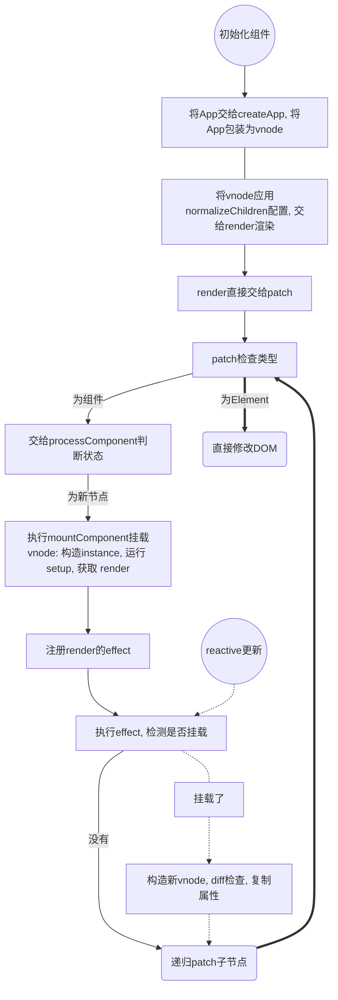

## 总览

### Vue3 的基本结构

采用 Monorepo 模式(多组件放在一个 Repo 中), 在 `/packages/` 中存储所有的模块.

**模块分为几类:**

- 编译时(`/package/compiler-*`)
  - `compiler-core`: 与平台无关的编译器核心
  - `compiler-dom`: 基于 `compiler-core` 解析 `<template>` 标签并编译为 render 函数
  - `compiler-sfc`: 基于 `compiler-dom` 与 `compiler-core` 解析 SFC (单文件组件, 通俗理解就是 `.vue` 文件) 编译为浏览器可执行的 JavaScript
  - `compiler-ssr`: 服务端渲染的编译模块
- 运行时(`/package/runtime-*`)
  - `reactivity`: 实现响应式
  - `runtime-core`: 基于 `reactivity` 实现运行时核心
  - `runtime-dom`: 基于 `runtime-core` 实现针对浏览器的运行时. 包括DOM API, 属性, 事件处理等

- 其他
  - `template-explorer`: 用于调试编译器输出的开发工具
  - `shared`: 多个包之间共享的内容
  - `vue`: 完整版本,包括运行时和编译器


**依赖关系**

```
                                    +---------------------+
                                    |                     |
                                    |  @vue/compiler-sfc  |
                                    |                     |
                                    +-----+--------+------+
                                          |        |
                                          v        v
                      +---------------------+    +----------------------+
                      |                     |    |                      |
        +------------>|  @vue/compiler-dom  +--->|  @vue/compiler-core  |
        |             |                     |    |                      |
   +----+----+        +---------------------+    +----------------------+
   |         |
   |   vue   |
   |         |
   +----+----+        +---------------------+    +----------------------+    +-------------------+
        |             |                     |    |                      |    |                   |
        +------------>|  @vue/runtime-dom   +--->|  @vue/runtime-core   +--->|  @vue/reactivity  |
                      |                     |    |                      |    |                   |
                      +---------------------+    +----------------------+    +-------------------+
```
**学习路线**

根据模块依赖关系, 路线为: `reactivity` -> `runtime-core` -> `runtime-dom` -> `compiler`. 重点是 `runtime-*`

**代码分析步骤**:

1. 查看单元测试(位于`packages/**/__tests__/`)
2. 根据单元测试了解模块实现的功能
3. 跟着单元测试的了解模块功能, 了解模块功能时: 先看导出(模块是什么), 再看模块被谁导入(为什么被需要), 最后看导出部分对应的实现(怎么样实现)

**参考 repo**

- [cuixiaorui/mini-vue](https://github.com/cuixiaorui/mini-vue): 用来学习
- [vuejs/core](https://github.com/vuejs/core): 用来验证

### Reactivity 的基本流程

`Reactivity` 模块是运行时的最底层, 负责实现响应式, 位于: `mini-vue/packages/reactivity`

**`reactive` 的基本流程**

`reactive` 是 `Reactivity` 的基础. 负责实现对象的响应式, 并向上提供调用时方法. 基本思想就是借助 ES6 的 `Proxy` 自定义 `get & set`

1. 转到 `mini-vue/../__tests__/reactive.spec.ts`, 发现测试的主要目的是看 `reactive` 构造方法.

2. 转到 `mini-vue/../src/reactive.ts`, 发现定义了 `reactive`, `readonly` 等方法, 这些方法都交由 `createReactiveObject` 处理.

   观察 `createReactiveObject`, 可以得到三个调用参数意义:

   - `target`: 要被代理的值

   - `proxyMap`: 不同类型的工厂函数有不同的全局 `proxyMap`, 这意味着该变量可能会存储所有代理的某类型变量. 根据

     ```ts
     const existingProxy = proxyMap.get(target);
     if (existingProxy) {
         return existingProxy;
     }
     ```

     可以验证想法, 其在 `createReactiveObject` 的目的就是持久化 `Proxy` 防止重复创建代理

   - `baseHandlers`: 根据

     ```ts
     const proxy = new Proxy(target, baseHandlers);
     ```

     得出该方法就是 Proxy([MDN](https://developer.mozilla.org/zh-CN/docs/Web/JavaScript/Reference/Global_Objects/Proxy)) 的 `get & set` 对象. 不同类型的 Proxy 有不同的 `baseHandlers`

3. 转到 `mini-vue/../src/baseHandlers.ts` 发现模块主要是提供不同的 `get & set` 而这些都是由两个 `create` 函数实现的, 尝试理解

   - `createGetter` 应该返回一个 `handler.get`([MDN](https://developer.mozilla.org/zh-CN/docs/Web/JavaScript/Reference/Global_Objects/Proxy/Proxy/get)) 实现. 可以看到这个函数上有一堆类型判断的方法, 然后做了两步

     - 通过 `Reflect.get`([MDN](https://developer.mozilla.org/zh-CN/docs/Web/JavaScript/Reference/Global_Objects/Reflect/get)) 获取属性
     - 通过 `track` 进行**依赖收集**, 这部分后面再看

     最后返回获取结果. 整个 `get` 感觉和原生方法相比就是多了个类型判断和 `track`, 大部分的响应式都是依赖这个 `track` 实现的

   - `createSetter` 更加简单, 看起来就是在实现 `handler.set`([MDN](https://developer.mozilla.org/zh-CN/docs/Web/JavaScript/Reference/Global_Objects/Proxy/Proxy/set)) 的基础上多了个 `trigger`

   到目前位置这个只有 `track` 和 `trigger` 是不清楚的, 这两个函数在 `effect` 等部分做依赖收集的, 可以先不管. 其他部分就是原生功能调用与权限管理

**`effect` 的基本流程**

如果让我实现 `effect` 我会怎么实现呢? 我先想到的是利用编译原理等魔法对代码做静态分析, 找到所用响应式对象, 在响应式对象的 `set` 上挂上函数. 但是, JavaScript 是个动态语言, 这完全没法挂啊! 只能在运行时动态解析.

Vue 的实现就比较流畅. 既然我 `effect` 要立即执行一遍函数, 那为啥不在执行前后做下 Flag, 一旦 Proxy 的 `get` 被调用, 让 `get` 检查一下是不是在 `effect` 执行阶段, 若是就把函数注册到这个响应式对象上😎

1. 转到 `mini-vue/../__tests__/reactive.spec.ts` 看到 `effect` 的主要功能是立即执行函数并在响应式数据发生改变时, 去执行 `effect` 注册的函数

2. 转到 `mini-vue/../src/effect.ts` 看 `effect` 函数的实现. 看到这里有熟悉的 `effect`, `track`, `trigger`

   1. `effect` 函数将传入函数包装为 `ReactiveEffect` 对象, 合并配置, 执行 `run` 函数, 构造 `runner` 并返回(用于后期调用)

   2. `ReactiveEffect` 类

      - `active`: 根据 `run`, `stop` 函数和测试文件中的 `it("stop")` 断言可以推出其是用来开关 `effect` 功能的
      - `deps`: 根据 `track` 与 `trigger` 对其调用可以判断其是用来记录函数对应依赖的
      - `run`: 对 `effect` 注册函数的包装, 在执行函数前后打入 `shouldTrack` 标记, 并将 `activeEffect` 标记为要执行的 `ReactiveEffect` 好让 `get` 知道哪个 `effect` 在跑

   3. `track` 函数: 在 `reactive` 的 `get` 中调用

      ```typescript
      track(target, "get", key);
      ```

      `track` 发现自己处于 `effect` 阶段时会先检查自己所在对象有没有创建 `attribute` - `effect` 函数heap 的 `map`, 如果每就创建, 然后看 `map` 上有没有记录当前属性, 如果没有, 就建立依赖的 `set` 并交由 `trackEffects` 加入并在 `ReactiveEffect` 上也做记录.

   4. `trigger` 函数: 在 `reactive` 的 `set` 中调用

      先找到对应 `attribute` 的 `effect` 依赖, 去重, 根据配置延迟或立即支持 `effect`

**总结**

- `reactive` 的流程: 传入对象, 持久化, 绑定 `baseHandlers` 做权限管理与依赖收集
- `effect` 的流程: 将传入函数包装为对象, 立即执行函数并做好标记, 在执行时收集依赖. 每当 `reactive` 被调用时就 `tigger` 收集的 `effect`, 并二次收集依赖

**问题**

- 所有的依赖收集都是基于 `get`, 这样的 `effect` 存在问题

  ```js
  it('should observe basic properties', () => {
    let dummy, flag = false;
    const counter = reactive({ num: 0 });
    effect(() => {
      if (!flag) {
        dummy = -1;
      } else {
        dummy = counter.num;
      }
    });

    expect(dummy).toBe(-1);
    flag = true;
    counter.num = 2;
    expect(dummy).toBe(2); // Except 2, Received -1
  });
  ```

  不只是 `mini-vue`, `vue/core` 的单元测试也存在这个问题. 但是在 `Vue` 代码中并不会出现无法追踪依赖的问题, 看来还有一些隐藏的优化没有找到

### Runtime-core 的基本流程

`runtime-core` 依赖 `Reactivity` 为 runtime 提供服务. 可以通过观察 Vue 文件的运行观察 `runtime-core` 的基本流程

**文件基本结构**

1. 转到 `mini-vue/packages/vue/example/helloWorld/` 的文件夹了解 vue 的基本工作流程

2. 转到 `mini-vue/../helloWorld/index.html`, 只有个 `div#root` 和 `script`

3. 转到 `mini-vue/.../helloWorld/main.js`

   ```typescript
   import { createApp } from '../../dist/mini-vue.esm-bundler.js';
   import App from './App.js';

   const rootContainer = document.querySelector('#root');
   createApp(App).mount(rootContainer);
   ```

   引入了创建根组件的 `createApp` 与根组件 `App`, 查找了 html 文件中声明的挂载点, 然后通过 `createApp(App)` 打包根组件再将打包后结果挂载

4. 转到 `mini-vue/../helloWorld/App.js` 发现定义了两个 vue2 风格的组件对象

   ```typescript
   {
     name: 'App', // 组件名
     setup() {}, // setup 方法

     render() { // 渲染方法
       return h('div', { tId: 1 }, [h('p', {}, '主页'), h(HelloWorld)]);
     },
   };
   ```

   - 前面有提到: `compiler-dom` 将 `<template>` 标签解析并编译为 render 函数. 在这里为了不追踪 `compiler-dom` 的行为, 我们直接将 `render` 给出

   - `h` 为渲染函数, 参数分别是: 组件的 `ElementType`, 配置, 子组件数组, 可以看到, 这里第一个子组件是一个 `<p>` 第二个是一个组件

   - 可以在对象中使用 `render`, 也可以让 `setup` 返回 `render` 方法, 即

     ```typescript
     {
       name: 'App',
       setup() {
         return function() {
           return h('div', { tId: 1 }, [h('p', {}, '主页'), h(HelloWorld)]);
         }
       },
     };.
     ```

5. `createApp` 调用关系比较复杂, 直接使用 dev-tools 观察执行过程. 打开一个 http 服务器并转到 dev-tools下, 找到 `createApp.js` 并打下断点

6. `createApp` 方法接受根组件配置对象 `App` 直接包了个对象, 有

   - `_componment = App`
   - `mount` 方法, 看语义, 这个方法接收挂载点, 将根组件创建为 `VNode` 并挂载到挂载点(`main.js` 中的 `rootContainer`), 执行完后 `main.js` 就结束了

   我们需要继续分析的就是 `VNode` 的创建过程与 `render` 的挂载过程

**组件初始化过程**

1. 单步进入 `createVNode` 发现其声明了个 `vnode`.

   将传入对象(`rootComponent / App`) 作为 `vnode.type`

   在 `vnode` 上合并对象并配置 `shapeFlag` 用于标记类型

   之后调用 `normalizeChildren` 并返回对象

   - 进入 `normalizeChildren` 看起来是作了 `slot` 特判

2. 单步进入 `render`, 其接收了处理后的 `vnode` 与挂载点 `rootContainer` 然后将参数直接交给 `patch`, 可以猜到 `patch` 会是一个很通用的函数

   - 单步进入 `patch`, 其接收 `n1 = null`, `n2 = vnode`, `container`.

     解构出了`n2` 的 `type = App` 与 `shapeFlag`,

     通过预定义的 `Symbol` 判断对象类型, 进入 `default`,

     通过位运算判断 `shapeFlag` 类型, 被识别为组件 (而不是像 `h('p', {}, '主页')` 一样的 Element) 执行 `processComponent`

     - 单步进入 `processComponent`,

       函数做了一个判断: 如果没有 `n1` 就认为 `n2` 还没有被挂载就挂载 `n2` 否则更新 `n2`

       - 单步进入 `mountComponent`, 其接收了 `vnode`  与挂载点

         将 `vnode` 转换为实例 `instance`, 执行 `setupComponent` 处理 `instance`

         - 单步进入 `setupComponent` 发现其只是处理了 `prop` 与 `slot` 然后交给 `setupStatefulComponent` 继续配置

           - 单步进入 `setupStatefulComponent`, 其接收 `instance`

             将 `instance.ctx` 配置了 `PublicInstanceProxyHandlers` 代理(后面分析)

             提取 `Component = APP`, `setup = APP.setup`

             如果 `setup` 不存在就直接 `finishComponentSetup`

             否则用 `setCurrentInstance` 打标记, 为 `setup` 传入参数并获取执行结果, 执行 `handleSetupResult` 处理结果

             - 单步进入 `handleSetupResult` 该函数对 `setup` 结果执行判断

               如果是 `function` 说明是导出了 `render` 函数, 将 `render` 赋值到 `instance.render` 上

               否则导出的对象存入 `isntance.setupState`

               最后执行 `finishComponentSetup` 与无 `setup` 的情况汇合

             - 单步进入 `finishComponentSetup` 其接收 `instance`

               若 `instance` 上没有 `render` 就尝试从 `template` 编译结果上获取并存入 `instrance.render`


         - 单步进入 `setupRenderEffect` 发现其定义绑定了一个 `componentUpdateFn` 函数

           - 打断点并进入 `componentUpdateFn` 函数

             如果组件没有被挂载, 获取子节点, 获取 `instance` 的 Proxy, 构建子节点 `subTree` 并递归 `patch`, 当 `patch` 到 Element 时调用 `processElement` 挂载节点

             否则更新节点(后面分析)

**组件更新过程**

为组件创建响应式并将 `reavtive` 导出到全局

```typescript
{
  name: 'HelloWorld',
  setup() {
    const count = ref(10);
    window.count = count;
    return { count };
  },
  render() {
    return h('div', { tId: 'helloWorld' }, `hello world: count: ${this.count}`);
  },
};
```

在 dev-tools 中修改 `count.value` 根据输出来自 `effect.ts` 进入文件并为 `run` 函数打上断点, 再次修改值, 发现 `run` 函数实际上就是执行了当时的 `componentUpdateFn`, 为 `componentUpdateFn` 中已挂载的判断部分打上断点

1.  在断点处查看调用栈, 确定函数就是因为 `ref` 修改而引发的

2. 在执行修改前先判断有没有 `nextTrick` 需要执行

3. 获取新节点的 `vnode`

4. 将老节点子树复制到新节点

5. 触发生命周期函数

6. `patch` 新节点

   单步进入 `patch`, 接受老节点 `n1` 新节点 `n2` 这次更新的是一个 Element 于是进入 `ShapeFlags.ELEMENT`, 进入 `processElement`

   - 单步进入 `processElement`, 这次老节点已经挂载, 直接走更新程序
     - 单步进入 `updateElement` 该函数分别对比了 `props` 与 子节点并更新

7. 触发生命周期函数

**总结**



## 实现 Reactivity

### 环境搭建
